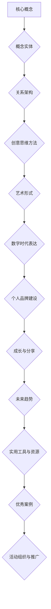

                 

# 生活艺术家养成：将平凡日常转化为创意表达

> 关键词：生活艺术、创意表达、日常实践、个人品牌、数字时代

> 摘要：本文旨在探讨如何在现代生活中，通过创意表达，将平凡的日常转化为富有艺术感的生活艺术。文章从生活艺术的概念出发，逐步深入到创意表达的思维方法、艺术形式和数字时代的应用，最终探讨了个人品牌建设、成长与分享以及生活艺术的未来趋势。通过系统的讲解和实战案例，帮助读者掌握将日常转化为艺术表达的技巧。

## 第一部分：艺术与生活的交织

### 第1章：生活艺术的概念与魅力

#### 1.1 生活艺术的定义与历史背景

生活艺术，顾名思义，是将艺术的理念和技巧应用到日常生活中，使其不仅成为一种生活态度，更成为一种艺术表达。在历史上，生活艺术的概念可以追溯到古希腊时期，当时人们就将美学与生活紧密结合。例如，古希腊哲学家苏格拉底提倡“活出艺术的生活”，强调通过艺术来提升个人的生活品质。

随着时代的发展，生活艺术的内涵和外延也在不断扩展。在现代社会，生活艺术不仅仅是一种装饰或摆设，更是一种生活方式。它涵盖了家庭装饰、服饰搭配、饮食文化、社交礼仪等多个方面，是人们追求高品质生活的一种体现。

#### 1.2 生活艺术与个人成长的关系

生活艺术与个人成长有着密切的关系。通过培养生活艺术，人们可以在日常琐碎中发现生活的美好，提高对美的感知力和创造力。这种感知力和创造力不仅能够丰富个人的内心世界，还能促进个人的全面发展。

首先，生活艺术能够提升个人的审美能力。通过欣赏和创作艺术作品，人们可以逐渐培养出对美的敏感和鉴赏能力。这种能力不仅体现在对艺术品的欣赏上，还能在生活中运用，使日常生活中的点滴都充满艺术感。

其次，生活艺术能够激发个人的创造力。在创作艺术作品的过程中，人们需要不断地思考和尝试，这有助于培养创造力和解决问题的能力。这些能力在个人成长和职业生涯中都具有重要的价值。

#### 1.3 生活艺术在现代社会的意义

在现代社会，生活艺术的意义更加凸显。随着生活节奏的加快，人们往往忽略了生活中的美好。而生活艺术的培养，可以让人们重新发现生活的美好，找到内心的平静和满足。

此外，生活艺术还有助于提高个人的生活质量。通过艺术化的生活方式，人们可以更好地管理时间和精力，使生活更加有序和充实。同时，生活艺术也能够增强个人的幸福感，提升生活的满意度。

总之，生活艺术不仅是一种生活方式，更是一种生活态度。它能够帮助人们发现生活中的美好，提升个人的审美能力和创造力，提高生活质量，增强幸福感。在现代社会，培养生活艺术已成为一种追求美好生活的必备技能。

### 第2章：发现生活中的创意之源

#### 2.1 观察力与感知力的培养

要成为生活中的艺术家，首先需要具备良好的观察力和感知力。观察力是指人们对周围事物的注意力和理解力，而感知力则是指人们对事物感觉和体验的能力。通过培养这两种能力，我们可以更好地发现生活中的创意之源。

首先，观察力的培养需要持续的训练。我们可以从日常生活中的一些小事开始，比如观察自然界的现象、人们的行为举止、建筑物的设计等。通过这些观察，我们可以逐渐提高对细节的关注和理解能力。

例如，我们可以每天花一些时间观察植物的生长过程，记录它们的变化。这样不仅可以让我们更深入地了解自然界的规律，还能激发我们对美的感知力。

其次，感知力的培养需要打开我们的感官。生活中的每一个细节都蕴含着丰富的信息和灵感。通过用心去感受，我们可以发现很多容易被忽视的创意。

例如，我们可以尝试用不同的感官去体验食物。除了味道，我们还可以关注食物的颜色、形状、质感等。这样，我们在烹饪和享用食物时，不仅能品尝到美味，还能感受到其中的艺术美。

总之，通过培养观察力和感知力，我们可以更好地发现生活中的创意之源。这种能力不仅能够丰富我们的生活，还能激发我们的创造力，帮助我们成为生活中的艺术家。

#### 2.2 想象力与创造力的激发

想象力与创造力是生活艺术的两大核心要素。想象力是指人们能够通过心理活动创造出新的形象和概念，而创造力则是指人们能够运用这些想象力，将新形象和概念转化为实际的作品或解决方案。

想象力与创造力的激发，首先需要打破常规思维，勇于尝试新事物。我们可以从以下几个方面进行实践：

1. **跨界学习**：通过学习不同的学科和技能，拓宽我们的知识面，从而激发新的创意。例如，学习音乐、绘画、编程等，都可以帮助我们培养想象力与创造力。

2. **思维训练**：通过脑风暴、思维导图等训练方法，提高我们的思维灵活性和创新力。这些方法可以帮助我们在短时间内产生大量的创意想法，从而激发创造力。

3. **实践操作**：将想象力转化为实际操作，通过动手实践来验证和实现我们的创意。例如，我们可以尝试制作自己的手工艺品，或者设计一个简单的网站，这些实际操作都能帮助我们锻炼想象力与创造力。

想象力与创造力的培养，不仅能提高我们的个人能力，还能为我们的生活带来无限的乐趣和可能性。通过不断激发和运用想象力与创造力，我们可以将平凡的生活转化为充满创意的艺术表达。

#### 2.3 从平凡中寻找不凡

生活中充满了无数平凡的场景，但正是这些平凡中蕴含着无限的不凡。学会从平凡中寻找创意，是每个生活艺术家的必备技能。以下是一些实用的方法：

1. **日常记录**：通过记录日常生活中的点滴，我们可以发现那些被忽视的美好瞬间。这些记录不仅可以帮助我们回忆过去，还能为未来的创意提供灵感。

2. **创意重构**：对现有的物品或场景进行创意重构，可以使其焕发出新的生命力。例如，将普通的瓶子改造成花瓶，或者用旧报纸制作一幅艺术画。

3. **环境改造**：通过改变我们的生活环境，可以创造出新的视觉和感官体验。例如，调整家里的布局、更换窗帘颜色、摆放一些独特的装饰品等。

4. **日常仪式**：为日常生活创造仪式感，可以使其变得更有意义。例如，每天早上起床后进行一段冥想，或者在晚餐后进行一次家庭分享。

通过这些方法，我们可以将平凡的生活转化为充满创意和不凡的艺术表达。学会从平凡中发现美好，是每一个生活艺术家的必修课。

### 第3章：日常生活中的艺术实践

#### 3.1 美学教育在生活中的应用

美学教育在生活中的应用，不仅能够提升我们的审美水平，还能帮助我们在日常生活中更好地运用美学原则，创造和谐、舒适的生活空间。

首先，美学教育教会我们如何欣赏艺术。通过学习艺术史和艺术理论，我们可以更好地理解不同艺术形式的特点和美感。这使我们能够在日常生活中更加敏锐地发现美的事物，并从中汲取灵感。

其次，美学教育帮助我们掌握了美学原则。例如，色彩搭配、形状组合、比例与平衡等，都是美学中的重要概念。通过这些原则，我们可以更好地进行家居装饰、服饰搭配等，使自己的生活环境更加和谐。

此外，美学教育还培养了我们的创造力。在日常生活中，我们可以尝试将所学到的美学知识应用到实际中，进行创意改造和设计。例如，将一些普通的物品进行艺术化的改造，使其焕发出新的生命力。

总之，美学教育在生活中的应用，使我们的日常生活不仅充满美感，还能体现出我们独特的审美品味和创造力。通过不断学习和实践，我们可以将美学原则融入到生活的方方面面，成为真正的“生活艺术家”。

#### 3.2 家庭装饰的艺术改造

家庭装饰的艺术改造，是提升生活艺术的重要一环。通过巧妙地运用色彩、形状和材料，我们可以将平凡的空间转化为富有艺术感的居住环境。

首先，色彩搭配是家庭装饰的关键。选择合适的颜色，可以营造出不同的氛围。例如，暖色调可以营造出温馨舒适的氛围，而冷色调则可以让人感到冷静和放松。在搭配色彩时，我们可以运用对比色和互补色等原则，创造出更加生动和鲜明的视觉效果。

其次，形状组合也是家庭装饰中不可或缺的一部分。通过合理地摆放家具和装饰品，我们可以创造出独特的空间感。例如，将直线和曲线相结合，可以营造出和谐的氛围；而通过大小、高矮、长短不同的物品组合，可以创造出丰富的层次感。

最后，材料的选择也直接影响家庭装饰的艺术效果。不同材料具有不同的质感和纹理，通过巧妙地运用这些材料，我们可以打造出独特的装饰效果。例如，木材、石材、金属等材料都可以在家居装饰中发挥重要作用。

通过这些艺术改造，我们可以将平凡的家庭空间转化为充满艺术感的居住环境。这不仅提升了我们的生活品质，还让我们在日常生活中能够体验到更多的美学乐趣。

#### 3.3 食物的艺术表达

食物的艺术表达，是生活艺术的重要组成部分。通过巧妙的烹饪技巧和创意搭配，我们可以将食物转化为艺术品，不仅提升味觉享受，还能满足视觉需求。

首先，色彩搭配是食物艺术表达的关键。不同颜色的食物不仅丰富了餐桌的视觉效果，还能激发人们的食欲。例如，红、黄、绿等鲜艳的颜色可以吸引人们的注意力，而搭配深色的背景，可以使其更加突出。

其次，形状创意也是食物艺术表达的重要手段。通过切割、雕刻和堆叠，我们可以将食物打造成独特的形状，使其更具观赏性和艺术感。例如，将蔬菜雕刻成花朵形状，或者将水果切割成有趣的图案，都可以为餐桌增添艺术气息。

最后，食材搭配也是食物艺术表达的重要组成部分。通过合理地搭配不同的食材，我们可以创造出丰富的口感和层次感。例如，将不同口感的食材搭配在一起，可以让人在品尝的过程中体验到多种不同的味觉感受。

总之，食物的艺术表达不仅提升了我们的烹饪技巧，还让我们的餐桌变得更加丰富多彩。通过不断尝试和创意，我们可以将食物转化为艺术品，为日常饮食增添无限乐趣。

## 第二部分：创意表达的技巧与工具

### 第4章：创意表达的思维方法

#### 4.1 创意思维的基本策略

创意思维是生活艺术中至关重要的一环。它不仅能够帮助我们发现生活中的美好，还能激发我们的创造力，将平凡的事物转化为富有艺术感的作品。以下是一些创意思维的基本策略：

首先，跨界思维是一种有效的创意策略。通过将不同领域的知识、技能和观点相结合，我们可以创造出全新的概念和作品。例如，将艺术与科技相结合，可以创造出独特的数字艺术作品；将烹饪与艺术相结合，可以创造出美味的艺术菜品。

其次，逆向思维也是创意思维的一种重要方法。通过从相反的角度思考问题，我们可以发现一些全新的解决方案。例如，传统的椅子设计是坐下来休息，而逆向思维可能会创造出一种可以站着使用的椅子，从而带来全新的使用体验。

此外，联想思维也是创意思维中常用的策略。通过将不同的事物进行联想，我们可以激发出新的创意。例如，将雨伞与鸟类进行联想，可能会创造出一种可以像鸟类一样飞翔的雨伞设计。

最后，脑风暴是激发创意思维的有效方法。通过集体讨论和自由联想，我们可以产生大量的创意想法。在脑风暴过程中，不需要对创意进行评价，只需尽情地思考和发散思维。

总之，通过跨界思维、逆向思维、联想思维和脑风暴等基本策略，我们可以有效地激发创意思维，将平凡的生活转化为充满艺术感的生活艺术。

#### 4.2 脑风暴与思维导图的运用

脑风暴和思维导图是激发创意思维的有效工具。脑风暴通过集体讨论和自由联想，可以在短时间内产生大量的创意想法。而思维导图则通过图形化的方式，将这些想法进行组织和管理，使其更加系统和有逻辑。

首先，脑风暴的过程可以分为以下几个步骤：

1. **准备阶段**：选择一个合适的场所，确保参与者能够放松和集中注意力。准备好纸笔或白板，以便记录创意想法。

2. **自由发散**：在指定的时间内，让参与者不受限制地提出自己的想法，无论这些想法是否合理或可行。鼓励每个人尽情地思考，不要对想法进行评价或批评。

3. **整理和筛选**：在脑暴结束之后，将所有提出的想法进行整理和筛选。可以将其分为不同的类别或主题，以便后续的分析和利用。

接下来，思维导图的运用可以帮助我们更好地组织和展示创意想法。思维导图的基本步骤如下：

1. **确定中心主题**：在思维导图的中心绘制一个主题词或符号，表示整个创意的核心。

2. **发散分支**：从中心主题出发，画出不同的分支，每个分支代表一个创意想法或子主题。

3. **细化分支**：在每个分支上，继续画出次级分支，进一步细化创意想法。

4. **添加图像和符号**：使用图像、符号和颜色来丰富思维导图，使其更加直观和具有吸引力。

通过脑风暴和思维导图，我们可以系统地组织和激发创意思维。这不仅有助于我们发现和利用生活中的创意之源，还能提升我们的创造力和创新能力。

#### 4.3 跨界思维的实践

跨界思维是激发创意和创新能力的重要途径。它通过将不同领域的知识、技能和观点相结合，创造出全新的解决方案和艺术表达。以下是一些跨界思维的实践方法：

首先，我们可以通过跨学科学习来拓展我们的知识面。例如，将艺术与科学相结合，可以创造出独特的艺术作品；将烹饪与工程相结合，可以开发出创新的食品加工技术。

其次，跨领域合作是跨界思维的重要手段。通过组建跨领域的团队，我们可以汇集不同领域的专业知识和经验，共同解决问题和创造新作品。例如，设计师、艺术家、工程师和科学家可以共同合作，开发出具有艺术性和功能性的产品。

此外，跨文化交流也是跨界思维的重要实践。通过了解和融入不同的文化，我们可以激发新的创意灵感。例如，将传统中国文化和西方现代艺术相结合，可以创造出独特的艺术作品。

总之，通过跨学科学习、跨领域合作和跨文化交流，我们可以有效地实践跨界思维，激发创意和创新能力。这不仅有助于我们在生活中发现和表达艺术，还能推动社会的进步和发展。

### 第5章：创意表达的艺术形式

#### 5.1 绘画与手工艺

绘画与手工艺是创意表达的经典形式，它们不仅能够培养个人的审美能力和创造力，还能为日常生活增添艺术氛围。

首先，绘画是一种直接表达情感和想法的艺术形式。通过线条、色彩和构图，画家可以传达出内心的情感和观点。无论是油画、水彩还是素描，绘画都为艺术家提供了丰富的表现手法。例如，油画的厚重感和色彩层次感可以营造出独特的视觉效果，而水彩的透明和流畅性则可以表达出柔和的情感。

其次，手工艺则通过手工制作的方式，将创意转化为实际的作品。例如，编织、陶艺、木工和纸艺等手工艺，不仅需要艺术家的创意，还需要精湛的技艺。这些作品往往具有独特的个性和质感，使人们在欣赏的同时感受到手工艺术的魅力。

此外，绘画与手工艺的结合，可以创造出更多元化的艺术形式。例如，画家可以在画作中融入手工艺元素，如将绘画与编织相结合，创造出独特的艺术装置。这样的跨界创作不仅丰富了艺术表达的形式，还能为观众带来全新的视觉体验。

总之，绘画与手工艺是创意表达的重要途径，它们不仅能够提升个人的艺术修养，还能为我们的生活带来无限的艺术乐趣。

#### 5.2 摄影：捕捉生活的瞬间

摄影是一种将瞬间定格的艺术形式，它通过捕捉生活中的美好瞬间，让那些稍纵即逝的美好成为永恒。摄影不仅是一种技术，更是一种表达情感和观念的方式。

首先，摄影需要技巧。摄影师需要掌握光圈、快门速度、焦距等摄影基础知识，以便在不同的光线和场景下捕捉到最佳的效果。例如，使用大光圈可以模糊背景，突出主体，而使用长焦距则可以压缩空间，使画面更加紧凑。

其次，摄影是一种表达方式。通过构图、色彩和光线等手段，摄影师可以传达出内心的情感和观点。例如，强烈的对比和明暗变化可以表达出戏剧性的情感，而柔和的光线和温暖的色彩则可以营造出温馨的氛围。

此外，摄影还可以作为社会记录和历史见证。许多摄影师通过记录社会变迁和个人故事，留下了珍贵的影像资料，为后世提供了宝贵的视觉文献。

总之，摄影不仅是一种技术，更是一种艺术表达。通过捕捉生活的瞬间，摄影为我们的生活带来了无尽的美好和回忆。

#### 5.3 文字与文学创作

文字与文学创作是另一种重要的创意表达形式，它通过语言的力量传达思想和情感。无论是诗歌、散文还是小说，文学创作都能够深刻地触动人心。

首先，文学创作需要丰富的词汇和精湛的语言技巧。通过运用不同的修辞手法和句式结构，作家可以创造出丰富多样的文学风格，使作品更具感染力。例如，比喻、拟人、夸张等修辞手法可以增强语言的生动性和表现力。

其次，文学创作是一种情感表达。通过文字，作家可以传达出内心的情感和体验，让读者产生共鸣。例如，一首诗可以唤起人们对美好回忆的感慨，一篇散文可以表达出对生活的深刻思考。

此外，文学创作还具有社会功能。通过文学作品，作家可以探讨社会问题，反映时代精神，启发读者思考。例如，鲁迅的《呐喊》揭示了社会的黑暗面，激发了人们对社会改革的思考。

总之，文字与文学创作是一种强大的创意表达方式，它不仅能够传达思想和情感，还能影响社会和改变生活。

### 第6章：数字时代的创意表达

#### 6.1 数字艺术的创作工具

在数字时代，各种创作工具的兴起，极大地丰富了创意表达的途径。以下是一些常用的数字艺术创作工具：

首先，Photoshop 是一款功能强大的图像处理软件，它提供了丰富的工具和滤镜，可以帮助艺术家进行图像的编辑、合成和创作。例如，通过使用图层、蒙版和滤镜，艺术家可以创造出独特的视觉效果。

其次，Illustrator 是一款专业的矢量图形设计软件，适用于绘制图标、图形和插图。它的优点是图像可以无限放大而不失真，非常适合制作高分辨率的打印作品。

此外，Blender 是一款开源的三维建模和渲染软件，广泛应用于电影、动画和游戏制作。它提供了丰富的建模、雕刻、动画和渲染工具，使艺术家能够创作出逼真的三维艺术作品。

再者，Adobe Premiere Pro 是一款视频编辑软件，它支持多轨道编辑和特效制作，适用于电影、电视和广告的制作。通过使用它，艺术家可以剪辑视频素材，添加特效和音频，制作出专业的视频作品。

最后，GarageBand 是一款音乐创作软件，适用于音乐制作和音频处理。它提供了丰富的乐器和音频效果，可以帮助音乐人创作和制作音乐作品。

总之，数字艺术的创作工具丰富多样，为艺术家提供了广阔的创作空间。通过熟练掌握这些工具，艺术家可以更加自由地表达自己的创意。

#### 6.2 社交媒体的艺术传播

社交媒体的兴起，为艺术作品的传播提供了新的渠道。通过社交媒体，艺术家可以迅速将作品展示给全球的观众，从而扩大影响力。

首先，Instagram 是一款流行的社交媒体平台，它以其高质量的照片和视频功能，成为艺术家的热门选择。通过发布精美的艺术作品，艺术家可以吸引大量关注者，并迅速获得反馈。

其次，YouTube 是一个强大的视频分享平台，艺术家可以通过上传视频作品，展示自己的创作过程和技巧。这不仅能够吸引粉丝，还能为艺术家带来更多的商业机会。

再者，Pinterest 是一款以图像和灵感为主的社交媒体平台，它为艺术家提供了一个展示创意灵感和设计作品的空间。通过创建自己的灵感板，艺术家可以分享自己的作品，并获取同行的灵感。

此外，Twitter 是一个实时信息分享平台，艺术家可以通过发布简短的消息和链接，及时传播自己的作品和活动。它的高互动性，有助于艺术家与粉丝建立更紧密的联系。

总之，社交媒体为艺术作品的传播提供了新的机遇。通过合理利用这些平台，艺术家可以更有效地推广自己的作品，并与全球观众互动。

#### 6.3 网络艺术的创作与实践

网络艺术，作为一种新兴的艺术形式，正在迅速崛起。它通过互联网平台，将艺术创作与数字技术相结合，创造出独特的艺术体验。

首先，网络艺术的特点是互动性和参与性。艺术家可以通过编程和交互设计，使观众能够直接参与艺术作品的创作和展示。例如，一些网络艺术作品会实时地响应观众的点击和操作，从而改变作品的呈现形式。

其次，网络艺术的创作工具多样。除了传统的绘画和摄影软件，艺术家还可以使用编程语言如Python和JavaScript，创作出动态的、互动的艺术作品。这些工具不仅提供了丰富的创作可能性，还能实现复杂的交互效果。

再者，网络艺术作品的形式多样。从静态的图片和视频，到动态的动画和交互式装置，网络艺术几乎涵盖了所有艺术形式。艺术家可以通过这些形式，创造出独特的视觉和感官体验。

最后，网络艺术具有全球传播的优势。通过互联网，艺术家可以轻松地将作品分享给全球的观众，打破地域和时间的限制。这不仅扩大了艺术作品的影响力，也为艺术家提供了更多的创作和展示机会。

总之，网络艺术作为一种新兴的艺术形式，具有巨大的创作和实践潜力。通过不断探索和创新，艺术家可以在数字时代中创造出更多具有影响力和感染力的艺术作品。

### 第7章：个人品牌建设与传播

#### 7.1 个人品牌的定位与塑造

个人品牌建设是每个生活艺术家在数字时代必须面对的课题。一个清晰且独特的个人品牌定位，可以帮助我们在众多竞争者中脱颖而出，建立自己的影响力和市场地位。

首先，个人品牌的定位需要基于自身的独特性。这包括我们的专业技能、兴趣爱好、个性特点和价值观念。通过深入挖掘和明确这些方面，我们可以找到自己与众不同的标签和优势。

其次，塑造个人品牌需要持续的内容输出。这可以通过社交媒体、博客、视频平台等多种形式来实现。定期发布高质量的内容，不仅可以展示我们的专业能力和创作成果，还能与受众建立稳定的互动关系。

此外，个人品牌的塑造还需要注意以下几点：

1. **一致性**：无论是内容风格还是表达方式，都要保持一致性，使受众能够迅速识别和记住我们。

2. **专业性**：确保内容的专业性和准确性，避免因为错误或误导信息而损害个人品牌的形象。

3. **互动性**：积极与受众互动，回应他们的评论和反馈，建立良好的沟通和信任关系。

通过明确个人品牌的定位和持续的内容输出，我们可以逐步塑造出独特的个人品牌形象，为未来的发展奠定坚实的基础。

#### 7.2 社交媒体的影响力运用

社交媒体已成为个人品牌建设的重要工具。通过巧妙地运用社交媒体平台，我们可以扩大影响力，吸引更多的关注者，并将个人品牌传播到更广泛的受众中。

首先，选择合适的社交媒体平台至关重要。不同的平台有不同的特点和用户群体，我们需要根据个人品牌的定位和目标受众，选择最适合自己的平台。例如，Instagram 和 Pinterest 适合展示视觉艺术作品，而 Twitter 和 LinkedIn 则更适合传达专业知识和行业动态。

其次，制定有效的社交媒体策略是关键。这包括确定发布频率、内容类型和互动方式等。例如，我们可以制定一个固定的发布日程，确保内容输出的连续性和稳定性；同时，通过多样化的内容形式，如图片、视频和文字，来满足不同受众的阅读和观看习惯。

此外，社交媒体的影响力运用还需要注意以下几点：

1. **内容质量**：确保发布的内容具有高质量和专业性，避免发布低质或无价值的信息。

2. **互动与回应**：积极与粉丝互动，回复评论和私信，建立良好的粉丝关系。

3. **数据分析**：定期分析社交媒体的数据报告，了解受众的反馈和兴趣点，优化内容策略。

通过以上策略，我们可以有效地运用社交媒体的影响力，扩大个人品牌的传播范围，提升在目标受众中的影响力。

#### 7.3 个人品牌的长期发展策略

个人品牌的长期发展需要系统的规划和持续的投入。以下是一些有效的长期发展策略：

首先，建立持续的内容输出机制。这可以通过定期发布高质量的博客文章、视频教程、社交媒体更新等形式来实现。持续的内容输出不仅能够保持个人品牌的活跃度，还能不断吸引新粉丝，巩固老粉丝的忠诚度。

其次，积极参与行业活动和专业交流。通过参加行业会议、研讨会、展览等活动，我们可以扩大人脉，提升个人品牌的知名度。同时，与同行和专业机构的交流，可以获取更多的行业信息和资源，为个人品牌的成长提供支持。

此外，不断学习和提升自己的专业技能也是长期发展的重要策略。通过不断学习和实践，我们可以保持专业领先地位，为个人品牌注入持续的竞争力。

最后，定期评估和调整个人品牌策略。通过分析数据和市场反馈，我们可以了解个人品牌的发展状况，及时调整和优化品牌定位、内容策略和传播渠道。

通过这些策略，我们可以确保个人品牌在长期发展中保持稳定和持续的成长，最终实现个人品牌的长期成功。

### 第8章：生活艺术家的成长与分享

#### 8.1 从爱好者到专业艺术家的转变

每个生活艺术家都是从爱好者开始的，但如何从爱好者转变为专业艺术家，却是许多人面临的挑战。以下是一些关键步骤：

首先，明确目标和定位。确定自己想要成为哪种类型的艺术家，是画家、摄影师还是手工艺人。明确目标有助于集中精力和资源，避免盲目尝试。

其次，不断学习和提升技能。无论是通过在线课程、书籍、工作坊还是导师指导，持续学习是成长的关键。通过不断学习，我们可以掌握更多专业知识和技能，提升创作水平。

再者，建立个人品牌和影响力。通过社交媒体、个人网站和参加展览，我们可以展示自己的作品，吸引更多的关注者和粉丝。建立个人品牌不仅有助于提升知名度，还能为未来的商业合作提供机会。

最后，勇于实践和不断挑战自己。只有在实践中，我们才能真正了解自己的优势和不足。通过不断尝试新项目和新形式，我们可以不断突破自己的舒适区，提升艺术创作的深度和广度。

通过这些步骤，我们可以从爱好者逐步成长为专业艺术家，实现个人艺术梦想。

#### 8.2 作品的展示与评价

作品的展示与评价是生活艺术家成长的重要环节。以下是一些实用的建议：

首先，选择合适的展示平台。不同的艺术形式适合不同的展示平台。例如，绘画和摄影作品适合在画廊或艺术展览中展示，而手工艺品则适合在工艺品展览或市集上展示。

其次，精心准备展示作品。在展示之前，我们需要对作品进行精心准备，包括选择最佳的作品、进行适当的修复和保养，以及设计合适的展示方式。例如，画作可以挂在专业的画框里，摄影作品可以打印成高质量的照片。

再者，邀请专业人士和观众进行评价。通过邀请专业的艺术评论家、同行和朋友观看展览，我们可以获得宝贵的反馈和建议。这些评价不仅可以帮助我们了解作品的优点和不足，还能为我们提供改进的方向。

最后，保持开放的心态。无论评价是好是坏，我们都应该保持开放的心态。好的评价可以激励我们继续努力，而差的评价则可以帮助我们发现问题和改进。

通过这些方法，我们可以更好地展示自己的作品，获得有价值的评价，并不断成长。

#### 8.3 生活中的艺术分享与交流

生活中的艺术分享与交流是生活艺术家不可或缺的一部分。通过分享和交流，我们可以学习他人的经验，拓展自己的视野，同时也能让自己的艺术作品得到更广泛的认可。

首先，分享艺术体验。通过个人博客、社交媒体平台或艺术论坛，我们可以分享自己的艺术创作过程、灵感和心得。这种分享不仅能够帮助他人了解我们的艺术追求，还能激发更多人的兴趣和创造力。

其次，参与艺术社区活动。艺术社区提供了交流、学习和展示的平台。通过参与社区的活动，如艺术展览、讲座和工作坊，我们可以结识更多的艺术家，分享彼此的艺术理念和实践经验。

再者，组织或参加艺术分享会。艺术分享会是一个集中展示和讨论艺术作品的平台。通过组织或参加这些活动，我们可以展示自己的作品，听取他人的意见，同时也能为他人提供反馈和建议。

最后，积极参与线上艺术交流。随着互联网的发展，线上艺术交流变得越来越方便和普及。通过在线平台，我们可以与全球的艺术家进行互动，分享作品和经验，甚至合作完成跨地域的艺术项目。

总之，通过分享和交流，我们可以不断提升自己的艺术水平，丰富自己的生活体验，同时也为艺术社区的发展贡献自己的力量。

### 第9章：生活艺术的未来趋势

#### 9.1 数字技术与生活艺术

数字技术在生活艺术中的应用正在不断拓展，为艺术家提供了新的创作工具和表达方式。首先，虚拟现实（VR）和增强现实（AR）技术为艺术家带来了全新的艺术形式。通过VR和AR，艺术家可以创作出沉浸式的艺术体验，让观众在虚拟空间中感受艺术作品的魅力。

其次，人工智能（AI）在生活艺术中的应用也逐渐受到关注。AI可以协助艺术家进行创作，例如通过算法生成艺术作品，或者根据用户反馈调整艺术作品的效果。这种协作不仅提高了创作效率，还能激发出更多创新的灵感。

此外，区块链技术也为生活艺术带来了新的发展机遇。通过区块链，艺术家可以确保作品的版权和所有权，并实现作品的去中心化交易。这不仅保护了艺术家的权益，也为艺术品的收藏和交易提供了新的模式。

总之，数字技术的不断发展，为生活艺术带来了丰富的创作工具和表达方式。通过巧妙地运用这些技术，艺术家可以创造出更加多样化和互动性的艺术作品，为观众带来全新的艺术体验。

#### 9.2 新兴艺术形式的出现

随着社会的发展和技术的进步，新兴艺术形式不断涌现，丰富了生活艺术的内涵。首先，互动艺术成为了一个重要的趋势。通过观众的参与和互动，艺术家可以创造出更加动态和多元的艺术作品，使观众成为艺术体验的一部分。

其次，跨界艺术形式也在不断兴起。艺术家们开始将不同领域的知识和技术融入到艺术创作中，如将艺术与科学、工程、设计等领域相结合，创造出独特的艺术形式。这种跨界不仅拓宽了艺术的表现手法，也为艺术家提供了更多的创作灵感。

此外，数字艺术和多媒体艺术也在迅速发展。通过数字技术和多媒体设备，艺术家可以创造出具有高度互动性和沉浸感的艺术作品，为观众带来全新的视觉和感官体验。

总之，新兴艺术形式的出现，为生活艺术注入了新的活力和创意。通过不断探索和创新，艺术家可以不断突破传统艺术的界限，创造出更多具有时代特色和前瞻性的艺术作品。

#### 9.3 生活艺术与可持续发展的关系

生活艺术与可持续发展之间的关系日益密切。随着全球环境问题的加剧，越来越多的艺术家开始关注生态保护和可持续发展，将环保理念融入艺术创作中。

首先，生态艺术成为了一种新兴的艺术形式。通过在自然环境中创作艺术作品，艺术家可以唤起人们对自然环境的关注和保护意识。例如，大地艺术和景观艺术通过在自然景观中创作大型装置作品，使人们在欣赏艺术的同时感受到自然之美。

其次，可持续材料的使用在生活艺术中越来越普遍。艺术家们开始探索和使用可回收、可降解的环保材料，如废旧物品、天然纤维和生物塑料等，以减少对环境的负面影响。

此外，生活艺术还可以通过倡导环保生活方式，促进可持续发展。例如，通过艺术展览和教育活动，艺术家可以传达环保理念，引导人们采取更加环保的生活习惯。

总之，生活艺术与可持续发展的结合，不仅为艺术创作提供了新的方向和灵感，也为推动社会可持续发展贡献了力量。

### 附录：生活艺术家养成指南

#### 附录1：创意表达的实用工具与资源

1. **Photoshop**：一款功能强大的图像处理软件，适合进行数字艺术创作。
2. **Illustrator**：一款专业的矢量图形设计软件，适用于绘制图标、图形和插图。
3. **Blender**：一款开源的三维建模和渲染软件，适合创作三维艺术作品。
4. **Adobe Premiere Pro**：一款视频编辑软件，适用于电影、电视和广告的制作。
5. **GarageBand**：一款音乐创作软件，适用于音乐制作和音频处理。
6. **Canva**：一款在线设计工具，适合进行平面设计、海报和宣传单的制作。
7. **YouTube**：一个强大的视频分享平台，适合发布视频作品和教程。
8. **Instagram**：一个流行的社交媒体平台，适合展示视觉艺术作品。
9. **Pinterest**：一个以图像和灵感为主的社交媒体平台，适合分享创意和灵感。
10. **Medium**：一个在线写作平台，适合发布文章和博客。

#### 附录2：生活艺术家优秀案例分析与启示

1. **案例：日本艺术家草间弥生**
   - **分析**：草间弥生以其独特的艺术风格和强烈的个人标识而闻名。她通过创作梦幻般、充满幻觉的南瓜和波点作品，成功地将自己推向了国际艺术舞台。
   - **启示**：艺术家需要找到自己独特的风格和主题，并通过不断的创作和推广，建立起自己的品牌和影响力。

2. **案例：美国艺术家杰夫·昆斯**
   - **分析**：杰夫·昆斯是当代艺术界的代表人物之一，以其巨型不锈钢雕塑和气球动物而著称。他的作品在视觉上极具冲击力，同时也引发了人们对社会和文化的深刻思考。
   - **启示**：艺术家可以通过独特的视觉语言和创意，传达自己的观点和思考，从而在艺术界和社会中产生广泛的影响。

3. **案例：中国艺术家蔡国强**
   - **分析**：蔡国强是一位国际知名的火药画家，他的作品通过燃烧的火药产生独特的视觉效果，充满了戏剧性和震撼力。他不仅在艺术创作上有着独特的见解，还在全球范围内推广了中国当代艺术。
   - **启示**：艺术家需要勇于尝试新的材料和技法，不断挑战自己的创作边界，同时也要积极参与国际文化交流，提升自己作品的全球影响力。

#### 附录3：生活艺术活动的组织与推广策略

1. **策划主题艺术活动**
   - 确定活动主题，如“自然之美”、“都市生活”、“数字艺术”等。
   - 设计活动内容，包括展览、讲座、工作坊、表演等。

2. **选择合适的场地**
   - 根据活动主题选择合适的场地，如艺术中心、博物馆、公园等。
   - 确保场地能够容纳活动规模，并提供必要的设施和设备。

3. **宣传与推广**
   - 利用社交媒体平台、网站、电子邮件等渠道进行宣传。
   - 邀请媒体进行报道，增加活动曝光率。
   - 制作宣传资料，如海报、宣传册等，分发到目标受众手中。

4. **邀请艺术家和嘉宾**
   - 邀请知名艺术家和行业专家参加活动，提升活动影响力。
   - 组织者可以与艺术家和嘉宾建立长期合作关系，促进艺术活动的可持续发展。

5. **互动与参与**
   - 设计互动环节，如观众提问、现场创作、体验活动等，增加观众的参与度。
   - 通过互动环节，收集观众反馈，优化活动内容和形式。

6. **后续跟进**
   - 活动结束后，及时整理和发布活动照片、视频和报道，回顾活动成果。
   - 对参与者和合作伙伴表示感谢，维护良好的关系。

通过这些策略，我们可以有效地组织与推广生活艺术活动，吸引更多的参与者，提升活动的知名度和影响力。

# Mermaid 流程图



# 数学模型讲解

$$
f(x) = ax^2 + bx + c
$$

这是一个二次函数的通用公式，其中 $a$、$b$、$c$ 为常数，$x$ 为变量。该公式描述了一个抛物线的形状，$a$ 的值决定了抛物线的开口方向，$a>0$ 时抛物线开口向上，$a<0$ 时抛物线开口向下。$b$ 和 $c$ 则决定了抛物线在坐标系中的位置。

例如，当 $a=1$、$b=-3$、$c=2$ 时，二次函数的表达式为：

$$
f(x) = x^2 - 3x + 2
$$

这个函数的抛物线开口向上，顶点坐标为 $(\frac{3}{2}, -\frac{1}{4})$，与 $x$ 轴的交点为 $(1, 0)$ 和 $(2, 0)$。

# 代码实战

```python
import matplotlib.pyplot as plt
import numpy as np

# 定义二次函数
def f(x):
    a = 1
    b = -3
    c = 2
    return a*x**2 + b*x + c

# 生成 x 值
x = np.linspace(-10, 10, 400)

# 计算 y 值
y = f(x)

# 绘图
plt.plot(x, y, label='Parabola')
plt.title('Quadratic Function')
plt.xlabel('x')
plt.ylabel('f(x)')
plt.legend()
plt.grid(True)
plt.show()
```

上述代码使用 Python 的 `matplotlib` 和 `numpy` 库，定义了一个二次函数，并生成一系列 $x$ 值来计算对应的 $y$ 值。最后，通过 `plt.plot` 函数绘制出抛物线图像，并添加了标题、标签和网格线。

# 代码解读与分析

这段代码首先导入了必要的库，包括 `matplotlib.pyplot` 用于绘图和 `numpy` 用于数值计算。定义了一个名为 `f(x)` 的函数，该函数实现了二次函数的通用公式。通过使用 `numpy.linspace` 函数，我们生成了一个从 -10 到 10 的 $x$ 值序列，包含 400 个点，这个序列用于计算对应的 $y$ 值。

接下来，使用 `plt.plot` 函数绘制出二次函数的图像，并通过 `plt.title`、`plt.xlabel`、`plt.ylabel` 和 `plt.legend` 函数添加了标题、标签和图例。最后，使用 `plt.grid(True)` 函数添加了网格线，并调用 `plt.show()` 函数显示图形。

通过这段代码，我们可以直观地看到二次函数的图像，以及其顶点和与 $x$ 轴的交点。这不仅帮助我们理解二次函数的基本性质，也为进一步研究数学模型和算法提供了实践基础。

## 全书结构总结

本书旨在探讨如何将平凡的生活转化为富有创意的艺术表达，通过系统的讲解和实用的技巧，帮助读者成为生活中的艺术家。全书分为三大部分，共九章，系统地介绍了生活艺术的概念与魅力、发现创意的源泉、日常生活中的艺术实践，以及创意表达的技巧与工具。

### 第一部分：艺术与生活的交织

**第1章：生活艺术的概念与魅力**  
本章介绍了生活艺术的定义与历史背景，探讨了生活艺术与个人成长的关系，并分析了其在现代社会中的意义。通过这些内容，读者可以理解生活艺术的内涵和重要性。

**第2章：发现生活中的创意之源**  
本章从观察力、感知力、想象力和创造力的培养入手，引导读者如何从平凡中发现不凡，激发生活中的创意之源。这些能力的培养不仅能够提升个人的审美和创造力，还能为生活艺术的表达提供源源不断的灵感。

### 第二部分：创意表达的技巧与工具

**第3章：日常生活中的艺术实践**  
本章详细介绍了美学教育在生活中的应用、家庭装饰的艺术改造和食物的艺术表达，通过这些实践，读者可以学习到如何在日常生活中提升艺术感。

**第4章：创意表达的思维方法**  
本章探讨了创意思维的基本策略，包括跨界思维、逆向思维、联想思维和脑风暴等方法。通过这些策略，读者可以更有效地激发创意思维，将日常生活中的灵感转化为具体的艺术表达。

**第5章：创意表达的艺术形式**  
本章介绍了绘画与手工艺、摄影和文字与文学创作等创意表达的艺术形式。这些形式不仅丰富了艺术创作的手段，也为读者提供了多样化的表达途径。

### 第三部分：生活艺术家的养成之路

**第6章：数字时代的创意表达**  
本章介绍了数字艺术的创作工具、社交媒体的艺术传播和网络艺术的创作与实践，展示了数字时代为创意表达带来的新机遇。

**第7章：个人品牌建设与传播**  
本章探讨了个人品牌的定位与塑造、社交媒体的影响力运用和长期发展策略，帮助读者在数字时代建立和传播自己的个人品牌。

**第8章：生活艺术家的成长与分享**  
本章从从爱好者到专业艺术家的转变、作品的展示与评价和生活中的艺术分享与交流三个方面，探讨了生活艺术家成长和发展的路径。

**第9章：生活艺术的未来趋势**  
本章展望了生活艺术的未来趋势，包括数字技术与生活艺术、新兴艺术形式的出现和生活艺术与可持续发展的关系。通过这些趋势，读者可以了解到生活艺术的发展方向和潜在机遇。

附录部分提供了创意表达的实用工具与资源、生活艺术家优秀案例分析与启示，以及生活艺术活动的组织与推广策略，为读者提供了具体的操作指南和参考案例。

综上所述，本书内容丰富、结构清晰，既涵盖了生活艺术的理论基础，又提供了实用的技巧和案例，旨在帮助读者掌握将平凡日常转化为创意表达的方法和技能，成为生活中的艺术家。

# 作者信息

作者：AI天才研究院/AI Genius Institute & 禅与计算机程序设计艺术 /Zen And The Art of Computer Programming

AI天才研究院（AI Genius Institute）是一支致力于人工智能研究与应用的顶级团队，成员包括世界顶级的人工智能专家、程序员和软件架构师。研究院的宗旨是通过科技创新和理论研究，推动人工智能技术的发展和应用。

《禅与计算机程序设计艺术》（Zen And The Art of Computer Programming）是作者在计算机编程领域的杰出作品。该书以其深刻的理论分析和创新的编程思想，被誉为计算机科学领域的经典之作，对全球计算机科学家和程序员产生了深远的影响。作者以其独特的视角和深入浅出的表达，将计算机编程与禅宗哲学相结合，提出了许多有价值的编程方法论和思维模式，深受读者喜爱。

通过本书，作者希望能够将这种深刻的思想和创新的思维方法应用到生活艺术的培养中，帮助读者在日常生活中发现创意、提升审美，成为真正的“生活艺术家”。

