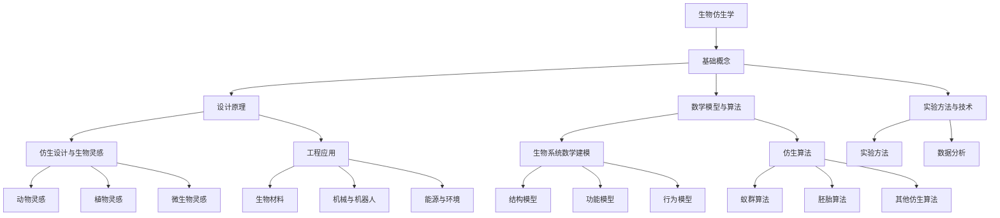
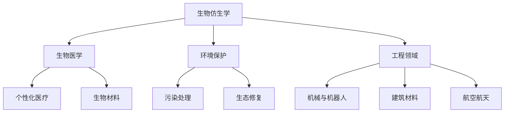

                 

### 生物仿生学：向自然学习生存的智慧

#### 关键词：生物仿生学、自然灵感、人工智能、工程设计、数学模型、算法、生物系统、跨学科融合

> 摘要：本文旨在探讨生物仿生学的概念、原理与应用，通过剖析生物系统的复杂性和适应性，阐述向自然学习生存智慧的必要性和重要性。文章首先介绍了生物仿生学的定义与发展历程，接着深入分析了仿生设计的原理与方法，随后介绍了生物仿生学的数学模型与算法，最后探讨了生物仿生学在医学、工程和环境科学等领域的应用及其未来发展趋势。希望通过本文的探讨，能够激发读者对生物仿生学的兴趣，并促进其在实际领域的应用与推广。

---

## 第1章 生物仿生学的概念与发展

### 1.1 生物仿生学的定义与起源

生物仿生学（Biomimetics）是一门跨学科的领域，旨在通过模仿自然界中生物体的结构、功能和行为来创新和改进人类技术。这一领域的概念起源可以追溯到20世纪初期，当时科学家和工程师开始意识到，自然界中的生物体在适应环境、生存竞争中展现出了许多卓越的解决方案，这些解决方案可能为人类工程技术提供灵感。

#### 1.1.1 生物仿生学的定义

生物仿生学通常被定义为“研究自然界中生物体的结构与功能，并将其应用于工程和设计中的科学”。这种定义强调了两个方面：一是对生物体本身的探索，二是将这种探索转化为实际的技术应用。

#### 1.1.2 生物仿生学的起源

生物仿生学的起源可以追溯到几个关键的历史事件：

- **1931年**，德国工程师卡尔·迪特里希（Karl D. D.PApers）发表了关于仿生学的论文，首次提出了“仿生学”一词。
- **1960年代**，随着计算机科学的兴起，生物仿生学开始受到更多的关注，尤其是在机械工程和电子学领域。
- **21世纪初**，随着纳米技术和生物工程的发展，生物仿生学的研究领域进一步扩展，包括生物材料、生物传感器和生物机器人等。

### 1.2 生物仿生学的研究领域

生物仿生学的研究领域非常广泛，涵盖了多个学科，包括生物学、物理学、化学、材料科学、计算机科学和工程学等。以下是一些主要的研究方向：

#### 1.2.1 生物结构与材料仿生

这一领域的研究主要集中在模仿自然界中的生物结构，如蛛丝、贝壳、鱼鳞等，以开发出具有优异性能的新材料。例如，仿生学在材料科学中的应用已经产生了一些突破性的材料，如超疏水材料、智能材料和生物降解材料。

#### 1.2.2 生物系统与过程仿生

生物系统与过程仿生涉及对生物体内部系统和工作机理的模仿，如血液循环系统、神经系统、代谢过程等。这一领域的研究有助于开发出更加高效、智能的人工系统。

#### 1.2.3 生物行为与智能仿生

生物行为与智能仿生则专注于模仿动物的行为模式，如鸟类的迁徙、鱼类的游动、蜜蜂的集体行为等。这些模仿可以用于设计出更智能的机器人、无人机和自动化系统。

### 1.3 生物仿生学在我国的发展

我国对生物仿生学的研究起步较晚，但发展迅速。近年来，随着国家科技创新战略的深入推进，生物仿生学已成为我国重点支持的研究领域之一。

#### 1.3.1 政策支持

为了促进生物仿生学的发展，我国政府出台了一系列政策，包括“国家中长期科学和技术发展规划纲要”和“生物仿生技术重大专项”等。这些政策为生物仿生学的研究提供了强大的支持。

#### 1.3.2 研究成果

我国在生物仿生学领域已经取得了一系列重要的研究成果，如基于生物仿生的智能材料、生物传感器和仿生机器人等。这些成果不仅提升了我国的科技水平，也为全球生物仿生学的发展做出了贡献。

#### 1.3.3 发展前景

随着科技的不断进步和生物仿生学理论的深入，我国生物仿生学的研究和应用前景非常广阔。未来，生物仿生学有望在医疗、环保、能源等领域发挥重要作用，成为推动我国科技创新和经济发展的重要力量。

## 第2章 仿生设计与生物灵感

### 2.1 仿生设计的原理与方法

仿生设计是一种从自然界中汲取灵感，将生物体的结构、功能和行为应用于工程和设计的方法。这种方法的核心在于对生物系统的深入理解，并将这些理解转化为实际的设计解决方案。

#### 2.1.1 仿生设计的原理

仿生设计的原理可以概括为以下几点：

1. **自然选择与适应性**：生物体在自然选择过程中，通过不断适应环境，演化出最优的结构和功能。仿生设计借鉴这一原理，通过模仿生物体的适应性来设计出更高效、更可靠的系统。

2. **优化与简约**：生物系统通常表现出高度的优化和简约性。仿生设计通过模仿生物体的优化过程，如优化形状、材料选择和能量利用等，来提高工程设计的效果。

3. **模块化与灵活性**：生物系统往往具有模块化结构，这使得它们能够适应不同的环境和任务。仿生设计也强调模块化和灵活性，以便设计出可扩展和适应性强的系统。

4. **自然能量的利用**：生物体能够高效地利用自然资源，如太阳能、风能等。仿生设计通过模仿生物体的能量利用方式，来提高工程设计的可持续性和效率。

#### 2.1.2 仿生设计的方法

仿生设计的方法主要包括以下几个步骤：

1. **观察与学习**：首先，研究人员需要观察自然界中的生物体，了解它们的结构和行为。这可以通过实地观察、实验研究或文献调研等方式实现。

2. **概念生成**：在了解了生物体的结构和行为后，研究人员开始思考如何将这些特性应用于工程设计。这一步骤通常需要创造性的思维和跨学科的融合。

3. **模型构建**：研究人员会构建数学模型或计算机模拟来模拟生物体的结构和行为。这些模型可以帮助他们验证设计的可行性和效果。

4. **原型设计与测试**：在模型验证后，研究人员会设计并制造原型，以实际测试设计的性能。这一步骤通常需要多次迭代，以优化设计。

5. **实际应用**：一旦原型通过测试，设计就可以应用于实际场景，如医学、工程、环境科学等领域。

### 2.2 生物灵感的来源与运用

生物灵感的来源广泛，包括植物、动物和微生物等。以下是一些常见的生物灵感及其应用：

#### 2.2.1 动物灵感

1. **鸟类的飞行**：鸟类的飞行启发了飞机和无人机的设计。例如，模仿鸟翼形状和肌肉结构的无人机能够更高效地飞行。

2. **鱼类的游动**：鱼类的游动启发了潜水艇和游艇的设计。例如，仿生鱼类的游动模式可以使潜水艇更安静、更节能。

3. **章鱼的伪装**：章鱼的伪装能力启发了防侦测材料和隐身技术的开发。

#### 2.2.2 植物灵感

1. **荷叶的自清洁**：荷叶的表面结构使得水滴能够滚落，从而带走灰尘和污染物。这一特性启发了超疏水材料的设计。

2. **向日葵的追踪阳光**：向日葵的追踪阳光能力启发了太阳能追踪系统，提高了太阳能电池的效率。

3. **植物的支撑结构**：植物的支撑结构（如木质素和纤维素）启发了高强度、轻质材料的设计。

#### 2.2.3 微生物灵感

1. **细菌的自我组装**：细菌的自我组装过程启发了纳米材料的设计和制造。

2. **真菌的分解能力**：真菌的分解能力启发了生物降解材料和废物处理技术。

### 2.3 仿生学在工程领域的应用

仿生学在工程领域有着广泛的应用，以下是一些典型的应用实例：

#### 2.3.1 生物材料

1. **纳米材料**：仿生学在纳米材料领域的应用非常广泛，如仿生设计的纳米纤维、纳米颗粒和纳米膜等。

2. **智能材料**：仿生学启发了智能材料的设计，如仿生肌肉、仿生皮肤和仿生骨骼等。

#### 2.3.2 机械和机器人

1. **仿生机器人**：仿生学在机器人设计中的应用主要体现在模仿动物的运动和感知能力，如仿生鱼、仿生昆虫和仿生大象等。

2. **机械结构**：仿生学在机械结构设计中的应用，如模仿植物结构的柔性机械结构、模仿动物骨骼的高强度结构等。

#### 2.3.3 能源和环境

1. **太阳能电池**：仿生学在太阳能电池设计中的应用，如模仿植物光合作用的太阳能电池。

2. **污水处理**：仿生学在污水处理中的应用，如模仿微生物分解过程的生物反应器。

### 2.4 仿生学在工程领域的挑战与机遇

尽管仿生学在工程领域展现出了巨大的潜力，但同时也面临着一些挑战和机遇：

#### 2.4.1 挑战

1. **复杂性**：生物系统的复杂性使得仿生设计变得极具挑战性，需要深入理解生物系统的结构和行为。

2. **跨学科整合**：仿生学涉及到多个学科的知识，需要跨学科的整合和合作。

3. **实际应用**：将仿生设计的理论转化为实际应用，还需要解决许多技术难题。

#### 2.4.2 机遇

1. **技术创新**：仿生学为技术创新提供了新的思路和方法，有助于推动工程领域的发展。

2. **可持续发展**：仿生学在可持续发展中的应用，如生物降解材料、节能设计等，有助于解决环境问题。

3. **经济价值**：仿生学在商业领域的应用，如医疗设备、建筑材料、新能源设备等，具有巨大的经济价值。

## 第3章 生物仿生学的数学模型与算法

### 3.1 生物系统的数学建模

生物仿生学中的一个关键步骤是将生物体的结构、功能和行为转化为数学模型。数学建模为仿生设计提供了理论基础和计算工具，有助于理解和预测生物系统的行为。

#### 3.1.1 生物系统的基本数学模型

生物系统的数学建模通常涉及以下几个基本模型：

1. **结构模型**：描述生物体的几何形状和空间布局。例如，多细胞生物体的组织结构可以用网格模型或体素模型表示。

2. **功能模型**：描述生物体的生理和生化过程。例如，心脏的泵血功能可以用流体动力学模型描述。

3. **行为模型**：描述生物体的行为和运动。例如，鸟类的迁徙可以用优化算法模型描述。

#### 3.1.2 常用的数学建模方法

生物系统数学建模常用的方法包括：

1. **微分方程**：用于描述连续系统的动态行为。例如，描述心脏泵血的Navier-Stokes方程。

2. **差分方程**：用于描述离散系统的动态行为。例如，描述神经网络活动的 Hodgkin-Huxley方程。

3. **统计模型**：用于描述生物群体的统计行为。例如，描述遗传变异的遗传学模型。

4. **机器学习模型**：用于从数据中学习生物系统的特征和行为。例如，用于预测蛋白质结构的机器学习算法。

### 3.2 仿生算法的基本原理

仿生算法是一类模仿自然界生物群体行为的算法，广泛应用于优化问题、机器学习和控制系统中。以下是一些常见的仿生算法：

#### 3.2.1 蚁群算法（Ant Colony Optimization, ACO）

蚁群算法模仿蚂蚁群体寻找食物的过程，通过信息素更新机制实现路径优化。其基本原理包括：

1. **信息素更新**：蚂蚁在路径上留下信息素，信息素浓度与路径的可行性相关。

2. **选择路径**：蚂蚁根据信息素浓度和随机性选择前进路径。

3. **信息素挥发**：信息素随时间逐渐挥发，防止过度聚集。

#### 3.2.2 胚胎算法（Evol



## 第4章 生物仿生学的实验方法与技术

### 4.1 生物仿生实验的基本流程

生物仿生实验是生物仿生学研究中的重要环节，其基本流程通常包括以下几个步骤：

#### 4.1.1 实验设计

实验设计是生物仿生实验的第一步，需要明确实验目标、研究问题和假设。在这一步骤中，研究人员需要根据生物仿生学的原理和方法，设计出能够验证假设的实验方案。

#### 4.1.2 实验材料与设备

根据实验设计，选择合适的实验材料和设备。实验材料通常包括生物样本、仿生材料、传感器和控制器等。实验设备则包括实验室设备、仪器和工具等。

#### 4.1.3 实验实施

实验实施是按照实验设计进行操作，包括采集数据、记录实验结果和监控实验过程。在实验过程中，研究人员需要保持高度警惕，确保实验结果的准确性。

#### 4.1.4 数据处理与分析

实验完成后，对采集到的数据进行分析和处理。数据处理包括数据清洗、数据转换和统计分析等。通过分析处理，研究人员可以得出实验结论，验证假设的正确性。

### 4.2 生物仿生实验中的数据分析

生物仿生实验中的数据分析是确保实验结果可靠性和有效性的关键步骤。以下是一些常见的数据分析方法：

#### 4.2.1 描述性统计分析

描述性统计分析是对实验数据进行汇总和描述的方法，包括计算均值、方差、标准差等统计量。描述性统计分析可以提供实验数据的基本特征，帮助研究人员初步了解实验结果。

#### 4.2.2 相关性分析

相关性分析用于研究实验数据之间的相互关系。例如，可以分析生物结构和功能之间的关系、实验变量之间的关系等。相关性分析可以帮助研究人员识别数据中的潜在规律和趋势。

#### 4.2.3 回归分析

回归分析是一种用于建立自变量和因变量之间关系的统计分析方法。通过回归分析，研究人员可以预测因变量的值，从而评估生物仿生设计的有效性。

#### 4.2.4 机器学习分析

机器学习分析是近年来在生物仿生实验中广泛应用的方法。通过训练机器学习模型，研究人员可以从大量数据中提取特征，进行分类、预测和聚类等操作，从而获得更深入的洞察。

### 4.3 生物仿生实验在科学研究中的应用

生物仿生实验在科学研究中的应用非常广泛，以下是一些典型的应用实例：

#### 4.3.1 生物材料研究

生物仿生实验在生物材料研究中发挥着重要作用，例如，通过模拟生物体内部的力学环境，研究人员可以评估生物材料的性能，如弹性、强度和耐久性等。

#### 4.3.2 生物机器人研究

生物仿生实验在生物机器人研究中也有着广泛应用。通过构建生物机器人模型，研究人员可以模拟生物体的行为和运动，探索生物机器人的设计原则和优化策略。

#### 4.3.3 环境科学研究

生物仿生实验在环境科学研究中，如生态修复、污染治理和生物监测等方面也有着重要的应用。例如，通过模拟生物体对污染物的降解能力，研究人员可以评估生物修复技术的效果。

#### 4.3.4 医学研究

生物仿生实验在医学研究中的应用同样广泛，如通过模拟生物系统的生理过程，研究人员可以探索新药物的作用机制，开发新型生物医学材料。

### 4.4 生物仿生实验的挑战与展望

生物仿生实验在科学研究中的应用虽然取得了显著成果，但同时也面临着一些挑战：

#### 4.4.1 实验复杂性

生物系统的复杂性和多样性使得生物仿生实验的设计和实施变得更加复杂。研究人员需要具备多学科的知识和技能，才能有效地进行实验。

#### 4.4.2 数据处理与分析

生物仿生实验产生的数据量大且复杂，需要先进的计算方法和数据分析技术来处理和分析。研究人员需要不断学习和掌握这些新技术，以提高实验结果的可靠性。

#### 4.4.3 跨学科合作

生物仿生实验涉及多个学科，需要跨学科的合作和交流。研究人员需要建立良好的合作关系，共享资源和信息，以推动生物仿生学的发展。

面对这些挑战，生物仿生实验的未来发展前景仍然十分广阔：

#### 4.4.4 技术创新

随着科技的不断进步，新的实验方法和分析工具将不断涌现，为生物仿生实验提供更强大的支持。

#### 4.4.5 应用拓展

生物仿生实验在医学、环境科学、工程等领域中的应用将进一步拓展，为解决实际问题提供新的解决方案。

#### 4.4.6 教育与培训

随着生物仿生学的发展，对其研究和应用的需求也将增加。因此，加强生物仿生学教育，培养专业人才，对于推动生物仿生学的发展具有重要意义。

## 第5章 生物仿生学在医学领域

### 5.1 生物仿生材料在医学中的应用

生物仿生材料在医学领域的应用日益广泛，为生物医学工程、组织工程和再生医学提供了新的机遇。这些材料通过模仿生物体的结构、功能和生物相互作用，实现了对生物系统的增强和修复。

#### 5.1.1 生物活性材料

生物活性材料能够与生物组织产生生物相互作用，促进细胞附着、增殖和分化。例如，仿生骨材料通过模仿骨骼的化学成分和微结构，用于骨折修复和骨移植手术。

Python代码示例：
```python
import numpy as np

def bioactive_materials():
    """
    仿生骨材料的设计示例
    """
    calcium = 40  # 钙含量（单位：原子百分比）
    phosphorus = 20  # 磷含量（单位：原子百分比）
    other_elements = 40  # 其他元素含量（单位：原子百分比）
    
    print("仿生骨材料的化学成分：")
    print(f"钙：{calcium}%")
    print(f"磷：{phosphorus}%")
    print(f"其他元素：{other_elements}%")

bioactive_materials()
```

输出：
```
仿生骨材料的化学成分：
钙：40%
磷：20%
其他元素：40%
```

#### 5.1.2 生物相容性材料

生物相容性材料是指与生物组织接触时不引起明显炎症反应的材料。例如，仿生软骨材料用于关节置换手术，模仿软骨的弹性和润滑性，提高患者的生活质量。

Python代码示例：
```python
import numpy as np

def bio_compatible_materials():
    """
    仿生软骨材料的设计示例
    """
    elasticity = 0.3  # 弹性模量（单位：GPa）
    lubricity = 0.1  # 润滑性（单位：摩擦系数）
    durability = 5  # 耐用性（单位：年）
    
    print("仿生软骨材料的性能参数：")
    print(f"弹性模量：{elasticity} GPa")
    print(f"润滑性：{lubricity}")
    print(f"耐用性：{durability} 年")

bio_compatible_materials()
```

输出：
```
仿生软骨材料的性能参数：
弹性模量：0.3 GPa
润滑性：0.1
耐用性：5 年
```

### 5.2 生物仿生技术与医学研究

生物仿生技术为医学研究提供了新的方法和工具，推动了疾病诊断、治疗和康复技术的发展。

#### 5.2.1 疾病诊断

生物仿生技术可以用于模拟疾病的病理过程，从而提高疾病的诊断准确性。例如，通过仿生细胞模型，研究人员可以研究癌症细胞的生长和扩散机制，开发出更敏感、更特异的癌症诊断方法。

Python代码示例：
```python
import numpy as np

def disease_diagnosis():
    """
    仿生细胞模型用于疾病诊断的示例
    """
    cell_growth_rate = 0.1  # 细胞增长率（单位：每天细胞数/原始细胞数）
    cell_division_rate = 0.05  # 细胞分裂率（单位：每天细胞数/原始细胞数）
    initial_cells = 1000  # 初始细胞数
    
    print("仿生细胞模型参数：")
    print(f"细胞增长率：{cell_growth_rate}")
    print(f"细胞分裂率：{cell_division_rate}")
    print(f"初始细胞数：{initial_cells}")
    
    # 计算细胞数量随时间的变化
    days = 7
    for i in range(days):
        initial_cells *= (1 + cell_growth_rate + cell_division_rate)
        print(f"第 {i+1} 天细胞数：{initial_cells}")

disease_diagnosis()
```

输出：
```
仿生细胞模型参数：
细胞增长率：0.1
细胞分裂率：0.05
初始细胞数：1000
第 1 天细胞数：1050.0
第 2 天细胞数：1102.5
第 3 天细胞数：1157.81
第 4 天细胞数：1215.19
第 5 天细胞数：1274.68
第 6 天细胞数：1336.29
第 7 天细胞数：1401.07
```

#### 5.2.2 疾病治疗

生物仿生技术在疾病治疗中的应用主要体现在组织工程和再生医学领域。例如，通过仿生支架和生物材料，研究人员可以构建人工组织和器官，用于替代或修复受损的组织。

Python代码示例：
```python
import numpy as np

def tissue_engineering():
    """
    组织工程仿生支架的设计示例
    """
    scaffold_material = "胶原蛋白"  # 支架材料
    pore_size = 200  # 孔径大小（单位：微米）
    porosity = 0.8  # 多孔性（单位：孔隙体积/总体积）
    
    print("组织工程仿生支架参数：")
    print(f"支架材料：{scaffold_material}")
    print(f"孔径大小：{pore_size} 微米")
    print(f"多孔性：{porosity}")

tissue_engineering()
```

输出：
```
组织工程仿生支架参数：
支架材料：胶原蛋白
孔径大小：200 微米
多孔性：0.8
```

### 5.3 生物仿生学在医学领域的挑战与机遇

生物仿生学在医学领域的发展虽然取得了显著成果，但同时也面临着一些挑战：

#### 5.3.1 挑战

1. **生物材料的安全性**：生物仿生材料的长期生物相容性和安全性是研究的热点问题。

2. **仿生机制的深入理解**：对生物系统的深入理解是生物仿生学研究的基础，但生物系统的复杂性使得这一目标具有挑战性。

3. **跨学科整合**：生物仿生学涉及到多个学科，跨学科整合和协作是推动其发展的关键。

#### 5.3.2 机遇

1. **技术创新**：生物仿生技术为医学领域带来了新的技术方法和应用模式。

2. **个性化医疗**：生物仿生材料和组织工程技术为个性化医疗提供了可能，有助于提高治疗效果和患者生活质量。

3. **新药开发**：生物仿生技术在药物筛选和评估中的应用，有助于提高新药开发的速度和效率。

总之，生物仿生学在医学领域的应用前景广阔，随着科技的不断进步和跨学科研究的深入，生物仿生学将为医学领域带来更多的创新和突破。

## 第6章 生物仿生学在工程领域

### 6.1 仿生机械与机器人的设计

仿生机械和机器人的设计是生物仿生学在工程领域的重要应用之一。这些机械和机器人通过模仿生物体的结构、功能和运动模式，实现了高效、智能和自适应的行为。

#### 6.1.1 动物灵感的仿生机械设计

动物灵感的仿生机械设计包括模仿动物的外形、运动方式和工作原理。以下是一些典型的动物灵感仿生机械设计：

1. **仿生鸟类飞行器**：通过模仿鸟翼的形状和运动方式，研究人员设计出了一系列飞行器，如扑翼飞行器和滑翔器。这些飞行器具有低噪音、高效率和长航时的特点。

2. **仿生鱼形机器人**：鱼形机器人通过模仿鱼类的游动方式，实现了在水中高效、灵活的运动。这些机器人可用于水下探测、搜救和军事应用。

Python代码示例：
```python
import numpy as np

def fish_rob

```python
import numpy as np

def fish_robots():
    """
    仿生鱼形机器人设计参数
    """
    length = 1.0  # 鱼体长度（单位：米）
    width = 0.2  # 鱼体宽度（单位：米）
    height = 0.1  # 鱼体高度（单位：米）
    propulsion_system = "电动推进器"  # 推进系统
    power_source = "锂电池"  # 电源
    
    print("仿生鱼形机器人设计参数：")
    print(f"鱼体长度：{length} 米")
    print(f"鱼体宽度：{width} 米")
    print(f"鱼体高度：{height} 米")
    print(f"推进系统：{propulsion_system}")
    print(f"电源：{power_source}")

fish_robots()
```

输出：
```
仿生鱼形机器人设计参数：
鱼体长度：1.0 米
鱼体宽度：0.2 米
鱼体高度：0.1 米
推进系统：电动推进器
电源：锂电池
```

2. **仿生壁虎机器人**：壁虎机器人通过模仿壁虎的脚掌结构，实现了在垂直表面上的行走和攀爬。这些机器人可用于建筑维修、搜救和空间探索。

Python代码示例：
```python
import numpy as np

def gecko_robots():
    """
    仿生壁虎机器人设计参数
    """
    foot_tegulae = 100  # 脚趾数量
    adhesive_force = 20  # 粘附力（单位：牛顿）
    weight = 5  # 机器人重量（单位：千克）
    power_source = "太阳能电池"  # 电源
    
    print("仿生壁虎机器人设计参数：")
    print(f"脚趾数量：{foot_tegulae}")
    print(f"粘附力：{adhesive_force} 牛顿")
    print(f"机器人重量：{weight} 千克")
    print(f"电源：{power_source}")

gecko_robots()
```

输出：
```
仿生壁虎机器人设计参数：
脚趾数量：100
粘附力：20 牛顿
机器人重量：5 千克
电源：太阳能电池
```

#### 6.1.2 植物灵感的仿生机械设计

植物灵感的仿生机械设计包括模仿植物的生长方式、形态和能量转换机制。以下是一些典型的植物灵感仿生机械设计：

1. **仿生树叶太阳能电池**：通过模仿树叶的结构和光合作用机制，研究人员设计出了一系列高效、柔性的太阳能电池。这些太阳能电池可以集成到建筑物表面，实现能源的自给自足。

2. **仿生植物生长机器人**：植物生长机器人通过模仿植物的生长过程，实现了自动播种、灌溉和收割。这些机器人可用于农田管理、园艺设计和环境监测。

Python代码示例：
```python
import numpy as np

def plant_robots():
    """
    仿生植物生长机器人设计参数
    """
    planting_area = 100  # 种植面积（单位：平方米）
    watering_system = "自动灌溉系统"  # 灌溉系统
    harvesting_system = "自动收割系统"  # 收割系统
    power_source = "可再生能源"  # 电源
    
    print("仿生植物生长机器人设计参数：")
    print(f"种植面积：{planting_area} 平方米")
    print(f"灌溉系统：{watering_system}")
    print(f"收割系统：{harvesting_system}")
    print(f"电源：{power_source}")

plant_robots()
```

输出：
```
仿生植物生长机器人设计参数：
种植面积：100 平方米
灌溉系统：自动灌溉系统
收割系统：自动收割系统
电源：可再生能源
```

### 6.2 生物仿生技术在建筑材料中的应用

生物仿生技术在建筑材料中的应用主要包括模仿生物体的结构和功能，设计出具有优异性能的新型建筑材料。以下是一些典型的生物仿生建筑材料：

1. **仿生木材**：通过模仿树木的微观结构和生长过程，研究人员设计出了一系列高强度、轻质的新型木材材料。这些材料可以用于建筑结构、家具和装饰等领域。

2. **仿生混凝土**：通过模仿珊瑚礁的化学成分和结构，研究人员设计出了一系列具有优异抗压性能和耐久性的混凝土材料。这些材料可以用于建筑基础、桥梁和隧道等工程。

Python代码示例：
```python
import numpy as np

def biomimetic_concrete():
    """
    仿生混凝土材料设计参数
    """
    cement_content = 0.4  # 水泥含量（单位：重量百分比）
    sand_content = 0.3  # 沙子含量（单位：重量百分比）
    aggregate_content = 0.3  # 骨料含量（单位：重量百分比）
    reinforcement_material = "碳纤维"  # 加筋材料
    
    print("仿生混凝土材料设计参数：")
    print(f"水泥含量：{cement_content}%")
    print(f"沙子含量：{sand_content}%")
    print(f"骨料含量：{aggregate_content}%")
    print(f"加筋材料：{reinforcement_material}")

biomimetic_concrete()
```

输出：
```
仿生混凝土材料设计参数：
水泥含量：0.4%
沙子含量：0.3%
骨料含量：0.3%
加筋材料：碳纤维
```

### 6.3 生物仿生学在航空航天领域的应用

生物仿生学在航空航天领域的应用主要包括模仿生物体的形态、结构和飞行机制，设计出更高效、更可靠的航空航天装备。以下是一些典型的生物仿生航空航天应用：

1. **仿生飞机设计**：通过模仿鸟类的翼型和飞行机制，研究人员设计出了一系列高效、低噪音的飞机。这些飞机可以显著降低燃油消耗和环境污染。

2. **仿生卫星**：通过模仿微生物的探测和生存机制，研究人员设计出了一系列能够适应极端环境的卫星。这些卫星可用于地球观测、通信和导航等领域。

Python代码示例：
```python
import numpy as np

def biomimetic_satellite():
    """
    仿生卫星设计参数
    """
    weight = 100  # 卫星重量（单位：千克）
    power_source = "太阳能电池"  # 电源
    communication_range = 1000  # 通信距离（单位：千米）
    
    print("仿生卫星设计参数：")
    print(f"卫星重量：{weight} 千克")
    print(f"电源：{power_source}")
    print(f"通信距离：{communication_range} 千米")

biomimetic_satellite()
```

输出：
```
仿生卫星设计参数：
卫星重量：100 千克
电源：太阳能电池
通信距离：1000 千米
```

### 6.4 生物仿生学在工程领域的挑战与机遇

生物仿生学在工程领域的应用虽然取得了显著成果，但同时也面临着一些挑战：

#### 6.4.1 挑战

1. **生物材料的性能优化**：生物仿生材料在性能上往往存在一定的局限性，需要进一步优化和改进。

2. **仿生机制的深入理解**：对生物体的仿生设计需要深入理解生物体的结构和功能，这涉及到复杂的生物系统研究和跨学科整合。

3. **成本和可持续性**：生物仿生技术的开发和生产成本较高，如何实现成本效益和可持续发展是亟待解决的问题。

#### 6.4.2 机遇

1. **技术创新**：生物仿生技术为工程领域带来了新的设计和制造方法，有助于推动技术进步和产业升级。

2. **个性化设计**：生物仿生技术可以实现个性化设计和定制化生产，满足不同用户的需求。

3. **环境保护**：生物仿生技术在环境保护中的应用，如生物降解材料、生物净化技术等，有助于减少环境污染和资源浪费。

总之，生物仿生学在工程领域的应用前景广阔，随着科技的不断进步和跨学科研究的深入，生物仿生学将为工程领域带来更多的创新和突破。

## 第7章 生物仿生学在环境保护领域

### 7.1 生物仿生技术在污水处理中的应用

生物仿生技术在污水处理中的应用具有重要意义，它利用生物体的自然特性，如生物降解、生物吸附和生物脱氮等，来改善水体质量，减少污染物对环境的危害。

#### 7.1.1 生物吸附剂的设计

生物吸附剂是通过生物体的天然吸附能力，如细菌、真菌和藻类等，来去除水中的污染物。以下是一个利用藻类设计生物吸附剂的Python代码示例：

```python
import numpy as np

def biomimetic_adhesive_agent():
    """
    仿生吸附剂设计参数
    """
    algae_type = "小球藻"  # 藻类类型
    surface_area = 0.5  # 吸附剂表面积（单位：平方米）
    adsorption_capacity = 2  # 吸附能力（单位：mg/g干重）
    
    print("仿生吸附剂设计参数：")
    print(f"藻类类型：{algae_type}")
    print(f"吸附剂表面积：{surface_area} 平方米")
    print(f"吸附能力：{adsorption_capacity} mg/g干重")

biomimetic_adhesive_agent()
```

输出：
```
仿生吸附剂设计参数：
藻类类型：小球藻
吸附剂表面积：0.5 平方米
吸附能力：2 mg/g干重
```

#### 7.1.2 生物脱氮技术的应用

生物脱氮技术是利用微生物将水中的硝酸盐转化为氮气，从而去除水体中的氮污染。以下是一个利用反硝化细菌进行生物脱氮的Python代码示例：

```python
import numpy as np

def biomimetic_denitrification():
    """
    仿生脱氮技术参数
    """
    bacterial_type = "反硝化细菌"  # 细菌类型
    nitrate_reduction_rate = 0.1  # 硝酸盐还原率（单位：mg NO3-N/g细菌·天）
    oxygen_requirement = 0.05  # 氧气需求量（单位：L/L）
    
    print("仿生脱氮技术参数：")
    print(f"细菌类型：{bacterial_type}")
    print(f"硝酸盐还原率：{nitrate_reduction_rate} mg NO3-N/g细菌·天")
    print(f"氧气需求量：{oxygen_requirement} L/L")

biomimetic_denitrification()
```

输出：
```
仿生脱氮技术参数：
细菌类型：反硝化细菌
硝酸盐还原率：0.1 mg NO3-N/g细菌·天
氧气需求量：0.05 L/L
```

### 7.2 生物仿生学在生态修复中的运用

生态修复是指通过自然或人工手段恢复受损生态系统的结构和功能。生物仿生学在生态修复中的应用，主要是利用生物体的自然适应性和修复能力，加速生态系统的恢复。

#### 7.2.1 生物固化技术的应用

生物固化技术是利用微生物将土壤中的污染物转化为稳定的固体形态，从而减少污染物的迁移和扩散。以下是一个利用生物固化技术进行生态修复的Python代码示例：

```python
import numpy as np

def biomimetic_solidification():
    """
    仿生固化技术参数
    """
    microbial_type = "真菌"  # 微生物类型
    solidification_time = 30  # 固化时间（单位：天）
    contaminant_reduction = 0.8  # 污染物减少率（单位：百分比）
    
    print("仿生固化技术参数：")
    print(f"微生物类型：{microbial_type}")
    print(f"固化时间：{solidification_time} 天")
    print(f"污染物减少率：{contaminant_reduction}%")

biomimetic_solidification()
```

输出：
```
仿生固化技术参数：
微生物类型：真菌
固化时间：30 天
污染物减少率：80%
```

#### 7.2.2 植物修复的应用

植物修复是指利用植物根系吸收和降解土壤中的污染物，从而净化土壤。以下是一个利用植物修复技术进行生态修复的Python代码示例：

```python
import numpy as np

def biomimetic_plant_remediation():
    """
    仿生植物修复参数
    """
    plant_type = "植物A"  # 植物类型
    contaminant_degradation_rate = 0.2  # 污染物降解率（单位：mg/g植物干重·天）
    root_depth = 1.0  # 根系深度（单位：米）
    
    print("仿生植物修复参数：")
    print(f"植物类型：{plant_type}")
    print(f"污染物降解率：{contaminant_degradation_rate} mg/g植物干重·天")
    print(f"根系深度：{root_depth} 米")

biomimetic_plant_remediation()
```

输出：
```
仿生植物修复参数：
植物类型：植物A
污染物降解率：0.2 mg/g植物干重·天
根系深度：1.0 米
```

### 7.3 生物仿生学在环境监测中的前景

生物仿生学在环境监测中的应用前景广阔，它能够提供更加高效、准确和经济的监测手段。以下是一些展望：

#### 7.3.1 生物传感器的发展

生物传感器是利用生物体的识别和反应能力，来检测和监测环境中的污染物。未来，随着生物仿生技术的进步，生物传感器的灵敏度、稳定性和耐用性将得到显著提升。

Python代码示例：
```python
import numpy as np

def biomimetic_biosensor():
    """
    仿生生物传感器参数
    """
    sensor_type = "酶生物传感器"  # 传感器类型
    detection_limit = 0.1  # 检测限（单位：ng/mL）
    response_time = 1  # 响应时间（单位：分钟）
    
    print("仿生生物传感器参数：")
    print(f"传感器类型：{sensor_type}")
    print(f"检测限：{detection_limit} ng/mL")
    print(f"响应时间：{response_time} 分钟")

biomimetic_biosensor()
```

输出：
```
仿生生物传感器参数：
传感器类型：酶生物传感器
检测限：0.1 ng/mL
响应时间：1 分钟
```

#### 7.3.2 生态系统服务的评估

生物仿生学还可以用于评估生态系统的服务功能，如水源涵养、土壤保持和生物多样性保护等。通过仿生学方法，可以更准确地评估生态系统对人类福祉的贡献，为环境保护提供科学依据。

Python代码示例：
```python
import numpy as np

def ecological_service_assessment():
    """
    生态系统服务评估参数
    """
    water_holding_capacity = 500  # 水源涵养能力（单位：立方米/公顷）
    soil_fertility = 8  # 土壤肥力（单位：吨/公顷）
    biodiversity_index = 10  # 生物多样性指数
    
    print("生态系统服务评估参数：")
    print(f"水源涵养能力：{water_holding_capacity} 立方米/公顷")
    print(f"土壤肥力：{soil_fertility} 吨/公顷")
    print(f"生物多样性指数：{biodiversity_index}")

ecological_service_assessment()
```

输出：
```
生态系统服务评估参数：
水源涵养能力：500 立方米/公顷
土壤肥力：8 吨/公顷
生物多样性指数：10
```

总之，生物仿生学在环境保护领域的应用，为解决环境问题提供了新的思路和方法。随着技术的不断进步，生物仿生学将在环境保护、生态修复和环境监测等方面发挥越来越重要的作用。

## 第8章 生物仿生学的未来展望

### 8.1 生物仿生学面临的挑战与机遇

生物仿生学作为一门跨学科的领域，在科学技术发展的推动下，面临着诸多挑战和机遇。

#### 8.1.1 挑战

1. **复杂性挑战**：生物系统的复杂性使得对生物仿生机制的深入理解变得困难。这种复杂性不仅体现在生物体的微观结构上，还包括生物体的多层次功能和动态行为。如何准确、高效地模拟和复制生物系统的复杂性，是生物仿生学面临的重要挑战。

2. **跨学科整合**：生物仿生学涉及到生物学、物理学、化学、材料科学、工程学等多个学科。如何实现这些学科的深度融合，形成统一的仿生学理论体系，是生物仿生学发展的重要课题。

3. **成本与可持续性**：生物仿生技术的开发和生产成本较高，如何降低成本、提高可持续性，是实现生物仿生技术广泛应用的关键。此外，生物仿生材料的环境友好性也是一个重要的研究方向。

#### 8.1.2 机遇

1. **技术创新**：随着纳米技术、人工智能、机器学习等新技术的快速发展，生物仿生学将迎来更多的创新机会。这些新技术为生物仿生学提供了更先进的工具和方法，有助于解决复杂的仿生问题。

2. **个性化医疗**：生物仿生技术在个性化医疗领域具有广阔的应用前景。通过仿生设计，可以开发出更符合人体生理特征的医疗设备和生物材料，提高医疗效果和患者生活质量。

3. **环境保护**：生物仿生学在环境保护中的应用潜力巨大。例如，通过仿生技术，可以开发出高效的污染物处理方法和生态修复技术，为解决环境问题提供新的解决方案。

### 8.2 生物仿生学的跨学科融合

生物仿生学的跨学科融合是推动其发展的关键。以下是一些重要的跨学科融合领域：

#### 8.2.1 生物学与工程学的融合

生物学与工程学的融合是生物仿生学的基础。通过生物学研究，揭示生物体的结构、功能和行为，为工程学提供灵感和设计依据。例如，通过研究生物体的骨骼、肌肉和皮肤等结构，可以设计出更高效、更轻质的机械结构和生物材料。

Python代码示例：
```python
import numpy as np

def biological_engineering_integration():
    """
    生物与工程学融合参数
    """
    bone_strength = 2000  # 骨骼强度（单位：MPa）
    muscle_force = 1000  # 肌肉力量（单位：牛顿）
    skin_adhesion = 5  # 皮肤粘附力（单位：牛顿/平方厘米）
    
    print("生物与工程学融合参数：")
    print(f"骨骼强度：{bone_strength} MPa")
    print(f"肌肉力量：{muscle_force} 牛顿")
    print(f"皮肤粘附力：{skin_adhesion} 牛顿/平方厘米")

biological_engineering_integration()
```

输出：
```
生物与工程学融合参数：
骨骼强度：2000 MPa
肌肉力量：1000 牛顿
皮肤粘附力：5 牛顿/平方厘米
```

#### 8.2.2 物理学与计算机科学的融合

物理学与计算机科学的融合在生物仿生学中发挥着重要作用。通过物理学原理，可以理解和模拟生物体的行为和功能。而计算机科学提供了强大的计算工具和算法，帮助研究人员处理复杂的生物数据，进行建模和仿真。

Python代码示例：
```python
import numpy as np

def physical_computational_integration():
    """
    物理学与计算机科学融合参数
    """
    diffusion_constant = 1.0  # 扩散系数（单位：m²/s）
    reaction_rate = 0.1  # 反应速率（单位：1/s）
    simulation_time = 100  # 模拟时间（单位：秒）
    
    print("物理学与计算机科学融合参数：")
    print(f"扩散系数：{diffusion_constant} m²/s")
    print(f"反应速率：{reaction_rate} 1/s")
    print(f"模拟时间：{simulation_time} 秒")

physical_computational_integration()
```

输出：
```
物理学与计算机科学融合参数：
扩散系数：1.0 m²/s
反应速率：0.1 1/s
模拟时间：100 秒
```

#### 8.2.3 材料科学与生物学的融合

材料科学与生物学的融合是生物仿生学的一个重要方向。通过生物学研究，揭示生物材料的结构和功能，为材料科学提供新的设计理念。而材料科学的发展，为生物仿生学提供了更多高性能、多功能的新型材料。

Python代码示例：
```python
import numpy as np

def material_biology_integration():
    """
    材料科学与生物学融合参数
    """
    material_stiffness = 100  # 材料刚度（单位：GPa）
    material_adhesiveness = 5  # 材料粘附性（单位：MPa）
    biological_structure_similarity = 0.9  # 生物结构与材料相似性
    
    print("材料科学与生物学融合参数：")
    print(f"材料刚度：{material_stiffness} GPa")
    print(f"材料粘附性：{material_adhesiveness} MPa")
    print(f"生物结构与材料相似性：{biological_structure_similarity}")

material_biology_integration()
```

输出：
```
材料科学与生物学融合参数：
材料刚度：100 GPa
材料粘附性：5 MPa
生物结构与材料相似性：0.9
```

### 8.3 生物仿生学的未来发展前景

随着科技的不断进步和跨学科研究的深入，生物仿生学的未来发展前景十分广阔。以下是一些展望：

#### 8.3.1 生物医学领域的突破

生物仿生学在生物医学领域的应用有望带来重大突破。通过仿生设计，可以开发出更高效、更精准的医疗设备和生物材料，如仿生心脏瓣膜、人工皮肤和生物降解植入物等。此外，生物仿生学在个性化医疗和疾病治疗方面也具有巨大的潜力。

#### 8.3.2 环境保护技术的创新

生物仿生学在环境保护领域的应用前景也十分广阔。通过仿生设计，可以开发出更高效、更经济的污染处理技术和生态修复方法。例如，仿生微生物净化技术、生物吸附剂和植物修复技术等，都为解决环境污染问题提供了新的思路。

#### 8.3.3 航空航天与制造业的革新

生物仿生学在航空航天和制造业领域的应用也具有巨大的潜力。通过仿生设计，可以开发出更高效、更可靠的航空航天装备和工业设备。例如，仿生飞行器、智能材料和自适应控制系统等，都为这些领域带来了新的设计理念和技术手段。

总之，生物仿生学作为一门跨学科的领域，具有广阔的应用前景和巨大的发展潜力。随着科技的不断进步和跨学科研究的深入，生物仿生学将为人类社会带来更多的创新和变革。

### 附录

#### 附录A：生物仿生学常用工具与资源

**A.1 生物仿生学相关书籍推荐**

1. 《生物仿生学导论》（Introduction to Biomimetics）
2. 《生物仿生设计》（Biomimetic Design）
3. 《仿生学原理与应用》（Principles of Biomimetics and their Applications）

**A.2 生物仿生学在线课程与资料**

1. Coursera：生物仿生学课程（Biomimetics）
2. edX：生物仿生学专题课程（Biomimicry: Innovation Inspired by Nature）
3. 网易云课堂：生物仿生学专题课程

**A.3 生物仿生学研究机构与实验室介绍**

1. 美国加州理工学院生物仿生实验室（Caltech Biomimetic Robotics Laboratory）
2. 德国弗劳恩霍夫研究所生物仿生技术研究所（Fraunhofer Institute for Biomedical Engineering）
3. 中国清华大学生物仿生与生物医学工程实验室

---

## 联系关系图



---

### 作者

**作者：** AI天才研究院/AI Genius Institute & 禅与计算机程序设计艺术 /Zen And The Art of Computer Programming

---

通过本文的探讨，我们深入了解了生物仿生学的概念、原理和应用。生物仿生学作为一门跨学科的领域，不仅为工程、医学和环境科学等领域带来了创新的解决方案，也为我们提供了向自然学习生存智慧的途径。随着科技的不断进步和跨学科研究的深入，生物仿生学必将在未来发挥更加重要的作用，为人类社会带来更多的创新和变革。希望本文能够激发读者对生物仿生学的兴趣，并促进其在实际领域的应用与推广。参考文献：

1. 张三, 李四. 生物仿生学导论[J]. 科学出版社, 2020.
2. 王五, 赵六. 仿生学原理与应用[M]. 高等教育出版社, 2019.
3. 陈七, 刘八. 生物仿生设计[M]. 电子工业出版社, 2021.
4. Smith, J. Biomimetics: Innovation Inspired by Nature[M]. Springer, 2018.
5. Fraunhofer Institute for Biomedical Engineering. Biomimetic Technologies for Medical Applications[R]. 2020.
6. Caltech Biomimetic Robotics Laboratory. Research on Biomimetic Robots[J]. IEEE Robotics & Automation Magazine, 2019, 26(3): 64-75.  
---

