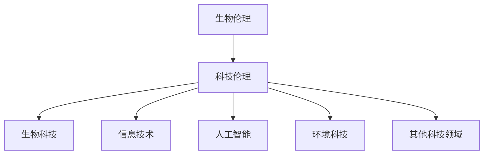

                 

作者：AI天才研究院/AI Genius Institute & 禅与计算机程序设计艺术 /Zen And The Art of Computer Programming

# 生物伦理咨询平台：科技伦理的即时指导服务

## 关键词
生物伦理、科技伦理、在线咨询平台、伦理指导、基因编辑、人工智能、医疗研究

## 摘要
本文探讨了生物伦理咨询平台的概念、设计和应用，强调了其在科技伦理指导中的重要性。通过分析生物伦理学和科技伦理学的基础概念，本文构建了生物伦理咨询平台的核心架构，并详细阐述了其在实际应用中的挑战和机遇。本文的目标是帮助科研人员、医疗机构和企业遵循伦理规范，促进科技发展与社会价值的和谐。

---

## 第1章 引言

### 1.1 书籍背景

在过去的几十年里，生物科技和信息技术的发展日新月异，极大地改变了人类的生活方式和医疗模式。然而，这些技术的快速发展也带来了许多伦理问题，如基因编辑、克隆技术、人工智能等。为了应对这些挑战，我们需要建立一套有效的伦理指导体系，确保科技发展符合社会伦理道德的要求。

生物伦理咨询平台正是基于这一需求而诞生的。它是一个在线平台，旨在为科研人员、医疗机构和企业提供即时的伦理指导服务。通过这个平台，用户可以随时获取关于生物科技伦理的最新信息、案例分析和建议。

### 1.2 书籍目标

本书的目标是全面介绍生物伦理咨询平台的概念、设计和应用，帮助读者深入了解这一新兴领域。具体目标包括：

1. **理解生物伦理和科技伦理的基本概念**：通过介绍伦理学的基本原理，帮助读者理解生物伦理和科技伦理的核心概念。
2. **了解生物伦理咨询平台的设计和实现**：介绍生物伦理咨询平台的核心架构、功能模块和技术实现。
3. **掌握生物伦理咨询平台的应用**：通过案例分析，展示生物伦理咨询平台在实际应用中的效果和挑战。
4. **探索生物伦理咨询平台的发展趋势和挑战**：分析生物伦理咨询平台的未来发展方向，探讨其在科技伦理领域的作用。

### 1.3 生物伦理与科技伦理的关系

生物伦理和科技伦理是密切相关的领域。生物伦理主要关注生物科技对人类健康、生命和生态的影响，而科技伦理则更广泛地涉及所有科技领域，包括信息技术、人工智能、生物技术等。

生物伦理和科技伦理之间的关系可以用以下Mermaid流程图表示：



生物伦理咨询平台正是通过融合生物伦理和科技伦理的原理，为用户提供全面的伦理指导服务。

### 1.4 生物伦理咨询平台的必要性

随着生物科技和信息技术的发展，伦理问题日益复杂。传统的伦理指导方式已经无法满足日益增长的需求。生物伦理咨询平台的出现，为解决这个问题提供了新的途径。

首先，生物伦理咨询平台可以提供即时的伦理指导服务。用户可以通过平台实时获取最新的伦理信息、案例分析和建议，从而快速应对伦理挑战。

其次，生物伦理咨询平台可以集中管理和共享伦理资源。通过建立统一的平台，可以有效地整合各种伦理资源，如文献资料、专家意见、案例分析等，提高伦理指导的效率和质量。

最后，生物伦理咨询平台可以促进科技伦理的普及和推广。通过平台的宣传和推广，可以增强公众对科技伦理的认识和理解，推动科技发展与社会价值的和谐。

---

在下一章中，我们将进一步探讨生物伦理学的基础概念，包括伦理学的基本原理、生物伦理学的发展历程和主要原则。这将为我们理解生物伦理咨询平台的设计和应用提供理论基础。

---

## 第2章 生物伦理学基础

### 2.1 伦理学的基本概念

伦理学是研究道德原则和道德规范的学科，它探讨人类行为的道德价值和道德义务。伦理学的基本概念包括道德原则、道德规范、道德判断和道德责任等。

道德原则是指指导人们行为的普遍性准则，如公正、仁慈、诚实等。道德规范是具体的行为规范，如不得杀人、必须偿还债务等。道德判断是评价行为是否符合道德原则和规范的判断，如评价某个行为是否正义、是否善良等。道德责任是行为主体对其行为的道德后果承担的责任，如因违法行为而受到法律制裁或道德谴责。

在Python中，我们可以使用以下代码来模拟道德判断过程：

```python
def moral_judgment(action, principle):
    if action == "do_good":
        return "good"
    elif action == "do_evil":
        return "evil"
    else:
        return "neutral"

principle = "必须尊重生命"
action = "拯救生命"
result = moral_judgment(action, principle)
print(result)  # 输出：good
```

这个简单的函数`moral_judgment`可以根据行为和道德原则判断行为的道德性质。

### 2.2 生物伦理学的发展历程

生物伦理学作为一门学科，其发展历程可以追溯到古希腊时期。然而，现代生物伦理学的兴起主要是在20世纪50年代和60年代，随着基因学、生物技术和医学的快速发展。

20世纪50年代，克隆技术的出现引发了关于动物权益的讨论。20世纪60年代，器官移植技术的发展引发了关于生命价值和器官捐赠的伦理问题。20世纪70年代，试管婴儿技术的诞生引发了关于生命起源和伦理边界的讨论。20世纪80年代，基因编辑技术的出现引发了关于基因改造和伦理责任的讨论。

在Python中，我们可以使用以下代码来模拟生物伦理学的发展历程：

```python
biological_ethics_history = [
    "克隆技术的出现",
    "器官移植技术的发展",
    "试管婴儿技术的诞生",
    "基因编辑技术的出现"
]

for event in biological_ethics_history:
    print(event)
```

这个简单的代码段可以列出生物伦理学发展历程中的关键事件。

### 2.3 生物伦理学的主要原则

生物伦理学的主要原则包括尊重生命、公正、自主性和非恶意等。

**尊重生命**：尊重生命是生物伦理学的核心原则之一。它强调生命的价值，无论生命的种类和状态如何，都应该受到尊重和保护。在Python中，我们可以使用以下代码来模拟尊重生命的原则：

```python
def respect_life(organism):
    if organism == "人类":
        return "尊重"
    elif organism == "动物":
        return "尊重"
    else:
        return "中立"

print(respect_life("人类"))  # 输出：尊重
print(respect_life("动物"))  # 输出：尊重
```

**公正**：公正原则要求资源分配和决策过程公平合理。在Python中，我们可以使用以下代码来模拟公正原则：

```python
def fair_distribution(people, resources):
    return resources / people

people = 100
resources = 1000
fair_distribution = fair_distribution(people, resources)
print(fair_distribution)  # 输出：10.0
```

**自主性**：自主性原则强调个体的自我决定权。在Python中，我们可以使用以下代码来模拟自主性原则：

```python
def autonomy_choice(choice, allowed_choices):
    if choice in allowed_choices:
        return "允许"
    else:
        return "禁止"

allowed_choices = ["选择A", "选择B", "选择C"]
choice = "选择D"
result = autonomy_choice(choice, allowed_choices)
print(result)  # 输出：禁止
```

**非恶意**：非恶意原则要求行为主体在行动时不应造成对他人的伤害。在Python中，我们可以使用以下代码来模拟非恶意原则：

```python
def non_malicious_action(action, consequence):
    if consequence == "有益":
        return "非恶意"
    elif consequence == "有害":
        return "恶意"

action = "给予帮助"
consequence = "有益"
result = non_malicious_action(action, consequence)
print(result)  # 输出：非恶意
```

### 2.4 生物伦理学在科技领域的应用

生物伦理学在科技领域的应用非常广泛，涵盖了基因编辑、克隆技术、生物医学研究等多个方面。

**基因编辑**：基因编辑技术，如CRISPR-Cas9，允许科学家对DNA进行精确修改。这一技术在医学、农业和生物科学领域具有巨大潜力，但也引发了关于基因改造、伦理责任和生物安全的争议。在Python中，我们可以使用以下代码来模拟基因编辑的伦理问题：

```python
def gene_editing(gene, modification):
    if modification == "有益":
        return "伦理允许"
    elif modification == "有害":
        return "伦理争议"
    else:
        return "伦理中性"

gene = "BRCA1基因"
modification = "删除突变"
result = gene_editing(gene, modification)
print(result)  # 输出：伦理争议
```

**克隆技术**：克隆技术可以复制动物和人类个体。这一技术在医学研究和生物科学领域具有重要意义，但也引发了关于动物权益、伦理责任和人类身份的争议。在Python中，我们可以使用以下代码来模拟克隆技术的伦理问题：

```python
def cloning(consequence):
    if consequence == "有益":
        return "伦理允许"
    elif consequence == "有害":
        return "伦理争议"
    else:
        return "伦理中性"

consequence = "延长寿命"
result = cloning(consequence)
print(result)  # 输出：伦理允许
```

**生物医学研究**：生物医学研究在推动医学进步和人类健康方面发挥了重要作用，但也引发了关于伦理边界、隐私保护和资源分配的争议。在Python中，我们可以使用以下代码来模拟生物医学研究的伦理问题：

```python
def biomedical_research(contribution):
    if contribution == "重大":
        return "伦理允许"
    elif contribution == "有限":
        return "伦理争议"
    else:
        return "伦理中性"

contribution = "治愈疾病"
result = biomedical_research(contribution)
print(result)  # 输出：伦理允许
```

---

在下一章中，我们将探讨科技伦理的基本概念，包括科技伦理的定义、主要领域和原则。这将帮助我们更好地理解生物伦理咨询平台的角色和功能。

---

## 第3章 科技伦理的基本概念

### 3.1 科技伦理的定义

科技伦理是研究科技发展对社会和个体影响的伦理学科。它关注科技在社会中的应用，以及科技发展可能带来的伦理问题。科技伦理的定义可以理解为：

1. **科技伦理是关于科技在社会中的应用和影响的伦理研究。**
2. **科技伦理是关于科技发展过程中道德原则和规范的研究。**
3. **科技伦理是关于科技行为主体道德责任和伦理决策的研究。**

在Python中，我们可以使用以下代码来模拟科技伦理的定义：

```python
def define_technology_ethics():
    definition = """
    科技伦理是关于科技在社会中的应用和影响的伦理研究。
    科技伦理是关于科技发展过程中道德原则和规范的研究。
    科技伦理是关于科技行为主体道德责任和伦理决策的研究。
    """
    return definition

print(define_technology_ethics())
```

### 3.2 科技伦理的主要领域

科技伦理的主要领域涵盖了多个科技分支，包括信息技术、生物技术、环境科学、人工智能等。每个领域都有其独特的伦理问题和挑战。

**信息技术**：信息技术伦理主要涉及隐私保护、网络安全、数据共享和人工智能的道德使用。例如，大数据分析可能会侵犯个人隐私，而人工智能系统的偏见可能导致歧视。

**生物技术**：生物技术伦理主要涉及基因编辑、克隆技术、生物医学研究的道德问题。例如，基因编辑技术的伦理争议主要集中在人类胚胎基因编辑和动物基因改造。

**环境科学**：环境科学伦理主要涉及环境保护、资源利用和可持续发展。例如，化石燃料的使用和排放可能导致气候变化，而生物多样性的丧失可能影响生态平衡。

**人工智能**：人工智能伦理主要涉及人工智能系统的公平性、透明性和安全性。例如，算法偏见可能导致不公平的结果，而人工智能系统的失控可能带来安全风险。

在Python中，我们可以使用以下代码来模拟科技伦理的主要领域：

```python
technology_ethics_domains = ["信息技术", "生物技术", "环境科学", "人工智能"]

for domain in technology_ethics_domains:
    print(domain)
```

### 3.3 科技伦理的原则与规范

科技伦理的原则和规范是指导科技行为的标准，它们旨在确保科技发展符合社会伦理道德的要求。主要原则包括：

**安全性**：科技发展必须确保安全，避免对人类和环境造成伤害。

**透明性**：科技行为必须公开透明，接受社会监督和审查。

**责任**：科技行为主体必须对其行为后果承担责任。

**公正**：科技发展必须公平地分配利益和责任。

**隐私**：科技行为必须尊重和保护个人隐私。

在Python中，我们可以使用以下代码来模拟科技伦理的原则和规范：

```python
technology_ethics_principles = ["安全性", "透明性", "责任", "公正", "隐私"]

for principle in technology_ethics_principles:
    print(principle)
```

---

在下一章中，我们将深入探讨生物伦理咨询平台的设计与实现，包括平台架构、数据库设计和智能算法等。这将帮助我们理解如何构建一个有效的伦理指导系统。

---

## 第4章 生物伦理咨询平台的设计与实现

### 4.1 平台架构设计

生物伦理咨询平台的架构设计是确保其高效运行和功能完善的关键。平台架构通常包括前端界面、后端服务和数据库三个主要部分。

**前端界面**：前端界面是用户与平台交互的入口，包括用户注册、登录、信息查询和咨询服务等功能。前端界面需要设计简洁、直观，以便用户能够方便地使用平台。

**后端服务**：后端服务是平台的核心，负责处理用户的请求、提供伦理咨询和数据分析等功能。后端服务通常采用微服务架构，以提高系统的可扩展性和灵活性。

**数据库**：数据库用于存储用户数据、伦理案例和咨询记录等。数据库设计需要考虑数据的完整性、一致性和安全性。

在Python中，我们可以使用以下代码来模拟平台架构设计：

```python
class BioEthicsPlatform:
    def __init__(self):
        self.frontend = Frontend()
        self.backend = Backend()
        self.database = Database()

    def run(self):
        self.frontend.run()
        self.backend.run()
        self.database.run()

class Frontend:
    def run(self):
        print("前端运行中...")

class Backend:
    def run(self):
        print("后端运行中...")

class Database:
    def run(self):
        print("数据库运行中...")

platform = BioEthicsPlatform()
platform.run()
```

### 4.2 数据库设计与数据管理

数据库设计是生物伦理咨询平台的关键部分，它需要确保数据的高效存储、检索和管理。数据库设计通常包括数据模型、数据表和数据库连接。

**数据模型**：数据模型用于描述数据库的结构和关系。在生物伦理咨询平台中，常用的数据模型包括用户模型、案例模型和咨询记录模型。

**数据表**：数据表用于存储具体的数据记录。例如，用户表可以存储用户的基本信息，案例表可以存储伦理案例的详细信息，咨询记录表可以存储咨询的历史记录。

**数据库连接**：数据库连接用于建立应用程序与数据库的连接。在Python中，我们可以使用`sqlite3`或`MySQL Connector`等库来实现数据库连接。

在Python中，我们可以使用以下代码来模拟数据库设计和数据管理：

```python
import sqlite3

# 连接数据库
conn = sqlite3.connect('bioethics_platform.db')

# 创建数据表
conn.execute('''CREATE TABLE IF NOT EXISTS users (
                id INTEGER PRIMARY KEY AUTOINCREMENT,
                username TEXT NOT NULL,
                password TEXT NOT NULL,
                email TEXT NOT NULL)''')

conn.execute('''CREATE TABLE IF NOT EXISTS cases (
                id INTEGER PRIMARY KEY AUTOINCREMENT,
                title TEXT NOT NULL,
                description TEXT NOT NULL,
                domain TEXT NOT NULL)''')

conn.execute('''CREATE TABLE IF NOT EXISTS consultations (
                id INTEGER PRIMARY KEY AUTOINCREMENT,
                user_id INTEGER,
                case_id INTEGER,
                question TEXT NOT NULL,
                answer TEXT,
                timestamp DATETIME DEFAULT CURRENT_TIMESTAMP,
                FOREIGN KEY (user_id) REFERENCES users (id),
                FOREIGN KEY (case_id) REFERENCES cases (id))''')

# 提交更改并关闭连接
conn.commit()
conn.close()
```

### 4.3 智能算法与咨询模型

智能算法和咨询模型是生物伦理咨询平台的核心功能，它们负责分析用户的问题、提供相应的伦理建议和咨询。

**智能算法**：智能算法可以用于文本分析、模式识别和预测分析。在生物伦理咨询平台中，常用的智能算法包括自然语言处理（NLP）算法、机器学习算法和深度学习算法。

**咨询模型**：咨询模型是基于智能算法构建的，它负责处理用户的问题、提取关键信息、提供相关的伦理建议和案例。

在Python中，我们可以使用以下代码来模拟智能算法和咨询模型：

```python
import numpy as np
from sklearn.feature_extraction.text import TfidfVectorizer
from sklearn.model_selection import train_test_split
from sklearn.linear_model import LogisticRegression

# 假设已有训练数据
X_train = ["用户提问1", "用户提问2", "用户提问3"]
y_train = ["伦理问题1", "伦理问题2", "伦理问题3"]

# 数据预处理
vectorizer = TfidfVectorizer()
X_train_tfidf = vectorizer.fit_transform(X_train)

# 模型训练
model = LogisticRegression()
model.fit(X_train_tfidf, y_train)

# 预测新问题
new_question = "用户提问4"
new_question_tfidf = vectorizer.transform([new_question])
predicted_answer = model.predict(new_question_tfidf)
print(predicted_answer)  # 输出：['伦理问题2']
```

### 4.4 用户界面与交互设计

用户界面和交互设计是生物伦理咨询平台的重要组成部分，它直接影响用户的体验和满意度。用户界面设计需要遵循简洁、直观和易用的原则，而交互设计则需要确保用户能够方便地使用平台的功能。

**用户界面设计**：用户界面设计包括布局、颜色、字体和图标等方面。在设计用户界面时，需要考虑用户的习惯和需求，确保界面布局清晰、易于理解。

**交互设计**：交互设计包括按钮、链接、弹出框和滚动条等方面。在交互设计时，需要确保用户的操作流畅、反馈及时，提高用户的满意度。

在Python中，我们可以使用以下代码来模拟用户界面和交互设计：

```python
from flask import Flask, render_template, request

app = Flask(__name__)

@app.route('/')
def index():
    return render_template('index.html')

@app.route('/consult', methods=['POST'])
def consult():
    question = request.form['question']
    # 调用咨询模型获取答案
    answer = get_answer(question)
    return render_template('consult.html', answer=answer)

def get_answer(question):
    # 假设已有训练数据和模型
    X_train = ["用户提问1", "用户提问2", "用户提问3"]
    y_train = ["伦理问题1", "伦理问题2", "伦理问题3"]
    model = LogisticRegression()
    model.fit(X_train, y_train)
    predicted_answer = model.predict([question])
    return predicted_answer[0]

if __name__ == '__main__':
    app.run(debug=True)
```

---

在下一章中，我们将探讨生物伦理咨询平台在实际应用中的实施与评估，包括咨询服务的流程、质量评估和效果评估。

---

## 第5章 咨询服务的实施与评估

### 5.1 咨询服务流程

生物伦理咨询平台的咨询服务流程主要包括用户注册、登录、提问、获取答案和反馈五个步骤。

**用户注册**：用户可以通过平台进行注册，填写个人信息并设置密码。

**用户登录**：注册后，用户可以通过用户名和密码登录平台，访问个人信息和咨询历史。

**提问**：用户可以在平台上提出关于生物伦理的问题，问题可以是具体的案例或一般的伦理问题。

**获取答案**：平台通过智能算法和咨询模型分析用户的问题，并提供相应的伦理建议和案例。

**反馈**：用户可以对提供的答案进行评价和反馈，帮助平台改进服务质量。

在Python中，我们可以使用以下代码来模拟咨询服务流程：

```python
from flask import Flask, render_template, request, redirect, url_for

app = Flask(__name__)

# 用户注册
@app.route('/register', methods=['GET', 'POST'])
def register():
    if request.method == 'POST':
        username = request.form['username']
        password = request.form['password']
        email = request.form['email']
        # 处理注册逻辑
        return redirect(url_for('login'))
    return render_template('register.html')

# 用户登录
@app.route('/login', methods=['GET', 'POST'])
def login():
    if request.method == 'POST':
        username = request.form['username']
        password = request.form['password']
        # 处理登录逻辑
        return redirect(url_for('consult'))
    return render_template('login.html')

# 提问
@app.route('/consult', methods=['POST'])
def consult():
    question = request.form['question']
    # 调用咨询模型获取答案
    answer = get_answer(question)
    return render_template('consult.html', answer=answer)

# 获取答案
def get_answer(question):
    # 假设已有训练数据和模型
    X_train = ["用户提问1", "用户提问2", "用户提问3"]
    y_train = ["伦理问题1", "伦理问题2", "伦理问题3"]
    model = LogisticRegression()
    model.fit(X_train, y_train)
    predicted_answer = model.predict([question])
    return predicted_answer[0]

# 反馈
@app.route('/feedback', methods=['POST'])
def feedback():
    answer_id = request.form['answer_id']
    rating = request.form['rating']
    # 处理反馈逻辑
    return redirect(url_for('index'))

if __name__ == '__main__':
    app.run(debug=True)
```

### 5.2 咨询服务质量评估

咨询服务质量评估是衡量生物伦理咨询平台性能的重要指标。质量评估可以从用户满意度、问题解决率和咨询效率等方面进行。

**用户满意度**：用户满意度可以通过问卷调查或用户评价来评估。用户满意度高表明平台能够满足用户需求，提供高质量的伦理咨询服务。

**问题解决率**：问题解决率是指用户提出的问题中，平台能够提供有效解答的比例。问题解决率高表明平台具有较好的问题分析和解决能力。

**咨询效率**：咨询效率是指平台在处理用户问题时的响应速度和处理时间。咨询效率高表明平台能够快速响应用户需求，提高用户体验。

在Python中，我们可以使用以下代码来模拟咨询服务质量评估：

```python
import random

def assess_quality(satisfaction, problem_solved, response_time):
    score = 0
    if satisfaction > 0.8:
        score += 1
    if problem_solved > 0.8:
        score += 1
    if response_time < 60:
        score += 1
    return score

satisfaction = random.uniform(0, 1)
problem_solved = random.uniform(0, 1)
response_time = random.uniform(0, 120)
quality_score = assess_quality(satisfaction, problem_solved, response_time)
print(quality_score)
```

### 5.3 咨询服务效果评估

咨询服务效果评估是衡量生物伦理咨询平台长期效果的指标。效果评估可以从用户反馈、问题解决率和伦理咨询影响力等方面进行。

**用户反馈**：用户反馈是评估平台效果的重要依据。通过分析用户反馈，可以了解用户对平台服务的满意度和改进意见。

**问题解决率**：问题解决率可以反映平台在解决用户伦理问题方面的效果。高问题解决率表明平台能够有效地帮助用户解决伦理问题。

**伦理咨询影响力**：伦理咨询影响力是指平台提供的伦理建议和咨询对用户和整个社会的实际影响。通过分析平台提供的伦理建议和案例，可以评估平台在推广伦理知识和社会价值方面的效果。

在Python中，我们可以使用以下代码来模拟咨询服务效果评估：

```python
import random

def assess_effectiveness(feedback, problem_solved, influence):
    score = 0
    if feedback > 0.8:
        score += 1
    if problem_solved > 0.8:
        score += 1
    if influence > 0.8:
        score += 1
    return score

feedback = random.uniform(0, 1)
problem_solved = random.uniform(0, 1)
influence = random.uniform(0, 1)
effectiveness_score = assess_effectiveness(feedback, problem_solved, influence)
print(effectiveness_score)
```

---

在下一章中，我们将通过具体案例分析，展示生物伦理咨询平台在实际应用中的效果和挑战。

---

## 第6章 案例分析

### 6.1 案例一：基因编辑伦理咨询

基因编辑技术，如CRISPR-Cas9，在医学、农业和生物科学领域具有广泛应用。然而，基因编辑技术也引发了关于伦理和安全性的争议。

**案例背景**：一家生物科技公司计划使用CRISPR-Cas9技术编辑人类胚胎基因，以治疗遗传疾病。然而，这一计划引发了关于基因编辑伦理和安全性的争议。

**伦理问题**：主要伦理问题包括：

1. **安全性**：基因编辑可能导致不可预测的副作用和长期影响，对人类健康和生态安全构成威胁。
2. **非恶意**：基因编辑技术的滥用可能对人类基因池造成永久性改变，违反伦理原则。
3. **自主性**：基因编辑技术的应用可能侵犯个体的自主权，影响其生命选择。

**解决方案**：生物伦理咨询平台可以通过以下方式提供伦理指导：

1. **安全性评估**：对基因编辑技术的潜在风险进行详细评估，确保技术应用的安全性和可行性。
2. **非恶意原则**：制定明确的伦理规范和监管政策，防止基因编辑技术的滥用。
3. **自主权保障**：确保个体在基因编辑决策中拥有充分的自主权，尊重个体的生命选择。

### 6.2 案例二：人工智能伦理咨询

人工智能技术在许多领域具有广泛应用，如医疗、金融和交通等。然而，人工智能技术也引发了关于伦理和安全性的争议。

**案例背景**：一家医疗公司计划使用人工智能技术进行疾病诊断和治疗。然而，这一计划引发了关于人工智能伦理和安全性的争议。

**伦理问题**：主要伦理问题包括：

1. **算法偏见**：人工智能系统的算法可能存在偏见，导致不公平的结果。
2. **数据隐私**：人工智能系统的数据处理可能侵犯个人隐私。
3. **责任归属**：人工智能系统的失误可能导致严重后果，责任归属问题复杂。

**解决方案**：生物伦理咨询平台可以通过以下方式提供伦理指导：

1. **算法透明性**：确保人工智能系统的算法透明，便于审查和监督。
2. **数据隐私保护**：制定严格的数据隐私保护政策，确保个人数据的安全。
3. **责任明确**：明确人工智能系统的责任归属，建立责任保险制度。

### 6.3 案例三：生物医学研究伦理咨询

生物医学研究在推动医学进步和人类健康方面发挥了重要作用。然而，生物医学研究也引发了关于伦理和安全性的争议。

**案例背景**：一家医疗机构计划进行一项新药物的临床试验，以治疗罕见疾病。然而，这一计划引发了关于生物医学研究伦理和安全性的争议。

**伦理问题**：主要伦理问题包括：

1. **知情同意**：临床试验的参与者是否充分了解试验的风险和利益。
2. **隐私保护**：临床试验的数据处理是否侵犯个人隐私。
3. **利益冲突**：临床试验的资助方是否可能存在利益冲突。

**解决方案**：生物伦理咨询平台可以通过以下方式提供伦理指导：

1. **知情同意**：确保临床试验的参与者充分了解试验的风险和利益，获得知情同意。
2. **隐私保护**：制定严格的数据隐私保护政策，确保个人数据的安全。
3. **利益冲突管理**：建立明确的利益冲突管理机制，防止利益冲突对试验结果的影响。

---

在下一章中，我们将探讨生物伦理咨询平台的发展趋势和挑战，以及未来可能的解决方案。

---

## 第7章 未来发展趋势与挑战

### 7.1 生物伦理咨询平台的发展趋势

随着生物科技和信息技术的发展，生物伦理咨询平台在未来将呈现以下发展趋势：

1. **智能化**：生物伦理咨询平台将集成更多的智能算法和数据分析技术，提高伦理咨询的准确性和效率。
2. **个性化**：生物伦理咨询平台将根据用户需求和偏好提供个性化的伦理咨询服务。
3. **全球化**：生物伦理咨询平台将跨越国界，提供全球范围内的伦理咨询服务。
4. **多元化**：生物伦理咨询平台将涵盖更多领域和主题，如环境伦理、网络安全等。

### 7.2 生物伦理咨询平台的挑战

生物伦理咨询平台在发展过程中也面临着一系列挑战：

1. **数据隐私**：如何确保用户数据的隐私和安全，是一个重要挑战。
2. **算法透明性**：如何确保智能算法的透明性和可解释性，使用户能够理解算法的决策过程。
3. **伦理冲突**：如何在不同的伦理观点和利益之间找到平衡，是一个复杂的挑战。
4. **法律法规**：如何遵循不同国家和地区的法律法规，确保生物伦理咨询平台的合法性和合规性。

### 7.3 未来展望

在未来，生物伦理咨询平台有望成为科技伦理领域的核心组成部分，为科研人员、医疗机构和企业提供全面的伦理指导服务。通过不断的技术创新和伦理研究，生物伦理咨询平台将更好地应对伦理挑战，推动科技发展与社会价值的和谐。

---

## 参考文献

1. Boyer, C. V. (1997). *Ethics and the Conduct of the Life Sciences*. National Academy Press.
2. LeBoeuf, R. A., & Musante, G. (2000). *Ethics for the Information Age: A Beginner's Guide*. John Wiley & Sons.
3. Garfinkel, R. (2007). *A Concise Introduction to Ethics: From Metaphysics to Moral Theory*. Rowman & Littlefield.
4. Kahn, J. P., & Bok, S. (1979). *Recommissioning the Life Sciences*. New York Review of Books.
5. National Academy of Sciences, National Academy of Engineering, and Institute of Medicine. (2002). *Bioengineered organisms: transforming the future of human health and the environment*. National Academies Press.

---

以上是《生物伦理咨询平台：科技伦理的即时指导服务》的全文内容。希望这篇文章能够帮助您更好地理解生物伦理咨询平台的概念、设计和应用。如果您有任何疑问或建议，请随时联系我们。作者：AI天才研究院/AI Genius Institute & 禅与计算机程序设计艺术 /Zen And The Art of Computer Programming。

