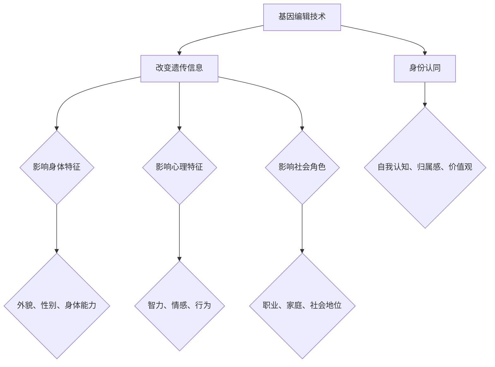

                 

----------------------------------------------------------------

## 生物印记：基因编辑与身份认同

### 关键词
- 生物印记
- 基因编辑
- 身份认同
- 伦理学
- 法律框架
- 科技与社会

### 摘要
随着基因编辑技术的迅猛发展，人类对生命本质的理解和掌控能力日益增强。然而，这一技术不仅带来了巨大的医疗和科学进步，同时也引发了关于身份认同的深刻思考。本文旨在探讨基因编辑如何影响个体的身份认同，从生物学、伦理学和社会学等多个角度进行分析，并提出相关法律和社会框架的探讨，以及未来可能面临的挑战。

### 引言
基因编辑，作为一种革命性的生物技术，使我们能够修改生物体的遗传信息，从而改变其性状和行为。CRISPR/Cas9技术的出现，使得基因编辑变得高效且经济，引发了医学、农业和生物技术等多个领域的革新。然而，随着基因编辑技术的普及，人们开始思考这一技术对人类身份认同的潜在影响。身份认同是个体对自身独特性和社会角色的认知，它涉及生物学、心理学和社会文化等多个层面。基因编辑技术可能改变个体的身体特征、心理特征和社会角色，从而影响其身份认同。因此，深入研究基因编辑与身份认同之间的关系，对于理解人类未来发展的方向具有重要意义。

### 1. 基因编辑技术基础
基因编辑技术的基础是分子生物学，具体包括DNA的结构、基因的表达调控机制以及遗传变异的概念。以下是对CRISPR/Cas9技术以及其他基因编辑方法的详细讲解。

#### 1.1 DNA的结构与基因表达
DNA（脱氧核糖核酸）是生物体的遗传物质，由四种不同的核苷酸（腺嘌呤、胸腺嘧啶、胞嘧啶和鸟嘌呤）组成。基因是DNA上的特定序列，它们编码蛋白质，蛋白质是生命活动的基础。基因表达是指基因的遗传信息被转录成RNA，并进一步翻译成蛋白质的过程。

#### 1.2 CRISPR/Cas9技术
CRISPR（Clustered Regularly Interspaced Short Palindromic Repeats）是细菌和古细菌中的一种防御系统，用于抵抗外来遗传物质，如病毒的DNA。CRISPR系统包含一段重复的DNA序列和一系列短的spacer DNA序列，这些spacer序列来源于之前侵入的病毒或质粒。Cas9是CRISPR系统中的效应蛋白，它能够识别并剪切特定的DNA序列。

CRISPR/Cas9技术的基本步骤如下：
1. **设计引导RNA（gRNA）**：根据目标基因序列设计特定的gRNA。
2. **合成gRNA**：在实验室中合成gRNA。
3. **与Cas9蛋白结合**：gRNA与Cas9蛋白结合形成复合体。
4. **识别并剪切目标DNA**：复合体识别并结合到目标DNA序列上，通过Cas9蛋白的核酸酶活性剪切DNA。
5. **DNA修复与基因编辑**：细胞通过非同源末端连接（NHEJ）或同源重组（HR）机制修复DNA断裂，从而实现基因编辑。

#### 1.3 其他基因编辑方法
除了CRISPR/Cas9技术，还有其他几种基因编辑方法，如TALEN、ZFN和基

### 2. 身份认同的概念
身份认同是个体对自己身份的认知和感知，它包括个人的身体特征、心理特征、社会角色和价值观等多个方面。身份认同的形成受到生物学、心理学和社会文化等多重因素的影响。

#### 2.1 身份认同的定义
身份认同可以被视为个体对自己身份的内在感知和认知，它涉及到以下几个方面：
1. **身体特征**：包括外貌、性别、种族和身体能力等。
2. **心理特征**：包括性格、情感和认知能力等。
3. **社会角色**：包括家庭角色、职业角色和社会角色等。
4. **价值观和信仰**：包括个人的价值观、信仰和道德观念等。

#### 2.2 身份认同的类型
身份认同可以按照不同的维度进行分类：
1. **个体身份认同**：关注个体自身的独特性和独立性，强调个人的自我认知和自我实现。
2. **集体身份认同**：关注个体所属的群体，如家庭、种族、民族或国家，强调个体与群体的联系和归属感。
3. **多重身份认同**：个体可能同时具有多个身份认同，这些身份认同在不同的情境中可能会发生变化或相互影响。

#### 2.3 身份认同的发展过程
身份认同的形成是一个动态的过程，通常经历以下几个阶段：
1. **探索期**：个体开始探索自己的身份认同，尝试理解自己的身体特征、心理特征和社会角色。
2. **形成期**：个体逐渐明确自己的身份认同，形成对自身的认知和感知。
3. **稳定期**：个体对自己的身份认同有稳定的认知，并在生活中表现出相应的行为和价值观。

#### 2.4 身份认同与社会
身份认同不仅是个体的内在感知，也受到社会环境和文化的强烈影响。社会环境和文化背景会影响个体对自身身份的认知，以及个体在社会中的角色和地位。例如，种族、宗教、文化和社会制度等因素都会影响个体的身份认同。

### 3. 基因编辑对身份认同的影响
基因编辑技术的出现，使得人类能够对遗传信息进行精确修改，这直接影响到个体的身体特征、心理特征和社会角色，从而对身份认同产生潜在影响。

#### 3.1 基因编辑对个体身体特征的影响
基因编辑可以直接改变个体的身体特征，如外貌、性别和身体能力等。例如，通过基因编辑可以修改导致遗传疾病的突变基因，从而改善个体的健康状况。然而，这种改变也可能带来身份认同的困扰，个体可能会对自己的外貌产生疑问，不确定这是否是他们真正的自我。

#### 3.2 基因编辑对个体心理特征的影响
基因编辑可能影响个体的心理特征，如智力、情感和行为等。例如，通过基因编辑可以提高个体的智力水平，但这可能导致个体对自己的智力水平产生误解，甚至影响他们的自尊心。此外，基因编辑可能影响个体的情感反应和行为模式，这可能会对他们的社交关系和身份认同产生负面影响。

#### 3.3 基因编辑对个体社会角色的影响
基因编辑可以改变个体的社会角色，如职业、家庭角色和社会地位等。例如，通过基因编辑可以提高个体的运动能力，使他们成为优秀的运动员。然而，这可能导致个体在社会中的角色发生变化，他们可能需要适应新的角色和社会期望，从而影响他们的身份认同。

#### 3.4 案例研究：基因编辑对身份认同的影响实例分析
以下是一个关于基因编辑对身份认同影响的具体案例：

案例：一位名叫艾米的女性在年轻时被诊断出患有罕见的遗传性疾病，这种疾病会导致她未来的孩子面临高风险。为了确保下一代健康，艾米决定接受基因编辑手术，通过CRISPR/Cas9技术去除致病基因。

结果：艾米成功地诞下一个健康的婴儿，但在抚养孩子的过程中，艾米开始担心孩子对自己基因编辑的事实感到困惑。孩子长大后，艾米逐渐发现孩子在面对身体特征和健康问题时，会产生一些疑问。这些问题不仅影响了孩子的自信心，也使艾米开始反思自己对基因编辑的决定。

### 4. 基因编辑与伦理学
基因编辑技术的进步带来了伦理学的挑战，涉及隐私、公平、人类尊严等多个方面。

#### 4.1 隐私
基因编辑涉及到个体的遗传信息，这些信息可能被视为隐私。未经个体同意，基因编辑可能导致隐私泄露，从而引发隐私权的问题。此外，基因编辑的信息可能被用于非医疗目的，如保险、就业或犯罪调查，这也带来了隐私的担忧。

#### 4.2 公平
基因编辑技术可能加剧社会不平等，因为它可能使某些人能够获得更好的健康和生活质量，而其他人则无法享受同样的待遇。这种不平等可能导致社会分裂和道德困境。

#### 4.3 人类尊严
基因编辑可能影响人类尊严，因为它改变了人类遗传信息的自然过程。一些人可能会认为，通过基因编辑来改变人类基因是不道德的，因为这与自然进化过程相违背。

#### 4.4 伦理学原则与基因编辑
为了解决基因编辑带来的伦理挑战，需要遵循一系列伦理学原则，如自主性、公正性、尊重和保护隐私等。这些原则为基因编辑的伦理决策提供了指导。

### 5. 社会影响与法律框架
基因编辑技术的发展对社会产生了深远的影响，这需要法律框架来规范和指导。

#### 5.1 社会对基因编辑的态度
不同社会和文化对基因编辑的态度有所不同。一些社会可能接受基因编辑，认为它是一种进步，而另一些社会可能持怀疑态度，担心伦理和社会问题。

#### 5.2 基因编辑的法律框架
各国和地区需要建立相应的法律框架来规范基因编辑技术。这包括基因编辑的伦理审查、隐私保护、知识产权和责任归属等方面。

#### 5.3 法律与伦理的平衡
法律和伦理在基因编辑中需要达到平衡，以确保技术的合理使用和保护个体的权益。例如，可以通过伦理审查来确保基因编辑项目的道德性，同时通过法律来规范基因编辑的应用和责任。

### 6. 未来展望与挑战
基因编辑技术的未来充满了希望和挑战。

#### 6.1 基因编辑技术的发展趋势
基因编辑技术将继续发展，可能带来更高效、更安全的基因编辑方法。此外，随着技术的普及，基因编辑的应用领域也将不断扩大，包括医学、农业和生物技术等。

#### 6.2 基因编辑技术的挑战
基因编辑技术面临的挑战包括伦理问题、社会接受度、技术和成本等。例如，如何确保基因编辑的安全性和有效性，以及如何处理可能产生的伦理和社会问题。

#### 6.3 未来社会的身份认同
随着基因编辑技术的普及，未来社会的身份认同可能会发生变化。个体可能需要重新审视自己的身份认同，适应新的生物技术和社会环境。

### 结论
基因编辑技术为人类带来了巨大的医疗和科学进步，但同时也引发了关于身份认同的深刻思考。本文从多个角度探讨了基因编辑对身份认同的影响，提出了相关的伦理学和法律框架问题，并对未来进行了展望。随着基因编辑技术的不断发展，我们需要持续关注它对人类身份认同的影响，并寻找合适的解决方案。

### 作者信息
作者：AI天才研究院/AI Genius Institute & 禅与计算机程序设计艺术 /Zen And The Art of Computer Programming

### 附录
附录中可以包括以下内容：
- 参考文献
- Mermaid 流程图
- Python源代码示例
- 数学公式列表

[Mermaid 流程图示例]



[Python源代码示例]

```python
# 基因编辑模拟示例
import random

def edit_gene(gene_sequence, edit_site):
    # 假设编辑位点为替换一个核苷酸
    new_sequence = gene_sequence[:edit_site] + random.choice(['A', 'T', 'C', 'G']) + gene_sequence[edit_site + 1:]
    return new_sequence

# 初始基因序列
original_gene = "ATCGATCGATCG"

# 随机选择编辑位点
edit_site = random.randint(0, len(original_gene) - 1)

# 编辑基因序列
edited_gene = edit_gene(original_gene, edit_site)

print("原始基因序列:", original_gene)
print("编辑位点:", edit_site)
print("编辑后基因序列:", edited_gene)
```

[Mathematical Formulas]

$$
1 + 1 = 2
$$

$$
\text{Fitness} = \frac{\text{Survival Rate}}{\text{Population Size}}
$$

### 最佳实践 Tips
- 在进行基因编辑时，应确保充分了解技术原理和潜在风险。
- 伦理审查是基因编辑项目不可或缺的一环，确保项目符合道德标准。
- 保护隐私和信息安全，避免未经授权的基因信息泄露。
- 加强社会教育，提高公众对基因编辑技术的认识和理解。

### 小结
基因编辑技术对身份认同的影响是一个复杂且多维的问题。通过本文的探讨，我们希望读者能够对这一领域有更深入的了解，并认识到基因编辑技术在社会和个人层面带来的挑战。在未来的发展中，我们需要平衡技术创新与伦理考量，共同构建一个更加公平和和谐的生物科技未来。

