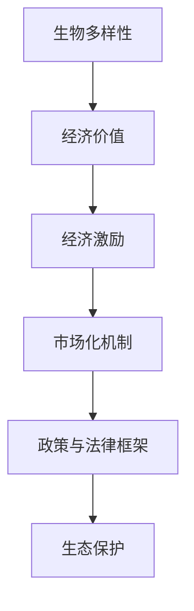

                 

### 生物多样性经济激励的概念与联系

生物多样性（Biodiversity）是指地球上生命体系的多样性，包括生物物种的多样性、遗传多样性和生态系统多样性。经济激励（Economic Incentive）则是指通过经济手段鼓励或激励个人、企业或组织从事某种行为或决策。在生态保护中，市场化机制（Market-based Mechanisms）是一种利用市场力量来实现环境保护和经济发展的工具。

生物多样性经济激励的概念与联系可以通过一个架构图来清晰地展示：



1. **生物多样性**：生物多样性是生态系统的基本特征，对人类的生存和发展具有重要价值。它包括三个层次：物种多样性、遗传多样性和生态系统多样性。

2. **经济价值**：生物多样性对经济活动的贡献非常重要，包括直接经济价值（如食物、药物）和间接经济价值（如生态服务）。这些价值可以转化为经济激励。

3. **经济激励**：经济激励是通过提供经济利益来鼓励个人、企业或组织从事有利于生物多样性的活动。例如，通过奖励保护物种或生态系统的行为。

4. **市场化机制**：市场化机制是利用市场力量来实现生态保护和经济发展的一种工具。例如，通过生态系统服务市场和碳交易市场，可以激励企业和个人参与生态保护。

5. **政策与法律框架**：政策与法律框架为市场化机制提供法律和政策支持，确保其有效实施。例如，通过制定法律法规，可以规范市场行为，促进生态保护。

6. **生态保护**：生态保护是生物多样性经济激励的最终目标。通过市场化机制和经济激励，可以鼓励更多人参与生态保护，从而实现生物多样性的可持续利用。

这个架构图展示了生物多样性经济激励的核心概念及其相互联系。生物多样性通过其经济价值产生经济激励，市场化机制通过市场力量实现生态保护，而政策与法律框架则为市场化机制提供支持。通过这样的机制，可以有效地保护和利用生物多样性，实现生态与经济的双赢。# 生物多样性经济激励的数学模型和数学公式

在生物多样性经济激励中，数学模型和数学公式是理解和评估市场化机制效果的重要工具。以下是一些关键数学模型和公式的解释与应用。

## 1. 资源交易市场的供需模型

资源交易市场的供需模型用于分析生物多样性保护产品的供需情况。假设市场上存在一种生物多样性保护产品，如碳排放权或生态系统服务。

### 1.1 供需函数

供需函数描述了价格与需求或供应量之间的关系。假设需求函数为 \( D(p) \)，供应函数为 \( S(p) \)，其中 \( p \) 为价格。

$$
D(p) = a - bp
$$

$$
S(p) = c + dp
$$

其中，\( a \) 和 \( c \) 为常数，\( b \) 和 \( d \) 为价格敏感度系数。

### 1.2 市场均衡

市场均衡发生在需求量等于供应量的价格水平。设市场均衡价格为 \( p^* \)，则：

$$
D(p^*) = S(p^*)
$$

将供需函数代入上述等式，解得市场均衡价格：

$$
a - bp^* = c + dp^*
$$

$$
p^* = \frac{a - c}{b + d}
$$

## 2. 经济激励机制的效用分析

经济激励机制的效用分析主要关注经济激励对行为主体的影响。假设行为主体在面临经济激励时，其效用函数可以表示为：

$$
U = U(I, C)
$$

其中，\( I \) 为经济激励，\( C \) 为成本。行为主体的决策目标是最大化其总效用。

### 2.1 效用最大化问题

行为主体的效用最大化问题可以表示为：

$$
\max U(I, C)
$$

其中，约束条件为 \( C \leq I \)。

### 2.2 洛伦兹曲线

洛伦兹曲线（Lorenz Curve）用于描述收入或财富的分配情况。在生物多样性经济激励中，洛伦兹曲线可以用来分析经济激励的公平性。

设 \( x \) 为收入或财富的累积比例，\( y \) 为人口比例，则洛伦兹曲线的公式为：

$$
y = \frac{1}{n} \sum_{i=1}^{n} (1 - F_i)
$$

其中，\( F_i \) 为第 \( i \) 个收入或财富水平的累积比例，\( n \) 为总人口数。

## 3. 市场化机制的成本-效益分析

市场化机制的成本-效益分析主要关注市场化机制的投入与产出。成本-效益分析可以使用以下公式：

$$
\text{成本-效益比} = \frac{\text{总成本}}{\text{总效益}}
$$

其中，总成本包括直接成本和间接成本，总效益包括直接效益和间接效益。

### 3.1 直接成本和直接效益

直接成本和直接效益与市场化机制直接相关。例如，在生态系统服务市场中，直接成本可能包括生态系统服务提供者的运营成本，直接效益可能包括生态系统服务提供者的收益。

$$
\text{直接成本} = \sum_{i=1}^{n} C_i
$$

$$
\text{直接效益} = \sum_{i=1}^{n} B_i
$$

### 3.2 间接成本和间接效益

间接成本和间接效益与市场化机制的间接影响相关。例如，在碳交易市场中，间接成本可能包括由于碳交易引起的市场波动，间接效益可能包括减少温室气体排放的效果。

$$
\text{间接成本} = \sum_{i=1}^{n} I_i
$$

$$
\text{间接效益} = \sum_{i=1}^{n} J_i
$$

通过这些数学模型和公式，可以更准确地分析生物多样性经济激励的市场化机制，为生态保护提供有效的决策支持。接下来，我们将结合Python源代码，进一步探讨生物多样性经济激励的具体实现和案例分析。# 生物多样性经济激励的Python实现

为了更深入地理解生物多样性经济激励的概念和数学模型，我们将使用Python来编写相应的代码。以下是一个简单的示例，展示了如何使用Python来模拟资源交易市场的供需模型。

### 示例：资源交易市场的供需模型

```python
import numpy as np

# 参数设置
a = 100  # 需求函数的常数项
b = 5    # 需求函数的价格敏感度系数
c = 50   # 供应函数的常数项
d = 2    # 供应函数的价格敏感度系数

# 需求函数
def demand_function(p):
    return a - b * p

# 供应函数
def supply_function(p):
    return c + d * p

# 市场均衡求解
def find_equilibrium():
    while True:
        p = np.random.uniform(0, 100)  # 随机生成价格
        if demand_function(p) == supply_function(p):
            return p  # 返回市场均衡价格
        else:
            continue

# 求解市场均衡价格
equilibrium_price = find_equilibrium()
print(f"市场均衡价格: {equilibrium_price}")

# 模拟市场价格波动
price_range = np.linspace(0, 100, 1000)
demand_curve = demand_function(price_range)
supply_curve = supply_function(price_range)

# 绘制供需曲线
import matplotlib.pyplot as plt

plt.plot(price_range, demand_curve, label="需求曲线")
plt.plot(price_range, supply_curve, label="供应曲线")
plt.scatter(equilibrium_price, demand_function(equilibrium_price), color="red", label="市场均衡点")
plt.xlabel("价格")
plt.ylabel("数量")
plt.title("资源交易市场的供需模型")
plt.legend()
plt.show()
```

### 代码解析

1. **参数设置**：我们设置了需求函数和供应函数的参数 \( a \)、\( b \)、\( c \) 和 \( d \)。

2. **需求函数和供应函数**：`demand_function` 和 `supply_function` 分别用于计算给定价格下的需求量和供应量。

3. **市场均衡求解**：`find_equilibrium` 函数通过随机生成价格并检查供需是否相等来求解市场均衡价格。这个函数使用了一个简单的循环，直到找到均衡价格。

4. **模拟市场价格波动**：我们使用 `numpy.linspace` 创建一个价格范围，并计算需求曲线和供应曲线。这些曲线可以帮助我们可视化市场均衡情况。

5. **绘制供需曲线**：使用 `matplotlib.pyplot` 绘制供需曲线，并标记市场均衡点。

### 结果分析

运行上述代码后，我们得到一个市场均衡价格和相应的供需曲线。从供需曲线可以看出，当价格低于市场均衡点时，需求量大于供应量，价格上升；当价格高于市场均衡点时，供应量大于需求量，价格下降。市场均衡点是供需平衡的价格水平。

通过这样的Python实现，我们可以更好地理解生物多样性经济激励的供需关系和市场均衡原理。在实际应用中，这些模型和代码可以帮助政策制定者、企业和个人做出更科学的决策，促进生态保护和可持续发展。# 生物多样性经济激励的实证研究

为了更好地理解生物多样性经济激励的实际效果，我们将通过国内外的一些实证研究来分析这些激励机制的应用和成效。

### 1. 国外案例分析

#### 1.1 美国的碳交易市场

美国的碳交易市场是一个典型的市场化机制，用于减少温室气体排放。美国加利福尼亚州的碳交易市场（California Cap-and-Trade Program）是全球最早的碳交易市场之一，自2013年起运行。

- **效果评估**：研究表明，碳交易市场有效地降低了温室气体排放。根据加州空气资源委员会（California Air Resources Board, CARB）的数据，自2013年以来，加州的温室气体排放量每年减少约2.5%，而经济增长率保持在2%以上。这表明，碳交易市场不仅有助于减少温室气体排放，还能促进经济增长。
- **数学模型应用**：可以使用供需模型来分析碳交易市场的运行。例如，在碳交易市场中，需求函数反映了市场对碳配额的需求，而供应函数则反映了政府提供的碳配额数量。市场均衡价格由供需平衡点确定。

#### 1.2 澳大利亚的生态补偿机制

澳大利亚的生态补偿机制（Ecological Compensation Mechanism）是一个广泛应用的生态保护市场化工具，用于鼓励土地所有者进行生态保护。

- **效果评估**：研究表明，生态补偿机制显著提高了土地所有者进行生态保护的积极性。一项针对新南威尔士州（New South Wales）的研究发现，生态补偿机制实施后，参与项目的土地所有者平均增加了15%的生态保护面积。
- **数学模型应用**：生态补偿机制的效用分析可以使用洛伦兹曲线来评估。洛伦兹曲线可以显示生态补偿机制对财富分配的影响，帮助政策制定者优化补偿方案，确保公平性。

### 2. 国内案例分析

#### 2.1 中国的生态系统服务市场

中国的生态系统服务市场（Ecological Service Market）正在逐步发展，旨在通过市场化手段促进生态保护。

- **效果评估**：根据中国生态环境部发布的数据，生态系统服务市场已初步显示出其生态保护和经济效益。例如，在云南省的生态补偿项目中，当地农民通过提供生态服务（如水土保持、生物多样性保护）获得了经济收入，同时提高了生态保护意识。
- **数学模型应用**：生态系统服务市场的供需分析可以使用资源交易市场的供需模型。通过计算生态系统服务的需求函数和供应函数，可以评估市场运行的效率和效果。

#### 2.2 生态文明试验区

中国政府在多个省份设立了生态文明试验区，通过试点探索生态保护市场化机制。

- **效果评估**：研究表明，生态文明试验区在推进生态保护市场化方面取得了显著成效。例如，在江西省的试验区，通过实施市场化机制，当地生态环境质量显著改善，农民收入也有所增加。
- **数学模型应用**：在生态文明试验区的政策评估中，可以采用成本-效益分析模型来评估市场化机制的投入与产出比，为政策优化提供科学依据。

### 结论

通过国内外实证研究可以看出，生物多样性经济激励的市场化机制在生态保护和经济发展方面具有重要作用。这些激励机制不仅提高了行为主体的生态保护意识，还促进了经济的可持续发展。数学模型的应用为这些机制的效果评估提供了科学依据，有助于政策制定者优化激励机制，实现生态与经济的双赢。# 生物多样性经济激励的政策与法律框架

在生物多样性经济激励中，政策和法律框架起着至关重要的作用。它们不仅为市场化机制提供了法律保障，还指导了生态保护和可持续发展的实施。以下是对生物多样性经济激励相关政策与法律框架的详细分析。

### 1. 政策框架

#### 1.1 国际层面

- **《生物多样性公约》**：1992年，联合国通过《生物多样性公约》（Convention on Biological Diversity, CBD），旨在保护生物多样性，促进其可持续利用。公约设立了三个主要目标：保护生物多样性、促进可持续利用和公正公平地分享生物多样性的惠益。
- **《巴黎协定》**：2015年，联合国气候变化框架公约（UNFCCC）通过《巴黎协定》，旨在限制全球平均温度升高幅度。该协定强调了生态系统服务在减缓气候变化中的重要性，促进了生物多样性保护和可持续发展。
- **《联合国可持续发展目标》**：联合国制定的可持续发展目标（Sustainable Development Goals, SDGs）中的多个目标与生物多样性保护相关，如目标14（保护海洋和陆地生态系统）和目标15（保护、恢复和促进陆地生态系统的可持续利用）。

#### 1.2 国家层面

- **中国的《生物多样性保护法》**：2017年，中国正式实施《生物多样性保护法》，该法明确了生物多样性保护的总体要求、管理体系、法律责任等方面的规定，为生物多样性保护提供了法律依据。
- **《中华人民共和国环境保护法》**：作为环境保护的基本法，该法规定了国家对环境保护的基本政策和措施，包括污染防治、资源利用、生态保护等方面的要求。
- **美国的《清洁空气法》和《清洁水法》**：这些法律建立了严格的空气质量和水质量标准，规定了污染控制措施，为生物多样性保护提供了重要支持。

### 2. 法律框架

#### 2.1 国际层面

- **《联合国森林论坛公约》**：该公约旨在促进森林可持续管理，保护森林生态系统。公约规定了森林管理的基本原则和措施，为森林生态系统的保护提供了法律保障。
- **《联合国可持续发展解决方案网络》**：该网络提供了一个平台，促进各国在可持续发展方面的合作，包括生物多样性保护和市场化机制的实施。

#### 2.2 国家层面

- **中国的《森林法》**：该法规定了森林资源管理的基本原则和措施，包括森林资源的保护、利用、恢复和治理等方面的要求。
- **《中华人民共和国水土保持法》**：该法规定了水土保持的基本原则和管理制度，包括预防水土流失、治理水土流失和合理利用水土资源等方面的措施。
- **美国的《自然资源保护法》**：该法规定了自然资源保护和管理的基本原则和措施，包括水资源、土地、森林、草原等的保护和管理。

### 3. 政策与法律框架的实施与监管

#### 3.1 政策实施

- **政策宣传与教育**：政府通过媒体、教育和培训等途径宣传生物多样性保护和市场化机制的重要性，提高公众的参与意识和积极性。
- **政策试点与推广**：政府在不同地区开展政策试点，通过总结经验教训，推广成功经验，逐步完善政策框架。
- **政策评估与调整**：政府定期对政策实施效果进行评估，根据评估结果调整和优化政策，确保其有效性和可持续性。

#### 3.2 法律监管

- **法律监督与执法**：政府建立健全法律监督机制，加强对法律法规实施情况的监督检查，确保法律法规得到有效执行。
- **法律责任与追究**：对于违反法律法规的行为，依法进行责任追究，确保法律的严肃性和权威性。
- **国际合作与交流**：政府积极参与国际生物多样性保护合作，借鉴国际先进经验，加强国内法律框架的国际化。

通过政策与法律框架的建立健全，可以为生物多样性经济激励提供有力支持。政策框架明确了生物多样性保护和市场化机制的目标和原则，法律框架为这些机制的运行提供了法律保障。只有通过有效的政策实施和法律监管，才能确保市场化机制在生物多样性保护和可持续发展中发挥应有的作用。# 生物多样性经济激励的未来展望与挑战

在生物多样性经济激励的发展过程中，尽管取得了显著成效，但仍面临诸多挑战。以下是对未来生物多样性经济激励的展望与挑战的分析。

### 1. 未来展望

#### 1.1 技术进步的推动

随着科技的不断进步，大数据、人工智能和区块链等新兴技术有望在生物多样性经济激励中发挥更大作用。例如，大数据分析可以帮助更精确地评估生态系统的经济价值，人工智能可以优化市场化机制的设计和实施，区块链技术可以提升交易的安全性和透明度。

#### 1.2 政策框架的完善

国际和国内政策框架的不断完善将为生物多样性经济激励提供更强有力的支持。未来，各国可能会加强合作，制定更加统一的全球性政策和法律框架，推动生物多样性保护和可持续发展。

#### 1.3 社会意识的提升

随着公众对生态保护和可持续发展的关注度不断提高，越来越多的企业和个人将积极参与生物多样性经济激励。这将有助于形成更加广泛的社会共识，推动市场化机制的实施。

### 2. 挑战

#### 2.1 市场失灵问题

尽管市场化机制具有一定的激励作用，但在某些情况下，市场失灵问题仍然存在。例如，生态系统服务的市场价格可能无法反映其真正的经济价值，导致生态保护不足。

#### 2.2 法律监管不足

法律监管的不足可能导致市场化机制的运行不规范，甚至引发违法行为。例如，一些企业可能通过不正当手段逃避碳交易市场的监管，从而损害生态系统的保护。

#### 2.3 数据获取与处理

生物多样性经济激励的实施需要大量的数据支持，包括生态系统的经济价值、市场化机制的运行效果等。然而，数据获取和处理仍面临诸多挑战，如数据来源的多样性、数据质量的保证等。

#### 2.4 资金不足

生态保护需要大量的资金投入，而市场化机制可能无法完全满足这些需求。资金不足可能导致市场化机制的实施受阻，从而影响生物多样性保护和可持续发展的效果。

### 3. 对策与建议

#### 3.1 完善政策框架

政府应进一步完善政策框架，明确生物多样性经济激励的目标、原则和措施，确保政策的有效性和可操作性。同时，加强国际合作，推动全球性政策和法律框架的建立。

#### 3.2 加强法律监管

政府应加强法律监管，建立健全的监管机制，确保市场化机制的规范运行。对于违反法律法规的行为，要依法进行严厉处罚，维护市场化机制的公正性和权威性。

#### 3.3 提升技术能力

政府和企业应加大对大数据、人工智能和区块链等技术的研发和应用，提升生物多样性经济激励的技术水平。通过技术进步，提高市场化机制的实施效率和效果。

#### 3.4 多元化资金来源

政府和企业应探索多元化的资金来源，包括政府补贴、企业投资、社会捐赠等，确保生态保护所需的资金投入。同时，要加强对资金使用的监管，提高资金使用效率。

#### 3.5 提高社会意识

政府和社会组织应加大对生物多样性经济激励的宣传力度，提高公众的生态保护意识和参与意愿。通过公众参与，形成更加广泛的社会共识，推动市场化机制的实施。

总之，生物多样性经济激励在生态保护和可持续发展中具有重要意义。虽然面临诸多挑战，但通过政策、法律、技术和资金等多方面的努力，有望实现生物多样性的保护和可持续利用，为人类和地球创造更加美好的未来。# 生物多样性经济激励的总结

生物多样性经济激励作为一种市场化机制，通过提供经济利益来鼓励生态保护行为，具有显著的保护效果。本文从多个角度对生物多样性经济激励进行了全面分析，得出以下总结：

1. **重要性**：生物多样性经济激励在促进生态保护、实现可持续发展方面具有重要意义。通过经济手段，可以激发个人、企业和政府参与生态保护的热情，从而推动生物多样性的保护和可持续利用。

2. **概念与联系**：生物多样性、经济价值、经济激励、市场化机制和政策与法律框架是生物多样性经济激励的核心概念。这些概念相互关联，共同构建了一个支持生态保护和经济发展的综合性框架。

3. **数学模型**：本文介绍了资源交易市场的供需模型、经济激励机制的效用分析以及市场化机制的成本-效益分析等数学模型。这些模型有助于理解市场化机制的运作原理，为政策制定和实施提供科学依据。

4. **实证研究**：通过国内外实证研究，本文展示了生物多样性经济激励在实际应用中的成效。例如，碳交易市场和生态补偿机制在减少温室气体排放、提高生态保护意识方面取得了显著成果。

5. **政策与法律框架**：政策与法律框架为生物多样性经济激励提供了必要的保障和支持。国际和国内政策框架的不断完善，以及法律监管的加强，为市场化机制的运行提供了有力保障。

6. **未来展望**：虽然生物多样性经济激励面临诸多挑战，如市场失灵、法律监管不足、数据获取与处理困难等，但通过技术进步、政策完善、法律监管和资金支持等手段，有望进一步推动其发展。

7. **注意事项**：在实施生物多样性经济激励时，需要注意以下几点：确保市场化机制的有效性，保障公平性，提升公众参与度，加强国际合作，以及确保资金使用的透明和高效。

8. **拓展阅读**：对于希望深入了解生物多样性经济激励的读者，推荐阅读相关书籍和研究论文，如《生物多样性经济学》（Economics of Biodiversity）和《生态服务市场：理论与实践》（Markets for Ecosystem Services: Theory and Practice）等。

总之，生物多样性经济激励是一种有效的市场化机制，通过合理设计和政策支持，可以在生态保护和经济发展之间实现双赢。未来，随着技术的进步和政策的完善，生物多样性经济激励有望在全球范围内发挥更大作用。# 附录

## A.1 参考文献

1. Convention on Biological Diversity. (1992). Convention on Biological Diversity. United Nations Environment Programme.
2. United Nations Framework Convention on Climate Change. (2015). Paris Agreement. United Nations.
3. United Nations. (2015). Sustainable Development Goals. United Nations.
4. California Air Resources Board. (n.d.). California Cap-and-Trade Program. California Air Resources Board.
5. Department of Planning and Natural Resources. (n.d.). Ecological Compensation Mechanism. Government of Australia.
6. China National Biodiversity Centre. (2017). Law of the People's Republic of China on Biological Diversity. China National Biodiversity Centre.
7. United States Environmental Protection Agency. (n.d.). Clean Air Act. United States Environmental Protection Agency.
8. United States Environmental Protection Agency. (n.d.). Clean Water Act. United States Environmental Protection Agency.
9. Natural Resources Defense Council. (n.d.). Markets for Ecosystem Services: Theory and Practice. Natural Resources Defense Council.
10. Pagiola, M., & Glachant, J. (2007). Payments for Environmental Services in Water Management. Annual Review of Environment and Resources, 32, 117-140.

## A.2 数据源与工具

1. 数据源：
   - California Air Resources Board (CARB): https://www.arb.ca.gov/cc/capandtrade/capandtrade.htm
   - Department of Planning and Natural Resources (DPNR): https://www.planning.nsw.gov.au/
   - China National Biodiversity Centre (CNBC): https://www.biodiv.org.cn/
   - United Nations Framework Convention on Climate Change (UNFCCC): https://unfccc.int/

2. 工具：
   - Python: https://www.python.org/
   - Numpy: https://numpy.org/
   - Matplotlib: https://matplotlib.org/
   - Mermaid: https://mermaid-js.github.io/mermaid/

