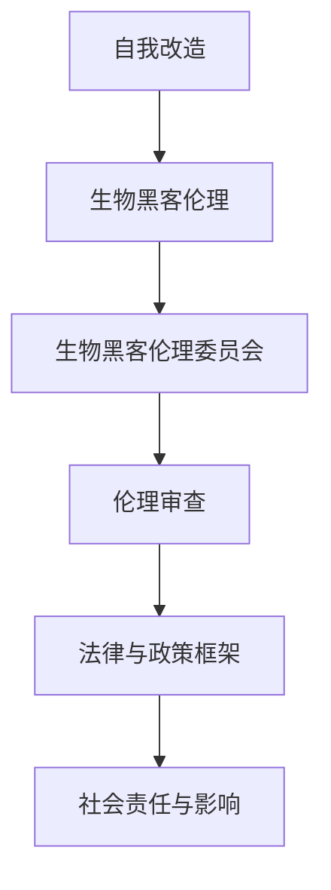

                 

# 生物黑客伦理委员会组建：自我改造的道德监管机构设立

> 关键词：自我改造、生物黑客、伦理委员会、道德监管、技术伦理

> 摘要：本文探讨了自我改造这一新兴领域的伦理问题，提出了组建生物黑客伦理委员会的必要性，详细分析了伦理委员会的构建原则、职能、运作机制及其在法律与政策框架中的定位。通过具体案例的解析，本文进一步探讨了伦理审查的挑战与启示，最后提出了伦理委员会在未来自我改造社会中的角色与职责。

## 目录大纲

## 第一部分: 引论

### 第1章: 自我改造与生物黑客伦理

#### 1.1 自我改造的兴起

##### 1.1.1 自我改造的定义

##### 1.1.2 自我改造的历史背景

##### 1.1.3 自我改造的现状与趋势

#### 1.2 生物黑客伦理的重要性

##### 1.2.1 伦理在自我改造中的角色

##### 1.2.2 伦理委员会的作用

##### 1.2.3 伦理审查的重要性

### 第2章: 生物黑客伦理委员会的组建

#### 2.1 伦理委员会的构建原则

##### 2.1.1 公平性与代表性

##### 2.1.2 权威性与独立性

##### 2.1.3 专业知识与多样性

#### 2.2 伦理委员会的职能

##### 2.2.1 咨询与建议

##### 2.2.2 伦理审查与评估

##### 2.2.3 指导与监督

#### 2.3 伦理委员会的运作机制

##### 2.3.1 会议与讨论

##### 2.3.2 报告与记录

##### 2.3.3 决策与执行

### 第3章: 自我改造的法律与政策框架

#### 3.1 国际与国内自我改造法规概述

##### 3.1.1 国际法规与政策

##### 3.1.2 我国相关法律法规

##### 3.1.3 法律法规的挑战与应对

#### 3.2 法律与政策对伦理委员会的影响

##### 3.2.1 法律责任的界定

##### 3.2.2 政策支持的必要性

##### 3.2.3 法律与政策的协调与平衡

### 第4章: 伦理审查案例解析

#### 4.1 案例概述

##### 4.1.1 案例背景

##### 4.1.2 案例涉及的技术

##### 4.1.3 案例中的伦理争议

#### 4.2 伦理审查过程

##### 4.2.1 审查机构的组成

##### 4.2.2 审查内容的重点

##### 4.2.3 审查结论与建议

#### 4.3 案例反思与启示

##### 4.3.1 伦理审查的挑战

##### 4.3.2 伦理委员会的角色定位

##### 4.3.3 未来发展的方向

### 第5章: 自我改造的社会影响与伦理责任

#### 5.1 社会影响的评估

##### 5.1.1 社会伦理的影响

##### 5.1.2 社会道德的冲突

##### 5.1.3 社会公平的考量

#### 5.2 个人与社会责任的划分

##### 5.2.1 个人责任与公共责任

##### 5.2.2 责任主体的多元性

##### 5.2.3 社会责任的落实

### 第6章: 伦理委员会的实践探索

#### 6.1 国内外伦理委员会的实践案例

##### 6.1.1 案例分析

##### 6.1.2 经验与教训

##### 6.1.3 案例启示

#### 6.2 伦理委员会的运营模式

##### 6.2.1 运作流程

##### 6.2.2 人员配备

##### 6.2.3 资源配置

### 第7章: 未来展望

#### 7.1 伦理委员会的发展趋势

##### 7.1.1 技术进步的影响

##### 7.1.2 社会需求的变化

##### 7.1.3 法律法规的完善

#### 7.2 伦理委员会的角色与职责

##### 7.2.1 新角色的定位

##### 7.2.2 新职责的划分

##### 7.2.3 新挑战的应对

#### 7.3 伦理委员会的国际合作

##### 7.3.1 国际合作的意义

##### 7.3.2 国际合作的形式

##### 7.3.3 国际合作的案例

## 参考文献

## 附录

## 附录 A: 生物黑客伦理委员会组建流程图

## 附录 B: 伦理审查流程示例

## 附录 C: 相关法律法规摘要

## 附录 D: 生物黑客伦理委员会组建流程图

### 核心概念与联系 Mermaid 流程图



### 核心算法原理讲解

#### 1. 生物黑客伦理的算法原理

生物黑客伦理的算法原理涉及伦理决策模型，该模型可以根据伦理原则、事实信息和背景技术来做出决策。

Python 示例代码：

```python
class EthicalDecisionModel:
    def __init__(self, ethical_principles, factual_info, technical_background):
        self.ethical_principles = ethical_principles
        self.factual_info = factual_info
        self.technical_background = technical_background

    def make_decision(self):
        # 根据伦理原则、事实信息和背景技术做出决策
        decision = "根据伦理原则和事实信息做出决策"
        return decision

# 创建实例
ethical_model = EthicalDecisionModel("公正性原则", "实验数据", "基因编辑技术")
print(ethestic_model.make_decision())
```

#### 2. 伦理审查流程的算法原理

伦理审查流程的算法原理涉及审查步骤、审查指标和审查结果的评估。

Python 示例代码：

```python
class EthicalReviewProcess:
    def __init__(self, review_steps, review_indicators, review_results):
        self.review_steps = review_steps
        self.review_indicators = review_indicators
        self.review_results = review_results

    def review_process(self):
        # 根据审查步骤、审查指标和审查结果评估审查流程
        review_result = "根据审查步骤和审查指标评估审查结果"
        return review_result

# 创建实例
review_process = EthicalReviewProcess(["初步审查", "深入审查", "决策"], ["透明度", "公正性", "安全性"], ["符合伦理要求", "需进一步审查", "不符合伦理要求"])
print(review_process.review_process())
```

### 数学模型和数学公式 & 详细讲解 & 举例说明

#### 1. 自我改造的技术风险模型

技术风险模型可以用以下数学公式表示：

$$ 风险 = 风险因素 \times 影响程度 $$

Python 示例代码：

```python
def calculate_risk(risk_factor, impact_level):
    risk = risk_factor * impact_level
    return risk

# 计算技术风险
risk_factor = 0.8  # 风险因素
impact_level = 10  # 影响程度
print(calculate_risk(risk_factor, impact_level))
```

#### 2. 伦理审查流程的评估模型

伦理审查流程的评估模型可以用以下数学公式表示：

$$ 伦理审查评估 = 审查指标得分 \times 审查结果权重 $$

Python 示例代码：

```python
def ethical_review_evaluation(review_score, result_weight):
    evaluation = review_score * result_weight
    return evaluation

# 计算伦理审查评估得分
review_score = 0.85  # 审查指标得分
result_weight = 0.9  # 审查结果权重
print(ethical_review_evaluation(review_score, result_weight))
```

通过以上数学模型和Python代码示例，我们可以更清晰地理解自我改造中的伦理问题，以及伦理审查的流程和评估方法。这些模型和算法为生物黑客伦理委员会的工作提供了理论依据和技术支持。接下来，我们将进一步探讨生物黑客伦理委员会的构建原则、职能和运作机制。

