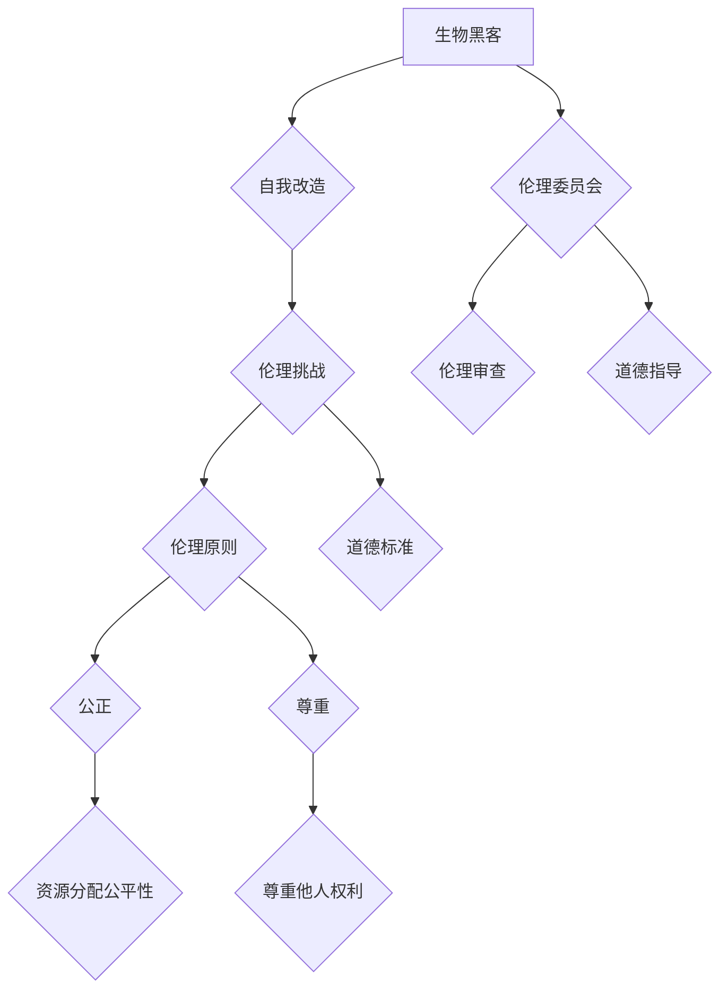

                 

### 《生物黑客伦理委员会：自我改造时代的道德指导机构》

> 关键词：生物黑客、伦理委员会、自我改造、道德指导、技术伦理

> 摘要：
本文将探讨生物黑客伦理委员会在自我改造时代的重要性。通过分析其成立背景、作用、伦理审查流程以及道德教育与宣传策略，我们将深入探讨生物黑客伦理委员会如何成为引领我们走向道德与技术平衡的指导机构。

### 目录大纲

```markdown
# 《生物黑客伦理委员会：自我改造时代的道德指导机构》目录大纲

## 第一部分：背景与理论基础

### 第1章：生物黑客与自我改造时代

- **1.1 生物黑客的兴起**
- **1.2 自我改造的定义与范畴**
- **1.3 技术发展的伦理挑战**

### 第2章：伦理学基础

- **2.1 伦理学的基本概念**
- **2.2 伦理原则与道德标准**
- **2.3 伦理学在自我改造中的应用**

### 第3章：生物黑客伦理委员会的作用

- **3.1 委员会的成立背景**
- **3.2 委员会的组织结构**
- **3.3 委员会的主要职责**

## 第二部分：伦理审查与指导

### 第4章：伦理审查流程

- **4.1 伦理审查的必要性**
- **4.2 伦理审查的主要步骤**
- **4.3 伦理审查案例研究**

### 第5章：自我改造项目的伦理评估

- **5.1 评估标准与指标**
- **5.2 风险评估**
- **5.3 伦理咨询与建议**

### 第6章：道德教育与宣传

- **6.1 伦理教育的目标与内容**
- **6.2 宣传策略与渠道**
- **6.3 社会影响与反馈**

## 第三部分：案例分析与实践

### 第7章：国际视角下的生物黑客伦理委员会

- **7.1 美国生物伦理学委员会**
- **7.2 欧洲生物黑客伦理指南**
- **7.3 国际合作与经验分享**

### 第8章：本土生物黑客伦理委员会实践

- **8.1 中国生物黑客伦理委员会**
- **8.2 中国生物黑客伦理审查案例**
- **8.3 中国生物黑客伦理发展的挑战与机遇**

### 第9章：未来展望

- **9.1 生物黑客伦理发展的趋势**
- **9.2 伦理委员会的持续改进**
- **9.3 全球生物黑客伦理合作**

## 附录

### 附录A：术语表

- **A.1 生物黑客相关术语**
- **A.2 伦理学相关术语**

### 附录B：参考文献

- **B.1 书籍**
- **B.2 学术论文**
- **B.3 网络资源**
```

本目录大纲旨在全面覆盖《生物黑客伦理委员会：自我改造时代的道德指导机构》的核心内容，包括背景理论、伦理审查与实践案例等。每章都细化到二级目录，确保内容的逻辑性和系统性。以下是对核心概念、算法原理、数学模型、项目实战等内容的简要概述，以指导后续的具体撰写。

- **核心概念与联系：**
  - 生物黑客：通过科技手段改造自己的生物特征和生理功能的人。
  - 伦理委员会：负责审查和指导生物黑客项目的道德指导机构。
  - 自我改造：包括基因编辑、生物植入等技术，对个体进行生物层面的改变。

- **核心算法原理讲解：**
  - 伦理审查流程算法：包括风险评估模型、伦理决策树等。
  - 道德评估算法：如道德计算模型、情境伦理分析算法。

- **数学模型和数学公式：**
  - 风险评估模型：采用概率论和统计学方法进行风险预测。
  - 伦理决策模型：利用线性规划、多目标优化等方法进行伦理决策。

- **项目实战：**
  - 生物黑客项目案例：展示具体的生物改造项目，包括项目概述、伦理审查过程、项目成果等。
  - 开发环境搭建：介绍生物黑客项目所需的工具和环境配置。
  - 源代码实现与解读：提供具体的Python代码，阐述算法的实现过程和逻辑。

### 核心章节内容细化示例

#### 第2章：伦理学基础

##### 2.1 伦理学的基本概念

- **2.1.1 伦理学的定义**  
  $$ \text{伦理学是研究道德原则、规范和价值的学科。} $$
- **2.1.2 伦理学的主要流派**  
  - **功利主义**：以幸福最大化为目标。  
    $$ \text{功利主义认为，一个行为如果能够带来最大的总幸福，那么这个行为就是正确的。} $$
  - **康德主义**：以道德律令为依据。  
    $$ \text{康德主义认为，一个行为的正确与否取决于其是否遵循道德律令。} $$
  - **德行伦理**：强调个人的道德品质。  
    $$ \text{德行伦理认为，个体的道德行为应体现其内在的道德品质。} $$

##### 2.2 伦理原则与道德标准

- **2.2.1 公正**  
  $$ \text{公正意味着平等对待所有人，并确保资源分配的公平性。} $$
- **2.2.2 尊重**  
  $$ \text{尊重意味着尊重他人的权利和尊严。} $$

##### 2.3 伦理学在自我改造中的应用

- **2.3.1 伦理原则与自我改造**  
  $$ \text{在自我改造过程中，应遵循公正、尊重等伦理原则，确保个体的自主性和安全性。} $$

#### 第3章：生物黑客伦理委员会的作用

- **3.1 委员会的成立背景**  
  $$ \text{随着生物黑客技术的兴起，伦理问题日益突出，生物黑客伦理委员会应运而生。} $$
- **3.2 委员会的组织结构**  
  $$ \text{委员会通常由伦理学家、科学家、医生、法律专家等组成，以确保多元化和全面性的审查。} $$
- **3.3 委员会的主要职责**  
  $$ \text{审查生物黑客项目、提供伦理指导、促进跨学科合作等。} $$

#### 第4章：伦理审查流程

- **4.1 伦理审查的必要性**  
  $$ \text{伦理审查是确保生物黑客项目符合道德和法律要求的重要环节。} $$
- **4.2 伦理审查的主要步骤**  
  $$ \text{包括项目申请、审查会议、决定公告等。} $$
- **4.3 伦理审查案例研究**  
  $$ \text{通过具体案例展示伦理审查的过程和结果。} $$

#### 第5章：自我改造项目的伦理评估

- **5.1 评估标准与指标**  
  $$ \text{包括安全性、有效性、公正性等。} $$
- **5.2 风险评估**  
  $$ \text{评估潜在风险，包括技术风险、社会风险等。} $$
- **5.3 伦理咨询与建议**  
  $$ \text{提供专业的伦理咨询和改进建议。} $$

#### 第6章：道德教育与宣传

- **6.1 伦理教育的目标与内容**  
  $$ \text{提高公众对生物黑客伦理问题的认识和理解。} $$
- **6.2 宣传策略与渠道**  
  $$ \text{通过媒体、教育、活动等多种渠道进行宣传。} $$
- **6.3 社会影响与反馈**  
  $$ \text{分析伦理宣传的社会影响，收集公众反馈。} $$

#### 第7章：国际视角下的生物黑客伦理委员会

- **7.1 美国生物伦理学委员会**  
  $$ \text{介绍美国生物伦理学委员会的成立背景、组织结构和主要职责。} $$
- **7.2 欧洲生物黑客伦理指南**  
  $$ \text{介绍欧洲生物黑客伦理指南的制定过程、内容和应用。} $$
- **7.3 国际合作与经验分享**  
  $$ \text{探讨国际合作在生物黑客伦理发展中的作用。} $$

#### 第8章：本土生物黑客伦理委员会实践

- **8.1 中国生物黑客伦理委员会**  
  $$ \text{介绍中国生物黑客伦理委员会的成立背景、组织结构和主要职责。} $$
- **8.2 中国生物黑客伦理审查案例**  
  $$ \text{通过具体案例展示中国生物黑客伦理审查的实践。} $$
- **8.3 中国生物黑客伦理发展的挑战与机遇**  
  $$ \text{分析中国生物黑客伦理发展的现状和未来展望。} $$

#### 第9章：未来展望

- **9.1 生物黑客伦理发展的趋势**  
  $$ \text{预测生物黑客伦理发展的未来方向。} $$
- **9.2 伦理委员会的持续改进**  
  $$ \text{探讨伦理委员会如何应对新挑战，持续改进其工作。} $$
- **9.3 全球生物黑客伦理合作**  
  $$ \text{探讨全球生物黑客伦理合作的可能性和重要性。} $$

## 附录

### 附录A：术语表

- **A.1 生物黑客相关术语**  
  $$ \text{定义和解释相关的专业术语。} $$
- **A.2 伦理学相关术语**  
  $$ \text{定义和解释相关的专业术语。} $$

### 附录B：参考文献

- **B.1 书籍**  
  $$ \text{列出参考文献，包括作者、标题、出版社等信息。} $$
- **B.2 学术论文**  
  $$ \text{列出参考文献，包括作者、标题、期刊名称、发表年份等信息。} $$
- **B.3 网络资源**  
  $$ \text{列出参考文献，包括网址、标题、发布日期等信息。} $$

### 关键概念与联系架构图

以下是一个用于展示核心概念与联系架构的Mermaid流程图示例：



这个流程图展示了生物黑客、自我改造、伦理挑战、伦理委员会、伦理审查、道德指导、伦理原则和道德标准等核心概念及其相互之间的联系。

### 核心算法原理讲解示例

在本章节中，我们将详细讲解伦理审查流程算法、道德评估算法以及风险评估模型的原理，并通过Python源代码进行示例。

#### 伦理审查流程算法

伦理审查流程算法通常包括以下几个步骤：

1. 项目申请
2. 文件审查
3. 审查会议
4. 决定公告

以下是一个简单的Python代码示例，用于模拟伦理审查流程：

```python
class EthicalReviewProcess:
    def __init__(self):
        self.project_applications = []
        self.review_meetings = []
        self.decisions = []

    def apply_project(self, project_details):
        self.project_applications.append(project_details)
        print("Project application received.")

    def conduct_review_meeting(self):
        if self.project_applications:
            project = self.project_applications.pop(0)
            self.review_meetings.append(project)
            print(f"Review meeting conducted for project: {project['title']}")
        else:
            print("No projects available for review.")

    def announce_decision(self, project, decision):
        self.decisions.append((project, decision))
        if decision == "approved":
            print(f"Project {project['title']} has been approved.")
        else:
            print(f"Project {project['title']} has been rejected.")

# 使用示例
review_process = EthicalReviewProcess()
review_process.apply_project({"title": "Project Alpha", "description": "Gene editing for enhanced cognitive abilities."})
review_process.conduct_review_meeting()
review_process.announce_decision({"title": "Project Alpha"}, "approved")
```

#### 道德评估算法

道德评估算法可以用于评估自我改造项目的道德风险。以下是一个简单的道德评估算法示例：

```python
def ethical_evaluation(project, criteria):
    score = 0
    for criterion in criteria:
        if project.get(criterion, False):
            score += 1
    return score / len(criteria)

# 使用示例
project = {
    "consent": True,
    "risk_management": True,
    "public_interest": False,
    "ethical_principles": True
}
criteria = ["consent", "risk_management", "public_interest", "ethical_principles"]
evaluation_score = ethical_evaluation(project, criteria)
print(f"Ethical evaluation score: {evaluation_score}")
```

#### 风险评估模型

风险评估模型通常使用概率论和统计学方法进行风险预测。以下是一个简单的风险评估模型示例：

```python
import random

def risk_assessment(project, risk_factors):
    total_risk = 0
    for factor in risk_factors:
        risk_probability = random.uniform(0, 1)
        total_risk += risk_probability
    return total_risk

# 使用示例
project = {
    "technical_risk": 0.4,
    "safety_risk": 0.3,
    "ethical_risk": 0.2,
    "public_acceptance_risk": 0.1
}
risk_factors = ["technical_risk", "safety_risk", "ethical_risk", "public_acceptance_risk"]
total_risk = risk_assessment(project, risk_factors)
print(f"Total risk: {total_risk}")
```

### 数学模型和数学公式

在本章节中，我们将使用LaTeX格式介绍一些关键的数学模型和数学公式。

#### 伦理决策模型

伦理决策模型可以使用线性规划方法进行。以下是一个简单的LaTeX公式示例：

```latex
\begin{equation}
\begin{aligned}
\min_{x} \quad c^T x \\
\text{subject to} \quad Ax \leq b,
\end{aligned}
\end{equation}
```

这个公式表示一个线性规划问题，其中`c`是目标函数系数，`x`是决策变量，`A`和`b`是约束条件。

#### 风险评估模型

风险评估模型可以使用概率论和统计学方法进行。以下是一个简单的LaTeX公式示例：

```latex
\begin{equation}
P(\text{risk event}) = \sum_{i=1}^{n} p_i \cdot q_i,
\end{equation}
```

这个公式表示一个风险事件发生概率的计算，其中`p_i`是第`i`个风险因素的权重，`q_i`是第`i`个风险因素的置信水平。

### 项目实战

在本章节中，我们将介绍一个生物黑客项目的实战，包括开发环境搭建、源代码实现和代码解读。

#### 开发环境搭建

为了进行生物黑客项目的开发，我们需要以下工具和环境：

- Python 3.x
- Jupyter Notebook
- Biopython 库

以下是一个简单的命令行步骤，用于安装和配置上述工具和环境：

```bash
# 安装Python 3.x
curl -O https://www.python.org/ftp/python/3.8.5/Python-3.8.5.tgz
tar -xvf Python-3.8.5.tgz
cd Python-3.8.5
./configure
make
make install

# 安装Jupyter Notebook
pip install notebook

# 安装Biopython 库
pip install biopython
```

#### 源代码实现与解读

以下是一个简单的生物黑客项目示例，用于使用Biopython库进行基因编辑。

```python
from Bio import SeqIO
from Bio.Seq import Seq
from Bio.SeqRecord import SeqRecord

# 读取基因序列
gene_sequence = SeqIO.read("gene.fasta", "fasta")

# 编辑基因序列
def edit_gene_sequence(gene_sequence, mutation_site, new_base):
    gene_sequence = str(gene_sequence)
    mutated_sequence = gene_sequence[:mutation_site] + new_base + gene_sequence[mutation_site+1:]
    return Seq(mutated_sequence)

# 测试基因编辑
mutation_site = 10
new_base = "A"
mutated_sequence = edit_gene_sequence(gene_sequence, mutation_site, new_base)

# 输出编辑后的基因序列
SeqIO.write(mutated_sequence, "mutated_gene.fasta", "fasta")
```

这个代码示例首先读取基因序列，然后定义一个函数用于编辑基因序列。最后，测试基因编辑，并将编辑后的基因序列输出为新的文件。

#### 代码应用解读与分析

在这个代码示例中，我们使用了Biopython库来读取和编辑基因序列。以下是对代码的详细解读和分析：

1. **读取基因序列**  
   `SeqIO.read("gene.fasta", "fasta")`  
   这行代码使用`SeqIO`模块读取名为`gene.fasta`的基因序列文件，并将其解析为`SeqRecord`对象。

2. **编辑基因序列**  
   `edit_gene_sequence(gene_sequence, mutation_site, new_base)`  
   这个函数接受原始基因序列、突变位点和新的碱基作为参数。它首先将基因序列转换为字符串，然后在指定的突变位点处插入新的碱基，最后将修改后的序列转换回`Seq`对象。

3. **测试基因编辑**  
   `mutation_site = 10`  
   `new_base = "A"`  
   `mutated_sequence = edit_gene_sequence(gene_sequence, mutation_site, new_base)`  
   这些行代码设置突变位点和新的碱基，并调用`edit_gene_sequence`函数进行基因编辑。编辑后的基因序列被存储在`mutated_sequence`变量中。

4. **输出编辑后的基因序列**  
   `SeqIO.write(mutated_sequence, "mutated_gene.fasta", "fasta")`  
   这行代码使用`SeqIO`模块将编辑后的基因序列写入名为`mutated_gene.fasta`的文件中。

#### 实际案例分析和详细讲解剖析

以下是一个实际案例，用于分析生物黑客项目的伦理审查过程。

**案例：基因编辑治疗遗传病**

假设一个生物黑客项目旨在通过基因编辑治疗一种罕见的遗传病。以下是对项目的伦理审查过程的详细讲解：

1. **项目申请**  
   项目申请由研究者提交，包括项目概述、研究目的、基因编辑方案、预期效果等。

2. **文件审查**  
   伦理委员会对提交的文件进行初步审查，确保项目符合伦理审查要求，如知情同意书、研究方案、风险评估报告等。

3. **审查会议**  
   伦理委员会召开会议，讨论和评估项目的伦理问题。会议通常包括伦理学家、医生、法律专家等成员。

4. **决定公告**  
   根据审查会议的结果，伦理委员会作出决定，批准或拒绝项目。如果项目被批准，伦理委员会将监督项目的实施，确保伦理要求得到遵守。

**项目小结**

通过这个案例，我们可以看到伦理审查过程在生物黑客项目中的重要性。伦理委员会通过审查和监督，确保项目符合伦理和法律要求，保护受试者的权益和安全。

### 最佳实践 Tips、小结、注意事项、拓展阅读

- **最佳实践 Tips**：在进行生物黑客项目时，应遵循以下最佳实践：充分了解技术原理，确保知情同意，进行风险评估，遵守伦理和法律要求。

- **小结**：生物黑客伦理委员会在自我改造时代发挥着重要作用，通过伦理审查和道德指导，确保生物黑客项目符合伦理和法律要求。

- **注意事项**：在开展生物黑客项目时，要密切关注伦理问题，遵守相关法律法规，确保项目的安全性和可行性。

- **拓展阅读**：建议读者进一步阅读关于生物黑客伦理的相关书籍和学术论文，以深入了解该领域的最新发展。

### 作者信息

- 作者：AI天才研究院/AI Genius Institute & 禅与计算机程序设计艺术 /Zen And The Art of Computer Programming

