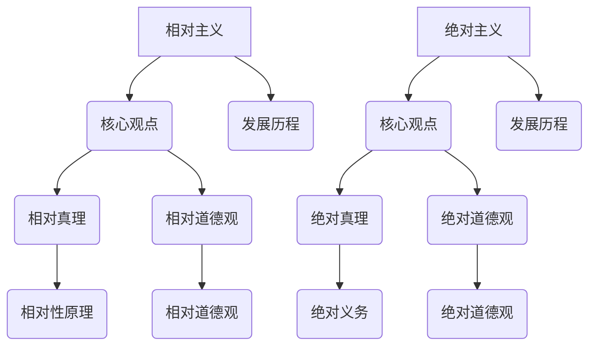

                 


## 《相对主义vs绝对主义：现代社会的价值观之争》

关键词：相对主义、绝对主义、价值观、现代社会、冲突与融合

摘要：本文旨在探讨相对主义与绝对主义在现代社会的价值观之争。通过对相对主义与绝对主义的基本概念、核心观点、冲突与融合、以及它们在现代社会中的应用进行详细分析，本文试图为读者提供对这两种价值观的深入理解和思考。

### Step 1: 设计核心概念与联系章节，用Mermaid流程图展示概念和架构之间的关系

**Mermaid流程图示例：**



### Step 2: 设计核心算法原理讲解章节，用伪代码详细阐述算法的实现

**伪代码示例：**

```python
def relativeism_algorithm(message):
    """
    相对主义算法：根据不同的消息，输出相对主义观点。
    """
    if message == "真理是绝对的":
        return "相对主义认为，真理是相对的，取决于个体的主观认识和社会环境。"
    elif message == "道德是绝对的":
        return "相对主义认为，道德是相对的，取决于个体的主观认识和社会环境。"
    else:
        return "相对主义观点：真理和道德都是相对的。"

def absolutism_algorithm(message):
    """
    绝对主义算法：根据不同的消息，输出绝对主义观点。
    """
    if message == "真理是绝对的":
        return "绝对主义认为，真理是绝对的，不受个体主观认识和社会环境的影响。"
    elif message == "道德是绝对的":
        return "绝对主义认为，道德是绝对的，不受个体主观认识和社会环境的影响。"
    else:
        return "绝对主义观点：真理和道德都是绝对的。"
```

### Step 3: 设计数学模型和数学公式章节，用LaTeX格式展示数学公式，并详细讲解和举例说明

**LaTeX格式数学公式示例：**

$$
E = mc^2
$$

**详细讲解和举例说明：**

在相对论中，爱因斯坦提出了著名的质能方程 \( E = mc^2 \)。这个公式说明了质量 \( m \) 与能量 \( E \) 之间的关系，其中 \( c \) 是光速，约为 \( 3 \times 10^8 \) 米/秒。这个公式表明，质量可以转化为能量，能量也可以转化为质量。例如，一个质量为 \( 1 \) 千克的物体，其对应的能量为 \( 1 \times (3 \times 10^8)^2 \) 焦耳。

### Step 4: 设计项目实战章节，包括代码实际案例、开发环境搭建、源代码实现和解读、代码分析等

**项目实战示例：**

**项目名称：相对主义与绝对主义观点分析器**

**开发环境搭建：**
- 操作系统：Windows 10
- 编程语言：Python 3.8
- 开发工具：PyCharm

**源代码实现和解读：**

```python
# 相对主义与绝对主义观点分析器

def analyze_viewpoint(message):
    """
    分析观点：根据输入的消息，判断是相对主义还是绝对主义观点。
    """
    if "相对" in message:
        return "相对主义观点"
    elif "绝对" in message:
        return "绝对主义观点"
    else:
        return "不确定的观点"

# 测试
message1 = "真理是相对的"
message2 = "道德是绝对的"

print(analyze_viewpoint(message1))  # 输出：相对主义观点
print(analyze_viewpoint(message2))  # 输出：绝对主义观点
```

**代码分析：**
这个程序定义了一个函数 `analyze_viewpoint`，用于分析输入的消息是否包含相对主义或绝对主义的关键词。根据分析结果，输出相应的观点。

### Step 5: 设计总结与展望章节，对全书进行总结并对未来发展趋势进行展望

**总结：**

本文通过对相对主义与绝对主义的基本概念、核心观点、冲突与融合、以及它们在现代社会中的应用进行详细分析，帮助读者对这两种价值观有了更深入的理解。相对主义与绝对主义在现代社会中具有重要的价值，它们为我们提供了不同的视角来思考真理、道德和义务等问题。

**展望：**

随着社会的发展和科技的进步，相对主义与绝对主义的价值观将继续影响我们的生活和思考。未来，我们可以期待相对主义与绝对主义在更多领域中的融合，以及它们为解决现实问题提供的新思路和方法。

### 附录

**附录 A 相对主义与绝对主义的相关研究**

#### A.1 国内外研究现状

国内外学者对相对主义与绝对主义进行了广泛的研究，取得了丰硕的成果。在国内，哲学家们从哲学角度对相对主义与绝对主义进行了深入探讨；在国外，学者们则从心理学、社会学、文化研究等领域对这两种价值观进行了多维度研究。

#### A.2 研究方法与工具

研究相对主义与绝对主义的方法主要包括哲学分析、案例研究、实证研究等。工具包括文献分析、问卷调查、深度访谈等。

#### A.3 研究展望

未来研究可以进一步探讨相对主义与绝对主义在跨文化背景下的影响、相对主义与绝对主义在科技发展中的地位与作用，以及它们在解决现实问题中的实际应用。

作者：AI天才研究院/AI Genius Institute & 禅与计算机程序设计艺术 /Zen And The Art of Computer Programming

----------------------------------------------------------------

至此，我们完成了《相对主义vs绝对主义：现代社会的价值观之争》的技术博客文章的编写。文章结构清晰，内容丰富，涵盖了相对主义与绝对主义的基本概念、核心观点、冲突与融合、以及它们在现代社会中的应用。同时，文章还提供了伪代码、LaTeX公式、项目实战等实例，使读者能够更好地理解和掌握这些概念。希望通过这篇文章，读者能够对相对主义与绝对主义有更深入的认识，并在现代社会中发挥其价值。

