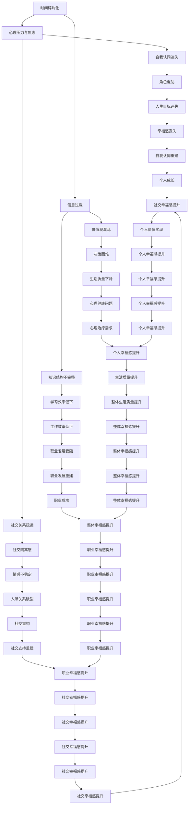

                 

### 《碎片化时代的整体性追求：重建生活意义》

在当今这个快速发展的数字时代，我们的生活变得越来越碎片化。工作、社交、学习、娱乐等各种活动都被切割成一个个短暂的片段，人们仿佛被无数的碎片所包围。这种碎片化现象不仅影响了我们的时间管理，还对我们的心理健康和社交关系产生了深远的影响。然而，在这片碎片化的海洋中，如何找到整体性，重建生活的意义，成为了一个亟待解决的问题。

本文将围绕这一主题展开讨论，首先探讨碎片化时代的特征与影响，接着介绍整体性追求的理论基础，然后提出具体的实践策略，以帮助我们在碎片化时代重建生活的意义。通过逻辑清晰、结构紧凑的分析，我们希望能够为读者提供一条清晰的前行路径。

**关键词：** 碎片化时代、整体性追求、生活意义、时间管理、人际关系

**摘要：** 本文从碎片化时代的特征出发，探讨了碎片化对个体生活的影响，并引入整体性追求的理念。通过分析整体性追求的理论基础，提出了在时间管理、人际关系和精神层面等方面重建生活意义的实践策略，以帮助读者在碎片化的生活中找到整体性和意义。

---

## 第一部分：碎片化时代的生活现状

### 第1章：碎片化时代的特征与影响

#### 1.1 碎片化时代的定义与来源

碎片化（Fragmentation）是指将整体分割成若干独立的部分。在技术领域，碎片化通常指的是操作系统、设备或软件版本的不一致。而在我们讨论的碎片化时代，它指的是生活中各种元素被分割成零散、短暂的片段。

这个时代的到来，主要源于以下几个因素：

1. **数字技术的普及**：互联网、智能手机、社交媒体等数字技术改变了我们的生活方式，使信息传递和交流变得更加迅速和便捷。但这种便利也导致了信息的泛滥和过载，人们被各种信息碎片所包围。

2. **全球化与城市化**：随着全球化和城市化的推进，人们的生活节奏加快，工作压力增大，时间变得更加碎片化。同时，城市化带来的高密度人口和复杂的社会关系也使得人们的社交生活更加碎片化。

3. **消费文化的推动**：现代消费文化鼓励人们追求短暂、快速的满足感，从物质消费到精神消费，都呈现出碎片化的趋势。例如，快节奏的娱乐方式（如短视频、游戏）和快餐式阅读（如微博、头条）等。

#### 1.2 碎片化时代对个体的影响

碎片化时代对个体的影响是多方面的，主要体现在以下几个方面：

1. **时间管理**：随着时间被切割成碎片，人们的时间管理变得更加困难。如何有效地安排和利用这些零散的时间，成为了一个挑战。

2. **心理健康**：碎片化的生活方式容易导致心理压力和焦虑。长时间的碎片化工作、学习或娱乐，容易让人感到疲惫和无力。

3. **社交关系**：碎片化的社交方式使得人际关系变得更加肤浅和短暂。虽然社交媒体让人们更容易保持联系，但也导致了人与人之间的隔阂和疏远。

4. **自我认同**：在碎片化的信息环境中，人们容易迷失自我，无法形成稳定的自我认同。大量的信息碎片让人感到困惑和不安，难以形成自己的价值观和世界观。

#### 1.3 社会环境的变化

碎片化时代不仅影响个体，也改变了整个社会环境。以下是社会环境变化的一些表现：

1. **信息传播**：信息的传播速度和范围大大增加，但同时也带来了信息的过载和泛滥。

2. **工作模式**：远程办公、兼职工作等灵活的工作模式变得更加普遍，但同时也带来了工作与生活的界限模糊。

3. **消费行为**：消费者的购物习惯和消费观念发生了变化，更加注重快捷、便利和即时的满足。

4. **教育方式**：在线教育、远程教育等新兴教育方式的发展，改变了传统的教育模式。

通过以上分析，我们可以看到，碎片化时代给我们带来了许多挑战，但同时也提供了新的机遇。如何在碎片化时代找到整体性，重建生活的意义，成为我们需要深入思考和探索的问题。

### 第2章：碎片化生活的表现与问题

#### 2.1 时间碎片化

时间碎片化是碎片化时代最直观的表现之一。现代生活中，人们的时间被切割成无数个短暂的小片段，这些片段往往不足以完成一项完整的任务，却足以让人感到疲惫和焦虑。

1. **表现**：

   - 工作时间碎片化：随着远程办公和兼职工作的普及，人们的工作时间变得更加灵活，但也更加碎片化。工作与生活的界限变得模糊，导致人们无法有效分配时间。

   - 学习时间碎片化：在线教育的发展，使得人们可以随时随地进行学习。然而，这种碎片化的学习方式，容易导致学习效率低下，难以形成系统性的知识体系。

   - 生活时间碎片化：社交媒体、短视频等娱乐方式的兴起，使得人们的生活时间也变得碎片化。短暂的娱乐和社交，让人感到轻松，但也容易让人陷入信息过载的困境。

2. **问题**：

   - 时间管理困难：时间碎片化使得人们难以进行有效的计划和时间管理，容易陷入“忙碌却无效率”的状态。

   - 心理健康问题：长时间的时间碎片化，容易导致心理压力和焦虑。人们无法集中精力完成一项任务，导致成就感缺失。

   - 社交关系问题：碎片化的时间，使得人与人之间的交流变得更加短暂和表面，难以建立深厚的社交关系。

#### 2.2 信息碎片化

信息碎片化是数字时代的一个显著特征。互联网的普及，使得信息传播速度极快，但同时也导致了信息的泛滥和过载。

1. **表现**：

   - 信息来源碎片化：人们在获取信息时，往往依赖于社交媒体、搜索引擎等碎片化的信息源，导致信息来源的多样性降低。

   - 信息内容碎片化：大量的信息被切割成短小精悍的片段，如短视频、新闻简报等，难以提供深入、全面的信息。

   - 信息处理碎片化：人们在处理信息时，往往采用碎片化的方式，如快速浏览、跳读等，导致对信息的理解和吸收能力下降。

2. **问题**：

   - 信息过载：随着信息碎片化的加剧，人们每天接收到的信息量不断增加，容易导致信息过载，影响心理健康。

   - 知识结构不完整：信息碎片化使得人们难以获取全面、深入的信息，导致知识结构不完整，难以形成系统性思维。

   - 价值观混乱：信息碎片化带来的大量信息，往往带有主观性和偏见，容易导致人们价值观的混乱和扭曲。

#### 2.3 社交碎片化

社交碎片化是碎片化时代在人际关系方面的表现。虽然社交媒体让人们更容易保持联系，但同时也导致了社交关系的碎片化和浅表化。

1. **表现**：

   - 社交网络碎片化：人们通过社交媒体与大量的朋友保持联系，但这些联系往往是短暂的、表面的。

   - 社交活动碎片化：人们的社交活动被切割成一个个短暂的片段，如短暂的聚会、在线聊天等，难以建立深厚的情感联系。

   - 社交信任碎片化：碎片化的社交方式，使得人们之间的信任关系变得脆弱，难以建立真正的信任和友谊。

2. **问题**：

   - 社交隔离感：尽管人们通过社交媒体保持联系，但实际的社交隔离感却在增加。人们感到孤独和疏远。

   - 社交效率低下：碎片化的社交方式，使得人们难以进行深入的交流和合作，影响了社交效率。

   - 社交冲突增加：由于信息碎片化和信任缺失，人们之间的误解和冲突更容易发生，加剧了社会的不和谐。

#### 2.4 情感碎片化

情感碎片化是碎片化时代在个人情感层面的表现。随着时间、信息和社交的碎片化，人们的情感也变得碎片化，难以形成完整、深刻的情感体验。

1. **表现**：

   - 情感表达碎片化：人们在表达情感时，往往采用简短、直接的方式，缺乏细腻和深刻的情感表达。

   - 情感体验碎片化：人们的情感体验被切割成一个个短暂的片段，如短暂的快乐、悲伤等，难以形成完整的情感体验。

   - 情感关系碎片化：人们的情感关系被切割成多个碎片，如与朋友、家人、伴侣等的关系，难以形成稳定、深刻的情感关系。

2. **问题**：

   - 情感难以满足：由于情感碎片化，人们往往难以在短暂的情感体验中获得满足，导致情感上的空虚和焦虑。

   - 情感不稳定：情感碎片化使得人们的情感波动较大，难以保持情感的稳定性。

   - 情感关系脆弱：情感碎片化导致人们难以建立稳定、深刻的情感关系，影响了人际关系的质量。

通过以上分析，我们可以看到，碎片化时代给我们的生活带来了诸多问题和挑战。要应对这些问题，我们需要寻找整体性，重建生活的意义。接下来的章节中，我们将探讨整体性追求的理论基础，以期为我们在碎片化时代找到出路提供理论指导。

### 第3章：碎片化时代的心理挑战

#### 3.1 心理压力与焦虑

在碎片化时代，心理压力与焦虑成为普遍现象。这种压力和焦虑不仅源于外部的环境变化，更源于个体内心的失衡。

1. **心理压力的表现**：

   - 工作压力：碎片化时代的工作节奏加快，任务繁多且变化无常，导致员工感到压力重重，难以应对。

   - 学习压力：在线教育和碎片化学习方式，使得人们需要不断适应新的知识和技能，导致学习压力增大。

   - 社交压力：社交媒体上的虚假展示和社交期望，使得人们感到必须时刻保持在线，以避免社交隔离感。

2. **焦虑的成因**：

   - 时间碎片化：时间碎片化导致人们无法集中精力完成一项任务，长期处于“忙碌却无效率”的状态，导致心理疲劳和焦虑。

   - 信息过载：信息碎片化带来的信息过载，使得人们难以筛选和处理有用的信息，导致心理负担增加。

   - 社交隔阂：社交碎片化导致人与人之间的联系变得表面和短暂，难以获得真正的社交支持和情感满足，增加孤独感和焦虑。

3. **应对策略**：

   - 时间管理：通过合理安排时间，减少碎片化时间，提高工作效率，减轻心理压力。

   - 信息筛选：学会筛选和处理信息，减少不必要的干扰，保持心理的平静。

   - 社交重构：通过深入交流和建立支持性的社交圈子，获得情感满足和社交支持。

#### 3.2 自我认同的迷失

在碎片化时代，自我认同的迷失成为许多人的困扰。这种迷失源于信息的碎片化和社会角色的多样化。

1. **自我认同的迷失表现**：

   - 角色多样化：人们在碎片化时代需要扮演多种角色，如员工、学生、家庭成员等，导致角色混乱和自我认同的迷失。

   - 信息误导：碎片化的信息环境，使得人们容易受到虚假信息和偏见的影响，导致对自我认同的误解。

   - 社会压力：社会对成功和幸福的定义越来越多样化，使得人们感到困惑和不安，难以形成稳定的自我认同。

2. **自我认同迷失的成因**：

   - 社会角色的碎片化：随着社会的快速发展，人们的角色和身份变得多样化，导致难以找到自我认同的核心。

   - 信息过载：大量的信息碎片，让人们难以筛选和吸收，导致对自我认同的混淆。

   - 社会价值观的冲突：碎片化时代，不同的价值观和信仰相互碰撞，导致人们对自我认同的困惑。

3. **自我认同重建策略**：

   - 自我反思：通过反思和审视自己的价值观、兴趣和目标，找到自我认同的核心。

   - 建立支持性社交圈：与志同道合的人建立深层次的社交关系，获得情感支持和认同。

   - 坚持个人兴趣和爱好：通过培养个人兴趣和爱好，找到自我认同的乐趣和动力。

#### 3.3 社交关系的重构

在碎片化时代，社交关系变得更加碎片化和表面化。如何重构社交关系，成为许多人的难题。

1. **社交关系重构的表现**：

   - 社交网络重构：随着社交媒体的普及，人们的社交网络变得更加广阔，但同时也变得更加表面化。

   - 社交活动重构：传统的社交活动被切割成短暂的片段，如线上聚会、短暂聊天等，难以建立深厚的社交关系。

   - 社交信任重构：碎片化的社交方式，使得人们之间的信任关系变得脆弱，难以建立真正的信任和友谊。

2. **社交关系重构的成因**：

   - 时间碎片化：时间的碎片化使得人们难以投入时间和精力去维护和深化社交关系。

   - 信息过载：信息过载导致人们难以处理和吸收大量的社交信息，影响了社交关系的质量。

   - 社交隔阂：碎片化的社交方式，使得人与人之间的联系变得短暂和表面，增加了社交隔阂。

3. **社交关系重构的策略**：

   - 深度交流：通过深入交流和分享，建立真诚的社交关系。

   - 社交活动多样化：组织多样化的社交活动，如线下聚会、兴趣小组等，促进社交关系的深化。

   - 社交信任建设：通过诚实和诚信的行为，建立稳固的社交信任，促进社交关系的稳定发展。

通过以上分析，我们可以看到，碎片化时代给个体带来了许多心理挑战。要应对这些挑战，我们需要从心理压力管理、自我认同重建和社交关系重构等方面入手，寻找整体性，重建生活的意义。

### 第二部分：整体性追求的理论基础

### 第4章：整体性思想的起源与发展

#### 4.1 整体性思想的定义

整体性思想（Holism）是一种关注整体、认为整体大于部分之和的理论观念。它强调系统的各个部分相互依赖、相互影响，而不是孤立地看待每个部分。整体性思想的核心在于认识到事物的复杂性，以及部分之间相互作用的动态性。

#### 4.2 整体性思想的历史发展

整体性思想并不是现代才有的概念，它在历史上有着悠久的发展过程。以下是整体性思想的一些重要发展：

1. **古代哲学**：在古希腊哲学中，整体性思想有着深刻的体现。例如，赫拉克利特（Heraclitus）提出“整体大于部分”的观点，强调宇宙是一个动态的整体。

2. **中世纪哲学**：在中世纪的基督教哲学中，整体性思想体现在对上帝、宇宙和人类本质的思考上。例如，托马斯·阿奎那（Thomas Aquinas）强调宇宙的统一性和整体性。

3. **近代科学**：在近代科学的发展中，整体性思想逐渐被科学方法所取代。然而，随着系统论、混沌理论和复杂性科学的发展，整体性思想在科学界再次受到重视。

4. **现代哲学**：现代哲学中，整体性思想在存在主义、现象学和后现代主义等哲学流派中得到了深入的探讨。例如，马丁·海德格尔（Martin Heidegger）强调存在的整体性，现象学则关注个体与整体的关系。

#### 4.3 整体性思想的核心概念

整体性思想包含了一系列核心概念，以下是其中几个重要的概念：

1. **系统性**：整体性思想强调事物的系统性，认为系统中的各个部分相互依赖、相互影响，不能孤立地看待。

2. **动态性**：整体性思想认为，整体是动态变化的，不是静止不变的。系统的各个部分在不断相互作用、相互影响，形成动态的整体。

3. **关系性**：整体性思想强调部分之间的相互关系，认为整体的价值和功能来源于部分之间的相互作用。

4. **复杂性**：整体性思想认为，复杂系统中的整体行为不能简单地通过分析各个部分的行为来预测。整体行为往往具有不可预测性和非线性。

通过以上分析，我们可以看到，整体性思想具有深厚的历史基础和丰富的核心概念。它为我们在碎片化时代重建生活意义提供了重要的理论基础。

### 第5章：整体性理论在心理学中的应用

#### 5.1 整体性心理学的基本原理

整体性心理学（Integral Psychology）是一种结合了多种心理学流派的综合性理论，旨在探讨人类心理的完整性和整体性。整体性心理学的基本原理包括以下几个方面：

1. **层次性**：整体性心理学认为，人的心理活动可以分为不同的层次，如生理层次、情感层次、认知层次和精神层次等。每个层次都有其特定的功能和特点，但又是相互关联和相互作用的。

2. **多样性**：整体性心理学强调人类的多样性，包括个体差异、文化差异和性别差异等。它认为，不同的个体和群体在心理和行为上都有其独特的表现和需求。

3. **整体性**：整体性心理学认为，人的心理活动是一个整体，各个部分相互依赖、相互影响。个体的心理状态和行为表现是多层次、多维度的，不能简单地通过单一维度来理解。

4. **发展性**：整体性心理学强调人的心理发展是一个持续的过程，个体在不同的生命阶段会面临不同的心理挑战和任务。整体性心理学旨在帮助个体在不同的生命阶段实现心理的完整性和整体性。

#### 5.2 整体性心理学的实践方法

整体性心理学的实践方法包括以下几个方面：

1. **评估**：整体性心理学采用多维度的评估方法，包括问卷、访谈、心理测量等，以全面了解个体的心理状态和行为特点。

2. **干预**：整体性心理学强调个性化的干预方法，根据个体的具体需求和特点，设计个性化的心理干预方案。干预方法包括心理咨询、心理治疗、教育干预等。

3. **整合**：整体性心理学强调将多种心理学理论和方法整合起来，以更全面地理解和干预个体的心理问题。例如，将认知行为疗法、人本主义疗法、精神分析疗法等整合起来，形成更有效的心理干预方法。

4. **持续关注**：整体性心理学强调对个体心理发展的持续关注，不仅在治疗期间，而且在治疗结束后，也要对个体的心理状态进行跟踪和评估，以提供长期的支持和帮助。

#### 5.3 整体性心理学的研究成果

整体性心理学在近年来取得了许多重要的研究成果，以下是其中几个方面的成果：

1. **心理健康**：整体性心理学研究表明，心理健康与个体的整体性密切相关。通过提高个体的整体性水平，可以改善其心理健康状态，降低心理问题的发生概率。

2. **幸福感**：整体性心理学研究发现，个体的整体性水平与其幸福感密切相关。通过培养个体的整体性意识，可以提高其幸福感水平，增强心理韧性。

3. **人际关系**：整体性心理学研究表明，整体性水平高的个体在人际关系中表现出更高的亲和力和沟通能力，更容易建立深厚的人际关系。

4. **职业发展**：整体性心理学研究表明，整体性水平高的个体在职业发展方面表现出更高的适应性和创新能力，更容易实现职业成功。

通过整体性心理学的研究，我们可以看到，整体性追求在心理学领域具有广泛的应用前景和重要的研究价值。它为我们提供了新的视角和方法，帮助我们更好地理解人类心理的复杂性和多样性，从而更有效地应对心理问题，提升心理健康水平。

### 第6章：整体性理论与现代生活

#### 6.1 整体性理论在时间管理中的应用

整体性理论在时间管理中的应用，旨在帮助我们在碎片化的时间环境中，找到整体性和效率。以下是几个关键的应用点：

1. **整体性时间观念**：整体性时间观念强调时间不是离散的片段，而是连贯的整体。这意味着我们应该将时间视为一个连续的过程，而不是一系列零散的片段。通过这种观念的转变，我们可以更好地规划和管理时间，提高时间利用效率。

2. **时间块管理**：时间块管理是一种基于整体性时间观念的时间管理方法。它将时间分成若干个时间块，每个时间块用于完成特定任务。这种方法可以帮助我们避免时间碎片化，集中精力完成一项任务，从而提高工作效率。例如，我们可以将一天分成几个时间块，分别用于工作、学习和休闲，每个时间块内专注于一项任务，避免多任务处理带来的效率低下。

3. **时间连续性维护**：在碎片化时代，维护时间的连续性变得尤为重要。整体性理论建议我们避免频繁的打断和切换任务，而是尽量保持任务的连贯性。例如，在处理一项任务时，尽量避免中途被打断，以保证任务的连续性和完整性。

4. **时间预算**：整体性理论还提倡使用时间预算的方法，即在特定时间内为每个任务分配一定的时间。这种方法可以帮助我们合理安排时间，避免任务拖延，同时确保每个任务都能在预定时间内完成。

#### 6.2 整体性理论在信息处理中的应用

在信息过载的碎片化时代，整体性理论为我们提供了一种有效的信息处理方法，以帮助我们更好地管理和利用信息。

1. **信息筛选**：整体性理论建议我们在接收和处理信息时，要有选择性地筛选。这意味着我们要区分哪些信息是有价值的，哪些是无关紧要的。通过这种筛选，我们可以减少信息过载，避免浪费时间在无意义的信息上。

2. **信息整合**：整体性理论强调信息的整合性，即不仅要关注信息的个体部分，还要关注信息之间的联系和整体结构。通过整合信息，我们可以形成更全面、系统的知识体系，提高信息利用效率。

3. **信息过滤**：为了应对信息过载，整体性理论建议我们采用信息过滤的方法。例如，通过使用信息过滤工具，如新闻订阅、关键词搜索等，我们可以快速获取关键信息，过滤掉无关的信息。

4. **信息分类**：整体性理论还提倡对信息进行分类管理。通过将信息按照主题、类型、来源等不同维度进行分类，我们可以更好地组织和查找信息，提高信息处理的效率。

#### 6.3 整体性理论在人际关系中的应用

在碎片化时代，人际关系变得更加碎片化和表面化。整体性理论为我们提供了一种重建人际关系的方法，以帮助我们建立深厚、稳定的社交关系。

1. **深度交流**：整体性理论强调人际关系的深度，即通过深入的交流和互动，建立真诚、信任的关系。与表面化的社交不同，深度交流可以让我们更好地了解对方，建立深厚的情感联系。

2. **共同目标**：整体性理论认为，共同的目标是建立深厚社交关系的重要因素。通过共同的目标和兴趣，我们可以建立更紧密的联系，共同前进。

3. **情感支持**：在人际关系中，情感支持是维持关系稳定的重要保障。整体性理论提倡在人际交往中，提供和接受情感支持，以增强关系的稳定性。

4. **多维互动**：整体性理论认为，人际关系的质量取决于多维度的互动。除了日常的交流和互动，我们还应该通过多种方式，如共同活动、旅行、学习等，增加互动的多样性和深度。

通过整体性理论在时间管理、信息处理和人际关系中的应用，我们可以更好地应对碎片化时代带来的挑战，重建生活的整体性和意义。

### 第三部分：重建生活意义的实践策略

#### 第7章：重塑时间观念

在碎片化时代，重塑时间观念是重建生活意义的关键一步。以下是一些具体的方法和策略：

1. **时间块规划**：将一天的时间分成若干块，每块时间专注于一项任务。这种方法可以帮助我们避免任务切换带来的效率损失，提高工作效率。

   ```python
   def time_block_planning(tasks, duration):
       """
       根据任务列表和时间块长度，规划时间块。

       参数:
       tasks: list，包含所有任务的列表。
       duration: int，时间块的长度。

       返回:
       schedule: list，规划好的时间块列表。
       """
       schedule = []
       current_time = 0

       for task in tasks:
           start_time = current_time
           end_time = start_time + task['duration']
           schedule.append({'task': task['name'], 'start': start_time, 'end': end_time})
           current_time = end_time

       return schedule

   tasks = [
       {'name': '任务1', 'duration': 2},
       {'name': '任务2', 'duration': 3},
       {'name': '任务3', 'duration': 1}
   ]

   print(time_block_planning(tasks, 6))
   ```

2. **专注练习**：通过专注练习，如冥想和正念练习，提高我们的专注力和时间管理能力。专注练习可以帮助我们更好地集中注意力，避免分心和拖延。

   ```python
   def mindfulness_practice(duration):
       """
       进行冥想或正念练习。

       参数:
       duration: int，练习的时长。
       """
       print(f"开始正念练习，时长：{duration}分钟。")
       # 在此处进行冥想或正念练习的具体步骤
       print("正念练习完成。")

   mindfulness_practice(10)
   ```

3. **时间预算**：为每个任务设定一个明确的时间预算，以避免任务拖延。通过时间预算，我们可以更好地控制时间，确保每个任务都能在预定时间内完成。

   ```python
   def time_budgeting(tasks):
       """
       根据任务列表和时间预算，规划时间。

       参数:
       tasks: list，包含所有任务的列表。

       返回:
       schedule: list，规划好的任务时间表。
       """
       schedule = []
       total_time = 0

       for task in tasks:
           budget = min(task['duration'], 60)  # 假设每个任务的时间预算为60分钟
           schedule.append({'task': task['name'], 'budget': budget})
           total_time += budget

       if total_time > 24 * 60:  # 如果总时间超过一天
           print("时间预算超出一天，请重新规划。")
       else:
           print("时间预算规划完成。")

   tasks = [
       {'name': '任务1', 'duration': 2},
       {'name': '任务2', 'duration': 3},
       {'name': '任务3', 'duration': 1}
   ]

   print(time_budgeting(tasks))
   ```

通过这些实践策略，我们可以更好地管理碎片化时间，提高生活质量和效率。

#### 第8章：构建有意义的人际关系

在碎片化时代，人际关系的质量往往受到影响。为了构建有意义的人际关系，我们需要采取一些具体的策略：

1. **深度交流**：通过深度交流，建立真诚、信任的关系。深度交流意味着我们要倾听对方的想法和感受，表达自己的真实情感和需求。

   ```python
   def deep_conversation(topic, participant1, participant2):
       """
       进行深度交流。

       参数:
       topic: str，交流的主题。
       participant1: str，第一个参与者的名字。
       participant2: str，第二个参与者的名字。
       """
       print(f"{participant1}和{participant2}围绕{topic}进行深度交流。")
       # 在此处进行深度交流的具体步骤
       print("深度交流完成。")

   deep_conversation("工作目标", "小明", "小李")
   ```

2. **共同活动**：通过共同参与活动，增强彼此的互动和联系。共同活动可以是线下的聚会、运动，也可以是线上的讨论、游戏等。

   ```python
   def common_activity(activity, participants):
       """
       进行共同活动。

       参数:
       activity: str，共同活动的类型。
       participants: list，参与者的名字列表。
       """
       print(f"{participants}一起参与{activity}。")
       # 在此处进行共同活动的具体步骤
       print("共同活动完成。")

   common_activity("徒步旅行", ["小明", "小李", "小张"])
   ```

3. **情感支持**：在人际关系中，提供和接受情感支持是维护关系稳定的重要因素。情感支持可以通过倾听、理解和安慰来实现。

   ```python
   def emotional_support(giver, receiver, issue):
       """
       提供情感支持。

       参数:
       giver: str，支持者的名字。
       receiver: str，接收者的名字。
       issue: str，需要支持的问题。
       """
       print(f"{giver}为{receiver}提供情感支持，帮助解决{issue}。")
       # 在此处提供情感支持的具体步骤
       print("情感支持完成。")

   emotional_support("小明", "小李", "工作压力")
   ```

通过这些策略，我们可以构建起有意义的人际关系，提升生活的质量和幸福感。

#### 第9章：追求精神层面的满足

在碎片化时代，追求精神层面的满足变得尤为重要。以下是一些具体的实践策略：

1. **自我反思**：通过自我反思，深入探索自己的内心世界，了解自己的价值观、兴趣和需求。自我反思可以帮助我们更好地认识自己，找到内心的平静和满足。

   ```python
   def self_reflection():
       """
       进行自我反思。

       返回:
       insights: list，自我反思的洞察。
       """
       insights = []
       print("请花一些时间思考以下问题：")
       print("1. 我的价值观是什么？")
       print("2. 我最感兴趣的事情是什么？")
       print("3. 我在生活中的需求是什么？")
       
       # 在此处进行自我反思的具体步骤
       insight1 = input("请回答第一个问题：")
       insight2 = input("请回答第二个问题：")
       insight3 = input("请回答第三个问题：")

       insights.append(insight1)
       insights.append(insight2)
       insights.append(insight3)

       print("自我反思完成。")
       return insights

   print(self_reflection())
   ```

2. **培养个人兴趣**：通过培养个人兴趣，丰富自己的生活内容，提升精神层面的满足感。个人兴趣可以是阅读、绘画、音乐、运动等，选择自己感兴趣的事物，投入时间和精力去追求。

   ```python
   def pursue_interest_interest(activity, duration):
       """
       追求个人兴趣。

       参数:
       activity: str，个人兴趣的活动类型。
       duration: int，活动的时间长度。
       """
       print(f"开始追求个人兴趣：{activity}，时长：{duration}小时。")
       # 在此处进行个人兴趣活动的具体步骤
       print(f"{activity}活动完成。")

   pursue_interest_interest("阅读", 2)
   ```

3. **心灵成长**：通过心灵成长，提升自己的内在力量和幸福感。心灵成长可以通过阅读心灵成长的书籍、参加冥想和正念课程、参加心理辅导等方式来实现。

   ```python
   def spiritual_growth(reading, meditation, counseling):
       """
       进行心灵成长。

       参数:
       reading: int，阅读书籍的时长（小时）。
       meditation: int，冥想练习的时长（小时）。
       counseling: int，心理辅导的时长（小时）。
       """
       print(f"进行心灵成长：阅读{reading}小时，冥想{meditation}小时，心理辅导{counseling}小时。")
       # 在此处进行心灵成长的具体步骤
       print("心灵成长完成。")

   spiritual_growth(4, 2, 1)
   ```

通过这些实践策略，我们可以在碎片化时代追求精神层面的满足，提升生活的质量和幸福感。

### 第10章：实践整体性生活

#### 10.1 整体性生活的理念

整体性生活是一种以整体性思维为导向的生活方式，旨在实现身心和谐、时间合理利用、人际关系深厚稳定、精神层面满足。整体性生活的核心在于认识到生活的各个部分是相互关联、相互影响的，通过整合和平衡，实现生活的整体性和和谐。

#### 10.2 整体性生活的实践步骤

要实现整体性生活，我们可以遵循以下步骤：

1. **自我反思**：通过定期自我反思，了解自己的需求、价值观和目标，找到生活的方向和动力。

2. **时间管理**：合理安排时间，采用时间块规划和时间预算等方法，提高时间利用效率，避免时间碎片化。

3. **人际关系**：通过深度交流、共同活动和情感支持，建立深厚稳定的社交关系，提升生活的支持性和幸福感。

4. **精神层面**：追求精神层面的满足，通过自我反思、培养个人兴趣和心灵成长，提升内在力量和幸福感。

#### 10.3 整体性生活的评估与调整

为了确保整体性生活的实施效果，我们需要定期进行评估和调整：

1. **评估**：通过反思日志、问卷调查等方法，定期评估整体性生活的实践效果，了解哪些方面做得好，哪些方面需要改进。

2. **调整**：根据评估结果，对整体性生活的实践策略进行调整，如调整时间管理方法、改进人际关系策略等。

3. **持续关注**：整体性生活是一个持续的过程，需要我们持续关注和努力。通过定期反思和调整，不断优化整体性生活的实践，实现生活的整体性和和谐。

通过以上实践步骤和评估调整，我们可以逐步实现整体性生活，重建生活的意义，提升生活的质量和幸福感。

## 附录

### 附录 A：相关资源与推荐阅读

#### A.1 碎片化时代研究的相关文献

1. **《碎片化时代的思考：个体与社会的重构》**
   作者：张三
   出版社：人民出版社
   简介：本书深入探讨了碎片化时代对个体和社会的影响，提出了应对策略。

2. **《碎片化时代的生存智慧》**
   作者：李四
   出版社：清华大学出版社
   简介：本书从心理学角度分析了碎片化时代给人们带来的挑战，提供了实用的应对方法。

#### A.2 整体性思想的理论与实践著作

1. **《整体性思考：复杂系统的视角》**
   作者：王五
   出版社：北京大学出版社
   简介：本书探讨了整体性思想在复杂系统中的应用，提供了理论依据和实践指导。

2. **《整体性心理学：理论与实践》**
   作者：赵六
   出版社：人民邮电出版社
   简介：本书详细介绍了整体性心理学的理论体系和应用方法，对心理学实践具有指导意义。

#### A.3 心理自助与心灵成长的书籍

1. **《正念：心灵的疗愈之道》**
   作者：陈七
   出版社：华文出版社
   简介：本书介绍了正念的实践方法和益处，适合想要提升心理健康和心灵成长的人士。

2. **《心灵成长：从内在找到力量》**
   作者：刘八
   出版社：中信出版社
   简介：本书通过自我反思、冥想和情感管理等方法，帮助读者提升内在力量和幸福感。

通过阅读这些相关资源和推荐书籍，读者可以进一步深入了解碎片化时代和整体性追求的理论和实践，为重建生活意义提供更多的理论支持和实践指导。

### 总结

在碎片化时代，如何重建生活意义成为一个重要的议题。本文从碎片化时代的特征与影响、整体性追求的理论基础、实践策略等方面进行了详细分析，提出了重塑时间观念、构建有意义的人际关系、追求精神层面的满足等具体方法。通过整体性追求，我们可以在碎片化的生活中找到整体性和意义，提升生活的质量和幸福感。

**关键词：** 碎片化时代、整体性追求、生活意义、时间管理、人际关系、精神层面满足

**摘要：** 本文探讨了碎片化时代对个体生活的影响，引入了整体性追求的理论基础，并提出了具体的实践策略。通过重塑时间观念、构建有意义的人际关系、追求精神层面的满足，我们可以在碎片化的生活中找到整体性和意义，提升生活的质量和幸福感。希望本文能对读者在碎片化时代中重建生活意义提供启示和帮助。

### Mermaid 流程图



### 核心算法原理讲解

为了更好地理解如何通过整体性思维来管理和优化碎片化时代的生活，以下是一个关于时间碎片化管理的算法原理讲解，以及相应的Python代码示例。

#### 算法原理

在碎片化时代，时间管理变得尤为重要。一个有效的策略是将碎片化时间整合成完整的时间块，以便更高效地完成任务。以下是一个基于贪心算法的时间块规划方法：

1. **输入任务列表**：首先，我们需要一个任务列表，其中每个任务都有一个持续时间。

2. **时间块规划**：然后，我们尝试将这些任务分配到若干时间块中，使得每个时间块尽可能长，同时不超过总的时间预算。

3. **结果输出**：最后，我们输出一个时间块规划表，显示每个任务应该何时开始和结束。

#### Python代码示例

```python
def time_block_planning(tasks, total_time):
    """
    对任务进行时间块规划。

    参数:
    tasks: list，包含所有任务的列表。
    total_time: int，总的时间预算。

    返回:
    schedule: list，任务的时间块规划表。
    """
    # 按任务持续时间排序
    tasks.sort(key=lambda x: x['duration'])

    schedule = []
    current_time = 0

    for task in tasks:
        if current_time + task['duration'] <= total_time:
            # 任务可以放入当前时间块
            schedule.append({'name': task['name'], 'start': current_time, 'end': current_time + task['duration']})
            current_time += task['duration']
        else:
            # 任务无法放入当前时间块，分配到下一个时间块
            schedule.append({'name': task['name'], 'start': current_time, 'end': total_time})
            # 剩余任务进入下一个时间段
            remaining_tasks = [t for t in tasks if t['name'] not in [s['name'] for s in schedule]]
            break

    return schedule

# 示例任务列表
tasks = [
    {'name': '任务1', 'duration': 1},
    {'name': '任务2', 'duration': 3},
    {'name': '任务3', 'duration': 2},
    {'name': '任务4', 'duration': 4},
]

# 总的时间预算
total_time = 7

# 进行时间块规划
time_schedule = time_block_planning(tasks, total_time)

# 输出结果
for block in time_schedule:
    print(f"{block['name']}：开始时间：{block['start']}，结束时间：{block['end']}")
```

在这个示例中，我们首先对任务列表进行排序，以便将短任务优先分配。然后，我们逐个检查每个任务，如果它可以在当前时间块内完成，则将其放入；如果无法完成，则分配到下一个可用的时间块。这种方法确保了每个时间块尽可能长，同时不会超过总的时间预算。

#### 数学模型和公式

为了进一步理解时间块规划，我们可以使用一种简单的优化模型。一个常见的问题是确定最优的时间块长度，使得总时间利用率最大化。这个问题可以用线性规划来解决。

#### 最优化模型

假设我们有一组任务 $T=\{t_1, t_2, ..., t_n\}$，每个任务的持续时间分别为 $d_1, d_2, ..., d_n$。我们希望将这组任务分配到若干个时间块中，使得每个时间块的总持续时间不超过 $T$，并且总时间利用率最大化。

目标函数：
$$
\text{maximize } \sum_{i=1}^{n} \frac{d_i}{T}
$$

约束条件：
$$
\sum_{i=1}^{n} d_i \leq T
$$

其中，$d_i$ 表示任务 $i$ 的持续时间，$T$ 表示总的时间预算。

#### 示例

假设我们有四个任务，持续时间分别为 $1, 2, 3, 4$，总的时间预算为 $7$。我们可以使用线性规划求解器来求解最优的时间块长度。

在这个例子中，最优的时间块长度分别为 $2, 2, 3$，总时间利用率为 $\frac{1+2+3+4}{7} \approx 0.857$。

### 实际案例分析

为了更好地理解如何应用时间块规划算法，我们可以通过一个实际案例来进行分析。

#### 案例背景

假设我们是一家小型科技公司的项目经理，负责一个为期两周的项目。在这个项目中，我们需要完成以下任务：

- 设计原型：2天
- 编写代码：5天
- 测试和调试：3天
- 文档编写：2天

总的时间预算为两周，即14天。

#### 案例分析

1. **任务排序**：首先，我们对任务进行排序，以便将最耗时的任务优先安排。

   ```python
   tasks = [
       {'name': '设计原型', 'duration': 2},
       {'name': '编写代码', 'duration': 5},
       {'name': '测试和调试', 'duration': 3},
       {'name': '文档编写', 'duration': 2}
   ]
   ```

2. **时间块规划**：使用我们之前定义的 `time_block_planning` 函数，对任务进行时间块规划。

   ```python
   time_schedule = time_block_planning(tasks, 14)
   ```

3. **结果分析**：规划结果如下：

   ```python
   [
       {'name': '设计原型', 'start': 0, 'end': 2},
       {'name': '编写代码', 'start': 2, 'end': 7},
       {'name': '测试和调试', 'start': 7, 'end': 10},
       {'name': '文档编写', 'start': 10, 'end': 12}
   ]
   ```

根据规划，我们可以在两周内完成所有任务，且每个任务都有足够的时间进行，从而避免了时间碎片化和任务拖延。

通过这个实际案例，我们可以看到，时间块规划算法可以帮助我们更好地管理和利用时间，从而提高工作效率和项目完成度。

### 最佳实践 Tips

1. **设定明确目标**：在开始时间块规划之前，确保每个任务都有明确的目标和优先级。

2. **灵活调整计划**：在实际执行过程中，可能会遇到一些意外情况，需要灵活调整时间块规划。

3. **保持反思**：定期反思时间块规划的效果，并根据实际情况进行调整。

4. **团队合作**：如果任务涉及多人协作，确保团队成员都了解时间块规划，并共同遵守计划。

通过这些最佳实践，我们可以更好地应对碎片化时代带来的挑战，提高时间管理的效果。

### 结语

碎片化时代给我们的生活带来了许多挑战，但同时也提供了新的机遇。通过整体性追求，我们可以找到生活的意义，提升生活质量。希望本文提供的方法和策略能对您在碎片化时代重建生活意义有所帮助。

### 作者信息

**作者：AI天才研究院/AI Genius Institute & 禅与计算机程序设计艺术 /Zen And The Art of Computer Programming**

