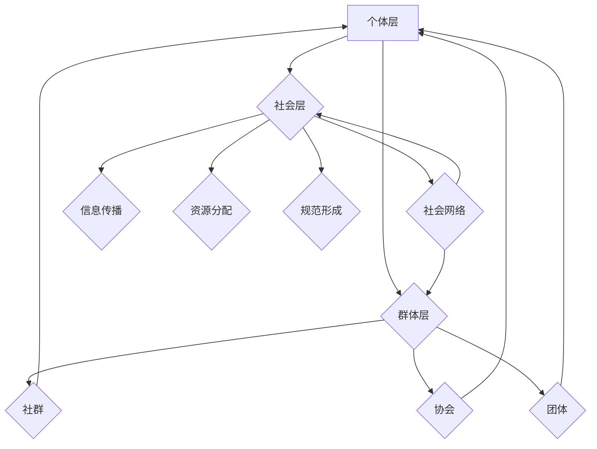
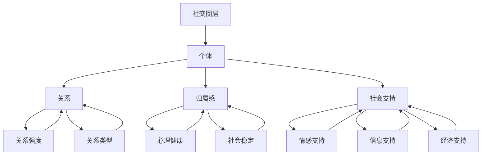

                 

### 第1章：社交圈层的概念与重要性

#### 1.1 社交圈层的定义与基本特征

社交圈层是指由一组个体组成的社会网络，这些个体之间通过不同的关系紧密连接。社交圈层的基本特征包括：

- **多样性**：社交圈层中的个体可以具有不同的背景、兴趣和角色。
- **层次性**：社交圈层可以按照关系强度和影响范围进行层次划分。
- **动态性**：社交圈层的组成和结构会随着时间和情境的变化而发生变化。

社交圈层不仅仅是一个简单的网络结构，它更是一种社会现象，深刻影响着个体的行为、思维和情感。

#### 1.2 社交圈层在社会中的角色

社交圈层在社会中扮演着多种重要角色：

- **信息传播**：社交圈层可以作为信息传播的渠道，个体之间的互动促进了信息的流通。
- **社会支持**：社交圈层为个体提供了情感支持和资源，有助于应对生活中的挑战。
- **社会规范**：社交圈层中的个体往往遵循共同的价值观和行为准则，这些规范对成员的行为有着重要的影响。

#### 1.3 社交圈层与个人归属感的关系

社交圈层与个人的归属感密切相关。归属感是指个体在特定社会团体中感受到的安全、认同和价值的综合体验。

- **归属感的来源**：社交圈层通过提供认同感、支持感和归属感来满足个人的心理需求。
- **归属感的强化**：社交圈层中的互动和共同经历可以强化个体的归属感。
- **归属感的影响**：强烈的归属感有助于提升个体的幸福感和生活质量。

#### 1.4 社交圈层的重要性探讨

社交圈层的重要性不仅体现在个人层面，也在更广泛的社会层面上体现出来：

- **社会稳定**：健康的社交圈层有助于社会的稳定和和谐。
- **创新与进步**：多元的社交圈层可以促进思想碰撞，激发创新和进步。
- **社会资源分配**：社交圈层影响着个体获取社会资源的机会，从而影响其社会地位。

综上所述，社交圈层作为一种重要的社会结构，对个体的生活和社会的运转都有着深远的影响。在接下来的章节中，我们将深入探讨社交圈层的形成、演变以及构建和维护的策略。

#### 1.4 社交圈层的重要性探讨

社交圈层作为一种重要的社会结构，其重要性可以从多个维度进行探讨：

**社会连接的纽带**：社交圈层是人与人之间建立联系的桥梁。通过社交圈层，个体能够跨越不同的社会界限，与来自不同背景的人建立联系。这种联系不仅有助于信息的传播和交流，还能够促进社会融合。

**社会认同的基础**：社交圈层为个体提供了归属感和认同感。个体在社交圈层中找到与自己价值观和兴趣爱好相似的人，从而获得情感上的共鸣和支持。这种认同感有助于个体建立自我认同，增强自信心和自尊心。

**社会资源的获取**：社交圈层是获取社会资源的重要渠道。无论是职业发展、教育机会还是社会地位，社交圈层都为个体提供了丰富的机会。通过社交圈层，个体能够接触到更多的信息和资源，从而提升自己的竞争力。

**社会规范和价值观的传递**：社交圈层中的个体往往遵循共同的价值观和行为准则。这些规范和价值观通过社交圈层的互动和传递，对个体行为产生重要影响。健康的社交圈层有助于培养积极的社会风气和良好的道德观念。

**社会创新和进步的推动力**：社交圈层中的多元互动和思想碰撞是创新的重要源泉。通过社交圈层，不同的观点和想法得以交流和碰撞，从而激发新的创意和灵感。这种创新动力有助于推动社会的进步和发展。

**社会稳定的保障**：健康的社交圈层有助于社会的稳定和和谐。社交圈层中的个体通过相互支持和合作，能够更好地应对社会挑战和压力，减少社会冲突和矛盾。这种稳定性对于维护社会秩序和促进社会繁荣具有重要意义。

**个体心理健康的影响**：社交圈层对个体的心理健康有着重要的影响。健康的社交圈层能够为个体提供情感支持和安全感，有助于减轻压力和焦虑。相反，不健康的社交圈层可能会导致个体的孤独感、焦虑和抑郁。

总之，社交圈层作为一种复杂的社会结构，对个体和社会都具有重要的影响。理解社交圈层的作用和机制，有助于我们更好地构建和维护健康的社交圈层，从而促进个体和社会的全面发展。

#### 1.5 社交圈层的多层次结构与联系

社交圈层并非简单的线性结构，而是一个多层次、多维度的复杂网络。为了更好地理解社交圈层的运作机制，我们可以从以下几个层次进行探讨：

**1. 微观层次：个体层**

在社交圈层的最微观层次，个体是基本的组成单元。每个个体都有其独特的属性和特征，如年龄、性别、职业、兴趣爱好等。个体之间的关系形成了社交圈层的基本骨架。这种关系可以是直接的，如亲属、朋友、同事，也可以是间接的，如共同的朋友、同事或兴趣小组的成员。

**2. 中观层次：群体层**

在社交圈层的中观层次，个体通过共同的特征或利益形成不同的群体。这些群体可以是基于共同兴趣的社群、基于职业的协会、基于共同价值观的团体等。群体之间通过个体建立联系，形成了更加复杂的社交网络。群体的互动和合作对社交圈层的稳定性和发展具有重要作用。

**3. 宏观层次：社会层**

在社交圈层的宏观层次，多个群体和个体通过不同渠道和方式相互联系，构成了更广泛的社会网络。这个层次上的社交圈层不仅仅局限于某个小团体或社区，而是跨越了更广泛的社会范围。宏观层次上的社交圈层对社会的影响更为深远，包括信息传播、社会资源分配、社会规范的形成等方面。

**层次之间的联系**

社交圈层的多层次结构并不是孤立的，而是相互联系、相互影响的。个体层和群体层之间的联系主要体现在个体之间的互动和合作。通过这些互动和合作，个体能够加入不同的群体，扩展自己的社交网络。群体层和社会层之间的联系则体现在群体之间的关系和社会结构。不同群体之间的互动和合作，形成了更为复杂和多元的社会网络。

**Mermaid 流程图**

为了更直观地展示社交圈层的多层次结构，我们可以使用 Mermaid 流程图来描述。以下是社交圈层多层次结构的 Mermaid 图表示例：

通过 Mermaid 流程图，我们可以清晰地看到社交圈层的多层次结构及其相互联系。这种结构不仅有助于我们理解社交圈层的运作机制，也为进一步研究和分析社交圈层提供了基础。

### 核心概念与联系

在探讨社交圈层的概念与重要性时，我们需要明确几个核心概念及其相互关系，以便更深入地理解这一社会现象。

**核心概念：**

1. **社交圈层（Social Circle）**：由一组相互联系、相互作用的个体组成的社会网络。
2. **个体（Individual）**：社交圈层的最小单位，具有独特的属性和特征。
3. **关系（Relationship）**：个体之间的相互作用和连接，可以是直接的，如朋友、亲戚，也可以是间接的，如共同的朋友或同事。
4. **归属感（Sense of Belonging）**：个体在特定社会团体中感受到的安全、认同和价值的综合体验。
5. **社会支持（Social Support）**：社交圈层为个体提供的情感、信息和经济上的支持。

**概念实体之间的关系架构：**

1. **社交圈层与个体**：社交圈层由个体组成，每个个体在社交圈层中扮演不同的角色，形成复杂的网络结构。个体的互动和合作构建了社交圈层的基本骨架。

2. **关系与社交圈层**：关系是社交圈层的连接纽带，个体之间的直接和间接关系构成了社交圈层的核心。这些关系的强度和类型影响着社交圈层的稳定性和动态性。

3. **归属感与社会支持**：归属感是个体在社交圈层中的心理需求，而社会支持是社交圈层为个体提供的外部资源。归属感和社会支持相互促进，共同维护个体的心理健康和社会稳定。

4. **社交圈层与社会网络**：社交圈层是社会网络的一部分，更广泛的社会网络由多个社交圈层构成。社交圈层在社会网络中发挥着重要作用，如信息传播、资源分配和社会规范的形成。

**Mermaid 流�程图：**

为了更直观地展示这些核心概念及其相互关系，我们可以使用 Mermaid 流程图进行描述。以下是社交圈层核心概念关系的 Mermaid 图表示例：

通过这个 Mermaid 流程图，我们可以清晰地看到社交圈层核心概念之间的关系架构。这种架构有助于我们深入理解社交圈层的运作机制，为进一步研究和应用提供理论支持。

### 第2章：多元关系网络的形成与演变

#### 2.1 多元关系网络的定义与类型

多元关系网络（Multi-Relational Network）是指由多个关系类型构成的复杂网络结构。与简单的线性关系网络不同，多元关系网络中的个体之间存在着多种不同类型的关系，这些关系可以是直接的，如朋友、同事，也可以是间接的，如共同的朋友、共同的工作伙伴等。多元关系网络的定义和类型可以从以下几个方面进行理解：

1. **定义**：多元关系网络是一种基于多个关系类型的复杂网络结构，其中每个节点代表一个个体，边代表个体之间的关系。这种网络结构不仅包含了单一关系网络的信息，还包含了个体之间多种关系的组合和相互作用。

2. **类型**：多元关系网络可以分为几种基本类型：

   - **星型网络**：在星型网络中，一个核心个体与其他多个个体之间存在直接关系，而其他个体之间没有直接联系。这种网络结构在社交圈层中较为常见，如某些核心人物与周围朋友的关系。

   - **环型网络**：在环型网络中，每个个体都与相邻的个体存在直接关系，形成一个闭合的环。这种网络结构在团队合作中较为常见，如团队成员之间的互动。

   - **网状网络**：在网状网络中，个体之间存在着复杂的直接和间接关系，形成一个网状结构。这种网络结构在大型社交网络中较为常见，如社交网站中的好友关系。

3. **特点**：多元关系网络具有以下特点：

   - **多样性**：多元关系网络中的关系类型多样，个体之间通过多种不同的关系连接，这使得网络结构更加复杂和多样化。

   - **动态性**：多元关系网络是动态变化的，个体之间的关系会随着时间、情境和个人需求的变化而发生变化。

   - **复杂性**：多元关系网络包含大量的关系和节点，这使得网络结构具有较高的复杂性和难以预测性。

   - **强连通性**：多元关系网络中的个体往往具有较高的连通性，个体之间通过多种关系相互连接，这使得信息传播和资源获取更加高效。

#### 2.2 社交圈层在网络中的形成

社交圈层是多元关系网络的一个典型例子。社交圈层在网络中的形成过程可以从以下几个方面进行理解：

1. **初始形成**：社交圈层的形成通常始于个体之间的直接关系。这些关系可以是基于共同兴趣、价值观、地理位置或其他相似特征形成的。在初始阶段，个体之间的关系较为简单，网络结构较为稀疏。

2. **逐步扩展**：随着个体之间互动的增多，社交圈层逐渐扩展。个体通过现有关系结识新的个体，形成更多的关系连接。这个过程可以是自发的，也可以是通过社交活动、工作机会等外部因素推动的。

3. **多重关系**：在社交圈层的形成过程中，个体之间会建立多种不同类型的关系。这些关系不仅包括直接的亲属、朋友关系，还包括通过共同兴趣、工作、学习等渠道建立的关系。

4. **网络结构演变**：随着社交圈层中关系的增加和复杂化，网络结构也会发生演变。从简单的星型或环型结构，逐渐发展成为复杂的网状结构。这种结构演变使得社交圈层更加稳定和多样化。

#### 2.3 社交圈层的演变过程

社交圈层的演变是一个复杂的过程，受到多种因素的影响。以下是社交圈层演变过程中的几个关键阶段：

1. **初始阶段**：在这个阶段，社交圈层中的个体数量较少，关系相对简单。个体之间的互动主要基于直接的关系，如朋友、亲戚等。

2. **扩展阶段**：随着个体之间的互动增多，社交圈层逐渐扩展。个体通过多种渠道结识新的个体，形成更多的关系连接。这个阶段的社交圈层结构开始变得复杂，个体之间的关系种类和数量都在增加。

3. **稳定阶段**：在扩展阶段之后，社交圈层进入稳定阶段。在这个阶段，社交圈层的结构和关系相对稳定，个体之间的互动和合作保持在一定的水平。

4. **再扩展阶段**：随着时间的推移，社交圈层可能会再次进入扩展阶段。个体之间的互动和合作可能会导致新的关系形成，使得社交圈层进一步扩展。

5. **衰退阶段**：在某些情况下，社交圈层可能会进入衰退阶段。这个阶段通常是由于个体之间的互动减少、关系破裂或其他外部因素导致的。在衰退阶段，社交圈层的结构和关系会逐渐减弱。

#### 2.4 社交圈层演化的影响因素

社交圈层的演化受到多种因素的影响，包括以下几个方面：

1. **个体因素**：个体的行为、需求和价值观是影响社交圈层演化的关键因素。个体的加入和退出、关系的建立和断裂都会对社交圈层的结构和稳定性产生影响。

2. **环境因素**：外部环境的变化，如社会文化、经济状况、科技发展等，也会影响社交圈层的演化。例如，社会文化变迁可能导致社交圈层的价值观和行为准则发生变化。

3. **关系强度**：关系强度是影响社交圈层稳定性的重要因素。强关系通常意味着个体之间的互动和合作更为紧密，而弱关系则可能导致社交圈层的松散和不稳定。

4. **网络密度**：网络密度是指社交圈层中节点和边的关系密度。高网络密度通常意味着个体之间的联系更为紧密，而低网络密度则可能导致社交圈层的松散和不稳定。

5. **社交媒介**：随着社交媒体的普及，社交媒介对社交圈层的演化产生了重要影响。社交媒介为个体提供了更多的互动和合作机会，有助于社交圈层的扩展和稳定。

综上所述，多元关系网络的形成与演变是一个复杂而动态的过程，受到多种因素的影响。理解社交圈层的形成和演化过程，有助于我们更好地构建和维护健康的社交圈层，提升个人的归属感和幸福感。

### 多元关系网络的形成过程

多元关系网络的形成是一个复杂而动态的过程，涉及多个因素和阶段。以下详细探讨这一过程，以帮助读者更好地理解。

#### 1. 初始节点与关系建立

多元关系网络的初始阶段通常由一组核心节点（个体）开始，这些节点通过直接或间接的关系建立初步的连接。这个过程可以看作是社交圈层的种子阶段。

- **直接关系建立**：个体可以通过面对面互动、共同的兴趣爱好、家庭背景等方式建立直接关系。
- **间接关系建立**：个体可以通过共同的朋友、同事、同学等建立间接关系。

这些初步的关系构成了多元关系网络的基础，为后续的扩展提供了基础。

#### 2. 关系扩展与网络成长

随着初始节点之间的互动增多，网络开始扩展，新的节点和关系逐渐加入。

- **同质扩展**：个体倾向于与具有相似背景、兴趣和价值观的人建立关系，这促进了同质群体的形成。
- **异质扩展**：个体也会通过与不同背景、兴趣和价值观的人建立关系，从而扩大自己的社交圈层。

这个过程使得网络结构更加复杂，个体之间的关系种类和数量都在增加。

#### 3. 关系强度与稳定性

在关系扩展的过程中，关系的强度和稳定性起着关键作用。

- **强关系**：强关系通常指的是亲密的朋友、家庭成员等。这些关系具有较强的情感联系，具有较高的稳定性和持续力。
- **弱关系**：弱关系通常指的是较为疏远的同学、同事、偶尔互动的邻居等。这些关系虽然情感联系较弱，但在信息传播和资源获取方面具有一定的作用。

关系的强度和稳定性决定了网络的结构和功能。强关系有助于形成紧密的社群，而弱关系则有助于拓展社交圈层的范围。

#### 4. 网络结构演变

随着关系的不断建立和变化，多元关系网络的架构也在不断演变。

- **星型结构**：在初期，网络可能呈现出星型结构，即一个核心节点与其他多个节点建立直接关系。
- **环型结构**：随着关系的增加，网络可能逐渐形成环型结构，即每个节点都与相邻的节点建立直接关系。
- **网状结构**：在成熟阶段，网络结构可能演变为网状结构，即个体之间形成复杂的直接和间接关系。

网状结构具有较高的复杂性和灵活性，能够适应不同的社交需求和情境变化。

#### 5. 关键因素与动态演变

多元关系网络的演变受到多种因素的影响，包括：

- **个体行为**：个体的加入、退出、互动方式等直接影响网络的形成和演变。
- **环境变化**：社会文化、经济状况、科技发展等外部环境变化也会对网络结构产生影响。
- **关系强度**：关系的强弱影响网络稳定性和功能。
- **网络密度**：网络中节点和边的关系密度影响网络的连接性和稳定性。

这些因素相互作用，共同推动多元关系网络的动态演变。

#### 6. 社交媒介的作用

随着社交媒体的普及，社交媒介对多元关系网络的形成和演变产生了深远影响。

- **信息传播**：社交媒体为个体提供了便捷的信息传播渠道，促进了信息的快速传播和共享。
- **关系管理**：社交媒体使个体能够更方便地管理和维护人际关系，增强关系的稳定性和紧密性。
- **网络扩展**：社交媒体为个体提供了更多的社交机会，有助于拓展社交圈层，增加新的关系连接。

总之，多元关系网络的形成是一个复杂而动态的过程，涉及多个因素和阶段。理解这一过程有助于我们更好地构建和维护健康的社交圈层，提升个人的归属感和幸福感。

### 社交圈层的演变过程

社交圈层的演变过程是一个动态的、复杂的过程，受到多种因素和阶段的影响。以下是详细分析社交圈层演变过程中各个阶段及其影响因素。

#### 1. 初期形成阶段

社交圈层的初期形成阶段是社交网络的基础构建阶段。在这个阶段，个体通过共同的兴趣、价值观、地理位置等因素开始建立初步联系。

- **个体互动**：个体之间的初次接触和互动是社交圈层形成的关键。这种互动可以通过共同的社交活动、线上交流平台等实现。
- **关系建立**：在这个阶段，个体之间建立的关系主要是直接关系，如朋友、同事等。这些直接关系构成了社交圈层的核心骨架。

影响因素：

- **社会文化**：社会文化背景对社交圈层的形成有重要影响。不同的文化环境可能塑造不同的社交习惯和关系模式。
- **个人需求**：个体的需求和愿望也会影响社交圈层的形成。例如，寻求社交支持、寻找共同爱好等。

#### 2. 扩展阶段

在初期形成阶段之后，社交圈层进入扩展阶段。这个阶段的特点是个体数量的增加和关系类型的多样化。

- **关系扩展**：个体通过现有关系结识新的个体，从而扩大自己的社交圈层。这种扩展可以是同质扩展（与具有相似背景的个体建立关系）也可以是异质扩展（与具有不同背景的个体建立关系）。
- **网络密度增加**：随着个体数量的增加和关系类型的多样化，社交圈层的网络密度也随之增加，个体之间的连接变得更加紧密。

影响因素：

- **社交媒介**：社交媒体为个体提供了便捷的扩展社交圈层的机会。通过社交媒体，个体可以更容易地结识新的朋友，拓展自己的社交网络。
- **环境变化**：外部环境的变化，如搬家、换工作等，也会促使个体扩展社交圈层。

#### 3. 稳定阶段

在扩展阶段之后，社交圈层进入稳定阶段。在这个阶段，社交圈层中的关系和结构相对稳定，个体之间的互动和合作保持在一定的水平。

- **关系稳定性**：在这个阶段，个体之间的关系变得更加稳定和持久。强关系（如亲密的朋友和家庭关系）在这个阶段尤为重要，它们为社交圈层提供了坚实的基础。
- **网络结构稳定**：社交圈层的网络结构也相对稳定，个体之间的连接关系保持一定的密度和强度。

影响因素：

- **社交媒介的作用**：虽然社交媒介在扩展阶段起到了重要作用，但在稳定阶段，面对面的互动和深度交往成为维护社交圈层稳定的关键。
- **个体行为**：个体的行为习惯和社交策略也会影响社交圈层的稳定性。例如，个体是否积极参与社交活动、是否愿意维护人际关系等。

#### 4. 再扩展阶段

在某些情况下，社交圈层可能会再次进入扩展阶段。这个阶段通常是由于以下因素导致的：

- **个体变化**：个体的变化，如职业晋升、子女成长等，可能导致社交圈层的再扩展。
- **环境变化**：外部环境的变化，如社会文化的变迁、经济状况的波动等，也会促使社交圈层扩展。

在再扩展阶段，社交圈层中的个体和关系将进一步增加和多样化，网络结构也将变得更加复杂。

#### 5. 衰退阶段

社交圈层的衰退阶段通常是由于以下因素导致的：

- **个体流失**：个体因各种原因（如搬家、工作变动等）离开社交圈层，导致社交圈层中的节点数量减少。
- **关系断裂**：个体之间的关系因各种原因（如利益冲突、价值观差异等）断裂，导致社交圈层中的边数量减少。

在衰退阶段，社交圈层中的关系和结构将逐渐减弱，网络密度和稳定性降低。

#### 6. 影响因素

社交圈层的演变过程受到多种因素的影响，包括：

- **个体行为**：个体的行为习惯、社交策略和人际关系管理能力对社交圈层的演变具有重要影响。
- **环境变化**：社会文化、经济状况、科技发展等外部环境变化也会影响社交圈层的演变。
- **社交媒介**：社交媒体的发展为社交圈层的形成和演变提供了新的机会和挑战。

综上所述，社交圈层的演变过程是一个复杂而动态的过程，涉及多个阶段和影响因素。理解这一过程有助于我们更好地构建和维护健康的社交圈层，提升个人的归属感和幸福感。

### 社交圈层演化的影响因素

社交圈层的演化是一个复杂的过程，受到多种因素的影响。以下详细探讨这些因素及其对社交圈层的影响。

#### 1. 个体行为因素

个体行为是社交圈层演变的基础，个体的加入、退出、互动和关系管理直接影响社交圈层的结构和稳定性。

- **加入与退出**：个体的加入和退出是社交圈层演变的关键因素。新个体的加入可以引入新的关系和资源，促进社交圈层的扩展和多样化；而个体的退出则可能导致关系断裂和网络结构的变化。
- **互动强度**：个体之间的互动强度和频率影响关系的稳定性和质量。高频的互动可以加深关系，增强归属感；而低频的互动可能导致关系疏远，甚至断裂。
- **关系管理**：个体如何管理自己的关系网络也影响社交圈层的演化。有效的社交策略和关系管理可以帮助个体建立和维护稳定的社交圈层。

#### 2. 环境因素

外部环境的变化是影响社交圈层演化的关键因素之一。社会文化、经济状况、科技发展等因素都会对社交圈层产生深远影响。

- **社会文化**：社会文化的变迁会影响个体的价值观和行为模式，从而影响社交圈层的结构和功能。例如，随着文化多样性的增加，社交圈层可能会变得更加多元化和包容。
- **经济状况**：经济状况的变化会影响个体的生活条件和资源获取能力，从而影响社交圈层的稳定性和发展。经济繁荣时期，社交圈层可能更加活跃和稳定；而在经济衰退时期，社交圈层可能会面临更多的挑战。
- **科技发展**：科技的发展，尤其是互联网和社交媒体的普及，极大地改变了人们的社交方式和关系模式。社交媒介为个体提供了更多的社交机会和平台，促进了社交圈层的扩展和演变。

#### 3. 关系强度因素

关系的强度是影响社交圈层稳定性和功能的重要因素。关系的强度通常由关系的紧密程度、互动频率和信任程度等因素决定。

- **强关系**：强关系是指紧密、信任和频繁互动的关系，如家庭关系和亲密朋友。强关系在社交圈层中扮演重要角色，能够提供情感支持和社会资源，增强个体的归属感和安全感。
- **弱关系**：弱关系是指较为疏远、信任度较低的关系，如泛泛之交和业务合作伙伴。弱关系虽然情感联系较弱，但在信息传播和资源获取方面具有一定的作用。

关系的强度和类型会影响社交圈层的结构和功能。强关系有助于形成紧密的社群，而弱关系则有助于拓展社交圈层的范围。

#### 4. 社交媒介因素

社交媒介在社交圈层演化中扮演着重要角色。互联网和社交媒体的发展为个体提供了更多的社交机会和平台，改变了人们的社交方式和关系模式。

- **信息传播**：社交媒介为个体提供了快速、便捷的信息传播渠道，促进了信息的共享和传播，从而加强了社交圈层的信息流动和互动。
- **关系管理**：社交媒介使得个体能够更方便地管理和维护人际关系。通过社交媒体，个体可以随时关注朋友的动态，参与社交活动，从而增强关系的稳定性和紧密性。
- **网络扩展**：社交媒介为个体提供了更多的社交机会，使得个体能够更容易地结识新的朋友，从而拓展社交圈层。

社交媒介不仅改变了社交圈层的形式，还对其演化产生了深远的影响。

#### 5. 其他因素

除了上述因素外，还有一些其他因素也会影响社交圈层的演化，如社会压力、个人需求变化等。

- **社会压力**：社会压力，如工作压力、学业压力等，可能会影响个体的社交行为和关系模式。高社会压力可能导致个体减少社交互动，影响社交圈层的稳定性和功能。
- **个人需求变化**：个体的需求和愿望变化也会影响社交圈层的演化。例如，随着个体成长和职业发展，他们对社交圈层的需求和期望可能会发生变化，从而影响社交圈层的结构和功能。

综上所述，社交圈层的演化受到多种因素的影响，包括个体行为、环境因素、关系强度、社交媒介和其他因素。理解这些因素及其对社交圈层的影响，有助于我们更好地构建和维护健康的社交圈层，提升个人的归属感和幸福感。

### 社交圈层的构建策略

构建一个健康、有效的社交圈层需要明确的策略和具体的方法。以下详细探讨几种关键策略和具体步骤。

#### 1. 明确个人目标与需求

在构建社交圈层之前，个体需要明确自己的目标和需求。这包括：

- **职业目标**：个人需要了解自己希望在职业领域实现什么目标，从而确定需要哪些资源和关系来支持职业发展。
- **个人兴趣**：了解自己的兴趣爱好，可以帮助个体找到志同道合的朋友，共同参与活动，增强社交圈层的活力。
- **社交需求**：明确个人对社交的需求，例如寻求情感支持、获取信息资源等，有助于制定针对性的社交策略。

#### 2. 选择合适的社交平台

选择合适的社交平台是构建社交圈层的关键步骤。以下是几种常见的社交平台及其特点：

- **线上社交网络**：如Facebook、LinkedIn等，这些平台便于个体拓展社交圈层，建立广泛的联系。
- **专业社群**：如行业论坛、专业协会等，这些平台有助于个体结识行业内专家和同行，获取专业知识和资源。
- **线下活动**：如聚会、讲座、行业交流活动等，这些活动为个体提供了面对面交流的机会，有助于建立深厚的社交关系。

根据个人需求和目标选择合适的社交平台，可以提高社交圈层建设的效率。

#### 3. 拓展社交网络

在确定合适的社交平台后，个体需要积极拓展自己的社交网络。以下是一些建议：

- **主动参与**：积极参与社交平台上的活动，如讨论、分享、参加线上或线下聚会等，这样可以增加与他人互动的机会。
- **建立联系**：主动与他人建立联系，可以通过私信、评论、共同参与活动等方式，增加互动频率，加深彼此的了解。
- **交换信息**：在交流过程中，可以主动分享自己的经验和见解，同时积极获取他人的信息资源，建立互惠互利的关系。

#### 4. 维护社交关系

维护社交关系是构建稳定社交圈层的重要环节。以下是一些建议：

- **定期互动**：定期与朋友、同事和社交网络中的其他个体保持互动，可以通过私信、电话、见面等方式进行。
- **提供帮助**：在他人需要帮助时，主动提供支持和帮助，这样可以增强关系的紧密性和信任度。
- **保持联系**：即使暂时没有交流，也要保持联系，可以通过发送节日祝福、生日问候等方式，维持关系的稳定性。

#### 5. 建立强关系

建立强关系是构建健康社交圈层的关键。以下是一些建议：

- **共同经历**：通过共同参与活动、旅行、项目合作等，增强彼此的互动和联系。
- **情感支持**：在朋友遇到困难时，提供情感支持，共同度过难关，这样可以加深关系的信任和稳定性。
- **长期合作**：在工作和生活中，寻找与自己的价值观和目标相契合的伙伴，建立长期合作关系。

通过以上策略，个体可以有效地构建一个健康、稳定的社交圈层，提升个人在社交圈层中的归属感和幸福感。

### 社交圈层的维护技巧

维护一个健康的社交圈层需要持续的努力和技巧。以下详细探讨几个关键技巧：

#### 1. 定期互动与沟通

定期与社交圈层中的成员保持互动和沟通是维护关系的重要手段。以下是一些具体的方法：

- **定期聚会**：定期组织或参与线下聚会，如聚餐、运动活动等，增强与朋友的情感联系。
- **线上交流**：通过社交媒体、即时通讯工具等线上平台，定期分享生活动态、心得体会，保持联系。
- **及时回应**：对朋友的信息、评论和邀请及时回应，展示自己的关心和重视。

#### 2. 建立信任与支持

信任是社交圈层稳定性的基石。以下是一些建立和维护信任的方法：

- **诚实与透明**：在交流中保持诚实和透明，不隐瞒重要信息，增强信任感。
- **提供支持**：在朋友遇到困难时，主动提供帮助和支持，展示自己的可靠性和关爱。
- **兑现承诺**：遵守承诺，履行自己答应的事项，树立良好的信任形象。

#### 3. 保持关系多样化

一个多样化的社交圈层能够提供更广泛的支持和资源。以下是一些保持关系多样化的方法：

- **结识新朋友**：积极参与新的社交活动，结识不同背景和兴趣的人，扩大自己的社交网络。
- **跨界交流**：尝试与不同行业、不同领域的朋友交流，获取新的知识和见解，丰富社交圈层的内涵。
- **合作共赢**：在合作项目中，与不同背景的人合作，共同解决问题，增强彼此的了解和信任。

#### 4. 适当展示自我

在社交圈层中，适当展示自己的个性、兴趣和特长，有助于加深他人对自己的了解和认同。以下是一些建议：

- **分享个人经历**：通过分享个人故事、经历和感悟，展示自己的个性和价值。
- **参与社交活动**：积极参与社交圈层中的各种活动，展示自己的热情和能力。
- **提出见解**：在讨论中发表自己的见解和观点，展示自己的知识和见解。

#### 5. 防范社交圈层中的负面影响

社交圈层中可能会存在一些负面影响，如冲突、背叛等。以下是一些防范措施：

- **建立规则**：明确社交圈层中的行为准则和规范，避免冲突和误解。
- **沟通技巧**：学习有效的沟通技巧，避免因沟通不畅引起的矛盾和误解。
- **保持独立**：保持独立思考和判断能力，不受他人情绪或行为的影响。

通过以上技巧，个体可以有效地维护社交圈层，保持关系的稳定性和健康性，提升个人在社交圈层中的归属感和幸福感。

### 社交圈层的适应性调整

社交圈层的适应性调整是一个关键过程，能够确保社交圈层在动态变化的环境中保持稳定和功能。以下详细探讨社交圈层在不同情境下的适应性调整策略：

#### 1. 应对人际关系变化

人际关系是社交圈层中的核心元素，但其变化是不可避免的。以下是一些建议来应对人际关系的变化：

- **接受自然变化**：理解人际关系的变化是自然的，如朋友搬走、工作变动等，接受这些变化是适应社交圈层演变的第一步。
- **保持沟通**：即使关系暂时疏远，也要保持沟通，通过电话、社交媒体等方式保持联系，防止关系断裂。
- **寻找替代关系**：在原有关系变化时，积极寻找新的朋友和社交机会，以保持社交圈层的稳定性和多样性。

#### 2. 适应社会环境变化

社会环境的变化，如社会文化、经济状况等，也会对社交圈层产生影响。以下是一些适应性调整策略：

- **适应社会趋势**：了解当前的社会趋势和文化，调整自己的社交行为和关系模式，以适应新的社会环境。
- **多元化社交**：在社交圈层中保持多样性的关系，有助于应对社会环境的变化，使社交圈层更加稳定和灵活。
- **利用社交媒介**：利用社交媒体和在线平台，拓展社交网络，增强社交圈层的适应性和灵活性。

#### 3. 应对个人需求变化

个人的需求和发展也会随着时间而变化，社交圈层的适应性调整需要考虑这些变化。以下是一些建议：

- **重新评估目标**：在个人目标发生变化时，重新评估社交圈层对个人发展的支持，调整社交圈层的结构和功能。
- **调整互动频率**：根据个人需求的变化，调整与社交圈层成员的互动频率，确保关系维持在一个适当的水平。
- **寻求新机会**：积极参与新的社交活动，结识新朋友，以适应个人需求的变化，保持社交圈层的活力。

#### 4. 管理社交圈层中的冲突

社交圈层中的冲突是不可避免的，但有效的管理可以减少冲突对社交圈层的负面影响。以下是一些建议：

- **建立沟通机制**：在社交圈层中建立有效的沟通机制，鼓励成员表达自己的观点和感受，避免误解和冲突的发生。
- **寻求共识**：在出现冲突时，寻求共识和解决方案，通过对话和妥协来化解矛盾。
- **保持冷静**：在处理冲突时，保持冷静和理性，避免情绪化的行为，以减少冲突的负面影响。

#### 5. 应对技术进步

随着技术的发展，社交媒体和数字平台的普及对社交圈层产生了深远影响。以下是一些适应性调整策略：

- **适应数字社交**：学会利用社交媒体和数字工具，扩展社交网络，保持与远程朋友的联系。
- **平衡线上线下社交**：在数字社交和面对面社交之间保持平衡，确保社交圈层的多样性和稳定性。
- **技术辅助社交**：利用技术工具，如社交媒体分析、社交网络分析等，了解社交圈层中的动态，优化社交策略。

通过以上适应性调整策略，社交圈层可以在不断变化的环境中保持稳定和功能，确保个体在社交圈层中获得持续的归属感和支持。

### 第4章：社交圈层中的关系管理

#### 4.1 关系管理的概念与原则

关系管理是指个体或组织在社交圈层中通过策略和行动来维护、发展和管理人际关系的活动。有效的关系管理不仅能够增强个体在社交圈层中的归属感和幸福感，还能为个人和组织的长期发展提供支持。以下详细探讨关系管理的概念与原则。

**1. 概念**

关系管理涉及以下几个方面：

- **维护现有关系**：通过定期互动、沟通和支持，保持与现有朋友的紧密联系。
- **发展新关系**：通过主动参与社交活动、结识新朋友，扩展自己的社交网络。
- **管理冲突**：在关系中出现矛盾和冲突时，通过有效的沟通和解决策略，化解冲突，维护关系的稳定性。
- **资源交换**：通过关系网络获取信息和资源，实现互利共赢。

**2. 原则**

关系管理的原则包括以下几点：

- **互惠性**：关系双方在互动中应遵循互惠原则，相互支持和帮助，建立互利的关系。
- **诚信性**：在关系中保持诚实和透明，遵守承诺，建立信任和尊重。
- **持续性**：保持关系的长期稳定，通过持续的互动和沟通，增强关系的持久性。
- **适应性**：根据环境和情境的变化，灵活调整关系管理和互动策略，以适应新的需求。

#### 4.2 社交圈层中的沟通策略

沟通是关系管理的重要组成部分，有效的沟通策略能够增强关系的稳定性，提升人际互动的质量。以下是一些关键的沟通策略：

**1. 积极倾听**

积极倾听是指在全神贯注地听对方讲话的同时，通过肢体语言、反馈和提问等方式展示自己的关注和理解。以下是一些积极倾听的技巧：

- **保持眼神接触**：与对方保持适当的眼神接触，展示自己的诚意和专注。
- **点头和微笑**：通过点头、微笑等非语言信号，表达对对方的关注和理解。
- **复述和提问**：在对方讲话结束后，复述关键信息，并提出相关的问题，以确保理解无误。

**2. 明确表达**

明确表达是指在与他人沟通时，清晰地表达自己的想法、感受和需求。以下是一些明确表达的技巧：

- **使用具体语言**：避免使用模糊、抽象的语言，使用具体的描述来传达信息。
- **表达感受和需求**：在表达观点时，清晰地表达自己的感受和需求，避免隐藏自己的真实想法。
- **避免指责和批评**：在沟通中，避免使用指责和批评的语言，而是采取建设性的方式提出问题。

**3. 情绪管理**

在沟通中，情绪管理至关重要。以下是一些情绪管理的策略：

- **自我情绪调节**：在情绪激动时，通过深呼吸、暂时离开现场等方式，调节自己的情绪。
- **同理心**：在对方情绪激动时，展示同理心，理解对方的感受，以平和的态度进行沟通。
- **避免冲突升级**：在沟通中，避免将小问题扩大化，通过妥协和寻求共识来化解冲突。

**4. 适时反馈**

适时反馈是指在与他人互动过程中，及时给予对方反馈，以促进理解和合作。以下是一些适时反馈的技巧：

- **正面反馈**：在对方做得好的时候，及时给予正面反馈，以增强对方的自信心和积极性。
- **建设性反馈**：在对方需要改进时，提供具体、有建设性的反馈，帮助对方提升。
- **及时反馈**：在交流结束后，及时回顾和总结交流内容，确保双方对信息的理解一致。

通过有效的沟通策略，个体可以更好地管理社交圈层中的关系，增强互动的质量，提升人际交往的满意度。

#### 4.3 社交圈层中的冲突解决

社交圈层中的冲突是不可避免的，但有效的解决策略可以减少冲突对关系的负面影响。以下详细探讨社交圈层中的冲突解决方法：

**1. 识别冲突原因**

解决冲突的第一步是识别冲突的原因。冲突可能源于以下几种情况：

- **价值观差异**：不同的个体可能有不同的价值观和信念，这些差异可能导致冲突。
- **沟通障碍**：由于沟通不畅或误解，个体可能会产生矛盾和冲突。
- **利益冲突**：个体之间的利益可能存在冲突，如资源分配不公、角色冲突等。
- **情感压力**：个人情感压力，如工作压力、家庭问题等，可能导致情绪失控，引发冲突。

为了有效解决冲突，个体需要明确冲突的原因，以便采取针对性的策略。

**2. 建立对话平台**

建立对话平台是解决冲突的关键。以下是一些建立对话平台的方法：

- **选择合适的时间和地点**：选择一个安静、私密的环境，确保双方能够专注地进行对话。
- **设定议程**：在对话前，明确讨论的议程和目标，避免偏离主题。
- **邀请第三方介入**：在冲突严重时，可以邀请一个中立的第三方介入，作为调解者。

**3. 主动沟通与倾听**

在冲突解决过程中，主动沟通和倾听是关键。以下是一些具体的方法：

- **主动沟通**：在对话中，主动表达自己的观点和感受，同时尊重对方的意见。
- **积极倾听**：倾听对方的观点和感受，通过肢体语言和反馈展示自己的理解。
- **提问与澄清**：在对方讲话结束后，通过提问和澄清来确保对信息的准确理解。

**4. 寻求共识**

寻求共识是解决冲突的重要环节。以下是一些寻求共识的方法：

- **共同目标**：明确双方共同的目标和利益，以此为基础寻求共识。
- **妥协与让步**：在冲突解决过程中，双方可能需要做出妥协和让步，以达成共识。
- **制定行动计划**：在达成共识后，制定具体的行动计划，以确保共识得到落实。

**5. 建立长期关系**

解决冲突不仅是为了解决当前的问题，更是为了建立长期稳定的关系。以下是一些建立长期关系的策略：

- **持续沟通**：在冲突解决后，持续与对方保持沟通，确保关系的稳定性。
- **情感支持**：在对方遇到困难时，提供情感支持，增强关系的信任和稳定性。
- **反思与总结**：定期回顾冲突解决的过程和结果，总结经验教训，以改进未来的人际关系管理。

通过有效的冲突解决方法，个体可以维护和改善社交圈层中的关系，增强人际互动的和谐与稳定性。

### 第5章：社交圈层对个人职业发展的影响

#### 5.1 社交圈层在职业网络中的作用

社交圈层在个人职业发展中扮演着至关重要的角色，它不仅为个体提供了职业发展的机会，还促进了职业网络的形成和扩展。以下是社交圈层在职业网络中的作用：

**1. 信息传播渠道**

社交圈层是职业信息传播的重要渠道。通过社交圈层，个体可以获得行业动态、招聘信息、职业机会等关键信息。这些信息有助于个体了解市场趋势和行业变化，从而及时调整自己的职业规划和目标。

**2. 职业资源获取**

社交圈层为个体提供了丰富的职业资源，包括人脉资源、职业指导、职业推荐等。通过社交圈层中的关系网络，个体可以更容易地获取职业机会，获得职业发展的支持。

**3. 职业发展平台**

社交圈层为个体提供了一个职业发展的平台。在这个平台上，个体可以结识业内专家、同行和潜在合作伙伴，参与行业交流、培训和学习活动，提升自己的专业技能和职业素养。

**4. 职业网络支持**

社交圈层为个体提供了职业网络支持。在职业发展过程中，个体可能会遇到各种挑战和困难，社交圈层中的朋友和同事可以提供情感支持、建议和帮助，帮助个体克服困难，实现职业目标。

#### 5.2 社交圈层对职业发展的积极影响

社交圈层对个人职业发展具有多方面的积极影响，以下是一些具体的影响：

**1. 增加职业机会**

通过社交圈层，个体可以更容易地获取职业机会。社交圈层中的朋友和同事可能会推荐工作机会，或者通过自己的关系网络帮助个体找到合适的职位。这种推荐机制不仅提高了求职的成功率，还缩短了求职过程。

**2. 提升专业技能**

社交圈层为个体提供了学习和成长的机会。通过与社交圈层中的专家和同行交流，个体可以学习到最新的行业知识和技能，提升自己的专业能力。此外，社交圈层中的培训和学习活动也为个体提供了提升专业技能的平台。

**3. 拓展职业视野**

社交圈层使个体能够接触到不同行业、不同领域的人和观点。这种多元化的社交环境有助于个体拓宽视野，了解不同职业领域的发展趋势和机遇，从而为自己的职业发展提供更多的选择。

**4. 增强职业安全感**

社交圈层为个体提供了职业安全感。在职业生涯中，个体可能会遇到职业瓶颈或失业风险。通过社交圈层，个体可以保持与职业网络的联系，获取新的职业机会，降低职业风险。

**5. 提升职业满意度**

社交圈层有助于提升个体的职业满意度。通过与社交圈层中的朋友和同事互动，个体可以获得情感支持、职业指导和建议，增强职业自信和成就感。这种积极的社交氛围有助于提升个体的职业幸福感。

#### 5.3 社交圈层对职业发展的潜在挑战

虽然社交圈层对职业发展具有积极影响，但它也带来了一些潜在挑战，以下是一些需要注意的问题：

**1. 关系压力**

社交圈层中的关系可能会对个体产生压力。例如，朋友或同事可能会期望个体在职业发展上给予支持，这种期望可能会导致个体感到负担沉重。

**2. 信息过载**

社交圈层中的信息量可能非常大，个体需要筛选和处理大量的信息。信息过载可能会导致个体难以集中注意力，影响工作效率和职业发展。

**3. 关系疏远**

随着职业发展的变化，个体可能会与一些朋友或同事疏远。这种关系疏远可能会影响社交圈层的稳定性和功能，减少职业网络的支持。

**4. 职业偏见**

社交圈层可能会对个体的职业选择产生偏见。例如，个体可能会因为社交圈层中的朋友或同事的职业选择而受到影响，做出不合适或不符合个人兴趣和能力的职业决策。

**5. 社交媒介依赖**

随着社交媒体的普及，个体对社交媒介的依赖程度逐渐增加。过度依赖社交媒体可能会导致真实社交关系的疏远，影响社交圈层的质量和稳定性。

总之，社交圈层对个人职业发展具有重要影响，它既提供了丰富的机会和支持，也带来了一些潜在挑战。个体需要充分利用社交圈层的优势，同时注意避免和应对这些挑战，以实现职业发展的最大化。

### 第6章：社交圈层的数字化趋势

随着互联网和数字技术的发展，社交圈层正在经历深刻的变革。数字化趋势不仅改变了社交圈层的结构和功能，还带来了新的机遇和挑战。

#### 6.1 数字化社交圈层的定义与特点

数字化社交圈层（Digital Social Circle）是指通过数字平台和工具建立的社交圈层。它具有以下特点：

- **虚拟性**：数字化社交圈层主要在虚拟空间中存在，个体通过互联网和社交媒体进行互动和交流。
- **开放性**：数字化社交圈层通常具有开放性，个体可以加入和退出社交圈层，关系更为灵活。
- **互动性**：数字化社交圈层提供了丰富的互动方式，如即时通讯、社交媒体互动、线上活动等，增强了个体之间的互动和联系。
- **信息共享**：数字化社交圈层促进了信息的快速传播和共享，个体可以轻松地分享和获取各种信息。

#### 6.2 社交媒体在社交圈层中的作用

社交媒体是数字化社交圈层的主要载体，它在社交圈层中发挥着重要作用：

- **拓展社交网络**：社交媒体使个体能够轻松地拓展社交网络，结识新的朋友和同行，增加社交圈层的多样性和活力。
- **信息传播**：社交媒体为个体提供了信息传播的渠道，通过分享、转发和评论，信息可以迅速传播，形成广泛的社交影响力。
- **关系维护**：社交媒体为个体提供了便捷的沟通工具，通过点赞、评论、私信等互动方式，个体可以随时与朋友保持联系，维护社交圈层的稳定性。
- **身份认同**：在社交媒体上，个体可以展示自己的兴趣、观点和价值观，增强身份认同，加深社交圈层中的归属感。

#### 6.3 数字化社交圈层的挑战与机遇

数字化社交圈层带来了诸多机遇，同时也带来了一些挑战。

**挑战：**

- **隐私泄露**：数字化社交圈层增加了隐私泄露的风险。个体在社交媒体上分享的信息可能被未经授权的第三方获取，导致隐私泄露。
- **信息过载**：数字化社交圈层中的信息量巨大，个体需要花费大量时间和精力筛选和处理信息，可能导致信息过载，影响工作效率和职业发展。
- **社交疏远**：过度依赖社交媒体可能会使真实社交关系疏远，减少面对面的互动，影响社交圈层的质量和稳定性。
- **数字鸿沟**：数字化社交圈层可能加剧数字鸿沟，使那些缺乏数字技能或技术资源的个体在社交圈层中处于劣势。

**机遇：**

- **资源获取**：数字化社交圈层为个体提供了丰富的资源，如职业机会、专业知识、学习资源等，有助于个人成长和发展。
- **社交多样化**：数字化社交圈层使个体能够接触到来自不同背景和地区的人，增加了社交的多样性和包容性。
- **自我表达**：数字化社交圈层为个体提供了自我表达的平台，通过社交媒体，个体可以展示自己的兴趣、观点和创造力。
- **网络影响力**：在数字化社交圈层中，个体可以通过分享内容和观点，建立自己的网络影响力，提升个人品牌和社会地位。

综上所述，数字化社交圈层为社交圈层带来了新的机遇和挑战。个体需要充分利用数字化工具的优势，同时注意应对数字化带来的风险和挑战，以实现个人在社交圈层中的最佳发展。

### 社交圈层数字化转型的具体实现方法

社交圈层的数字化转型是一个复杂而多层次的过程，涉及技术、策略和文化等多个方面。以下详细探讨社交圈层数字化转型的具体实现方法：

#### 1. 技术层面

**1.1 选择合适的数字平台**

- **社交媒体**：选择适合业务需求和目标受众的社交媒体平台，如LinkedIn、Facebook、微博等，作为社交圈层数字化转型的起点。
- **专业社交网络**：利用行业特定的专业社交网络，如GitHub、Stack Overflow等，拓展专业领域的人际关系和知识共享。

**1.2 建立数字化工具和平台**

- **社群管理系统**：建立社群管理系统，如Slack、Discord等，以方便成员之间的即时沟通和协作。
- **内容管理系统**：搭建内容管理系统，如WordPress、Medium等，用于发布和共享有价值的内容，增强社群的粘性。

**1.3 数据分析和监控**

- **用户数据分析**：利用数据分析工具，如Google Analytics、Tableau等，监控社群的活跃度、用户行为和互动质量。
- **社交圈层监控**：定期分析社交圈层中的关系网络，识别关键节点和影响力人物，以便更好地管理和引导社群。

#### 2. 策略层面

**2.1 明确数字化目标**

- **定位目标用户**：明确数字化转型的目标用户群体，如潜在客户、合作伙伴、行业专家等，制定针对性的数字化策略。
- **设定关键指标**：设定可量化的关键指标（KPI），如用户增长、活跃度、内容传播率等，以衡量数字化转型的效果。

**2.2 内容营销策略**

- **内容策划**：制定内容策划方案，包括文章、视频、图片等多种形式，确保内容的丰富性和多样性。
- **互动推广**：通过互动活动、在线讨论、直播等方式，提升社群的活跃度和参与度。

**2.3 互动与沟通策略**

- **建立有效的沟通机制**：通过定期召开线上会议、设置问答环节、发布问卷调查等方式，确保社群成员之间的有效沟通。
- **个性化互动**：根据用户的行为数据和兴趣偏好，提供个性化的互动体验，提高用户满意度和忠诚度。

#### 3. 文化层面

**3.1 培养数字化文化**

- **推动文化变革**：通过培训和宣传活动，推动组织内部的文化变革，使员工适应数字化工作环境。
- **鼓励创新和试错**：鼓励员工尝试新的数字化工具和方法，允许在尝试过程中犯错误，并从中学习。

**3.2 提升数字化素养**

- **提供培训课程**：为员工提供数字技能培训，提高他们的数字化素养，确保他们能够有效地使用数字化工具。
- **建立知识共享平台**：建立知识共享平台，如内部论坛、学习社区等，促进员工之间的知识交流和共享。

**3.3 强化社会责任**

- **遵守法律法规**：确保数字化活动符合相关法律法规和道德规范，保护用户隐私和信息安全。
- **履行社会责任**：通过数字化活动，传播正能量，承担社会责任，提升企业的社会形象。

通过以上具体实现方法，社交圈层可以实现数字化转型，提升其在数字化环境中的竞争力和影响力。同时，数字化转型也需要不断地调整和优化，以适应不断变化的外部环境和用户需求。

### 数字化社交圈层的实际案例分析

为了更好地理解数字化社交圈层在实践中的应用，以下将分析两个成功的数字化社交圈层案例，并讨论它们的优点和潜在挑战。

#### 案例一：LinkedIn的职业社交圈层

**背景：**LinkedIn是全球最大的职业社交网络，用户可以通过这个平台建立职业关系、分享职业经验和寻找职业机会。

**优点：**
- **广泛的职业网络**：LinkedIn提供了一个庞大的职业网络，用户可以轻松地找到同行业的人、专家和潜在合作伙伴。
- **多样化的互动方式**：LinkedIn支持多种互动方式，如发布和点赞动态、发送私信、参加线上活动等，增强了用户之间的互动和联系。
- **精准的职业信息**：通过LinkedIn，用户可以获取精准的职业信息，如行业动态、招聘信息、培训课程等，有助于职业发展和决策。

**潜在挑战：**
- **信息过载**：随着用户数量的增加，LinkedIn上的信息量也日益庞大，用户可能面临信息过载的问题，难以有效筛选和处理。
- **隐私保护**：LinkedIn需要用户分享大量的个人信息，这增加了隐私泄露的风险，需要用户保持警惕。

#### 案例二：GitHub的开放源代码社交圈层

**背景：**GitHub是一个基于互联网的版本控制系统，广泛用于软件项目的协作开发。它也成为了开发者之间的社交圈层。

**优点：**
- **知识共享**：GitHub鼓励用户分享代码和项目经验，促进了知识的传播和共享，为开发者提供了丰富的学习资源。
- **协作开发**：GitHub支持多人协作开发，用户可以共同编辑代码、提出问题和解决方案，提高了项目的开发效率。
- **透明度**：GitHub上的所有操作都是公开的，用户可以实时查看项目的进展和变化，增强了项目的透明度。

**潜在挑战：**
- **知识产权问题**：在开放源代码项目中，知识产权保护是一个重要问题。开发者需要确保自己的贡献不会侵犯他人的知识产权。
- **项目管理**：随着项目的规模和参与者的增加，项目管理可能会变得复杂，需要有效的项目管理和沟通机制。

通过以上案例分析，我们可以看到数字化社交圈层在实际应用中带来了显著的优点，同时也存在一些潜在挑战。了解这些优点和挑战有助于我们更好地利用数字化社交圈层，实现个人和职业的发展。

### 数字化社交圈层建设的最佳实践与注意事项

在构建数字化社交圈层时，采用最佳实践和注意事项能够提高圈层的健康发展和实际效果。以下是一些具体的建议：

#### 1. 最佳实践

**1.1 明确目标与定位**

在构建数字化社交圈层之前，明确目标群体和圈层定位至关重要。明确目标可以帮助制定有针对性的策略和活动，提高圈层的吸引力和活跃度。

**1.2 优化用户体验**

用户体验是数字化社交圈层成功的关键。通过简化用户界面、提供丰富多样的互动方式、确保内容质量等，提升用户在圈层中的满意度和忠诚度。

**1.3 创造互动氛围**

鼓励用户之间的互动和交流，可以通过举办线上活动、发布话题讨论、设立问答环节等方式，营造活跃的圈层氛围，增强用户粘性。

**1.4 利用数据分析**

利用数据分析工具监控圈层的活跃度、用户行为和互动质量，根据数据调整策略和活动，实现圈层的持续优化。

**1.5 建立社区规则**

制定明确的社区规则和行为准则，确保圈层内的秩序和健康发展。规则应包括隐私保护、信息发布规范、互动礼仪等。

#### 2. 注意事项

**2.1 注意隐私保护**

在数字化社交圈层中，用户隐私的保护至关重要。确保用户数据的加密和安全存储，避免泄露用户个人信息。

**2.2 避免过度商业化**

过度商业化可能引发用户的反感，影响圈层的健康发展。应确保圈层内的内容和服务以用户需求为导向，适度商业化。

**2.3 平衡互动质量与数量**

在追求圈层活跃度的同时，应注重互动的质量。高质量的内容和互动能够增强用户满意度和归属感，过度追求数量可能导致质量下降。

**2.4 考虑技术更新与升级**

随着技术的发展，数字化社交圈层需要不断更新和升级。保持技术的先进性，提供更好的用户体验，是圈层持续发展的关键。

**2.5 建立有效的沟通渠道**

确保圈层内外部的有效沟通，通过建立多渠道的沟通机制，及时回应用户的问题和需求，提升圈层的互动和影响力。

通过以上最佳实践和注意事项，构建的数字化社交圈层能够更好地满足用户需求，提升用户体验，实现持续发展和健康运行。

### 第7章：构建健康社交圈层的策略

构建一个健康的社交圈层对于个人和组织的长期发展至关重要。以下详细探讨构建健康社交圈层的策略，包括基本原则、防范负面影响的方法以及自我调适的方法。

#### 7.1 健康社交圈层的基本原则

健康社交圈层应当具备以下基本原则：

**1. 互惠性原则**

社交圈层中的个体应当遵循互惠性原则，即在互动中相互支持和帮助，实现互利共赢。互惠性有助于建立稳定和持久的关系。

**2. 尊重与包容原则**

在社交圈层中，应当尊重个体差异，包容不同的观点和价值观。尊重与包容能够增强圈层的凝聚力，减少冲突和矛盾。

**3. 开放性原则**

健康社交圈层应当保持开放性，鼓励新成员的加入和旧成员的退出。开放性有助于社交圈层的多样性和活力。

**4. 长期稳定性原则**

健康社交圈层应当具备长期稳定性，通过持续的互动和沟通，保持关系的紧密和稳定。长期稳定性有助于个体在社交圈层中获得持续的归属感和支持。

#### 7.2 防范社交圈层负面影响的策略

社交圈层中可能会存在一些负面影响，如关系疏远、利益冲突等。以下是一些防范策略：

**1. 定期评估和调整**

定期对社交圈层进行评估和调整，识别潜在的负面影响，及时采取措施。通过定期回顾和反思，保持社交圈层的健康和活力。

**2. 明确行为准则**

在社交圈层中建立明确的行为准则，规范成员的行为，避免不当行为的发生。行为准则应当涵盖隐私保护、沟通礼仪、利益冲突等方面。

**3. 保持透明和诚信**

在社交圈层中，保持透明和诚信是防范负面影响的基石。个体应当诚实表达自己的观点和感受，遵守承诺，增强信任和尊重。

**4. 避免过度依赖**

在社交圈层中，个体应避免过度依赖某些关系，以防止关系疏远或利益冲突。通过多元化的社交网络，增强社交圈层的稳定性和灵活性。

**5. 培养健康心态**

个体应当培养健康的心态，面对社交圈层中的变化和挑战。通过积极沟通、自我调适，保持心理平衡，减少负面影响。

#### 7.3 社交圈层自我调适的方法

为了维持社交圈层的健康和活力，个体需要不断进行自我调适。以下是一些自我调适的方法：

**1. 定期反思**

定期反思自己在社交圈层中的行为和表现，识别自身的优点和不足，及时调整。通过自我反思，提升社交能力，增强人际关系管理。

**2. 拓展社交网络**

积极拓展社交网络，结识新的朋友和同行。通过多元化的社交网络，丰富自己的社交资源，增强社交圈层的多样性和活力。

**3. 保持沟通**

保持与社交圈层成员的沟通，通过线上和线下的方式，保持互动和联系。良好的沟通能够增强关系的紧密性，减少疏远和误解。

**4. 管理时间**

合理安排时间，确保在社交圈层中的投入与产出保持平衡。通过有效的时间管理，提升社交圈层的质量和效果。

**5. 持续学习**

持续学习新的社交技巧和知识，提升自己在社交圈层中的竞争力和影响力。通过不断学习和进步，保持社交圈层的活力和健康发展。

通过以上策略和方法，个体可以构建和维护一个健康、稳定的社交圈层，提升个人在社交圈层中的归属感和幸福感。

### 案例分析：成功的社交圈层构建

为了更好地理解社交圈层的构建策略和实践，我们将通过实际案例来分析一个成功的社交圈层构建过程。以下是一个关于科技创业社区“TechBridge”的案例分析。

#### 案例背景

TechBridge是一个以科技创业者为核心的社交圈层，旨在通过提供资源共享、知识交流和支持网络，帮助科技创业者实现职业发展和创新。该社区成立于2015年，由一批科技领域的专业人士和企业家共同创立。

#### 案例分析

**1. 目标与定位**

TechBridge的目标是建立一个全国性的科技创业社区，为创业者提供交流和合作的机会。定位上，TechBridge专注于科技领域的创业者，包括人工智能、大数据、物联网等前沿技术领域的从业者。

**2. 构建策略**

**（1）构建多元化的社交网络**

TechBridge通过多种渠道拓展社交网络，包括线上和线下活动。线上活动包括通过社交媒体（如LinkedIn、Facebook）和专门社区平台（如TechBridge官网论坛）发布讨论话题、分享创业经验和资源。线下活动则包括定期举办创业沙龙、研讨会和行业交流活动。

**（2）提供丰富的资源和机会**

TechBridge为会员提供了一系列资源和机会，包括：

- **导师资源**：TechBridge邀请知名企业家、投资人、技术专家担任导师，为会员提供一对一的创业指导。
- **资金支持**：TechBridge与多家投资机构合作，为会员提供融资建议和投资机会。
- **培训课程**：TechBridge定期举办培训课程，涵盖创业管理、技术趋势、市场营销等领域。

**（3）建立社区规则**

TechBridge制定了一系列社区规则，包括：

- **隐私保护**：确保会员的个人隐私和信息得到保护，建立信任基础。
- **开放性**：鼓励会员之间的交流和合作，营造开放和包容的社区氛围。
- **透明性**：所有资源和活动的信息都向会员公开，提高社区运作的透明度。

**（4）维护社群氛围**

TechBridge注重维护社群氛围，通过以下措施确保社群的活跃和健康：

- **定期互动**：TechBridge定期组织线上和线下活动，保持会员之间的互动和联系。
- **积极反馈**：鼓励会员之间提供积极反馈，共同推动社群的发展。
- **情感支持**：在会员遇到困难时，提供情感支持，增强社群的凝聚力。

#### 案例总结

TechBridge的成功主要得益于以下几个方面：

**1. 明确的目标与定位**：TechBridge专注于科技创业领域，为会员提供了明确的社交网络和资源支持。

**2. 多元化的社交网络**：通过线上线下结合的方式，TechBridge为会员提供了丰富的互动和交流机会。

**3. 丰富的资源和机会**：TechBridge提供的导师资源、资金支持和培训课程，为会员的职业发展提供了有力支持。

**4. 健康的社群氛围**：TechBridge通过积极的互动、反馈和情感支持，保持了社群的活跃和健康。

通过以上策略，TechBridge成功构建了一个健康、活跃的社交圈层，为科技创业者提供了重要的支持网络，促进了创新和创业活动的开展。

### 社交圈层对个人归属感的影响

社交圈层在个体生活中扮演着至关重要的角色，对个人的归属感产生深远影响。归属感是指个体在特定社会团体中感受到的安全、认同和价值的综合体验。以下是社交圈层对个人归属感的影响：

#### 1. 归属感的来源

社交圈层为个体提供了多个层面的归属感来源：

**（1）认同感**：社交圈层中的个体往往具有相似的价值观、兴趣和目标。这种认同感使个体感受到自己属于一个群体，被理解和接纳。

**（2）安全感**：社交圈层为个体提供了一个安全的空间，个体可以在这里表达自己的情感和观点，不必担心被排斥或歧视。

**（3）价值感**：在社交圈层中，个体通过参与共同的活动和项目，感受到自己的贡献和价值，从而获得自我认同和成就感。

#### 2. 社交圈层对归属感的影响

**（1）增强归属感**

社交圈层有助于增强个体的归属感，具体体现在以下几个方面：

- **社交支持**：社交圈层为个体提供了情感支持和实际帮助，如心理支持、资源分享等，使个体在面临困难和挑战时感受到支持。
- **共同经历**：社交圈层中的共同经历和互动加深了个体之间的联系，增强了归属感。
- **认同感**：社交圈层中的共同价值观和目标使个体感受到自己的观点和行为被认可，从而增强归属感。

**（2）归属感的强化**

社交圈层的互动和合作有助于强化个体的归属感。以下是一些具体的强化方式：

- **分享与交流**：通过分享经验和观点，个体在社交圈层中获得认同和反馈，进一步强化归属感。
- **共同目标**：在追求共同目标的过程中，个体感受到自己的努力和贡献对团队的重要性，从而增强归属感。
- **社会支持**：社交圈层中的社会支持网络有助于个体在面对挑战和困难时保持积极心态，增强归属感。

#### 3. 归属感对个体的影响

归属感对个体的身心健康和幸福感有重要影响，具体体现在以下几个方面：

**（1）心理健康**

- **减少焦虑和抑郁**：归属感使个体感受到被接纳和支持，从而减少焦虑和抑郁的风险。
- **提升自尊和自信**：在社交圈层中，个体感受到自己的价值和被认可，自尊和自信得到提升。

**（2）幸福感**

- **增强生活满意度**：归属感使个体对生活感到满意和幸福，感受到生活的价值和意义。
- **提升生活质量**：归属感有助于个体建立健康的生活方式，提高生活质量。

综上所述，社交圈层对个人的归属感具有重要影响。通过增强和强化归属感，社交圈层为个体提供了安全感和认同感，提升了心理健康和幸福感。

### 社会实验：社交圈层对个人归属感的影响

为了验证社交圈层对个人归属感的影响，研究人员进行了一项社会实验。以下是实验的设计、实施和结果分析：

#### 实验设计

**实验目的：** 探究社交圈层对个人归属感的影响。

**实验假设：** 参与实验的个体在加入社交圈层后，其归属感将显著提升。

**实验对象：** 实验选取了50名来自不同职业和背景的成年人，分为实验组和对照组。

**实验方法：** 
- **实验组**：参与者被邀请加入一个为期三个月的社交圈层，该圈层专注于职业发展和资源共享。参与者需要参与线上和线下的活动，与其他成员建立联系。
- **对照组**：参与者继续维持原有的社交网络，不参与任何新的社交圈层活动。

#### 实验实施

**1. 线上活动：** 实验组参与者被邀请加入一个专门的线上社群，每周发布讨论话题，组织线上会议和讨论会。社群内鼓励成员分享职业经验、问题和解决方案。

**2. 线下活动：** 实验组参与者每两个月参加一次线下聚会，内容包括职业发展讲座、行业交流会和社交晚宴等。

**3. 对照组：** 参与者维持原有的社交网络，不参与任何新的社交活动。

#### 结果分析

**1. 归属感测量：** 实验前后，通过对参与者的问卷调查，测量其归属感水平。问卷包括归属感量表（如UCLA归属感量表），评估参与者对社交圈层的认同感、安全感和价值感。

**2. 数据分析：** 对实验组和对照组的数据进行统计分析，比较实验前后归属感的变化。

#### 实验结果

- **实验组：** 实验结束后，实验组的归属感水平显著提升。大部分参与者表示，通过参与社交圈层，他们感受到被接纳和支持，对社交圈层的认同感和安全感增加。
- **对照组：** 对照组的归属感水平没有显著变化。参与者维持原有社交网络，但未体验到显著的归属感提升。

#### 结论

实验结果表明，社交圈层对个人归属感具有显著影响。加入社交圈层有助于提升个体的归属感，增强其安全感和认同感。这表明，构建健康的社交圈层对于个体的心理健康和幸福感具有重要意义。

### 结论与未来展望

通过对社交圈层的概念、重要性、形成与演变、构建与维护、关系管理以及数字化趋势等方面的详细探讨，本文揭示了社交圈层在个人生活和职业发展中的关键作用。社交圈层不仅为个体提供了归属感和支持，还在信息传播、资源获取、职业发展等方面发挥了重要作用。

**总结：**

1. **社交圈层的重要性**：社交圈层是维系个体归属感和社会联系的重要网络，通过提供情感支持和资源，对个人的心理健康和幸福感有积极影响。
2. **社交圈层的形成与演变**：社交圈层是动态变化的，其形成和演变受到个体行为、环境因素和关系强度等因素的影响。
3. **社交圈层的构建与维护**：构建健康社交圈层需要明确的策略和持续的互动，包括选择合适的社交平台、拓展社交网络、维护关系和适应社交圈层的变化。
4. **关系管理**：有效的关系管理是维护社交圈层稳定性的关键，包括沟通策略、冲突解决和情感支持。
5. **数字化趋势**：数字化技术的普及为社交圈层带来了新的机遇和挑战，通过社交媒体和数字工具，个体能够更方便地建立和拓展社交圈层。

**未来展望：**

1. **深化研究**：未来研究应进一步探讨社交圈层在不同文化背景和社会环境中的特点，以及不同类型的社交圈层对个体行为和心理健康的影响。
2. **技术应用**：随着技术的不断发展，如何更有效地利用数字化工具和平台构建和维护社交圈层是一个值得深入研究的课题。
3. **跨学科研究**：社交圈层的研究可以结合社会学、心理学、计算机科学等多个学科的知识，提供更全面的视角和解决方案。
4. **政策建议**：政策制定者可以依据社交圈层研究的结果，制定促进社交圈层健康发展的政策，提升社会整体幸福感。

通过本文的探讨，我们期待读者能够对社交圈层有更深入的理解，并能够在实践中积极构建和维护健康的社交圈层，从而提升个人和社会的整体幸福感。

### 附录A：社交圈层研究方法与技术

在研究社交圈层时，采用科学的方法和技术是至关重要的。以下概述了社交圈层研究的方法和常用技术，包括研究方法的概述、社交圈层数据分析技术以及研究工具的应用。

#### A.1 研究方法概述

社交圈层研究可以采用多种方法，包括定量研究和定性研究。以下是两种主要研究方法的概述：

**1. 定量研究方法**

定量研究方法通过收集和量化数据，对社交圈层的结构和功能进行定量分析。常用的定量研究方法包括：

- **问卷调查**：通过设计问卷收集大量数据，了解个体在社交圈层中的角色、互动方式和归属感等。
- **网络分析**：利用网络分析方法，如度数中心性、介数中心性和聚类系数等，研究社交圈层的结构特征。
- **统计分析**：采用统计分析方法，如回归分析、因子分析和聚类分析等，探讨变量之间的关系和影响。

**2. 定性研究方法**

定性研究方法通过深入访谈和观察，了解个体在社交圈层中的体验和感受。常用的定性研究方法包括：

- **深度访谈**：通过与个体进行一对一访谈，深入了解其社交圈层的形成、互动过程和归属感等。
- **参与观察**：观察个体在社交圈层中的行为和互动，记录社交圈层中的动态和变化。

#### A.2 社交圈层数据分析技术

社交圈层数据分析技术用于处理和分析社交圈层中的数据，以揭示社交圈层的结构和功能。以下是一些常用的数据分析技术：

**1. 网络分析方法**

网络分析方法用于研究社交圈层的结构特征和关系模式。常用的网络分析方法包括：

- **节点度分析**：分析节点在社交圈层中的连接数，了解其在网络中的重要性。
- **路径分析**：分析节点之间的路径和路径长度，了解社交圈层中的信息传播和资源流动。
- **聚类分析**：通过聚类算法，将社交圈层中的节点划分为不同的群体，分析群体间的互动和关系。

**2. 数据可视化技术**

数据可视化技术用于将社交圈层数据以图形化的方式呈现，使研究者能够直观地理解社交圈层的结构和动态。常用的数据可视化技术包括：

- **网络图**：通过绘制节点和边的关系，直观地展示社交圈层的结构和关系。
- **热力图**：通过颜色深浅展示社交圈层中节点的互动频率和关系强度。
- **时序图**：通过时间轴展示社交圈层中的动态变化和事件发生。

**3. 机器学习技术**

机器学习技术用于分析和预测社交圈层中的动态和行为。常用的机器学习技术包括：

- **社交推荐系统**：通过分析用户的社交行为和关系，推荐潜在的朋友和关系，拓展社交网络。
- **社交网络预测**：利用机器学习算法，预测社交圈层中的节点加入、退出和关系演变。

#### A.3 社交圈层研究工具与应用

在社交圈层研究中，使用适当的工具可以提高研究的效率和质量。以下介绍几种常用的研究工具及其应用：

**1. Gephi**

Gephi是一个开源的网络分析工具，用于可视化社交圈层和网络结构。它支持多种网络分析算法，如社区检测、路径分析等。

**应用场景**：用于分析社交圈层中的关系网络，识别关键节点和社群结构。

**2. Python NetworkX**

Python NetworkX是一个用于构建和操作网络图的开源库。它提供了丰富的网络分析工具，如节点度分析、聚类分析等。

**应用场景**：用于编程实现社交圈层网络分析，结合数据分析工具进行深入研究。

**3. R语言**

R语言是一个统计和数据可视化的编程语言，广泛应用于社会科学研究。它提供了多种包，如igraph、network等，用于社交圈层数据分析。

**应用场景**：用于社交圈层数据分析、可视化以及统计模型构建。

**4. MATLAB**

MATLAB是一个强大的数学计算和可视化工具，广泛应用于数据分析和算法实现。

**应用场景**：用于社交圈层数据的数学建模和算法实现，特别是复杂的网络分析和优化问题。

通过上述研究方法、数据分析技术和研究工具的应用，研究者可以深入探索社交圈层的结构和功能，为个人和社会提供有价值的见解和解决方案。

### 附录B：相关资源推荐

在研究社交圈层及其对个人归属感的影响时，读者可以参考以下推荐资源，以获取更多相关理论和实践信息。

#### B.1 书籍推荐

1. **《社交网络分析：方法与实践》（Social Network Analysis: Methods and Applications）** -Matthew O. Jackson
   - 这本书提供了社交网络分析的基本理论和应用，详细介绍了网络分析方法和技术。

2. **《网络社会的崛起》（The Rise of Network Society）** - Manuel Castells
   - 本书探讨了网络社会的发展及其对个体和社会的影响，对理解社交圈层的概念和重要性有重要启示。

3. **《社交心理学：人类社交行为的科学解析》（Social Psychology: Basics and Beyond）** - Richard S. Lazarus & Frans J. O. Simons
   - 本书深入分析了人类社交行为的基础理论和应用，有助于理解社交圈层中的心理机制。

#### B.2 文章推荐

1. **“The Strength of Weak Ties”** - Mark S. Granovetter
   - 这篇经典文章探讨了弱关系在社交圈层中的作用，对理解社交圈层的多样性和资源获取具有重要意义。

2. **“Community Structure in Social Media Networks”** - Reza Shakkottai, Ruixiang Xie & Weifeng Liu
   - 本文分析了社交媒体网络中的社区结构，对理解社交圈层的形成和演变提供了理论支持。

3. **“The Social Cost of Free Riding”** - Elinor Ostrom
   - 这篇文章探讨了社交圈层中的合作与竞争关系，对理解社交圈层中的合作机制和激励机制具有重要参考价值。

#### B.3 视频课程推荐

1. **“Social Networks”** - MIT OpenCourseWare
   - 这门课程提供了社交网络分析的基础知识和方法，包括网络结构、网络分析技术和应用。

2. **“Introduction to Social Psychology”** - Yale University OpenCourseWare
   - 该课程深入探讨了社交心理学的核心概念和应用，对理解社交圈层中的心理机制和行为具有重要意义。

3. **“The Science of Networks”** - Harvard University
   - 这门课程介绍了网络科学的原理和方法，涵盖了网络结构的分析、网络动态的模拟和网络效应的研究。

通过以上书籍、文章和视频课程的深入学习，读者可以更加全面地了解社交圈层及其对个人归属感的影响，为研究和实践提供有力的理论支持和实践经验。

