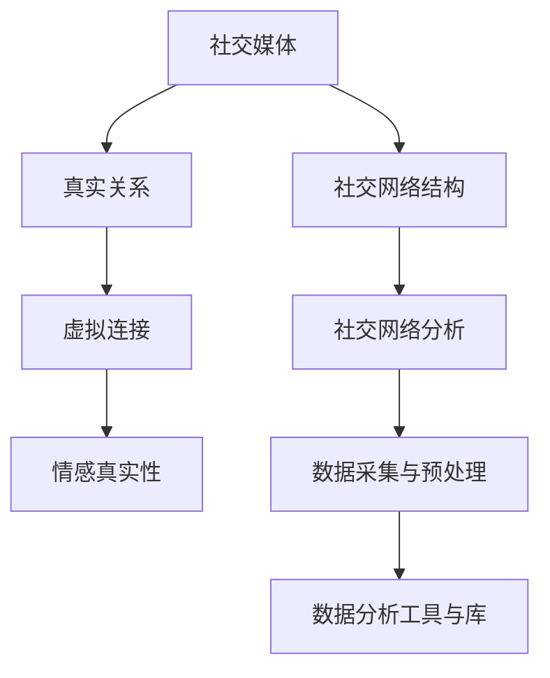

                 

# 社交媒体时代的真实关系：虚拟连接中的情感真实性

> 关键词：社交媒体、真实关系、虚拟连接、情感真实性、社交网络结构、数据分析

> 摘要：随着社交媒体的广泛应用，人们的社交方式发生了巨大变化。本文将探讨社交媒体时代的真实关系，分析虚拟连接中的情感真实性，并结合案例分析，提出社交媒体平台对真实关系的影响以及维护与优化的策略。

### 目录大纲

#### 第一部分：社交媒体时代的真实关系概述

1. **社交媒体时代的真实关系**
    1.1. **社交媒体的兴起与影响**
    1.2. **真实关系的定义与演变**
    1.3. **社交媒体与真实关系的矛盾**

2. **社交媒体平台上的社交网络结构**
    2.1. **社交网络的基础概念**
    2.2. **社交媒体平台上的网络结构**
    2.3. **社交网络分析的应用**

3. **虚拟连接与情感真实性**
    3.1. **虚拟连接的特点**
    3.2. **情感真实性的定义**
    3.3. **虚拟连接与情感真实性的关系**

#### 第二部分：社交媒体平台上的真实关系案例分析

4. **社交媒体平台类型及其真实关系特点**
    4.1. **即时通讯平台**
    4.2. **社交网络平台**
    4.3. **内容分享平台**

5. **案例分析：真实关系在不同平台上的体现**
    5.1. **案例分析一：微信**
    5.2. **案例分析二：Facebook**
    5.3. **案例分析三：Instagram**

6. **社交媒体平台对真实关系的影响**
    6.1. **积极影响**
    6.2. **消极影响**
    6.3. **社交媒体平台的应对策略**

7. **社交媒体时代真实关系的维护与优化**
    7.1. **个体层面的策略**
    7.2. **平台层面的策略**
    7.3. **未来趋势与展望**

#### 附录：社交媒体平台数据分析方法

8. **社交媒体数据分析方法**
    8.1. **数据采集与预处理**
    8.2. **数据分析工具与库**
    8.3. **案例分析：数据可视化**

### 核心概念与联系

#### 社交媒体、真实关系、虚拟连接



### 数学模型和数学公式

#### 社交网络分析中的关键公式

$$
\text{网络密度} = \frac{E}{\binom{n}{2}}
$$

$$
\text{聚类系数} = \frac{C}{N}
$$

其中，$E$为网络中的边数，$N$为网络中的节点数，$C$为网络中的聚类系数。

### 项目实战

#### 微信朋友圈数据分析案例

- **开发环境搭建**：Python、Pandas、Matplotlib
- **数据采集与预处理**：使用Python的Pandas库进行数据处理，清洗掉无效数据和噪声数据。
- **数据分析**：使用Pandas库进行数据分析和特征提取，使用Matplotlib库进行数据可视化。
- **源代码实现**：

    ```python
    import pandas as pd
    import matplotlib.pyplot as plt

    # 数据读取与预处理
    data = pd.read_csv('weixin_data.csv')
    data = data.dropna()

    # 数据分析
    # 朋友圈互动次数分布
    interaction_counts = data['interactions'].value_counts()
    interaction_counts.plot(kind='bar')
    plt.title('Interaction Counts Distribution')
    plt.xlabel('Interaction Count')
    plt.ylabel('Frequency')
    plt.show()

    # 朋友圈发布频率分布
    post_frequencies = data['post_dates'].value_counts()
    post_frequencies.plot(kind='line')
    plt.title('Post Frequency Distribution')
    plt.xlabel('Post Date')
    plt.ylabel('Frequency')
    plt.show()
    ```

- **代码解读与分析**：本案例通过Python的Pandas库读取和清洗数据，使用Matplotlib库进行数据可视化，分别分析了微信朋友圈的互动次数和发布频率分布，帮助用户了解自己在社交媒体上的活跃度。

#### 最佳实践 Tips、小结、注意事项、拓展阅读等内容

- **最佳实践 Tips**：
  - 保持社交媒体上的信息真实、准确，避免虚假信息的传播。
  - 定期清理社交媒体账号，删除不必要的联系人，关注真正关心的人和事物。
  - 学会适度使用社交媒体，避免沉迷其中，影响现实生活。

- **小结**：
  - 社交媒体时代的真实关系受到虚拟连接的影响，情感真实性成为重要考量。
  - 社交网络结构分析有助于深入了解社交媒体平台上的真实关系。
  - 数据分析工具与方法为社交媒体平台上的真实关系研究提供了有力支持。

- **注意事项**：
  - 在进行社交媒体数据分析时，注意保护用户隐私，遵守相关法律法规。
  - 分析结果仅供参考，不应过度依赖，需结合实际情况进行判断。

- **拓展阅读**：
  - [1] Facebook, "The Facebook Data Team: Using Data Science to Advance Social Good," [Facebook Data Team](https://research.fb.com/researchers/the-facebook-data-team/)
  - [2] Twitter, "Data & Insights," [Twitter Insights](https://business.twitter.com/en/insights.html)
  - [3] LinkedIn, "LinkedIn Data Report," [LinkedIn Data Report](https://www.linkedin.com/pulse/linkedin-data-report-2019-LinkedIn-Mark-Zuckerberg)

### 结束语

作者：AI天才研究院/AI Genius Institute & 禅与计算机程序设计艺术 /Zen And The Art of Computer Programming

本文从社交媒体时代的真实关系出发，分析了虚拟连接与情感真实性的关系，并结合案例分析探讨了社交媒体平台对真实关系的影响。在社交媒体时代，我们应更加关注真实关系的维护与优化，以实现虚拟连接中的情感真实性。在未来，随着技术的不断发展，社交媒体平台将进一步优化用户体验，助力人们建立更加真实、紧密的人际关系。|>

