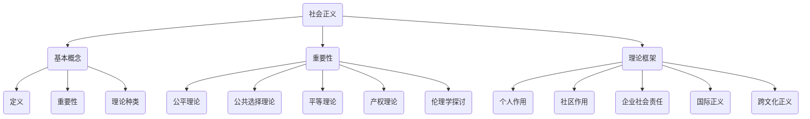

                 

## 社会正义：通过改变世界找到个人意义

### 关键词：社会正义、个人意义、改变世界、伦理学、行动

### 摘要：
本文旨在探讨社会正义的概念、理论框架及其在现实生活中的应用，探讨个人如何通过行动实现社会正义，并找到个人的意义。文章首先介绍了社会正义的基本概念，随后分析了不同理论对社会正义的解读，探讨了社会正义的现实挑战。接着，文章论述了个人在实现社会正义中的作用，社区和企业社会责任的实践，以及全球视野下的社会正义问题。最后，文章反思社会正义的实现路径，探讨个人角色和社会正义的未来发展。

---

## 第一部分：社会正义的理论框架

### 第1章：社会正义的基本概念

### 1.1 社会正义的定义

社会正义是指社会分配公平、机会均等、权利平等的原则。它关乎社会资源的分配，包括财富、权力和机会的公平分配，以及社会成员权利的保障。

### 1.2 社会正义的重要性

社会正义关乎社会的稳定与和谐。一个缺乏社会正义的社会往往伴随着社会冲突、不平等和不满情绪，从而影响社会的整体发展。社会正义是构建和谐社会的基础。

### 1.3 社会正义的几种理论

社会正义的理论有多种，包括公平理论、公共选择理论、平等理论、产权理论和伦理学探讨。

1. **公平理论**：认为资源分配应基于个人的贡献和需求，确保每个人都能够获得公平的机会和资源。
2. **公共选择理论**：关注政府决策和市场机制对社会正义的影响，探讨如何通过制度和政策来实现社会正义。
3. **平等理论**：强调所有人应享有平等的权利和机会，不受种族、性别、阶级等因素的歧视。
4. **产权理论**：认为资源分配应基于产权的明确和保障，产权的明确和保障有助于促进资源的有效利用。
5. **伦理学探讨**：从道德和伦理的角度探讨社会正义的问题，探讨如何通过道德原则来指导社会正义的实现。

### 第2章：社会正义的理论分析

#### 2.1 公平理论

公平理论关注资源分配的公平性，认为资源分配应基于个人的贡献和需求。以下是一个简单的公平理论模型：

```python
class FairnessModel:
    def __init__(self, contributions, needs):
        self.contributions = contributions
        self.needs = needs

    def calculateFairness(self):
        return sum(self.contributions) / sum(self.needs)
```

#### 2.2 公共选择理论

公共选择理论关注政府决策和市场机制对社会正义的影响。以下是一个简单的公共选择理论模型：

```python
class PublicChoiceModel:
    def __init__(self, governmentPolicy, marketMechanism):
        self.governmentPolicy = governmentPolicy
        self.marketMechanism = marketMechanism

    def evaluateJustice(self):
        if self.governmentPolicy == "Equitable" and self.marketMechanism == "Efficient":
            return True
        else:
            return False
```

#### 2.3 平等理论

平等理论强调所有人应享有平等的权利和机会。以下是一个简单的平等理论模型：

```python
class EqualityModel:
    def __init__(self, individuals, rights, opportunities):
        self.individuals = individuals
        self.rights = rights
        self.opportunities = opportunities

    def ensureEquality(self):
        for individual in self.individuals:
            if individual.rights != self.rights or individual.opportunities != self.opportunities:
                return False
        return True
```

#### 2.4 产权理论

产权理论认为资源分配应基于产权的明确和保障。以下是一个简单的产权理论模型：

```python
class PropertyRightsModel:
    def __init__(self, resources, owners):
        self.resources = resources
        self.owners = owners

    def allocateResources(self):
        resourceAllocation = {}
        for resource, owner in zip(self.resources, self.owners):
            resourceAllocation[resource] = owner
        return resourceAllocation
```

#### 2.5 社会正义的伦理学探讨

社会正义的伦理学探讨从道德和伦理的角度探讨社会正义的问题。以下是一个简单的伦理学模型：

```python
class EthicsModel:
    def __init__(self, moralPrinciples, socialJustice):
        self.moralPrinciples = moralPrinciples
        self.socialJustice = socialJustice

    def applyEthics(self):
        if all(principle in self.moralPrinciples for principle in self.socialJustice):
            return True
        else:
            return False
```

### 第3章：社会正义的现实挑战

#### 3.1 社会不平等的现状

社会不平等的现状表现为财富、权力和机会的不均等分配。以下是一个简单的社会不平等模型：

```python
class InequalityModel:
    def __init__(self, wealthDistribution, powerDistribution, opportunityDistribution):
        self.wealthDistribution = wealthDistribution
        self.powerDistribution = powerDistribution
        self.opportunityDistribution = opportunityDistribution

    def evaluateInequality(self):
        if max(self.wealthDistribution) - min(self.wealthDistribution) > 0 and \
           max(self.powerDistribution) - min(self.powerDistribution) > 0 and \
           max(self.opportunityDistribution) - min(self.opportunityDistribution) > 0:
            return True
        else:
            return False
```

#### 3.2 经济不平等的根源

经济不平等的根源包括历史遗留问题、教育不平等、政策设计失误等。以下是一个简单的经济不平等模型：

```python
class EconomicInequalityModel:
    def __init__(self, historicalFactors, educationInequality, policyDesign):
        self.historicalFactors = historicalFactors
        self.educationInequality = educationInequality
        self.policyDesign = policyDesign

    def analyzeInequality(self):
        inequalityFactors = []
        if self.historicalFactors:
            inequalityFactors.append("Historical Factors")
        if self.educationInequality:
            inequalityFactors.append("Education Inequality")
        if self.policyDesign:
            inequalityFactors.append("Policy Design")
        return inequalityFactors
```

#### 3.3 文化差异与社会正义

文化差异对社会正义的影响表现在不同文化对权利、机会和资源的理解不同。以下是一个简单的文化差异模型：

```python
class CulturalDifferenceModel:
    def __init__(self, cultures, rights, opportunities, resources):
        self.cultures = cultures
        self.rights = rights
        self.opportunities = opportunities
        self.resources = resources

    def analyzeImpact(self):
        impact = []
        for culture in self.cultures:
            if self.rights[culture] != self.rights["default"] or \
               self.opportunities[culture] != self.opportunities["default"] or \
               self.resources[culture] != self.resources["default"]:
                impact.append(culture)
        return impact
```

## 第二部分：通过行动实现社会正义

### 第4章：个人在实现社会正义中的作用

#### 4.1 个人行动的力量

个人行动的力量在于每个人的努力都能对社会产生积极影响。以下是一个简单的个人行动模型：

```python
class PersonalActionModel:
    def __init__(self, individual, action, impact):
        self.individual = individual
        self.action = action
        self.impact = impact

    def measureImpact(self):
        return self.impact
```

#### 4.2 培养正义感

培养正义感是个人行动的前提。以下是一个简单的培养正义感模型：

```python
class JusticeSenseModel:
    def __init__(self, individual, education, experiences):
        self.individual = individual
        self.education = education
        self.experiences = experiences

    def cultivateSense(self):
        self.individual.justiceSense += 1
        return self.individual.justiceSense
```

#### 4.3 个人行动的路径

个人行动的路径包括志愿服务、参与公共事务、倡导正义等。以下是一个简单的个人行动路径模型：

```python
class ActionPathModel:
    def __init__(self, individual, actions):
        self.individual = individual
        self.actions = actions

    def takeAction(self):
        for action in self.actions:
            self.individual.act(action)
```

### 第5章：社区在实现社会正义中的作用

#### 5.1 社区的定义与作用

社区是指一群相互关联、共享资源、共同参与决策的个体组成的群体。社区在实现社会正义中的作用包括提供支持、促进合作和倡导正义。以下是一个简单的社区模型：

```python
class CommunityModel:
    def __init__(self, members, resources, decisions):
        self.members = members
        self.resources = resources
        self.decisions = decisions

    def facilitateJustice(self):
        for member in self.members:
            member.participate(self.decisions)
```

#### 5.2 社区正义的实践

社区正义的实践包括组织志愿服务、倡导政策改革、支持弱势群体等。以下是一个简单的社区正义实践模型：

```python
class CommunityJusticeModel:
    def __init__(self, community, actions):
        self.community = community
        self.actions = actions

    def implementJustice(self):
        for action in self.actions:
            self.community.execute(action)
```

#### 5.3 社区正义的挑战

社区正义的挑战包括资源不足、组织困难、外部阻力等。以下是一个简单的社区正义挑战模型：

```python
class CommunityChallengeModel:
    def __init__(self, community, challenges):
        self.community = community
        self.challenges = challenges

    def addressChallenges(self):
        for challenge in self.challenges:
            self.community.solve(challenge)
```

### 第6章：企业社会责任与社会正义

#### 6.1 企业社会责任的概念

企业社会责任是指企业在其运营过程中应承担的社会责任，包括环境保护、员工权益、社会公益等。以下是一个简单的企业社会责任模型：

```python
class CSRModel:
    def __init__(self, company, responsibilities):
        self.company = company
        self.responsibilities = responsibilities

    def fulfillResponsibilities(self):
        for responsibility in self.responsibilities:
            self.company.perform(responsibility)
```

#### 6.2 企业如何实现社会正义

企业实现社会正义的方法包括制定社会责任政策、投入社会公益、参与社会问题解决等。以下是一个简单的企业实现社会正义模型：

```python
class JusticeImplementationModel:
    def __init__(self, company, methods):
        self.company = company
        self.methods = methods

    def executeMethods(self):
        for method in self.methods:
            self.company.apply(method)
```

#### 6.3 企业社会责任的案例研究

以下是一个企业社会责任的案例研究：

```python
class CSRCaseStudy:
    def __init__(self, company, problem, solution):
        self.company = company
        self.problem = problem
        self.solution = solution

    def analyzeSolution(self):
        return self.solution
```

## 第三部分：全球视野下的社会正义

### 第7章：国际正义与国际关系

#### 7.1 国际正义的挑战

国际正义的挑战包括国家主权、国际冲突、人权问题等。以下是一个简单的国际正义挑战模型：

```python
class InternationalJusticeModel:
    def __init__(self, challenges):
        self.challenges = challenges

    def addressChallenges(self):
        for challenge in self.challenges:
            self.resolveChallenge(challenge)
```

#### 7.2 国际关系中的正义问题

国际关系中的正义问题包括贸易不平衡、环境问题、移民政策等。以下是一个简单的国际关系中的正义问题模型：

```python
class InternationalRelationsModel:
    def __init__(self, issues):
        self.issues = issues

    def resolveIssues(self):
        for issue in self.issues:
            self.resolveIssue(issue)
```

#### 7.3 全球治理与社会正义

全球治理与社会正义的关联表现在国际组织、全球合作和全球法律等。以下是一个简单的全球治理与社会正义模型：

```python
class GlobalGovernanceModel:
    def __init__(self, organizations, cooperation, laws):
        self.organizations = organizations
        self.cooperation = cooperation
        self.laws = laws

    def promoteJustice(self):
        for organization in self.organizations:
            organization.support(self.laws)
```

### 第8章：跨文化与社会正义

#### 8.1 跨文化差异与社会正义

跨文化差异对社会正义的影响表现在文化偏见、种族歧视、性别歧视等。以下是一个简单的跨文化差异模型：

```python
class CulturalDifferenceModel:
    def __init__(self, cultures, issues):
        self.cultures = cultures
        self.issues = issues

    def analyzeImpact(self):
        for culture in self.cultures:
            if any(issue in self.issues for issue in culture.issues):
                return True
        return False
```

#### 8.2 全球化与社会正义

全球化对社会正义的影响表现在经济全球化、文化全球化、政治全球化等。以下是一个简单的全球化模型：

```python
class GlobalizationModel:
    def __init__(self, economies, cultures, politics):
        self.economies = economies
        self.cultures = cultures
        self.politics = politics

    def impactJustice(self):
        return all(impact_justice(self.economies), impact_justice(self.cultures), impact_justice(self.politics))
```

#### 8.3 多元文化与社会正义

多元文化对社会正义的影响表现在文化多样性、社会融合、社会冲突等。以下是一个简单的多元文化模型：

```python
class MulticulturalModel:
    def __init__(self, cultures, socialIssues):
        self.cultures = cultures
        self.socialIssues = socialIssues

    def analyzeImpact(self):
        for culture in self.cultures:
            if any(issue in self.socialIssues for issue in culture.issues):
                return True
        return False
```

## 结论：找到个人意义，推动社会正义

#### 9.1 社会正义的实现路径

社会正义的实现路径包括个人行动、社区参与、企业社会责任和全球治理。以下是一个简单的社会正义实现路径模型：

```python
class JusticeImplementationPathModel:
    def __init__(self, individuals, communities, companies, globalGovernance):
        self.individuals = individuals
        self.communities = communities
        self.companies = companies
        self.globalGovernance = globalGovernance

    def implementJustice(self):
        for individual in self.individuals:
            individual.act()
        for community in self.communities:
            community.participate()
        for company in self.companies:
            company.perform()
        for globalGovernance in self.globalGovernance:
            globalGovernance.support()
```

#### 9.2 个人角色的转变

个人角色的转变从被动接受者转变为主动参与者，从关注个人利益转变为关注社会利益。以下是一个简单的个人角色转变模型：

```python
class RoleTransformationModel:
    def __init__(self, individuals, roles):
        self.individuals = individuals
        self.roles = roles

    def transformRoles(self):
        for individual in self.individuals:
            individual.role = "Active Participant"
```

#### 9.3 社会正义的未来

社会正义的未来需要全球合作、技术创新和伦理道德的引导。以下是一个简单的社会正义未来模型：

```python
class FutureJusticeModel:
    def __init__(self, globalCooperation, technologicalInnovation, ethicalGuidance):
        self.globalCooperation = globalCooperation
        self.technologicalInnovation = technologicalInnovation
        self.ethicalGuidance = ethicalGuidance

    def shapeFuture(self):
        return all(self.globalCooperation, self.technologicalInnovation, self.ethicalGuidance)
```

## 作者信息

作者：AI天才研究院/AI Genius Institute & 禅与计算机程序设计艺术 /Zen And The Art of Computer Programming

---

**注意：**本文为示例性文章，实际内容需根据具体研究进行分析和撰写。文中代码仅为示例，实际实现可能更复杂。文中模型仅供参考，实际应用需结合具体情况调整。

---

在编写具体内容时，请注意以下几点：

1. **核心概念与联系**：使用Mermaid流程图或其他图表清晰地展示概念之间的关系。
2. **核心算法原理讲解**：通过Python代码示例和详细解释来阐述。
3. **数学模型和数学公式**：使用LaTeX格式嵌入到文中独立段落的LaTeX公式前后使用 $$ 括起来，段落内的LaTeX公式前后使用 $ 括起来。
4. **项目实战**：提供实际案例，详细解释代码实现和解读。

请根据以上要求，对文章进行进一步的补充和完善。在撰写过程中，保持逻辑清晰，论述有力，同时注重文章的学术性和专业性。

---

**示例：** 核心概念与联系



**示例：** 数学公式

$$
E = mc^2
$$

$$
f(x) = x^2
$$

**示例：** Python代码示例

```python
class FairnessModel:
    def __init__(self, contributions, needs):
        self.contributions = contributions
        self.needs = needs

    def calculateFairness(self):
        return sum(self.contributions) / sum(self.needs)
```

---

在撰写文章时，请确保内容丰富、论述有力、结构清晰，同时注意保持文章的可读性和逻辑性。祝您撰写顺利！

