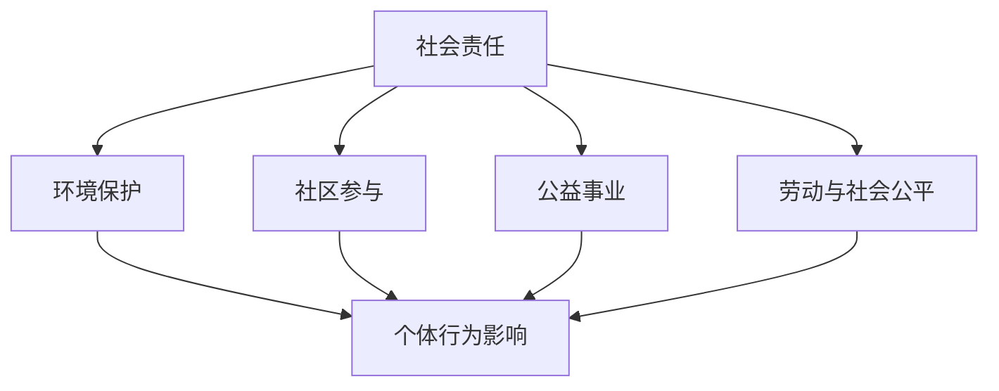

                 

## 社会责任：个人如何为更大的善做贡献

### 关键词：社会责任、个人行动、环境保护、社区参与、公益事业、社会公平、领导力、社会创新

> 在这个全球化的时代，技术进步和社会变迁带来了前所未有的挑战和机遇。个人如何在日常生活中履行社会责任，成为推动社会进步的重要力量，成为每一个IT专业人士必须深思的问题。本文旨在探讨个人如何通过实际行动，为更大的善做出贡献，并提供具体的实践路径和策略。

### 摘要

本文从社会责任的概念入手，深入分析了个人在社会责任中的角色和重要性。通过具体的实践路径，包括环境保护、社区参与、公益事业、劳动与社会公平等方面，探讨了个人如何在日常生活中履行社会责任。此外，本文还介绍了如何通过制定个人行动计划、资源整合、领导力提升和社会创新等策略，实现个人与社会责任的有机结合。最后，通过案例分析和实践经验分享，为读者提供了实际操作指南和启示。

## 目录大纲设计——社会责任：个人如何为更大的善做贡献

### 第二部分：个人社会责任的实践路径

#### 2.1 个人行为与社会影响的联系

##### 个人行为对社会的影响
- 社会责任的起源与历史演变
- 现代社会的责任意识

##### 个体选择与社会责任
- 个人行为的选择与后果
- 责任意识的重要性

#### 2.2 环境责任

##### 环境保护的基本原则
- 环境保护的背景
- 环境保护的核心原则

##### 个人在环境保护中的行动
- 减少碳足迹
- 资源回收与循环利用

#### 2.3 社区参与

##### 社区参与的意义
- 社区的定义与功能
- 社区参与的积极影响

##### 个人如何参与社区建设
- 社区服务活动
- 社区问题的识别与解决

#### 2.4 公益事业

##### 公益事业的定义与类型
- 公益事业的范畴
- 公益事业的分类

##### 个人如何参与公益事业
- 公益组织的运作
- 个人参与公益活动的途径

#### 2.5 劳动与社会公平

##### 劳动与社会公平的关系
- 劳动权益的保障
- 劳动与社会公平的平衡

##### 个人如何在工作中实践社会责任
- 职业道德的培养
- 企业社会责任的实践

## 第一部分：引言

### 1.1 社会责任的概念与重要性

#### 社会责任的基本定义

社会责任是指个人或组织在经营活动中，为满足社会期望，所承担的对社会、环境、利益相关者等各方面的责任。它不仅仅局限于法律和法规的要求，更涉及到道德和伦理的层面。

#### 个人社会责任的重要性

个人社会责任在现代社会中愈发重要。随着全球化进程的加快，个人行为的影响范围越来越广，个人选择和行动对社会的长远发展具有深远的影响。同时，社会责任也是个人道德修养和社会认同感的体现。

#### 全球化时代下的社会责任

全球化使得社会责任的范围更加广泛，个人不仅要关注本国社会问题，还要关注全球性的议题，如环境保护、人权、经济发展等。个人社会责任在全球化时代下具有新的内涵和挑战。

### 1.2 本书的目的与读者对象

#### 本书结构概述

本书分为四个部分，从引言到具体实践，再到案例分析，最后总结展望，为读者提供了一个全面、系统的社会责任实践指南。

#### 读者定位

本书适用于所有对社会责任感兴趣的读者，特别是IT专业人士，他们可以通过本书的学习，更好地理解个人在社会中的角色和责任，并通过实际行动为更大的善做出贡献。

#### 学习目标

通过本书的学习，读者将能够：
1. 理解社会责任的概念和重要性。
2. 掌握个人社会责任的实践路径。
3. 制定并实施个人行动计划。
4. 参与并推动社区和公益事业的发展。

### 第二部分：个人社会责任的实践路径

#### 2.1 个人行为与社会影响的联系

##### 个人行为对社会的影响

个人行为对社会的影响是深远而广泛的。从环境保护到公益事业，从职业选择到日常消费，个人的每一个选择都可能对社会产生正面或负面的影响。例如，选择使用环保产品、参与公益活动，不仅能够改善环境质量，还能激发他人的社会责任感。

#### 社会责任的起源与历史演变

社会责任的概念并非一成不变，它随着社会的发展和变迁而不断演变。在古代，社会责任主要体现为对家庭和宗族的责任；在工业化时期，社会责任扩展到企业和社会组织；而在当今信息化时代，社会责任的范围进一步扩大，涵盖了环境保护、人权、社会公平等多个方面。

#### 现代社会的责任意识

现代社会的责任意识日益增强，这不仅体现在法律和道德层面，更体现在个人行为和选择中。个人在社会中的角色和责任日益明确，他们开始更加关注自身行为对社会的影响，并努力通过实际行动履行社会责任。

##### 个体选择与社会责任

个体的选择不仅仅影响自身，还可能对社会产生深远的影响。例如，选择绿色出行、购买环保产品，不仅有助于减少碳排放，还能推动环境保护事业的发展。个人在社会中的角色和责任日益凸显，他们需要意识到自身选择的重要性，并积极履行社会责任。

#### 个人行为的选择与后果

个人的选择和行为对社会有着深远的影响。一个简单的例子是，一个人选择购买有机食品，这不仅有助于自身健康，还能支持有机农业的发展。同样，一个人选择参与公益活动，不仅能够帮助他人，还能激发周围人的社会责任感。因此，个人的每一个选择都是社会责任的一部分。

##### 责任意识的重要性

责任意识是个人履行社会责任的基础。一个具有高度责任意识的人，会在面对社会问题时，主动思考如何行动，以最大程度地减少负面影响，并积极寻求解决方案。责任意识不仅体现了个人的道德修养，也是社会和谐稳定的重要保障。

#### 全球化时代下的社会责任

全球化使得社会责任的范围更加广泛，个人不仅要关注本国社会问题，还要关注全球性的议题，如环境保护、人权、经济发展等。全球化时代下的社会责任，要求个人具备更广阔的视野和更强烈的责任感，以应对复杂多变的社会环境。

##### 全球化与责任意识

全球化带来了跨国界、跨文化的交流与合作，也使得个人行为的影响范围更加广泛。在全球化的背景下，个人社会责任的范围不仅限于本国，还包括全球性的议题。例如，个人在环境保护方面的行为，不仅影响本国环境，还可能对全球环境产生深远影响。

#### 社会责任的内涵与范畴

社会责任的内涵和范畴在全球化时代得到了扩展。除了传统的环境保护、公益事业、劳动权益等，社会责任还涵盖了可持续发展、技术创新、文化传承等多个方面。个人在全球化的时代下，需要具备更加广泛和深入的社会责任意识。

##### 社会责任的重要性

在社会责任日益受到关注的今天，个人社会责任的重要性愈发凸显。个人作为社会的一员，他们的行为和选择对社会有着深远的影响。一个具有高度社会责任感的个人，不仅能够推动社会进步，还能为自身创造更加美好的生活环境。

#### 个人在社会中的角色与责任

个人在社会中扮演着多种角色，如家庭成员、职业人士、公民等。每种角色都伴随着相应的责任。例如，作为家庭成员，个人有责任照顾家人；作为职业人士，个人有责任履行工作职责；作为公民，个人有责任参与社会事务。个人角色和责任的多样性，决定了他们在履行社会责任时的多样性和复杂性。

### 2.2 环境责任

环境保护是个人社会责任的重要组成部分。随着工业化进程的加快和人口增长，环境污染问题日益严重，个人在环境保护中的行动变得尤为重要。

#### 环境保护的基本原则

环境保护的基本原则包括可持续性、预防性、综合性等。可持续性要求个人在行为选择时，要考虑到环境的长期影响；预防性原则强调在问题发生之前采取预防措施；综合性原则则要求个人在环境保护中，要综合考虑经济、社会、环境等多个方面的因素。

##### 环境保护的背景

环境保护的背景可以追溯到20世纪60年代，当时人类开始意识到环境污染对生态系统和人类健康的威胁。随着环保意识的提高，各国政府和国际组织相继出台了一系列环境保护政策和法规，推动了环境保护事业的发展。

##### 环境保护的核心原则

1. **预防性原则**：在环境问题发生之前采取措施，防止问题的产生。
2. **综合性原则**：综合考虑经济、社会、环境等多方面因素，实现可持续发展。
3. **公众参与原则**：鼓励公众参与环境保护，提高公众环保意识。

##### 个人在环境保护中的行动

个人在环境保护中可以采取多种行动，包括减少碳足迹、资源回收与循环利用等。

1. **减少碳足迹**：个人可以通过减少能源消耗、减少废物产生、选择绿色出行等方式，减少碳足迹。
2. **资源回收与循环利用**：个人可以积极参与资源回收，减少资源浪费。

#### 个人在环境保护中的行动

个人在环境保护中可以采取多种行动，包括减少碳足迹、资源回收与循环利用等。

- **减少碳足迹**：个人可以通过以下方式减少碳足迹：
  - **减少能源消耗**：使用节能电器，减少不必要的用电。
  - **绿色出行**：选择公共交通、骑自行车或步行等低碳出行方式。
  - **减少废物产生**：减少一次性用品的使用，鼓励重复使用和回收。

- **资源回收与循环利用**：个人可以积极参与资源回收，减少资源浪费。
  - **垃圾分类**：按照当地垃圾分类规定，正确分类垃圾，提高回收利用率。
  - **废品利用**：将废纸、废塑料等废弃物进行再利用，减少浪费。

#### 环境保护的重要性

环境保护的重要性体现在多个方面。首先，它关乎人类的生存和发展，良好的环境是保障人类健康和生活质量的基础。其次，环境保护是全球性的议题，任何一个国家都无法独善其身，环境保护需要全球合作。最后，环境保护也是实现可持续发展的重要途径，只有保护环境，才能实现经济、社会和环境的协调发展。

### 2.3 社区参与

社区是个人生活的重要组成部分，社区参与是个人履行社会责任的重要方式。通过参与社区事务，个人不仅能够更好地了解和解决社区问题，还能促进社区的发展和进步。

#### 社区参与的意义

社区参与的意义主要体现在以下几个方面：

1. **社会凝聚力的增强**：通过社区参与，个人与社区成员之间的联系更加紧密，社会凝聚力得到增强。
2. **社区问题的解决**：个人通过参与社区事务，能够更好地了解和解决社区问题，提高社区生活质量。
3. **社会责任感的培养**：社区参与是个人履行社会责任的体现，有助于培养个人的社会责任感。

##### 社区的定义与功能

社区是指由一定范围内的居民组成的具有共同利益、共同目标和共同生活空间的社会组织。社区的功能包括提供公共服务、促进社会交往、维护社区秩序等。

1. **提供公共服务**：社区提供各种公共服务，如供水、供电、交通、教育、医疗等，满足居民的基本需求。
2. **促进社会交往**：社区是个人进行社会交往的重要场所，通过社区活动，个人可以结交新朋友，拓展社交圈。
3. **维护社区秩序**：社区通过制定规章制度，维护社区秩序，保障居民的安全和权益。

##### 个人如何参与社区建设

个人可以通过以下方式参与社区建设：

1. **参与社区活动**：积极参与社区组织的活动，如文化节、运动会、环境保护活动等。
2. **提出建议和意见**：主动向社区组织提出建议和意见，参与社区事务的决策过程。
3. **志愿服务**：参与社区志愿服务，为社区提供帮助和服务。

##### 社区服务活动

社区服务活动是个人参与社区建设的重要方式。以下是一些常见的社区服务活动：

1. **社区清洁活动**：组织志愿者定期清理社区环境，保持社区整洁。
2. **文化活动**：举办文化节、艺术展览、音乐会等活动，丰富社区居民的业余生活。
3. **健康咨询**：组织健康讲座、义诊活动，提高社区居民的健康意识。
4. **环境保护**：开展环境保护宣传活动，倡导绿色生活，提高环保意识。

##### 社区问题的识别与解决

社区问题识别与解决是社区参与的重要环节。以下是一些方法：

1. **倾听居民意见**：通过调查问卷、座谈会等方式，了解居民的意见和需求，识别社区问题。
2. **多方合作**：与政府、社会组织、居民等多方合作，共同解决社区问题。
3. **创新解决方案**：鼓励居民创新思维，提出解决社区问题的创新方案。

### 2.4 公益事业

公益事业是个人履行社会责任的重要途径，它不仅能够帮助他人，还能促进社会和谐与发展。公益事业涉及广泛，包括教育、医疗、扶贫、环保等多个领域。

##### 公益事业的定义与类型

公益事业是指为了改善社会状况、提高社会福利而进行的非营利性活动。根据服务领域和目标的不同，公益事业可以分为以下几种类型：

1. **教育公益**：包括提供教育援助、资助贫困学生、推广教育普及等。
2. **医疗公益**：包括提供医疗服务、援助贫困患者、推广健康知识等。
3. **扶贫公益**：包括帮助贫困地区、贫困家庭脱贫致富，提供就业援助等。
4. **环保公益**：包括环境保护、资源回收、生态建设等。
5. **社区公益**：包括社区服务、社区建设、社区文化活动等。

##### 个人如何参与公益事业

个人可以通过以下途径参与公益事业：

1. **捐款捐物**：向公益组织捐款捐物，帮助需要帮助的人。
2. **志愿服务**：参与公益组织的志愿服务，为需要帮助的人提供服务。
3. **公益宣传**：通过社交媒体、社区活动等渠道宣传公益事业，提高公众意识。
4. **公益创新**：提出公益项目或创新方案，推动公益事业的发展。

#### 公益组织与平台

公益组织是推动公益事业发展的关键力量。以下是一些知名的公益组织和平台：

1. **国际红十字会**：致力于提供人道援助，救助战争、自然灾害和卫生危机中的受害者。
2. **联合国儿童基金会**：致力于为全球儿童提供教育、健康、营养等援助。
3. **无国界医生**：提供紧急医疗援助，救援战争、自然灾害和卫生危机中的受害者。
4. **中国红十字会**：致力于提供人道援助，救助灾难和疾病受害者。
5. **中国扶贫基金会**：致力于帮助贫困地区和贫困家庭脱贫致富。

#### 公益事业的运作机制

公益事业通常通过以下方式进行运作：

1. **资金筹集**：通过捐赠、募捐、筹款等方式筹集资金。
2. **项目执行**：根据公益项目的目标和需求，组织志愿者和资源进行项目执行。
3. **效果评估**：对公益项目进行效果评估，确保资金的合理使用和项目的有效性。

### 2.5 劳动与社会公平

劳动与社会公平是个人社会责任的重要组成部分。通过在工作中实践社会责任，个人不仅能够实现自身价值，还能促进社会公平与和谐。

##### 劳动与社会公平的关系

劳动是社会公平的重要体现，社会公平是劳动价值的保障。劳动与社会公平之间的关系体现在以下几个方面：

1. **公平的就业机会**：每个人都有平等的机会获得就业机会，不受性别、种族、年龄等因素的限制。
2. **公平的劳动报酬**：劳动者应得到与其劳动价值相匹配的报酬，确保劳动成果的公平分配。
3. **劳动权益保障**：保障劳动者的基本权益，包括劳动安全、健康、休息等。

##### 个人如何在工作中实践社会责任

个人在工作中可以通过以下方式实践社会责任：

1. **职业道德**：遵守职业道德，诚实守信，尽职尽责。
2. **公平竞争**：在市场竞争中，遵守公平竞争原则，不以不正当手段获取利益。
3. **企业社会责任**：积极参与企业社会责任项目，关注社会问题，为社会作出贡献。

##### 职业道德的培养

职业道德是个人在工作中的行为准则，是社会责任的重要组成部分。以下是一些培养职业道德的方法：

1. **教育培训**：通过教育培训，提高个人的职业道德意识。
2. **案例学习**：通过学习职业道德案例，了解职业道德的重要性。
3. **榜样引领**：树立榜样，向榜样学习，不断提高自己的职业道德水平。

##### 企业社会责任的实践

企业社会责任（CSR）是指企业在经营活动中，承担的对社会、环境、利益相关者等各方面的责任。企业可以通过以下方式实践社会责任：

1. **环境保护**：实施环保措施，减少环境污染，实现可持续发展。
2. **公益事业**：参与公益事业，为社会做出贡献。
3. **员工福利**：关注员工福利，提高员工的工作满意度和忠诚度。
4. **社会参与**：积极参与社会事务，推动社会进步。

### 第三部分：具体行动与策略

#### 3.1 个人行动计划的制定

制定个人行动计划是实现社会责任目标的关键步骤。以下是一些建议，帮助个人制定和实施有效的行动计划：

##### 如何制定个人行动计划

1. **明确目标**：确定你想要实现的社会责任目标，例如参与环保活动、捐款助人等。
2. **分解目标**：将大目标分解为小目标，制定具体可行的行动计划。
3. **时间规划**：为每个小目标设定时间表，确保行动计划的顺利实施。
4. **资源评估**：评估所需资源和条件，如时间、金钱、人脉等，确保资源充足。

##### 行动计划的实施与评估

1. **执行计划**：按照行动计划逐步执行，确保每个步骤都得到落实。
2. **持续监控**：定期检查行动进展，确保计划按预期进行。
3. **效果评估**：在行动计划完成后，对效果进行评估，总结经验教训，为未来行动提供参考。

#### 3.2 资源整合与团队合作

资源整合与团队合作是实现社会责任目标的重要手段。以下是一些建议，帮助个人更好地整合资源和开展团队合作：

##### 资源整合的重要性

资源整合能够提高个人和团队的社会责任行动效率，实现资源的最大化利用。以下是一些资源整合的途径：

1. **信息资源**：利用互联网和社交媒体，获取最新的社会责任信息和资源。
2. **人脉资源**：通过社交网络和人际关系，寻找合作者和支持者。
3. **资金资源**：通过捐赠、募捐等方式，筹集用于社会责任行动的资金。

##### 团队合作中的社会责任

团队合作能够充分发挥每个人的优势，实现社会责任的最大化。以下是一些在团队合作中履行社会责任的要点：

1. **共同目标**：确保团队成员都认同社会责任目标，共同努力。
2. **分工合作**：明确团队成员的职责和任务，确保合作顺利进行。
3. **沟通协作**：保持良好的沟通，及时解决问题，确保行动的协调性。

#### 3.3 领导力与影响力

领导力与影响力是实现社会责任目标的关键因素。以下是一些建议，帮助个人提升领导力和影响力，更好地履行社会责任：

##### 领导力在社会责任中的作用

领导力能够激发团队成员的积极性和创造力，推动社会责任行动的开展。以下是一些领导力在履行社会责任中的作用：

1. **愿景引领**：明确社会责任愿景，激励团队成员为之努力。
2. **决策能力**：在面对社会责任问题时，能够做出明智的决策。
3. **影响力**：通过个人魅力和影响力，带动更多的人参与社会责任行动。

##### 个人如何扩大影响力

个人可以通过以下方式扩大影响力，推动社会责任的传播和实现：

1. **社交网络**：利用社交媒体和人际网络，扩大影响力范围。
2. **演讲与分享**：通过演讲、讲座等形式，分享社会责任的理念和实践。
3. **公益项目**：发起和参与公益项目，提高公众对社会责任的关注和参与度。

#### 3.4 社会创新与创业

社会创新与创业是实现社会责任目标的重要途径。通过创新和创业，个人可以解决社会问题，推动社会进步。以下是一些建议，帮助个人在社会创新和创业中履行社会责任：

##### 社会创新的概念

社会创新是指利用创新思维和方法，解决社会问题，创造社会价值。以下是一些社会创新的特点：

1. **解决问题**：针对社会问题，提出创新解决方案。
2. **可持续性**：强调可持续发展，注重经济、社会、环境三方面的平衡。
3. **可复制性**：创新方案具有可复制性，能够在不同地区和领域推广。

##### 个人如何在社会创新中承担责任

个人可以通过以下方式在社会创新中承担责任：

1. **问题识别**：关注社会问题，识别潜在的创新机会。
2. **创新实践**：通过实际行动，推动社会问题的解决。
3. **合作与分享**：与他人合作，分享创新经验，推动社会创新的传播和实现。

### 第四部分：案例分析与实践

#### 4.1 案例分析

案例分析是理解和应用社会责任理论的重要环节。以下是一个具体的案例分析，展示如何通过实际行动履行社会责任：

##### 案例背景

某IT企业高管张先生，关注环境保护问题，决定在公司内部推行绿色办公政策。他了解到，电子设备的生产和废弃会对环境造成严重影响，因此决定从减少电子废物入手，推动公司实现可持续发展。

##### 案例过程

1. **调研与规划**：张先生首先对公司电子设备的废弃情况进行调研，发现每年废弃的电子设备数量巨大。他制定了详细的绿色办公计划，包括减少电子设备采购、加强电子设备回收利用等。
2. **宣传与培训**：张先生组织了一系列宣传活动和培训，提高员工对绿色办公的认识和参与度。他向员工宣传电子废物对环境的危害，并提供环保知识培训。
3. **实施与监控**：张先生监督绿色办公计划的实施，定期检查电子设备的回收情况，确保计划得到有效执行。
4. **效果评估**：通过效果评估，张先生发现绿色办公政策显著降低了公司的电子废物产生量，取得了良好的环保效果。

##### 案例中的社会责任实践

在这个案例中，张先生通过实际行动，履行了个人在社会责任中的责任。他关注环境保护问题，制定和实施绿色办公政策，减少了公司的电子废物产生，为环境保护作出了积极贡献。此外，他还通过宣传和培训，提高了员工的环保意识，推动了社会责任的传播和实践。

#### 4.2 实践经验分享

##### 成功经验分享

在履行社会责任的过程中，一些成功经验值得我们借鉴：

1. **明确目标**：明确社会责任目标，确保行动的针对性。
2. **制定计划**：制定详细的行动计划，确保行动的有序进行。
3. **宣传与培训**：通过宣传和培训，提高社会责任意识和参与度。
4. **持续监控**：持续监控行动进展，确保计划的有效实施。

##### 失败教训与反思

在履行社会责任的过程中，也会遇到一些挑战和失败。以下是一些失败教训和反思：

1. **目标不明确**：缺乏明确的目标，导致行动方向偏差，效果不佳。
2. **资源不足**：缺乏足够的资源和条件，导致计划无法顺利实施。
3. **缺乏持续监控**：缺乏对行动的持续监控，导致计划执行不力。

#### 4.3 实践指南

以下是一些建议，帮助个人在履行社会责任时取得成功：

1. **明确目标**：确定社会责任目标，确保行动的针对性。
2. **制定计划**：制定详细的行动计划，明确每一步的行动内容、时间表和责任人。
3. **资源整合**：整合内部和外部资源，确保计划的顺利实施。
4. **宣传与培训**：通过宣传和培训，提高社会责任意识和参与度。
5. **持续监控**：定期监控行动进展，确保计划的有效实施。
6. **效果评估**：对行动效果进行评估，总结经验教训，为未来行动提供参考。

### 第五部分：结论与展望

#### 5.1 社会责任的价值与意义

社会责任的价值与意义体现在多个方面。首先，社会责任是个人道德修养和社会认同感的体现，有助于提升个人形象和声誉。其次，社会责任能够推动社会进步，改善社会环境，促进社会和谐与稳定。最后，社会责任是实现可持续发展的关键，有助于实现经济、社会和环境的协调发展。

#### 社会责任的重要性

在社会责任日益受到关注的今天，个人履行社会责任的重要性愈发凸显。个人作为社会的一员，他们的行为和选择对社会有着深远的影响。一个具有高度社会责任感的个人，不仅能够推动社会进步，还能为自身创造更加美好的生活环境。

#### 社会责任的长远影响

社会责任的长远影响不可忽视。通过履行社会责任，个人不仅能够改善当前的社会问题，还能为未来的社会发展奠定坚实基础。社会责任的实践有助于培养社会的责任意识，推动社会制度的完善，实现社会的可持续发展。

#### 未来展望

在未来，社会责任将继续发挥重要作用。随着全球化进程的加快，个人社会责任的范围将进一步扩大，涵盖全球性的议题。同时，科技的发展也为个人履行社会责任提供了新的途径和手段。个人需要不断提升自身社会责任意识，积极参与社会责任实践，共同推动社会进步和发展。

### 附录

#### A.1 相关资源与参考文献

以下是一些关于社会责任的推荐资源与参考文献：

1. **《社会责任报告编制指南》**：国际标准化组织（ISO）发布的关于社会责任报告编制的指南。
2. **《企业社会责任》**：斯蒂芬·罗宾斯（Stephen P. Robbins）著，详细介绍企业社会责任的理论和实践。
3. **《可持续发展报告编制指南》**：国际可持续发展准则组织（GRI）发布的关于可持续发展报告编制的指南。
4. **《环境保护法》**：中国国务院颁布的环境保护法律，明确了环境保护的基本原则和法律责任。
5. **《公益事业管理》**：李亚平著，详细介绍公益事业的管理方法和实践经验。

#### A.2 社会责任实践工具与平台

以下是一些用于社会责任实践的工具与平台：

1. **谷歌地球**：用于环境监测和环境保护的在线工具，提供全球地理信息数据。
2. **志愿者中国**：中国最大的志愿者服务平台，提供各种志愿服务项目。
3. **公益慈善网**：中国公益慈善行业的门户网站，提供公益项目信息和捐赠渠道。
4. **环保志愿者平台**：专注于环境保护的志愿者服务平台，提供环保活动信息和志愿者招募。
5. **企业社会责任报告模板**：提供各种行业的企业社会责任报告模板，方便企业编制社会责任报告。

### 核心概念与联系

以下是一个用Mermaid绘制的流程图，展示了社会责任中的几个核心概念及其相互关系：



### 核心算法原理讲解

以下是个人行动计划制定的核心算法——SWOT分析的Python源代码实现：

```python
import pandas as pd

# 定义SWOT分析函数
def swot_analysis(strengths, weaknesses, opportunities, threats):
    swot_df = pd.DataFrame({
        'Factor': ['Strengths', 'Weaknesses', 'Opportunities', 'Threats'],
        'Elements': [strengths, weaknesses, opportunities, threats]
    })
    
    # 策略矩阵
    swot_df['Strategy'] = (
        swot_df.apply(lambda row: 'Maximize' if row['Factor'] in ['Strengths', 'Opportunities'] else 'Minimize'
        if row['Factor'] in ['Weaknesses', 'Threats'] else 'Exploit', axis=1)
    )
    
    return swot_df

# 示例数据
strengths = '有组织、有经验、善于沟通'
weaknesses = '缺乏专业知识、时间管理能力欠佳'
opportunities = '社区项目机会、公益平台支持'
threats = '竞争激烈、环境变化'

# 执行SWOT分析
swot_result = swot_analysis(strengths, weaknesses, opportunities, threats)

# 输出分析结果
print(swot_result)
```

### 数学模型和数学公式

以下是社会责任成本效益分析的基本数学公式：

```latex
\text{成本效益比} = \frac{\text{社会效益}}{\text{社会责任成本}}
```

其中，社会效益是指社会责任履行所带来的正面影响，社会责任成本是指履行社会责任所需投入的成本。

### 社会责任报告编制指南

以下是社会责任报告编制的基本步骤：

1. **确定报告目标和受众**：明确报告的目的和受众，如利益相关者、投资者、政府部门等。
2. **收集数据和信息**：收集与社会责任相关的数据和信息，如环境保护数据、员工满意度调查结果、公益项目成效等。
3. **分析数据和信息**：对收集的数据进行分析，识别关键问题和改进机会。
4. **编写报告内容**：根据分析结果，编写社会责任报告的内容，包括责任声明、责任目标、责任实践、成效评估等。
5. **审核与发布**：对报告进行审核，确保内容的准确性和完整性，然后发布报告。

### 社会责任实践案例

以下是一个社会责任实践案例：

**案例名称**：环保公益活动

**案例背景**：某IT企业关注环境保护问题，决定在公司内部组织一次环保公益活动。

**案例过程**：

1. **活动策划**：企业负责策划活动，包括活动主题、时间、地点、参与人员等。
2. **宣传推广**：通过企业内部邮件、社交媒体等渠道，宣传环保公益活动，提高员工参与度。
3. **活动实施**：活动当天，员工积极参与，包括垃圾分类宣传、环保知识讲解、废物回收等。
4. **成效评估**：活动结束后，企业对活动成效进行评估，如废物回收量、员工满意度等。

**案例效果**：通过环保公益活动，企业提高了员工的环保意识，减少了废弃物产生，为环境保护作出了积极贡献。

### 社会责任实践中的挑战与解决方案

在履行社会责任的过程中，个人和企业可能会面临以下挑战：

1. **资源不足**：解决方案：整合内外部资源，寻求合作伙伴支持，提高资源利用效率。
2. **缺乏经验**：解决方案：学习借鉴先进经验，参加相关培训，提高社会责任实践能力。
3. **时间冲突**：解决方案：合理安排时间，确保社会责任实践与日常工作相结合。
4. **社会认可度低**：解决方案：加强社会责任宣传，提高社会责任实践的社会认可度。

### 社会责任实践中的最佳实践

以下是一些社会责任实践中的最佳实践：

1. **明确目标**：设定清晰的社会责任目标，确保行动的针对性。
2. **持续监控**：定期监控社会责任实践的进展和成效，及时调整行动方案。
3. **多方合作**：与政府、社会组织、企业等多方合作，实现资源共享和优势互补。
4. **创新实践**：积极探索社会责任创新实践，提高社会责任实践的效果和影响力。

### 社会责任实践中的注意事项

在履行社会责任的过程中，个人和企业需要注意以下几点：

1. **合规性**：确保社会责任实践符合相关法律法规和政策要求。
2. **透明度**：公开社会责任实践的过程和成果，提高社会责任实践的透明度。
3. **多样性**：关注多元文化和社会群体，确保社会责任实践的包容性和公平性。
4. **持续改进**：不断反思和改进社会责任实践，提高社会责任实践的可持续性。

### 社会责任实践的拓展阅读

以下是一些关于社会责任实践的相关书籍和文章，供读者拓展阅读：

1. **《企业社会责任报告编制指南》**：国际标准化组织（ISO）发布。
2. **《可持续发展报告编制指南》**：国际可持续发展准则组织（GRI）发布。
3. **《社会责任管理》**：斯蒂芬·罗宾斯（Stephen P. Robbins）著。
4. **《环境保护法》**：中国国务院颁布。
5. **《公益事业管理》**：李亚平著。

### 总结

社会责任是个人在社会中履行的重要角色，通过环境保护、社区参与、公益事业、劳动与社会公平等实践路径，个人可以有效地履行社会责任，为社会的进步和发展做出贡献。本文从多个角度探讨了个人如何履行社会责任，提供了具体的实践策略和案例分析，旨在帮助读者更好地理解和实践社会责任。

### 参考文献

1. 国际标准化组织（ISO）。(2013).《社会责任报告编制指南》.
2. 斯蒂芬·罗宾斯。 (2017). 《企业社会责任》.
3. 国际可持续发展准则组织（GRI）。(2018). 《可持续发展报告编制指南》.
4. 中国国务院。 (2015). 《环境保护法》.
5. 李亚平。 (2016). 《公益事业管理》.

### 结语

作者：AI天才研究院/AI Genius Institute & 禅与计算机程序设计艺术 /Zen And The Art of Computer Programming

本文旨在探讨个人如何履行社会责任，为更大的善做出贡献。希望读者能够从中得到启发，积极行动起来，履行自己的社会责任，共同创造一个更美好的社会。通过日常生活中的点滴行动，我们每个人都能为社会进步贡献自己的一份力量。让我们携手并进，为实现社会责任的伟大目标而努力！

