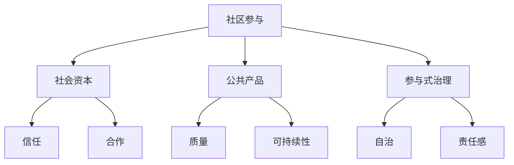

                 

# 《社区参与：在集体中找寻个人价值》

## 关键词
- 社区参与
- 个人价值
- 集体价值
- 社会资本
- 公共产品
- 参与式治理

## 摘要
本文旨在探讨社区参与在集体中找寻个人价值的重要性。通过对社区参与的基础概念、具体实践、案例分析以及未来展望的深入分析，本文揭示了社区参与在提升个人价值、促进社会和谐等方面的积极作用。文章还提供了实际案例和最佳实践建议，以期为社区参与的理论研究和实践应用提供有益的参考。

---

## 第一部分：社区参与的基础概念

### 1.1 社区的定义与特点

社区是指一定范围内，由于地理位置、文化背景、共同利益等因素而形成的具有相对独立性和认同感的社会组织形式。社区的特点包括：

1. **地理邻近性**：社区成员通常居住在相对接近的地理位置，便于日常交流和互动。
2. **文化共享性**：社区成员往往具有相似的文化背景和价值观，这有助于形成社区认同感。
3. **利益相关性**：社区成员共同享有某些资源和利益，如公共设施、福利服务等。
4. **参与性**：社区成员积极参与社区事务，共同维护社区的发展和稳定。

### 1.2 个人价值与集体价值的关联

个人价值是指个体在社会中表现出的能力和品质，如创造力、责任感等。集体价值则是指社区作为一个整体所追求的共同目标和价值观念，如社会和谐、公平正义等。个人价值与集体价值的关联可以从以下几个方面理解：

1. **互惠性**：个人价值的实现往往需要社区的支持和认可，而社区的发展也离不开个体的贡献。
2. **互动性**：个人与集体之间的互动是价值实现的重要途径，个体通过参与社区活动，实现个人价值的同时，也为集体价值做出贡献。
3. **协同性**：个人价值与集体价值的协同发展，能够促进社区的和谐与繁荣。

### 1.3 社区参与的理论基础

社区参与的理论基础主要包括社会资本理论、公共产品理论和参与式治理理论。

1. **社会资本理论**：社会资本是指社会网络中的资源，如信任、信息、支持等。社区参与能够增强社会资本，提高社区成员之间的信任和合作。
   
2. **公共产品理论**：公共产品是指那些为社区成员共同享用的产品或服务，如公园、图书馆等。社区参与有助于提高公共产品的质量和可持续性。

3. **参与式治理理论**：参与式治理是指社区成员通过共同参与决策和管理，实现社区自治和公共事务的有效治理。参与式治理能够增强社区成员的归属感和责任感。

### Mermaid 流程图

---

## 第二部分：社区参与的具体实践

### 2.1 社区参与的准备与规划

社区参与的准备与规划是确保参与活动顺利进行的重要环节。具体包括以下步骤：

1. **社区需求评估**：了解社区居民的需求和期望，为后续的参与活动提供依据。
2. **参与者招募与培训**：根据活动需求，招募合适的参与者，并提供必要的培训，提高参与者的参与能力和效果。
3. **项目设计与目标设定**：明确参与活动的主题、内容和目标，确保活动的针对性和实效性。

### 2.2 社区参与的过程与策略

社区参与的过程通常包括以下几个阶段：

1. **沟通与协商**：确保社区成员之间的信息畅通，协商解决参与活动中的问题和挑战。
2. **权力分配与决策**：合理分配权力，确保社区成员在决策过程中有平等的话语权。
3. **资源整合与利用**：充分利用社区内外部的资源，提高参与活动的效率和效果。

### 2.3 社区参与的评估与反馈

社区参与的评估与反馈是优化参与活动的重要环节。具体包括以下步骤：

1. **参与效果评估**：评估参与活动对社区发展和个人价值提升的影响。
2. **社区成员满意度调查**：了解社区成员对参与活动的满意度，为后续活动的改进提供依据。
3. **反馈机制的建立与完善**：建立有效的反馈机制，确保参与活动的持续改进。

---

## 第三部分：社区参与的案例分析

### 3.1 国内外社区参与的经典案例

#### 3.1.1 国外社区参与的实践

国外社区参与的成功实践包括美国芝加哥的“邻里计划”（Neighborhood Programs）和英国伦敦的“社区商店”（Community Stores）等。

1. **芝加哥的“邻里计划”**：通过社区参与，改善了居民的生活质量，增强了社区的凝聚力和归属感。
2. **伦敦的“社区商店”**：社区居民参与商店的运营和管理，提高了商店的服务质量和可持续性。

#### 3.1.2 国内社区参与的实践

国内社区参与的成功实践包括杭州的“居民议事会”和深圳的“社区参与式规划”等。

1. **杭州的“居民议事会”**：通过居民议事会，实现了社区公共事务的民主决策和有效管理。
2. **深圳的“社区参与式规划”**：社区居民积极参与城市规划，提高了规划的合理性和可执行性。

### 3.2 不同类型的社区参与实践

不同类型的社区参与实践包括社区治理、社区文化和社会活动参与、社区经济与产业发展参与等。

1. **社区治理**：通过社区参与，实现社区公共事务的民主管理和有效治理。
2. **社区文化与社会活动参与**：通过社区参与，传承和弘扬社区文化，提高社区成员的社交和幸福感。
3. **社区经济与产业发展参与**：通过社区参与，推动社区经济的发展和产业的升级。

### 3.3 社区参与的挑战与应对策略

社区参与面临的挑战包括社区成员参与度不高、资源有限、治理结构不合理等。

1. **提高参与度**：通过多样化的参与形式和激励机制，提高社区成员的参与度和积极性。
2. **优化资源分配**：合理分配社区资源，确保参与活动有足够的支持和保障。
3. **完善治理结构**：建立健全的社区治理体系，提高治理效能和公信力。

---

## 第四部分：社区参与的未来展望

### 4.1 社区参与的潜在趋势与发展方向

未来社区参与的潜在趋势和发展方向包括：

1. **数字化技术在社区参与中的应用**：利用数字化技术，提高社区参与的信息化和智能化水平。
2. **社区参与与可持续发展**：将社区参与纳入可持续发展战略，促进社区的可持续发展。
3. **社区参与与社会治理创新**：通过社区参与，推动社会治理的创新和进步。

### 4.2 社区参与的实践建议与启示

基于社区参与的理论和实践，以下是一些建议和启示：

1. **加强社区参与的理论研究**：深入研究社区参与的理论体系，为实践提供理论指导。
2. **推动社区参与的制度化**：建立完善的社区参与制度，确保社区参与的长效机制。
3. **注重社区参与的实效性**：关注社区参与的实效性，确保参与活动能够真正满足社区需求和提升个人价值。

---

## 附录

### A.1 相关术语解释

#### A.1.1 社区参与的关键术语
- **社区参与**：指社区成员在社区事务中积极参与、贡献智慧和资源的行为。
- **个人价值**：个体在社会中所表现出的能力和品质，如创造力、责任感等。
- **集体价值**：社区作为一个整体所追求的共同目标和价值观念，如社会和谐、公平正义等。
- **社会资本**：社会网络中的资源，如信任、信息、支持等。
- **公共产品**：为社区成员共同享用的产品或服务，如公园、图书馆等。
- **参与式治理**：社区成员通过共同参与决策和管理，实现社区自治和公共事务的有效治理。

#### A.1.2 社区参与的重要理论
- **社会资本理论**：强调社会网络中的资源对个体和社会的作用。
- **公共产品理论**：探讨公共产品的性质、提供方式和效益。
- **参与式治理理论**：强调社区成员在决策和管理中的参与和影响力。

### A.2 社区参与工具与方法

#### A.2.1 社区参与常用工具
- **社区论坛**：用于社区成员交流和讨论的在线平台。
- **问卷调查**：用于收集社区成员意见和建议的调查工具。
- **社区活动**：用于增强社区凝聚力和参与度的线下活动。

#### A.2.2 社区参与方法介绍
- **协商式参与**：通过协商解决社区问题，实现共同决策。
- **合作式参与**：通过合作完成任务，实现共同目标。
- **赋权式参与**：通过赋权，提高社区成员的参与能力和主动性。

---

作者：AI天才研究院/AI Genius Institute & 禅与计算机程序设计艺术 /Zen And The Art of Computer Programming

