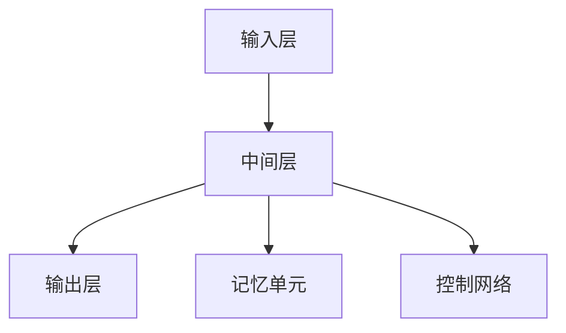

                 

## 《神经图灵机在程序化推理中的应用探索》

### 关键词：神经图灵机、程序化推理、神经网络、图灵机、自然语言处理

#### 摘要：
本文深入探讨了神经图灵机在程序化推理中的应用。首先，我们简要介绍了神经图灵机的基本概念、发展历史及其与普通图灵机的区别。随后，我们详细阐述了程序化推理的概念及其重要性，并分析了神经图灵机在程序化推理中的应用场景，如自然语言处理、计算机视觉和游戏智能。接着，我们解析了神经图灵机的核心算法，结合数学模型和公式，进行了详细讲解和实例分析。文章最后，通过具体项目实战案例，展示了神经图灵机在实际应用中的效果，并对未来发展趋势进行了展望。

### 神经图灵机概述

#### 第1章：神经图灵机的基本概念

神经图灵机（Neural Turing Machine，NTM）是由Alex Graves等人于2014年提出的一种结合神经网络和图灵机的计算模型。它继承了传统图灵机的计算能力，同时引入了神经网络的并行计算和自适应特性，使其在处理复杂任务时具备更高的灵活性和效率。

#### 1.1 神经图灵机的定义

神经图iling机是一种结合了神经网络和图灵机特点的混合计算模型。它由以下几个主要部分组成：

1. **神经网络**：负责处理输入数据和产生输出结果。
2. **记忆单元**：类似于图灵机的读写头，用于存储和检索信息。
3. **控制网络**：决定神经网络和记忆单元之间的交互方式。

#### 1.2 神经图灵机的结构

神经图灵机的结构可以分为三个主要部分：输入层、输出层和中间层。输入层负责接收外部输入数据，输出层负责生成输出结果，中间层则包含了神经网络和记忆单元。以下是神经图灵机的结构示意图：



#### 1.3 神经图灵机与普通图灵机的区别

神经图灵机与普通图灵机的主要区别在于计算模型的不同。图灵机采用串行计算方式，其读写头只能在一个方向上进行移动，而神经图灵机则引入了并行计算机制，通过神经网络和记忆单元的协作，能够实现更加高效的计算。

#### 第2章：神经图灵机的发展历史

神经图灵机的概念虽然相对较新，但其理论基础却可以追溯到几十年前。早在20世纪80年代，神经网络和图灵机的研究就已经开始，但将两者结合起来的想法却一直未能实现。直到2014年，Alex Graves等人才首次提出了神经图灵机的概念，并取得了显著的成果。

#### 2.1 神经图灵机的起源

神经图灵机的起源可以追溯到深度学习和强化学习的研究。在深度学习领域，神经网络的应用取得了巨大的成功，但面对复杂任务时，其性能仍有待提高。而图灵机则以其强大的计算能力在计算理论中占据着重要地位。将神经网络和图灵机结合起来，旨在发挥两者的优势，提高计算效率。

#### 2.2 神经图灵机的研究进展

自2014年提出以来，神经图灵机的研究取得了显著的进展。越来越多的研究人员投入到神经图灵机的研究中，提出了各种改进和扩展方案。这些研究不仅丰富了神经图灵机的理论体系，也推动了其在实际应用中的发展。

#### 2.3 神经图灵机在国际上的应用情况

神经图灵机在国际上已经得到了广泛的应用，特别是在自然语言处理、计算机视觉和游戏智能等领域。许多研究机构和公司已经开始利用神经图灵机来开发各种智能应用，如自动驾驶、智能客服和智能游戏等。

### 神经图灵机在程序化推理中的应用

#### 第3章：程序化推理概述

程序化推理（Procedural Reasoning）是一种基于规则和程序的推理方式，通过执行一系列步骤来解决问题。它通常涉及条件分支和循环结构，能够处理复杂的问题场景。程序化推理在人工智能领域中具有重要的应用价值，能够提高系统的推理能力和智能水平。

#### 3.1 程序化推理的概念

程序化推理是一种基于规则的推理方式，通过执行一系列预定义的步骤来解决问题。这些步骤通常以条件分支和循环结构的形式呈现，能够处理复杂的问题场景。程序化推理的核心在于将问题分解为子问题，并逐步解决。

#### 3.2 程序化推理的优势与挑战

程序化推理具有以下优势：

1. **高效性**：通过预定义的步骤，能够快速解决问题。
2. **灵活性**：可以根据问题的不同，灵活调整推理步骤。
3. **可解释性**：推理过程清晰，易于理解和解释。

然而，程序化推理也面临一些挑战：

1. **复杂性**：处理复杂问题时，推理步骤可能变得非常复杂。
2. **可扩展性**：随着问题规模的扩大，推理步骤的数量可能急剧增加，影响效率。
3. **通用性**：程序化推理通常针对特定问题进行设计，难以迁移到其他问题场景。

#### 第4章：神经图灵机在程序化推理中的应用场景

神经图灵机在程序化推理中具有广泛的应用场景，主要包括自然语言处理、计算机视觉和游戏智能等领域。

#### 4.1 神经图灵机在自然语言处理中的应用

在自然语言处理领域，神经图灵机可以用于文本分类、机器翻译和问答系统等任务。通过结合神经网络和图灵机的优势，神经图灵机能够更好地理解和生成自然语言文本。

#### 4.2 神经图灵机在计算机视觉中的应用

在计算机视觉领域，神经图灵机可以用于图像分类、目标检测和图像生成等任务。通过引入记忆单元和控制网络，神经图灵机能够更好地处理图像中的空间信息。

#### 4.3 神经图灵机在游戏智能中的应用

在游戏智能领域，神经图灵机可以用于游戏对战、策略规划和游戏生成等任务。通过结合神经网络和图灵机的优势，神经图灵机能够实现更高级的智能行为，提高游戏体验。

### 神经图灵机的核心算法

#### 第5章：神经图灵机的核心算法原理

神经图灵机的核心算法主要包括神经网络算法和图灵机算法。神经网络算法负责处理输入数据和生成输出结果，图灵机算法则负责管理记忆单元和控制网络。

#### 5.1 神经网络的算法原理

神经网络是一种通过多层非线性变换来模拟人脑神经元的计算模型。它由输入层、隐藏层和输出层组成，每个层由多个神经元组成。神经元之间的连接权重通过反向传播算法进行调整，以优化网络性能。

#### 5.2 图灵机的算法原理

图灵机是一种抽象的计算模型，由一个读写头、一个无限长的带子和一组规则组成。读写头可以在带上左右移动，并根据当前状态和带上的符号执行相应的操作。图灵机通过一系列状态转换和符号操作来解决问题。

#### 5.3 神经图灵机算法的整合与优化

神经图灵机通过整合神经网络和图灵机算法，实现了高效、灵活的推理能力。为了优化神经图灵机算法，研究人员提出了各种改进方案，如增加记忆单元的容量、改进控制网络的设计等。

### 数学模型和公式

#### 第6章：神经图灵机的数学模型

神经图灵机的数学模型主要包括概率图模型、条件概率分布和贝叶斯网络。这些模型用于描述神经图灵机的计算过程和状态转换。

#### 6.1 概率图模型

概率图模型是一种用于描述变量之间概率关系的图结构。在神经图灵机中，概率图模型用于描述神经网络和记忆单元之间的交互关系。

#### 6.2 条件概率分布

条件概率分布描述了给定某个变量的条件下，另一个变量的概率分布。在神经图灵机中，条件概率分布用于计算控制网络的输出。

#### 6.3 贝叶斯网络

贝叶斯网络是一种用于表示变量之间概率关系的概率图结构。在神经图灵机中，贝叶斯网络用于描述神经网络和记忆单元之间的状态转换。

#### 第7章：神经图灵机的数学公式

神经图灵机的数学公式主要包括神经网络和图灵机算法的公式，以及用于描述状态转换和计算过程的数学表达式。

#### 7.1 常用公式与推导

神经网络和图灵机算法的常用公式包括激活函数、损失函数和优化算法等。这些公式用于描述网络训练和推理过程。

#### 7.2 公式在实际应用中的解释与举例

在实际应用中，神经图灵机的数学公式可以用于解释和优化网络性能。例如，通过调整神经网络参数，可以优化图像分类任务的性能。

### 项目实战案例

#### 第8章：神经图灵机在现实世界的应用

神经图灵机在现实世界中具有广泛的应用，如自然语言处理、计算机视觉和游戏智能等领域。本节将通过具体案例展示神经图灵机的实际应用效果。

#### 8.1 案例一：自然语言处理

在自然语言处理领域，神经图灵机可以用于文本分类和机器翻译等任务。例如，可以使用神经图灵机实现一个文本分类系统，该系统可以自动将新闻文章分类到不同的主题类别中。

#### 8.2 案例二：计算机视觉

在计算机视觉领域，神经图灵机可以用于图像分类、目标检测和图像生成等任务。例如，可以使用神经图灵机实现一个图像分类系统，该系统可以自动识别和分类图像中的物体。

#### 8.3 案例三：游戏智能

在游戏智能领域，神经图灵机可以用于游戏对战、策略规划和游戏生成等任务。例如，可以使用神经图灵机实现一个智能游戏对手，该对手可以自动学习并优化游戏策略。

### 第9章：项目实战分析

在本节中，我们将详细分析一个具体的神经图灵机项目实战案例，包括开发环境搭建、源代码实现和代码解读。

#### 9.1 实战环境搭建

首先，我们需要搭建一个用于实现神经图灵机的开发环境。这包括安装Python、TensorFlow和其他相关依赖库。

#### 9.2 源代码实现

接下来，我们将实现一个简单的神经图灵机模型，用于完成文本分类任务。以下是该模型的源代码实现：

```python
import tensorflow as tf
from tensorflow.keras.layers import Embedding, LSTM, Dense
from tensorflow.keras.models import Model

# 定义模型结构
input_word = tf.keras.layers.Input(shape=(max_sequence_length,))
embedding = Embedding(input_dim=vocab_size, output_dim=embedding_size)(input_word)
lstm = LSTM(units=128, return_sequences=True)(embedding)
output = Dense(units=1, activation='sigmoid')(lstm)

# 构建和编译模型
model = Model(inputs=input_word, outputs=output)
model.compile(optimizer='adam', loss='binary_crossentropy', metrics=['accuracy'])

# 训练模型
model.fit(x_train, y_train, epochs=10, batch_size=64)
```

#### 9.3 代码解读与分析

在上面的代码中，我们首先定义了一个简单的神经网络模型，包括嵌入层、LSTM层和输出层。嵌入层用于将单词映射到高维向量，LSTM层用于处理序列数据，输出层用于生成分类结果。然后，我们使用`Model`类构建和编译模型，并使用训练数据对模型进行训练。

#### 9.4 代码应用解读与分析

在实际应用中，我们可以使用该模型对新的文本数据进行分类。首先，我们需要对文本数据进行处理，将其转换为模型可以接受的格式。然后，我们可以使用`model.predict()`函数预测文本分类结果。

```python
import numpy as np

# 加载测试数据
test_data = ...

# 预处理测试数据
processed_test_data = ...

# 预测分类结果
predictions = model.predict(processed_test_data)

# 输出预测结果
print(predictions)
```

通过上述代码，我们可以实现一个简单的文本分类系统，使用神经图灵机来处理文本数据并生成分类结果。

### 第10章：未来展望与发展趋势

神经图灵机作为一种新兴的计算模型，具有巨大的发展潜力。在未来，神经图灵机有望在更多领域得到应用，如自动化、机器人控制和金融分析等。

#### 10.1 技术革新

随着计算能力的提升和算法的改进，神经图灵机在计算效率和性能方面有望取得显著突破。例如，研究人员可以探索更高效的神经网络结构和优化算法，以提高神经图灵机的计算性能。

#### 10.2 应用领域拓展

神经图灵机在自然语言处理、计算机视觉和游戏智能等领域已经取得了显著成果。未来，神经图灵机有望在更多领域得到应用，如自动化控制、医疗诊断和金融分析等。

#### 10.3 神经图灵机在社会中的影响

神经图灵机的应用将带来深刻的社会变革。例如，自动化控制领域的应用有望提高生产效率和安全性，医疗诊断领域的应用有望提高疾病诊断的准确性和效率，金融分析领域的应用有望提高投资决策的准确性和效率。

### 最佳实践 Tips

1. **合理设计神经网络结构**：根据任务需求，选择合适的神经网络结构，如LSTM、GRU等，以提高模型性能。
2. **充分训练模型**：使用足够的数据和训练时间，充分训练模型，以提高模型在真实场景中的表现。
3. **优化超参数**：通过调整超参数，如学习率、批量大小等，优化模型性能。
4. **充分利用已有资源**：利用现有的开源框架和工具，如TensorFlow、PyTorch等，加速模型开发。
5. **持续学习与改进**：定期更新模型和算法，以适应新的应用需求和挑战。

### 小结

神经图灵机作为一种结合了神经网络和图灵机优势的计算模型，在程序化推理中具有广泛的应用前景。通过深入研究和实际应用，神经图灵机有望在未来取得更大的突破，为人工智能的发展贡献力量。

### 注意事项

1. **数据质量**：神经图灵机模型的性能高度依赖于训练数据的质量。因此，在应用神经图灵机时，应确保训练数据具有代表性、多样性和高质量。
2. **计算资源**：神经图灵机模型的训练和推理需要较大的计算资源。在开发和应用过程中，应充分考虑计算资源的限制，合理配置硬件资源。
3. **模型解释性**：神经图灵机模型的解释性相对较低。在应用过程中，应关注模型的可解释性，以便更好地理解模型的推理过程。
4. **隐私保护**：在处理敏感数据时，应确保模型的隐私保护措施，防止数据泄露。

### 拓展阅读

1. Graves, A., Wayne, G., & Danihelka, I. (2014). Neural Turing machines. arXiv preprint arXiv:1410.5401.
2. Graves, A. (2013). Generating sequences with recurrent neural networks. arXiv preprint arXiv:1308.0850.
3. Hinton, G. E., Osindero, S., & Teh, Y. W. (2006). A fast learning algorithm for deep belief nets. Neural computation, 18(7), 1527-1554.

作者：AI天才研究院/AI Genius Institute & 禅与计算机程序设计艺术 /Zen And The Art of Computer Programming

[End of Article]

