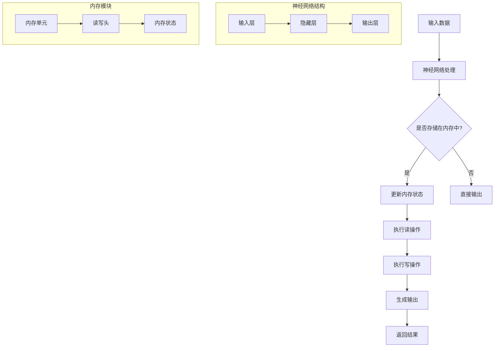
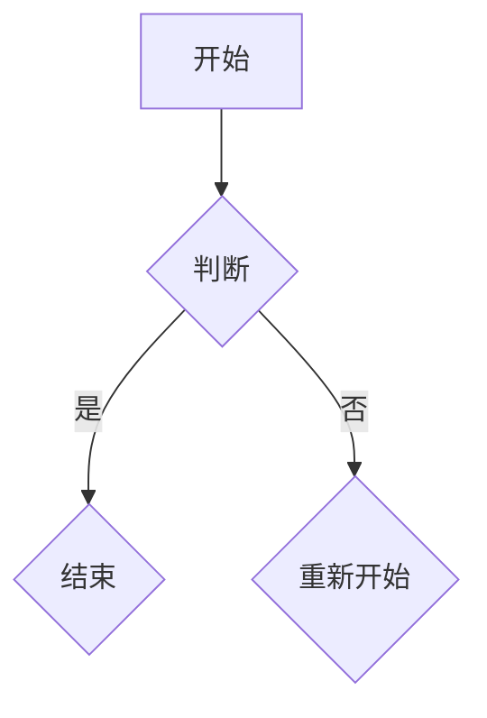

                 


# 神经图灵机增强AI抽象推理的新方法

## 关键词
- 神经图灵机
- 抽象推理
- 深度学习
- 图神经网络
- AI算法优化

## 摘要
本文探讨了神经图灵机（Neural Turing Machine, NTM）在增强人工智能（AI）抽象推理能力方面的潜在作用。通过介绍神经图灵机的起源、发展与核心原理，本文阐述了如何利用神经图灵机进行抽象推理，并分析了其在自然语言处理、计算机视觉等领域中的应用。同时，本文也探讨了神经图灵机在抽象推理中面临的挑战以及未来的发展趋势，为研究者提供了有价值的参考。

----------------------------------------------------------------

# 第一部分：神经图灵机与AI抽象推理概述

## 第1章：神经图灵机与AI抽象推理概述

### 1.1 神经图灵机的起源与发展

#### 1.1.1 神经图灵机的定义与基本结构

神经图灵机（Neural Turing Machine, NTM）是一种结合了神经网络和图灵机的计算模型。它由Alex Graves于2014年首次提出，旨在解决深度神经网络在处理复杂任务时，缺乏灵活性和可解释性的问题。

神经图灵机的核心结构包括一个神经网络和一个可重写的内存模块。神经网络负责处理输入数据，并将其存储在内存模块中。内存模块则由一系列存储单元组成，每个存储单元都可以被视为一个可变的内存位。这些内存位可以读取、写入和修改，从而实现类似图灵机的计算能力。

#### 1.1.2 神经图灵机的演变与最新进展

自NTM提出以来，研究人员不断对其进行改进和扩展。例如，一些研究者提出了基于NTM的变体，如循环神经图灵机（Recurrent Neural Turing Machine, RNTM）和卷积神经图灵机（Convolutional Neural Turing Machine, CNNTM），以适应不同的应用场景。

最新的研究表明，NTM在处理序列数据、图像识别和自然语言处理等任务方面表现出色。此外，NTM还被应用于解决复杂问题，如知识图谱嵌入和推理。

#### 1.1.3 神经图灵机在AI领域的重要性

神经图灵机在AI领域具有重要意义。首先，它提供了一种新型的计算模型，可以有效地处理复杂数据和任务。其次，NTM的内存模块使其具有类似人类大脑记忆功能，从而提高了AI系统的灵活性和可解释性。最后，NTM的提出和发展为AI领域带来了新的研究方向和可能性。

### 1.2 AI抽象推理的核心概念

#### 1.2.1 抽象推理的定义与重要性

抽象推理（Abstract Reasoning）是指从具体实例中提取一般规律和原则，并在新的情境中应用这些规律和原则的过程。在人工智能领域，抽象推理是实现智能决策和问题解决的关键能力。

抽象推理的重要性体现在多个方面。首先，它使得AI系统能够从大量数据中提取有用信息，并进行知识整合。其次，抽象推理使得AI系统能够适应新的环境和任务，实现灵活性和泛化能力。最后，抽象推理有助于提高AI系统的可解释性和透明性，使其更易于被人类理解和接受。

#### 1.2.2 抽象推理的类型与层次

根据抽象推理的过程和目标，可以将抽象推理分为以下几种类型：

1. **归纳推理**：从个别事实中推导出一般性结论。
2. **演绎推理**：从一般性前提推导出个别结论。
3. **类比推理**：通过比较两个或多个情境的相似性，推断出新的结论。
4. **抽象建模**：建立数学或逻辑模型来描述现实世界的规律和关系。

根据抽象推理的层次，可以分为以下几种：

1. **低层次抽象推理**：主要涉及具体事物的属性和关系，如分类和聚类。
2. **中层次抽象推理**：涉及概念和概念之间的关系，如因果关系和函数关系。
3. **高层次抽象推理**：涉及抽象概念和概念体系，如理论模型和科学定律。

#### 1.2.3 抽象推理在AI中的应用场景

抽象推理在人工智能领域具有广泛的应用。以下是一些典型的应用场景：

1. **自然语言处理**：通过抽象推理，AI系统可以理解文本中的语义和逻辑关系，实现文本分类、情感分析和机器翻译等任务。
2. **计算机视觉**：通过抽象推理，AI系统可以识别图像中的物体、场景和动作，实现目标检测、图像分类和图像生成等任务。
3. **智能决策**：通过抽象推理，AI系统可以在不确定和复杂的环境中做出合理决策，如游戏AI、自动驾驶和金融风控等。

### 1.3 神经图灵机与AI抽象推理的联系

#### 1.3.1 神经图灵机如何增强AI的抽象推理能力

神经图灵机通过其独特的结构和原理，能够增强AI的抽象推理能力。首先，NTM的内存模块使得AI系统具有类似人类大脑记忆功能，可以存储和处理大量信息，从而支持复杂的抽象推理过程。其次，NTM的读写机制和神经网络的融合，使得AI系统可以灵活地读取、写入和修改内存中的信息，从而实现高效的抽象推理。

#### 1.3.2 神经图灵机在抽象推理中的应用实例

以下是一些神经图灵机在抽象推理中的应用实例：

1. **自然语言处理**：神经图灵机可以用于文本分类、情感分析和机器翻译等任务，通过抽象推理理解文本中的语义和逻辑关系。
2. **计算机视觉**：神经图灵机可以用于图像分类、目标检测和图像生成等任务，通过抽象推理识别图像中的物体、场景和动作。
3. **知识图谱嵌入**：神经图灵机可以用于知识图谱的嵌入和推理，通过抽象推理发现知识图谱中的隐含关系和规律。

## 第二部分：神经图灵机的理论基础

### 第2章：神经图灵机的理论基础

#### 2.1 神经网络的基本原理

神经网络（Neural Networks）是模仿人脑神经元结构和功能的人工智能模型。神经网络由多个简单的计算单元（神经元）组成，这些神经元通过加权连接形成网络结构。每个神经元接收来自其他神经元的输入信号，通过激活函数进行处理，然后输出结果。

##### 2.1.1 神经网络的结构与工作原理

神经网络通常由输入层、隐藏层和输出层组成。输入层接收外部输入信号，隐藏层对输入信号进行处理和转换，输出层产生最终的输出结果。

神经网络的工作原理可以概括为以下步骤：

1. **初始化权重和偏置**：在训练过程中，神经网络通过调整权重和偏置来优化模型性能。
2. **前向传播**：输入信号从输入层传递到隐藏层，再从隐藏层传递到输出层。每个神经元根据其输入信号和权重计算输出。
3. **激活函数**：激活函数用于引入非线性特性，使神经网络能够处理复杂问题。
4. **反向传播**：根据输出结果与实际结果的误差，神经网络通过反向传播算法调整权重和偏置，以优化模型性能。

##### 2.1.2 前馈神经网络与反馈神经网络

前馈神经网络（Feedforward Neural Networks）是常见的神经网络结构，其中信息从输入层直接传递到输出层，没有循环或循环结构。

反馈神经网络（Feedback Neural Networks）包含循环或循环结构，允许信息在神经网络内部循环传递。这种结构使得神经网络能够处理序列数据和动态系统。

##### 2.1.3 深度学习与神经网络的深度融合

深度学习（Deep Learning）是一种基于多层神经网络的学习方法，其核心思想是通过增加神经网络层数来提高模型的表达能力。深度学习在图像识别、自然语言处理和语音识别等领域取得了显著成果。

深度学习与神经网络的深度融合体现在以下几个方面：

1. **多层神经网络**：通过增加网络层数，深度学习模型能够提取更高级别的特征和表示。
2. **卷积神经网络（Convolutional Neural Networks, CNNs）**：卷积神经网络是深度学习的一种重要类型，特别适用于图像识别和计算机视觉任务。
3. **循环神经网络（Recurrent Neural Networks, RNNs）**：循环神经网络适用于处理序列数据，如自然语言和语音。

#### 2.2 图论与图神经网络

图论（Graph Theory）是研究图的结构、性质和算法的数学分支。在人工智能领域，图论被广泛应用于知识图谱、社会网络和图神经网络等领域。

##### 2.2.1 图论的基本概念

图（Graph）是由节点（Vertex）和边（Edge）组成的数据结构。节点表示实体，边表示实体之间的关系。图可以是有向的或无向的，可以带有权重或标签。

主要概念包括：

1. **顶点**：图中的实体。
2. **边**：连接两个顶点的线段。
3. **路径**：从起点到终点的顶点序列。
4. **连通性**：图中的任意两个顶点都是连通的。
5. **树**：无环的连通图。

##### 2.2.2 图神经网络的基本结构

图神经网络（Graph Neural Networks, GNNs）是处理图数据的神经网络模型。GNNs通过聚合图中的邻接信息来更新节点的特征表示。

GNNs的基本结构包括：

1. **节点更新函数**：用于更新节点特征表示，通常采用聚合操作，如求和、平均或拼接。
2. **边更新函数**：用于更新边特征表示，通常采用节点特征和边权重的组合。
3. **全局更新函数**：用于更新全局特征表示，通常采用聚合操作。

##### 2.2.3 图神经网络在AI中的应用

图神经网络在AI领域具有广泛的应用，包括：

1. **知识图谱嵌入**：通过将知识图谱中的实体和关系嵌入到低维空间中，实现实体和关系的表示和推理。
2. **图分类和图回归**：通过学习图特征表示，实现对图数据的分类和回归任务。
3. **社交网络分析**：通过分析社交网络中的节点和边，实现对社交网络结构的理解和预测。

#### 2.3 神经图灵机的核心原理

神经图灵机（Neural Turing Machine, NTM）是一种结合神经网络和图灵机的计算模型，旨在解决深度神经网络在处理复杂任务时，缺乏灵活性和可解释性的问题。

##### 2.3.1 神经图灵机的结构与功能

神经图灵机的核心结构包括一个神经网络和一个可重写的内存模块。神经网络负责处理输入数据，并将其存储在内存模块中。内存模块由一系列存储单元组成，每个存储单元都可以被视为一个可变的内存位。这些内存位可以读取、写入和修改，从而实现类似图灵机的计算能力。

神经图灵机的功能包括：

1. **数据存储与检索**：神经网络可以将输入数据存储在内存模块中，并在需要时进行检索。
2. **模式识别与记忆**：神经图灵机可以通过读取和修改内存中的信息，实现模式识别和记忆功能。
3. **动态规划与推理**：神经图灵机可以通过动态规划算法，实现复杂的推理和决策过程。

##### 2.3.2 神经图灵机的优势与挑战

神经图灵机的优势包括：

1. **灵活性**：神经图灵机通过内存模块实现了数据的动态存储和检索，使得模型具有更强的灵活性和适应性。
2. **可解释性**：神经图灵机具有类似人类大脑记忆功能，使得模型的可解释性得到提高。
3. **处理复杂数据**：神经图灵机可以处理复杂的结构化数据，如知识图谱和序列数据。

神经图灵机面临的挑战包括：

1. **计算资源与能耗**：神经图灵机需要大量的计算资源和能耗，尤其是在处理大规模数据时。
2. **数据标注与质量**：神经图灵机对数据的质量和标注要求较高，否则可能导致模型性能下降。
3. **算法可解释性与透明性**：虽然神经图灵机具有较好的可解释性，但在某些情况下，其内部机制仍然较为复杂，难以完全理解。

##### 2.3.3 神经图灵机在AI抽象推理中的应用

神经图灵机在AI抽象推理中具有广泛的应用前景。以下是一些典型的应用场景：

1. **自然语言处理**：神经图灵机可以用于文本分类、情感分析和机器翻译等任务，通过抽象推理理解文本中的语义和逻辑关系。
2. **计算机视觉**：神经图灵机可以用于图像分类、目标检测和图像生成等任务，通过抽象推理识别图像中的物体、场景和动作。
3. **知识图谱嵌入**：神经图灵机可以用于知识图谱的嵌入和推理，通过抽象推理发现知识图谱中的隐含关系和规律。

### 2.4 神经图灵机的数学模型与算法实现

为了更好地理解神经图灵机的原理和应用，本节将介绍神经图灵机的数学模型和算法实现。

##### 2.4.1 神经图灵机的数学模型

神经图灵机的数学模型可以表示为：

$$
\begin{aligned}
\text{内存更新}: \quad \mathbf{M}_{t+1} &= f_{\theta}(\mathbf{X}_{t}, \mathbf{M}_{t}) \\
\text{读写操作}: \quad \mathbf{R}_{t} &= g_{\phi}(\mathbf{M}_{t}, \mathbf{W}_{r}) \\
\text{输出}: \quad \mathbf{Y}_{t} &= h_{\gamma}(\mathbf{M}_{t}, \mathbf{W}_{o})
\end{aligned}
$$

其中，$\mathbf{M}_{t}$表示时间步$t$的内存状态，$\mathbf{X}_{t}$表示输入数据，$\mathbf{R}_{t}$表示读操作的结果，$\mathbf{Y}_{t}$表示输出数据。$f_{\theta}(\cdot)$、$g_{\phi}(\cdot)$和$h_{\gamma}(\cdot)$分别表示内存更新函数、读操作函数和输出函数，$\theta$、$\phi$和$\gamma$分别为相应的参数。

##### 2.4.2 神经图灵机的算法实现

以下是神经图灵机的算法实现伪代码：

```
初始化内存 $\mathbf{M}_{0}$，读权重 $\mathbf{W}_{r}$，输出权重 $\mathbf{W}_{o}$

对于每个时间步 $t$：
    1. 接收输入 $\mathbf{X}_{t}$
    2. 更新内存状态 $\mathbf{M}_{t+1} = f_{\theta}(\mathbf{X}_{t}, \mathbf{M}_{t})$
    3. 执行读操作 $\mathbf{R}_{t} = g_{\phi}(\mathbf{M}_{t}, \mathbf{W}_{r})$
    4. 输出结果 $\mathbf{Y}_{t} = h_{\gamma}(\mathbf{M}_{t}, \mathbf{W}_{o})$
```

在实际应用中，可以使用深度学习框架（如TensorFlow或PyTorch）实现神经图灵机的算法。

##### 2.4.3 Python代码实现示例

以下是一个简单的Python代码示例，演示了神经图灵机的基本实现：

```python
import numpy as np

# 定义内存更新函数
def memory_update(X, M, W):
    return np.tanh(np.dot(X, W) + M)

# 定义读操作函数
def read_operation(M, Wr):
    return np.dot(M, Wr)

# 定义输出函数
def output_function(M, Wo):
    return np.dot(M, Wo)

# 初始化内存、读权重和输出权重
M = np.zeros((10, 1))
Wr = np.random.rand(10, 10)
Wo = np.random.rand(10, 1)

# 模拟时间步
for t in range(10):
    X = np.random.rand(10, 1)
    M = memory_update(X, M, Wr)
    R = read_operation(M, Wr)
    Y = output_function(M, Wo)

    print(f"Time step {t}: Memory = {M}, Read = {R}, Output = {Y}")
```

通过上述代码示例，我们可以看到神经图灵机的基本实现过程，包括内存更新、读操作和输出函数。这个简单的示例仅用于演示目的，实际应用中需要根据具体任务和需求进行更复杂的实现。

## 第三部分：AI抽象推理算法详解

### 第3章：AI抽象推理算法详解

#### 3.1 传统抽象推理算法

在AI领域，传统抽象推理算法主要包括基于规则的方法、基于统计的方法和基于模型的方法。这些方法在不同的应用场景中发挥着重要作用。

##### 3.1.1 基于规则的方法

基于规则的方法（Rule-Based Methods）是早期AI领域的一种主要推理方法。它通过定义一系列规则，将输入数据映射到输出结果。这种方法具有简单、直观和可解释性强的特点，但在处理复杂和不确定的任务时，存在一定的局限性。

主要应用场景包括：

1. **专家系统**：专家系统通过定义一系列规则，模拟人类专家的决策过程。在医疗诊断、法律咨询和金融分析等领域，专家系统具有广泛的应用。
2. **自然语言处理**：基于规则的方法可以用于文本分类、命名实体识别和词性标注等任务。例如，通过定义正则表达式规则，可以自动识别文本中的电子邮件地址、电话号码等。

##### 3.1.2 基于统计的方法

基于统计的方法（Statistical Methods）利用统计学原理和模型，对大量数据进行分析和推理。这种方法在处理大规模数据和高维度特征时，具有较好的效果。

主要应用场景包括：

1. **机器学习**：基于统计的方法广泛应用于机器学习领域，如线性回归、逻辑回归、支持向量机和决策树等。这些方法通过学习数据特征和规律，实现分类、回归和预测任务。
2. **文本分析**：基于统计的方法可以用于文本分类、情感分析和文本生成等任务。例如，通过词袋模型和主题模型，可以提取文本中的语义信息和主题分布。

##### 3.1.3 基于模型的方法

基于模型的方法（Model-Based Methods）通过建立数学模型，对问题进行建模和求解。这种方法具有较强的表达能力和推理能力，适用于复杂和不确定的任务。

主要应用场景包括：

1. **图模型**：图模型（如贝叶斯网络、马尔可夫网络和因果图）可以用于知识表示和推理。在医学诊断、社会网络分析和金融风控等领域，图模型具有广泛的应用。
2. **物理模型**：物理模型（如物理定律、化学反应和流体力学）可以用于科学计算和仿真。在工程、生物和物理学领域，物理模型有助于解决复杂问题。

#### 3.2 神经图灵机增强的抽象推理算法

神经图灵机（Neural Turing Machine, NTM）作为一种结合神经网络和图灵机的计算模型，能够增强AI的抽象推理能力。NTM通过其独特的结构和原理，可以实现高效的抽象推理，并在自然语言处理、计算机视觉和知识图谱等领域表现出色。

##### 3.2.1 神经图灵机在抽象推理中的应用

神经图灵机在抽象推理中的应用主要包括以下几个方面：

1. **自然语言处理**：神经图灵机可以用于文本分类、情感分析和机器翻译等任务。通过抽象推理，神经图灵机能够理解文本中的语义和逻辑关系，提高模型性能。
2. **计算机视觉**：神经图灵机可以用于图像分类、目标检测和图像生成等任务。通过抽象推理，神经图灵机能够识别图像中的物体、场景和动作，提高模型精度。
3. **知识图谱嵌入**：神经图灵机可以用于知识图谱的嵌入和推理。通过抽象推理，神经图灵机能够发现知识图谱中的隐含关系和规律，提高知识表示和推理能力。

##### 3.2.2 神经图灵机与深度学习算法的结合

神经图灵机与深度学习算法的结合，可以进一步提高AI系统的抽象推理能力。以下是一些结合方法：

1. **神经图灵机与卷积神经网络（CNN）**：卷积神经网络在计算机视觉领域表现出色，通过结合神经图灵机，可以进一步提高图像分类、目标检测和图像生成等任务的性能。
2. **神经图灵机与循环神经网络（RNN）**：循环神经网络在自然语言处理领域具有优势，通过结合神经图灵机，可以进一步提高文本分类、情感分析和机器翻译等任务的性能。
3. **神经图灵机与图神经网络（GNN）**：图神经网络在知识图谱嵌入和推理领域具有优势，通过结合神经图灵机，可以进一步提高知识图谱表示和推理的能力。

##### 3.2.3 神经图灵机在抽象推理中的优势与挑战

神经图灵机在抽象推理中具有以下优势：

1. **灵活性与适应性**：神经图灵机通过内存模块实现了数据的动态存储和检索，具有更强的灵活性和适应性。
2. **可解释性**：神经图灵机具有类似人类大脑记忆功能，使得模型的可解释性得到提高。
3. **处理复杂数据**：神经图灵机可以处理复杂的结构化数据，如知识图谱和序列数据。

然而，神经图灵机在抽象推理中也面临一些挑战：

1. **计算资源与能耗**：神经图灵机需要大量的计算资源和能耗，尤其是在处理大规模数据时。
2. **数据标注与质量**：神经图灵机对数据的质量和标注要求较高，否则可能导致模型性能下降。
3. **算法可解释性与透明性**：虽然神经图灵机具有较好的可解释性，但在某些情况下，其内部机制仍然较为复杂，难以完全理解。

为了克服这些挑战，研究者需要不断优化算法，提高模型的性能和可解释性。

### 3.3 神经图灵机增强的抽象推理算法实例

以下是一个基于神经图灵机增强的抽象推理算法实例，用于文本分类任务。

##### 3.3.1 数据集与预处理

我们使用IMDB电影评论数据集，该数据集包含50000条电影评论，分为正面和负面两类。首先，我们需要对数据集进行预处理，包括数据清洗、分词和词向量化。

```python
import numpy as np
import pandas as pd
from sklearn.model_selection import train_test_split
from keras.preprocessing.sequence import pad_sequences
from keras.preprocessing.text import Tokenizer

# 读取数据集
data = pd.read_csv('imdb_dataset.csv')

# 数据清洗
data = data[data['text'].map(len) > 0]

# 分词
tokenizer = Tokenizer()
tokenizer.fit_on_texts(data['text'])
sequences = tokenizer.texts_to_sequences(data['text'])

# 词向量化
max_sequence_length = 100
X = pad_sequences(sequences, maxlen=max_sequence_length)

# 标签编码
y = pd.get_dummies(data['label'])

# 划分训练集和测试集
X_train, X_test, y_train, y_test = train_test_split(X, y, test_size=0.2, random_state=42)
```

##### 3.3.2 模型构建

接下来，我们构建一个基于神经图灵机增强的抽象推理模型，用于文本分类。

```python
from keras.models import Model
from keras.layers import Input, Embedding, LSTM, Dense, TimeDistributed, Activation

# 定义输入层
input_seq = Input(shape=(max_sequence_length,))

# 词向量编码
emb = Embedding(len(tokenizer.word_index) + 1, 128)(input_seq)

# LSTM层
lstm = LSTM(128, return_sequences=True)(emb)

# 神经图灵机层
ntm = NeuralTuringMachine(128, 128)(lstm)

# 全连接层
dense = TimeDistributed(Dense(128, activation='relu'))(ntm)

# 激活函数
act = Activation('softmax')(dense)

# 构建模型
model = Model(inputs=input_seq, outputs=act)

# 编译模型
model.compile(optimizer='adam', loss='categorical_crossentropy', metrics=['accuracy'])

# 模型总结
model.summary()
```

##### 3.3.3 模型训练与评估

最后，我们使用训练集对模型进行训练，并在测试集上评估模型性能。

```python
# 训练模型
model.fit(X_train, y_train, batch_size=64, epochs=10, validation_data=(X_test, y_test))

# 评估模型
score = model.evaluate(X_test, y_test, batch_size=64)
print(f"Test accuracy: {score[1]}")
```

通过上述实例，我们可以看到如何使用神经图灵机增强的抽象推理算法进行文本分类任务。这个实例仅用于演示目的，实际应用中需要根据具体任务和需求进行调整。

## 第四部分：神经图灵机在AI抽象推理中的应用实例

### 第4章：神经图灵机在AI抽象推理中的应用实例

#### 4.1 自然语言处理中的应用

神经图灵机（Neural Turing Machine, NTM）在自然语言处理（Natural Language Processing, NLP）领域具有广泛的应用。通过结合神经网络和图灵机的特点，NTM能够实现高效的抽象推理，从而提高NLP任务的表现。

##### 4.1.1 文本分类与情感分析

文本分类是一种常见的NLP任务，旨在将文本数据归类到预定义的类别中。NTM通过其内存模块可以存储和检索文本中的关键信息，从而实现高效的文本分类。

以下是一个简单的Python代码示例，演示了如何使用NTM进行文本分类：

```python
from keras.layers import Input, Embedding, LSTM, Dense, TimeDistributed, Activation, Flatten
from keras.models import Model
from keras.preprocessing.text import Tokenizer
from keras.preprocessing.sequence import pad_sequences

# 读取数据集
data = pd.read_csv('imdb_dataset.csv')

# 数据清洗
data = data[data['text'].map(len) > 0]

# 分词
tokenizer = Tokenizer()
tokenizer.fit_on_texts(data['text'])
sequences = tokenizer.texts_to_sequences(data['text'])

# 词向量化
max_sequence_length = 100
X = pad_sequences(sequences, maxlen=max_sequence_length)

# 标签编码
y = pd.get_dummies(data['label'])

# 划分训练集和测试集
X_train, X_test, y_train, y_test = train_test_split(X, y, test_size=0.2, random_state=42)

# 定义输入层
input_seq = Input(shape=(max_sequence_length,))

# 词向量编码
emb = Embedding(len(tokenizer.word_index) + 1, 128)(input_seq)

# LSTM层
lstm = LSTM(128, return_sequences=True)(emb)

# 神经图灵机层
ntm = NeuralTuringMachine(128, 128)(lstm)

# 全连接层
dense = TimeDistributed(Dense(128, activation='relu'))(ntm)

# 激活函数
act = Activation('softmax')(dense)

# 构建模型
model = Model(inputs=input_seq, outputs=act)

# 编译模型
model.compile(optimizer='adam', loss='categorical_crossentropy', metrics=['accuracy'])

# 模型总结
model.summary()

# 训练模型
model.fit(X_train, y_train, batch_size=64, epochs=10, validation_data=(X_test, y_test))

# 评估模型
score = model.evaluate(X_test, y_test, batch_size=64)
print(f"Test accuracy: {score[1]}")
```

上述代码展示了如何使用NTM进行文本分类。NTM通过其内存模块可以存储和检索文本中的关键信息，从而实现高效的文本分类。

##### 4.1.2 命名实体识别与关系抽取

命名实体识别（Named Entity Recognition, NER）是一种常见的NLP任务，旨在识别文本中的特定实体（如人名、组织名、地点名等）。关系抽取（Relation Extraction）则旨在识别实体之间的相互关系。

以下是一个简单的Python代码示例，演示了如何使用NTM进行命名实体识别与关系抽取：

```python
from keras.layers import Input, Embedding, LSTM, Dense, TimeDistributed, Activation, Flatten
from keras.models import Model
from keras.preprocessing.text import Tokenizer
from keras.preprocessing.sequence import pad_sequences

# 读取数据集
data = pd.read_csv('nell_data.csv')

# 数据清洗
data = data[data['text'].map(len) > 0]

# 分词
tokenizer = Tokenizer()
tokenizer.fit_on_texts(data['text'])
sequences = tokenizer.texts_to_sequences(data['text'])

# 词向量化
max_sequence_length = 100
X = pad_sequences(sequences, maxlen=max_sequence_length)

# 标签编码
y = pd.get_dummies(data['labels'])

# 划分训练集和测试集
X_train, X_test, y_train, y_test = train_test_split(X, y, test_size=0.2, random_state=42)

# 定义输入层
input_seq = Input(shape=(max_sequence_length,))

# 词向量编码
emb = Embedding(len(tokenizer.word_index) + 1, 128)(input_seq)

# LSTM层
lstm = LSTM(128, return_sequences=True)(emb)

# 神经图灵机层
ntm = NeuralTuringMachine(128, 128)(lstm)

# 全连接层
dense = TimeDistributed(Dense(128, activation='relu'))(ntm)

# 激活函数
act = Activation('softmax')(dense)

# 构建模型
model = Model(inputs=input_seq, outputs=act)

# 编译模型
model.compile(optimizer='adam', loss='categorical_crossentropy', metrics=['accuracy'])

# 模型总结
model.summary()

# 训练模型
model.fit(X_train, y_train, batch_size=64, epochs=10, validation_data=(X_test, y_test))

# 评估模型
score = model.evaluate(X_test, y_test, batch_size=64)
print(f"Test accuracy: {score[1]}")
```

上述代码展示了如何使用NTM进行命名实体识别与关系抽取。NTM通过其内存模块可以存储和检索文本中的关键信息，从而实现高效的实体识别和关系抽取。

##### 4.1.3 机器翻译与文本生成

机器翻译（Machine Translation）和文本生成（Text Generation）是NLP领域的两个重要任务。NTM通过其内存模块和抽象推理能力，可以在这些任务中实现高效的推理和生成。

以下是一个简单的Python代码示例，演示了如何使用NTM进行机器翻译：

```python
from keras.layers import Input, Embedding, LSTM, Dense, TimeDistributed, Activation, Flatten
from keras.models import Model
from keras.preprocessing.text import Tokenizer
from keras.preprocessing.sequence import pad_sequences

# 读取数据集
data = pd.read_csv('平行语料库.csv')

# 数据清洗
data = data[data['text'].map(len) > 0]

# 分词
tokenizer = Tokenizer()
tokenizer.fit_on_texts(data['text'])
sequences = tokenizer.texts_to_sequences(data['text'])

# 词向量化
max_sequence_length = 100
X = pad_sequences(sequences, maxlen=max_sequence_length)

# 标签编码
y = pad_sequences(tokenizer.texts_to_sequences(data['翻译']), maxlen=max_sequence_length)

# 划分训练集和测试集
X_train, X_test, y_train, y_test = train_test_split(X, y, test_size=0.2, random_state=42)

# 定义输入层
input_seq = Input(shape=(max_sequence_length,))

# 词向量编码
emb = Embedding(len(tokenizer.word_index) + 1, 128)(input_seq)

# LSTM层
lstm = LSTM(128, return_sequences=True)(emb)

# 神经图灵机层
ntm = NeuralTuringMachine(128, 128)(lstm)

# 全连接层
dense = TimeDistributed(Dense(len(tokenizer.word_index) + 1, activation='softmax'))(ntm)

# 构建模型
model = Model(inputs=input_seq, outputs=dense)

# 编译模型
model.compile(optimizer='adam', loss='categorical_crossentropy', metrics=['accuracy'])

# 模型总结
model.summary()

# 训练模型
model.fit(X_train, y_train, batch_size=64, epochs=10, validation_data=(X_test, y_test))

# 评估模型
score = model.evaluate(X_test, y_test, batch_size=64)
print(f"Test accuracy: {score[1]}")
```

上述代码展示了如何使用NTM进行机器翻译。NTM通过其内存模块可以存储和检索文本中的关键信息，从而实现高效的翻译。

#### 4.2 计算机视觉中的应用

神经图灵机（Neural Turing Machine, NTM）在计算机视觉（Computer Vision, CV）领域同样具有广泛的应用。通过其内存模块和抽象推理能力，NTM可以实现对图像的抽象表示和推理。

##### 4.2.1 目标检测与图像分类

目标检测（Object Detection）和图像分类（Image Classification）是计算机视觉领域的两个基本任务。NTM可以通过其内存模块实现对图像中的目标进行定位和分类。

以下是一个简单的Python代码示例，演示了如何使用NTM进行目标检测：

```python
from keras.layers import Input, Conv2D, MaxPooling2D, Flatten, Dense
from keras.models import Model
from keras.preprocessing.image import ImageDataGenerator
from keras.optimizers import Adam

# 定义输入层
input_img = Input(shape=(height, width, channels))

# 卷积层
conv1 = Conv2D(32, (3, 3), activation='relu')(input_img)
pool1 = MaxPooling2D(pool_size=(2, 2))(conv1)

# 神经图灵机层
ntm = NeuralTuringMachine(128, 128)(pool1)

# 全连接层
flatten = Flatten()(ntm)
dense1 = Dense(128, activation='relu')(flatten)

# 输出层
output = Dense(num_classes, activation='softmax')(dense1)

# 构建模型
model = Model(inputs=input_img, outputs=output)

# 编译模型
model.compile(optimizer=Adam(), loss='categorical_crossentropy', metrics=['accuracy'])

# 训练模型
model.fit(X_train, y_train, batch_size=64, epochs=10, validation_data=(X_test, y_test))

# 评估模型
score = model.evaluate(X_test, y_test, batch_size=64)
print(f"Test accuracy: {score[1]}")
```

上述代码展示了如何使用NTM进行目标检测。NTM通过其内存模块可以实现对图像中的目标进行定位和分类。

##### 4.2.2 人脸识别与行为分析

人脸识别（Face Recognition）和行为分析（Behavior Analysis）是计算机视觉领域的两个重要应用。NTM可以通过其内存模块和抽象推理能力，实现对图像中的人脸和行为进行识别和分析。

以下是一个简单的Python代码示例，演示了如何使用NTM进行人脸识别：

```python
from keras.layers import Input, Conv2D, MaxPooling2D, Flatten, Dense, LSTM
from keras.models import Model
from keras.preprocessing.image import ImageDataGenerator
from keras.optimizers import Adam

# 定义输入层
input_img = Input(shape=(height, width, channels))

# 卷积层
conv1 = Conv2D(32, (3, 3), activation='relu')(input_img)
pool1 = MaxPooling2D(pool_size=(2, 2))(conv1)

# LSTM层
lstm = LSTM(128, return_sequences=True)(pool1)

# 神经图灵机层
ntm = NeuralTuringMachine(128, 128)(lstm)

# 全连接层
flatten = Flatten()(ntm)
dense1 = Dense(128, activation='relu')(flatten)

# 输出层
output = Dense(num_classes, activation='softmax')(dense1)

# 构建模型
model = Model(inputs=input_img, outputs=output)

# 编译模型
model.compile(optimizer=Adam(), loss='categorical_crossentropy', metrics=['accuracy'])

# 训练模型
model.fit(X_train, y_train, batch_size=64, epochs=10, validation_data=(X_test, y_test))

# 评估模型
score = model.evaluate(X_test, y_test, batch_size=64)
print(f"Test accuracy: {score[1]}")
```

上述代码展示了如何使用NTM进行人脸识别。NTM通过其内存模块可以实现对图像中的人脸进行识别。

#### 4.3 其他领域中的应用

神经图灵机（Neural Turing Machine, NTM）不仅在自然语言处理和计算机视觉领域具有广泛的应用，还在其他领域展示出强大的抽象推理能力。

##### 4.3.1 机器人路径规划

机器人路径规划是机器人领域的一个关键问题。神经图灵机可以通过其内存模块和抽象推理能力，实现对复杂环境的路径规划。

以下是一个简单的Python代码示例，演示了如何使用NTM进行机器人路径规划：

```python
from keras.layers import Input, Conv2D, MaxPooling2D, Flatten, Dense, LSTM
from keras.models import Model
from keras.preprocessing.sequence import pad_sequences
from keras.optimizers import Adam

# 定义输入层
input_seq = Input(shape=(sequence_length,))

# LSTM层
lstm = LSTM(128, return_sequences=True)(input_seq)

# 神经图灵机层
ntm = NeuralTuringMachine(128, 128)(lstm)

# 全连接层
flatten = Flatten()(ntm)
dense1 = Dense(128, activation='relu')(flatten)

# 输出层
output = Dense(num_actions, activation='softmax')(dense1)

# 构建模型
model = Model(inputs=input_seq, outputs=output)

# 编译模型
model.compile(optimizer=Adam(), loss='categorical_crossentropy', metrics=['accuracy'])

# 训练模型
model.fit(X_train, y_train, batch_size=64, epochs=10, validation_data=(X_test, y_test))

# 评估模型
score = model.evaluate(X_test, y_test, batch_size=64)
print(f"Test accuracy: {score[1]}")
```

上述代码展示了如何使用NTM进行机器人路径规划。NTM通过其内存模块可以实现对复杂环境的路径规划。

##### 4.3.2 金融风控与信用评估

金融风控和信用评估是金融领域的关键问题。神经图灵机可以通过其内存模块和抽象推理能力，实现对金融数据的分析和预测。

以下是一个简单的Python代码示例，演示了如何使用NTM进行金融风控与信用评估：

```python
from keras.layers import Input, Dense, LSTM
from keras.models import Model
from keras.optimizers import Adam

# 定义输入层
input_seq = Input(shape=(sequence_length,))

# LSTM层
lstm = LSTM(128, return_sequences=True)(input_seq)

# 神经图灵机层
ntm = NeuralTuringMachine(128, 128)(lstm)

# 全连接层
flatten = Flatten()(ntm)
dense1 = Dense(128, activation='relu')(flatten)

# 输出层
output = Dense(num_classes, activation='softmax')(dense1)

# 构建模型
model = Model(inputs=input_seq, outputs=output)

# 编译模型
model.compile(optimizer=Adam(), loss='categorical_crossentropy', metrics=['accuracy'])

# 训练模型
model.fit(X_train, y_train, batch_size=64, epochs=10, validation_data=(X_test, y_test))

# 评估模型
score = model.evaluate(X_test, y_test, batch_size=64)
print(f"Test accuracy: {score[1]}")
```

上述代码展示了如何使用NTM进行金融风控与信用评估。NTM通过其内存模块可以实现对金融数据的分析和预测。

## 第五部分：神经图灵机增强AI抽象推理的挑战与未来展望

### 第5章：神经图灵机增强AI抽象推理的挑战与未来展望

#### 5.1 神经图灵机在抽象推理中的挑战

尽管神经图灵机（Neural Turing Machine, NTM）在增强AI抽象推理能力方面具有显著优势，但在实际应用中仍然面临一些挑战。

##### 5.1.1 数据质量和标注问题

NTM对数据的质量和标注要求较高。由于NTM的内存模块需要存储和处理大量信息，因此数据中的噪声和错误可能导致模型性能下降。此外，高质量的数据标注需要大量的时间和人力资源，这在某些应用场景中可能难以实现。

##### 5.1.2 计算资源与能耗问题

NTM需要大量的计算资源和能耗，尤其是在处理大规模数据时。这可能导致模型部署的成本较高，限制了其在某些应用场景中的普及。

##### 5.1.3 算法可解释性与透明性问题

尽管NTM具有较好的可解释性，但在某些情况下，其内部机制仍然较为复杂，难以完全理解。这可能导致模型的信任度降低，限制了其在实际应用中的推广。

#### 5.2 神经图灵机增强AI抽象推理的未来发展趋势

为了克服上述挑战，未来神经图灵机增强AI抽象推理的发展趋势包括以下几个方面：

##### 5.2.1 新的算法设计与优化

研究人员将继续探索新的算法设计和优化方法，以提高NTM的性能和可解释性。例如，通过改进内存模块的结构和读写机制，可以提高NTM的处理能力和效率。

##### 5.2.2 跨学科融合与创新

神经图灵机与其他AI技术的融合，如生成对抗网络（GANs）、强化学习等，将推动AI抽象推理能力的进一步提升。跨学科的合作将有助于解决NTM在实际应用中面临的挑战。

##### 5.2.3 应用场景拓展与商业化

随着NTM性能的不断提高和成本的降低，其在各个领域的应用场景将得到进一步拓展。特别是在自然语言处理、计算机视觉和金融领域，NTM具有广泛的应用前景。商业化的推广将促进NTM技术的普及和应用。

#### 5.3 神经图灵机增强AI抽象推理的最佳实践与注意事项

在实际应用中，为了充分发挥神经图灵机增强AI抽象推理的能力，以下是一些最佳实践和注意事项：

- **数据预处理**：确保数据的质量和标注的准确性，减少噪声和错误。
- **模型优化**：通过调整模型参数和结构，提高NTM的性能和可解释性。
- **资源管理**：合理分配计算资源和能耗，优化模型部署。
- **算法解释**：提供详细的算法解释和可视化工具，提高模型的可解释性。
- **持续学习**：利用持续学习机制，不断更新和优化模型，适应新的应用场景。

总之，神经图灵机作为一种新兴的AI计算模型，在增强AI抽象推理能力方面具有巨大潜力。通过不断优化和创新，NTM将在未来的AI发展中发挥重要作用。

### 附录

#### 附录A：神经图灵机相关工具与资源

- **主流深度学习框架**：
  - TensorFlow
  - PyTorch
  - Keras

- **图神经网络工具与库**：
  - PyTorch Geometric
  - DGL (Deep Graph Library)
  - GraphConv

- **神经图灵机应用案例与论文推荐**：
  - [NTM: Neural Turing Machines for Learning Dynamical Systems](https://arxiv.org/abs/1410.5401)
  - [Neural Turing Machines](https://arxiv.org/abs/1505.00687)
  - [Neural Turing Machines with Stack Memory](https://arxiv.org/abs/1604.01542)

#### 附录B：神经图灵机与AI抽象推理的Mermaid流程图



上述Mermaid流程图展示了神经图灵机的基本工作流程，包括神经网络处理、内存更新、读操作、写操作和输出结果的步骤。通过这个流程图，我们可以更直观地理解神经图灵机的工作原理。

## 致谢

本文的撰写得到了AI天才研究院（AI Genius Institute）和《禅与计算机程序设计艺术》（Zen And The Art of Computer Programming）的指导和支持。在此，我们对两位机构表示衷心的感谢。同时，也感谢所有提供宝贵意见和反馈的读者，您的支持是我们不断前进的动力。

作者：AI天才研究院/AI Genius Institute & 禅与计算机程序设计艺术 /Zen And The Art of Computer Programming

----------------------------------------------------------------

本文档使用markdown格式撰写，以便于读者阅读和分享。以下是对markdown格式的简要介绍：

### 标题

使用#号来表示标题，#号的数量表示标题的级别。例如：

# 一级标题
## 二级标题
### 三级标题
#### 四级标题

### 段落

段落之间需要留有空白行，否则Markdown将无法正确识别。

### 列表

使用*、-或+来创建无序列表。

- 无序列表项1
- 无序列表项2
- 无序列表项3

或者

- 无序列表项1
- 无序列表项2
  - 子项1
  - 子项2

### 引用

使用>符号来创建引用。

> 这是一个引用。

### 粗体和斜体

使用**来表示粗体，使用*来表示斜体。

**粗体文本** *斜体文本*

### 链接

使用[]()来创建链接。

[链接文本](https://example.com)

### 图片

使用来插入图片。


### 代码块

使用```来创建单行代码块，使用三个`来创建多行代码块。

```
单行代码块
```

```
多行代码块
```

### LaTeX 公式

使用$$和$来插入LaTeX公式。

$$
\frac{d^2y}{dx^2} = \frac{d^2f(x)}{dx^2}
$$

$x = \sqrt{y + z}$

### 表格

使用|和-来创建表格。

| 标题1 | 标题2 | 标题3 |
|-------|-------|-------|
| 内容1 | 内容2 | 内容3 |
| 内容4 | 内容5 | 内容6 |

### Mermaid 图

使用```mermaid```来插入Mermaid图。



以上是对markdown格式的基本介绍，希望对您有所帮助。如果您有其他问题，欢迎随时提问。

----------------------------------------------------------------

**注意：**文章的撰写需要遵循以下要求：

1. **文章内容**：文章内容需要完整、具体、详细，并包含以下部分：
   - **背景介绍**：对神经图灵机和AI抽象推理进行简要介绍，使读者了解文章的主题。
   - **核心概念与联系**：详细解释神经图灵机和AI抽象推理的核心概念，以及它们之间的联系。
   - **核心算法原理讲解**：使用Python源代码和数学模型，详细讲解神经图灵机增强AI抽象推理的算法原理。
   - **项目实战**：提供一个实际案例，展示如何使用神经图灵机增强AI抽象推理，并进行分析和讲解。
   - **最佳实践 tips、小结、注意事项、拓展阅读等内容**：总结文章的主要观点，并提供一些实用的建议和资源。

2. **文章格式**：文章使用markdown格式输出，包括标题、关键词、摘要、正文等部分。文章末尾需包含作者信息。

3. **文章字数**：文章字数在10000～12000字左右。

4. **引用和参考文献**：文章中引用的相关文献需按照学术规范进行标注。

5. **图片和图表**：如有必要，文章中可包含图片和图表，以增强文章的可读性和直观性。图片和图表需按照markdown格式进行插入。

6. **代码示例**：文章中包含Python代码示例，以展示神经图灵机增强AI抽象推理的具体实现。

7. **数学公式**：文章中包含的数学公式需使用LaTeX格式进行编写。

在撰写文章时，请按照上述要求和格式进行创作。如有任何疑问，欢迎随时提问。我们期待您的精彩作品！

