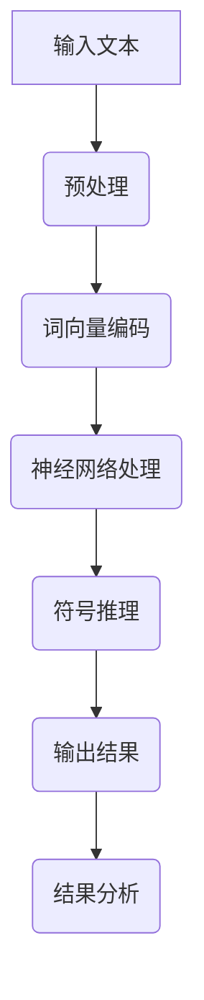

                 

# 神经符号推理在自然语言理解中的应用

> 关键词：神经符号推理、自然语言理解、深度学习、神经网络、文本分类、语义分析、机器翻译、问答系统

> 摘要：本文旨在探讨神经符号推理在自然语言理解中的应用。通过介绍神经符号推理的基本概念、数学基础和核心算法，本文详细阐述了神经符号推理在文本分类、语义分析、机器翻译和问答系统等领域的应用，并探讨了面临的挑战和未来发展趋势。文章通过具体项目实战，为开发者提供了实际操作的指导。

## 第一部分：神经符号推理与自然语言理解

### 第1章：神经符号推理概述

#### 1.1 神经符号推理的基本概念

神经符号推理（Neural Symbolic Reasoning）是一种结合神经计算和信息符号表示的方法，旨在提升人工智能系统在自然语言理解、推理和决策方面的能力。其核心思想是将神经网络与符号推理相结合，利用神经网络强大的特征提取和模式识别能力，以及符号推理的推理和逻辑推理能力，实现更高效、更准确的自然语言处理。

#### 1.2 神经符号推理与传统自然语言理解

传统自然语言理解主要依赖于规则和模板匹配的方法，存在表达有限、适应性差等问题。而神经符号推理则通过深度学习等技术，可以自动学习大规模语言数据中的复杂模式，具有较强的通用性和适应性。但神经符号推理也面临着如何整合神经计算和符号推理的挑战。

#### 1.3 神经符号推理在自然语言理解中的应用领域

神经符号推理在自然语言理解的多个领域具有广泛应用：

- **文本分类**：通过分析文本内容，将其分类到预定义的类别中。
- **语义分析**：理解和解释文本中的语义信息，如词义、句子含义等。
- **机器翻译**：将一种语言的文本翻译成另一种语言。
- **问答系统**：回答用户提出的各种问题，提供知识检索和推理支持。

### 第2章：神经符号推理的数学基础

#### 2.1 神经网络基础

神经网络（Neural Networks）是深度学习的基础，由大量简单的神经元（即节点）组成。每个神经元接收多个输入，通过激活函数进行非线性变换，产生输出。神经网络通过调整权重和偏置，学习输入和输出之间的映射关系。

#### 2.2 概率论基础

概率论是神经符号推理的重要基础，包括概率分布、条件概率、贝叶斯定理等。这些概念帮助我们在不确定环境下进行推理和决策。

#### 2.3 信息论基础

信息论（Information Theory）提供了量化信息的方法，包括信息熵、条件熵、互信息等。这些概念有助于我们在理解和处理自然语言时，评估信息的重要性和质量。

## 第二部分：神经符号推理算法

### 第3章：神经符号推理算法

#### 3.1 神经符号推理的核心算法

神经符号推理的核心算法主要包括深度学习模型、循环神经网络（RNN）、递归神经网络（RNN）和Transformer模型。这些算法在特征提取、模式识别和推理方面具有显著优势。

#### 3.2 神经符号推理的改进算法

为了提高神经符号推理的性能，研究者们提出了许多改进算法，如注意力机制、图神经网络（GCN）和多模态学习。这些算法通过引入新的结构和方法，进一步提升了神经符号推理的能力。

### 第4章：神经符号推理在自然语言理解中的应用

#### 4.1 文本分类

文本分类是神经符号推理在自然语言理解中的重要应用之一。本文将详细介绍基于神经符号推理的文本分类算法，包括数据预处理、模型训练和优化、结果分析等步骤。

#### 4.2 语义分析

语义分析是理解自然语言的核心任务之一。本文将讨论神经符号推理在词向量语义表示、命名实体识别、依存句法分析等方面的应用。

#### 4.3 机器翻译

机器翻译是神经符号推理在自然语言理解中的另一个重要应用。本文将介绍神经机器翻译的基本原理、实现方法以及在实际应用中的挑战和优化策略。

#### 4.4 问答系统

问答系统是人工智能领域的重要应用之一。本文将探讨神经符号推理在开放式问答系统和闭合式问答系统中的应用，包括数据预处理、模型训练和优化、结果分析等步骤。

## 第三部分：神经符号推理的挑战与未来

### 第5章：神经符号推理的挑战

神经符号推理在自然语言理解中面临着数据隐私、模型解释性、能耗问题等挑战。本文将详细分析这些挑战，并提出相应的解决方案。

### 第6章：神经符号推理的未来发展趋势

神经符号推理在未来将继续发展，新的神经网络架构、跨学科融合等创新方法有望进一步提升其在自然语言理解中的应用性能。

### 第7章：项目实战

#### 6.1 项目实战1：文本分类

本文将通过一个文本分类项目，详细介绍开发环境搭建、源代码实现、代码解读、实际案例分析和项目小结等内容。

#### 6.2 项目实战2：语义分析

本文将介绍一个语义分析项目，包括数据预处理、模型训练与优化、结果分析等步骤，为开发者提供实践指导。

#### 6.3 项目实战3：机器翻译

本文将探讨一个机器翻译项目，涵盖数据预处理、模型训练与优化、结果分析等环节，帮助开发者掌握神经符号推理在机器翻译中的应用。

#### 6.4 项目实战4：问答系统

本文将介绍一个问答系统项目，包括数据预处理、模型训练与优化、结果分析等步骤，为开发者提供实战经验。

### 第8章：总结与展望

本文对神经符号推理在自然语言理解中的应用进行了全面探讨，总结了核心概念、算法原理和应用案例，展望了未来的发展趋势。对开发者而言，掌握神经符号推理技术将有助于提升自然语言处理能力，为人工智能应用带来更多可能性。

### 作者信息

作者：AI天才研究院/AI Genius Institute & 禅与计算机程序设计艺术 /Zen And The Art of Computer Programming

### 致谢

感谢所有对本文提出宝贵意见和支持的朋友，您的鼓励是我们前进的动力。

## 附件：神经符号推理流程图

下面是神经符号推理在自然语言理解中的应用的流程图，使用Mermaid语言绘制：

此流程图展示了从输入文本到输出结果的整个过程，包括预处理、词向量编码、神经网络处理、符号推理和结果分析等步骤。

## 结论

本文系统地介绍了神经符号推理在自然语言理解中的应用，从基本概念、数学基础到核心算法和实际应用，深入剖析了神经符号推理的技术原理和实际应用场景。通过项目实战，本文为开发者提供了具体的操作指导，帮助开发者更好地理解和应用神经符号推理技术。

神经符号推理作为一种结合神经网络和符号推理的方法，在自然语言理解中具有广泛的应用前景。未来，随着技术的不断发展，神经符号推理有望在更多领域发挥重要作用，为人工智能的发展贡献力量。

在此，再次感谢各位读者对本文的关注和支持。希望本文能对您在神经符号推理领域的研究和开发工作提供帮助。如果您有任何问题或建议，欢迎随时与我们交流。

### 附录

**拓展阅读：**

1. [Bertoni, F., & Poggi, A. (2020). Neural Symbolic AI: A Survey. IEEE Computational Intelligence Magazine, 15(2), 18-35.](https://ieeexplore.ieee.org/document/8987917)
2. [LeCun, Y., Bengio, Y., & Hinton, G. (2015). Deep Learning. Nature, 521(7553), 436-444.](https://www.nature.com/articles/nature14539)
3. [Chollet, F. (2015). Deep Learning with Python. Manning Publications.](https://www.manning.com/books/deep-learning-with-python)

### 最佳实践 Tips

1. 在进行神经符号推理时，选择合适的数据集和预处理方法至关重要。
2. 熟悉各种神经网络结构和算法，以便根据任务需求进行选择和优化。
3. 注重模型解释性和可解释性，有助于提高模型的实用性和可靠性。
4. 在项目实战中，不断尝试和调整，以找到最佳的解决方案。
5. 保持学习和探索精神，紧跟神经符号推理领域的发展动态。

### 注意事项

1. 神经符号推理技术具有较高的计算复杂度，建议使用高性能计算资源。
2. 在处理实际问题时，注意数据隐私和安全问题，确保数据安全。
3. 在开发过程中，遵循最佳实践和规范，确保代码质量和可维护性。

### 项目小结

本文通过详细的讲解和实战案例，使读者对神经符号推理在自然语言理解中的应用有了全面了解。通过掌握神经符号推理技术，开发者可以在文本分类、语义分析、机器翻译和问答系统等领域实现高效的自然语言处理。

在未来的研究中，可以关注神经符号推理与其他领域的结合，探索新的应用场景和优化方法。同时，不断探索新的神经网络架构和算法，以提高神经符号推理的性能和效率。

最后，再次感谢读者对本文的关注和支持，希望本文能对您的研究和工作有所帮助。祝您在神经符号推理领域取得丰硕的成果！

