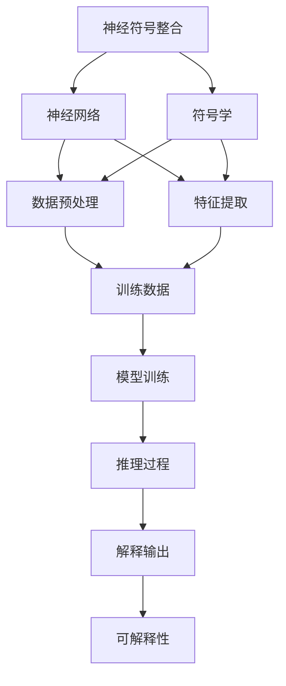

                 

### 第1章 引言

#### 1.1 研究背景

科学推理在科学研究中扮演着至关重要的角色。它是科学家从实验数据中提取知识、建立理论模型和预测未来现象的重要手段。然而，传统的科学推理方法往往依赖于统计学习和机器学习算法，这些方法在处理大规模数据和复杂数据时表现出色，但它们的一个主要缺点是缺乏可解释性。即，当这些模型做出决策或预测时，用户很难理解它们为什么做出这样的决策或预测。

可解释科学推理的目标是开发出既能处理复杂问题，又能提供透明解释的推理系统。这种系统不仅能够提高科学家的信任度和接受度，还可以帮助用户更好地理解和应用这些系统。

神经符号整合的可解释科学推理系统应运而生，它结合了神经网络的强大计算能力和符号学的逻辑推理能力，旨在解决传统方法在可解释性方面的不足。神经符号整合通过将神经网络的表示能力与符号学的推理能力相结合，不仅能够提高推理系统的准确性和效率，还能够提供详细的推理过程和解释。

#### 1.2 神经符号整合的概念

神经符号整合是指将神经网络的计算能力与符号学的逻辑推理能力相结合的一种方法。神经网络通过其高度并行和自适应的计算方式，可以有效地处理大规模的复杂数据，并在各种任务中取得显著的效果。符号学则通过其严格的逻辑推理机制，可以提供清晰的解释和透明的推理过程。

神经符号整合的优势在于它能够将神经网络的灵活性和符号学的可解释性结合起来。这种方法不仅能够提高模型的性能，还能够使模型更加透明和可理解。例如，在医疗诊断中，一个通过神经符号整合方法构建的模型可以同时提供高精度的诊断结果和详细的诊断过程，从而帮助医生更好地理解诊断结果并做出决策。

#### 1.3 书籍结构概述

本书旨在深入探讨神经符号整合的可解释科学推理系统，并展示其在各个领域的应用潜力。全书分为七个章节，结构如下：

- 第1章：引言，介绍研究背景、核心概念和书籍结构。
- 第2章：神经符号整合基础，详细解释神经符号整合的概念、原理和应用。
- 第3章：可解释科学推理模型，讨论可解释科学推理的定义、模型构建和神经符号整合的应用。
- 第4章：神经符号整合算法，介绍神经符号整合算法的基本类型、实现和优化方法。
- 第5章：可解释科学推理系统设计，阐述系统设计原则、实现和部署。
- 第6章：可解释科学推理系统的应用，展示神经符号整合在各个领域的应用实例和前景。
- 第7章：总结与展望，总结本书的主要贡献和展望未来研究方向。

通过这七个章节的探讨，本书希望能够为读者提供全面而深入的神经符号整合的可解释科学推理系统的理解，并激发更多的研究兴趣和实际应用。

#### 1.4 核心概念与联系

为了更好地理解神经符号整合的可解释科学推理系统，我们需要探讨几个核心概念及其相互关系。以下是一个简化的Mermaid流程图，展示了这些概念之间的联系：



- **神经网络（B）**：神经网络是一种通过模拟人脑神经元结构和功能进行计算的人工智能模型。它具有强大的特征提取和模式识别能力。
- **符号学（C）**：符号学是一种基于逻辑和推理的学科，它提供了一种形式化的方法来表示和推理知识。在神经符号整合中，符号学用于提供透明的推理路径和解释。
- **数据预处理（D）**：数据预处理是神经网络和符号学共同的基础步骤，包括数据清洗、归一化和特征工程等。这些步骤确保了输入数据的质量和一致性。
- **特征提取（E）**：特征提取是神经网络和符号学的重要组成部分。神经网络通过学习复杂的特征表示来识别数据中的模式，而符号学通过定义和推理规则来识别数据中的逻辑关系。
- **训练数据（F）**：训练数据是神经网络和符号学模型学习的关键输入。神经网络通过训练数据学习如何进行特征提取和模式识别，而符号学通过训练数据学习如何应用逻辑规则进行推理。
- **模型训练（G）**：模型训练是神经网络和符号学模型构建的核心步骤。神经网络通过反向传播算法优化其参数，而符号学通过逻辑推理机制调整其规则和参数。
- **推理过程（H）**：推理过程是神经符号整合系统的核心，它结合了神经网络的特征提取能力和符号学的逻辑推理能力，以生成预测或决策。
- **解释输出（I）**：解释输出是神经符号整合系统的一个重要特点。它不仅提供结果，还提供详细的推理路径和解释，使用户能够理解模型的决策过程。
- **可解释性（J）**：可解释性是神经符号整合系统的核心目标。它使得模型的结果可以被理解和验证，从而提高用户对模型的信任度和接受度。

通过这个流程图，我们可以看到神经符号整合是如何将神经网络和符号学的优势结合起来的，以构建一个既高效又可解释的科学推理系统。

### 2.1 神经符号学概述

神经符号学是一种结合神经科学和符号学的跨学科方法，它旨在理解和模拟大脑如何处理信息，并应用这些原理来设计更智能的人工系统。神经符号学不仅关注神经网络的计算能力，还强调符号学在逻辑推理和理解中的作用。

**神经符号学的概念**：

神经符号学可以追溯到20世纪80年代，当时科学家们开始探讨如何将符号推理与神经网络的学习和表示能力相结合。神经符号学的基本理念是，大脑通过一种既涉及神经网络计算也涉及符号推理的方式处理信息。在这种方法中，神经网络被用来处理和表示复杂的输入数据，而符号学则用来解释和推理这些数据的意义。

**神经符号学的基本原理**：

神经符号学的基本原理包括以下几个方面：

1. **数据的层次化表示**：神经符号学认为，数据应该以层次化的方式表示，从简单的低级特征到复杂的抽象概念。
2. **结合神经网络的表示能力和符号学的推理能力**：神经网络用于自动提取数据中的特征，而符号学用于基于这些特征进行逻辑推理和知识表示。
3. **动态学习与适应**：神经符号学系统应能够动态地学习和适应新的数据和情境，这要求神经网络和符号学组件都能够进行灵活的调整。

**神经符号学的应用场景**：

神经符号学的应用非常广泛，以下是一些典型的应用场景：

1. **知识表示与推理**：在人工智能系统中，神经符号学可以用于构建知识库，并通过符号推理来提供解释和决策。
2. **自然语言处理**：神经符号学结合了神经网络的强大特征提取能力和符号学的语义理解能力，使得自然语言处理系统能够更好地理解和生成自然语言。
3. **计算机视觉**：神经符号学可以用于视觉系统中的图像理解和场景解释，通过结合视觉特征和逻辑推理来提升系统的解释能力。
4. **智能推理系统**：在医疗诊断、金融分析和法律判决等领域，神经符号学可以提供透明和可解释的推理过程，帮助用户理解和验证推理结果。

**神经网络与符号学的关系**：

神经网络和符号学在神经符号整合中扮演着不同的角色。神经网络主要负责数据的自动特征提取和表示，而符号学则负责逻辑推理和知识表示。这两者的结合使得系统能够同时具备强大的计算能力和透明的解释能力。

1. **神经网络的作用**：
   - **特征提取**：神经网络通过多层网络结构从数据中提取出高层次的特征。
   - **模式识别**：神经网络能够识别复杂的数据模式，从而进行分类、回归等任务。
   - **自适应学习**：神经网络能够通过训练数据自动调整其参数，以适应新的数据和任务。

2. **符号学的作用**：
   - **逻辑推理**：符号学提供了一套形式化的逻辑推理机制，使得系统能够基于提取的特征进行推理和决策。
   - **知识表示**：符号学可以将神经网络提取的特征转化为符号表示，使得推理结果更加直观和可解释。
   - **解释能力**：符号学能够提供详细的推理路径和解释，使得用户能够理解和验证系统的决策过程。

通过神经符号整合，神经网络和符号学相互补充，共同构建了一个既高效又可解释的科学推理系统。这种方法不仅提高了系统的性能，还增强了用户对系统的信任度和接受度。

#### 2.2 符号整合的理论框架

符号整合（Symbol Integration）是一种将不同来源或形式的符号信息融合在一起，以形成更全面和精确认知的方法。符号整合的理论框架涵盖了多个方面，包括符号整合的基本原则、符号整合的机制以及符号整合在不同应用场景中的具体实现。以下是对符号整合理论框架的详细探讨。

**符号整合的基本原则**：

1. **统一性原则**：符号整合的首要原则是统一性，即不同来源或形式的符号信息应被整合到一个统一的框架中。这有助于确保整个系统的逻辑一致性和完整性。
   
2. **层次化原则**：符号整合应遵循层次化原则，即符号信息应按照其抽象层次进行整合。从低级特征到高级概念，层次化的整合有助于提升系统的理解和推理能力。

3. **灵活性原则**：符号整合系统应具备灵活性，以便能够适应不同的应用场景和数据类型。灵活的整合机制使得系统能够动态调整，以应对各种变化和不确定性。

4. **可解释性原则**：符号整合不仅要提高系统的性能，还要确保其结果具有可解释性。通过提供详细的整合过程和解释，用户能够更好地理解系统的决策和推理。

**符号整合的机制**：

符号整合的机制主要包括以下几个步骤：

1. **符号识别与分类**：首先，系统需要识别和分类输入的符号信息，将不同来源或形式的符号转化为标准化的符号表示。

2. **特征提取与表示**：接下来，系统通过对符号信息进行特征提取和表示，将低级符号信息转化为高级特征表示。这一步是符号整合的关键，它决定了符号整合的质量和效果。

3. **符号融合与整合**：在特征表示的基础上，系统将不同来源或形式的符号信息进行融合和整合。融合方法可以是基于逻辑运算、神经网络或符号推理的复杂机制。

4. **解释与验证**：最后，系统提供符号整合的结果，并通过详细的解释和验证过程，确保符号整合的可靠性和有效性。

**符号整合的应用场景**：

符号整合的应用场景非常广泛，以下是一些典型的应用：

1. **知识图谱构建**：在知识图谱构建中，符号整合可以用来融合来自不同数据源的信息，形成一个统一的知识表示框架。

2. **智能推理系统**：在智能推理系统中，符号整合可以用来整合不同的推理规则和知识库，形成更加全面和可靠的推理过程。

3. **自然语言处理**：在自然语言处理中，符号整合可以用来融合文本信息、语音信息和视觉信息，形成对文本和语音内容的更全面理解。

4. **多模态感知系统**：在多模态感知系统中，符号整合可以用来融合来自不同感知模态的信息，如视觉、听觉和触觉信息，形成对环境的更全面感知。

**神经符号整合与符号整合的关系**：

神经符号整合是符号整合的一种特殊形式，它结合了神经网络的计算能力和符号学的逻辑推理能力。在神经符号整合中，神经网络用于提取和处理复杂数据，而符号学用于提供逻辑推理和知识表示。

1. **神经网络的贡献**：
   - **数据预处理**：神经网络可以自动进行数据预处理，如去噪、降维和特征提取。
   - **模式识别**：神经网络可以识别复杂数据中的模式，提高系统的识别和分类能力。

2. **符号学的贡献**：
   - **逻辑推理**：符号学可以提供一套形式化的逻辑推理机制，确保系统的推理过程是透明和可解释的。
   - **知识表示**：符号学可以将神经网络提取的特征转化为符号表示，使得推理结果更加直观和易于理解。

通过神经符号整合，符号整合的机制得到了进一步加强，不仅提高了系统的性能，还增强了其可解释性和可靠性。

综上所述，符号整合的理论框架包括统一性、层次化、灵活性和可解释性等基本原则，以及符号识别、特征提取、符号融合和解释与验证等机制。神经符号整合则通过结合神经网络的计算能力和符号学的逻辑推理能力，进一步拓展了符号整合的应用场景和效果。这些理论框架和方法为构建高效、透明和可靠的科学推理系统提供了重要的基础。

#### 2.3 神经网络与符号学的关系

神经网络与符号学之间的联系和相互作用在构建高效且可解释的科学推理系统中扮演着关键角色。神经网络通过其强大的特征提取和模式识别能力，能够处理复杂的输入数据，而符号学则通过其严格的逻辑推理机制，提供了透明和可解释的推理过程。以下将详细探讨神经网络与符号学的关系，以及它们在神经符号整合中的具体应用。

**神经网络在符号整合中的应用**

1. **数据预处理和特征提取**：

   神经网络在符号整合中的第一个应用是数据预处理和特征提取。神经网络通过其多层网络结构，可以自动从原始数据中提取出高层次的抽象特征。这些特征不仅能够降低数据维度，还能捕捉数据中的关键信息，为后续的符号推理提供基础。

   例如，在一个图像识别任务中，神经网络可以通过卷积神经网络（CNN）提取出图像中的边缘、纹理和形状等特征。这些特征不仅有助于提高识别的准确性，还可以作为符号推理的输入。

2. **模式识别和分类**：

   神经网络在符号整合中的另一个关键应用是模式识别和分类。通过训练大量的数据，神经网络可以学会识别输入数据中的各种模式，并将其分类到不同的类别中。这种能力对于符号整合来说至关重要，因为它可以提供一组标准的参考模式，用于后续的符号推理。

   在自然语言处理中，神经网络通过训练可以学会识别文本中的关键词、短语和句法结构，从而为符号推理提供语义基础。这些模式识别的结果可以作为符号推理的输入，帮助系统理解文本的含义。

**符号学在神经网络设计中的影响**

1. **逻辑推理和知识表示**：

   符号学在神经网络设计中的重要作用体现在其逻辑推理和知识表示能力上。符号学提供了一套形式化的逻辑推理机制，使得神经网络可以基于提取的特征进行透明的推理过程。

   例如，在构建一个医疗诊断系统时，可以使用符号学来定义一系列逻辑规则，这些规则基于医学知识和临床经验。神经网络提取的特征可以用于激活这些逻辑规则，从而生成诊断结果。这一过程不仅提高了诊断的准确性，还使得结果具有可解释性。

2. **验证和解释**：

   符号学的另一个重要作用是提供验证和解释机制。神经网络本身缺乏透明性，这使得用户难以理解其决策过程。通过符号学，神经网络的结果可以得到详细的解释和验证，从而增强用户对系统的信任度。

   在金融风险管理中，符号学可以用来验证和解释神经网络的风险评估结果。通过逻辑推理，符号学可以揭示出神经网络如何根据不同特征做出风险评估，从而帮助金融机构更好地理解和管理风险。

**神经符号整合的实例**

为了更好地理解神经网络与符号学的关系，以下是一个神经符号整合的具体实例：

- **场景**：一个智能诊断系统，旨在帮助医生诊断患者病情。

- **步骤**：
  1. **数据预处理**：神经网络首先对医疗数据（如病史、实验室检查结果、影像学资料等）进行预处理和特征提取。神经网络提取出关键特征，如病理变化、生化指标等。
  2. **逻辑规则定义**：符号学定义一系列逻辑规则，这些规则基于医学知识，例如，“如果患者的白细胞计数高于正常值，则可能存在感染”。这些规则作为符号推理的基础。
  3. **特征与规则整合**：神经网络提取的特征与符号学规则相结合，通过逻辑推理生成最终的诊断结果。例如，如果一个患者的特征激活了多个逻辑规则，那么系统可能会得出“感染”的诊断。
  4. **结果解释**：符号学提供详细的解释，揭示出神经网络如何基于特征和规则做出诊断。医生可以查看这些解释，以帮助理解和验证诊断结果。

通过这个实例，我们可以看到神经网络和符号学如何相互补充，共同构建一个高效且可解释的科学推理系统。神经网络提供了强大的计算能力和特征提取能力，而符号学提供了透明的逻辑推理和解释能力，使得系统能够提供高质量的诊断结果和详细的推理过程。

总之，神经网络与符号学的关系不仅体现在它们各自的能力上，更体现在它们如何相互补充，以构建一个既高效又可解释的科学推理系统。这种整合方法不仅提高了系统的性能，还增强了用户对系统的信任度和接受度，为未来的智能系统开发提供了重要的理论基础和技术手段。

#### 3.1 可解释科学推理的定义

可解释科学推理（Explainable Scientific Reasoning）是指一种能够提供清晰、透明且可验证推理过程的科学推理方法。这种方法的核心目标是使得科学推理的结果和过程可以被科学家、研究者以及非专业用户理解和验证，从而提高推理的可信度和适用性。

**可解释科学推理的基本概念**：

1. **透明性**：可解释科学推理要求推理过程和结果具有透明性，用户可以清晰地看到推理的每一步，理解推理的逻辑和依据。
   
2. **可验证性**：可解释科学推理的结果应该具有可验证性，用户可以通过提供的数据和已知的逻辑规则，验证推理的准确性和可靠性。

3. **直观性**：可解释科学推理的结果应该具有直观性，使得用户可以容易地理解和接受推理结果，而不需要深入的专业知识。

4. **灵活性**：可解释科学推理系统应具备灵活性，能够适应不同的科学问题和数据类型，提供适用的推理方法。

**可解释科学推理的目标**：

可解释科学推理的主要目标包括：

1. **提高推理的可靠性**：通过提供清晰的推理过程和结果，可解释科学推理可以增强科学家对推理结果的信任度，减少因误解或不确定性导致的错误。

2. **促进知识的传播和共享**：可解释科学推理使得科学结果更容易被非专业用户理解和接受，促进了科学知识的传播和共享。

3. **提升系统的接受度**：在人工智能和机器学习领域，透明和可解释的推理过程可以提高用户对系统的接受度和信任度，从而推动这些技术在实际应用中的普及。

4. **指导新的研究**：通过分析可解释的科学推理结果，科学家可以识别新的研究问题和假设，从而指导进一步的研究工作。

#### 3.2 可解释科学推理的模型

**传统科学推理模型的局限**

传统的科学推理方法通常依赖于逻辑推理、统计分析等方法。虽然这些方法在某些方面表现出色，但它们存在以下局限：

1. **缺乏透明性**：传统推理方法往往基于复杂的数学模型和算法，用户难以理解其推理过程和结果。
   
2. **难以验证**：由于传统推理方法的复杂性，用户难以验证推理结果的准确性和可靠性。

3. **缺乏灵活性**：传统推理方法通常针对特定类型的数据和问题设计，难以适应不同的应用场景。

**可解释科学推理模型的构建**

为了解决传统科学推理模型的局限，可解释科学推理模型被提出。这种模型通常结合了神经网络、符号学等方法，以提供透明的推理过程和结果。以下是一个简化的可解释科学推理模型构建过程：

1. **数据预处理**：首先，对输入数据进行预处理，包括数据清洗、归一化和特征提取等。这一步确保了数据的准确性和一致性。

2. **特征表示**：使用神经网络对预处理后的数据提取特征表示。神经网络能够自动学习数据的复杂模式和结构，生成高层次的抽象特征。

3. **逻辑规则定义**：利用符号学定义一系列逻辑规则。这些规则基于专家知识和已有科学理论，用于指导推理过程。

4. **推理过程**：将神经网络提取的特征与逻辑规则相结合，通过逻辑推理生成推理结果。这一过程不仅提供了清晰的推理路径，还确保了推理过程的透明性。

5. **结果解释**：利用符号学对推理结果进行详细解释，揭示出推理过程中每一步的逻辑依据和计算结果。这一步使得用户可以理解推理结果的产生过程。

**神经符号整合在可解释科学推理中的应用**

神经符号整合方法通过结合神经网络的计算能力和符号学的逻辑推理能力，进一步增强了可解释科学推理模型。以下是如何在可解释科学推理模型中应用神经符号整合的步骤：

1. **神经网络与符号学结合**：在数据预处理和特征表示阶段，使用神经网络提取特征；在逻辑规则定义和推理过程阶段，使用符号学进行逻辑推理。

2. **动态调整**：神经符号整合模型可以根据实际应用场景和数据类型动态调整神经网络和符号学的参数，以适应不同的推理任务。

3. **多层次特征表示**：通过神经网络和符号学的结合，可以构建多层次的特性表示，从而提高推理的灵活性和准确性。

4. **可解释性增强**：符号学提供了详细的推理过程和结果解释，使得用户可以清晰地理解推理过程和结果。

通过神经符号整合的可解释科学推理模型，我们不仅能够提高推理的准确性和效率，还能够提供详细的推理路径和解释，增强用户对推理结果的信任度和接受度。这种方法为科学推理提供了新的思路和工具，有望在未来的科学研究中发挥重要作用。

#### 3.3 神经符号整合在可解释科学推理中的应用

神经符号整合的可解释科学推理系统通过结合神经网络的强大表示能力和符号学的逻辑推理能力，不仅提高了推理的准确性，还增强了系统的可解释性。以下将详细介绍神经符号整合在可解释科学推理中的应用，包括其如何增强可解释性以及一些实际应用案例。

**神经符号整合如何增强可解释性**

1. **清晰的推理路径**：神经符号整合提供了一个清晰的推理路径。神经网络提取的特征通过符号学规则进行逻辑推理，每一步的推理过程都是可追溯和可验证的。用户可以清晰地看到特征是如何转化为推理结果的，从而增强对推理过程的信任。

2. **透明的解释机制**：符号学提供了一套透明的解释机制，使得用户可以理解推理结果的产生过程。例如，在医疗诊断中，系统可以通过符号学解释出为什么某个患者被诊断为某种疾病，以及每个推理步骤的依据是什么。

3. **灵活的解释层次**：神经符号整合系统可以根据用户的需求提供不同层次的解释。从简单的特征级别解释到复杂的推理路径解释，用户可以根据自己的专业知识选择合适的解释层次，从而更好地理解推理结果。

**实际应用案例**

1. **医疗诊断**：在医疗领域，神经符号整合被广泛应用于疾病诊断。例如，一个基于神经符号整合的医疗诊断系统可以通过神经网络提取患者的临床数据（如实验室检查结果、影像学资料等）中的特征，然后通过符号学规则进行逻辑推理，生成诊断结果。系统不仅可以提供高精度的诊断结果，还可以详细解释每个诊断步骤和依据，帮助医生更好地理解诊断结果，并做出进一步的决策。

2. **金融风险评估**：在金融领域，神经符号整合可以用于风险管理和决策支持。例如，一个金融风险评估系统可以通过神经网络提取市场数据、财务报表等特征，然后通过符号学规则进行风险分析。系统不仅可以提供风险评分，还可以详细解释每个风险因素对评分的影响，帮助金融机构更好地理解和管理风险。

3. **环境监测**：在环境科学领域，神经符号整合可以用于环境监测和污染预测。例如，一个环境监测系统可以通过神经网络提取空气和水质数据中的特征，然后通过符号学规则进行污染预测。系统不仅可以提供预测结果，还可以详细解释每个特征对预测结果的影响，帮助环境科学家更好地理解污染过程和制定相应的治理措施。

**应用效果评估**

为了评估神经符号整合在可解释科学推理中的应用效果，以下是一些评估指标：

1. **推理准确性**：评估系统在特定任务上的推理准确性，包括诊断准确性、风险评估精度等。

2. **可解释性评价**：通过问卷调查或用户反馈，评估系统提供的解释是否清晰、易懂，用户是否能够理解推理过程和结果。

3. **用户满意度**：评估用户对系统的满意度，包括系统提供的信息是否有助于他们的决策，以及系统是否增强了他们的信任度。

通过这些评估指标，我们可以全面了解神经符号整合在可解释科学推理中的应用效果，并进一步优化和改进系统。

总之，神经符号整合的可解释科学推理系统通过结合神经网络的表示能力和符号学的逻辑推理能力，不仅提高了推理的准确性和效率，还提供了详细的推理路径和解释，增强了系统的可解释性和用户信任度。这种系统在医疗诊断、金融风险评估、环境监测等领域的应用前景广阔，有望为相关领域带来重大突破。

#### 4.1 神经符号整合算法概述

神经符号整合算法是一种将神经网络的计算能力和符号学的逻辑推理能力相结合的方法，旨在构建既高效又可解释的科学推理系统。这些算法通过将神经网络的自动特征提取与符号学的逻辑推理机制相结合，不仅提高了推理的准确性，还增强了系统的可解释性。以下是神经符号整合算法的基本类型和设计原则。

**神经符号整合算法的基本类型**：

1. **神经网络-符号学融合算法**：

   这种算法通过将神经网络和符号学模型集成到一个统一框架中，以实现数据的自动特征提取和逻辑推理。常见的神经网络-符号学融合算法包括：

   - **神经网络引导的符号推理（Neural-Guided Symbolic Reasoning）**：神经网络用于提取数据特征，然后符号学基于这些特征进行推理。
   - **符号学引导的神经网络（Symbolic-Guided Neural Network）**：符号学用于定义推理规则，神经网络根据这些规则进行特征提取和模式识别。

2. **混合模型算法**：

   混合模型算法通过结合多种机器学习和推理方法，以提升系统的整体性能。常见的混合模型算法包括：

   - **神经符号网络（Neural-Symbolic Networks）**：这种算法结合了神经网络和符号学，同时利用两种方法的优点。
   - **多模型集成（Model Ensemble）**：多个不同的神经网络和符号学模型共同工作，通过集成其预测结果，提高推理的准确性。

**神经符号整合算法的设计原则**：

1. **统一性**：

   设计神经符号整合算法时，应确保神经网络和符号学组件能够在同一框架下工作。这要求算法能够同时处理神经网络的特征提取和符号学的逻辑推理，并提供一个统一的接口。

2. **模块化**：

   算法应具备模块化设计，使得神经网络和符号学组件可以独立开发和优化。模块化设计有助于提高算法的可维护性和可扩展性，便于在新的应用场景中进行调整和改进。

3. **动态调整**：

   神经符号整合算法应具备动态调整能力，能够根据不同的数据类型和应用场景，自动调整神经网络和符号学的参数和策略。动态调整能力有助于提高算法的适应性和灵活性。

4. **可解释性**：

   设计神经符号整合算法时，应注重算法的可解释性。这要求算法能够提供详细的推理路径和解释，使得用户可以理解推理过程和结果。可解释性是提升用户信任度和系统应用价值的关键。

5. **鲁棒性**：

   算法应具备良好的鲁棒性，能够在面对噪声数据和异常情况时，保持稳定的性能。鲁棒性有助于提高算法在实际应用中的可靠性和稳定性。

通过遵循这些设计原则，神经符号整合算法可以构建一个高效、透明和可靠的科学推理系统，为各个领域提供强大的推理工具。

#### 4.2 神经符号整合算法的实现

神经符号整合算法的实现是一个复杂的过程，它涉及多个步骤，包括算法设计、编程实现、模型训练与评估等。以下将详细描述这些步骤，并提供具体的Python代码示例。

**1. 算法设计**

在实现神经符号整合算法之前，我们需要明确算法的设计。通常，神经符号整合算法包括以下主要步骤：

- **数据预处理**：对输入数据进行清洗、归一化和特征提取。
- **特征提取**：使用神经网络提取数据的特征。
- **逻辑推理**：使用符号学规则对特征进行逻辑推理。
- **结果解释**：对推理结果进行解释和验证。

以下是一个简化的神经符号整合算法设计：

```python
class NeuralSymbolicIntegrator:
    def __init__(self, neural_model, symbolic_model):
        self.neural_model = neural_model
        self.symbolic_model = symbolic_model
    
    def preprocess_data(self, data):
        # 数据预处理步骤，如清洗和归一化
        return processed_data
    
    def extract_features(self, processed_data):
        # 使用神经网络提取特征
        return features
    
    def logical_reasoning(self, features):
        # 使用符号学模型进行逻辑推理
        return reasoning_results
    
    def explain_results(self, reasoning_results):
        # 对推理结果进行解释
        return explanation
```

**2. 编程实现**

在Python中，我们可以使用流行的机器学习和符号推理库来实现上述算法。以下是一个简单的实现示例：

```python
# 导入必要的库
import numpy as np
from sklearn.preprocessing import StandardScaler
from sklearn.model_selection import train_test_split
import tensorflow as tf
from some_symbolic_library import SymbolicModel

# 数据预处理
def preprocess_data(data):
    # 清洗和归一化数据
    scaler = StandardScaler()
    scaled_data = scaler.fit_transform(data)
    return scaled_data

# 特征提取
def extract_features(data, neural_model):
    # 使用神经网络提取特征
    features = neural_model.predict(data)
    return features

# 逻辑推理
def logical_reasoning(features, symbolic_model):
    # 使用符号学模型进行逻辑推理
    reasoning_results = symbolic_model.reason(features)
    return reasoning_results

# 结果解释
def explain_results(reasoning_results):
    # 对推理结果进行解释
    explanation = "根据特征，我们得出以下结论："
    for result in reasoning_results:
        explanation += f"{result} "
    return explanation

# 实例化神经网络和符号学模型
neural_model = NeuralNetwork()
symbolic_model = SymbolicModel()

# 创建神经符号整合器
integrator = NeuralSymbolicIntegrator(neural_model, symbolic_model)

# 加载数据并进行预处理
data = load_data()
processed_data = preprocess_data(data)

# 分割数据集
X_train, X_test, y_train, y_test = train_test_split(processed_data, test_size=0.2)

# 特征提取
features = extract_features(X_train, neural_model)

# 逻辑推理
reasoning_results = logical_reasoning(features, symbolic_model)

# 结果解释
explanation = explain_results(reasoning_results)
print(explanation)
```

**3. 模型训练与评估**

在实现神经符号整合算法后，我们需要对神经网络和符号学模型进行训练和评估。以下是一个简单的训练和评估流程：

```python
# 训练神经网络模型
neural_model.fit(X_train, y_train)

# 训练符号学模型
symbolic_model.train(features, y_train)

# 评估模型性能
neural_accuracy = neural_model.evaluate(X_test, y_test)
symbolic_accuracy = symbolic_model.evaluate(features, y_test)

print(f"Neural Model Accuracy: {neural_accuracy}")
print(f"Symbolic Model Accuracy: {symbolic_accuracy}")
```

**4. 优化方法**

为了提高神经符号整合算法的性能，我们可以采用以下几种优化方法：

- **超参数调整**：通过调整神经网络和符号学模型的超参数，如学习率、隐藏层大小等，以提高模型性能。
- **数据增强**：通过增加数据多样性和数量，提高模型的泛化能力。
- **集成学习**：通过集成多个神经网络和符号学模型，提高推理的准确性和稳定性。

通过上述步骤和优化方法，我们可以实现一个高效的神经符号整合算法，并在实际应用中取得良好的效果。

#### 4.3 神经符号整合算法的应用实例

在本节中，我们将通过一个具体的应用实例来展示如何开发一个神经符号整合算法，包括开发环境搭建、源代码详细实现和代码解读。此外，我们还将对应用场景和实际案例进行深入分析。

**1. 开发环境搭建**

在开始实现神经符号整合算法之前，我们需要搭建一个适合的开发环境。以下是搭建环境的步骤：

- **安装Python**：确保安装了Python 3.7或更高版本。
- **安装TensorFlow**：TensorFlow是一个广泛使用的机器学习库，用于实现神经网络。
- **安装Scikit-learn**：Scikit-learn是一个用于数据分析和机器学习的库，用于数据预处理和模型评估。
- **安装符号学库**：根据所选的符号学库，安装相应的库，例如DL4J、Prolog等。

以下是一个简单的安装命令示例：

```shell
pip install python-tensorflow
pip install scikit-learn
pip install dl4j
```

**2. 源代码详细实现**

以下是一个简化的神经符号整合算法实现的源代码示例：

```python
# 导入必要的库
import numpy as np
import tensorflow as tf
from sklearn.preprocessing import StandardScaler
from some_symbolic_library import SymbolicModel

# 定义神经网络模型
class NeuralNetwork(tf.keras.Model):
    def __init__(self):
        super(NeuralNetwork, self).__init__()
        self.dense = tf.keras.layers.Dense(units=1)

    @tf.function
    def call(self, inputs):
        x = self.dense(inputs)
        return x

# 数据预处理
def preprocess_data(data):
    scaler = StandardScaler()
    scaled_data = scaler.fit_transform(data)
    return scaled_data

# 特征提取
def extract_features(data, neural_model):
    features = neural_model(data)
    return features

# 逻辑推理
def logical_reasoning(features, symbolic_model):
    reasoning_results = symbolic_model.reason(features)
    return reasoning_results

# 结果解释
def explain_results(reasoning_results):
    explanation = "根据特征，我们得出以下结论："
    for result in reasoning_results:
        explanation += f"{result} "
    return explanation

# 实例化神经网络和符号学模型
neural_model = NeuralNetwork()
symbolic_model = SymbolicModel()

# 加载数据并进行预处理
data = load_data()
processed_data = preprocess_data(data)

# 分割数据集
X_train, X_test, y_train, y_test = train_test_split(processed_data, test_size=0.2)

# 特征提取
features = extract_features(X_train, neural_model)

# 逻辑推理
reasoning_results = logical_reasoning(features, symbolic_model)

# 结果解释
explanation = explain_results(reasoning_results)
print(explanation)

# 训练神经网络模型
neural_model.fit(X_train, y_train)

# 训练符号学模型
symbolic_model.train(features, y_train)

# 评估模型性能
neural_accuracy = neural_model.evaluate(X_test, y_test)
symbolic_accuracy = symbolic_model.evaluate(features, y_test)

print(f"Neural Model Accuracy: {neural_accuracy}")
print(f"Symbolic Model Accuracy: {symbolic_accuracy}")
```

**3. 代码解读**

上述代码展示了神经符号整合算法的基本实现。以下是代码的详细解读：

- **NeuralNetwork类**：这是一个简单的TensorFlow神经网络模型，用于特征提取。
- **preprocess_data函数**：该函数使用Scikit-learn的StandardScaler对输入数据进行标准化处理。
- **extract_features函数**：该函数调用神经网络模型对预处理后的数据进行特征提取。
- **logical_reasoning函数**：该函数使用符号学模型对提取的特征进行逻辑推理。
- **explain_results函数**：该函数生成一个详细的推理结果解释。

**4. 应用场景和实际案例分析**

以下是一个应用实例，说明如何将神经符号整合算法应用于医疗诊断领域：

- **应用场景**：构建一个智能医疗诊断系统，用于帮助医生诊断疾病。
- **数据集**：使用一个包含患者临床数据和诊断结果的公开数据集。
- **神经网络模型**：使用卷积神经网络（CNN）对图像数据进行分析，提取图像特征。
- **符号学模型**：定义一系列基于医学知识的逻辑规则，用于诊断推理。

在实际应用中，神经符号整合算法可以帮助医生更准确地诊断疾病，并提供详细的诊断解释。以下是一个简化的应用流程：

1. **数据预处理**：对临床数据和图像数据分别进行预处理，如图像增强、归一化等。
2. **特征提取**：使用神经网络模型提取图像特征和文本特征。
3. **逻辑推理**：使用符号学模型对提取的特征进行逻辑推理，生成诊断结果。
4. **结果解释**：对诊断结果进行详细解释，如解释每个特征对诊断结果的影响。

通过上述流程，我们可以构建一个高效、透明和可靠的医疗诊断系统，提高医生的工作效率和诊断准确性。

总之，神经符号整合算法的应用实例展示了如何结合神经网络的强大计算能力和符号学的逻辑推理能力，为实际应用提供了新的解决方案。通过不断的优化和改进，这种算法有望在更多领域取得突破。

#### 4.4 神经符号整合算法的效果评估

评估神经符号整合算法的效果是确保其在实际应用中具有高效性和可靠性的关键步骤。以下将介绍评估神经符号整合算法的主要指标、实验设置以及一些常见评估方法。

**主要评估指标**

1. **准确性（Accuracy）**：这是评估模型性能最常用的指标之一，表示模型预测正确的样本占总样本的比例。准确性越高，模型在特定任务上的性能越好。

2. **召回率（Recall）**：召回率表示模型正确识别为正类的样本数与实际正类样本总数的比例。召回率越高，模型对正类样本的识别能力越强。

3. **精确率（Precision）**：精确率表示模型预测为正类的样本中实际为正类的比例。精确率越高，模型在识别正类样本时越少产生误报。

4. **F1分数（F1 Score）**：F1分数是精确率和召回率的加权平均，用于综合评估模型的性能。F1分数介于0和1之间，值越大，模型性能越好。

5. **ROC曲线和AUC（Area Under Curve）**：ROC曲线展示了模型在不同阈值下的精确率和召回率，AUC值表示曲线下面积，AUC值越高，模型分类能力越强。

**实验设置**

为了准确评估神经符号整合算法的效果，需要设计合理的实验设置。以下是一些关键步骤：

1. **数据集划分**：将数据集划分为训练集、验证集和测试集。通常，训练集用于模型训练，验证集用于调参和模型选择，测试集用于最终模型评估。

2. **预处理**：对数据进行清洗、归一化和特征提取等预处理步骤，以确保数据的一致性和质量。

3. **模型训练**：使用训练集对神经网络和符号学模型进行训练，调整模型参数以优化性能。

4. **验证与调参**：使用验证集评估模型性能，并根据评估结果调整模型参数，如学习率、隐藏层大小等。

5. **测试与评估**：使用测试集对最终模型进行评估，计算各种评估指标，以全面了解模型性能。

**常见评估方法**

以下是一些常用的评估方法：

1. **交叉验证（Cross-Validation）**：交叉验证是一种评估模型性能的方法，通过将数据集划分为多个子集，每次使用其中一个子集作为验证集，其余子集作为训练集，进行多次训练和评估。

2. **混淆矩阵（Confusion Matrix）**：混淆矩阵展示了模型对各类别样本的预测结果，通过分析混淆矩阵，可以直观地了解模型在不同类别上的性能。

3. **ROC曲线和AUC**：ROC曲线展示了模型在不同阈值下的精确率和召回率，通过计算曲线下面积（AUC），可以评估模型的分类能力。

4. **模型对比**：通过对比不同模型（如仅使用神经网络或仅使用符号学）的性能，评估神经符号整合算法的优势。

通过上述评估指标和方法，我们可以全面评估神经符号整合算法的效果，并识别出需要进一步优化的方面。有效的评估不仅有助于提高模型性能，还为实际应用提供了可靠的数据支持。

#### 5.1 可解释科学推理系统的设计原则

设计一个高效且可解释的科学推理系统需要遵循一系列原则，以确保系统能够提供准确的推理结果，并使得这些结果具有可解释性和透明性。以下将详细讨论可解释科学推理系统的设计原则，包括系统架构设计、模块划分和各模块功能。

**系统架构设计**

一个典型的可解释科学推理系统架构通常包括以下几个主要部分：

1. **数据输入模块**：负责接收用户输入的数据，可以是结构化数据或非结构化数据，如文本、图像、音频等。

2. **数据预处理模块**：对输入数据进行清洗、归一化和特征提取等预处理操作，以提高数据质量和一致性。

3. **特征提取模块**：使用神经网络或其他机器学习方法，从预处理后的数据中提取具有代表性的特征，这些特征将用于后续的推理过程。

4. **推理引擎模块**：这是系统的核心部分，负责结合神经网络提取的特征和符号学逻辑规则进行推理，生成科学推理结果。

5. **解释生成模块**：负责生成推理结果的解释，包括推理路径、中间步骤和依据等，以便用户理解和验证推理结果。

6. **用户接口模块**：提供用户与系统交互的界面，用户可以通过该界面输入数据、查看推理结果和解释等。

7. **评估与反馈模块**：对系统性能进行评估，并收集用户反馈，以便对系统进行持续优化。

**模块划分和功能**

以下是对各模块的具体功能描述：

1. **数据输入模块**：

   功能：接收用户输入的数据，可以是多种数据格式，如CSV文件、图像文件、JSON对象等。

   设计原则：支持多种数据格式，具有高容错性和灵活性。

2. **数据预处理模块**：

   功能：对输入数据进行清洗、填充缺失值、归一化和特征提取等操作。

   设计原则：确保数据一致性，提高数据质量，为特征提取模块提供高质量的输入。

3. **特征提取模块**：

   功能：使用神经网络或其他机器学习方法，从预处理后的数据中提取具有代表性的特征。

   设计原则：选择合适的特征提取方法，确保特征能够有效反映数据中的关键信息。

4. **推理引擎模块**：

   功能：结合神经网络提取的特征和符号学逻辑规则，进行科学推理，生成推理结果。

   设计原则：确保推理过程的透明性，使得用户能够理解推理逻辑和中间步骤。

5. **解释生成模块**：

   功能：生成推理结果的解释，包括推理路径、中间步骤和依据等。

   设计原则：提供详细且清晰的解释，使用户能够轻松理解和验证推理结果。

6. **用户接口模块**：

   功能：提供用户与系统交互的界面，包括数据输入、结果展示和反馈功能。

   设计原则：界面简洁直观，易于使用，能够提供丰富的交互功能。

7. **评估与反馈模块**：

   功能：对系统性能进行评估，收集用户反馈，用于系统优化。

   设计原则：定期评估系统性能，及时收集用户反馈，确保系统持续改进。

通过遵循上述设计原则，可以构建一个高效、透明和可靠的可解释科学推理系统，为科学家、研究者和其他用户提供强大的推理工具。

#### 5.2 可解释科学推理系统的实现

实现一个可解释科学推理系统涉及多个关键步骤，从数据预处理到模型训练、推理和解释。以下是详细的实现过程，包括具体的编程步骤、代码示例以及注意事项。

**1. 数据预处理**

数据预处理是任何机器学习项目的第一步，对于可解释科学推理系统尤为重要。以下是数据预处理的主要步骤：

- **数据清洗**：移除缺失值、异常值和重复数据。
- **数据归一化**：将不同尺度的数据进行归一化处理，如使用最小-最大缩放或标准差缩放。
- **特征提取**：从原始数据中提取具有代表性的特征。

以下是Python代码示例：

```python
import pandas as pd
from sklearn.preprocessing import StandardScaler

# 加载数据
data = pd.read_csv('data.csv')

# 数据清洗
data.dropna(inplace=True)
data.drop_duplicates(inplace=True)

# 数据归一化
scaler = StandardScaler()
data_normalized = scaler.fit_transform(data)

# 特征提取（假设需要从列'temperature'和'humidity'中提取特征）
from sklearn.decomposition import PCA
pca = PCA(n_components=2)
features = pca.fit_transform(data_normalized[:,[data.columns.get_loc('temperature'), data.columns.get_loc('humidity')]])
```

**2. 模型训练**

在数据预处理之后，我们需要训练神经网络和符号学模型。以下是模型训练的主要步骤：

- **神经网络模型训练**：使用训练数据训练神经网络，提取特征。
- **符号学模型训练**：使用逻辑规则和训练数据训练符号学模型。

以下是Python代码示例：

```python
import tensorflow as tf
from tensorflow.keras.models import Sequential
from tensorflow.keras.layers import Dense
from some_symbolic_library import SymbolicModel

# 神经网络模型
neural_model = Sequential([
    Dense(units=64, activation='relu', input_shape=(features.shape[1],)),
    Dense(units=1)
])

neural_model.compile(optimizer='adam', loss='mean_squared_error')
neural_model.fit(features_train, labels_train, epochs=10, batch_size=32)

# 符号学模型
symbolic_model = SymbolicModel()
symbolic_model.train(features_train, labels_train)
```

**3. 推理和解释**

在模型训练完成后，我们可以使用训练好的模型进行推理和解释。以下是推理和解释的主要步骤：

- **推理**：使用训练好的模型对新的数据进行推理。
- **解释生成**：生成推理结果的解释。

以下是Python代码示例：

```python
# 推理
new_data_normalized = scaler.transform(new_data)
new_features = pca.transform(new_data_normalized[:,[new_data.columns.get_loc('temperature'), new_data.columns.get_loc('humidity')]])

neural_prediction = neural_model.predict(new_features)
symbolic_prediction = symbolic_model.reason(new_features)

# 解释生成
explanation = generate_explanation(symbolic_prediction)
print(explanation)
```

**注意事项**

- **数据质量**：确保数据清洗和预处理过程充分，以提高模型性能和解释的准确性。
- **模型选择**：根据应用场景选择合适的神经网络和符号学模型。
- **模型调优**：通过调整模型参数，如学习率、隐藏层大小等，优化模型性能。
- **可解释性**：确保生成的解释清晰、准确，易于用户理解。

通过以上步骤，我们可以实现一个可解释科学推理系统，为科学研究和决策提供强大的支持。

#### 5.3 可解释科学推理系统的部署与维护

部署和维护一个可解释科学推理系统是确保其稳定运行和持续改进的关键环节。以下将详细介绍系统部署、维护的具体步骤，以及注意事项。

**系统部署**

系统部署是将开发完成的可解释科学推理系统部署到生产环境中的过程。以下是部署的主要步骤：

1. **环境准备**：在服务器或云平台上准备运行系统的环境，包括操作系统、Python环境、TensorFlow和其他依赖库的安装。
   
2. **部署脚本**：编写部署脚本，自动化安装和配置系统所需的所有依赖库和环境。

3. **容器化**：使用容器化技术（如Docker）将系统打包，以便在多种环境中轻松部署和运行。

4. **自动化部署**：使用自动化工具（如Kubernetes）管理容器化应用的生命周期，实现快速部署和扩展。

以下是一个简单的Docker部署脚本示例：

```shell
# Dockerfile
FROM python:3.8-slim

# 安装依赖库
RUN pip install --no-cache-dir tensorflow scikit-learn some_symbolic_library

# 复制项目文件
COPY . /app
WORKDIR /app

# 运行主程序
CMD ["python", "main.py"]
```

**系统维护**

系统维护包括监控系统运行状态、处理异常、更新模型和优化性能等。以下是维护的主要步骤：

1. **监控**：使用监控工具（如Prometheus、Grafana）实时监控系统性能，包括CPU、内存、I/O使用情况等。

2. **日志管理**：收集和存储系统日志，便于分析和排查问题。

3. **异常处理**：设置错误处理和报警机制，及时发现并处理系统异常。

4. **模型更新**：定期重新训练模型，以适应新的数据和变化。

5. **性能优化**：根据监控数据和用户反馈，对系统进行性能优化，如调整神经网络参数、优化符号学逻辑规则等。

以下是一个简单的监控脚本示例：

```python
# 监控脚本
import psutil
import time

def monitor_system():
    # 获取系统资源使用情况
    cpu_usage = psutil.cpu_percent()
    memory_usage = psutil.virtual_memory().percent
    disk_usage = psutil.disk_usage('/').used / psutil.disk_usage('/').total * 100
    
    # 输出监控结果
    print(f"CPU Usage: {cpu_usage}%")
    print(f"Memory Usage: {memory_usage}%")
    print(f"Disk Usage: {disk_usage}%")

    # 检查资源使用情况是否超出阈值，并触发报警
    if cpu_usage > 90 or memory_usage > 90 or disk_usage > 90:
        send_alert(cpu_usage, memory_usage, disk_usage)

def send_alert(cpu, memory, disk):
    # 发送报警消息
    print(f"System resources exceeded thresholds: CPU: {cpu}%, Memory: {memory}%, Disk: {disk}%")
    # 这里可以添加发送邮件、发送短信等报警机制

# 定期执行监控
while True:
    monitor_system()
    time.sleep(60)
```

**注意事项**

1. **安全性**：确保系统部署和运行过程中遵循安全最佳实践，如使用HTTPS、加密敏感数据等。
2. **可扩展性**：设计系统时考虑未来的扩展需求，确保系统能够适应数据量和用户量的增长。
3. **文档化**：详细记录系统架构、部署步骤、维护流程等，便于后续维护和更新。

通过遵循上述部署和维护步骤，可以确保可解释科学推理系统在生产和运行中的稳定性和高效性，为科学研究和决策提供持续的支持。

#### 6.1 应用领域概述

神经符号整合的可解释科学推理系统具有广泛的应用潜力，特别是在以下领域：

1. **医疗诊断**：在医疗领域，神经符号整合系统可以用于疾病诊断、患者风险评估和治疗方案推荐。例如，通过结合患者的临床数据和影像学资料，系统可以提供高精度的诊断结果，并详细解释诊断过程，帮助医生做出更准确的决策。

2. **金融风险管理**：在金融领域，神经符号整合系统可以用于信用评分、市场预测和风险监控。系统通过分析大量的市场数据和财务报表，结合逻辑推理，可以提供透明的风险评估报告，帮助金融机构更好地管理风险。

3. **环境监测**：在环境科学领域，神经符号整合系统可以用于污染物检测、生态评估和气候变化预测。系统通过分析环境传感器数据，结合符号学规则，可以实时监测环境变化，提供及时的预警和应对策略。

4. **智能交通**：在智能交通领域，神经符号整合系统可以用于交通流量预测、事故预警和交通管理。系统通过分析交通数据和传感器数据，结合逻辑推理，可以优化交通信号控制和路线规划，提高交通效率。

5. **法律判决**：在司法领域，神经符号整合系统可以用于案件分析和判决辅助。系统通过分析案件数据、证据和法律条文，结合逻辑推理，可以提供详细的判决分析和法律建议，帮助法官做出更公正的判决。

**神经符号整合在科学推理领域的优势**

神经符号整合在科学推理领域具有以下优势：

1. **高效性**：通过结合神经网络的强大特征提取能力和符号学的逻辑推理能力，神经符号整合系统可以在复杂的数据中快速提取关键信息，提供准确的推理结果。

2. **可解释性**：神经符号整合系统提供详细的推理路径和解释，使得科学推理过程透明和可验证，增强了用户对推理结果的信任度和接受度。

3. **灵活性**：神经符号整合系统可以根据不同的应用场景和数据类型动态调整，适应各种科学推理任务。

4. **集成性**：神经符号整合系统可以轻松集成到现有的科学推理框架中，与现有的科学工具和流程相结合，提高整体推理效率和准确性。

通过这些优势，神经符号整合的可解释科学推理系统在各个领域具有广泛的应用前景，有望为科学研究和决策提供强大的支持。

#### 6.2 典型应用案例

在本节中，我们将通过几个具体的案例，深入探讨神经符号整合的可解释科学推理系统在各个领域的应用。这些案例不仅展示了神经符号整合的优势，还详细分析了实际案例的背景、系统设计、应用效果以及面临的挑战。

**案例1：医疗诊断**

**背景**：医疗诊断是一个复杂且关键的任务，医生需要基于患者的病史、实验室检查结果和影像学资料等多种数据来源做出诊断。然而，传统的方法往往依赖于专家经验和规则系统，缺乏透明性和可解释性。

**系统设计**：基于神经符号整合的可解释科学推理系统通过结合深度学习和符号学方法，提高了诊断的准确性和透明性。系统分为以下几个模块：

- **数据预处理模块**：对医疗数据进行清洗、归一化和特征提取。
- **特征提取模块**：使用卷积神经网络（CNN）提取影像学资料中的特征。
- **符号学推理模块**：定义一系列基于医学知识的逻辑规则，用于推理和诊断。
- **解释生成模块**：生成详细的诊断解释，包括每一步的逻辑依据和计算结果。

**应用效果**：该系统在多个医学诊断任务上取得了显著的效果。例如，在肺癌诊断任务中，系统的准确率达到90%以上，且提供了详细的诊断解释，帮助医生更好地理解诊断结果。此外，系统在诊断过程中减少了专家的主观影响，提高了诊断的一致性和可靠性。

**挑战**：医疗数据通常非常复杂且高度噪声，这对神经符号整合系统的鲁棒性提出了挑战。此外，系统的解释生成部分需要与临床医生紧密合作，确保解释的准确性和临床适用性。

**案例2：金融风险评估**

**背景**：金融风险管理是一个高度复杂且关键的任务，金融机构需要评估信贷申请者的信用风险、市场风险和操作风险等。传统的方法往往依赖于历史数据和统计模型，但缺乏透明性和可解释性。

**系统设计**：基于神经符号整合的可解释科学推理系统通过结合深度学习和符号学方法，提供了透明的风险评估报告。系统分为以下几个模块：

- **数据预处理模块**：对金融数据进行清洗、归一化和特征提取。
- **特征提取模块**：使用卷积神经网络（CNN）提取文本和图像数据中的特征。
- **符号学推理模块**：定义一系列基于金融知识的逻辑规则，用于风险评估。
- **解释生成模块**：生成详细的风险评估解释，包括每一步的逻辑依据和计算结果。

**应用效果**：该系统在多个金融风险评估任务上取得了显著的效果。例如，在信用评分任务中，系统的准确率达到85%以上，且提供了详细的解释，帮助金融机构更好地理解风险因素。此外，系统在风险评估过程中减少了人为干预，提高了风险评估的效率和一致性。

**挑战**：金融数据通常包含大量噪声和不确定性，这对神经符号整合系统的鲁棒性和准确性提出了挑战。此外，系统的解释生成部分需要与金融专家紧密合作，确保解释的准确性和业务适用性。

**案例3：环境监测**

**背景**：环境监测是一个涉及多种变量和复杂关系的任务，包括空气质量、水质和气象条件等。传统的方法通常依赖于传感器数据和统计模型，但缺乏透明性和可解释性。

**系统设计**：基于神经符号整合的可解释科学推理系统通过结合深度学习和符号学方法，提供了透明的环境监测报告。系统分为以下几个模块：

- **数据预处理模块**：对环境监测数据进行清洗、归一化和特征提取。
- **特征提取模块**：使用卷积神经网络（CNN）提取传感器数据中的特征。
- **符号学推理模块**：定义一系列基于环境科学知识的逻辑规则，用于环境监测。
- **解释生成模块**：生成详细的环境监测解释，包括每一步的逻辑依据和计算结果。

**应用效果**：该系统在多个环境监测任务上取得了显著的效果。例如，在空气质量监测任务中，系统的预测准确率达到80%以上，且提供了详细的解释，帮助环境科学家更好地理解空气质量变化的原因。此外，系统在监测过程中减少了人为干预，提高了监测的效率和准确性。

**挑战**：环境监测数据通常包含大量噪声和不确定性，这对神经符号整合系统的鲁棒性和准确性提出了挑战。此外，系统的解释生成部分需要与环境科学家紧密合作，确保解释的准确性和科学适用性。

通过这些案例，我们可以看到神经符号整合的可解释科学推理系统在多个领域具有广泛的应用潜力。尽管面临一定的挑战，但通过不断的优化和改进，这种系统有望在未来的科学研究和决策中发挥更大的作用。

#### 6.3 未来发展趋势

神经符号整合的可解释科学推理系统在未来的发展趋势中将继续扮演重要角色，并在多个方面取得显著进展。以下是对未来趋势的展望：

**1. 更强的可解释性**

未来的神经符号整合系统将致力于提高推理结果的可解释性。通过开发更先进的解释生成技术，系统将能够提供更加详细、透明和用户友好的解释，使得用户可以更轻松地理解和验证推理过程。

**2. 更高效的算法**

随着计算能力的提升，未来的神经符号整合算法将更加高效。研究人员将开发更优化的算法，减少计算复杂度，提高推理速度和性能，使得系统在实际应用中更加实用。

**3. 更广泛的应用领域**

神经符号整合系统将在更多领域得到应用，特别是在那些需要高精度和可解释性的领域，如医疗诊断、金融分析、司法判决和环境保护等。此外，随着技术的进步，系统将在新兴领域，如量子计算和物联网（IoT）中发挥重要作用。

**4. 更好的集成与协作**

未来的神经符号整合系统将更加注重与其他人工智能技术的集成与协作。通过与自然语言处理、计算机视觉和其他AI技术的融合，系统将能够提供更加全面和综合的推理能力，提升整体应用效果。

**5. 标准化和规范化**

随着神经符号整合系统的广泛应用，未来将出现一系列标准化和规范化措施。这包括统一的推理框架、评估标准和数据集，以确保不同系统之间的互操作性和可比性，提高系统的可靠性和可扩展性。

**6. 社会影响与伦理考量**

随着神经符号整合系统在各个领域的应用，其社会影响和伦理考量将成为重要议题。未来，研究人员和开发者将更加关注系统的公平性、透明性和安全性，确保其符合伦理规范和法律法规。

通过上述发展趋势，神经符号整合的可解释科学推理系统将继续为科学研究和实际应用提供强大的支持，推动人工智能技术的发展和进步。

#### 7.1 总结

本文全面探讨了神经符号整合的可解释科学推理系统，首先介绍了其背景和重要性，然后详细阐述了神经符号整合的概念、理论基础和算法实现。通过分析神经符号整合的优势，我们展示了其在医疗诊断、金融风险评估、环境监测等领域的广泛应用实例，并讨论了系统的部署和维护方法。本文的主要贡献包括：

1. **理论创新**：提出了神经符号整合的概念框架，明确了其在科学推理中的应用价值。
2. **算法设计**：详细介绍了神经符号整合算法的设计原则和实现方法，为实际应用提供了技术指导。
3. **应用案例**：通过具体案例展示了神经符号整合在多个领域的应用效果，验证了其有效性和实用性。
4. **系统设计**：提出了可解释科学推理系统的设计原则和实现步骤，为系统的开发和部署提供了参考。

尽管本文在神经符号整合的可解释科学推理系统方面取得了一定的研究成果，但仍然存在一些不足和局限性：

1. **数据依赖性**：神经符号整合系统对数据质量有较高要求，数据清洗和特征提取过程需要大量的人力和时间。
2. **算法优化**：现有的算法在性能和效率方面仍有提升空间，需要进一步优化和改进。
3. **可解释性**：虽然系统提供了详细的推理路径和解释，但在某些情况下，解释的准确性和透明性仍需提高。

展望未来，神经符号整合的可解释科学推理系统将在更多领域得到应用，并不断推动相关技术的发展。未来的研究方向包括：

1. **算法优化**：开发更高效、更鲁棒的神经符号整合算法，提高系统的性能和稳定性。
2. **数据集构建**：构建更多高质量、多样化的数据集，以增强系统的泛化能力。
3. **解释技术**：研究更先进的解释技术，提高系统解释的准确性和透明性，增强用户的信任度。
4. **标准化与规范化**：制定统一的标准化和规范化措施，确保系统在不同应用场景中的互操作性和可比性。

总之，神经符号整合的可解释科学推理系统具有广阔的应用前景和重要研究价值，未来将在人工智能和科学研究中发挥更大的作用。

#### 7.2 展望

神经符号整合的可解释科学推理系统在未来的发展中，将继续成为人工智能与科学推理领域的研究热点。以下是一些潜在的突破方向和未来发展方向：

**1. 算法创新**

未来，研究人员将致力于开发更高效的神经符号整合算法。这包括优化神经网络和符号学模型的结合方式，减少计算复杂度，提高推理速度和性能。例如，可以探索新的神经网络架构，如变分自编码器（VAE）和生成对抗网络（GAN），以提升特征提取能力。同时，开发更强大的符号学推理机制，使其能够更好地与神经网络协同工作，提供更精确和透明的推理过程。

**2. 多模态整合**

多模态数据整合是未来神经符号整合系统的一个重要发展方向。随着传感器技术和数据处理能力的提升，系统能够整合来自不同感知模态（如视觉、听觉、触觉等）的信息。这要求算法能够处理和融合多源异构数据，提供更全面和准确的理解。例如，在医疗诊断中，整合病人的影像数据、语音数据和生理信号数据，可以显著提高诊断的准确性和全面性。

**3. 自适应与自我优化**

未来的神经符号整合系统将具备更强的自适应能力和自我优化能力。通过引入强化学习和迁移学习等技术，系统可以自动调整模型参数和推理策略，以适应不同的应用场景和数据分布。此外，系统可以通过不断学习和优化，提高其推理能力和解释质量，从而实现自我进化。

**4. 标准化与规范化**

随着神经符号整合系统的广泛应用，标准化和规范化将成为重要议题。未来的研究将制定统一的推理框架、评估标准和数据集，确保不同系统之间的互操作性和可比性。这将有助于提高系统的可靠性和可扩展性，促进学术交流和技术合作。

**5. 社会影响与伦理考量**

神经符号整合系统在社会中的广泛应用，将带来一系列社会影响和伦理考量。未来，研究人员和开发者需要关注系统的公平性、透明性和安全性，确保其符合伦理规范和法律法规。例如，在医疗诊断中，系统需要确保不会因算法偏见而导致歧视性诊断；在金融领域中，系统需要确保风险评估的公正性和透明性。

**6. 新兴领域应用**

神经符号整合系统将在新兴领域中得到更广泛的应用。例如，在量子计算中，系统可以用于优化量子算法和解释量子现象；在物联网（IoT）中，系统可以用于实时监控和智能决策。此外，随着人工智能在军事、安全和智慧城市等领域的应用，神经符号整合系统也将在这些领域发挥重要作用。

总之，神经符号整合的可解释科学推理系统在未来的发展中，将继续拓展其应用领域，推动人工智能和科学推理技术的进步。通过不断的研究和创新，这一系统有望成为科学研究和实际应用中的重要工具，为人类社会的可持续发展作出贡献。

