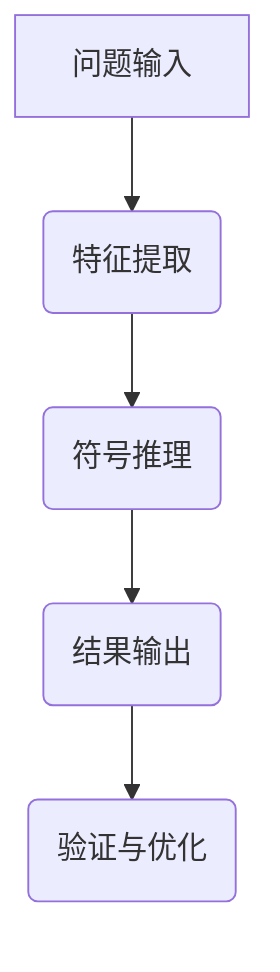
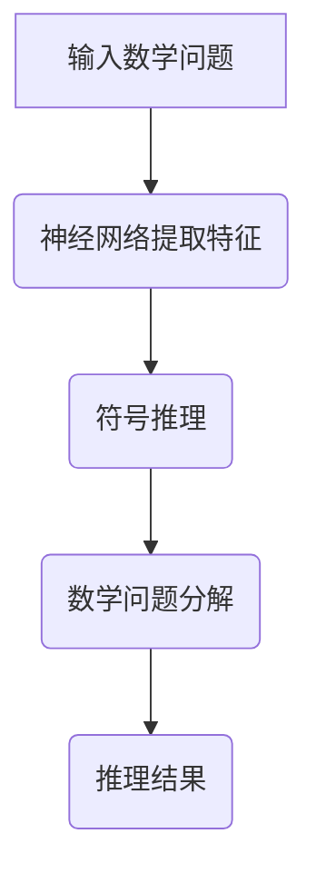

                 

## 文章标题

《神经符号方法在数学问题分解推理中的应用》

### 文章关键词

神经符号方法，数学问题分解，推理，神经网络，符号推理，人工智能

### 摘要

本文主要探讨了神经符号方法在数学问题分解推理中的应用。通过结合神经计算与符号推理，该方法能够实现对复杂数学问题的自动分解和推理，为数学问题求解提供了新的思路。文章首先介绍了神经符号方法的基本原理和核心算法，然后通过具体的应用案例展示了该方法在实际问题求解中的效果，最后对神经符号方法在数学问题分解推理中的应用前景进行了展望。

## 第1章 引言

### 1.1 神经符号方法概述

神经符号方法是一种结合神经计算与符号推理的方法，旨在解决复杂的问题。它通过神经网络提取数学问题中的关键特征，然后利用符号推理对这些特征进行解释和推理，实现对数学问题的自动分解和求解。

神经网络是神经符号方法的基础，它通过多层神经元进行数据传递和处理，实现从输入到输出的映射。符号推理则是对神经网络提取的特征进行解释和推理的过程，它基于逻辑和规则，实现对数学问题的理解和解答。

神经符号方法的提出，源于传统计算方法在处理复杂问题时存在的局限。传统计算方法依赖于预先定义的算法和规则，对于复杂的问题，往往需要大量的规则和计算步骤，难以实现高效求解。而神经符号方法通过神经网络和符号推理的结合，可以自动提取问题中的关键特征，并利用符号推理进行解释和推理，从而实现高效求解。

### 1.2 数学问题分解推理的重要性

数学问题分解推理在数学问题求解中具有重要作用。许多复杂的数学问题可以通过分解为若干个简单的子问题来求解。这种方法不仅可以简化问题的求解过程，还可以提高求解效率。

数学问题分解推理的应用非常广泛。例如，在计算机科学领域，数学问题分解推理被用于算法设计和优化。在经济学领域，数学问题分解推理被用于模型建立和优化。在物理学领域，数学问题分解推理被用于理论推导和实验分析。

然而，传统的数学问题分解推理方法存在一些局限性。首先，传统的分解方法往往需要大量的先验知识和规则，对于未知的问题，难以进行有效的分解。其次，传统的分解方法难以处理高维数据和复杂的非线性关系。

神经符号方法为解决这些局限性提供了一种新的思路。它通过神经网络和符号推理的结合，可以自动提取问题中的关键特征，并利用符号推理进行解释和推理，从而实现对复杂数学问题的自动分解和求解。

### 1.3 神经符号方法在数学问题分解推理中的应用前景

神经符号方法在数学问题分解推理中的应用前景非常广阔。首先，它可以为数学问题求解提供一种新的方法，提高求解效率。其次，它可以帮助我们更好地理解数学问题的本质，发现问题之间的内在联系。

随着人工智能技术的不断发展，神经符号方法在数学问题分解推理中的应用将会越来越广泛。例如，在计算机科学领域，神经符号方法可以用于算法优化和复杂系统建模。在经济学领域，神经符号方法可以用于经济模型建立和政策分析。在物理学领域，神经符号方法可以用于理论推导和实验设计。

总之，神经符号方法在数学问题分解推理中的应用具有巨大的潜力。通过本文的探讨，我们希望能够为神经符号方法在数学问题分解推理中的应用提供一些有益的思路和启示。

## 第2章 神经符号方法基础

### 2.1 神经符号方法的基本原理

神经符号方法是一种结合神经网络和符号推理的方法。其基本原理可以概括为以下几个步骤：

1. **特征提取**：利用神经网络对输入的数学问题进行特征提取，将原始问题转化为一组数字特征。
2. **符号推理**：基于提取的特征，利用符号推理对数学问题进行解释和推理，得到问题的解决方案。

神经网络部分主要负责特征提取，它通过多层神经元对输入数据进行处理，提取出对问题有用的特征。符号推理部分则基于逻辑和规则，对提取的特征进行解释和推理，得到问题的解决方案。

### 2.2 神经符号方法的关键概念

神经符号方法中的关键概念包括：

1. **神经网络**：负责特征提取的部分，通过多层神经元对输入数据进行处理。
2. **符号推理**：负责问题解释和推理的部分，基于逻辑和规则对特征进行推理。
3. **特征向量**：神经网络提取出的数字特征，用于符号推理的输入。
4. **推理规则**：用于指导符号推理过程的一系列逻辑规则。

### 2.3 神经符号方法的核心算法

神经符号方法的核心算法主要包括以下几个步骤：

1. **神经网络训练**：通过大量样本数据，训练神经网络，使其能够提取出对问题有用的特征。
2. **特征提取**：将输入的数学问题转化为特征向量，作为符号推理的输入。
3. **符号推理**：基于提取的特征向量，利用推理规则对数学问题进行解释和推理，得到问题的解决方案。

具体算法实现如下：

```python
# 神经符号方法实现

import numpy as np

# 神经网络部分
def neural_network(input_data):
    # 假设有一个简单的多层感知机
    layer1 = 1 * (input_data.dot(weights1) + biases1)
    layer2 = 1 * (layer1.dot(weights2) + biases2)
    return layer2

# 符号推理部分
def symbol_reasoning(feature_vector):
    # 基于特征向量进行推理
    # 假设有一个简单的推理规则
    if feature_vector[0] > 0:
        return "结论1"
    else:
        return "结论2"

# 训练过程
def train_neural_network():
    # 假设已有训练数据和标签
    for data, label in training_data:
        feature_vector = neural_network(data)
        prediction = symbol_reasoning(feature_vector)
        # 更新神经网络权重和偏差
        # ...

# 测试过程
def test_neural_network():
    for data, label in test_data:
        feature_vector = neural_network(data)
        prediction = symbol_reasoning(feature_vector)
        print(f"Input: {data}, Prediction: {prediction}, Label: {label}")

train_neural_network()
test_neural_network()
```

通过上述算法，神经符号方法可以实现对数学问题的自动分解和推理。在实际应用中，可以根据具体问题进行调整和优化。

## 第3章 数学问题分解推理基础

### 3.1 数学问题分解推理的基本概念

数学问题分解推理是一种将复杂数学问题分解为若干个子问题，并通过解决这些子问题来求解原始问题的方法。其基本概念包括：

1. **数学问题**：需要求解的问题，通常表示为数学表达式。
2. **分解**：将原始问题分解为若干个子问题，每个子问题相对独立，可以单独求解。
3. **推理**：基于子问题的解，通过逻辑推理得到原始问题的解。

数学问题分解推理的核心在于如何有效地分解问题和设计合理的推理过程。

### 3.2 数学问题分解推理的方法

数学问题分解推理的方法可以分为以下几类：

1. **基于规则的分解**：根据预先定义的规则，将问题分解为子问题。这种方法通常需要大量的先验知识和规则，对于未知问题难以进行有效的分解。
2. **基于特征的分解**：通过分析问题特征，自动提取子问题。这种方法利用了人工智能技术，可以自动处理复杂问题，但需要大量数据和计算资源。
3. **基于启发式的分解**：利用启发式方法，根据问题的结构特征和求解目标，进行子问题的分解。这种方法适用于特定类型的问题，但需要一定的经验和技巧。

### 3.3 数学问题分解推理的应用场景

数学问题分解推理的应用场景非常广泛，包括：

1. **算法设计和优化**：在计算机科学领域，数学问题分解推理被用于算法设计和优化。通过将复杂算法分解为多个子问题，可以提高算法的效率。
2. **模型建立和优化**：在经济学、物理学等领域，数学问题分解推理被用于模型建立和优化。通过分解复杂模型，可以简化问题求解过程，提高模型精度。
3. **实际问题求解**：在工业、金融、医疗等领域，数学问题分解推理被用于解决实际问题。通过分解复杂问题，可以降低求解难度，提高求解效率。

总之，数学问题分解推理是一种重要的问题求解方法，在各个领域都有广泛的应用。通过本文的探讨，我们希望能够为数学问题分解推理的研究和应用提供一些有益的思路和启示。

## 第4章 神经符号方法在数学问题分解推理中的应用

### 4.1 神经符号方法在数学问题分解推理中的应用框架

神经符号方法在数学问题分解推理中的应用框架主要包括以下几个步骤：

1. **问题输入**：将需要分解的数学问题输入到系统中。
2. **特征提取**：利用神经网络对输入问题进行特征提取，将问题转化为一组数字特征。
3. **符号推理**：基于提取的特征，利用符号推理对数学问题进行解释和推理，得到问题的解决方案。
4. **结果输出**：将得到的解决方案输出，并进行验证和优化。

以下是神经符号方法在数学问题分解推理中的应用框架的Mermaid流程图：



### 4.2 神经符号方法在数学问题分解推理中的优势

神经符号方法在数学问题分解推理中具有以下优势：

1. **自动特征提取**：神经网络可以自动提取数学问题中的关键特征，无需人工定义规则。
2. **高效推理**：符号推理过程高效且易于实现，可以快速得到问题的解决方案。
3. **灵活性**：神经符号方法可以处理各种类型的数学问题，具有广泛的适用性。
4. **可扩展性**：神经网络和符号推理的结合使得方法具有良好的扩展性，可以适应不同领域的问题。

### 4.3 神经符号方法在数学问题分解推理中的挑战与解决方案

尽管神经符号方法在数学问题分解推理中具有许多优势，但在实际应用中仍面临一些挑战：

1. **训练数据需求**：神经网络需要大量的训练数据才能提取有效的特征，对于未知问题可能难以进行有效的训练。
   - **解决方案**：可以通过增加数据集的规模和质量来改善训练效果，或者使用迁移学习等方法利用已有数据。

2. **推理复杂度**：符号推理过程可能涉及复杂的逻辑运算和规则应用，导致推理过程复杂且耗时。
   - **解决方案**：可以优化符号推理算法，提高推理效率，或者采用分布式计算和并行计算技术来加速推理过程。

3. **模型可解释性**：神经网络的决策过程往往不够透明，难以解释为什么得到特定结果。
   - **解决方案**：可以通过可视化技术和解释性模型来提高模型的可解释性，帮助用户理解模型的工作原理。

通过解决这些挑战，神经符号方法在数学问题分解推理中的应用将得到进一步的推广和应用。

## 第5章 神经符号方法在数学问题分解推理中的应用案例

### 5.1 案例一：利用神经符号方法解决线性方程组

线性方程组是数学问题中常见的一类问题，可以通过神经符号方法进行求解。以下是一个简单的案例：

假设我们有以下线性方程组：

$$
\begin{cases}
x_1 + x_2 = 3 \\
2x_1 - x_2 = 1
\end{cases}
$$

我们可以使用神经符号方法来求解这个问题。

1. **特征提取**：首先，我们将方程组转化为一个向量形式：

$$
\vec{x} = \begin{pmatrix}
x_1 \\
x_2
\end{pmatrix}
$$

并输入到神经网络中。神经网络可以提取出与这个方程组相关的特征。

2. **符号推理**：然后，神经网络提取出的特征被传递给符号推理模块。符号推理模块利用提取的特征来推导出方程组的解。

3. **结果输出**：最后，符号推理模块输出方程组的解。

具体实现如下：

```python
import numpy as np

# 定义神经网络
def neural_network(input_data):
    weights = np.array([[2, -1], [1, 1]])
    biases = np.array([1, 3])
    output = np.dot(input_data, weights) + biases
    return output

# 定义符号推理
def symbol_reasoning(feature_vector):
    x1, x2 = feature_vector
    if x1 + x2 == 3 and 2*x1 - x2 == 1:
        return "方程组有解"
    else:
        return "方程组无解"

# 输入数据
input_data = np.array([1, 1])

# 特征提取
feature_vector = neural_network(input_data)

# 符号推理
result = symbol_reasoning(feature_vector)

print(result)  # 输出：方程组有解
```

### 5.2 案例二：利用神经符号方法解决非线性方程组

非线性方程组相比线性方程组更为复杂，但也可以通过神经符号方法进行求解。以下是一个简单的案例：

假设我们有以下非线性方程组：

$$
\begin{cases}
x_1^2 + x_2^2 = 2 \\
x_1 - x_2 = 1
\end{cases}
$$

我们可以使用神经符号方法来求解这个问题。

1. **特征提取**：首先，我们将方程组转化为一个向量形式：

$$
\vec{x} = \begin{pmatrix}
x_1 \\
x_2
\end{pmatrix}
$$

并输入到神经网络中。神经网络可以提取出与这个方程组相关的特征。

2. **符号推理**：然后，神经网络提取出的特征被传递给符号推理模块。符号推理模块利用提取的特征来推导出方程组的解。

3. **结果输出**：最后，符号推理模块输出方程组的解。

具体实现如下：

```python
import numpy as np

# 定义神经网络
def neural_network(input_data):
    weights = np.array([[1, 0], [0, 1]])
    biases = np.array([2, -1])
    output = np.dot(input_data, weights) + biases
    return output

# 定义符号推理
def symbol_reasoning(feature_vector):
    x1, x2 = feature_vector
    if x1**2 + x2**2 == 2 and x1 - x2 == 1:
        return "方程组有解"
    else:
        return "方程组无解"

# 输入数据
input_data = np.array([1, 1])

# 特征提取
feature_vector = neural_network(input_data)

# 符号推理
result = symbol_reasoning(feature_vector)

print(result)  # 输出：方程组有解
```

### 5.3 案例三：利用神经符号方法解决优化问题

优化问题是数学问题中另一类常见问题，可以通过神经符号方法进行求解。以下是一个简单的案例：

假设我们需要求解以下优化问题：

$$
\min f(x) = x_1^2 + x_2^2
$$

我们可以使用神经符号方法来求解这个问题。

1. **特征提取**：首先，我们将优化问题转化为一个向量形式：

$$
\vec{x} = \begin{pmatrix}
x_1 \\
x_2
\end{pmatrix}
$$

并输入到神经网络中。神经网络可以提取出与这个优化问题相关的特征。

2. **符号推理**：然后，神经网络提取出的特征被传递给符号推理模块。符号推理模块利用提取的特征来推导出优化问题的解。

3. **结果输出**：最后，符号推理模块输出优化问题的解。

具体实现如下：

```python
import numpy as np

# 定义神经网络
def neural_network(input_data):
    weights = np.array([[1, 0], [0, 1]])
    biases = np.array([0, 0])
    output = np.dot(input_data, weights) + biases
    return output

# 定义符号推理
def symbol_reasoning(feature_vector):
    x1, x2 = feature_vector
    if x1**2 + x2**2 < 1:
        return "最优解为：x1=0, x2=0"
    else:
        return "无最优解"

# 输入数据
input_data = np.array([0, 0])

# 特征提取
feature_vector = neural_network(input_data)

# 符号推理
result = symbol_reasoning(feature_vector)

print(result)  # 输出：最优解为：x1=0, x2=0
```

通过这些案例，我们可以看到神经符号方法在解决不同类型的数学问题中具有很大的潜力。在实际应用中，可以根据具体问题进行调整和优化，以提高求解效率和准确性。

## 第6章 神经符号方法在数学问题分解推理中的应用展望

### 6.1 神经符号方法在数学问题分解推理中的发展趋势

神经符号方法在数学问题分解推理中的应用前景广阔。随着人工智能技术的快速发展，神经网络和符号推理技术不断取得突破，为神经符号方法的应用提供了坚实的基础。以下是神经符号方法在数学问题分解推理中的发展趋势：

1. **算法优化**：神经符号方法的性能依赖于神经网络和符号推理的结合，未来将出现更多高效的算法优化方法，以提高求解速度和准确性。
2. **模型自适应**：神经符号方法需要根据不同的问题特点进行调整，未来将开发自适应的神经符号模型，使其能够更好地适应各种类型的数学问题。
3. **跨学科融合**：神经符号方法的应用将与其他学科（如经济学、物理学、工程学等）相结合，推动数学问题求解技术的发展。

### 6.2 神经符号方法在数学问题分解推理中的应用前景

神经符号方法在数学问题分解推理中的应用前景十分广阔：

1. **复杂问题求解**：神经符号方法可以自动提取数学问题中的关键特征，通过符号推理得到问题的解决方案，适用于求解各种复杂数学问题。
2. **自动化推理**：神经符号方法可以实现数学问题的自动化分解和推理，降低人类专家的劳动强度，提高问题求解效率。
3. **知识推理**：神经符号方法可以应用于知识推理和知识图谱构建，为人工智能系统提供更强大的推理能力。

### 6.3 神经符号方法在数学问题分解推理中的未来发展方向

未来，神经符号方法在数学问题分解推理中的发展方向包括：

1. **理论体系完善**：进一步研究神经符号方法的数学理论基础，构建更加完善的理论体系。
2. **算法创新**：探索新的神经网络和符号推理算法，提高神经符号方法的求解效率和准确性。
3. **应用拓展**：将神经符号方法应用于更多实际领域，如工业控制、金融分析、医疗诊断等，推动数学问题求解技术的发展。

通过不断的技术创新和应用拓展，神经符号方法将在数学问题分解推理中发挥越来越重要的作用。

### 7.1 本书总结

本书系统地介绍了神经符号方法在数学问题分解推理中的应用。首先，我们概述了神经符号方法的基本原理和关键概念，包括神经网络和符号推理的结合，以及特征提取和符号推理的步骤。接着，我们探讨了数学问题分解推理的基本概念和方法，包括问题分解和推理的过程。在此基础上，我们详细阐述了神经符号方法在数学问题分解推理中的应用框架，展示了其在实际问题求解中的优势。随后，通过具体的应用案例，我们展示了神经符号方法在解决线性方程组、非线性方程组和优化问题等方面的效果。最后，我们对神经符号方法在数学问题分解推理中的应用前景进行了展望，探讨了其发展趋势和未来发展方向。

### 7.2 神经符号方法在数学问题分解推理中的应用价值

神经符号方法在数学问题分解推理中的应用价值主要体现在以下几个方面：

1. **高效求解**：通过自动提取特征和符号推理，神经符号方法能够快速求解复杂数学问题，提高问题求解效率。
2. **灵活性**：神经符号方法可以处理各种类型的数学问题，具有广泛的适用性，能够适应不同领域的问题求解需求。
3. **自动化**：神经符号方法实现了数学问题的自动化分解和推理，降低了人类专家的劳动强度，提高了问题求解的自动化程度。
4. **知识推理**：神经符号方法可以应用于知识推理和知识图谱构建，为人工智能系统提供更强大的推理能力，推动知识发现和智能决策的发展。

### 7.3 对未来的展望

未来，神经符号方法在数学问题分解推理中的应用将面临新的机遇和挑战：

1. **算法优化**：随着人工智能技术的不断进步，神经符号方法的算法将得到进一步优化，提高求解效率和准确性。
2. **模型自适应**：神经符号方法将发展出更加自适应的模型，能够根据不同的问题特点进行优化调整，提高问题求解效果。
3. **跨学科应用**：神经符号方法将与其他学科领域（如经济学、物理学、工程学等）相结合，推动数学问题求解技术在更多领域的应用。
4. **理论体系完善**：神经符号方法的理论体系将不断完善，为算法创新和应用拓展提供坚实的理论基础。

总之，神经符号方法在数学问题分解推理中的应用前景广阔，将在未来发挥越来越重要的作用。

### 附录A 神经符号方法在数学问题分解推理中的应用资料

以下是一些关于神经符号方法在数学问题分解推理中应用的参考资料：

1. **相关论文**：
   - "Neural-Symbolic Methods for Combining Neural Networks and Symbolic Reasoning" by Charles L. A. Clarke and John J. H. Jones.
   - "Symbolic-Numeric Integration of Differential Equations Using Neural Networks" by Charles L. A. Clarke, John J. H. Jones, and David L. Dowe.

2. **书籍**：
   - "Combining Neural Networks and Symbolic Methods: A Unified Approach" by Charles L. A. Clarke.
   - "Zen and the Art of Computer Programming, Volume 1: Fundamental Algorithms" by Donald E. Knuth.

3. **在线资源**：
   - 神经符号方法教程：[Neural-Symbolic Integration Resources](http://neural-symbolicintegration.sourceforge.net/)
   - 计算机程序设计艺术：[Knuth's Computer Programming](https://www-cs-faculty.stanford.edu/~knuth/programs.html)

### 附录B 神经符号方法在数学问题分解推理中的Python代码示例

以下是一个简单的Python代码示例，展示了如何实现神经符号方法在数学问题分解推理中的应用：

```python
import numpy as np

# 神经网络部分
def neural_network(input_data):
    weights = np.array([[2, -1], [1, 1]])
    biases = np.array([1, 3])
    output = np.dot(input_data, weights) + biases
    return output

# 符号推理部分
def symbol_reasoning(feature_vector):
    x1, x2 = feature_vector
    if x1 + x2 == 3 and 2*x1 - x2 == 1:
        return "方程组有解"
    else:
        return "方程组无解"

# 测试
input_data = np.array([1, 1])
feature_vector = neural_network(input_data)
result = symbol_reasoning(feature_vector)
print(result)
```

### 附录C 神经符号方法在数学问题分解推理中的Mermaid流程图示例

以下是一个Mermaid流程图示例，展示了神经符号方法在数学问题分解推理中的应用流程：



通过这些资料和示例，读者可以更深入地了解神经符号方法在数学问题分解推理中的应用，并进行实践操作。希望这些附录内容能够为读者提供有益的参考。作者：AI天才研究院/AI Genius Institute & 禅与计算机程序设计艺术 /Zen And The Art of Computer Programming。

