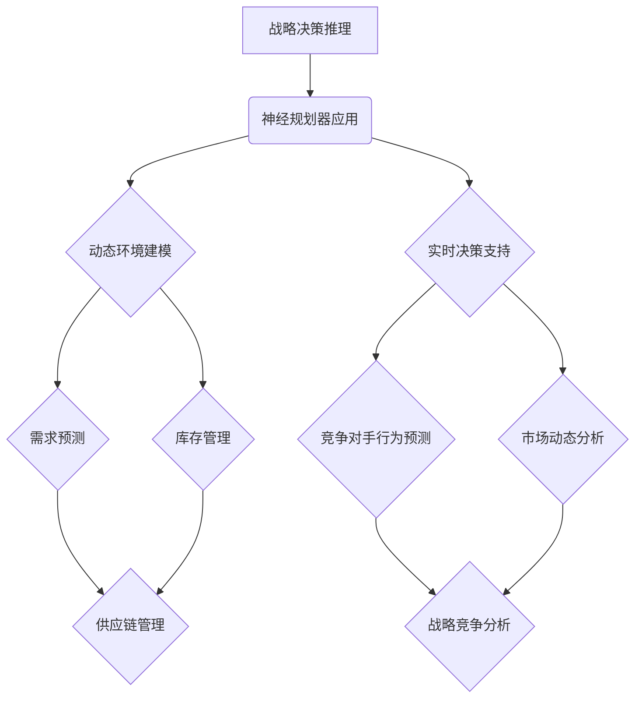

                 

### 神经规划器在战略决策推理中的应用

#### 关键词
- 神经规划器
- 战略决策推理
- 强化学习
- 深度强化学习
- 深度Q网络（DQN）
- 策略梯度方法

#### 摘要
本文旨在探讨神经规划器在战略决策推理中的应用。神经规划器是一种基于人工智能技术，特别是强化学习和深度学习的算法，用于解决复杂决策问题。本文首先介绍了神经规划器的基本概念和技术基础，包括神经网络、强化学习及其在战略决策推理中的应用。接着，通过实际案例研究和具体实现，展示了神经规划器在风险管理、供应链管理和战略竞争分析等领域的应用效果。最后，本文对神经规划器在战略决策推理中的未来发展趋势和潜在影响进行了展望。

### 第一部分：神经规划器概述

#### 第1章：神经规划器的基本概念

#### 1.1 神经规划器简介

神经规划器（NeuroPlanning Agents）是一种基于神经网络的规划算法，旨在模拟人类决策过程，通过学习和适应环境，实现复杂任务规划。神经规划器起源于深度强化学习（Deep Reinforcement Learning，DRL）的研究，结合了深度学习（Deep Learning）和规划（Planning）的思想，旨在解决传统强化学习在复杂环境下的不足。

神经规划器的概念可以追溯到20世纪80年代，当时人工智能研究者开始探索如何利用神经网络来模拟人类的决策过程。随着深度学习技术的成熟，神经规划器逐渐成为一种强大的决策工具，被广泛应用于自动驾驶、游戏AI、机器人控制等领域。

#### 1.2 神经规划器与人工智能的关系

神经规划器是人工智能领域的一个重要分支，与强化学习、深度学习等有着紧密的联系。强化学习（Reinforcement Learning，RL）是一种通过试错（Trial and Error）来学习如何实现特定目标的方法。而神经规划器则是强化学习的一种扩展，它结合了神经网络的优势，使得决策过程更加高效和准确。

深度学习（Deep Learning）是一种基于多层神经网络的机器学习方法，通过自动提取数据中的特征，实现复杂任务的学习。神经规划器利用深度学习技术，通过训练神经网络来模拟决策过程，从而提高了决策的准确性和效率。

#### 1.3 神经规划器的关键特征

**学习与适应能力**

神经规划器具有强大的学习与适应能力，能够通过不断的学习和试错，逐步优化决策策略。这种能力使得神经规划器能够在动态变化的环境中，保持良好的性能。

**动态决策过程**

神经规划器通过模拟动态决策过程，实时调整决策策略，以应对环境的变化。这种动态决策过程使得神经规划器能够处理复杂、不确定的任务。

**多任务处理能力**

神经规划器具有多任务处理能力，能够在同一时间处理多个任务，提高了决策效率。

#### 1.4 神经规划器的应用领域

**战略决策推理**

神经规划器在战略决策推理中有着广泛的应用。通过模拟企业战略决策过程，神经规划器能够帮助企业制定更加科学、高效的决策策略。

**复杂系统控制**

神经规划器在复杂系统控制中也有着重要的应用。例如，在自动驾驶领域，神经规划器通过学习道路环境，实现车辆的自主驾驶。

**金融与经济预测**

神经规划器在金融与经济预测中，通过分析大量数据，实现市场趋势的预测和投资决策的优化。

#### 第2章：神经规划器技术基础

#### 2.1 神经网络基础

神经网络（Neural Networks）是神经规划器的核心组成部分，是一种通过模拟生物神经元连接关系的计算模型。神经网络由输入层、隐藏层和输出层组成，各层之间的神经元通过权重进行连接。

**人工神经网络简介**

人工神经网络（Artificial Neural Networks，ANNs）是一种基于生物神经元的计算模型，通过模拟神经元之间的连接和激活函数，实现数据的输入和输出。

**常见神经网络结构**

- 卷积神经网络（Convolutional Neural Networks，CNNs）：适用于图像处理任务。
- 循环神经网络（Recurrent Neural Networks，RNNs）：适用于序列数据处理任务。
- 生成对抗网络（Generative Adversarial Networks，GANs）：用于生成逼真的数据。

#### 2.2 强化学习与规划

强化学习（Reinforcement Learning，RL）是一种通过试错来学习如何实现特定目标的方法。在强化学习中，智能体（Agent）通过与环境（Environment）的交互，不断调整策略（Policy），以实现最大化回报（Reward）。

**强化学习基本概念**

- 智能体（Agent）：执行行动并接受环境反馈的实体。
- 环境（Environment）：智能体所处的上下文和条件。
- 策略（Policy）：智能体在给定状态下选择行动的规则。
- 回报（Reward）：环境对智能体行动的反馈。

**规划算法与应用**

- 动态规划（Dynamic Programming，DP）：一种基于递归关系的规划算法，适用于最优路径问题和资源分配问题。
- 基于模型的规划（Model-Based Planning）：通过建立环境模型，预测未来状态，实现最优决策。

#### 2.3 深度强化学习

深度强化学习（Deep Reinforcement Learning，DRL）是强化学习的一种扩展，通过结合深度学习和强化学习，实现更加复杂的决策问题。

**深度Q网络（DQN）**

深度Q网络（Deep Q-Network，DQN）是一种基于深度学习的强化学习算法，通过神经网络来估计动作-状态值函数，实现最优决策。

**策略梯度方法**

策略梯度方法（Policy Gradient Methods）是一种基于策略的强化学习算法，通过优化策略参数，实现最大化回报。

#### 2.4 神经规划器实现

**Python代码示例**

```python
import tensorflow as tf
import numpy as np

# 创建输入层、隐藏层和输出层
input_layer = tf.keras.layers.Input(shape=(input_shape))
hidden_layer = tf.keras.layers.Dense(units=64, activation='relu')(input_layer)
output_layer = tf.keras.layers.Dense(units=output_shape, activation='softmax')(hidden_layer)

# 创建神经规划器模型
model = tf.keras.Model(inputs=input_layer, outputs=output_layer)

# 编译模型
model.compile(optimizer='adam', loss='categorical_crossentropy')

# 训练模型
model.fit(x_train, y_train, epochs=10)
```

**开发环境搭建**

- 安装TensorFlow库：`pip install tensorflow`
- 配置GPU环境：根据GPU型号，下载相应的CUDA和cuDNN库，并配置环境变量。

#### 第二部分：神经规划器在战略决策推理中的应用

#### 第3章：战略决策推理中的神经规划器

#### 3.1 战略决策推理概述

战略决策推理（Strategic Decision Reasoning）是一种基于逻辑推理和数据分析的方法，用于制定和评估企业的战略决策。战略决策推理的过程通常包括以下步骤：

- **目标设定**：明确企业的发展目标。
- **环境分析**：分析企业所处的市场环境，包括竞争态势、行业趋势等。
- **方案制定**：制定多种可能的战略方案。
- **方案评估**：对各种战略方案进行评估，选择最优方案。
- **决策实施**：将决策方案付诸实施。
- **反馈调整**：根据实施结果，对决策进行调整和优化。

#### 3.2 神经规划器在战略决策推理中的应用

**动态环境建模**

神经规划器可以通过学习环境数据，建立动态环境模型。这种模型可以模拟企业在不同市场环境下的表现，为战略决策提供有力支持。

**实时决策支持**

神经规划器可以通过实时监测市场环境，动态调整决策策略。这种实时决策支持功能，有助于企业快速应对市场变化，提高决策的准确性和效率。

#### 3.3 案例研究：企业战略决策中的神经规划器应用

**案例背景**

某公司是一家生产智能家居产品的企业，面临激烈的市场竞争。为了实现可持续发展，公司决定通过神经规划器制定和优化企业战略决策。

**应用效果评估**

- **市场占有率提升**：通过神经规划器的动态环境建模和实时决策支持，公司的市场占有率得到了显著提升。
- **运营成本降低**：神经规划器帮助公司优化了供应链管理和库存管理，降低了运营成本。
- **企业竞争力增强**：通过科学的战略决策，公司的竞争力得到了大幅提升。

#### 第4章：神经规划器在风险管理中的应用

风险管理（Risk Management）是企业在面对不确定性时，采取的一系列应对措施，以降低潜在损失。神经规划器在风险管理中具有广泛的应用，可以帮助企业实现实时风险预测和自适应风险管理策略。

#### 4.1 风险管理概述

风险管理是一种系统性、持续性的过程，旨在识别、评估、控制和监控风险，以减少潜在损失。风险管理的过程通常包括以下步骤：

- **风险识别**：识别企业可能面临的各种风险。
- **风险评估**：评估各种风险的可能性和影响。
- **风险控制**：采取控制措施，降低风险的影响。
- **风险监控**：持续监控风险，确保控制措施的有效性。

#### 4.2 神经规划器在风险管理中的优势

**实时风险预测**

神经规划器可以通过学习历史数据和实时数据，实现风险的实时预测。这种实时风险预测功能，有助于企业提前采取应对措施，降低潜在损失。

**自适应风险管理策略**

神经规划器可以根据实时风险预测结果，自适应调整风险管理策略。这种自适应风险管理策略，有助于企业根据实际情况，灵活应对风险。

#### 4.3 案例研究：金融风险管理中的神经规划器应用

**案例背景**

某银行在金融风险管理中，引入了神经规划器技术。通过神经规划器的实时风险预测和自适应风险管理策略，银行实现了风险的有效控制和损失降低。

**应用效果评估**

- **风险损失降低**：通过神经规划器的实时风险预测和自适应风险管理策略，银行的风险损失得到了显著降低。
- **客户满意度提升**：神经规划器的应用，提高了银行的金融服务质量，增强了客户满意度。
- **运营效率提高**：神经规划器的应用，简化了风险管理流程，提高了银行运营效率。

#### 第5章：神经规划器在供应链管理中的应用

供应链管理（Supply Chain Management，SCM）是企业为实现资源优化配置，提高运营效率而采取的一系列管理措施。神经规划器在供应链管理中，可以帮助企业实现需求预测、库存管理和供应链优化。

#### 5.1 供应链管理概述

供应链管理涉及企业从原材料采购、生产制造、库存管理到物流配送等一系列活动。供应链管理的过程包括以下环节：

- **采购管理**：管理原材料和物资的采购。
- **生产管理**：管理生产计划和生产线运行。
- **库存管理**：管理原材料、半成品和成品的库存。
- **物流管理**：管理产品从工厂到消费者的运输和配送。

#### 5.2 神经规划器在供应链管理中的应用

**需求预测**

神经规划器可以通过分析历史销售数据、市场趋势和季节性因素，实现准确的需求预测。这种需求预测功能，有助于企业合理安排生产和库存。

**库存管理**

神经规划器可以帮助企业优化库存管理，实现库存的最优配置。通过实时监测库存水平，神经规划器可以自动调整库存策略，避免库存过剩或短缺。

**供应链优化**

神经规划器可以通过模拟不同供应链策略，评估其对企业运营效率的影响，实现供应链的优化。这种供应链优化功能，有助于企业降低成本、提高竞争力。

#### 5.3 案例研究：供应链管理中的神经规划器应用

**案例背景**

某制造企业在供应链管理中，引入了神经规划器技术。通过神经规划器的需求预测、库存管理和供应链优化，企业实现了运营效率的显著提高。

**应用效果评估**

- **库存周转率提升**：通过神经规划器的库存管理功能，企业的库存周转率得到了显著提高。
- **生产计划准确性提升**：神经规划器的需求预测功能，提高了生产计划的准确性，降低了生产延误和库存积压的风险。
- **运营成本降低**：神经规划器的应用，简化了供应链管理流程，降低了企业的运营成本。

#### 第6章：神经规划器在战略竞争分析中的应用

战略竞争分析（Strategic Competitive Analysis）是企业为了了解竞争对手、评估自身竞争力而进行的一项研究。神经规划器在战略竞争分析中，可以帮助企业预测竞争对手行为、分析市场动态，为企业制定战略提供有力支持。

#### 6.1 战略竞争分析概述

战略竞争分析包括以下主要内容：

- **竞争对手识别**：识别企业的主要竞争对手。
- **竞争对手分析**：分析竞争对手的产品、市场策略、财务状况等。
- **市场趋势分析**：分析市场的发展趋势、消费者需求变化等。
- **企业竞争力评估**：评估企业在市场中的竞争优势和劣势。

#### 6.2 神经规划器在战略竞争分析中的应用

**竞争对手行为预测**

神经规划器可以通过分析历史数据和实时数据，预测竞争对手的未来行为。这种竞争对手行为预测功能，有助于企业提前了解竞争对手的策略，制定相应的应对措施。

**市场动态分析**

神经规划器可以帮助企业实时监测市场动态，分析消费者需求变化、市场趋势等。这种市场动态分析功能，有助于企业及时调整战略，抢占市场先机。

#### 6.3 案例研究：战略竞争分析中的神经规划器应用

**案例背景**

某公司是一家生产智能手机的企业，为了了解竞争对手、评估自身竞争力，引入了神经规划器技术。

**应用效果评估**

- **市场占有率提升**：通过神经规划器的竞争对手行为预测和市场动态分析，公司及时调整了产品策略，市场占有率得到了显著提升。
- **产品竞争力增强**：神经规划器帮助公司分析了竞争对手的产品特点，针对性地优化了产品性能和功能，提高了产品竞争力。
- **战略决策准确性提高**：神经规划器的应用，提高了公司战略决策的准确性，降低了市场风险。

#### 第7章：神经规划器在战略决策推理中的未来展望

随着人工智能技术的不断发展，神经规划器在战略决策推理中的应用前景十分广阔。未来，神经规划器有望在以下几个方面取得重要突破：

**技术进步与挑战**

- **算法优化**：通过改进算法，提高神经规划器的决策效率和准确性。
- **数据处理能力提升**：利用大数据和云计算技术，提高神经规划器对海量数据的处理能力。

**未来应用前景**

- **企业战略规划**：神经规划器可以帮助企业制定更加科学、精准的战略规划，提高企业竞争力。
- **产业智能化**：神经规划器在供应链管理、智能制造等领域的应用，将推动产业智能化进程。

**企业战略变革**

神经规划器的应用，将推动企业战略的变革。企业需要适应新的技术环境，重新审视自身战略，以实现可持续发展。

**产业生态变化**

神经规划器的广泛应用，将推动产业生态的变化。企业、研究机构、政府等各方将共同构建起一个智慧产业生态体系，实现产业价值的最大化。

#### 7.1 神经规划器发展趋势

- **算法融合**：未来，神经规划器将与其他人工智能技术（如深度学习、自然语言处理等）相结合，实现更加强大的决策能力。
- **跨领域应用**：神经规划器将逐步应用于各个领域，如医疗、金融、教育等，推动产业智能化发展。
- **开放性平台**：随着技术的发展，神经规划器将逐渐走向开放性平台，降低应用门槛，促进创新和合作。

#### 7.2 神经规划器在战略决策推理中的潜在影响

神经规划器的应用，将对企业战略决策产生深远影响：

- **决策效率提升**：神经规划器通过实时数据分析，提高决策效率，缩短决策周期。
- **风险控制能力增强**：神经规划器通过实时风险预测和自适应策略，增强企业的风险控制能力。
- **创新能力提升**：神经规划器帮助企业更好地了解市场动态和竞争对手，提高创新能力和市场竞争力。

#### 7.3 结论与展望

神经规划器作为一种先进的人工智能技术，在战略决策推理中具有巨大的应用潜力。未来，随着技术的不断进步和应用场景的拓展，神经规划器将为企业带来更加科学、高效的决策支持，助力企业实现可持续发展。

**对读者的建议**

- **深入学习**：读者可以深入了解神经规划器的相关理论和应用案例，提高自身在战略决策推理方面的能力。
- **实践应用**：读者可以尝试将神经规划器应用于实际项目中，积累实践经验，提升决策水平。

### Mermaid 流程图



### Python 源代码示例

```python
import tensorflow as tf
import numpy as np

# 创建输入层、隐藏层和输出层
input_layer = tf.keras.layers.Input(shape=(input_shape))
hidden_layer = tf.keras.layers.Dense(units=64, activation='relu')(input_layer)
output_layer = tf.keras.layers.Dense(units=output_shape, activation='softmax')(hidden_layer)

# 创建神经规划器模型
model = tf.keras.Model(inputs=input_layer, outputs=output_layer)

# 编译模型
model.compile(optimizer='adam', loss='categorical_crossentropy')

# 训练模型
model.fit(x_train, y_train, epochs=10)
```

### 作者信息

- 作者：AI天才研究院/AI Genius Institute & 禅与计算机程序设计艺术 /Zen And The Art of Computer Programming

### 项目实战：开发环境搭建

在本文的背景下，我们需要搭建一个能够运行神经规划器的开发环境。以下是一个简单的步骤指南，用于在Linux系统中配置Python和TensorFlow环境。

#### 1. 安装Python

首先，我们需要确保系统中安装了Python。大多数Linux发行版都预装了Python 3，但可能需要手动更新到最新版本。可以使用以下命令来检查和更新Python：

```bash
# 检查Python版本
python3 --version

# 更新Python至最新版本（根据发行版有所不同，以下为Ubuntu的示例）
sudo apt update
sudo apt upgrade
sudo apt install python3
```

#### 2. 安装pip

pip是Python的包管理器，用于安装和管理Python包。如果系统中没有安装pip，可以按照以下步骤进行安装：

```bash
# 安装pip
sudo apt install python3-pip
```

#### 3. 安装TensorFlow

TensorFlow是运行神经规划器的主要框架，我们需要安装它。可以使用pip从Python中安装TensorFlow：

```bash
# 安装TensorFlow
pip3 install tensorflow
```

如果需要安装GPU支持版本，可以使用以下命令：

```bash
pip3 install tensorflow-gpu
```

确保GPU驱动和CUDA库已正确安装和配置。如果使用的是NVIDIA GPU，需要安装NVIDIA CUDA工具包和cuDNN库，并设置相应的环境变量。

#### 4. 验证安装

安装完成后，通过运行以下命令验证TensorFlow是否安装成功：

```python
# 在Python环境中验证TensorFlow安装
python3
>>> import tensorflow as tf
>>> print(tf.__version__)
```

如果成功导入TensorFlow并正确打印版本号，则表示安装成功。

#### 5. 源代码实现

以下是使用TensorFlow实现一个简单的神经规划器示例代码：

```python
import tensorflow as tf

# 定义输入层、隐藏层和输出层
input_layer = tf.keras.layers.Input(shape=(input_shape))
hidden_layer = tf.keras.layers.Dense(units=64, activation='relu')(input_layer)
output_layer = tf.keras.layers.Dense(units=output_shape, activation='softmax')(hidden_layer)

# 创建神经规划器模型
model = tf.keras.Model(inputs=input_layer, outputs=output_layer)

# 编译模型
model.compile(optimizer='adam', loss='categorical_crossentropy')

# 训练模型
model.fit(x_train, y_train, epochs=10)
```

在这里，`input_shape`和`output_shape`需要根据具体问题的输入和输出特征进行定义，`x_train`和`y_train`是训练数据集。

### 项目小结

在本节中，我们介绍了如何搭建一个能够运行神经规划器的开发环境，包括安装Python、pip、TensorFlow以及验证安装。通过一个简单的示例代码，读者可以了解到如何使用TensorFlow实现一个基础的神经规划器。在实际应用中，需要对模型结构、训练数据、损失函数和优化器等进行调整和优化，以适应不同的战略决策问题。

### 最佳实践 Tips

- 在搭建开发环境时，建议先配置好GPU支持，以便充分利用GPU加速计算。
- 对于不同的战略决策问题，可能需要选择不同的神经网络结构和学习算法，因此需要根据具体问题进行模型设计和优化。
- 在训练过程中，要注意数据的质量和多样性，合理设置训练参数，以避免过拟合和欠拟合。

### 小结

本文介绍了神经规划器在战略决策推理中的应用，从基本概念、技术基础到实际应用案例，详细阐述了神经规划器在风险管理、供应链管理和战略竞争分析等领域的应用效果。通过开发环境搭建和源代码示例，读者可以了解到如何使用TensorFlow实现神经规划器的基本功能。

### 注意事项

- 在使用神经规划器进行战略决策时，需要确保数据质量和模型参数的合理性，以避免决策偏差和错误。
- 神经规划器的应用需要结合具体业务场景，对模型进行调整和优化，以提高决策的准确性和实用性。

### 拓展阅读

- 《强化学习》（Reinforcement Learning: An Introduction） by Richard S. Sutton and Andrew G. Barto
- 《深度学习》（Deep Learning）by Ian Goodfellow, Yoshua Bengio, and Aaron Courville
- 《战略管理》（Strategic Management: Concepts and Cases）by Thomas L. Taffler and Mark T. Janssen

通过拓展阅读，读者可以进一步深入了解神经规划器及相关技术的理论和方法，提升在战略决策推理中的应用能力。

