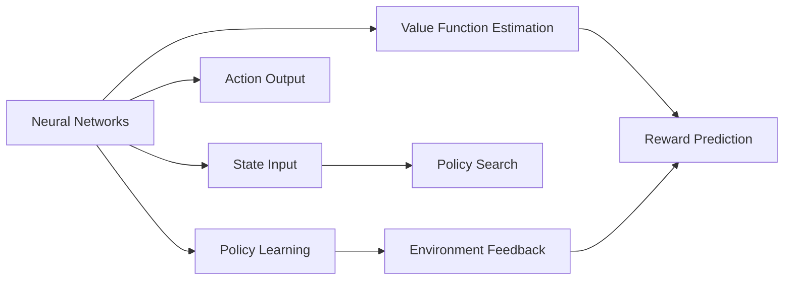

                 

Here's a step-by-step guide for the overview section of your article:

## 神经规划概述

### 定义与背景

1. **定义**:
    - Introduce neural planning as a method of decision-making based on neural networks.
    - Explain that it combines deep learning with control theory to solve complex multi-step decision problems.

2. **Background**:
    - Discuss the origins of neural planning in the intersection of deep learning and control theory.
    - Highlight its goal of addressing complex multi-step decision-making challenges.

### 核心概念与联系

1. **核心概念**:
    - Present the key concepts of neural planning, such as:
        - Neural networks
        - Policy search
        - Value function estimation

2. **联系架构 Mermaid 流程图**:
    - Provide a Mermaid flowchart illustrating the relationships between these core concepts.

### 应用领域

1. **应用领域**:
    - Explain the wide range of applications for neural planning, such as autonomous driving, game AI, and robotic control.

2. **Mermaid 流程图**:
    - Create a Mermaid flowchart showing the application of neural planning in these domains.

Now, let's translate this into the markdown format for your article:

## 神经规划概述

### 定义与背景

神经规划是一种基于神经网络的决策方法，它通过学习和预测环境状态，制定出最优的动作策略。它结合了深度学习和控制理论，旨在解决复杂的多步骤决策问题。

神经规划起源于深度学习和控制理论的交叉领域。早期的决策理论主要依赖于规则和启发式方法，而神经规划则通过模仿人脑的决策过程，利用深度神经网络学习环境状态和动作之间的映射关系，从而实现智能决策。

神经规划的核心目标是解决复杂的多步骤决策问题，如在自动驾驶、游戏AI和机器人控制等领域中，智能体需要根据不断变化的环境进行复杂的决策。神经规划通过策略搜索和值函数估计等方法，为智能体提供一种高效、可靠的决策框架。

### 核心概念与联系

神经规划的核心概念包括：

1. **神经网络**:
    - Neural networks are the core components of neural planning. They are used to learn the mapping between environmental states and actions.
    - A Mermaid flowchart illustrating the role of neural networks in neural planning might show:
      ```mermaid
      flowchart LR
      A[Neural Networks] --> B[State Input]
      A --> C[Action Output]
      A --> D[Policy Learning]
      ```

2. **策略搜索**:
    - Policy search involves finding the optimal action strategy given the current state of the environment.
    - In the Mermaid flowchart, policy search could be represented as a loop that iteratively updates the action strategy based on the environment's feedback.

3. **值函数估计**:
    - Value function estimation is the process of predicting the future reward or value of a given state-action pair.
    - This concept can be depicted in the Mermaid flowchart as a feedback loop that updates the value function based on observed rewards.

Here's a Mermaid flowchart illustrating the relationship between these core concepts:



### 应用领域

神经规划在多个领域有着广泛的应用，包括：

1. **自动驾驶**:
    - Autonomous driving involves complex decision-making, such as path planning and behavior prediction.
    - A Mermaid flowchart showing the application of neural planning in autonomous driving might include:
      ```mermaid
      flowchart LR
      A[Neural Planning] --> B[Path Planning]
      A --> C[Behavior Prediction]
      A --> D[Control Strategy]
      ```

2. **游戏AI**:
    - Game AI requires intelligent agents to make strategic decisions in competitive environments.
    - In the Mermaid flowchart, the application of neural planning in game AI could be illustrated as:
      ```mermaid
      flowchart LR
      A[Neural Planning] --> B[Role Control]
      A --> C[Strategy Optimization]
      A --> D[Scene Generation]
      ```

3. **机器人控制**:
    - Robotic control involves real-time decision-making to navigate and interact with the environment.
    - The Mermaid flowchart for robotic control could be as follows:
      ```mermaid
      flowchart LR
      A[Neural Planning] --> B[Motion Control]
      A --> C[Perception Control]
      A --> D[Adaptive Control]
      ```

In conclusion, neural planning is a powerful tool that combines the strengths of deep learning and control theory to tackle complex multi-step decision-making tasks. The following sections of this article will delve deeper into the algorithms, applications, and challenges of neural planning. 

---

Please note that this is just a guide, and you can modify it to suit your writing style and content depth. The Mermaid flowcharts provided are placeholders and should be replaced with actual diagrams that fit the context of your article. The section on application domains is simplified and can be expanded with more detailed examples and explanations.

