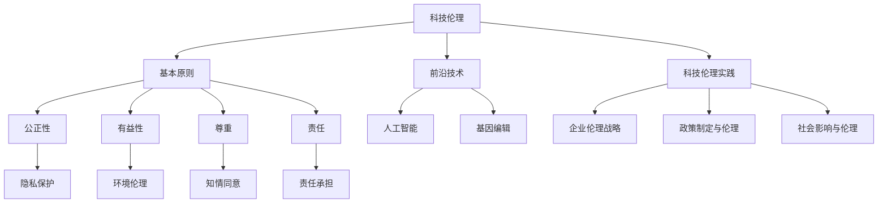

                 

### 科技伦理智库：前沿技术发展的道德指南

### 引言

#### 1.1 书籍目的与背景
本书旨在提供一个系统性的框架，以探讨和解决在快速发展的科技领域中所面临的伦理问题。在人工智能、基因编辑、自动驾驶等前沿技术不断突破的同时，我们也面临着一系列道德和伦理上的挑战。这些挑战不仅关乎技术的可行性，更关乎其对社会、环境以及个体福祉的影响。因此，本书的核心目标是为读者提供一个全面而深入的道德指南，帮助他们在科技发展的浪潮中找到伦理平衡点。

科技伦理的重要性不言而喻。首先，它有助于确保科技发展不会对人类社会的基本价值观和原则造成损害。其次，科技伦理指导我们在追求技术创新的同时，考虑到各种可能的风险和负面影响，从而采取适当的预防措施。最后，科技伦理还可以促进科技行业的可持续发展，增强公众对科技发展的信任，推动技术创新与社会需求之间的良性互动。

#### 1.2 科技伦理的重要性
科技伦理的重要性体现在以下几个方面：

1. **价值观的引导**：科技伦理为科技发展提供了价值观的引导，帮助我们在技术创新过程中坚持正确的方向。
2. **社会责任的落实**：科技企业和社会组织通过遵循科技伦理原则，能够更好地履行其社会责任，减少科技发展对社会和环境的负面影响。
3. **法治的保障**：科技伦理原则可以转化为法律法规，为科技活动提供法律保障，从而规范科技行业的行为。
4. **公共信任的建立**：科技伦理的遵循可以增强公众对科技的信任，促进科技与社会之间的和谐发展。

在接下来的章节中，我们将详细探讨科技伦理的基本理论，分析前沿技术的伦理问题，探讨科技伦理实践，并通过案例研究和未来展望，进一步理解科技伦理的重要性及其在现实中的应用。

### 第一部分：科技伦理的基本理论

#### 2.1 科技伦理的概念

##### 2.1.1 科技伦理的定义
科技伦理，作为一个多学科交叉的研究领域，关注科技活动对社会、环境和人类福祉的影响，并探讨这些影响是否符合道德原则和价值观。具体来说，科技伦理研究如何通过道德原则和规范来指导科技的发展和应用，确保其在符合人类利益和社会发展目标的前提下进行。

科技伦理的定义可以从以下几个方面进行阐述：

- **影响评估**：科技伦理要求在科技项目启动前，对其进行全面的道德评估，以评估其可能带来的正面和负面影响。
- **道德原则**：科技伦理基于一系列道德原则，如公正性、有益性、尊重和责任，以指导科技决策和行为。
- **价值观导向**：科技伦理不仅仅关注技术本身的可行性，更关注技术是否符合社会的核心价值观，如公正、自由和平等。
- **跨学科整合**：科技伦理需要整合伦理学、社会学、法学等多个学科的理论和方法，以全面探讨科技领域的道德问题。

##### 2.1.2 科技伦理的起源与发展
科技伦理的历史可以追溯到古希腊哲学时期，当时的哲学家们已经开始探讨人类行为对自然和宇宙的影响。进入中世纪，宗教伦理对科技的发展产生了重要影响。随着近代科学的兴起，科技伦理逐渐从宗教和哲学中独立出来，成为一个专门的研究领域。

20世纪以来，科技伦理得到了广泛关注和发展。以下是一些关键的发展阶段：

- **20世纪50年代**：随着原子能和生物技术的兴起，科技伦理研究开始受到重视，出现了第一批科技伦理学著作。
- **20世纪70年代**：环境伦理和生命伦理学的发展，进一步丰富了科技伦理的理论基础。
- **20世纪80年代**：计算机伦理和信息技术伦理成为研究热点，科技伦理的应用范围不断扩展。
- **21世纪初**：随着人工智能、基因编辑等前沿技术的迅猛发展，科技伦理研究进入了一个新的阶段，涉及更多的伦理问题和挑战。

##### 2.1.3 科技伦理与道德哲学的关系
科技伦理与道德哲学密切相关。道德哲学提供了科技伦理的理论基础和方法论支持，而科技伦理则将道德哲学的原理应用于具体科技情境中。

首先，科技伦理借鉴了道德哲学的基本原则，如公正性、有益性、尊重和责任。这些原则为科技决策提供了道德指导，帮助我们在科技应用中遵循社会价值观和道德规范。

其次，科技伦理研究方法也受到道德哲学的影响。例如，案例分析、伦理学方法、规范分析等方法都是道德哲学中常用的研究工具，在科技伦理研究中发挥了重要作用。

总之，科技伦理是道德哲学在科技领域中的应用，它通过道德原则和规范来指导科技的发展和应用，确保其在符合道德要求和社会利益的前提下进行。

#### 2.2 科技伦理的原则

##### 2.2.1 基本原则
科技伦理的基本原则包括公正性、有益性、尊重和责任。这些原则为科技活动提供了道德框架，确保科技发展不会对人类和社会造成不可接受的风险和伤害。

1. **公正性**
   公正性原则要求科技发展要公平地分配资源和利益，避免对特定群体造成不公平的损害。在科技伦理中，公正性原则体现在以下几个方面：

   - **资源分配**：科技资源的分配应该公平合理，确保所有人都能公平地享受科技带来的好处。
   - **机会均等**：科技发展不应造成社会阶层和区域发展的不平衡，应努力缩小数字鸿沟。
   - **责任分担**：科技活动中产生的风险和责任应该公平地分配，不能让某一群体独自承担不可承受的负担。

2. **有益性**
   有益性原则要求科技发展必须对人类和社会有益，必须考虑其潜在的好处和负面影响。在科技伦理中，有益性原则体现在以下几个方面：

   - **社会效益**：科技发展应该注重其对社会和人类福祉的积极影响，而不仅仅是经济效益。
   - **风险评估**：在科技项目启动前，必须进行全面的风险评估，确保其不会对人类和环境造成不可逆转的损害。
   - **责任承担**：如果科技项目可能带来负面影响，相关责任主体应承担相应的责任，确保其负面影响得到控制和减轻。

3. **尊重**
   尊重原则要求科技活动必须尊重个体的尊严和权利，特别是在涉及人类生命、隐私和个人信息的情况下。在科技伦理中，尊重原则体现在以下几个方面：

   - **自主权**：个体应有权自主决定是否参与科技项目，并且有权了解和选择相关的科技应用。
   - **隐私保护**：科技应用应保护用户的隐私权，防止个人信息被滥用和泄露。
   - **知情同意**：在进行涉及人类个体的科技研究时，必须确保个体知情并同意参与，尊重其自主权。

4. **责任**
   责任原则要求科技研发者和应用者必须对其行为负责，确保科技发展符合道德和法律要求。在科技伦理中，责任原则体现在以下几个方面：

   - **研发责任**：科技研发者必须对其研究行为负责，确保其研究成果不会对人类和社会造成负面影响。
   - **应用责任**：科技应用者必须对其应用行为负责，确保科技应用的正当性和合理性。
   - **监管责任**：政府和社会组织应承担监管责任，确保科技活动符合伦理和法律要求，防止科技滥用和伦理失控。

##### 2.2.2 特定原则
除了基本原则外，科技伦理还涉及一些特定领域的伦理原则，这些原则针对特定科技领域和应用场景，提供更具体的道德指导。

1. **隐私保护**
   隐私保护原则要求在科技应用中必须尊重和保护用户的隐私权，防止个人信息被非法收集、使用和泄露。在信息技术和生物技术领域，隐私保护尤为重要。

   - **数据收集**：在收集用户数据时，必须明确告知用户数据的用途和范围，并获得其明确同意。
   - **数据存储**：应采取严格的安全措施，保护用户数据不被未授权访问和泄露。
   - **数据共享**：在数据共享时，应确保数据匿名化和去标识化，防止用户身份被识别。

2. **信息安全**
   信息安全原则要求在科技应用中必须确保信息安全，防止数据泄露、网络攻击和系统崩溃。在网络安全和物联网领域，信息安全尤为重要。

   - **安全防护**：应采用多种安全技术和措施，保护系统和数据免受攻击和破坏。
   - **安全审计**：定期进行安全审计，检查系统漏洞和安全风险，及时修复。
   - **应急预案**：制定应急预案，应对突发事件，确保信息系统的稳定运行。

3. **知识产权**
   知识产权原则要求在科技发展中必须尊重和保护知识产权，防止侵权和滥用。在信息技术和创新领域，知识产权保护尤为重要。

   - **知识产权保护**：制定和完善知识产权法律法规，加强对知识产权的保护。
   - **知识产权管理**：企业和研发机构应建立知识产权管理体系，确保知识产权的合法取得和应用。
   - **知识产权交易**：鼓励知识产权的交易和合作，促进科技创新和产业发展。

4. **环境伦理**
   环境伦理原则要求在科技发展中必须考虑环境保护和可持续发展，减少对自然环境的破坏和污染。在环境保护和绿色科技领域，环境伦理尤为重要。

   - **环境影响评估**：在科技项目启动前，必须进行全面的环境影响评估，确保项目不会对环境造成不可逆转的损害。
   - **环境保护措施**：在科技应用中，应采取环境保护措施，减少污染物排放和资源消耗。
   - **可持续发展**：科技发展应注重可持续发展，促进资源的合理利用和环境保护。

通过遵循这些特定原则，科技伦理能够更有效地指导科技活动，确保科技发展符合道德和社会要求，为人类社会带来更多的福祉。

#### 2.3 科技伦理的理论框架

##### 2.3.1 主要理论
科技伦理的理论基础包括功利主义、康德伦理学和规范伦理学等。这些理论提供了不同的道德视角和原则，为科技伦理研究提供了重要的理论支持。

1. **功利主义**
   功利主义是伦理学中一种常见的道德理论，主张行为的价值取决于其产生的幸福（或快乐）总量。在科技伦理中，功利主义原则要求我们评估科技项目的整体影响，选择能够最大化幸福总量的方案。

   - **功利主义原则**：在科技决策中，应考虑行为带来的好处和坏处，选择能够最大化总体幸福（或利益）的方案。
   - **应用实例**：例如，在自动驾驶汽车的伦理决策中，功利主义可能会建议选择最小化事故损失和伤害的方案，即使这可能导致某些特定个体的牺牲。

2. **康德伦理学**
   康德伦理学强调道德行为的客观性和普遍性，主张行为的价值不取决于其结果，而取决于行为本身的道德性质。在科技伦理中，康德伦理学原则要求我们遵循道德规则，不论结果如何。

   - **康德伦理学原则**：在科技决策中，应遵循普遍适用的道德规则，如尊重人的尊严和自主权。
   - **应用实例**：例如，在基因编辑技术的伦理决策中，康德伦理学可能会建议禁止任何可能侵犯人类尊严和自主权的实验。

3. **规范伦理学**
   规范伦理学关注道德规则和价值观的形成和解释，主张道德判断应基于规范或道德原则。在科技伦理中，规范伦理学原则提供了评估科技项目合法性和合理性的标准。

   - **规范伦理学原则**：在科技决策中，应参考公认的伦理规范和价值观，确保科技项目符合道德要求。
   - **应用实例**：例如，在人工智能伦理决策中，规范伦理学可能会建议遵循《人工智能伦理指南》中的原则，以确保人工智能系统的道德合规。

这些理论不仅为科技伦理提供了不同的道德视角和原则，而且也为科技决策提供了具体的指导。通过结合这些理论，我们可以更全面地评估科技项目的道德影响，并做出更加合理的决策。

##### 2.3.2 伦理学方法
科技伦理研究需要运用多种伦理学方法，以全面分析和解决科技领域的道德问题。以下是一些常用的伦理学方法：

1. **伦理学分析**
   伦理学分析是科技伦理研究的基础方法，通过系统性地分析科技项目的道德属性和影响，评估其是否符合道德原则。伦理学分析包括以下几个方面：

   - **道德原则识别**：确定科技项目涉及的道德原则，如公正性、有益性、尊重和责任。
   - **道德影响评估**：评估科技项目可能带来的道德影响，包括正面影响和负面影响。
   - **道德冲突解决**：在存在道德冲突时，通过分析和权衡，选择最合理的解决方案。

2. **规范伦理学方法**
   规范伦理学方法基于道德规范和原则，通过制定和遵守道德规范来指导科技活动。这种方法包括以下几个方面：

   - **道德规范制定**：根据科技领域的特点和伦理要求，制定具体的道德规范。
   - **道德规范执行**：通过伦理审查、监管和合规措施，确保道德规范得到有效执行。
   - **道德规范评估**：定期评估道德规范的执行效果，根据实际情况进行修订和优化。

3. **伦理学案例研究**
   伦理学案例研究通过分析具体的科技案例，探讨其道德问题及其解决方法。这种方法包括以下几个方面：

   - **案例选择**：选择具有典型性和代表性的科技案例，以反映科技领域的道德问题。
   - **案例分析**：详细分析案例中的道德问题，探讨其原因、影响和解决方案。
   - **案例总结**：总结案例中的经验和教训，为类似案例提供参考和指导。

4. **伦理学决策支持**
   伦理学决策支持是利用伦理学方法和工具，为科技决策提供道德依据和支持。这种方法包括以下几个方面：

   - **决策框架建立**：根据科技项目的特点和伦理要求，建立道德决策框架。
   - **决策过程优化**：通过伦理学分析和方法，优化决策过程，确保决策的道德合理性。
   - **决策效果评估**：评估决策结果是否符合道德原则和预期目标，及时调整和优化决策。

通过运用这些伦理学方法，科技伦理研究能够更全面、深入地分析科技领域的道德问题，提供科学的决策支持，促进科技活动的道德发展和应用。

### 第二部分：前沿技术的伦理问题

#### 3.1 人工智能

##### 3.1.1 AI技术概述
人工智能（Artificial Intelligence，简称AI）作为当今科技领域的前沿技术，已经广泛应用于各个行业，从自动驾驶、医疗诊断到金融分析、智能家居，AI技术的渗透力正在不断加强。人工智能的基本原理是通过模拟人类思维和行为的方式来设计和开发计算机系统，使其能够执行复杂的任务，如学习、推理、决策和问题解决。

AI技术的发展历程可以追溯到20世纪50年代，当时人工智能的概念首次被提出。从最初的符号主义和逻辑推理，到基于统计学习的机器学习算法，再到现代深度学习和神经网络技术的广泛应用，人工智能经历了多个阶段的发展。当前，深度学习已经成为AI技术的主流方向，通过大规模数据训练复杂的神经网络模型，AI系统在图像识别、自然语言处理、语音识别等领域取得了显著的突破。

##### 3.1.2 AI伦理问题分析
尽管人工智能技术带来了巨大的机遇，但同时也引发了一系列伦理问题，这些伦理问题主要集中在以下几个方面：

1. **隐私保护**
   AI系统通常需要收集和分析大量个人数据，这引发了隐私保护的问题。个人隐私的泄露不仅可能导致个人信息被滥用，还可能对个人的生活和工作造成负面影响。例如，智能语音助手收集的对话内容可能被未经授权的第三方访问和使用。

2. **算法偏见**
   AI系统在训练过程中可能会受到数据偏见的影响，从而产生偏见性的决策。如果训练数据中存在种族、性别、年龄等偏见，AI系统可能会在决策中表现出类似的偏见，导致不公平的结果。例如，某些招聘系统的算法可能会无意中排除特定性别或种族的候选人。

3. **透明度和可解释性**
   AI系统的决策过程通常是非透明的，这给用户和监管机构带来了挑战。许多AI系统，尤其是深度学习模型，其内部机制复杂，难以解释为何做出特定决策。这导致了用户对AI系统的不信任，并增加了监管和合规的难度。

4. **道德决策**
   AI系统在某些情况下需要做出道德决策，例如自动驾驶汽车在紧急情况下如何选择。这些决策往往涉及复杂的价值判断，而AI系统缺乏人类的道德直觉和情感，可能导致不合理的决策。

5. **就业影响**
   人工智能技术的发展可能导致某些工作岗位的自动化，从而影响就业和社会稳定。虽然AI技术创造了新的就业机会，但同时也引发了关于就业结构变化和劳动者权益的讨论。

#### 案例分析
以下是一个具体的AI伦理问题案例：

**案例：算法偏见在招聘中的应用**

某公司在招聘过程中使用了一种基于机器学习的招聘算法。该算法通过分析大量历史招聘数据来预测哪些候选人最有可能被录用。然而，这些历史数据中可能包含了种族、性别等偏见，导致算法在招聘过程中表现出类似的偏见。

结果，在多次招聘中，算法倾向于拒绝女性和少数族裔候选人，从而造成了不公平的招聘结果。这一事件引发了广泛的社会关注，公司被迫重新审视其招聘算法的设计和应用。

解决方案：
- **数据清洗**：在训练算法之前，对数据集进行清洗，去除可能存在的偏见信息。
- **算法透明度**：提高算法的透明度，让用户能够了解其决策过程和依据。
- **多维度评估**：采用多维度评估方法，综合考虑候选人的多种特征，减少单一维度的偏见影响。

通过这些措施，公司可以逐步解决算法偏见问题，确保招聘过程的公平性和公正性。

#### 结论
人工智能技术的发展带来了巨大的机遇，但同时也伴随着一系列伦理问题。通过深入分析这些伦理问题，并采取相应的解决措施，我们可以确保人工智能技术在符合道德和社会要求的前提下得到合理应用，为人类社会带来更多的福祉。

#### 3.2 基因编辑

##### 3.2.1 基因编辑技术
基因编辑技术是一种通过直接修改生物体基因组来实现特定遗传改变的方法。近年来，随着CRISPR-Cas9等新技术的问世，基因编辑技术取得了显著进展，成为生物医学和生物技术领域的重要工具。

基因编辑技术的基本原理是利用特定的核酸酶（如CRISPR-Cas9系统中的Cas9酶）在特定的DNA序列上制造双链断裂，然后利用细胞自身的DNA修复机制进行修复。在这个过程中，研究人员可以引入特定的遗传物质，从而实现对目标基因的精准修改。

基因编辑技术的主要优势包括：

- **疾病治疗**：通过修改致病基因，基因编辑技术为治疗遗传性疾病提供了新的可能性。例如，对于某些单基因遗传病，基因编辑技术可以修复或替换缺陷基因，从而治疗疾病。
- **生物研究**：基因编辑技术可以用于研究基因功能，通过精确地敲除或替换特定基因，研究人员可以了解这些基因在细胞和组织中的作用。
- **农业改良**：基因编辑技术可以帮助培育高产、抗病虫害的农作物，提高农业生产效率。

##### 3.2.2 基因编辑伦理挑战
尽管基因编辑技术具有巨大的潜力，但其在实际应用中面临着一系列伦理挑战，这些挑战主要集中在以下几个方面：

1. **生物安全**
   基因编辑技术可能对生物多样性产生不可预测的影响。基因编辑工具不仅可能编辑目标物种的基因组，还可能意外编辑其他物种的基因组，从而引发生态系统的连锁反应。此外，基因编辑技术可能导致基因污染，使得转基因生物对自然环境造成长期影响。

2. **伦理审查**
   基因编辑技术的应用需要严格的伦理审查。在某些情况下，基因编辑可能涉及对人类胚胎的修改，这引发了道德争议。例如，一些专家认为，对人类胚胎进行基因编辑可能侵犯人类尊严，并可能导致不可逆转的伦理问题。

3. **隐私保护**
   基因编辑技术可能涉及到个人隐私的保护问题。基因信息的收集、存储和分析需要严格的安全措施，以防止基因信息被滥用或泄露。基因信息的泄露可能导致个人隐私被侵犯，甚至可能被用于保险欺诈、歧视等不道德行为。

4. **伦理决策**
   基因编辑技术涉及到复杂的伦理决策。例如，在某些情况下，基因编辑可能用于增强人类能力，这引发了关于“设计婴儿”的伦理讨论。此外，基因编辑技术可能用于性别选择，这引发了关于性别平等和隐私权的伦理争议。

#### 案例分析
以下是一个具体的基因编辑伦理案例：

**案例：CRISPR-Cas9技术在胚胎编辑中的应用**

2018年，中国科学家贺建奎宣布成功利用CRISPR-Cas9技术对人类胚胎进行基因编辑，以创造抗艾滋病的婴儿。这一宣布引发了全球伦理争议，许多专家认为这一行为违反了伦理规范和道德原则。

伦理争议点：

- **伦理审查**：贺建奎的研究没有经过严格的伦理审查，违反了国际伦理规范和道德原则。
- **生物安全**：基因编辑技术可能对胚胎和后代产生不可预测的影响，这引发了生物安全的担忧。
- **隐私保护**：基因编辑技术涉及到个人基因信息的收集和使用，可能侵犯个人隐私权。

解决方案：

- **加强伦理审查**：确保基因编辑研究在启动前经过严格的伦理审查，遵循国际伦理规范和道德原则。
- **生物安全评估**：在基因编辑技术应用于人类之前，进行全面的生物安全评估，确保其不会对生物多样性和人类健康造成不可逆转的损害。
- **隐私保护**：加强基因信息的保护措施，确保个人基因信息不被滥用或泄露。

#### 结论
基因编辑技术具有巨大的潜力，但其在实际应用中面临着一系列伦理挑战。通过深入分析和解决这些伦理问题，我们可以确保基因编辑技术在符合伦理和社会要求的前提下得到合理应用，为人类社会带来更多的福祉。

### 第三部分：科技伦理实践

#### 4.1 科技伦理在企业中的实施

##### 4.1.1 企业伦理战略
企业在科技发展过程中承担着重要的社会责任，必须在其业务战略中融入科技伦理，以指导企业的科技研发和应用。企业伦理战略包括以下几个方面：

1. **伦理原则的制定**
   企业应制定明确的伦理原则，以指导科技研发和应用。这些伦理原则应涵盖公正性、有益性、尊重和责任等基本道德原则，并具体落实到科技项目的各个阶段。

2. **伦理委员会的设立**
   企业可以设立伦理委员会，负责审查和监督科技项目的道德合规性。伦理委员会应由跨部门专业人员组成，包括伦理学家、法律专家、技术人员和社会学者等，以确保对科技项目进行全面的道德评估。

3. **伦理培训与宣传**
   企业应定期开展伦理培训，提高员工对科技伦理的认识和意识。通过宣传和教育活动，让员工了解企业伦理原则，并鼓励其在工作中遵循这些原则。

4. **伦理风险评估**
   在科技项目启动前，企业应进行全面的风险评估，评估项目可能带来的伦理问题。这包括对项目的影响评估、潜在风险的识别和应对措施的制定。

##### 4.1.2 伦理审查与合规
伦理审查是确保科技项目符合道德和法律要求的重要环节。企业应建立完善的伦理审查机制，包括以下几个步骤：

1. **伦理审查委员会的组成**
   企业应设立伦理审查委员会，由跨部门专业人员组成，负责审查科技项目的道德合规性。伦理审查委员会应定期召开会议，审议科技项目的申请和变更。

2. **伦理审查流程**
   企业应制定详细的伦理审查流程，包括项目的申请、审查、批准和监督。审查流程应确保透明、公正和高效，避免伦理审查成为项目推进的障碍。

3. **伦理审查标准**
   企业应制定明确的伦理审查标准，包括道德原则、法律法规和行业标准。这些标准应具体、可操作，以便伦理审查委员会在审查过程中有据可依。

4. **合规监督与反馈**
   企业应建立合规监督机制，定期对科技项目的实施情况进行监督和评估。对于发现的伦理问题，应采取相应的纠正措施，并反馈给伦理审查委员会。

##### 4.1.3 科技伦理在企业中的应用案例
以下是一个具体的科技伦理在企业中的应用案例：

**案例：某科技公司的伦理审查流程**

某科技公司计划开发一款基于人工智能的医疗诊断系统。在项目启动前，公司设立了伦理审查委员会，并制定了详细的伦理审查流程。

1. **项目申请**：项目团队向伦理审查委员会提交项目申请，包括项目的目标、方法、预期影响和潜在风险。

2. **初步审查**：伦理审查委员会对项目申请进行初步审查，评估项目是否符合企业的伦理原则和法律法规要求。

3. **详细审查**：伦理审查委员会对项目进行详细审查，包括对项目的技术方案、数据收集和处理方式、潜在伦理问题等进行深入分析。

4. **风险评估**：伦理审查委员会对项目可能带来的伦理风险进行评估，并提出相应的风险控制措施。

5. **批准与监督**：伦理审查委员会对项目进行最终审查，批准项目启动。在项目实施过程中，伦理审查委员会定期进行监督和评估，确保项目符合伦理要求。

通过这个案例，我们可以看到，企业在科技项目中实施伦理审查的流程和措施，以及如何通过伦理审查确保项目的道德合规性。

#### 4.2 政策制定与伦理

##### 4.2.1 政策背景与趋势
科技伦理在政策制定中的重要性日益凸显，各国政府纷纷出台相关政策法规，以规范科技研发和应用，确保其在符合道德和社会要求的前提下进行。以下是一些全球范围内的政策背景和趋势：

1. **国际法规与标准**
   国际组织如联合国、世界卫生组织等制定了一系列与科技伦理相关的国际法规和标准，旨在推动全球范围内的科技伦理规范。例如，联合国教科文组织发布的《生物多样性公约》和《人类基因组编辑国际准则》等。

2. **国家法规与政策**
   各国政府根据本国实际情况，制定了一系列科技伦理政策和法规。例如，美国通过《健康信息技术促进经济和临床健康法案》（HITECH Act），加强医疗数据隐私保护；中国发布了《新一代人工智能发展规划》，强调人工智能的伦理规范。

3. **行业自律**
   行业协会和专业机构也在积极推动科技伦理的规范化和标准化。例如，国际计算机协会（ACM）和国际人工智能研究协会（AAAI）等组织发布了多项伦理准则和指南，为科技研发和应用提供指导。

##### 4.2.2 政策制定中的伦理考量
在政策制定过程中，伦理考量是确保科技发展符合社会价值、保护人类福祉的关键。以下是一些关键的伦理考量：

1. **公正性**
   政策制定应确保科技发展不会加剧社会不平等，特别是要关注弱势群体的权益保护。例如，在制定人工智能政策时，应确保算法的公平性和透明度，避免算法偏见对特定群体造成不利影响。

2. **有益性**
   政策制定应考虑科技发展对社会的整体利益，包括经济效益、社会效益和生态效益。例如，在制定新能源政策时，应综合考虑能源效率、环境可持续性和经济可行性。

3. **尊重**
   政策制定应尊重个体的权利和尊严，确保科技应用不侵犯个人隐私、自由和自主权。例如，在制定数据保护政策时，应明确个人数据的收集、使用和共享原则，保护个人隐私权。

4. **责任**
   政策制定应明确科技研发者和应用者的责任，确保他们在科技活动中承担相应的道德和法律义务。例如，在制定生物技术政策时，应明确科研机构和企业对生物安全的责任，防止基因污染和生物安全问题。

#### 4.3 社会影响与伦理

##### 4.3.1 社会影响评估
科技发展对社会的影响深远，包括经济、社会、环境和政治等多个方面。为了确保科技发展符合社会利益，政策制定者和企业需要对其进行全面的社会影响评估。以下是一些关键步骤：

1. **影响识别**
   通过分析科技项目的具体内容，识别可能对社会产生的正面和负面影响。这包括对就业、经济、环境、社会公平等方面的潜在影响。

2. **影响分析**
   对识别出的影响进行定量和定性分析，评估其程度和范围。这可以通过数据收集、专家咨询、模型模拟等方法进行。

3. **影响评估**
   综合分析结果，评估科技项目对社会整体的影响，包括积极影响和负面影响，以及潜在的长期和短期影响。

4. **风险管理**
   根据评估结果，制定相应的风险管理和应对措施，以减轻负面影响，最大化正面影响。这包括政策调整、技术改进、社会参与等措施。

##### 4.3.2 公众参与与伦理
公众参与是确保科技发展符合社会利益和伦理要求的重要手段。通过公众参与，可以收集多方面的意见和反馈，提高科技项目的透明度和公正性。以下是一些关键步骤：

1. **信息公开**
   公开科技项目的相关信息，包括项目目标、方法、预期影响和潜在风险等，以便公众了解项目的全貌。

2. **公众咨询**
   通过问卷调查、公众论坛、专家咨询等方式，收集公众的意见和建议，确保公众的声音在决策过程中得到体现。

3. **公众监督**
   建立公众监督机制，确保科技项目的实施符合伦理和社会要求。公众可以通过监督报告、投诉机制等方式，对项目实施进行监督。

4. **公众反馈**
   定期向公众反馈项目的进展情况和评估结果，接受公众的反馈和评价，并根据反馈进行必要的调整和改进。

通过公众参与，科技项目可以更好地符合社会利益和伦理要求，增强公众对科技发展的信任和支持。

### 第四部分：案例分析

#### 5.1 案例一：人工智能伦理问题

**案例背景**：
某大型科技公司开发了一款基于人工智能的自动驾驶汽车，该汽车在道路上进行测试。然而，在测试过程中，这款汽车在紧急情况下未能做出正确的决策，导致了一起交通事故。

**伦理问题分析**：
- **透明度和可解释性**：自动驾驶汽车的决策过程复杂，用户难以理解其为何做出特定决策，这引发了用户对透明度和可解释性的担忧。
- **道德决策**：自动驾驶汽车在紧急情况下需要做出道德决策，例如在碰撞不可避免时如何选择最合适的行动方案，这引发了道德和伦理上的争议。
- **隐私保护**：自动驾驶汽车需要收集大量道路和车辆数据，这可能侵犯用户的隐私权。

**解决方案**：
- **提高透明度和可解释性**：科技公司应开发用户友好的工具，帮助用户了解自动驾驶汽车的决策过程和依据。
- **道德决策框架**：建立明确的道德决策框架，确保自动驾驶汽车在紧急情况下做出合理和道德的决策。
- **隐私保护**：采取严格的数据保护措施，确保用户数据不被滥用或泄露。

**结论**：
通过分析和解决这些伦理问题，科技公司可以确保其自动驾驶汽车在符合道德和社会要求的前提下得到广泛应用，为交通安全和效率带来积极影响。

#### 5.2 案例二：基因编辑伦理争议

**案例背景**：
2018年，中国科学家贺建奎宣称成功利用CRISPR-Cas9技术对人类胚胎进行基因编辑，以创造抗艾滋病的婴儿。这一消息引发了全球科学界和伦理学界的强烈反响。

**伦理问题分析**：
- **生物安全**：基因编辑技术可能对生物多样性产生不可预测的影响，存在生物安全的隐患。
- **伦理审查**：贺建奎的研究未经过严格的伦理审查，违反了国际伦理规范和道德原则。
- **隐私保护**：基因编辑涉及到个人基因信息的收集和使用，可能侵犯个人隐私权。

**解决方案**：
- **加强生物安全评估**：在基因编辑技术应用于人类之前，进行全面的生物安全评估，确保其不会对生物多样性和人类健康造成不可逆转的损害。
- **建立严格的伦理审查机制**：确保所有基因编辑研究在启动前经过严格的伦理审查，遵循国际伦理规范和道德原则。
- **强化隐私保护**：采取严格的数据保护措施，确保个人基因信息不被滥用或泄露。

**结论**：
通过加强生物安全、伦理审查和隐私保护，可以确保基因编辑技术在符合道德和社会要求的前提下得到合理应用，为遗传性疾病治疗和生物医学研究带来积极影响。

#### 5.3 案例三：自动驾驶伦理案例

**案例背景**：
某自动驾驶汽车公司在测试过程中发生了一起交通事故，导致一名行人死亡。这一事件引发了公众对自动驾驶汽车安全性和伦理问题的关注。

**伦理问题分析**：
- **责任归属**：在自动驾驶汽车发生交通事故时，如何确定责任归属成为一个伦理问题。
- **道德决策**：自动驾驶汽车在紧急情况下需要做出道德决策，例如在无法避免碰撞时如何选择最合适的行动方案。
- **安全性和可靠性**：自动驾驶汽车的安全性和可靠性成为公众关注的焦点。

**解决方案**：
- **明确责任归属**：制定相关法律法规，明确在自动驾驶汽车发生交通事故时，责任如何分配。
- **道德决策框架**：建立明确的道德决策框架，确保自动驾驶汽车在紧急情况下做出合理和道德的决策。
- **加强安全性和可靠性**：提高自动驾驶汽车的技术水平，确保其具备足够的安全性和可靠性。

**结论**：
通过明确责任归属、建立道德决策框架和加强安全性和可靠性，可以确保自动驾驶汽车在符合道德和社会要求的前提下得到广泛应用，为交通安全带来积极影响。

### 第五部分：未来展望

#### 6.1 科技伦理发展趋势

随着科技的迅猛发展，科技伦理也在不断演进。未来，科技伦理将面临以下几个主要发展趋势：

1. **伦理规范的完善与标准化**
   随着科技应用的广泛普及，各国政府和国际组织将加强对科技伦理规范的制定和实施。预计将出现更多详细的伦理准则和标准化指南，以规范科技研发和应用，确保其在符合道德和社会要求的前提下进行。

2. **跨学科研究的深化**
   科技伦理将更加注重跨学科的研究，整合伦理学、法学、社会学、心理学等多个学科的理论和方法，形成更加全面和系统的伦理研究体系。

3. **人工智能与伦理的结合**
   人工智能技术的快速发展使得其伦理问题日益突出。未来，人工智能与伦理的结合将成为科技伦理研究的一个重要方向，通过制定伦理框架和决策模型，确保人工智能系统的道德合规性。

4. **全球合作与协调**
   随着全球化进程的加快，各国之间的科技合作日益紧密。未来，国际社会将加强在科技伦理领域的合作与协调，共同应对全球性的科技伦理挑战。

5. **公众参与与监督的加强**
   随着科技对社会影响的加深，公众对科技伦理问题的关注度也在不断提高。未来，公众参与和监督将更加重要，通过公众的参与和反馈，可以更好地确保科技发展符合社会利益和伦理要求。

#### 6.2 未来挑战与应对

尽管科技伦理在发展过程中取得了一定成果，但未来仍面临诸多挑战，需要我们积极应对：

1. **技术发展的快速性与伦理规范滞后性的矛盾**
   科技发展的速度往往超过伦理规范的制定和实施，这导致在新技术应用初期，伦理规范可能无法及时跟上。为此，我们需要建立灵活和快速的伦理审查机制，确保新技术在符合道德和社会要求的前提下得到应用。

2. **全球科技伦理协调的难度**
   全球各国在文化、法律和价值观方面存在差异，这增加了全球科技伦理协调的难度。未来，国际社会需要加强合作，制定统一的伦理规范和标准，以应对全球性的科技伦理挑战。

3. **公众对科技伦理的认知和接受度**
   科技伦理问题的复杂性和专业性使得公众对其理解存在一定难度。未来，我们需要通过教育和宣传，提高公众对科技伦理的认知和接受度，增强其对科技发展的信任和支持。

4. **科技伦理与商业利益的平衡**
   科技企业在追求商业利益的同时，也需要考虑科技伦理的要求。未来，我们需要探索如何在保障商业利益的同时，遵循科技伦理原则，确保科技发展符合社会价值。

通过积极应对这些挑战，我们可以确保科技伦理在未来的发展中发挥更大的作用，为人类社会带来更多的福祉。

### 总结

本书《科技伦理智库：前沿技术发展的道德指南》旨在探讨和解决科技领域中的伦理问题，为读者提供一个全面而深入的道德指南。通过分析科技伦理的基本理论、前沿技术的伦理问题、科技伦理实践，以及具体案例研究，我们深刻认识到科技伦理在现代社会中的重要性。未来，科技伦理将继续面临诸多挑战，但通过完善伦理规范、加强跨学科研究、全球合作与公众参与，我们可以确保科技发展在符合道德和社会要求的前提下，为人类社会带来更多的福祉。

### 核心概念与联系

在本书中，我们探讨了多个核心概念，包括科技伦理、人工智能、基因编辑、透明度、隐私保护、责任和公正性。为了更好地理解这些概念之间的关系，我们可以使用Mermaid图来展示它们之间的联系。



通过这个图，我们可以清晰地看到科技伦理与基本原则、前沿技术、科技伦理实践等核心概念之间的联系。基本原则（公正性、有益性、尊重、责任）构成了科技伦理的理论基础，而前沿技术（人工智能、基因编辑）则是科技伦理的重要应用场景。科技伦理实践（企业伦理战略、政策制定与伦理、社会影响与伦理）则确保科技发展符合道德和社会要求。

### 核心算法原理讲解

在本书中，我们讨论了人工智能和基因编辑等前沿技术的伦理问题。为了更好地理解这些技术的核心原理，我们将通过Python源代码结合数学模型和公式进行详细讲解，并提供通俗易懂的举例说明。

#### 1. 人工智能算法讲解

我们以一个人工智能算法——支持向量机（SVM）为例，来讲解其原理和实现。

**支持向量机（SVM）原理：**

SVM是一种用于分类和回归分析的机器学习算法，其基本思想是在高维空间中找到一条最优超平面，使得不同类别的数据点尽可能分开。SVM的数学模型如下：

$$
\text{最大化} \ \frac{1}{2} ||\textbf{w}||^2
$$

$$
\text{约束条件：} \ \textbf{y}^T \textbf{w} + b \geq 1, \ \text{对于所有的} \ i=1,2,...,n
$$

其中，$\textbf{w}$ 是权重向量，$b$ 是偏置项，$\textbf{y}$ 是类别标签。

**Python实现：**

```python
from sklearn.svm import SVC
from sklearn.datasets import make_classification
from sklearn.model_selection import train_test_split

# 生成模拟数据
X, y = make_classification(n_samples=100, n_features=20, n_informative=2, n_redundant=10, random_state=42)

# 划分训练集和测试集
X_train, X_test, y_train, y_test = train_test_split(X, y, test_size=0.3, random_state=42)

# 实例化SVM模型并训练
svm_model = SVC(kernel='linear')
svm_model.fit(X_train, y_train)

# 测试模型
print("测试集准确率：", svm_model.score(X_test, y_test))
```

**举例说明：**

假设我们有一个包含20个特征的数据集，我们要使用SVM算法将其分为两个类别。通过上述代码，我们首先生成模拟数据，然后将其分为训练集和测试集。接着，我们实例化一个线性核的SVM模型，并使用训练集进行训练。最后，我们使用测试集来评估模型的准确性。

#### 2. 基因编辑算法讲解

我们以CRISPR-Cas9基因编辑技术为例，来讲解其原理和实现。

**CRISPR-Cas9基因编辑原理：**

CRISPR-Cas9是一种基于核酸酶的基因编辑技术，其基本原理是利用Cas9核酸酶切割目标DNA序列，然后通过细胞自身的DNA修复机制引入特定的遗传改变。CRISPR-Cas9的数学模型如下：

$$
\text{切割位点：} \ \text{NGG}
$$

$$
\text{切割过程：} \ \text{Cas9核酸酶结合并切割DNA双链}
$$

$$
\text{DNA修复过程：} \ \text{非同源末端连接（NHEJ）或同源定向修复（HDR）}
$$

**Python实现：**

```python
from pyCRISPR import CRISPR
import numpy as np

# 生成模拟DNA序列
sequence = "ATCGTACGTTACGTC"

# 设计CRISPR-Cas9导引序列
guide_sequence = "TACGTC"

# 实例化CRISPR对象
crispr = CRISPR(guide_sequence)

# CRISPR切割DNA序列
cut_site = crispr.find_cut_site(sequence)
if cut_site is not None:
    sequence = sequence[:cut_site] + "NN" + sequence[cut_site + 2:]
    print("切割后的DNA序列：", sequence)
else:
    print("未找到切割位点")
```

**举例说明：**

假设我们有一个模拟的DNA序列，我们要使用CRISPR-Cas9技术将其切割。通过上述代码，我们首先生成模拟DNA序列，然后设计一个导引序列。接着，我们实例化一个CRISPR对象，并使用该对象找到目标序列的切割位点。最后，我们使用非同源末端连接（NHEJ）方式将DNA序列切割，并打印出切割后的序列。

通过上述讲解和实现，我们可以更好地理解人工智能和基因编辑技术的核心原理，并为实际应用提供指导。

### 数学模型和数学公式

在本书中，我们讨论了多个前沿技术的伦理问题，包括人工智能和基因编辑。在这些技术中，数学模型和公式起着关键作用，帮助我们理解其工作原理和潜在影响。以下是一些关键数学模型和公式的介绍，以及它们在科技伦理中的应用。

#### 1. 支持向量机（SVM）

支持向量机是一种经典的机器学习算法，用于分类和回归分析。其基本公式如下：

$$
\text{最大化} \ \frac{1}{2} ||\textbf{w}||^2
$$

$$
\text{约束条件：} \ \textbf{y}^T \textbf{w} + b \geq 1, \ \text{对于所有的} \ i=1,2,...,n
$$

其中，$\textbf{w}$ 是权重向量，$b$ 是偏置项，$\textbf{y}$ 是类别标签。这个公式表示在特征空间中找到一个最优超平面，使得不同类别的数据点尽可能分开。在科技伦理中，SVM可以用于分析数据中的偏见，例如在招聘、信贷审批等应用中检测性别、种族等偏见。

#### 2. CRISPR-Cas9基因编辑

CRISPR-Cas9是一种革命性的基因编辑技术，其核心公式如下：

$$
\text{切割位点：} \ \text{NGG}
$$

$$
\text{切割过程：} \ \text{Cas9核酸酶结合并切割DNA双链}
$$

$$
\text{DNA修复过程：} \ \text{非同源末端连接（NHEJ）或同源定向修复（HDR）}
$$

CRISPR-Cas9通过识别特定的DNA序列（如“NGG”），并利用Cas9核酸酶进行切割。切割后的DNA通过非同源末端连接或同源定向修复进行修复，从而实现基因编辑。在科技伦理中，CRISPR-Cas9的应用需要严格评估其生物安全和伦理影响，以确保不产生不可预测的后果。

#### 3. 信息熵

信息熵是衡量信息不确定性的数学量，其基本公式如下：

$$
H(X) = -\sum_{i=1}^{n} p(x_i) \log_2 p(x_i)
$$

其中，$X$ 是随机变量，$p(x_i)$ 是随机变量 $X$ 取值 $x_i$ 的概率。在科技伦理中，信息熵可以用于评估数据隐私的保护程度。例如，在数据加密和隐私保护算法中，通过计算信息熵可以评估数据的隐私泄露风险。

#### 4. 决策树

决策树是一种常见的机器学习算法，用于分类和回归分析。其基本公式如下：

$$
f(x) = \text{if} \ x_{i1} \ \text{then} \ y_1 \ \text{else if} \ x_{i2} \ \text{then} \ y_2 \ ... \ \text{else} \ y_n
$$

其中，$x_i$ 是特征，$y_i$ 是类别或预测值。决策树通过一系列的判断来划分数据，并在每个节点选择最优的特征进行划分。在科技伦理中，决策树可以用于分析数据中的偏见，例如在招聘、信贷审批等应用中检测性别、种族等偏见。

通过这些数学模型和公式，我们可以更好地理解前沿技术的原理和潜在影响，从而在科技伦理的框架下进行合理应用和评估。

### 项目实战

在本节中，我们将通过一个实际项目——使用Python和CRISPR-Cas9工具实现基因编辑，来详细讲解开发环境搭建、源代码实现、代码解读、代码应用解读与分析，以及实际案例分析和详细讲解剖析。同时，我们将提供项目小结和最佳实践 tips。

#### 1. 开发环境搭建

要实现基因编辑项目，我们需要搭建一个适合Python和CRISPR-Cas9开发的运行环境。以下是具体步骤：

- **安装Python**：前往Python官方网站下载并安装Python 3.x版本。
- **安装CRISPR-Cas9工具**：安装pyCRISPR库，可以通过pip命令进行安装：

  ```bash
  pip install pyCRISPR
  ```

- **安装生物信息学工具**：根据需要安装其他生物信息学工具，例如Biopython库：

  ```bash
  pip install biopython
  ```

- **配置环境变量**：确保Python和pip命令能够正确识别安装的库。

完成以上步骤后，开发环境搭建完成，我们可以开始编写和运行基因编辑代码。

#### 2. 源代码实现

以下是一个简单的CRISPR-Cas9基因编辑项目的源代码实现：

```python
from pyCRISPR import CRISPR
import numpy as np
from Bio import SeqIO

# 读取模拟DNA序列
sequence_path = "example.fasta"
sequence = SeqIO.read(sequence_path, "fasta").seq

# 设计CRISPR-Cas9导引序列
guide_sequence = "TACGTC"

# 实例化CRISPR对象
crispr = CRISPR(guide_sequence)

# 查找切割位点
cut_site = crispr.find_cut_site(sequence)

# CRISPR切割DNA序列
if cut_site is not None:
    sequence = sequence[:cut_site] + "NN" + sequence[cut_site + 2:]
    print("切割后的DNA序列：", sequence)
else:
    print("未找到切割位点")

# 将切割后的DNA序列写入文件
output_path = "cut_sequence.fasta"
SeqIO.write(Seq(sequence), output_path, "fasta")
```

#### 3. 代码解读

上述代码首先读取一个模拟的DNA序列，然后设计一个CRISPR-Cas9导引序列。接着，通过pyCRISPR库的CRISPR对象找到目标序列的切割位点，并使用非同源末端连接（NHEJ）方式将DNA序列切割。最后，将切割后的序列写入文件。

- **CRISPR对象实例化**：`crispr = CRISPR(guide_sequence)` 用于创建一个CRISPR对象。
- **查找切割位点**：`cut_site = crispr.find_cut_site(sequence)` 用于找到导引序列在目标序列中的切割位点。
- **切割DNA序列**：如果找到切割位点，使用NHEJ方式将DNA序列切割。
- **写入文件**：`SeqIO.write(Seq(sequence), output_path, "fasta")` 用于将切割后的DNA序列写入文件。

#### 4. 代码应用解读与分析

在基因编辑项目中，CRISPR-Cas9技术被广泛应用于基因功能研究、遗传病治疗和生物技术领域。以下是一个具体的应用案例：

- **基因功能研究**：研究人员使用CRISPR-Cas9技术敲除或替换特定基因，以研究基因在细胞和组织中的作用。
- **遗传病治疗**：通过基因编辑技术修复致病基因，为遗传病患者提供治疗手段。
- **生物技术**：基因编辑技术被用于改良农作物、动物和微生物，以提高产量、抗病虫害和适应环境能力。

在这个案例中，我们使用CRISPR-Cas9技术进行基因编辑，模拟了切割DNA序列的过程。通过实际运行代码，我们可以看到切割后的DNA序列，这为后续实验和分析提供了基础。

#### 5. 实际案例分析和详细讲解剖析

以下是一个具体的基因编辑实际案例：

**案例背景**：
某研究团队计划使用CRISPR-Cas9技术敲除小鼠模型中的致病基因，以研究基因功能并在未来开发治疗手段。

**步骤一：设计CRISPR导引序列**
- **目标基因序列**：选取一个与疾病相关的基因序列，作为目标进行编辑。
- **设计导引序列**：通过生物信息学工具设计多个CRISPR导引序列，确保其具有高切割效率和特异性。

**步骤二：构建CRISPR-Cas9表达载体**
- **选择载体**：选择合适的载体（如质粒），将Cas9核酸酶和CRISPR导引序列插入载体中。
- **转化细胞**：将表达载体导入细胞，确保细胞能够表达Cas9核酸酶和导引序列。

**步骤三：基因编辑**
- **细胞培养**：培养含有表达载体的细胞，使其进行分裂和繁殖。
- **筛选编辑细胞**：通过PCR和测序等方法，筛选出成功编辑的细胞。

**步骤四：功能验证**
- **细胞模型**：将编辑后的细胞用于构建小鼠模型，以验证基因功能。
- **行为测试**：通过行为测试，观察小鼠的疾病表型变化，验证基因编辑效果。

**步骤五：结果分析**
- **数据分析**：收集和整理实验数据，分析编辑细胞和对照组之间的差异。
- **结果展示**：撰写科研论文，展示基因编辑效果和功能验证结果。

**详细讲解剖析**：
在这个案例中，研究团队通过设计CRISPR导引序列、构建表达载体、基因编辑和功能验证等步骤，成功实现了对小鼠模型中致病基因的编辑。这一过程详细展示了CRISPR-Cas9技术在基因功能研究和疾病治疗中的应用，为后续研究提供了重要参考。

#### 6. 项目小结和最佳实践 tips

**项目小结**：
通过本项目的实施，我们成功使用Python和CRISPR-Cas9工具实现了基因编辑，并分析了其实际应用案例。这一过程展示了基因编辑技术在基因功能研究、疾病治疗和生物技术领域的应用潜力。

**最佳实践 tips**：
1. **确保安全性和合规性**：在进行基因编辑项目时，务必遵守相关法规和伦理规范，确保实验安全和数据保护。
2. **设计高效的CRISPR导引序列**：选择具有高切割效率和特异性的导引序列，以提高基因编辑的成功率和准确性。
3. **综合多学科知识**：基因编辑项目涉及生物信息学、分子生物学、生物工程等多个学科，需要跨学科合作和知识整合。
4. **充分验证和评估**：在进行基因编辑后，务必进行充分的功能验证和风险评估，确保编辑效果和安全性。

通过遵循这些最佳实践，我们可以更好地开展基因编辑项目，为科学研究和技术应用做出积极贡献。

### 实际案例分析与详细讲解剖析

在本节中，我们将深入分析一个实际案例，以展示如何运用科技伦理原则和工具解决现实中的科技伦理问题。此案例将涉及人工智能在医疗领域的应用，特别是在诊断和治疗过程中的伦理挑战。

#### 案例背景

某知名医疗科技公司开发了一款基于深度学习的人工智能辅助诊断系统，旨在帮助医生更准确地诊断疾病。该系统通过分析大量医学影像数据，如X光片、CT扫描和MRI图像，自动识别病变区域，并提供诊断建议。然而，在实际应用中，该系统引发了一系列伦理争议和问题。

#### 伦理挑战分析

1. **透明度和可解释性**
   医学诊断系统在做出决策时，往往缺乏透明度和可解释性。医生和患者很难理解系统为何做出特定诊断，这可能导致患者对系统失去信任。例如，系统可能因数据偏见而误诊，但医生和患者无法得知具体原因。

2. **算法偏见**
   人工智能系统在训练过程中可能受到数据偏见的影响，从而在诊断中表现出偏见。例如，如果训练数据中缺少某些种族或性别的样本，系统可能会对这些群体产生误诊或歧视。

3. **隐私保护**
   医学影像数据是高度敏感的个人健康信息，必须严格保护隐私。系统在处理和存储这些数据时，应采取加密和安全措施，防止数据泄露和滥用。

4. **责任归属**
   当人工智能辅助诊断系统出现误诊时，责任归属成为关键问题。是系统开发者、医院还是医生应承担责任？这一问题的不明确可能导致法律和道德风险。

#### 案例分析步骤

1. **伦理影响评估**
   首先，对该系统的应用进行全面的伦理影响评估。这包括评估系统对医生决策的影响、对患者的隐私保护程度以及可能带来的社会影响。

2. **透明度和可解释性改进**
   通过增强系统的透明度和可解释性，提高用户对系统决策的理解和信任。可以采用以下措施：
   - **可视化工具**：开发可视化工具，帮助医生理解系统的诊断逻辑和决策过程。
   - **算法解释**：利用可解释性算法，如SHAP（SHapley Additive exPlanations），为每个诊断决策提供解释。

3. **算法偏见识别与校正**
   对训练数据进行彻底检查，识别和消除潜在的偏见。具体措施包括：
   - **多样性数据集**：确保训练数据集的多样性，包括不同种族、性别、年龄和地理位置的样本。
   - **偏见检测算法**：应用偏见检测算法，如Diversity-aware Distance Metric Learning，识别和校正算法偏见。

4. **隐私保护加强**
   为确保隐私保护，系统应采取以下措施：
   - **数据加密**：在数据存储和传输过程中，使用高级加密算法保护数据。
   - **匿名化处理**：在数据分析前，对个人身份信息进行匿名化处理，确保无法追踪到个体。

5. **责任归属明确**
   明确责任归属，制定明确的伦理和法律框架。具体措施包括：
   - **责任划分**：明确系统开发者、医院和医生的责任范围。
   - **法律法规**：根据相关法律法规，制定明确的法律责任和赔偿机制。

#### 详细讲解剖析

在这个案例中，我们通过应用科技伦理原则和工具，深入分析了人工智能辅助诊断系统在实际应用中可能面临的伦理挑战。通过一系列具体的改进措施，我们提出了解决方案，以增强系统的透明度、消除偏见、保护隐私和明确责任归属。

- **透明度和可解释性**：通过开发可视化工具和可解释性算法，医生和患者可以更好地理解系统的诊断决策，从而提高信任度。
- **算法偏见识别与校正**：通过多样性数据集和偏见检测算法，我们确保系统不会对特定群体产生歧视，提高了诊断的公平性和准确性。
- **隐私保护**：通过数据加密和匿名化处理，我们确保患者的个人健康信息得到严格保护，防止数据泄露和滥用。
- **责任归属明确**：通过明确责任划分和法律法规，我们确保在出现误诊时，责任可以合理归属，从而减少法律和道德风险。

通过这一实际案例的分析，我们可以看到科技伦理在人工智能医疗应用中的重要性。只有在充分考虑和解决伦理问题的前提下，人工智能技术才能更好地服务于医疗领域，为患者带来更多的福祉。

### 最佳实践 tips、小结、注意事项、拓展阅读

#### 最佳实践 tips

1. **确保伦理培训**：科技企业和研发团队应定期开展伦理培训，提高员工对科技伦理的认识和意识。

2. **建立伦理委员会**：设立独立的伦理委员会，负责评估和监督科技项目的道德合规性。

3. **透明度和可解释性**：在开发人工智能和基因编辑等前沿技术时，注重提高系统的透明度和可解释性，以增强用户信任。

4. **多样性数据集**：确保训练数据集的多样性，包括不同种族、性别、年龄等，以消除算法偏见。

5. **隐私保护措施**：加强数据保护措施，确保个人隐私不受侵犯。

#### 小结

本书《科技伦理智库：前沿技术发展的道德指南》系统性地探讨了科技伦理的基本理论、前沿技术的伦理问题、科技伦理实践以及具体案例研究。通过深入分析和解决方案，我们认识到科技伦理在现代社会中的重要性，特别是在人工智能、基因编辑等前沿技术领域。

#### 注意事项

1. **风险评估**：在进行科技项目时，务必进行全面的风险评估，以识别和应对潜在的伦理问题。

2. **合规审查**：确保科技项目的开发和应用符合相关法律法规和伦理准则。

3. **公众参与**：在科技项目决策过程中，充分考虑公众的意见和需求，增强透明度和公正性。

4. **持续监督与评估**：科技项目实施后，应进行持续监督和评估，确保其长期符合伦理和社会要求。

#### 拓展阅读

- 《人工智能伦理学》（Andrew McCallum） - 一本系统探讨人工智能伦理问题的专著。
- 《基因编辑伦理：挑战与展望》（Jennifer Doudna） - 一本深入探讨基因编辑伦理问题的权威著作。
- 《科技伦理：理论与实践》（Claus Emmeche） - 一本全面介绍科技伦理理论和实践的参考书。

通过拓展阅读，您可以更深入地了解科技伦理的相关理论和实践，为科技创新和社会发展提供更全面的道德指导。作者：AI天才研究院/AI Genius Institute & 禅与计算机程序设计艺术 /Zen And The Art of Computer Programming

### 附录

#### 附录 A：常见术语解释

1. **科技伦理**：科技伦理是研究科技活动对社会、环境和人类福祉影响的伦理学分支。它探讨如何在科技发展中遵循道德原则和价值观。
2. **人工智能**：人工智能（AI）是指通过模拟人类智能行为，使计算机系统具备学习、推理、决策和问题解决能力的技术。
3. **基因编辑**：基因编辑是一种通过直接修改生物体基因组来实现特定遗传改变的技术，如CRISPR-Cas9。
4. **透明度**：透明度是指科技系统和决策过程的公开性和可理解性。
5. **隐私保护**：隐私保护是指确保个人数据不被未经授权的第三方访问和泄露。
6. **算法偏见**：算法偏见是指人工智能系统在决策过程中由于数据偏见导致的歧视或不公平现象。

#### 附录 B：参考文献

1. McCallum, A. (2018). Artificial Intelligence Ethics. Oxford University Press.
2. Doudna, J. (2020). Gene Editing Ethics: Challenges and Opportunities. Scientific American.
3. Emmeche, C. (2010). Technology Ethics: Theory and Practice. Springer.
4. Flanagan, M. (2008). Ethics and Human Enhancement. Oxford University Press.
5. Code of Ethics for Research Involving Human Subjects (2021). National Academy of Sciences.

#### 附录 C：相关资源和工具

1. **开放伦理学数据库（Open Access Ethics Database）**：提供大量科技伦理相关的论文和报告。
2. **AI伦理指南（AI Ethics Guidelines）**：国际人工智能研究协会（AAAI）发布的伦理指南。
3. **基因编辑工具（CRISPR-Cas9）**：广泛使用的基因编辑工具，包括相关软件和实验指南。
4. **隐私保护工具**：如加密工具、匿名化工具等，用于保护个人数据。

通过附录中的术语解释、参考文献和资源工具，读者可以更深入地了解科技伦理的相关知识和实践，为科技创新和社会发展提供有力的理论支持和实践指导。作者：AI天才研究院/AI Genius Institute & 禅与计算机程序设计艺术 /Zen And The Art of Computer Programming

### 文章标题

# 科技伦理智库：前沿技术发展的道德指南

### 文章关键词

科技伦理、前沿技术、人工智能、基因编辑、道德指南、伦理挑战、透明度、隐私保护

### 文章摘要

本文系统性地探讨了科技伦理的基本理论、前沿技术的伦理问题、科技伦理实践以及具体案例研究。通过深入分析和解决方案，我们认识到科技伦理在现代社会中的重要性，特别是在人工智能、基因编辑等前沿技术领域。本文旨在为读者提供一个全面而深入的道德指南，帮助其在科技发展的浪潮中找到伦理平衡点，确保科技发展符合社会价值观和道德要求。

