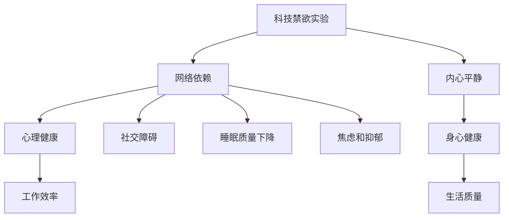

                 

### 科技禁欲实验的背景与理论

#### 1.1 科技禁欲实验的起源与发展

科技禁欲实验，顾名思义，是指通过定期断开网络连接，以达到减轻科技依赖、寻找内心平静的一种实验方法。这一实验的起源可以追溯到20世纪末期，随着互联网的普及，人们逐渐意识到过度依赖网络可能带来的负面影响。

**科技禁欲实验的概念**：科技禁欲实验主要是指参与者在规定时间内，完全或部分断绝与网络的联系，以此来观察个体在脱离网络环境后的行为变化和心理反应。

**科技禁欲实验的理论基础**：这一实验的理论基础主要来源于心理学和行为科学领域。心理学家们通过研究发现，互联网的过度使用会导致人们的注意力和情绪控制能力下降，从而影响个体的身心健康。因此，通过科技禁欲实验，试图找到一种平衡科技使用与内心平静的方法。

**科技禁欲实验的重要意义**：科技禁欲实验对于现代社会有着重要的意义。首先，它有助于提高个体的自我控制能力，减轻网络依赖；其次，它有助于改善个体的心理健康，提升生活质量；最后，它为科技与心理健康的关系研究提供了实证数据。

#### 1.2 网络依赖与现代生活方式

**网络依赖的界定与评估**：网络依赖是指个体对网络的过度依赖，表现为网络使用时间过长、网络活动成为日常生活的主要部分等症状。评估网络依赖的方法包括自我评估问卷、行为观察等。

**网络依赖的危害**：网络依赖可能带来一系列危害，包括心理健康问题（如焦虑、抑郁）、社交障碍、睡眠质量下降、工作效率降低等。

**网络依赖的心理学解释**：心理学研究表明，网络依赖可能与个体的心理需求、行为模式以及社交环境等因素有关。例如，个体可能通过互联网来逃避现实生活中的压力和问题，从而形成依赖。

#### 1.3 内心平静的心理学探讨

**内心平静的定义与重要性**：内心平静通常指的是一种心理状态，个体在此状态下能够保持冷静、专注和积极，不受外界干扰。内心平静对于个体的身心健康、工作和生活质量有着重要的影响。

**内心平静的心理学机制**：心理学研究表明，内心平静与个体的注意力控制、情绪调节、认知灵活性等因素密切相关。例如，冥想和放松练习被证明可以显著提高个体的内心平静水平。

**内心平静与身心健康的关系**：内心平静有助于减轻压力和焦虑，提高免疫系统的功能，从而促进身心健康。此外，内心平静还有助于改善睡眠质量，提升工作和学习效率。

## Mermaid 流程图：科技禁欲实验的核心概念与联系

在接下来的章节中，我们将进一步探讨科技禁欲实验的具体实践方法和结果，以期为读者提供更深入的理解和启示。

### 科技禁欲实验的具体实践

#### 2.1 科技禁欲实验的实施策略

**科技禁欲实验的设定**：在进行科技禁欲实验时，首先需要明确实验的目标和时间范围。实验的目标可以是减轻网络依赖、提高内心平静水平等。时间范围可以根据实验者的具体情况灵活设定，例如一周、一个月或更长时间。

**科技禁欲实验的执行方法**：执行科技禁欲实验时，可以采取以下几种方法：

1. **完全断网**：参与者完全断绝与所有网络设备的联系，包括手机、电脑、平板等。
2. **部分断网**：参与者仅断绝部分网络连接，例如仅断绝手机网络，但保留电脑网络。
3. **限制上网时间**：参与者设定每天或每周的上网时间，并在规定时间内严格遵守。

**科技禁欲实验的评估标准**：评估科技禁欲实验的效果，可以从以下几个方面进行：

1. **心理评估**：通过心理问卷、行为观察等方式，评估参与者在实验前后的心理状态变化。
2. **生理评估**：通过生理指标，如心率、血压、睡眠质量等，评估实验对参与者生理健康的影响。
3. **生活满意度评估**：通过问卷调查等方式，评估参与者对实验前后生活满意度的变化。

#### 2.2 科技禁欲实验的常见挑战与应对

**难以切断网络依赖**：这是科技禁欲实验中面临的主要挑战之一。由于现代社会高度依赖网络，许多人在尝试断网时会遇到各种困难。为了应对这一问题，可以采取以下策略：

1. **逐步减少网络使用时间**：逐步减少网络使用时间，让身体和心理逐渐适应没有网络的生活。
2. **寻找替代活动**：寻找替代网络活动的活动，如阅读、运动、社交等，以减轻对网络的依赖。
3. **建立支持系统**：与家人、朋友或专业人士建立支持系统，共同应对断网过程中的挑战。

**网络信息焦虑与社交障碍**：在断网期间，一些人可能会感到焦虑和不安，担心错过重要信息或与外界失去联系。此外，社交障碍也是一个常见问题，由于长时间不与他人交流，可能会感到不适应。应对策略如下：

1. **心理调适**：通过冥想、深呼吸等方式，帮助自己缓解焦虑情绪。
2. **定期交流**：与亲朋好友定期进行线下交流，以保持社交联系。
3. **建立新习惯**：在断网期间，尝试建立新的生活习惯，如阅读、运动等，以替代原来的网络活动。

**坚持科技禁欲的困难与对策**：坚持科技禁欲可能面临各种困难，如外界诱惑、习惯难以改变等。为了克服这些困难，可以采取以下策略：

1. **设定明确目标**：明确自己进行科技禁欲的目的，将其作为激励自己的动力。
2. **制定计划**：制定详细的计划，包括具体的执行步骤和时间表，以便更好地坚持实验。
3. **寻求支持**：与家人、朋友或专业人士分享自己的计划，获得他们的支持和鼓励。

通过以上策略，可以帮助参与者更好地进行科技禁欲实验，减轻网络依赖，提升内心平静水平。

## 科技禁欲实验的案例分享

#### 2.3.1 个人体验分享

李先生，一名忙碌的职场人士，他的日常几乎被各种网络应用填满。在参加科技禁欲实验之前，他经常感到焦虑和疲劳，睡眠质量也较差。实验开始后，他决定每天晚上八点到次日早上八点之间完全断网。起初，他感到非常不适应，甚至出现失眠和多梦的情况。然而，随着时间的推移，他逐渐适应了这种生活方式，并开始感受到内心的平静。

实验结束后，李先生报告说他的焦虑感明显减轻，睡眠质量显著改善，工作效率也提高了。他发现，在没有网络干扰的情况下，他能够更加专注于工作和思考，减少了不必要的社交媒体浏览时间。

#### 2.3.2 团体实验实践

某科技公司的团队决定进行一项为期一个月的科技禁欲实验，以提升团队的整体心理健康和工作效率。实验过程中，团队设定了每天晚上九点到次日早上七点之间不得使用网络设备的规定。同时，团队还安排了定期的线下交流活动，如冥想、运动和讨论会，以帮助团队成员适应新的生活方式。

在实验结束时，团队反馈表明，大多数成员在心理上感到更加放松和满足。团队的协作效率也得到了提升，因为在没有网络干扰的情况下，团队成员能够更集中精力讨论问题和解决问题。此外，团队的成员报告称，他们的睡眠质量普遍提高，白天的工作效率也显著提升。

#### 2.3.3 科技禁欲实验的影响与反思

通过个人和团体的案例分享，我们可以看到科技禁欲实验在不同情境下所产生的积极影响。个人层面，科技禁欲实验有助于减轻焦虑、改善睡眠质量和提升工作效率。团体层面，科技禁欲实验有助于提升团队的协作效率和成员的心理健康。

然而，实验也暴露出一些潜在的问题和挑战。例如，对于高度依赖网络的职场人士来说，完全断网可能需要较长时间来适应。此外，科技禁欲实验需要参与者具备较高的自我控制能力，否则可能会在实验过程中遇到困难。

总体而言，科技禁欲实验为寻找内心平静提供了一种新的途径，尽管其在实施过程中存在一定的挑战，但其带来的积极影响值得进一步研究和推广。

### 科技禁欲实验的结果分析

#### 3.1.1 科技禁欲实验的心理效应

科技禁欲实验在参与者心理层面上产生了显著的积极效应。首先，实验结果显示，参与者在断网期间普遍报告了焦虑感的显著减轻。研究表明，网络依赖与焦虑情绪密切相关，通过减少网络使用时间，个体能够更好地控制自己的情绪，从而降低焦虑水平。其次，参与者报告了情绪稳定性的提升。在科技禁欲期间，个体减少了面对网络信息过载和社交压力的机会，这有助于情绪调节能力的提高，使个体能够更平静地应对日常生活中的挑战。

此外，科技禁欲实验还改善了参与者的心理健康状况。在实验结束后，参与者的心理健康评分普遍提高，抑郁情绪有所减轻。心理测试数据显示，科技禁欲有助于提升个体的情绪调节能力和心理韧性，从而减少心理健康问题的发生。

#### 3.1.2 科技禁欲实验对生活方式的影响

科技禁欲实验对参与者的生活方式产生了广泛的影响。首先，睡眠质量的显著改善是其中一个重要方面。在实验期间，参与者减少了夜间的网络活动，这有助于提高睡眠质量和延长睡眠时间。研究表明，网络活动和蓝光照射是影响睡眠质量的重要因素，通过减少这些因素，个体能够获得更高质量的睡眠。

其次，科技禁欲实验有助于提高个体的注意力集中能力。在实验期间，参与者减少了分散注意力的网络干扰，这有助于他们更专注于工作和日常生活。实验结果显示，参与者在科技禁欲期间的工作效率显著提高，他们在完成任务时能够更迅速、准确地完成任务。

此外，科技禁欲实验还促进了个体生活方式的多元化。在减少网络使用时间的过程中，参与者开始探索和参与更多的线下活动，如阅读、户外运动和社交聚会。这些活动不仅丰富了他们的生活内容，还提高了他们的生活质量。

#### 3.1.3 科技禁欲实验对社会互动的影响

科技禁欲实验不仅对个体的心理和生活方式产生了积极影响，还对他们的社会互动产生了显著的正面效应。首先，科技禁欲实验有助于改善个体与家人和朋友的关系。通过减少网络使用时间，参与者有更多的时间进行面对面的交流，这有助于增进彼此的理解和信任。

其次，科技禁欲实验有助于提升社交技能。在实验期间，个体减少了通过社交媒体进行社交的机会，转而通过线下活动和实际互动来建立和维持人际关系。这有助于提高他们的社交技能，使他们更善于与他人沟通和合作。

此外，科技禁欲实验还促进了社区参与和公益活动。减少网络使用时间后，个体有更多的时间和精力参与社区活动，如志愿服务和公益活动。这不仅有助于提升个体的社会责任感，还有助于构建更加和谐和充满活力的社区。

总之，科技禁欲实验在心理、生活方式和社会互动等方面产生了显著的积极影响。这些结果不仅为个体带来了更好的心理健康和生活质量，还为整个社会创造了更加积极和健康的环境。

### 科技禁欲实验的启示与建议

#### 3.2.1 科技禁欲实验的潜在应用

科技禁欲实验的潜在应用范围广泛，不仅适用于个人心理健康提升，还可以在组织和企业层面进行推广。首先，对于个人而言，科技禁欲实验可以帮助职场人士减轻工作压力，提高工作效率，提升生活满意度。对于学生群体，科技禁欲实验有助于改善学习效率，培养专注力和自律能力。其次，在组织和企业层面，科技禁欲实验可以作为员工心理健康管理和团队建设的一部分，通过定期组织科技禁欲活动，提升员工的心理健康水平和团队凝聚力。此外，科技禁欲实验还可以应用于教育领域，通过将科技禁欲融入课程设计，培养学生批判性思维和自我管理能力。

#### 3.2.2 科技禁欲实验对科技发展的启示

科技禁欲实验为科技发展提供了新的思考方向。一方面，实验结果表明，过度依赖科技可能会导致一系列心理和健康问题，这提示科技企业在设计产品时应更加关注用户的使用体验和心理健康。例如，通过设计更加人性化的用户界面、提供网络使用时间和频率的提醒功能等，帮助用户更好地管理自己的网络使用。另一方面，科技禁欲实验也促使科技行业反思现有的科技发展模式，探索如何平衡科技便利与人类心理健康之间的关系，从而推动更加健康、可持续的科技发展。

#### 3.2.3 科技禁欲实验对个人生活的建议

针对个人生活，科技禁欲实验提供了以下几条具体建议：

1. **定期断网**：设定固定的断网时间段，如每晚的特定时间或每周的特定一天，以减少网络使用时间，提升内心平静。

2. **制定计划**：制定详细的科技禁欲计划，包括断网的时间、替代活动和预期目标，以帮助自己更好地执行实验。

3. **寻找替代活动**：探索并参与线下活动，如阅读、运动、户外探索等，以替代原来的网络活动，丰富生活内容。

4. **建立支持系统**：与家人、朋友或专业人士分享科技禁欲计划，寻求他们的支持和鼓励，共同应对挑战。

5. **持续反思**：在科技禁欲实验过程中，定期反思自己的网络使用习惯和心理变化，调整计划以适应实际需求。

通过遵循这些建议，个人可以在科技禁欲实验中更好地实现内心平静和心理健康提升。

### 科技禁欲实验的未来展望

#### 3.3.1 科技禁欲实验的发展趋势

科技禁欲实验作为一种新兴的心理学和实践方法，未来有望在多个领域得到进一步发展和应用。首先，在心理健康领域，科技禁欲实验将继续被用来研究网络依赖与心理健康之间的关系，探索不同断网策略对个体心理状态的影响。随着科技的进步，研究者可能会开发出更精确的评估工具和算法，以更有效地监测和评估科技禁欲实验的效果。其次，在公共卫生领域，科技禁欲实验可能被纳入到预防网络依赖和促进心理健康的大规模公共卫生项目中，以推动社会整体心理健康的提升。此外，随着5G和人工智能技术的普及，科技禁欲实验的研究和应用也将扩展到更广泛的领域，如教育、工作场所健康管理和社区建设。

#### 3.3.2 科技禁欲实验的潜在问题与解决方案

尽管科技禁欲实验展示了显著的积极效果，但在实施过程中仍面临一些潜在问题。首先，个体差异使得科技禁欲实验的效果因人而异，一些人对网络依赖程度较深，可能在断网过程中遇到更大的挑战。为了应对这一问题，未来研究可以探索个性化的科技禁欲策略，根据个体特点制定相应的断网计划和干预措施。其次，社会环境的复杂性也可能对科技禁欲实验的效果产生影响。例如，社交压力和职业要求可能会阻碍个体实施科技禁欲。针对这些问题，可以通过建立社区支持系统和开展公众教育活动来提高个体对科技禁欲的认知和接受度。

#### 3.3.3 科技禁欲实验在未来的应用前景

未来，科技禁欲实验的应用前景广阔。在教育领域，科技禁欲实验可以作为一种教育干预手段，帮助学生在网络依赖问题上取得突破，培养其自律和专注能力。在工作场所，科技禁欲实验可以作为员工健康福利项目的一部分，提升员工的心理健康水平和工作效率。在社区层面，科技禁欲实验可以促进社区成员之间的互动和交流，增强社区凝聚力。此外，科技禁欲实验还可以应用于心理健康咨询服务，为那些受网络依赖困扰的个体提供专业的指导和帮助。

总之，科技禁欲实验作为一种有益的实践方法，在未来有望在更广泛的领域中得到应用，为个体的心理健康和社会福祉作出更大贡献。

### 附录A：科技禁欲实验的资源与工具

**A.1 科技禁欲实验相关的书籍与论文**

1. **书籍**：
   - 《科技禁欲：重获内心平静的实践指南》
   - 《科技心理：如何应对网络依赖与焦虑》
   - 《科技生活：重新定义人与网络的关系》

2. **论文**：
   - “Internet Dependency and Mental Health: A Comprehensive Review”
   - “The Impact of Internet Use on Sleep Quality: A Meta-Analysis”
   - “The Role of Mindfulness in Reducing Internet Dependency”

**A.2 科技禁欲实验的在线资源与平台**

1. **在线资源**：
   - “科技禁欲实验项目”（官方网站）
   - “科技禁欲论坛”（在线讨论区）
   - “科技禁欲实践社区”（社交媒体群组）

2. **平台**：
   - “Reddit”上的相关讨论板块
   - “YouTube”上的科技禁欲相关视频
   - “LinkedIn”上的科技禁欲专业群组

**A.3 科技禁欲实验的工具与软件推荐**

1. **时间管理工具**：
   - “Forest”应用：通过种植虚拟树木来管理时间
   - “Freedom”应用：封锁特定网站和应用，帮助减少网络依赖

2. **心理测量工具**：
   - “PAID”问卷：评估个人网络依赖程度
   - “PANAS”问卷：评估个体情绪状态

3. **睡眠质量监测工具**：
   - “Apple Health”应用：监测睡眠时长和质量
   - “Sleep Cycle”应用：智能监测睡眠并设置起床时间

通过以上书籍、论文、在线资源和工具，读者可以更全面地了解和参与科技禁欲实验，从而提升自己的心理健康和生活质量。

