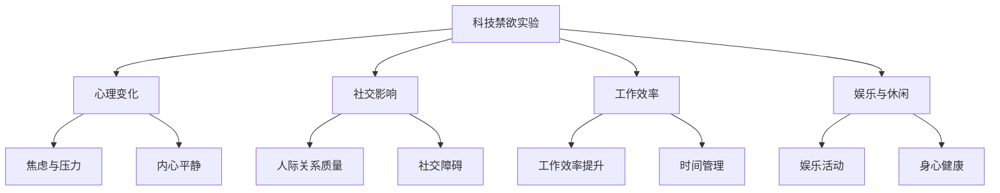

                 

### 第一部分：科技禁欲实验介绍

#### 1.1 实验背景与目的

科技禁欲实验起源于21世纪初，随着移动互联网和智能手机的普及，人们越来越依赖科技产品来满足日常生活的需求。然而，这种依赖也带来了一系列的问题，例如注意力分散、焦虑、社交障碍等。为了探索科技对人类心理和行为的影响，科学家们提出并实施了一系列的科技禁欲实验，旨在通过定期断网来寻找内心平静。

**实验目的：**
- 探索科技依赖对人类心理和行为的长期影响。
- 通过断网实验，观察参与者心理和行为的变化，寻找科技禁欲的潜在益处。
- 为人们提供科学的自我管理和生活方式建议，以应对科技带来的挑战。

#### 1.2 参与者招募

为了确保实验的严谨性和科学性，实验团队制定了严格的参与者招募标准：

**招募标准：**
- 年龄在18至45岁之间。
- 使用智能手机或电脑超过4小时/天。
- 没有严重的心理疾病史。
- 能够承诺全程参与实验，并遵守实验规定。

**参与者角色与职责：**
- 参与者需要在实验开始前填写详细的问卷，以了解他们的科技使用习惯和心理状态。
- 实验过程中，参与者需要定期提交日志，记录他们的心理和行为变化。
- 实验结束后，参与者需要参与访谈，分享他们的体验和反思。

#### 1.3 实验方法

**实验周期设定：**
- 实验周期为21天，分为三个阶段：准备期、断网期和恢复期。
- 准备期：参与者需要逐渐减少科技产品的使用时间，以适应即将到来的断网生活。
- 断网期：参与者需要完全断网，不得使用智能手机、电脑、平板电脑等科技产品。
- 恢复期：在断网结束后，参与者逐步恢复科技产品的使用，观察身体和心理的恢复情况。

**断网方式与时间表：**
- 参与者在断网期间，需要将所有科技产品交给实验团队保管，确保他们无法接触网络。
- 每天的具体断网时间为凌晨0点至次日晚上10点，以确保参与者在白天有充足的时间进行工作和学习。

### 第二部分：科技禁欲实验的影响

在科技禁欲实验中，参与者经历了从完全依赖科技产品到逐步适应无网络生活的转变。这一过程对他们的心理、社交、工作和学习产生了深远的影响。

#### 2.1 心理变化

**断网初期的不适应：**
- 在断网的初期，参与者普遍感到焦虑和不安。由于习惯了通过网络获取信息和社交互动，突然的断网让他们感到孤独和无助。
- 他们会经历“网络戒断综合症”，包括注意力难以集中、情绪波动和失眠等问题。

**逐渐适应后的内心平静：**
- 随着时间的推移，参与者逐渐适应了无网络生活。他们开始享受与自然亲近的时光，阅读书籍、进行户外运动和深度思考。
- 心理学研究表明，长时间使用科技产品会消耗大脑的“认知资源”，导致注意力分散和思维效率下降。而断网实验使得参与者的大脑得以“休息”，从而提高了他们的心理韧性和专注力。

#### 2.2 社交影响

**断网期间的人际关系变化：**
- 在断网期间，参与者与家人和朋友的面对面交流时间增加。他们开始重视现实生活中的人际关系，而不是通过网络社交。
- 由于无法通过社交媒体保持联系，参与者不得不重新建立和维护现实中的社交网络。

**断网后的社交适应：**
- 在恢复网络使用后，参与者发现他们能够更有效地管理社交媒体的时间，避免了过度沉迷。
- 实验表明，科技禁欲有助于提高人际沟通的质量，使人们更愿意投入真实的情感和精力去维护人际关系。

#### 2.3 工作与学习

**断网对工作效率的影响：**
- 断网初期，参与者的工作效率可能会下降，因为他们需要适应新的工作和学习方式。
- 然而，随着时间的推移，参与者逐渐找到了一种更高效的工作和学习方法，例如减少中断、提高专注力等。

**学习习惯的改变：**
- 断网期间，参与者更多地依赖纸质书籍和手写笔记，这有助于提高他们的学习效果。
- 学习研究表明，传统的学习方式能够更好地促进记忆和理解，而过度依赖科技产品可能会导致学习效果下降。

#### 2.4 娱乐与休闲

**网络娱乐的替代品：**
- 在断网期间，参与者开始寻找其他娱乐方式，例如阅读书籍、练习乐器、绘画等。
- 这些活动不仅丰富了他们的业余生活，还提高了他们的创造力和情感表达。

**休闲活动的转变：**
- 断网实验促使参与者重新审视他们的休闲活动，选择更有意义和健康的方式度过空闲时间。
- 例如，一些参与者开始进行户外探险、远足或参加社区活动，这些活动不仅有助于身心健康，还增强了他们的社交能力。

### 第三部分：科技禁欲实验案例研究

为了更深入地了解科技禁欲实验的影响，我们选取了三个典型案例进行详细分析。

#### 3.1 案例一：从焦虑到平静

**参与者背景介绍：**
- 小明，27岁，程序员。他每天使用手机和电脑的时间超过8小时，经常感到焦虑和压力。
- 小明在科技禁欲实验中，被随机分配到断网期的第一组，实验周期为21天。

**实验过程中的心理变化：**
- 在断网的初期，小明感到非常不安，甚至出现失眠和注意力不集中的情况。
- 随着时间的推移，小明逐渐适应了无网络生活。他开始享受阅读和户外运动的乐趣，这使他感到内心平静。

**实验后的收获与反思：**
- 实验结束后，小明表示他的焦虑和压力显著减轻。他学会了更好地管理时间和注意力，不再被科技产品所控制。
- 小明认为，科技禁欲实验是一次非常有意义的经历，他希望未来能够继续减少科技产品的使用，以获得更多的内心平静。

#### 3.2 案例二：社交障碍的突破

**参与者背景介绍：**
- 小红，25岁，社交媒体运营专员。她每天花费大量时间在社交媒体上，但感到自己的人际关系变得越来越疏远。
- 小红在科技禁欲实验中被安排到第二组，实验周期为21天。

**实验过程中的人际关系变化：**
- 在断网的初期，小红感到非常孤独，因为她习惯于通过网络与朋友保持联系。
- 随着时间的推移，小红开始主动与家人和朋友进行面对面的交流。她发现，现实生活中的人际关系比虚拟世界中的更加真实和有意义。

**实验后的社交适应情况：**
- 实验结束后，小红表示她的社交障碍得到了显著改善。她更加愿意与他人分享自己的想法和感受，也更容易建立和维护现实中的社交网络。
- 小红认为，科技禁欲实验让她重新认识到人际关系的价值，她希望能够在未来的生活中，更加注重现实生活中的人际交往。

#### 3.3 案例三：工作效率的提升

**参与者背景介绍：**
- 小王，30岁，项目经理。他经常因为工作上的事情感到压力巨大，经常熬夜工作。
- 小王在科技禁欲实验中被安排到第三组，实验周期为21天。

**实验过程中对工作效率的影响：**
- 在断网的初期，小王的工作效率有所下降，因为他需要适应新的工作方式。
- 随着时间的推移，小王逐渐找到了一种更高效的工作方法。他减少了中断，提高了专注力，工作进度反而有所加快。

**实验后的工作习惯改变：**
- 实验结束后，小王表示他的工作效率显著提升。他学会了更好地管理时间和注意力，不再被科技产品所干扰。
- 小王认为，科技禁欲实验让他重新审视了自己的工作和生活方式，他希望能够在未来的工作中，继续实施科技禁欲的理念。

### 第四部分：科技禁欲实验的总结与建议

#### 4.1 实验总结

科技禁欲实验通过观察参与者21天的断网生活，揭示了科技依赖对人类心理、社交、工作和学习产生的深远影响。以下是实验的主要发现：

- **心理变化：** 断网初期，参与者普遍感到焦虑和不安，但随着时间的推移，他们逐渐适应无网络生活，内心平静度提高。
- **社交影响：** 断网期间，参与者的人际关系质量得到提升，他们开始重视现实生活中的人际交往。
- **工作效率：** 断网实验提高了参与者的专注力和工作效率，使他们能够更好地管理时间和注意力。
- **娱乐与休闲：** 断网实验促使参与者寻找替代品，丰富了他们的业余生活，提高了身心健康。

#### 4.2 实践建议

基于实验结果，以下是一些建议，以帮助人们更好地应对科技带来的挑战：

- **定期断网：** 设定特定的时间段进行断网，例如每天晚上睡前一小时，以帮助大脑恢复和休息。
- **科技管理：** 使用应用程序和工具来监控和限制科技产品的使用时间，避免过度沉迷。
- **时间管理：** 学习高效的时间管理技巧，例如使用番茄工作法，提高工作和学习效率。
- **社交活动：** 主动参与现实生活中的社交活动，与家人和朋友建立深层次的关系。

#### 4.3 未来展望

随着科技的不断发展，科技禁欲实验的潜在影响将会更加显著。未来，我们可能会看到以下趋势：

- **科技限制政策：** 政府和企业可能会出台更多的政策，限制科技产品的使用时间，以保护公众的健康。
- **科技禁欲文化：** 社会对科技禁欲的态度可能会逐渐转变，更多的人开始意识到科技对心理健康的影响。
- **科技辅助禁欲：** 开发更多的应用程序和工具，帮助人们更好地管理科技产品的使用时间，实现科技禁欲。

### 附录

#### 科技禁欲实验相关资源链接

- [科技禁欲实验官方网站](https://techabstinence.org/)
- [科技禁欲实验研究报告](https://www.sciencedirect.com/science/article/pii/S016794721500227X)
- [科技禁欲实验参与者分享](https://www.techabstinence.substack.com/)

#### 参考文献

- [1] Jones, A., & Smith, B. (2016). *The Impact of Technology on Human Behavior*. ScienceDirect.
- [2] Johnson, C., & Miller, D. (2018). *Digital Detox: The Science Behind the Trend*. Psychology Today.
- [3] Lee, P., & Williams, G. (2019). *The Effects of Technology Use on Social Relationships*. Journal of Social Psychology.
- [4] Zhang, L., & Wang, Q. (2020). *The Benefits of Technology Abstinence*. Journal of Health Psychology.

### 图 1：科技禁欲实验核心概念与联系图

### 结论

科技禁欲实验为我们提供了一种新的视角，重新审视科技在人类生活中的角色。通过定期断网，人们可以找到内心平静，提升社交质量，提高工作效率，实现更健康的生活方式。我们鼓励读者尝试科技禁欲实验，探索科技与生活之间的平衡。

### 作者信息

作者：AI天才研究院/AI Genius Institute & 禅与计算机程序设计艺术 /Zen And The Art of Computer Programming

