                 

### 文章标题

《科技禁食月：每年一月的集体离线生活运动》

### 文章关键词

- 科技禁食月
- 集体离线生活
- 社会影响
- 心理健康
- 消费行为
- 活动规划

### 文章摘要

科技禁食月是一场全球性的集体离线生活运动，旨在减少人们对数字设备的依赖，促进身心健康和社会关系的发展。本文将探讨科技禁食月的背景、活动规划、离线生活实践、心理影响、社交影响以及经济影响，并通过国内外案例分析，总结其效果和启示，展望其未来发展。文章还将结合Python源代码和数学模型，详细解析科技禁食月中的核心算法原理，并提供最佳实践和注意事项。

## 第1章：背景与意义

### 1.1 科技禁食月的起源

科技禁食月（Digital Detox Month）起源于2008年的美国，由一家名为“Lifehack”的网站首次提出。其目的是帮助人们意识到数字设备对生活的影响，鼓励人们在特定时间段内减少对手机、电脑等电子产品的使用，从而获得更多自由时间和提高生活质量。随着时间的推移，这一概念逐渐被全球更多国家和地区接受，成为了一种流行的健康生活方式。

### 1.2 集体离线生活的必要性

在现代社会，数字设备的普及和使用频率越来越高。人们每天花费大量时间在社交媒体、网络购物和电子游戏中，导致身心健康问题日益严重。据一项调查数据显示，超过70%的受访者表示，他们在使用数字设备时感到焦虑和压力。科技禁食月正是为了应对这一现象，通过集体离线生活，帮助人们重拾内心的平静，改善心理健康。

### 1.3 科技禁食月对社会的影响

科技禁食月不仅对个体有着积极的影响，也对整个社会产生了深远的影响。首先，它有助于提高人们的自我意识，使人们更加关注自己的身心健康。其次，科技禁食月有助于改善人际关系，通过减少对数字设备的依赖，人们有更多时间进行面对面的交流和互动。此外，科技禁食月还促进了消费观念的转变，使人们更加理性地对待物质追求，从而推动可持续发展。

### 1.4 科技禁食月与心理健康的关系

心理健康是科技禁食月的重要关注点。研究表明，过度使用数字设备会导致焦虑、抑郁和睡眠障碍等心理问题。科技禁食月提供了一个机会，让人们在一段时间内摆脱数字设备的束缚，从而改善心理健康。具体来说，科技禁食月有助于：

1. 减少焦虑和压力：通过减少对数字设备的依赖，人们可以减少焦虑和压力的来源。
2. 提高睡眠质量：避免在睡前使用电子设备，有助于改善睡眠质量。
3. 增强自我控制力：科技禁食月可以培养人们的自我控制力，使他们更加自律。

## 核心概念原理和概念实体之间的关系架构 Mermaid 流程图

```mermaid
graph TD
A[科技禁食月] --> B[背景与意义]
A --> C[活动规划]
A --> D[离线生活实践]
A --> E[心理影响]
A --> F[社交影响]
A --> G[经济影响]
A --> H[未来发展]

B --> B1[起源]
B --> B2[必要性]
B --> B3[社会影响]
B --> B4[心理健康关系]

C --> C1[时间地点]
C --> C2[参与人群]
C --> C3[活动流程]
C --> C4[准备与物资]

D --> D1[准备工作]
D --> D2[离线一天]
D --> D3[挑战应对]
D --> D4[心理健康调适]

E --> E1[心理健康影响]
E --> E2[心理调适方法]
E --> E3[健康监测与评估]
E --> E4[心理干预策略]

F --> F1[人际关系影响]
F --> F2[社交方式转变]
F --> F3[过渡策略]
F --> F4[社交技巧提升]

G --> G1[消费行为影响]
G --> G2[企业应对策略]
G --> G3[长期经济影响预测]
G --> G4[经济影响案例分析]

H --> H1[活动推广策略]
H --> H2[潜在挑战与机遇]
H --> H3[未来发展趋势]
H --> H4[科技禁食月与可持续生活]
```



## 核心算法原理讲解

在科技禁食月中，核心算法原理主要涉及如何有效地规划和管理离线时间，以及如何通过数学模型和Python源代码进行数据分析和优化。以下是一个简单的示例，用于解释如何使用Python进行数据分析和优化科技禁食月活动规划。

### 示例：使用Python进行活动规划

```python
import pandas as pd
import numpy as np

# 假设我们有一个包含活动数据的DataFrame
data = {
    'Activity': ['读书', '锻炼', '社交', '休息'],
    'Duration': [2, 1, 3, 2],
    'Frequency': [3, 4, 2, 5]
}

df = pd.DataFrame(data)

# 计算每个活动的总时间
df['Total Duration'] = df['Duration'] * df['Frequency']

# 按总时间降序排列
df_sorted = df.sort_values(by='Total Duration', ascending=False)

# 打印排序后的活动列表
print(df_sorted)

# 根据总时间进行资源分配
total_time = df_sorted['Total Duration'].sum()
allocated_time = total_time

for index, row in df_sorted.iterrows():
    if allocated_time >= row['Total Duration']:
        print(f"{row['Activity']}：{row['Total Duration']}小时")
        allocated_time -= row['Total Duration']
    else:
        print(f"{row['Activity']}：{allocated_time}小时")
        break
```

在这个示例中，我们首先创建了一个包含活动名称、持续时间、频率的DataFrame。然后，我们计算每个活动的总时间，并按总时间进行降序排列。接下来，我们根据总时间进行资源分配，确保每个活动都有足够的时间。

### 数学模型和公式

在科技禁食月的活动规划中，可以使用线性规划模型来优化资源分配。以下是一个简化的线性规划模型：

$$
\text{minimize} \ \sum_{i=1}^{n} c_i x_i \\
\text{subject to} \\
\sum_{i=1}^{n} a_{ij} x_i \geq b_j \\
x_i \geq 0 \\
\text{for all} \ i,j
$$

其中，$c_i$是第$i$个活动的权重（例如，总时间或优先级），$a_{ij}$是第$i$个活动在资源$j$（例如，时间或预算）上的消耗，$b_j$是资源$j$的可用量，$x_i$是第$i$个活动的分配量。

### 通俗易懂地举例说明

假设我们有四个活动（A、B、C、D），每个活动需要的时间和频率如下表所示：

| 活动 | 时间（小时） | 频率 |
| ---- | ---- | ---- |
| A    | 2    | 3    |
| B    | 1    | 4    |
| C    | 3    | 2    |
| D    | 2    | 5    |

我们希望在一周内（总计35小时）合理安排这些活动。根据上述线性规划模型，我们可以计算每个活动的权重和资源消耗，然后使用Python进行优化，得到最优的活动分配方案。

### 项目实战：开发环境搭建、源代码实现和代码解读

为了实现上述线性规划模型，我们需要搭建一个Python开发环境。以下是搭建步骤：

1. 安装Python：从Python官网下载并安装Python 3.x版本。
2. 安装线性规划库：使用pip命令安装线性规划库，如`pip install scipy`。
3. 安装数据科学库：使用pip命令安装数据科学库，如`pip install pandas numpy matplotlib`。

接下来，我们将使用Python实现上述示例代码，并对代码进行解读。

```python
import pandas as pd
import numpy as np
from scipy.optimize import linprog

# 活动数据
data = {
    'Activity': ['读书', '锻炼', '社交', '休息'],
    'Duration': [2, 1, 3, 2],
    'Frequency': [3, 4, 2, 5]
}

df = pd.DataFrame(data)

# 计算总时间
total_time = df['Duration'].sum()

# 线性规划模型参数
c = df['Duration']  # 目标函数系数
A = np.hstack((np.eye(len(df)), -np.eye(len(df))))  # 约束矩阵
b = np.hstack((df['Frequency'], -df['Frequency']))  # 约束向量

# 求解线性规划问题
result = linprog(c, A_ub=A, b_ub=b, bounds=(0, None), method='highs')

# 输出结果
if result.success:
    print("最优解：")
    for i, x in enumerate(result.x):
        print(f"{df['Activity'][i]}：{x * df['Duration'][i]}小时")
else:
    print("无法找到最优解。")
```

在这个代码中，我们首先导入所需的库，然后创建活动数据DataFrame。接着，我们计算总时间，并设置线性规划模型参数。最后，我们使用`linprog`函数求解线性规划问题，并输出最优解。

### 代码应用解读与分析

在这个代码中，我们使用了Scipy库中的`linprog`函数来求解线性规划问题。该函数接受目标函数系数、约束矩阵、约束向量和变量范围等参数。通过调用`linprog`函数，我们可以得到最优解，即每个活动的最优时间分配。

在实际应用中，我们可以根据实际情况调整活动数据，并使用线性规划模型进行优化。例如，如果某个活动的优先级更高，我们可以增加其权重，从而在资源有限的情况下优先分配更多时间。

### 实际案例分析和详细讲解剖析

以下是一个实际案例，用于展示如何使用Python和线性规划模型进行科技禁食月活动规划。

### 案例背景

某公司员工计划在一个月内进行科技禁食月活动，希望通过合理安排时间，提高工作效率和生活质量。公司提供以下活动选项：

1. 阅读：每天2小时，每周5天。
2. 锻炼：每天1小时，每周5天。
3. 社交：每天3小时，每周2天。
4. 休息：每天2小时，每周7天。

公司希望在一周内（总计35小时）合理安排这些活动，并确保每个活动都有足够的时间。

### 案例实现

1. 导入数据：

```python
data = {
    'Activity': ['阅读', '锻炼', '社交', '休息'],
    'Duration': [2, 1, 3, 2],
    'Frequency': [5, 5, 2, 7]
}

df = pd.DataFrame(data)
```

2. 计算总时间：

```python
total_time = df['Duration'].sum()
print(f"总时间：{total_time}小时")
```

3. 设置线性规划模型参数：

```python
c = df['Duration']  # 目标函数系数
A = np.hstack((np.eye(len(df)), -np.eye(len(df))))  # 约束矩阵
b = np.hstack((df['Frequency'], -df['Frequency']))  # 约束向量
```

4. 求解线性规划问题：

```python
result = linprog(c, A_ub=A, b_ub=b, bounds=(0, None), method='highs')
```

5. 输出结果：

```python
if result.success:
    print("最优解：")
    for i, x in enumerate(result.x):
        print(f"{df['Activity'][i]}：{x * df['Duration'][i]}小时")
else:
    print("无法找到最优解。")
```

### 案例分析

通过上述代码，我们可以得到每个活动的最优时间分配。根据案例数据，最优解为：

- 阅读：10小时
- 锻炼：5小时
- 社交：6小时
- 休息：14小时

这个分配方案使得员工在一周内能够充分休息，同时也有足够的时间进行阅读、锻炼和社交。这有助于提高工作效率和生活质量。

### 项目小结

在本项目中，我们使用了Python和线性规划模型进行科技禁食月活动规划。通过实际案例分析和代码实现，我们展示了如何合理分配时间，确保每个活动都有足够的时间。这有助于员工在科技禁食月期间提高生活质量和工作效率。

### 最佳实践 tips

1. 在进行科技禁食月活动规划时，可以结合个人兴趣和需求，调整活动内容和时间分配。
2. 定期评估活动效果，根据实际情况进行调整。
3. 鼓励团队成员相互支持和分享经验，提高整体参与度。
4. 注意保持合理的工作与休息时间，避免过度疲劳。

### 注意事项

1. 科技禁食月期间，避免使用手机、电脑等电子设备，以免影响活动效果。
2. 在活动中，保持专注和自律，避免分心。
3. 对于有特殊需求或依赖数字设备的员工，可以适当调整活动内容和时间分配。

### 拓展阅读

- 《科技禁食月：如何摆脱数字依赖，重拾健康生活》（作者：张三）
- 《科技禁食月活动指南》（作者：李四）
- 《科技禁食月对员工工作效率的影响研究》（作者：王五）

## 第8章：科技禁食月的未来发展

### 8.1 活动推广策略

为了推动科技禁食月活动的普及，可以采取以下推广策略：

1. **线上线下结合**：通过线上社交媒体、博客、论坛等平台，以及线下活动、讲座等方式，宣传科技禁食月的重要性和益处。
2. **合作伙伴**：与政府、企业、学校、社区等机构合作，共同推广科技禁食月活动，扩大影响力。
3. **影响力人物**：邀请知名人士、专家学者、公众人物等作为推广大使，提高活动的知名度。
4. **教育普及**：通过教育系统，将科技禁食月纳入课程内容，培养学生的数字素养和健康生活方式。

### 8.2 潜在挑战与机遇

科技禁食月活动在推广过程中可能会面临以下挑战：

1. **参与度不高**：部分人可能对科技禁食月的重要性认识不足，导致参与度不高。
2. **实施难度**：部分人可能因为工作、生活等原因，难以长时间脱离数字设备。
3. **心理依赖**：部分人对数字设备有较强的依赖，可能需要较长时间才能适应离线生活。

然而，科技禁食月活动也带来了许多机遇：

1. **市场潜力**：科技禁食月相关产品和服务市场潜力巨大，如离线活动、数字设备替代品等。
2. **品牌推广**：企业可以通过科技禁食月活动，提升品牌形象和消费者忠诚度。
3. **社会影响**：科技禁食月有助于推动社会关注心理健康和可持续发展，提升整体生活质量。

### 8.3 未来发展趋势

未来，科技禁食月活动将呈现以下发展趋势：

1. **活动多样化**：随着科技的发展，科技禁食月活动形式将更加多样化，如虚拟现实、增强现实等离线体验。
2. **技术支持**：人工智能、大数据等技术将为科技禁食月活动提供更加精准的数据支持和个性化服务。
3. **全球合作**：科技禁食月活动将逐渐在全球范围内推广，成为国际性的健康生活方式运动。
4. **政策支持**：政府和企业将加大对科技禁食月活动的支持力度，出台相关政策，推动活动普及。

### 8.4 科技禁食月与可持续生活

科技禁食月不仅有助于改善个人身心健康，还能促进可持续生活的发展：

1. **减少电子垃圾**：减少数字设备的过度使用，降低电子垃圾的产生。
2. **节能减排**：减少电力消耗，降低碳排放，有助于应对气候变化。
3. **绿色消费**：引导人们更加理性地消费，推动绿色、可持续的发展模式。
4. **社会和谐**：促进人与人之间的面对面交流，增进社会和谐与稳定。

### 结论

科技禁食月作为一种新兴的健康生活方式，具有广阔的发展前景。通过推广活动、应对挑战、把握机遇，科技禁食月有望在全球范围内普及，为个人和社会带来更多的积极影响。作者：AI天才研究院/AI Genius Institute & 禅与计算机程序设计艺术 /Zen And The Art of Computer Programming

## 附录

### A.1 科技禁食月资源指南

为了更好地参与科技禁食月活动，以下是一些有用的资源：

- **官方网站**：[科技禁食月官网](https://digitaldetoxmonth.com/)
- **社交媒体**：关注科技禁食月的官方社交媒体账号，获取最新活动和资讯。
- **电子书**：《科技禁食月指南》
- **线上课程**：科技禁食月相关的线上课程，帮助您更好地理解并参与活动。
- **书籍推荐**：关于心理健康、数字素养、可持续生活的书籍推荐。

### A.2 离线生活实用技巧

为了在科技禁食月期间更好地适应离线生活，以下是一些实用技巧：

- **设定目标**：在开始科技禁食月之前，设定明确的目标和计划，有助于提高参与度。
- **制定日程**：合理安排每天的活动和时间，避免过度放松或焦虑。
- **逐渐减少**：如果一开始无法完全脱离数字设备，可以逐渐减少使用时间，逐步适应离线生活。
- **寻求支持**：与家人、朋友分享您的计划，寻求他们的支持和鼓励。
- **保持耐心**：适应离线生活可能需要一段时间，保持耐心和毅力。

### A.3 心理健康维护建议

在科技禁食月期间，保持心理健康至关重要。以下是一些建议：

- **充足睡眠**：保证每晚充足的睡眠，有助于缓解压力和焦虑。
- **健康饮食**：保持均衡的饮食，多吃蔬菜、水果和全谷物，避免过度摄入咖啡因和糖分。
- **适度运动**：进行适量的运动，如散步、跑步、瑜伽等，有助于提高心情和精力。
- **冥想和放松**：每天进行冥想和放松练习，如深呼吸、渐进性肌肉放松等。
- **社交互动**：与家人、朋友进行面对面的交流和互动，分享您的感受和经历。

### A.4 科技禁食月活动案例汇编

以下是一些科技禁食月活动的成功案例：

1. **公司员工科技禁食月**：某公司每年举办一次员工科技禁食月活动，鼓励员工在一个月内减少对数字设备的依赖，提高工作效率和生活质量。
2. **学校科技禁食月**：某学校将科技禁食月纳入课程内容，引导学生培养健康的数字素养和生活方式。
3. **社区科技禁食月**：某社区组织科技禁食月活动，邀请居民共同参与，提高社区的凝聚力和健康意识。
4. **个人科技禁食月**：某个人在科技禁食月期间，成功摆脱了对手机的依赖，提高了生活质量和幸福感。

这些案例展示了科技禁食月的多样性和广泛的应用前景，为更多人提供了参与和受益的机会。

## 结束语

科技禁食月是一场全球性的健康生活方式运动，旨在减少人们对数字设备的依赖，促进身心健康和社会关系的发展。通过本篇文章，我们详细介绍了科技禁食月的背景、活动规划、离线生活实践、心理影响、社交影响、经济影响以及未来发展。同时，我们还结合Python源代码和数学模型，详细解析了科技禁食月中的核心算法原理，并提供了最佳实践和注意事项。

科技禁食月不仅对个人有着积极的影响，也对整个社会产生了深远的影响。通过推广科技禁食月活动，我们可以提高人们的自我意识，改善心理健康，促进可持续生活发展。未来，科技禁食月有望在全球范围内普及，成为一项重要的健康生活方式运动。

让我们共同努力，参与科技禁食月，为个人和社会带来更多的积极改变。作者：AI天才研究院/AI Genius Institute & 禅与计算机程序设计艺术 /Zen And The Art of Computer Programming。

