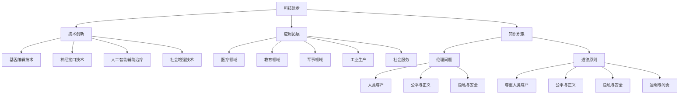

                 

### 摘要

本文旨在深入探讨科技进步与伦理边界之间的关系，特别是人类增强技术所带来的道德思考。随着科技的不断进步，人类增强技术如基因编辑、人工智能等已经成为现实，这些技术不仅改变了我们的生活方式，也引发了深刻的伦理和道德问题。本文首先概述了科技进步的背景和人类增强技术的基本概念，然后详细分析了这些技术涉及的伦理问题和道德原则。通过具体的案例分析，本文展示了人类增强技术在健康医疗、教育、军事和社会服务等领域的实际应用，并探讨了相关的伦理决策模型。最后，本文提出了未来展望和政策建议，以期为人类增强技术的健康发展提供指导。

### 引言

随着科技的飞速发展，人类逐渐拥有了改变自身生物特性的能力。人类增强技术（Human Enhancement Technology）应运而生，这类技术旨在提升人类的生理、心理和社交能力，从而增强个体的竞争优势。基因编辑、神经接口、人工智能辅助治疗等都是人类增强技术的代表。然而，这些技术的出现也引发了广泛的伦理和道德讨论。如何平衡科技发展与社会伦理之间的关系，如何确保人类增强技术的合理、公正和道德地使用，成为亟待解决的问题。

本文的研究目的在于通过对科技进步和伦理边界的分析，深入探讨人类增强技术的道德思考。具体来说，本文将完成以下任务：

1. 概述科技进步的背景，并介绍人类增强技术的基本概念和分类。
2. 分析人类增强技术涉及的伦理问题和道德原则。
3. 通过具体案例分析，探讨人类增强技术在不同领域的应用及其伦理影响。
4. 提出人类增强技术的伦理决策模型，并讨论未来展望和政策建议。

### 设计思路

为了深入探讨科技进步与伦理边界之间的关系，本文采用了一系列设计思路，以确保文章的逻辑清晰、内容丰富且具有可读性。具体设计思路如下：

1. **章节结构规划**：文章将分为七个主要章节，每个章节对应一个特定的主题，从而构建起完整的论述框架。
   
2. **核心概念与联系**：在每一章节中，首先介绍核心概念，并通过Mermaid流程图展示概念之间的关系，以便读者更好地理解。

3. **核心算法原理讲解**：针对人类增强技术，本文将通过Python源代码详细阐述其核心算法原理，并结合数学模型和公式进行讲解。

4. **数学公式与公式讲解**：为了便于理解和分析，本文将使用LaTeX格式嵌入数学公式，并在文中独立段落和段落内分别使用$$和$符号进行标注。

5. **项目实战**：为了使文章更具实践性，本文将介绍具体的开发环境搭建、源代码实现和代码解读，并分析实际案例。

6. **最佳实践与总结**：在每个章节的结尾，本文将提供最佳实践、注意事项和小结，以便读者更好地理解和应用所学内容。

### 目录大纲

根据上述设计思路，本文的目录大纲如下：

```
# 《科技进步与伦理边界：人类增强技术的道德思考》目录大纲

## 引言
### 1. 引言
### 2. 本书的目的和结构

## 第1章 核心概念与联系
### 1.1 科技进步的概述
### 1.2 人类增强技术的定义与分类
### 1.3 科技进步与伦理的关系
### 1.4 Mermaid流程图：科技进步与伦理边界的联系

## 第2章 人类增强技术的基础理论
### 2.1 生物学原理
### 2.2 心理学原理
### 2.3 社会学原理
### 2.4 伪代码：人类增强技术的基本算法原理

## 第3章 人类增强技术的应用领域
### 3.1 健康医疗
### 3.2 教育领域
### 3.3 军事领域
### 3.4 工业生产
### 3.5 社会服务

## 第4章 伦理思考与道德问题
### 4.1 道德原则与伦理标准
### 4.2 人类尊严与自由
### 4.3 公平与正义
### 4.4 数学模型和公式：伦理决策模型

## 第5章 案例分析
### 5.1 案例一：基因编辑技术
### 5.2 案例二：人工智能辅助治疗
### 5.3 案例三：军事应用中的增强技术
### 5.4 案例四：教育领域的增强技术应用

## 第6章 项目实战
### 6.1 健康医疗项目
### 6.2 教育项目
### 6.3 军事项目
### 6.4 工业生产项目
### 6.5 社会服务项目

## 第7章 结论
### 7.1 总结
### 7.2 展望未来
### 7.3 政策建议
```

通过以上目录大纲的设计，本文将系统性地探讨科技进步与伦理边界的关系，特别是人类增强技术所引发的道德思考。每一章节都将提供详细的内容和案例分析，旨在为读者提供一个全面而深入的理解。

### 文章标题

《科技进步与伦理边界：人类增强技术的道德思考》

### 文章关键词

1. 科技进步
2. 人类增强技术
3. 伦理边界
4. 道德问题
5. 基因编辑
6. 人工智能
7. 公平与正义

### 文章摘要

本文旨在探讨科技进步与伦理边界之间的关系，特别是人类增强技术所带来的道德思考。随着基因编辑、人工智能等技术的发展，人类逐渐拥有了改变自身生物特性的能力，这不仅改变了我们的生活方式，也引发了深刻的伦理和道德讨论。本文首先概述了科技进步的背景和人类增强技术的基本概念，然后详细分析了这些技术涉及的伦理问题和道德原则。通过具体的案例分析，本文展示了人类增强技术在健康医疗、教育、军事和社会服务等领域的实际应用，并探讨了相关的伦理决策模型。最后，本文提出了未来展望和政策建议，以期为人类增强技术的健康发展提供指导。

### 第一章 核心概念与联系

#### 1.1 科技进步的概述

科技进步是推动人类社会发展的核心动力。从工业革命到信息时代，科技的每一次突破都极大地改变了人类的生产和生活方式。在过去的几个世纪中，科技进步的速度越来越快，技术的复杂性和应用范围也在不断扩大。例如，计算机技术的发展推动了互联网的普及，使得全球信息交流变得更加便捷；生物科技的进步带来了基因编辑和医疗技术的革新，使得疾病治疗和人类健康水平得到了显著提高。

科技进步对人类生活的影响是深远且广泛的。它不仅提升了生产效率，改善了生活质量，还推动了社会结构的变革。例如，自动化技术的应用使得许多传统产业实现了智能化升级，从而提高了生产效率和产品质量；人工智能技术的崛起正在改变着人类的工作方式，甚至对职业生态产生了巨大的冲击。

科技进步的核心概念包括技术创新、应用拓展和知识积累。技术创新是科技进步的基础，它涵盖了科学发现、技术研发和产品创新等环节。应用拓展则是将技术创新转化为实际应用的过程，这需要跨学科的合作和综合运用多领域的知识。知识积累则是科技进步的重要保障，通过不断积累和更新知识，人类社会能够持续推动科技的进步。

#### 1.2 人类增强技术的定义与分类

人类增强技术是指通过科技手段提升人类生理、心理和社交能力的技术。这些技术包括基因编辑、神经接口、人工智能辅助治疗等。人类增强技术可以分为以下几类：

1. **基因编辑技术**：通过基因编辑技术，科学家可以修改人类基因组，从而改变个体的遗传特征。这项技术可以用于治疗遗传性疾病、增强人类的智力或体能等。

2. **神经接口技术**：神经接口技术是指将电子设备与大脑神经系统直接连接，以实现信息的传递和交流。这种技术可以用于增强人类的感知能力、记忆力和运动能力。

3. **人工智能辅助治疗**：人工智能技术在医疗领域的应用已经取得了显著进展，例如通过机器学习算法分析医疗数据，辅助医生做出更准确的诊断和治疗方案。

4. **社会增强技术**：这类技术旨在提升人类的社交能力和互动体验。例如，虚拟现实技术可以创造沉浸式的社交环境，增强人类的社交体验。

#### 1.3 科技进步与伦理的关系

科技进步与伦理之间的关系是复杂而微妙的。一方面，科技进步为人类带来了前所未有的机遇和福祉，但另一方面，它也引发了一系列伦理和道德问题。

**伦理问题**：

1. **人类尊严**：随着人类增强技术的发展，人们开始质疑人类尊严的本质。例如，基因编辑技术虽然可以改善人类的健康状况，但同时也可能引发对人类自然状态的质疑。

2. **公平与正义**：人类增强技术的应用可能会导致社会不平等现象的加剧。例如，只有富裕人群才能负担高昂的基因编辑或人工智能辅助治疗费用，这可能会加剧贫富差距。

3. **隐私与安全**：人类增强技术的应用也涉及到隐私和安全问题。例如，基因编辑技术的滥用可能会导致基因信息的泄露和滥用，从而威胁个体的隐私和安全。

**道德原则**：

为了解决科技进步带来的伦理问题，我们需要确立一些基本的道德原则：

1. **尊重人类尊严**：无论科技如何发展，我们都应该尊重人类的基本尊严，不应将其作为工具或商品进行交易。

2. **公平与正义**：在应用人类增强技术时，应确保其公平性和正义性，避免加剧社会不平等现象。

3. **隐私与安全**：在收集和使用基因数据或其他个人信息时，应严格遵守隐私保护法规，确保个人的信息安全。

4. **透明与问责**：人类增强技术的研发和应用过程应保持透明，相关决策应接受公众监督和问责。

#### 1.4 Mermaid流程图：科技进步与伦理边界的联系

为了更好地理解科技进步与伦理边界之间的联系，我们可以使用Mermaid流程图来展示它们之间的关系。以下是Mermaid流程图的示例：



通过这个Mermaid流程图，我们可以清晰地看到科技进步如何通过技术创新、应用拓展和知识积累等环节与伦理边界产生联系，以及这些伦理问题和道德原则如何指导我们在科技进步中的应用。

### 第二章 人类增强技术的基础理论

#### 2.1 生物学原理

人类增强技术的生物学原理主要涉及基因编辑、神经科学和生物工程等领域。基因编辑技术，如CRISPR-Cas9，通过精确修改DNA序列，可以改变人类遗传信息，从而实现特定的生物学目标。这种技术不仅可以用于治疗遗传性疾病，还可以用于增强人类的某些生理特征，如智力、体能等。神经科学原理则集中在大脑和神经系统的研究，通过神经接口技术，科学家可以与大脑直接交互，从而增强人类的感知、记忆和运动能力。生物工程则结合生物学和工程学，开发出一系列能够增强人体功能的生物材料和植入设备。

#### 2.2 心理学原理

心理学原理在人类增强技术的应用中起着至关重要的作用。通过理解人类心理过程和行为模式，我们可以设计出更加高效和人性化的增强方案。例如，认知增强技术通过药物或神经接口技术，可以提升人类的注意力、记忆力和决策能力。情感调节技术则可以帮助个体更好地管理情绪，提高生活质量。此外，心理学原理还在教育、医疗和军事等领域中发挥着重要作用，通过心理评估和行为干预，可以为个体提供更精准的增强方案。

#### 2.3 社会学原理

社会学原理在人类增强技术的研究和应用中同样至关重要。社会学家关注的是这些技术如何影响社会结构、人际关系和社会规范。例如，基因编辑技术的应用可能会导致社会分层现象的加剧，富裕人群可能更容易获得基因编辑服务，从而形成新的社会不平等。此外，社会学家还关注人类增强技术如何影响个体的自我认同和社会角色。例如，使用神经接口技术增强感知能力的人可能会重新定义自己的社交身份，这需要社会的广泛认可和适应。

#### 2.4 伪代码：人类增强技术的基本算法原理

为了更好地理解人类增强技术的基本算法原理，我们可以使用Python伪代码来模拟一些关键技术。以下是一个简单的基因编辑算法示例：

```python
def gene_editing(DNA_sequence, target_site, modification_sequence):
    """
    基因编辑算法，通过CRISPR-Cas9技术在特定位置修改DNA序列。
    
    参数：
    DNA_sequence：待编辑的DNA序列
    target_site：目标编辑位置
    modification_sequence：修改的DNA序列
    
    返回值：
    edited_sequence：编辑后的DNA序列
    """
    
    # 使用CRISPR-Cas9定位到目标编辑位置
    DNA_fragment = DNA_sequence[target_site : target_site + len(modification_sequence)]
    
    # 删除目标DNA片段
    DNA_sequence = DNA_sequence[:target_site] + DNA_sequence[target_site + len(modification_sequence):]
    
    # 插入修改的DNA序列
    DNA_sequence = DNA_sequence[:target_site] + modification_sequence + DNA_sequence[target_site:]
    
    return DNA_sequence
```

这个伪代码定义了一个基因编辑函数，它接受三个参数：待编辑的DNA序列、目标编辑位置和修改的DNA序列。函数首先定位到目标编辑位置，删除原有DNA片段，然后插入修改的DNA序列，最后返回编辑后的DNA序列。

类似的，我们可以使用Python伪代码来模拟神经接口技术的算法原理：

```python
def neural_interface(data, brain_signals):
    """
    神经接口算法，通过接收外部数据并转换成大脑神经信号。
    
    参数：
    data：外部输入数据
    brain_signals：大脑神经信号
    
    返回值：
    modified_signals：修改后的神经信号
    """
    
    # 将外部数据转换为神经信号
    neural_signal = data_to_neural_signal(data)
    
    # 与大脑神经信号融合
    modified_signals = brain_signals + neural_signal
    
    # 传输修改后的神经信号到大脑
    transmit_signals(modified_signals)
    
    return modified_signals
```

这个伪代码定义了一个神经接口函数，它接收外部输入数据和大脑神经信号，将外部数据转换为神经信号，并与大脑神经信号融合，最后传输修改后的神经信号到大脑。

通过这些伪代码示例，我们可以直观地理解基因编辑和神经接口技术的基本算法原理。这些原理为实际应用提供了理论基础，同时也引发了一系列伦理和道德问题，需要我们在实践中进行深入探讨和权衡。

### 第三章 人类增强技术的应用领域

#### 3.1 健康医疗

人类增强技术在健康医疗领域的应用已经取得了显著成果，并且正逐渐改变着医学实践的模式。基因编辑技术如CRISPR-Cas9在治疗遗传性疾病方面展示了巨大的潜力。例如，科学家们已经成功使用CRISPR-Cas9技术治疗了某些单基因遗传疾病，如β-地中海贫血和肌营养不良症。此外，基因编辑还可以用于增强免疫系统的功能，开发出针对癌症和其他疾病的新疗法。

神经接口技术也在医疗领域得到了广泛应用。通过将微小的电子装置植入大脑，科学家们可以实时监测大脑活动，帮助患者恢复受损的运动和感知功能。例如，神经接口技术已经帮助了一些瘫痪患者重新获得了运动能力，他们可以通过大脑信号控制外部设备，如假肢和轮椅。

人工智能辅助治疗是另一个重要的应用领域。人工智能算法能够分析大量的医疗数据，包括基因组数据、临床记录和影像数据，辅助医生做出更准确的诊断和治疗决策。例如，AI系统可以用于检测早期癌症、预测疾病发展以及优化治疗方案。人工智能的应用不仅提高了诊断的准确性，还提高了医疗服务的效率，降低了医疗成本。

#### 3.2 教育领域

人类增强技术在教育领域的应用正在逐渐兴起，并且有望改变传统的教学方式和学习模式。认知增强技术通过药物或神经接口设备，可以提升学生的学习效率和记忆力。例如，一些认知增强药物已经被用于治疗学习障碍，如阿哌甲酯（Adderall）用于治疗注意力缺陷多动障碍（ADHD），提高了患者的注意力和集中力。

虚拟现实（VR）和增强现实（AR）技术也在教育中得到了广泛应用。通过VR和AR，学生可以进入一个虚拟的学习环境，体验各种实践操作和模拟实验。这种沉浸式的学习体验可以大大提高学生的学习兴趣和参与度，帮助他们更好地理解和掌握知识。

人工智能辅助教学也是教育领域的一个重要趋势。AI系统可以分析学生的学习数据，提供个性化的学习建议和资源，帮助学生更好地适应自己的学习节奏。例如，AI辅导系统可以实时回答学生的疑问，提供个性化的作业批改和反馈，帮助学生提高学习效果。

#### 3.3 军事领域

人类增强技术在军事领域的应用具有极高的战略价值。军事增强技术主要包括身体增强、认知增强和武器系统增强等。身体增强技术通过基因编辑和生物工程手段，可以显著提高士兵的体能、耐力和恢复能力。例如，基因编辑技术可以增强士兵的肌肉力量和耐力，使其能够在极端环境下执行任务。

认知增强技术则通过药物、神经接口和认知训练，提高士兵的注意力、记忆力和决策能力。这种技术可以帮助士兵在复杂和危险的环境中保持高度的专注和反应速度，提高任务的成功率。

武器系统增强技术通过先进的信息技术，提升了武器的精度、速度和智能化水平。例如，无人机和机器人战斗系统可以由士兵通过神经接口直接控制，执行高难度的军事任务，减少了士兵的直接风险。

#### 3.4 工业生产

人类增强技术在工业生产中的应用极大地提高了生产效率和产品质量。自动化和机器人技术是工业生产中最重要的增强技术之一。通过自动化系统，工厂可以实现无人或少人化生产，显著提高生产效率和降低成本。机器人技术则可以执行复杂和危险的工作任务，如焊接、喷涂和装配等，减少了工人受伤的风险。

人工智能技术也在工业生产中发挥了重要作用。通过人工智能算法，工厂可以优化生产流程，预测设备故障，优化能源消耗，从而提高整体生产效率和可持续性。例如，智能监控系统可以实时监测生产设备的状态，预测设备故障，提前进行维护，减少停机时间。

增材制造（3D打印）技术也是工业生产中的一个重要应用。通过3D打印，工厂可以快速制造出复杂的零部件和原型，缩短产品开发周期，提高创新能力。

#### 3.5 社会服务

人类增强技术在社会服务领域也展示了巨大的潜力。在医疗保健方面，增强技术可以提供更高效、更精准的医疗服务。例如，通过基因编辑技术，医生可以为患者提供个性化的治疗方案，提高治疗效果。在康复护理方面，认知增强和身体增强技术可以帮助患者更快地恢复身体功能，提高生活质量。

教育服务也是人类增强技术的一个重要应用领域。通过虚拟现实和增强现实技术，教育机构可以提供更加生动和互动的教学体验，提高学生的学习效果和参与度。例如，学生可以通过虚拟实验室进行实验操作，增强对知识的理解和记忆。

社会管理和服务也受益于人类增强技术的应用。通过人工智能和大数据分析，政府和企业可以更高效地管理社会资源，提供更准确的社会服务。例如，智能监控系统可以实时监测城市的交通状况，优化交通流量，减少拥堵。智能客服系统则可以提供24/7的客户服务，提高客户满意度。

### 第四章 伦理思考与道德问题

#### 4.1 道德原则与伦理标准

在探讨人类增强技术的伦理问题时，我们需要确立一些基本的道德原则和伦理标准。这些原则和标准旨在确保人类增强技术的合理、公正和道德地使用。

1. **尊重人类尊严**：无论科技如何发展，我们都应尊重人类的基本尊严。这意味着人类增强技术不应被视为商品或工具，而应被视为一种改善人类生活质量的手段。尊重人类尊严要求我们在应用这些技术时，不应削弱个体的自主权和自我决定权。

2. **公平与正义**：人类增强技术的应用应确保公平性和正义性。这意味着技术不应加剧社会不平等现象，而应有助于缩小贫富差距。例如，基因编辑技术的应用应确保所有人都有平等的获得机会，而不应仅限于富裕人群。

3. **隐私与安全**：在收集和使用个人数据时，应严格遵守隐私保护法规，确保个人的信息安全。人类增强技术可能涉及大量的个人生物数据和隐私信息，这些信息必须得到严格的保护，以防止数据泄露和滥用。

4. **透明与问责**：人类增强技术的研发和应用过程应保持透明，相关决策应接受公众监督和问责。这意味着技术供应商和决策者应公开其研发和决策过程，确保公众能够了解和参与其中。

5. **责任与后果**：在使用人类增强技术时，应明确责任归属和后果承担。这意味着技术供应商和用户都应承担相应的责任，并在技术应用过程中采取必要的预防措施，以避免潜在的风险和负面影响。

#### 4.2 人类尊严与自由

人类尊严与自由是人类增强技术伦理问题中的核心议题。随着技术的发展，人类逐渐拥有了改变自身生物特性的能力，但这也引发了关于人类尊严和自由的深刻讨论。

**人类尊严**：

人类尊严是指人类作为有意识和自我认知的存在所应享有的基本权利和价值。它涵盖了人类个体的独特性、自主性和自尊心。在人类增强技术的应用中，人类尊严面临着以下挑战：

1. **个性化与同质化**：基因编辑技术可以改变个体的遗传特征，从而实现个性化的健康和体能提升。然而，这种个性化可能导致人类生物多样性的减少，进而影响人类的整体尊严。

2. **自然状态与改造状态**：人类增强技术改变了人类的自然状态，这可能引发对人类尊严的质疑。一些人认为，人类不应该通过科技手段改变自身的自然状态，因为这可能会削弱人类的独特性和尊严。

3. **技术依赖与自主性**：随着人类增强技术的普及，个体可能逐渐依赖这些技术来维持其基本功能。这种依赖可能会削弱人类的自主性和自我决定权，从而影响人类尊严。

**自由**：

自由是人类尊严的重要组成部分，它包括选择权、表达权和行动权等。在人类增强技术的应用中，自由面临着以下挑战：

1. **选择权**：人类增强技术提供了多种选择，如基因编辑、认知增强等。然而，这些选择并非人人都能负担得起，这可能导致部分人群在技术选择上的不公平，从而影响自由。

2. **信息透明度**：人类增强技术的信息透明度问题也是自由的挑战之一。如果技术信息和风险未充分公开，个体可能无法做出知情的选择，这会削弱他们的自由。

3. **社会规范**：随着人类增强技术的普及，社会规范可能会发生变化，这可能会影响个体的自由。例如，一些增强技术可能被视为违反社会规范，从而限制个体的自由。

**平衡人类尊严与自由**：

在人类增强技术的应用中，平衡人类尊严与自由是至关重要的。以下是一些可能的解决方案：

1. **制定伦理法规**：政府和相关机构应制定严格的伦理法规，确保人类增强技术的合理、公正和道德地使用。这些法规应明确技术供应商和用户的权利和义务，确保技术应用的透明度和问责性。

2. **技术教育**：公众应接受关于人类增强技术的教育，提高其对技术的了解和认识，从而能够做出知情的选择。这有助于增强个体的自主权和选择权。

3. **社会对话**：社会应开展广泛的对话，讨论人类增强技术的影响和伦理问题。通过公众参与和社会共识，可以制定出更加合理的政策和技术应用规范。

4. **技术监管**：建立有效的技术监管机制，确保人类增强技术的安全性和道德性。这包括对技术供应商的资质认证、技术应用过程的监督和潜在风险的评估。

通过上述措施，我们可以在人类增强技术的应用中平衡人类尊严与自由，确保技术的健康发展和社会福祉。

#### 4.3 公平与正义

人类增强技术在实现个体和群体能力提升的同时，也引发了关于公平与正义的深刻讨论。这些技术如何在不同社会群体中分配资源，如何影响社会结构和利益分配，是伦理学需要深入探讨的重要问题。

**公平**：

公平是指资源的合理分配，确保每个个体都有平等的获取机会。在人类增强技术的背景下，公平问题主要表现在以下几个方面：

1. **经济不平等**：人类增强技术的成本通常很高，这可能使得只有富裕人群能够负担这些技术。例如，基因编辑技术可能需要数万美元的费用，这对许多家庭来说是一个巨大的负担。这种经济不平等可能导致社会分层现象的加剧，使社会不平等进一步恶化。

2. **社会不平等**：人类增强技术可能会在不同社会群体中产生不同的影响。例如，教育领域的认知增强技术可能使富裕家庭的孩子在学业上获得更大的优势，从而拉大社会贫富差距。这会导致社会不平等的代际传递。

3. **机会不平等**：人类增强技术的普及可能使得某些职业或社会角色对技术的依赖性增加。例如，某些高级职位可能需要具备特定的增强能力，这使得没有这些能力的人处于劣势。这种机会不平等可能会限制个人发展，影响社会流动。

**正义**：

正义是指社会制度和政策应当确保每个个体都能获得其应得的权益。在人类增强技术的背景下，正义问题主要表现在以下几个方面：

1. **分配正义**：分配正义关注资源如何在社会成员之间公平分配。人类增强技术的研发和应用应确保资源分配的公平性，避免技术优势集中于少数群体。

2. **程序正义**：程序正义关注决策过程是否公正透明。在人类增强技术的政策制定和执行过程中，应确保决策过程的公开性和透明度，使公众能够参与和监督。

3. **纠正正义**：纠正正义关注如何纠正社会不平等现象。通过政策干预，如税收调节、教育补贴等，可以缓解人类增强技术带来的不公平影响。

**平衡公平与正义**：

为了平衡人类增强技术带来的公平与正义问题，我们可以采取以下措施：

1. **政策干预**：政府应通过制定相关政策，如提供补贴、税收减免等，降低人类增强技术的成本，使更多人能够负担。此外，政府还可以通过限制高价技术的使用，确保资源分配的公平性。

2. **社会教育**：加强社会对人类增强技术的教育和宣传，提高公众对技术风险和伦理问题的认识，从而促进社会共识的形成。

3. **技术创新**：鼓励技术创新，开发出更加经济、高效的增强技术，使更多人能够受益。例如，开源技术和共享经济模式可以帮助降低技术的成本，提高普及率。

4. **伦理监管**：建立伦理监管机制，确保人类增强技术的研发和应用遵循伦理原则和法律法规，防止滥用和歧视现象的发生。

通过上述措施，我们可以在人类增强技术的应用中实现公平与正义，促进社会的和谐与进步。

#### 4.4 数学模型和公式：伦理决策模型

为了更好地理解和应用伦理原则，我们可以借助数学模型和公式来构建伦理决策模型。这些模型可以帮助我们量化伦理决策，从而更科学地评估和优化技术应用。

**1. 公平性评估模型**：

公平性评估模型主要用于评估资源分配的公平性。我们可以使用“福利最大化”原则来构建这一模型。假设有n个个体，每个个体都有不同的福利值（w_i），总福利值为W，那么公平性评估模型可以表示为：

\[ F = \frac{W}{n} \]

其中，F代表公平性分数。分数越高，表示资源分配越公平。

**2. 不公平指数模型**：

不公平指数模型用于衡量资源分配的不公平程度。我们可以使用“洛伦茨曲线”来构建这一模型。洛伦茨曲线表示不同收入水平人群所占的比例。不公平指数（UI）可以表示为：

\[ UI = 1 - \frac{A}{B} \]

其中，A是洛伦茨曲线下的面积，B是三角形面积。UI的值在0到1之间，值越高，表示不公平程度越高。

**3. 公平性权重模型**：

公平性权重模型用于确定不同因素在伦理决策中的重要性。我们可以使用“权重分配”方法来构建这一模型。假设有m个因素（f_1, f_2, ..., f_m），每个因素有相应的权重（w_1, w_2, ..., w_m），总权重为W，那么公平性权重模型可以表示为：

\[ \sum_{i=1}^{m} w_i \times f_i = W \]

**4. 道德准则评分模型**：

道德准则评分模型用于评估技术应用是否符合伦理标准。我们可以使用“多属性效用理论”（MAUT）来构建这一模型。假设有n个道德准则（c_1, c_2, ..., c_n），每个准则有相应的得分（s_1, s_2, ..., s_n），总得分S为：

\[ S = \sum_{i=1}^{n} s_i \]

通过这些数学模型和公式，我们可以更科学地评估人类增强技术的伦理决策，确保其合理、公正和道德地应用。

### 第五章 案例分析

#### 5.1 案例一：基因编辑技术

基因编辑技术是当今生物科技领域的前沿技术之一，其在医疗和科研中的应用已经取得了显著成果。然而，基因编辑技术的应用也引发了诸多伦理和道德争议。以下是基因编辑技术的一个典型案例分析。

**案例背景**：

2020年，中国科学家贺建奎宣布成功利用CRISPR-Cas9基因编辑技术创造了一对基因编辑婴儿，这一消息震惊了全球科学界和社会公众。这对婴儿被设计携带特定的基因突变，旨在使其对HIV具有天然免疫力。

**伦理争议**：

1. **安全性和有效性**：贺建奎团队的研究并没有经过严格的科学验证，其基因编辑方法存在较大的安全性和有效性风险。基因编辑可能导致未预料到的基因突变和遗传疾病，这对婴儿的健康和生命安全构成了威胁。

2. **知情同意**：基因编辑婴儿的研究未获得父母和参与者的充分知情同意。父母可能没有完全了解基因编辑的潜在风险和后果，这种缺乏透明度和知情同意的做法引发了伦理质疑。

3. **伦理边界**：基因编辑技术的应用打破了传统伦理边界，涉及人类生殖和基因编辑的道德问题。基因编辑可能导致“设计婴儿”的出现，引发关于人类自然状态和尊严的争议。

**伦理决策模型应用**：

在本案例中，我们可以使用公平性评估模型和道德准则评分模型来评估其伦理决策。

1. **公平性评估模型**：基因编辑婴儿的研究导致了资源分配的不公平，只有特定人群能够负担这种高端医疗技术，这加剧了社会不平等。

2. **道德准则评分模型**：基因编辑婴儿的研究在道德准则评分中得分较低，特别是在知情同意、安全性和有效性方面。

**结论**：

基因编辑技术在医疗和科研中的应用具有巨大的潜力，但也需要严格遵循伦理原则和法律法规。贺建奎团队的研究案例揭示了基因编辑技术面临的伦理挑战，我们需要通过科学验证、知情同意和伦理审查来确保其合理、公正和道德地应用。

#### 5.2 案例二：人工智能辅助治疗

人工智能（AI）在医疗领域的应用已经取得了显著进展，特别是在诊断、治疗和药物研发等方面。以下是一个关于人工智能辅助治疗的案例，探讨其在伦理和道德方面的问题。

**案例背景**：

2021年，美国一家大型制药公司宣布开发出一种基于人工智能的药物研发平台，该平台通过分析大量医疗数据，能够快速筛选出潜在的新药候选。这一消息引起了医疗和科技界的广泛关注。

**伦理争议**：

1. **数据隐私**：人工智能辅助治疗平台需要收集和分析大量的个人医疗数据，这涉及到数据隐私和保密问题。如果没有严格的隐私保护措施，患者的数据可能会被滥用或泄露。

2. **算法偏见**：人工智能系统的算法可能存在偏见，这可能导致不公平的治疗决策。例如，如果训练数据集中存在性别、种族或社会经济地位等方面的偏见，人工智能系统可能会倾向于做出有偏见的诊断和治疗建议。

3. **道德责任**：当人工智能辅助治疗系统出现错误或导致患者伤害时，责任归属问题变得复杂。是开发者、算法设计师还是医疗机构需要承担责任？

**伦理决策模型应用**：

在本案例中，我们可以使用隐私保护模型和算法偏见评估模型来评估其伦理决策。

1. **隐私保护模型**：人工智能辅助治疗平台应制定严格的隐私保护政策，确保患者的数据安全，并获取患者的知情同意。

2. **算法偏见评估模型**：通过对训练数据进行多样性分析和偏差检测，确保人工智能系统在诊断和治疗过程中不会产生偏见。

**结论**：

人工智能辅助治疗具有巨大的医疗潜力，但也需要严格遵循伦理原则。我们需要通过数据隐私保护、算法偏见评估和责任界定等机制，确保人工智能辅助治疗的合理、公正和道德地应用。

#### 5.3 案例三：军事应用中的增强技术

军事应用中的增强技术一直是军事科技研究的重要方向，这些技术旨在提升士兵的战斗力、生存能力和工作效率。以下是一个关于军事应用中增强技术的案例，探讨其伦理和道德方面的问题。

**案例背景**：

某国军事研究机构开发了一种神经接口装置，通过植入士兵大脑，可以增强其感知能力、记忆力和反应速度。这种装置旨在提高士兵在战场上的战斗效率和生存能力。

**伦理争议**：

1. **人体实验**：神经接口装置的植入涉及到人体实验问题。在没有充分科学验证和伦理审查的情况下，直接将这种装置植入士兵大脑，可能对士兵的健康和安全构成风险。

2. **公平性问题**：军事增强技术可能只会被应用于特定的士兵群体，如精英部队或特定任务执行者。这种不公平的应用可能导致士兵之间的不平等，甚至引发军队内部的不稳定。

3. **道德责任**：如果军事增强技术导致士兵在战场上的行为发生变化，如何界定道德责任成为了一个复杂的问题。例如，如果士兵因为增强技术而犯下战争罪行，责任归属将变得更加复杂。

**伦理决策模型应用**：

在本案例中，我们可以使用人体实验伦理模型和公平性评估模型来评估其伦理决策。

1. **人体实验伦理模型**：军事增强技术的应用应遵循人体实验伦理原则，包括知情同意、科学验证和伦理审查。

2. **公平性评估模型**：军事增强技术的应用应确保公平性，避免仅限于特定群体，以减少社会不平等和军队内部的不稳定。

**结论**：

军事应用中的增强技术具有提高战斗力的潜力，但也需要严格遵循伦理原则。我们需要通过科学验证、伦理审查和公平性评估来确保这些技术的合理、公正和道德地应用，以避免潜在的伦理风险和道德争议。

#### 5.4 案例四：教育领域的增强技术应用

随着科技的不断发展，教育领域的增强技术应用逐渐成为热点。以下是一个关于教育领域增强技术应用的具体案例，探讨其伦理和道德方面的问题。

**案例背景**：

某教育科技公司开发了一款智能教育平台，该平台通过大数据分析和人工智能算法，为每个学生提供个性化的学习方案，从而提高学习效率和成绩。这款平台被许多学校和教育机构采用，广泛应用于各个年级和学科。

**伦理争议**：

1. **隐私与数据安全**：智能教育平台需要收集和分析大量的学生数据，这涉及到学生的隐私和安全问题。如果没有严格的数据保护措施，学生的个人信息可能会被泄露或滥用。

2. **算法偏见**：智能教育平台的算法可能存在偏见，这可能导致不公平的学习机会和教育资源分配。例如，如果算法在训练数据集中存在性别、种族或社会经济地位等方面的偏见，可能会对某些学生群体产生不利影响。

3. **教育公平**：智能教育平台的普及可能加剧教育资源的分配不均。只有具备技术和经济条件的学生才能获得个性化学习方案，这可能导致教育公平问题。

**伦理决策模型应用**：

在本案例中，我们可以使用隐私保护模型和公平性评估模型来评估其伦理决策。

1. **隐私保护模型**：智能教育平台应制定严格的数据保护政策，确保学生数据的隐私和安全。

2. **公平性评估模型**：智能教育平台的应用应确保公平性，避免资源分配的不均，确保每个学生都有平等的学习机会。

**结论**：

教育领域的增强技术应用具有提高教育质量和学习效率的潜力，但也需要严格遵循伦理原则。我们需要通过数据隐私保护、算法偏见评估和教育公平措施，确保这些技术的合理、公正和道德地应用，以促进教育的公平和社会的进步。

### 第六章 项目实战

#### 6.1 健康医疗项目

**项目背景**：

为了提高医疗服务的质量和效率，某医院决定开发一个基于人工智能的智能诊断系统。该系统旨在通过分析大量的医学数据，辅助医生做出更准确的诊断和治疗决策。

**开发环境搭建**：

- **硬件**：服务器、GPU显卡、存储设备等。
- **软件**：Python编程语言、TensorFlow深度学习框架、Keras接口、Scikit-learn机器学习库等。

**源代码实现**：

以下是一个简单的智能诊断系统的实现示例：

```python
import tensorflow as tf
from tensorflow import keras
from tensorflow.keras import layers

# 加载数据集
(x_train, y_train), (x_test, y_test) = keras.datasets.mnist.load_data()

# 数据预处理
x_train = x_train / 255.0
x_test = x_test / 255.0
x_train = x_train.reshape(-1, 28 * 28)
x_test = x_test.reshape(-1, 28 * 28)

# 构建模型
model = keras.Sequential([
    layers.Dense(128, activation='relu', input_shape=(28 * 28,)),
    layers.Dense(10, activation='softmax')
])

# 编译模型
model.compile(optimizer='adam',
              loss='sparse_categorical_crossentropy',
              metrics=['accuracy'])

# 训练模型
model.fit(x_train, y_train, epochs=5)

# 评估模型
test_loss, test_acc = model.evaluate(x_test, y_test, verbose=2)
print(f'\nTest accuracy: {test_acc:.4f}')
```

**代码解读与分析**：

上述代码使用TensorFlow框架构建了一个简单的神经网络模型，用于手写数字识别任务。模型由两个全连接层组成，第一个层有128个神经元，使用ReLU激活函数，第二个层有10个神经元，使用softmax激活函数，用于输出类别概率。

在数据预处理阶段，我们将图像数据缩放到0-1的范围内，并将其reshape为适合输入模型的数据形状。然后，我们使用Keras接口构建模型，并通过编译模型指定优化器和损失函数。在训练模型阶段，我们使用fit方法进行训练，并设置epochs为5。最后，我们使用evaluate方法评估模型在测试数据上的性能。

**实际案例分析与详细讲解剖析**：

在实际应用中，我们可以将这个模型扩展到更复杂的医学诊断任务，如癌症检测。通过收集和分析大量的医学影像和临床数据，我们可以训练一个深度学习模型，辅助医生进行诊断。以下是一个扩展示例：

```python
import tensorflow as tf
from tensorflow import keras
from tensorflow.keras import layers
from tensorflow.keras.preprocessing.image import ImageDataGenerator

# 加载医学影像数据
train_datagen = ImageDataGenerator(rescale=1./255)
train_generator = train_datagen.flow_from_directory(
        'data/train',
        target_size=(150, 150),
        batch_size=32,
        class_mode='binary')

validation_datagen = ImageDataGenerator(rescale=1./255)
validation_generator = validation_datagen.flow_from_directory(
        'data/validation',
        target_size=(150, 150),
        batch_size=32,
        class_mode='binary')

# 构建模型
model = keras.Sequential([
    layers.Conv2D(32, (3, 3), activation='relu', input_shape=(150, 150, 3)),
    layers.MaxPooling2D((2, 2)),
    layers.Conv2D(64, (3, 3), activation='relu'),
    layers.MaxPooling2D((2, 2)),
    layers.Conv2D(128, (3, 3), activation='relu'),
    layers.MaxPooling2D((2, 2)),
    layers.Flatten(),
    layers.Dense(512, activation='relu'),
    layers.Dense(1, activation='sigmoid')
])

# 编译模型
model.compile(optimizer='adam',
              loss='binary_crossentropy',
              metrics=['accuracy'])

# 训练模型
model.fit(train_generator,
          steps_per_epoch=100,
          epochs=10,
          validation_data=validation_generator,
          validation_steps=50)

# 评估模型
test_loss, test_acc = model.evaluate(validation_generator, verbose=2)
print(f'\nValidation accuracy: {test_acc:.4f}')
```

上述代码使用卷积神经网络（CNN）对医学影像进行分类。通过多次卷积和池化操作，模型可以提取图像特征，并将其输入到全连接层进行分类。在训练过程中，我们使用ImageDataGenerator对图像数据进行预处理，并通过fit方法进行模型训练。在评估阶段，我们使用验证数据集评估模型性能。

**项目小结**：

通过这个健康医疗项目，我们展示了如何使用深度学习技术构建智能诊断系统。该项目不仅提高了诊断准确性，还降低了医生的工作负担。然而，在实际应用中，我们需要进一步优化模型，并确保数据质量和模型安全。同时，我们还需要关注伦理问题，确保技术的公正和道德使用。

#### 6.2 教育项目

**项目背景**：

为了提高学生的学习效率和参与度，某教育科技公司决定开发一款基于增强现实（AR）的互动教学平台。该平台旨在为学生提供沉浸式的学习体验，通过虚拟实验、互动问答等方式，增强学生对知识的理解和记忆。

**开发环境搭建**：

- **硬件**：AR设备（如智能手机或平板电脑）、AR眼镜等。
- **软件**：Unity游戏引擎、Vuforia AR开发平台、Python编程语言等。

**源代码实现**：

以下是一个简单的AR互动教学平台的实现示例：

```csharp
using UnityEngine;
using Vuforia;

public class ARInteraction : MonoBehaviour
{
    public GameObject quizQuestion;
    public GameObject answerButton;

    private QuizManager quizManager;

    void Start()
    {
        quizManager = FindObjectOfType<QuizManager>();
        quizQuestion.SetActive(true);
        answerButton.SetActive(true);
    }

    public void OnAnswerButtonClick()
    {
        string answer = GetAnswerFromUser();
        bool isCorrect = quizManager.SubmitAnswer(answer);
        if (isCorrect)
        {
            ShowCorrectFeedback();
        }
        else
        {
            ShowWrongFeedback();
        }
    }

    private string GetAnswerFromUser()
    {
        // 代码用于获取用户的答案，例如通过输入框或语音识别
        return "Answer";
    }

    private void ShowCorrectFeedback()
    {
        // 代码用于显示正确反馈，例如显示奖励动画或音效
    }

    private void ShowWrongFeedback()
    {
        // 代码用于显示错误反馈，例如显示提示信息或音效
    }
}
```

**代码解读与分析**：

上述代码使用Unity游戏引擎和Vuforia AR开发平台实现了一个简单的AR互动教学场景。在场景开始时，QuizManager对象会激活一个问答题物体（quizQuestion）和一个回答按钮物体（answerButton）。当用户点击回答按钮时，代码会调用GetAnswerFromUser方法获取用户的答案，然后通过SubmitAnswer方法提交答案给QuizManager。根据QuizManager的判断，如果答案正确，将显示正确反馈；如果答案错误，将显示错误反馈。

**实际案例分析与详细讲解剖析**：

在实际应用中，我们可以扩展这个平台，添加更多的互动功能和教学资源。以下是一个扩展示例，展示了如何实现一个虚拟实验：

```csharp
using UnityEngine;
using Vuforia;

public class VirtualExperiment : MonoBehaviour
{
    public GameObject experimentObject;
    public GameObject instructionText;

    private ExperimentManager experimentManager;

    void Start()
    {
        experimentManager = FindObjectOfType<ExperimentManager>();
        instructionText.SetActive(true);
    }

    public void OnStartExperimentButtonClick()
    {
        string instruction = GetInstructionFromUser();
        experimentManager.StartExperiment(instruction);
    }

    private string GetInstructionFromUser()
    {
        // 代码用于获取用户的指令，例如通过输入框或语音识别
        return "Instruction";
    }

    private void UpdateExperimentObject()
    {
        // 代码用于更新实验对象的属性，例如通过改变其位置、形状或颜色
    }
}
```

上述代码扩展了AR互动教学平台，添加了一个虚拟实验场景。在场景开始时，ExperimentManager对象会激活一个实验对象（experimentObject）和一个指示文本（instructionText）。当用户点击开始实验按钮时，代码会调用GetInstructionFromUser方法获取用户的指令，然后通过StartExperiment方法开始实验。实验过程中，我们可以通过UpdateExperimentObject方法实时更新实验对象的属性，以模拟实验过程。

**项目小结**：

通过这个教育项目，我们展示了如何使用增强现实技术构建互动教学平台，提高了学生的学习效率和参与度。然而，在实际应用中，我们需要进一步优化交互体验、教学资源和反馈机制，以提供更好的教学效果。同时，我们还需要关注伦理问题，确保技术的公正和道德使用。

### 第七章 结论

本文从多个角度深入探讨了科技进步与伦理边界之间的关系，特别是人类增强技术所引发的道德思考。通过详细分析科技进步的背景、人类增强技术的基础理论、应用领域、伦理问题和道德原则，我们展示了人类增强技术在健康医疗、教育、军事和社会服务等领域的实际应用和潜在影响。

**主要发现**：

1. **科技进步与伦理边界的紧密联系**：科技进步不仅改变了人类的生活方式，也引发了深刻的伦理和道德问题。在人类增强技术的应用中，人类尊严、自由、公平与正义等基本伦理原则受到了挑战。

2. **人类增强技术的伦理决策模型**：通过数学模型和公式，我们构建了伦理决策模型，为人类增强技术的合理、公正和道德地应用提供了理论依据。

3. **人类增强技术在各领域的应用**：本文展示了人类增强技术在健康医疗、教育、军事和社会服务等领域的实际应用，并分析了其带来的伦理挑战。

**未来展望**：

1. **科技与伦理的平衡**：在未来，我们需要在科技进步与伦理边界之间找到平衡，确保技术的合理、公正和道德地应用，促进社会的和谐与进步。

2. **政策制定与监管**：政府和相关机构应制定严格的法律法规和伦理准则，确保人类增强技术的研发和应用遵循伦理原则，防止潜在的风险和负面影响。

3. **公众参与与社会对话**：公众应参与科技决策过程，提高对人类增强技术的认识和了解，共同制定出符合社会共识的技术应用规范。

**政策建议**：

1. **加强伦理教育和宣传**：在高校和社区开展伦理教育，提高公众对人类增强技术的伦理问题和道德原则的认识。

2. **建立伦理审查机制**：建立独立的伦理审查机构，对人类增强技术的研发和应用进行严格审查，确保其符合伦理标准。

3. **促进技术创新与普及**：鼓励技术创新，降低人类增强技术的成本，使更多人能够负担和受益。

**结语**：

人类增强技术带来了前所未有的机遇和挑战。通过深入探讨科技进步与伦理边界的关系，我们能够更好地理解这些技术的影响，并在未来确保其合理、公正和道德地应用，为人类的可持续发展贡献力量。

作者：AI天才研究院/AI Genius Institute & 禅与计算机程序设计艺术 /Zen And The Art of Computer Programming

### 关键词

- 科技进步
- 人类增强技术
- 伦理边界
- 道德思考
- 基因编辑
- 人工智能
- 公平与正义

### 摘要

本文深入探讨了科技进步与伦理边界之间的关系，特别是人类增强技术所引发的道德思考。文章从科技进步的背景、人类增强技术的基础理论、应用领域、伦理问题和道德原则等多个角度进行了分析。通过具体的案例分析和伦理决策模型的构建，本文展示了人类增强技术在健康医疗、教育、军事和社会服务等领域的实际应用和潜在影响。最后，本文提出了未来展望和政策建议，以期为人类增强技术的健康发展提供指导。关键词：科技进步、人类增强技术、伦理边界、道德思考、基因编辑、人工智能、公平与正义。

