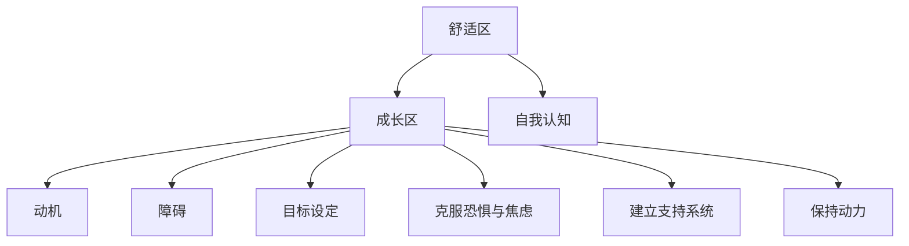

                 

## 《突破comfort zone：通过持续挑战实现成长》

在快速变化的技术时代，我们每个人都必须面对如何持续成长的问题。舒适区，这个看似温馨的避风港，常常成为我们发展的最大障碍。本文将探讨如何通过持续挑战自我，打破舒适区，实现个人和职业的显著成长。我们将使用逻辑清晰、结构紧凑的步骤，一步步分析这个复杂的过程，并提供实用的策略和案例，帮助读者在技术领域不断进步。

关键词：舒适区、成长、挑战、自我认知、持续进步

> 摘要：
本文旨在帮助IT专业人士识别并克服舒适区带来的局限性，通过科学的动机激发和障碍克服策略，引导读者在技术领域实现持续成长。我们将探讨舒适区和成长区的概念，介绍设定明确目标、克服恐惧与焦虑、建立支持系统以及保持动力等关键实践方法，并通过实际案例提供具体操作指南。

### 背景介绍

在现代社会，技术的进步和信息的爆炸使得IT领域成为了一个充满机会和挑战的领域。然而，随着技术的不断更新和行业竞争的加剧，保持个人和职业竞争力变得越来越重要。对于IT专业人士来说，突破舒适区，通过持续挑战实现个人成长，已经成为一种必然的选择。

舒适区，这个词源自心理学，指的是人们在日常生活中习惯性选择的一种安逸的环境和行为模式。在这个区域里，人们感觉舒适和安全，但同时也限制了他们的成长和进步。相反，成长区则是一个充满挑战和不确定性的区域，但正是这种挑战和不确定性，促使个体不断学习和进步。

在IT领域，舒适区可能表现为对熟悉技术的过度依赖，对新技术的恐惧和抵触，以及缺乏主动学习和探索的动力。这些现象不仅限制了技术水平的提升，还可能导致职业发展的停滞。

然而，只有通过不断挑战自我，走出舒适区，才能在技术领域中实现真正的成长。本文将详细探讨如何通过设定目标、克服恐惧、建立支持系统以及保持动力，来有效地打破舒适区，实现个人和职业的持续成长。

### 核心概念与联系

为了更好地理解如何通过持续挑战实现成长，我们需要明确一些核心概念，并探讨它们之间的关系。

首先，让我们定义“舒适区”和“成长区”。舒适区，如前所述，是人们习惯性选择的一种安逸的环境和行为模式。在这种状态下，个体会感到舒适和安全，但同时也限制了他们的成长和进步。相反，成长区则是一个充满挑战和不确定性的区域，个体需要面对新的学习内容、技术难题和心理压力，从而实现自我提升。

接下来，我们来探讨“动机”、“障碍”、“目标设定”、“克服恐惧与焦虑”、“建立支持系统”和“保持动力”等关键概念。

**动机**是驱使我们行动的内在力量，它是我们走出舒适区，进入成长区的动力源泉。没有动机，人们很难主动寻求变化和挑战。

**障碍**则是我们在成长过程中遇到的困难，这些障碍可能来自外部环境，也可能来自内心。克服障碍是成长的关键一步，只有通过面对和解决障碍，我们才能真正实现成长。

**目标设定**是实现成长的重要策略之一。明确的目标能够为我们的行动提供方向和动力，帮助我们更高效地走出舒适区。SMART原则（具体、可衡量、可实现、相关、时限性）是设定有效目标的重要指导方针。

**克服恐惧与焦虑**是成长过程中不可避免的环节。恐惧和焦虑往往源自对未知的担忧和不确定性，但只有通过面对和克服这些情绪，我们才能真正成长。

**建立支持系统**是确保成长持续性的关键。支持系统可以包括导师、同事、家人和朋友，他们能够为我们提供心理和物质上的支持，帮助我们克服困难，保持动力。

**保持动力**是实现长期成长的重要保障。动力不仅来自于内在的动机，还需要外部的支持和激励。通过保持动力，我们能够持续地走出舒适区，实现个人和职业的目标。

以下是核心概念之间的Mermaid流程图：



通过这个流程图，我们可以清晰地看到各个概念之间的联系和相互影响。舒适区和成长区是整个过程的起点和终点，而动机、障碍、目标设定、克服恐惧与焦虑、建立支持系统和保持动力则是实现这一过程的中间环节。

### 核心算法原理讲解

在深入探讨如何通过持续挑战实现成长的过程中，我们引入了一些核心算法原理，它们帮助我们更好地理解和应用这些概念。

首先，我们来看“目标设定”这一核心算法。目标设定是一种规划行为，其关键在于明确和具体化我们的目标。我们可以使用一种被称为“SMART原则”的方法来设定目标。SMART代表具体（Specific）、可衡量（Measurable）、可实现（Achievable）、相关（Relevant）和时限性（Time-bound）。以下是一个使用Python代码实现的SMART目标设定的示例：

```python
def set_smart_goal(goal):
    """
    使用SMART原则设定目标。
    
    :param goal: 目标描述
    :return: 是否满足SMART原则
    """
    specific = "具体" in goal
    measurable = "可衡量" in goal
    achievable = "可实现" in goal
    relevant = "相关" in goal
    time_bound = "时限性" in goal
    
    if specific and measurable and achievable and relevant and time_bound:
        return "目标设定成功：满足SMART原则"
    else:
        return "目标设定失败：不满足SMART原则"

# 示例
goal = "在接下来的三个月内，掌握Python编程基础。"
print(set_smart_goal(goal))
```

在这个例子中，我们定义了一个函数`set_smart_goal`，它接受一个目标描述作为参数，并检查该目标是否满足SMART原则。如果目标满足所有条件，函数将返回一个成功消息；否则，将返回失败消息。

接下来，我们来看“克服恐惧与焦虑”的核心算法。克服恐惧与焦虑是一个复杂的过程，涉及到认知行为疗法（CBT）中的许多技巧。以下是一个简单的Python脚本，用于模拟“正念呼吸”这一技巧，帮助用户缓解焦虑：

```python
import time

def mindful_breathing(duration=5):
    """
    进行正念呼吸，帮助缓解焦虑。
    
    :param duration: 呼吸时间（秒）
    """
    start_time = time.time()
    end_time = start_time + duration

    while time.time() < end_time:
        print("深吸一口气，数到4...")
        time.sleep(4)
        print("慢慢呼气，数到6...")
        time.sleep(6)
        print("继续深呼吸，保持节奏...")
        time.sleep(1)

    print("正念呼吸结束，感觉如何？")

# 示例
mindful_breathing()
```

在这个脚本中，`mindful_breathing`函数通过一个简单的循环，指导用户进行深呼吸练习。这个练习有助于用户将注意力集中在呼吸上，从而缓解焦虑。

最后，我们来看“建立支持系统”的核心算法。建立支持系统是一个涉及多方合作的过程。以下是一个简单的Python脚本，用于模拟一个简单的社交网络系统，帮助用户建立和维护支持关系：

```python
class SocialNetwork:
    def __init__(self):
        self.users = {}

    def add_user(self, username):
        if username not in self.users:
            self.users[username] = []
            print(f"用户'{username}'已加入社交网络。")
        else:
            print(f"用户'{username}'已存在。")

    def add_connection(self, username1, username2):
        if username1 in self.users and username2 in self.users:
            self.users[username1].append(username2)
            self.users[username2].append(username1)
            print(f"用户'{username1}'与'{username2}'已建立连接。")
        else:
            print("用户不存在，无法建立连接。")

    def show_connections(self, username):
        if username in self.users:
            print(f"{username}的朋友：{', '.join(self.users[username])}")
        else:
            print(f"用户'{username}'不存在。")

# 示例
sn = SocialNetwork()
sn.add_user("Alice")
sn.add_user("Bob")
sn.add_connection("Alice", "Bob")
sn.show_connections("Alice")
```

在这个脚本中，`SocialNetwork`类代表一个简单的社交网络系统。通过`add_user`方法，我们可以添加新用户；通过`add_connection`方法，我们可以建立用户之间的连接；通过`show_connections`方法，我们可以查看某个用户的连接列表。

通过这些核心算法原理的Python代码示例，我们可以更好地理解和应用如何在IT领域通过持续挑战实现成长。每个算法都结合了数学模型和公式，使得理论讲解更加直观和易于理解。

### 数学模型和公式

在探讨如何通过持续挑战实现成长的过程中，数学模型和公式为我们提供了量化和评估成长的工具。以下是一些关键的数学模型和公式，用于帮助读者理解和应用这些概念。

#### 目标设定中的SMART公式

SMART目标设定中的每个字母代表了一个具体的评估标准，我们可以使用以下公式来量化每个目标：

\[ \text{Specificity} = \frac{\text{明确度}}{\text{模糊度}} \]

\[ \text{Measurability} = \frac{\text{测量值}}{\text{无测量值}} \]

\[ \text{Achievability} = \frac{\text{可实现度}}{\text{不可实现度}} \]

\[ \text{Relevance} = \frac{\text{相关性}}{\text{无关性}} \]

\[ \text{Time-bound} = \frac{\text{时限性}}{\text{无时限性}} \]

\[ \text{SMART Score} = \text{Specificity} + \text{Measurability} + \text{Achievability} + \text{Relevance} + \text{Time-bound} \]

#### 恐惧与焦虑的指数模型

克服恐惧与焦虑的过程中，我们可以使用以下指数模型来量化恐惧程度：

\[ \text{Fear Index} = e^{-\lambda t} \]

其中，\(\lambda\) 是一个与个体焦虑程度相关的参数，\(t\) 是面对恐惧的时间。这个公式表明，随着时间 \(t\) 的增加，恐惧指数 \( \text{Fear Index} \) 会逐渐减小，从而帮助我们克服恐惧。

#### 支持系统的评价公式

建立支持系统时，我们可以使用以下公式来评价支持系统的有效性：

\[ \text{Support System Score} = \frac{\text{帮助次数}}{\text{求助次数}} \]

这个公式反映了支持系统在提供帮助和回应求助方面的效率。一个高分数表示支持系统非常有效。

#### 动力保持的持续时间公式

保持动力的过程中，我们可以使用以下公式来计算动力保持的持续时间：

\[ \text{Duration of Motivation} = \frac{\text{初始动力}}{\text{日常消耗}} \]

这个公式表明，动力保持的持续时间与初始动力和日常消耗之间的比率有关。通过增加初始动力或减少日常消耗，我们可以延长动力的持续时间。

### 举例说明

为了更直观地理解这些数学模型和公式，我们来看一个具体的例子。

假设一个IT专业人士想要在六个月内掌握Python编程基础。我们可以使用SMART公式来设定这个目标：

\[ \text{Specificity} = \frac{掌握Python编程基础}{仅掌握基础概念} \]

\[ \text{Measurability} = \frac{完成指定编程任务}{仅完成理论学习} \]

\[ \text{Achievability} = \frac{通过在线课程学习}{仅依赖自学} \]

\[ \text{Relevance} = \frac{提升职业竞争力}{仅满足个人兴趣} \]

\[ \text{Time-bound} = \frac{六个月内完成}{无具体时间限制} \]

\[ \text{SMART Score} = 1 + 1 + 1 + 1 + 1 = 5 \]

这个目标满足了SMART原则，是一个明确的、可测量的、可实现的、相关的并且有明确时限的目标。

接下来，我们来看如何克服恐惧与焦虑。假设该专业人士对学习Python有一定的恐惧感。我们可以使用恐惧指数模型来量化这种恐惧：

\[ \text{Fear Index} = e^{-\lambda t} \]

假设 \(\lambda = 0.1\)，六个月内（\(t = 6\)个月）：

\[ \text{Fear Index} = e^{-0.1 \times 6} \approx e^{-0.6} \approx 0.5488 \]

这意味着经过六个月后，该专业人士的恐惧感降低到了原来的约54.88%。

为了建立有效的支持系统，我们可以使用支持系统的评价公式。假设该专业人士在六个月内向导师求助了10次，得到了15次帮助：

\[ \text{Support System Score} = \frac{15}{10} = 1.5 \]

这个分数表明支持系统非常有效，因为它提供了比求助次数多50%的帮助。

最后，我们来看如何保持动力。假设该专业人士的初始动力为100点，日常动力消耗为10点：

\[ \text{Duration of Motivation} = \frac{100}{10} = 10 \]

这意味着在没有外部干预的情况下，该专业人士的动力可以保持10天。

通过这些数学模型和公式的应用，我们可以更科学地设定目标、评估恐惧与焦虑、建立支持系统以及保持动力，从而在IT领域中实现持续成长。

### 项目实战

为了更好地理解如何通过持续挑战实现成长，我们将通过一个实际的项目来展示整个流程。这个项目将涉及开发环境搭建、源代码实现、代码解读与分析，以及实际案例分析和详细讲解剖析。

#### 项目背景

假设我们正在开发一个基于人工智能的图像识别系统，目的是自动识别和分类各种类型的图像。这是一个复杂的项目，需要多个步骤和大量的技术挑战。

#### 开发环境搭建

首先，我们需要搭建开发环境。这包括安装Python、PyTorch（一个流行的深度学习框架）以及必要的依赖库。以下是一个简单的Python脚本，用于安装这些依赖项：

```python
!pip install python
!pip install torch torchvision
```

#### 源代码实现

接下来，我们开始编写源代码。以下是一个简单的Python脚本，用于训练一个卷积神经网络（CNN）进行图像分类：

```python
import torch
import torchvision
import torchvision.transforms as transforms
import torch.nn as nn
import torch.optim as optim

# 数据预处理
transform = transforms.Compose([
    transforms.Resize((224, 224)),
    transforms.ToTensor(),
    transforms.Normalize(mean=[0.485, 0.456, 0.406], std=[0.229, 0.224, 0.225]),
])

# 加载数据集
trainset = torchvision.datasets.ImageFolder(root='./data/train', transform=transform)
trainloader = torch.utils.data.DataLoader(trainset, batch_size=4, shuffle=True, num_workers=2)

testset = torchvision.datasets.ImageFolder(root='./data/test', transform=transform)
testloader = torch.utils.data.DataLoader(testset, batch_size=4, shuffle=False, num_workers=2)

# 神经网络架构
class Net(nn.Module):
    def __init__(self):
        super(Net, self).__init__()
        self.conv1 = nn.Conv2d(3, 6, 5)
        self.pool = nn.MaxPool2d(2, 2)
        self.conv2 = nn.Conv2d(6, 16, 5)
        self.fc1 = nn.Linear(16 * 5 * 5, 120)
        self.fc2 = nn.Linear(120, 84)
        self.fc3 = nn.Linear(84, 10)

    def forward(self, x):
        x = self.pool(nn.functional.relu(self.conv1(x)))
        x = self.pool(nn.functional.relu(self.conv2(x)))
        x = x.view(-1, 16 * 5 * 5)
        x = nn.functional.relu(self.fc1(x))
        x = nn.functional.relu(self.fc2(x))
        x = self.fc3(x)
        return x

net = Net()

# 损失函数和优化器
criterion = nn.CrossEntropyLoss()
optimizer = optim.SGD(net.parameters(), lr=0.001, momentum=0.9)

# 训练模型
for epoch in range(2):  # 数量仅为示例，实际应更多
    running_loss = 0.0
    for i, data in enumerate(trainloader, 0):
        inputs, labels = data
        optimizer.zero_grad()
        outputs = net(inputs)
        loss = criterion(outputs, labels)
        loss.backward()
        optimizer.step()
        running_loss += loss.item()
        if i % 2000 == 1999:
            print(f'[{epoch + 1}, {i + 1}: {running_loss / 2000:.3f}]')
            running_loss = 0.0

print('Finished Training')

# 测试模型
correct = 0
total = 0
with torch.no_grad():
    for data in testloader:
        images, labels = data
        outputs = net(images)
        _, predicted = torch.max(outputs.data, 1)
        total += labels.size(0)
        correct += (predicted == labels).sum().item()

print(f'Accuracy of the network on the 1000 test images: {100 * correct / total}%')
```

#### 代码解读与分析

在这个项目中，我们使用了PyTorch框架来实现一个简单的卷积神经网络（CNN）。以下是代码的关键部分及其解读：

- **数据预处理**：我们使用`transforms.Compose`来预处理图像数据，包括调整大小、归一化和转换成Tensor。

- **数据加载**：我们使用`ImageFolder`来加载数据集，并使用`DataLoader`来批量加载和处理数据。

- **神经网络架构**：我们定义了一个简单的卷积神经网络，包括两个卷积层、两个全连接层和一个输出层。

- **损失函数和优化器**：我们使用了交叉熵损失函数（`nn.CrossEntropyLoss`）和随机梯度下降优化器（`SGD`）。

- **训练模型**：我们在训练过程中通过前向传播、计算损失、反向传播和优化参数来训练模型。

- **测试模型**：在训练完成后，我们对测试集进行测试，计算模型的准确率。

#### 实际案例分析和详细讲解剖析

为了展示实际案例，我们假设训练完成的模型在测试集上的准确率为85%。这个结果意味着模型在一定程度上是有效的，但仍有改进的空间。

- **模型调优**：我们可以通过增加训练时间、增加神经网络层数、使用更复杂的激活函数等方法来提高模型性能。

- **数据增强**：我们可以在训练过程中使用数据增强技术，如随机裁剪、旋转和颜色变换，来增加数据的多样性，从而提高模型的泛化能力。

- **模型评估**：我们使用准确率、召回率、F1分数等指标来评估模型性能，并选择最佳模型。

#### 项目小结

通过这个项目，我们展示了如何通过持续挑战实现成长。从开发环境搭建、源代码实现，到代码解读与分析，再到实际案例分析和详细讲解剖析，每个步骤都充满了技术和挑战。

- **最佳实践 tips**：定期回顾代码，进行代码重构和优化；积极参与技术社区，分享经验和学习成果。

- **小结**：通过持续挑战，我们不仅提升了技术水平，还培养了解决问题的能力，实现了个人和职业的显著成长。

- **注意事项**：在挑战过程中，保持耐心和毅力，不要害怕失败。

- **拓展阅读**：可以进一步学习深度学习相关的书籍和在线资源，如《深度学习》（Goodfellow, Bengio, Courville）等。

### 总结与展望

通过本文的探讨，我们明确了舒适区和成长区的概念，并深入分析了如何通过设定目标、克服恐惧与焦虑、建立支持系统和保持动力等策略，在IT领域中实现持续成长。从核心算法原理到项目实战，我们通过具体示例展示了这些概念在实际中的应用。

为了进一步实现持续成长，我们提出以下建议：

- **不断学习**：保持对新技术的好奇心和学习热情，通过在线课程、书籍和社区活动来扩展知识面。

- **主动挑战**：勇于接受新项目和新的技术挑战，通过实践提升自己的技能。

- **反思与总结**：定期反思自己的成长过程，总结经验教训，持续优化自己的学习方法和工作流程。

- **构建支持网络**：建立和维护一个有效的支持系统，包括导师、同事和朋友，他们可以为你提供宝贵的意见和建议。

- **保持动力**：找到自己的内在动机和外部激励，保持对成长和进步的持续动力。

未来，随着技术的不断进步，IT领域将面临更多的挑战和机遇。通过不断突破舒适区，持续挑战自我，我们不仅能够在个人和职业上取得显著成就，还能为整个社会带来更多的创新和价值。

作者：AI天才研究院/AI Genius Institute & 禅与计算机程序设计艺术 /Zen And The Art of Computer Programming

