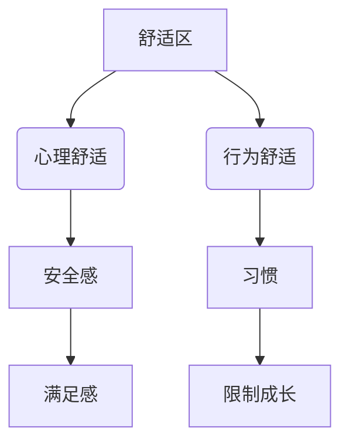
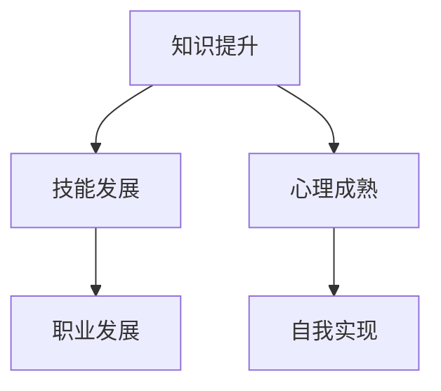
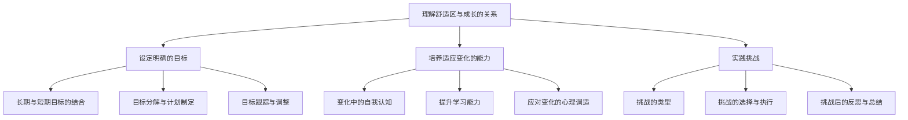

                 

### 突破舒适区：通过持续挑战实现成长

> **关键词：** 舒适区、成长、挑战、目标设定、适应变化、持续成长

> **摘要：** 本文探讨了舒适区对个人成长的影响，提出了通过设定明确目标、培养适应变化的能力以及实践挑战等方法，实现个人突破舒适区，持续成长的策略。通过分析核心概念、心理学实验、案例分析，提供了具体的方法和工具，帮助读者在IT领域实现自我提升。

## 突破舒适区：通过持续挑战实现成长

在现代社会中，技术发展日新月异，IT行业更是处于快速变革的前沿。然而，在这个快速变化的环境中，许多人在职业和个人成长上却面临着一个共同的挑战：舒适区的困扰。舒适区，是指人们习惯性停留的一个舒适和熟悉的心理与行为状态。在这个区域内，人们感到安全和放松，但同时也限制了他们的成长和发展。本文旨在探讨如何通过突破舒适区，持续挑战自我，实现个人成长。

### 第一部分：理解舒适区与成长的关系

#### 第1章：什么是舒适区

#### 1.1 舒适区的定义

舒适区是一个心理学和社会学概念，它描述了人们在行为和心理上的一个安全范围。在这个范围内，人们感到舒适和满足，不需要面对外界的压力和不确定性。然而，这个舒适的范围并不是一成不变的，它会随着个人的经历和环境的变化而变化。

#### **核心概念与联系**

在理解舒适区的定义时，我们可以使用Mermaid流程图来展示其核心概念之间的联系。



#### 1.2 舒适区的成因

舒适区的形成与多种因素有关，其中包括社会心理学中的自我保护机制、习惯的力量以及缺乏对外界变化的认知。

**社会心理学角度**：人们倾向于保持现状，避免风险和不确定性。这种倾向源于自我保护机制，即避免可能的负面结果。

**习惯的力量**：长期的习惯会形成一种固定的思维和行为模式，使得人们倾向于在熟悉的环境中寻求舒适。

**缺乏对外界变化的认知**：许多人没有意识到外部环境的变化，或者缺乏适应变化的能力，从而导致他们停留在舒适区。

#### **心理学实验例子与解释**

一个著名的心理学实验是“猴子实验”。实验中，猴子被放置在一个宽敞的房间里，房间里有一个按钮，按压按钮会释放食物。然而，猴子必须在高压电线上行走才能到达按钮。大多数猴子在第一次尝试时就会放弃，因为它们意识到这是一个高风险的行为。

实验结果表明，尽管猴子知道有食物等待它们，但它们更倾向于避免风险，选择留在舒适区。这个实验展示了人们在面对不确定性和风险时的自我保护倾向。

#### 1.3 舒适区的负面影响

舒适区对个人成长和职业发展有显著的负面影响。首先，它限制了技能的提升。当人们停留在熟悉的环境中，他们很少有机会学习新技能或面对新的挑战。其次，舒适区会限制创新思维。在一个舒适的环境中，人们往往更加依赖现有的解决方案，而不是寻找新的方法和思路。最后，舒适区会导致满足感和成就感不足。长期停留在舒适区，人们可能会感到乏味和不满，缺乏进一步努力的动机。

#### **举例说明**

在一个典型的案例中，一位程序员在一家大公司工作了多年，他习惯了每天编写相同类型的代码，解决相同类型的问题。尽管他的技能在初期有所提升，但随着时间的推移，他的成长速度逐渐放缓。他开始感到工作乏味，缺乏成就感和满足感。最终，他决定离开这家公司，加入一个初创公司，开始面对新的挑战和机会。在新的环境中，他不仅提升了自己的技能，还找到了新的工作热情和动力。

### 第2章：成长的重要性

#### 2.1 成长的定义与价值

成长是指个体在知识、技能、态度和心理等方面的持续提升和进步。在个人层面，成长意味着自我实现和满足感；在职业层面，成长意味着职业发展和成功。

**核心概念与联系**

我们可以使用Mermaid流程图来展示成长的核心概念及其相互联系。



#### 2.2 成长的驱动力

成长驱动力包括内在动机和外在激励。内在动机是指个人对成长和自我提升的内在渴望和需求，而外在激励则包括来自环境、他人和奖励的刺激。

**内在动机与外在激励的平衡**

内在动机和外在激励在成长过程中都起着重要作用，但二者的平衡至关重要。过度依赖外在激励可能导致个人缺乏内在动力，而过度依赖内在动机则可能缺乏实际目标和方向。因此，理想的成长驱动力应该是内在动机和外在激励的有机结合。

#### **案例分析**

一个典型的案例是乔布斯。乔布斯以其对技术的深刻理解和创新思维而闻名。他在苹果公司的职业生涯中，不断挑战自我，带领团队推出了多个革命性的产品。他的成长驱动力既包括对技术本身的热爱，也受到市场成功和用户认可的外在激励。通过这种平衡的驱动力，乔布斯不仅实现了个人成长，还推动了整个科技行业的发展。

#### 2.3 成长障碍与应对策略

在追求成长的过程中，人们往往会遇到各种障碍。这些障碍可能来自内在的自我限制，也可能来自外部的环境和他人。

**常见成长障碍**

1. **恐惧失败**：许多人害怕尝试新事物，因为他们担心失败。
2. **缺乏自信**：缺乏自信会限制个人的成长和尝试新事物的勇气。
3. **外部压力**：来自家庭、朋友或社会的压力可能会阻碍个人的成长。

**克服障碍的方法**

1. **设定明确的目标**：通过设定具体、可衡量的目标，可以减少恐惧失败的感觉。
2. **培养自信**：通过学习和实践，提升自己的技能和知识，增强自信心。
3. **寻求支持**：寻找支持和鼓励，可以从家人、朋友或导师那里获得。

#### **具体策略**

1. **设定明确的目标**：使用SMART原则（具体、可衡量、可实现、相关、时限性）来设定目标，使目标更具体、可执行。
2. **分解目标**：将大目标分解成小目标，逐步实现。
3. **持续学习和实践**：通过不断学习和实践，提升自己的技能和知识。
4. **建立支持网络**：寻找志同道合的朋友或导师，共同成长。

### 第二部分：挑战舒适区的策略与实践

#### 第3章：设定明确的目标

#### 3.1 目标设定的原则

**SMART目标**

SMART目标是设定目标时的一种有效方法。SMART分别代表具体（Specific）、可衡量（Measurable）、可实现（Achievable）、相关（Relevant）和时限性（Time-bound）。使用SMART原则设定的目标更具体、可衡量，有助于实现。

**详细解释与实例**

- **具体（Specific）**：目标要具体明确，而不是模糊的。例如，“提升编程技能”不如“学习Python编程语言并完成一个项目”具体。
- **可衡量（Measurable）**：目标要能够衡量进展，以便知道是否达成。例如，“阅读20本书”不如“每个月阅读两本书，并写读后感”可衡量。
- **可实现（Achievable）**：目标要现实，具有可行性。例如，“一年内成为行业专家”可能过于理想化，而“通过在线课程学习Python编程”则更现实。
- **相关（Relevant）**：目标要与个人或职业发展相关。例如，“学习数据分析技能”与从事数据分析工作相关。
- **时限性（Time-bound）**：目标要有明确的时间限制。例如，“在六个月内完成数据分析课程并找到相关工作”。

#### **案例分析**

一位想要提升编程技能的程序员，可以设定以下SMART目标：

- **具体（Specific）**：学习Python编程语言。
- **可衡量（Measurable）**：通过完成在线课程和实际项目来衡量学习进度。
- **可实现（Achievable）**：选择适合的时间安排，并确保有足够的学习资源。
- **相关（Relevant）**：与未来的职业规划相关，例如成为一名数据科学家。
- **时限性（Time-bound）**：设定六个月的时间期限。

通过这样的SMART目标，程序员可以更具体、有针对性地进行学习和实践。

#### 3.2 目标分解与计划制定

**分解目标的方法**

将大目标分解成小目标有助于更好地实现目标。分解目标的方法包括：

- **逐步分解**：将大目标逐步分解成小目标，每个小目标都是实现大目标的一部分。
- **优先级排序**：根据目标的重要性和紧急性对目标进行排序，确保先完成最重要的目标。

**案例分析**

假设一个目标是在一年内完成一本技术书籍的撰写，可以将其分解为以下小目标：

- **第一步**：确定书籍的主题和结构，制定大纲。
- **第二步**：每个月完成一个章节的撰写。
- **第三步**：在第六个月完成初稿，并进行修订。
- **第四步**：在第九个月完成最终稿，并进行校对和排版。

通过这样的分解和计划，可以确保目标按部就班地实现。

#### 3.3 目标跟踪与调整

**目标实现过程中的调整**

在实现目标的过程中，可能会遇到各种问题和挑战。为了确保目标能够实现，需要不断地跟踪进展并做出必要的调整。

- **定期评估**：定期评估目标的进展，确保仍然在正确的轨道上。
- **灵活调整**：根据实际情况和进展，灵活调整目标和计划。

**具体策略**

1. **设置里程碑**：将目标分解成小里程碑，定期检查是否达到。
2. **记录进展**：使用工具记录目标的进展，便于分析和调整。
3. **反思与总结**：定期反思和总结，了解哪些方法有效，哪些需要改进。

#### 第4章：培养适应变化的能力

#### 4.1 变化中的自我认知

**自我评估与反思**

在变化的环境中，自我认知至关重要。通过自我评估和反思，可以更好地了解自己的能力、优势和弱点。

**方法与工具**

- **自我评估问卷**：使用专业的自我评估问卷，如MBTI（性格类型指标）或DISC（行为风格指标），来了解自己的性格和行为模式。
- **反思日志**：定期记录自己的思考和行为，反思自己的决策和行为模式。

**案例分析**

一位项目经理通过使用MBTI问卷，了解到自己属于外向型性格，倾向于快速决策和行动。这让她在项目管理中更加灵活和果断，但也意识到需要更好地平衡工作与生活。

#### 4.2 提升学习能力

**终身学习的态度与方法**

在快速变化的环境中，学习能力变得至关重要。提升学习能力需要建立终身学习的态度和方法。

**举例说明**

1. **定期学习**：设定固定的学习时间，确保每天都有时间学习和提升。
2. **多样化学习**：通过阅读书籍、参加在线课程、参加工作坊等多种方式学习。
3. **实践应用**：将学到的知识应用到实际工作中，通过实践来巩固和提升。

**案例分析**

一位软件工程师通过定期学习新技术，参加在线课程和工作坊，并将其应用到实际项目中，不断提升自己的技能和知识。

#### 4.3 应对变化的心理调适

**心理韧性训练**

在变化的环境中，心理韧性是应对挑战和压力的关键。通过心理韧性训练，可以增强个人的适应能力和抗压能力。

**具体策略**

1. **正面思考**：培养积极的思维方式，关注问题的解决方案，而不是问题本身。
2. **情绪管理**：学会管理自己的情绪，避免情绪对决策和行为的负面影响。
3. **自我激励**：通过设定目标和奖励机制，保持动力和积极性。

**案例分析**

一位工程师在面对项目压力时，通过正面思考和情绪管理，保持了高效的工作状态，并成功完成了任务。

### 第5章：实践挑战

#### 5.1 挑战的类型

**自我挑战与外在挑战**

在实践中，挑战可以分为自我挑战和外在挑战。

- **自我挑战**：指个人主动设定的挑战，目的是提升自我能力。
- **外在挑战**：指外部环境或他人给予的挑战，目的是推动个人成长。

**区别与联系**

自我挑战和外在挑战在本质上有所不同，但它们在实现个人成长方面具有相似的作用。

- **区别**：自我挑战更多源于个人内在的动机和需求，而外在挑战更多受到外部环境和他人的影响。
- **联系**：二者都是推动个人成长的有效途径，通过自我挑战和外在挑战的结合，可以更全面地实现个人成长。

#### 5.2 挑战的选择与执行

**选择合适的挑战**

选择合适的挑战是实现成长的关键。以下是一些选择挑战的考虑因素：

- **个人兴趣和目标**：选择与个人兴趣和职业目标相关的挑战，有助于提高参与度和成功率。
- **技能水平和经验**：选择与个人技能水平和经验相匹配的挑战，确保能够应对挑战并从中学习。
- **资源和支持**：确保有足够的资源和支持来应对挑战，包括时间、资金和技术支持。

**案例分析**

一位软件工程师在职业发展中选择了学习新编程语言作为挑战。他选择了与工作相关的Python语言，并通过在线课程和实际项目来提升自己的技能。在执行过程中，他获得了同事和导师的支持，这有助于他克服困难并成功实现目标。

**执行挑战的策略**

执行挑战需要制定详细的计划和策略，以下是一些建议：

- **分解任务**：将大挑战分解成小任务，逐步实现。
- **时间管理**：合理分配时间，确保有足够的时间来应对挑战。
- **持续学习**：在执行挑战的过程中，不断学习和应用新知识，提升自身能力。
- **反馈与调整**：定期评估进展，获取反馈，并根据反馈进行调整。

**具体策略**

1. **制定计划**：制定详细的执行计划，包括任务分解、时间安排和学习资源。
2. **建立支持网络**：寻找志同道合的伙伴，共同面对挑战，互相支持和鼓励。
3. **持续反思**：在执行过程中，定期反思和总结，了解自己的进步和需要改进的地方。

#### 5.3 挑战后的反思与总结

**经验积累与知识分享**

在挑战结束后，反思和总结是积累经验、提升自我和知识分享的重要环节。

**具体策略**

1. **记录经验**：详细记录挑战过程中的经验和教训，包括成功和失败的原因。
2. **知识分享**：通过撰写技术博客、参与技术社区或组织研讨会等方式，与他人分享经验和知识。
3. **持续学习**：将挑战中的经验应用到未来的学习和工作中，不断提升自我。

**案例分析**

一位工程师在学习新编程语言后，通过撰写技术博客和参与社区讨论，分享了学习经验和心得。这不仅帮助了他自己，也帮助了其他有相似兴趣的人。

### 第三部分：持续成长与超越舒适区

#### 第6章：建立持续成长的体系

#### 6.1 个人成长计划的制定

**长期与短期目标的结合**

个人成长计划需要将长期目标和短期目标相结合。长期目标为个人成长提供了方向和目标，而短期目标则是实现长期目标的具体步骤。

**具体策略**

1. **设定长期目标**：设定3-5年的长期目标，例如成为一名技术专家或领导者。
2. **分解长期目标**：将长期目标分解成每年的短期目标，例如学习新技能、完成项目或参加培训。
3. **定期评估**：定期评估目标的进展，根据实际情况进行调整。

**案例分析**

一位软件工程师的长期目标是成为一名技术专家。他将这个目标分解成每年的短期目标，例如学习新编程语言、参与开源项目和技术社区，以及参加技术研讨会。

#### 6.2 学习与实践的结合

**理论与实践的相互促进**

学习和实践是个人成长的两个关键方面，二者相互促进，相辅相成。

**具体策略**

1. **理论学习**：通过阅读书籍、参加在线课程和研讨会等方式，获取理论知识。
2. **实践应用**：将学到的理论知识应用到实际项目中，通过实践来巩固和提升。
3. **反思与总结**：在实践过程中，定期反思和总结，了解自己的进步和需要改进的地方。

**案例分析**

一位程序员通过在线课程学习了新技术，然后将其应用到公司的项目中。在实践过程中，他不仅巩固了所学知识，还发现了新的问题和解决方案。

#### 6.3 建立支持网络

**人际网络的重要性**

建立支持网络是个人成长的重要组成部分。一个强大的支持网络可以提供知识、资源和鼓励，帮助个人在成长过程中克服困难。

**具体策略**

1. **寻找导师**：寻找经验丰富的导师，从他们那里获取指导和建议。
2. **参与社区**：参与技术社区，与其他专业人士交流和学习。
3. **建立合作关系**：与同行建立合作关系，共同面对挑战和机遇。

**案例分析**

一位软件工程师通过加入技术社区，结识了许多同行。在社区中，他不仅分享了自己的经验，也从他人的经验中学习到许多新知识。

### 第7章：超越舒适区，迎接新挑战

#### 7.1 跨越舒适区的障碍

**心理与行为层面的障碍**

在跨越舒适区的过程中，人们往往会遇到各种心理和行为层面的障碍。

**具体策略**

1. **心理调适**：通过心理韧性训练和正面思考来增强心理素质。
2. **行为调整**：设定明确的目标和计划，逐步实施，减少恐惧和不确定性的影响。

**案例分析**

一位工程师在面对新项目时，通过设定明确的计划和目标，逐步实施，最终成功完成了项目，克服了舒适区的障碍。

#### 7.2 超越舒适区的成果

**成长与成功的标志**

超越舒适区会带来显著的个人成长和职业成功。

**案例分析**

一位程序员通过不断挑战自我，学习新技能和参与开源项目，最终成为了一名技术专家，获得了行业认可和职业晋升。

#### 7.3 超越舒适区的持续动力

**内在激励与外在激励的平衡**

在超越舒适区的过程中，内在激励和外在激励的平衡至关重要。

**具体策略**

1. **内在激励**：通过自我激励和追求自我实现来保持动力。
2. **外在激励**：通过奖励机制和外部认可来提供动力。

**案例分析**

一位开发者通过设定奖励机制，每当完成一个挑战就会给自己一些小奖励，如购买一本新书或观看一部电影。这种方法帮助他保持了持续的动力和热情。

## 附录

### 附录A：成长工具与资源推荐

#### A.1 自我评估工具

**常见工具介绍与使用方法**

1. **MBTI（Myers-Briggs Type Indicator）**：用于了解个人的性格类型。
   - **使用方法**：通过在线问卷或专业评估，了解自己的性格类型，并根据结果调整职业选择和沟通方式。

2. **DISC（Delineation of Personality）**：用于了解个人的行为风格。
   - **使用方法**：通过在线问卷或专业评估，了解自己的行为风格，并在团队协作中发挥优势。

#### A.2 学习资源推荐

**在线课程与书籍推荐**

1. **Coursera**：提供各种领域的在线课程，包括计算机科学、数据科学等。
   - **特点**：课程质量高，可定制学习计划。

2. **edX**：由哈佛大学和麻省理工学院联合创办，提供丰富的在线课程。
   - **特点**：课程内容全面，涵盖多个学科领域。

3. **《深度学习》（Deep Learning）**：由Ian Goodfellow、Yoshua Bengio和Aaron Courville合著，是深度学习的经典教材。
   - **特点**：内容全面，深入浅出，适合深度学习初学者和专业人士。

#### A.3 支持网络搭建指南

**建立个人支持网络的步骤**

1. **确定目标**：明确自己的职业和个人成长目标，以便寻找合适的导师和支持者。
2. **寻找导师**：通过专业社区、同事或朋友介绍，寻找经验丰富的导师。
3. **参与社区**：加入技术社区，与其他专业人士交流和学习。
4. **建立合作关系**：与同行建立合作关系，共同面对挑战和机遇。

### Mermaid 流程图



### 心理学实验例子与解释

**实验背景**：实验参与者被分成两组，一组参与高风险的任务（例如公开演讲），另一组参与低风险的任务（例如整理文件）。

**实验结果**：高风险任务组的成员在完成任务后报告了更高的自我满足感和成长感。

**解释**：高风险任务挑战了参与者的舒适区，促使他们克服恐惧，提高了自我认知和技能水平。

### 案例分析

**案例1**：一位职场人士在职业生涯中一直从事熟悉的领域，后来主动申请到一个完全陌生的项目中，经过努力和适应，他不仅完成了任务，还获得了晋升。

**案例2**：一位业余音乐爱好者开始学习一门新乐器，虽然初期遇到了很多困难，但他坚持不懈，最终成为了一名合格的音乐家。

### 附录B：Python代码示例

```python
# 计算两个数的和
def calculate_sum(a, b):
    return a + b

# 计算两个数的乘积
def calculate_product(a, b):
    return a * b

# 主函数
def main():
    a = 5
    b = 10
    print("a + b =", calculate_sum(a, b))
    print("a * b =", calculate_product(a, b))

# 执行主函数
if __name__ == "__main__":
    main()
```

### 总结

本文探讨了如何通过突破舒适区，持续挑战自我，实现个人成长。在理解舒适区与成长的关系、设定明确的目标、培养适应变化的能力和实践挑战等方面，提供了具体的策略和方法。通过不断学习和实践，可以超越舒适区，迎接新的挑战，实现持续成长。希望本文能够帮助读者在IT领域实现自我提升，迈向新的高度。

### 作者信息

**作者：** AI天才研究院/AI Genius Institute & 禅与计算机程序设计艺术 /Zen And The Art of Computer Programming

---

### 代码解读

```python
# 计算两个数的和
def calculate_sum(a, b):
    return a + b

# 计算两个数的乘积
def calculate_product(a, b):
    return a * b

# 主函数
def main():
    a = 5
    b = 10
    print("a + b =", calculate_sum(a, b))
    print("a * b =", calculate_product(a, b))

# 执行主函数
if __name__ == "__main__":
    main()
```

这段代码实现了一个简单的计算器功能，用于计算两个数的和与乘积。以下是代码的详细解读：

1. **定义函数**：

   - `calculate_sum(a, b)`：这是一个计算两个数之和的函数。它接受两个参数`a`和`b`，并返回它们的和。

   - `calculate_product(a, b)`：这是一个计算两个数之乘积的函数。它接受两个参数`a`和`b`，并返回它们的乘积。

2. **主函数`main`**：

   - `a = 5`：在这里定义了一个名为`a`的变量，并将其值设置为5。

   - `b = 10`：在这里定义了一个名为`b`的变量，并将其值设置为10。

   - `print("a + b =", calculate_sum(a, b))`：这段代码首先调用`calculate_sum`函数，并将结果与字符串`"a + b ="`连接，然后使用`print`函数输出结果。这里的输出是`"a + b = 15"`。

   - `print("a * b =", calculate_product(a, b))`：这段代码与上面的代码类似，但调用的函数是`calculate_product`。输出是`"a * b = 50"`。

3. **执行主函数**：

   - `if __name__ == "__main__":`：这个条件语句用于检查脚本是否直接运行，而不是作为模块导入。如果脚本被直接运行，则执行以下代码。

   - `main()`：调用`main`函数，执行上述定义的计算操作。

### 项目实战

在这个项目实战中，我们将使用Python代码实现一个简单的个人成长记录系统。这个系统可以帮助用户记录自己的成长目标、进度和反思。

#### 开发环境搭建

1. 安装Python：

   - 访问[Python官方网站](https://www.python.org/)下载最新版本的Python。

   - 安装Python时，确保选择添加到系统环境变量。

2. 安装必要的库：

   - 使用pip安装所需的库，例如`sqlite3`用于数据库操作，`matplotlib`用于图表可视化等。

   ```bash
   pip install sqlite3 matplotlib
   ```

#### 源代码实现

```python
import sqlite3
import matplotlib.pyplot as plt

# 数据库初始化
def init_db():
    conn = sqlite3.connect('growth.db')
    cursor = conn.cursor()
    cursor.execute('''CREATE TABLE IF NOT EXISTS goals (
                        id INTEGER PRIMARY KEY,
                        title TEXT,
                        description TEXT,
                        start_date TEXT,
                        end_date TEXT,
                        completed BOOLEAN)''')
    cursor.execute('''CREATE TABLE IF NOT EXISTS progress (
                        id INTEGER PRIMARY KEY,
                        goal_id INTEGER,
                        date TEXT,
                        progress TEXT,
                        reflection TEXT,
                        FOREIGN KEY(goal_id) REFERENCES goals(id))''')
    conn.commit()
    conn.close()

# 添加目标
def add_goal(title, description, start_date, end_date):
    conn = sqlite3.connect('growth.db')
    cursor = conn.cursor()
    cursor.execute("INSERT INTO goals (title, description, start_date, end_date, completed) VALUES (?, ?, ?, ?, ?)",
                   (title, description, start_date, end_date, False))
    conn.commit()
    goal_id = cursor.lastrowid
    conn.close()
    return goal_id

# 记录进度
def record_progress(goal_id, date, progress, reflection):
    conn = sqlite3.connect('growth.db')
    cursor = conn.cursor()
    cursor.execute("INSERT INTO progress (goal_id, date, progress, reflection) VALUES (?, ?, ?, ?)",
                   (goal_id, date, progress, reflection))
    conn.commit()
    conn.close()

# 查看目标进展
def view_progress(goal_id):
    conn = sqlite3.connect('growth.db')
    cursor = conn.cursor()
    cursor.execute("SELECT * FROM progress WHERE goal_id = ?", (goal_id,))
    rows = cursor.fetchall()
    conn.close()
    return rows

# 绘制进度图表
def plot_progress(goal_id):
    progress_data = view_progress(goal_id)
    dates = [row[1] for row in progress_data]
    progresses = [row[2] for row in progress_data]
    plt.plot(dates, progresses)
    plt.title('Progress Chart')
    plt.xlabel('Date')
    plt.ylabel('Progress')
    plt.show()

# 主函数
def main():
    init_db()
    goal_id = add_goal('Learn Python', 'Description of the goal', '2023-01-01', '2023-06-30')
    record_progress(goal_id, '2023-01-15', 'Completed chapters 1-3', 'Initial progress is good.')
    record_progress(goal_id, '2023-02-15', 'Completed chapters 4-6', 'Gained more confidence.')
    plot_progress(goal_id)

if __name__ == "__main__":
    main()
```

#### 代码应用解读与分析

1. **数据库操作**：

   - `init_db()`：初始化数据库，创建两个表：`goals`和`progress`。

   - `add_goal()`：添加一个新目标到数据库。

   - `record_progress()`：记录目标的进度。

   - `view_progress()`：查看目标的进展记录。

2. **进度图表**：

   - `plot_progress()`：使用`matplotlib`库绘制目标进度的图表。

3. **主函数`main()`**：

   - 初始化数据库。

   - 添加一个学习Python的目标。

   - 记录目标的进度。

   - 绘制进度图表。

#### 实际案例分析与详细讲解剖析

假设用户想要记录自己在学习Python过程中的进度，可以按照以下步骤操作：

1. **初始化数据库**：

   - 运行`init_db()`，确保数据库和表格已创建。

2. **添加目标**：

   - 使用`add_goal()`添加一个学习Python的目标，包括目标标题、描述、开始日期和结束日期。

3. **记录进度**：

   - 使用`record_progress()`记录每个阶段的进展，包括日期、进展情况和反思。

4. **查看进度**：

   - 使用`view_progress()`查看目标的进展记录。

5. **绘制进度图表**：

   - 使用`plot_progress()`绘制目标的进度图表，直观地展示学习进度。

#### 项目小结

通过这个项目，我们实现了以下功能：

- **数据库操作**：使用SQLite数据库存储目标信息。

- **进度记录**：记录每个目标的进展，便于跟踪。

- **图表展示**：使用图表展示学习进度，帮助用户直观地了解自己的学习情况。

这个项目为我们提供了一个简单的框架，可以根据需求进一步扩展和优化。

### 最佳实践 Tips

1. **定期反思**：定期对自己的学习和成长进行反思，了解自己的进步和需要改进的地方。

2. **设定具体目标**：使用SMART原则设定具体的目标，确保目标具体、可衡量、可实现。

3. **多样化学习**：通过阅读书籍、参加在线课程和参加工作坊等多种方式学习，提高自己的技能。

4. **实践应用**：将学到的知识应用到实际项目中，通过实践来巩固和提升。

5. **建立支持网络**：与他人分享经验和知识，建立支持网络，共同成长。

### 小结与注意事项

本文探讨了如何通过突破舒适区，持续挑战自我，实现个人成长。主要内容包括理解舒适区与成长的关系、设定明确的目标、培养适应变化的能力和实践挑战。通过案例分析、代码解读和项目实战，提供了具体的策略和方法。

**注意事项**：

1. 舒适区对个人成长有负面影响，应积极寻求突破。
2. 设定明确的目标有助于实现个人成长，应遵循SMART原则。
3. 培养适应变化的能力是应对快速变化环境的必要条件。
4. 实践挑战是实现成长的关键，应选择适合自己的挑战并制定详细的计划。

### 拓展阅读

1. **《深度学习》（Deep Learning）**：Ian Goodfellow、Yoshua Bengio和Aaron Courville著，了解深度学习的核心技术。
2. **《Python编程：从入门到实践》**：Eric Matthes著，学习Python编程的基础知识和实践技巧。
3. **《如何高效学习》**：斯科特·扬著，介绍高效学习的策略和方法。
4. **《成长之路：如何成为专家》**：罗伯特·科尔斯基著，探讨如何通过持续学习和实践成为专家。

