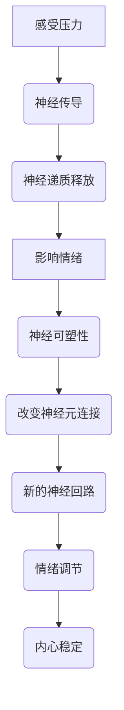
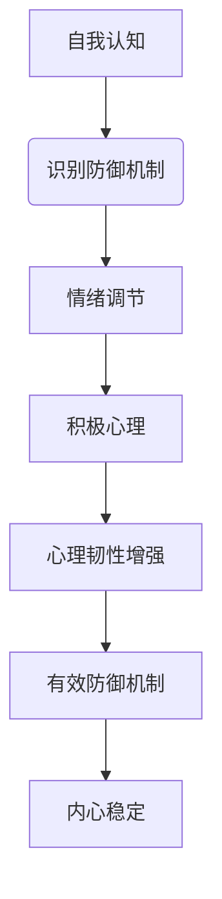
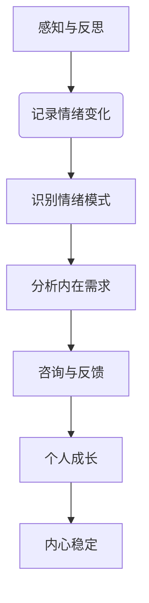
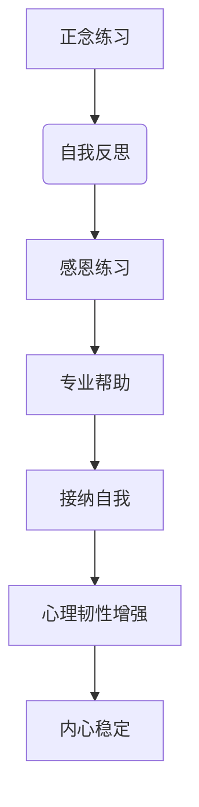
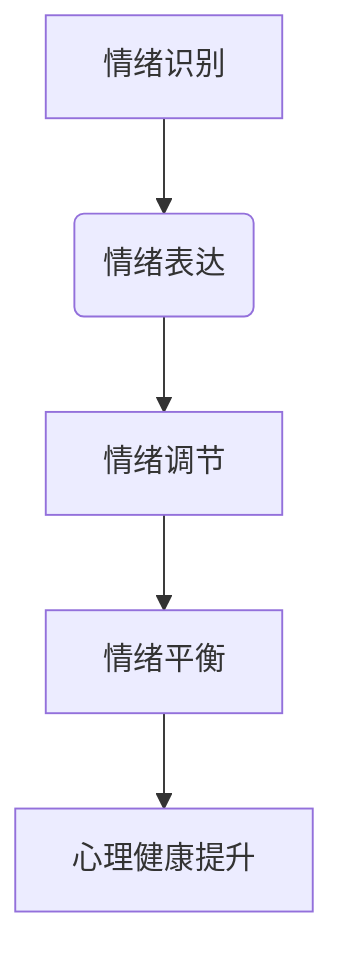
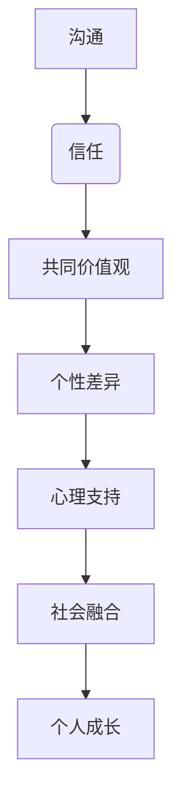
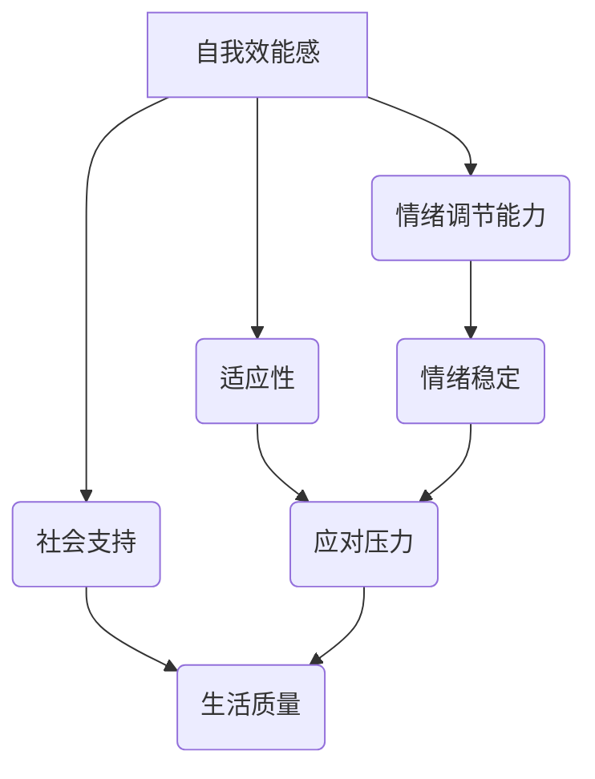

                 

### 第一部分：引言与概述

在快速变化的信息时代，技术的不断进步和社会结构的深刻调整，使得人们在生活的各个方面面临着前所未有的挑战。尤其是在IT领域，技术更新迅速，竞争激烈，使得从业者在追求卓越的同时，也常常感受到来自外界的压力和内心的不安。在这种背景下，内心的稳定成为了一种宝贵的精神资源，不仅影响着个体的心理健康，也关系到整个社会的和谐发展。

本篇文章旨在探讨“精神的锚点：在变化中保持内心稳定”这一主题，深入分析内心稳定的重要性和内在机制，并提供具体的实践方法。通过系统的分析和逻辑推理，我们将探讨以下几个关键问题：

- 内心稳定的概念及其在现代社会中的意义
- 神经系统和心理防御机制在情绪调节中的作用
- 自我认知与自我接纳如何帮助人们维持内心稳定
- 情绪管理及调节技巧的有效实践
- 积极人际关系对内心稳定的影响
- 心理韧性与压力应对的策略

通过对上述问题的探讨，本文将试图构建一个全面、系统的内心稳定理论框架，并为读者提供实用的方法和策略，以帮助他们更好地应对生活中的挑战，保持内心的平静和稳定。

### 第一部分：引言与概述

#### 第1章：精神的锚点：内心稳定的重要性

在当今这个快速变化的世界，我们面临着许多挑战，无论是工作上的压力，还是生活节奏的加快，都在不断地考验着我们的心理韧性。内心稳定，作为精神世界的锚点，对于个体的身心健康以及社会的发展都具有重要意义。

#### 1.1 心灵世界的探索

首先，让我们对“内心稳定”这一概念进行深入的探索。内心稳定不仅仅是简单的情绪平衡，它涉及到心理、生理、社会等多个层面的综合状态。它是一种心理弹性，使我们能够在面对外部压力和挑战时保持冷静和理智。

#### 1.1.1 精神锚点的概念

精神锚点，可以被看作是心理韧性的一种体现，它是指个体在面对不确定性和逆境时，能够保持心理平衡和稳定的一种内在力量。这种力量类似于船只的锚，即使在风浪中也能确保船只的位置不变。

#### 1.1.2 内心稳定的意义

内心稳定的重要性在于，它不仅直接影响个体的心理健康，如减少焦虑、抑郁等负面情绪，还能够提升个体的生活质量和工作效率。从更广泛的社会角度来看，内心稳定是构建和谐社会的重要基础。

#### 1.1.3 心理学中的相关理论

心理学中，许多理论都涉及到了内心稳定的概念。例如，积极心理学强调个体内在的积极力量，通过培养乐观态度和积极情感来提高心理韧性；认知行为疗法则通过改变负面的认知模式来调节情绪，从而实现内心的稳定。

#### 第2章：内心稳定的内在机制

在理解了内心稳定的重要性后，接下来我们需要探讨其内在机制，即是什么因素使得个体能够保持内心的稳定。

#### 2.1 神经系统与情绪调节

神经系统作为我们身体和精神的桥梁，对于情绪调节起着至关重要的作用。以下将详细探讨神经系统的工作原理及其在情绪调节中的具体作用。

### 2.1.1 神经系统的工作原理

神经系统包括中枢神经系统和外周神经系统。中枢神经系统由大脑和脊髓组成，负责接收、处理和传递信息。外周神经系统则包括神经节和神经纤维，负责将信息从中枢神经系统传递到全身各个部位。

#### 2.1.2 情绪调节的生物学基础

情绪调节的生物学基础主要涉及神经递质的作用。神经递质是神经元之间传递信息的化学物质，如多巴胺、血清素等，它们在不同程度上影响着我们的情绪和行为。

#### 2.1.3 神经可塑性在内心稳定中的作用

神经可塑性是指神经系统在外界刺激或内在需求下，通过改变神经元连接和活动模式来适应环境和需求的能力。这种能力使得我们能够在经历创伤或面对变化时，通过调整神经系统来维持内心的稳定。

#### 第3章：心理防御机制

除了神经系统的调节作用外，心理防御机制也是内心稳定的重要组成部分。以下是心理防御机制的详细探讨。

### 2.2 心理防御机制

心理防御机制是心理学中用来解释个体如何应对心理冲突和压力的理论。以下是几种常见的心理防御机制：

#### 2.2.1 自我防御机制的类型

自我防御机制包括否认、投射、合理化等。例如，否认是指个体拒绝接受某些不愉快的现实；投射则是将内心的负面情绪或想法归咎于他人。

#### 2.2.2 防御机制的功能与局限性

防御机制在一定程度上可以帮助个体应对压力和冲突，但过度使用或不当使用则可能导致心理问题。因此，了解防御机制的功能和局限性对于维持内心稳定至关重要。

#### 2.2.3 如何建立有效的心理防御机制

建立有效的心理防御机制需要个体的自我认知和积极心理调节。通过心理咨询和自我反思，个体可以逐步学会如何更健康地应对压力和挑战。

通过上述分析，我们可以看到，内心稳定不仅是一个心理现象，它还涉及到复杂的生理机制和多样的心理防御策略。在接下来的章节中，我们将进一步探讨自我认知与自我接纳、情绪管理和人际关系等具体实践方法，帮助读者在实际生活中更好地保持内心的稳定。

### 神经系统与情绪调节

#### 2.1.1 神经系统的工作原理

神经系统是人体的重要组成部分，它不仅负责处理信息，还控制着人体的各种生理功能。神经系统由中枢神经系统和外周神经系统组成。中枢神经系统包括大脑和脊髓，大脑是神经系统的核心，负责处理复杂的信息，如思考、记忆、情绪等；脊髓则负责传递信息，连接大脑和身体的其他部分。外周神经系统则包括神经节和神经纤维，它们分布在全身各个部位，负责传递感觉信息和运动指令。

#### 2.1.2 情绪调节的生物学基础

情绪调节的生物学基础主要依赖于神经递质的作用。神经递质是神经元之间传递信息的化学物质，如多巴胺、血清素、去甲肾上腺素等。这些神经递质在不同程度上影响着我们的情绪和行为。例如，多巴胺与奖赏和愉悦感相关，血清素与情绪稳定和幸福感相关。当这些神经递质在神经元之间传递时，它们可以增强或抑制神经元的活性，从而影响我们的情绪状态。

#### 2.1.3 神经可塑性在内心稳定中的作用

神经可塑性是指神经系统在外界刺激或内在需求下，通过改变神经元连接和活动模式来适应环境和需求的能力。这种能力在情绪调节中起着至关重要的作用。例如，当我们经历压力或创伤时，神经可塑性可以使神经系统通过新的神经元连接和活动模式来调节情绪，从而帮助我们维持内心的稳定。

神经可塑性表现在多个层面，包括结构可塑性、连接可塑性和功能可塑性。结构可塑性涉及神经元形态的改变，如树突的延伸或神经突触的建立；连接可塑性涉及神经元之间连接的加强或减弱；功能可塑性则是指神经网络活动的改变，如特定的神经回路在经历特定训练后变得更为活跃。

### Mermaid 流程图：神经可塑性的作用机制



通过上述流程图，我们可以看到，当个体感受到压力时，神经系统会通过传导、释放神经递质来影响情绪。在这个过程中，神经可塑性起到了关键作用，通过改变神经元连接和活动模式，帮助个体实现情绪调节，最终达到内心的稳定。

### 心理防御机制

#### 2.2.1 自我防御机制的类型

心理防御机制是心理学中的一个重要概念，它描述了个体在面对心理冲突和压力时，为了减轻焦虑和痛苦而采取的心理策略。常见的自我防御机制包括否认、投射、合理化等。

- **否认**：个体拒绝接受某些不愉快的事实，以保护自己免受心理上的冲击。例如，当一个人失去工作时，他可能会否认这个事实，认为自己仍然有工作。

- **投射**：个体将自己的负面情绪、想法或冲动归咎于他人。例如，当一个人对自己的愤怒情绪感到不安时，他可能会认为别人对他有敌意。

- **合理化**：个体用合理的理由来解释自己的行为或感受，以减轻内心的不安。例如，一个人因为迟到而感到内疚，他可能会告诉自己路上交通堵塞。

#### 2.2.2 防御机制的功能与局限性

防御机制在一定程度上有助于个体应对压力和冲突，维持心理平衡。它们可以减轻焦虑和痛苦，帮助个体在逆境中保持稳定。然而，过度使用或不当使用防御机制可能导致心理问题。

- **功能**：防御机制可以在短期内提供心理支持，帮助个体应对危机。例如，在极端压力下，否认可以暂时使个体避免面对现实的残酷。

- **局限性**：长期依赖防御机制会导致个体无法面对现实问题，阻碍个人成长。例如，如果一个人长期使用投射来应对负面情绪，他可能会忽视自己内心的真实感受，导致心理健康问题。

#### 2.2.3 如何建立有效的心理防御机制

建立有效的心理防御机制需要个体的自我认知和积极心理调节。以下是一些方法：

- **自我认知**：通过自我反思和心理咨询，个体可以更好地了解自己的情绪、需求和动机。这有助于识别和减少不健康的防御机制。

- **情绪调节**：学习情绪调节技巧，如深呼吸、正念冥想和认知重构，可以帮助个体更好地应对压力和冲突。

- **积极心理**：培养乐观态度和积极情感，增强心理韧性。这可以通过积极心理学的方法实现，如感恩练习和目标设定。

### Mermaid 流程图：建立有效心理防御机制的过程



通过上述流程图，我们可以看到，建立有效的心理防御机制需要从自我认知、情绪调节和积极心理三个方面入手，逐步增强个体的心理韧性，最终实现内心的稳定。

### 自我认知的重要性

自我认知是内心稳定的重要组成部分，它涉及到个体对自己内在思想、情感和行为模式的了解和认识。通过自我认知，个体能够更好地理解自己的需求和动机，从而在面对外部压力时，能够做出更理性的决策，维持内心的平衡。

#### 3.1.1 自我认知的定义

自我认知是指个体通过感知、分析和理解自己的内在世界，包括思想、情感、动机和价值观等。它不仅包括对外在行为的观察和反思，更重要的是对内在心理过程的认知。例如，当一个人意识到自己因焦虑而感到不安时，他已经在进行自我认知。

#### 3.1.2 自我认知的重要性

自我认知对于内心稳定具有至关重要的意义。以下是几个关键点：

- **情感管理**：通过自我认知，个体能够更好地识别和理解自己的情绪，从而有效地管理和调节情绪。例如，当个体意识到自己因工作压力而感到焦虑时，可以采取适当的放松技巧来缓解情绪。

- **冲突解决**：自我认知有助于个体识别和解决内在冲突。通过理解自己的需求和动机，个体可以更清晰地认识到哪些是合理的期望，哪些是不切实际的，从而在冲突中找到平衡点。

- **个人成长**：自我认知促使个体反思自己的行为和思想，从而有机会进行自我改进和成长。这种持续的反思和改进有助于个体形成更加健康和积极的内心状态。

#### 3.1.3 如何进行自我认知

进行自我认知需要一定的方法和实践。以下是几个步骤：

1. **反思**：定期花时间进行自我反思，思考自己的行为、情绪和思维模式。可以通过写日记或与朋友、心理咨询师交流来帮助自己更好地理解自己的内心世界。

2. **情绪记录**：记录自己的情绪变化，观察情绪的起因和影响。这有助于识别情绪的模式，并找到应对策略。

3. **心理咨询**：寻求专业心理咨询师的帮助，通过专业的指导和反馈，更深入地了解自己的内在需求和动机。

4. **正念冥想**：通过正念冥想，个体可以培养对自己的思维和情绪的觉察，从而提高自我认知能力。

### Mermaid 流�程图：自我认知的过程



通过上述流程图，我们可以看到，自我认知的过程包括感知与反思、情绪记录、识别情绪模式、分析内在需求、咨询与反馈以及个人成长。这一过程有助于个体更好地理解自己，从而在内心不稳定时找到平衡点，实现内心的稳定。

### 自我接纳的实践

自我接纳是指个体对自己无条件地接受和尊重，无论外在环境如何变化，都保持对自己的正面态度。自我接纳是内心稳定的重要基础，因为它能够帮助个体在面对挑战和困难时保持内心的平静和坚定。

#### 3.2.1 自我接纳的概念

自我接纳是一种心理健康状态，它要求个体接受自己的全部，包括优点和缺点、成功和失败。这种接纳不仅仅是表面的认可，而是深入内心的，意味着个体能够无条件地爱自己和接受自己。自我接纳的核心在于认识到每个人都是独特的，都有自己的价值和意义。

#### 3.2.2 自我接纳的好处

自我接纳对个体的心理健康和生活质量有着显著的积极影响。以下是几个关键点：

- **减少自我批评**：自我接纳可以减少自我批评和负面自我评价，从而降低焦虑和抑郁的风险。

- **提高自尊**：自我接纳有助于个体建立健康的自尊，使他们更加自信和自尊，从而在社交和职业环境中更加成功。

- **增强心理韧性**：自我接纳能够增强个体的心理韧性，使其在面对压力和挑战时能够保持内心的稳定。

- **改善人际关系**：自我接纳使个体能够更真实地表达自己，从而建立更健康、更深入的人际关系。

#### 3.2.3 如何培养自我接纳

培养自我接纳需要时间和实践，以下是一些具体的策略：

1. **正念练习**：通过正念练习，如正念冥想和正念呼吸，个体可以学会在当下接受自己，而不是不断评判和否定自己。

2. **自我反思**：定期进行自我反思，思考自己的行为、情绪和思维模式，并尝试用更积极、更接纳的方式看待自己。

3. **感恩练习**：通过记录和表达自己的感恩，个体可以培养对自己和生活的欣赏，从而增强自我接纳。

4. **专业帮助**：寻求心理咨询师的帮助，通过专业的指导和支持，个体可以更深入地理解自我接纳的重要性，并学会如何在实际生活中实践。

### Mermaid 流程图：培养自我接纳的过程



通过上述流程图，我们可以看到，培养自我接纳的过程包括正念练习、自我反思、感恩练习和专业帮助，这些方法有助于个体逐渐接纳自己，从而增强心理韧性，最终实现内心的稳定。

### 情绪管理的意义

情绪管理是指个体在面对情绪波动时，通过一系列策略和技巧来调节情绪，以达到情绪平衡和心理稳定。在现代社会中，情绪管理的重要性愈发凸显，原因如下：

#### 4.1.1 情绪管理的定义

情绪管理是指个体识别、理解并调节自身情绪的过程。它不仅包括对情绪的认知，还包括采取积极的策略来应对负面情绪。情绪管理不仅仅是抑制情绪，更重要的是找到有效的方法来处理和表达情绪。

#### 4.1.2 情绪管理的重要性

情绪管理对个体心理健康和生活质量具有深远的影响。以下是几个关键点：

- **减少心理压力**：通过情绪管理，个体可以更好地应对压力和挑战，从而减少心理压力和焦虑。

- **提升生活质量**：有效的情绪管理能够提升个体的生活满意度和幸福感，使其在各个方面都表现出色。

- **促进人际关系**：情绪管理有助于个体在人际交往中保持和谐，减少冲突，建立更健康的人际关系。

- **提高工作效率**：情绪稳定能够提升个体的工作效率和生产力，使其在工作和学习中更加专注和高效。

#### 4.1.3 情绪管理的目标

情绪管理的目标主要包括以下几个方面：

- **情绪识别**：能够准确地识别和理解自己的情绪，包括正面情绪和负面情绪。

- **情绪表达**：找到健康、合适的方式表达情绪，而不是压抑或过度表达。

- **情绪调节**：运用有效的策略和技巧来调节情绪，使其在适当的范围内波动，而不是失控或过度波动。

- **情绪平衡**：通过情绪管理，达到情绪的长期稳定和平衡，从而维持心理健康。

### Mermaid 流程图：情绪管理的目标



通过上述流程图，我们可以看到，情绪管理的目标是从情绪识别、情绪表达到情绪调节，最终实现情绪平衡，从而达到心理健康的提升。

### 情绪调节的方法

情绪调节是情绪管理的关键步骤，它涉及到一系列策略和技巧，帮助个体在情绪波动时保持冷静和理智。以下是一些常见的情绪调节方法：

#### 4.2.1 认知重构

认知重构是一种通过改变思维方式来调节情绪的方法。它基于心理学中的认知行为疗法，认为情绪是由我们对事件的认知和解释决定的，而不是事件本身。以下是一个简单的认知重构过程：

1. **识别负面思维**：首先，个体需要识别和意识到自己正在经历的负面思维模式，如“我永远做不好这件事”或“别人都会嘲笑我”。

2. **质疑负面思维**：接下来，个体需要质疑这些负面思维，并探索其合理性和有效性。例如，可以问自己：“这个想法真的有根据吗？”或“我能否找到更积极的解释？”

3. **建立积极思维**：最后，个体需要用积极的、理性的思维来替代负面思维。例如，可以告诉自己：“我之前已经成功完成了类似的任务，这次我也一定能做到”或“每个人都有失败的时候，这次失败不会影响我的整体表现”。

#### 4.2.2 情绪释放技巧

情绪释放技巧是指通过身体活动或心理技巧来释放和缓解负面情绪。以下是一些常见的情绪释放技巧：

- **深呼吸**：深呼吸是一种简单有效的情绪释放技巧，通过深吸气和缓慢呼气，可以帮助个体放松身体，缓解紧张和焦虑。

  ```python
  import time

  def deep_breathing():
      for _ in range(3):  # 深吸气3次
          time.sleep(5)  # 每次持续5秒
          print("深吸一口气...")
      for _ in range(3):  # 缓慢呼气3次
          time.sleep(5)  # 每次持续5秒
          print("慢慢地呼出空气...")

  # 使用示例
  deep_breathing()
  ```

- **哭泣**：哭泣是一种自然的情绪释放方式，可以帮助个体释放积压的情绪，减轻内心的负担。

- **运动**：通过有氧运动，如跑步、游泳或健身，可以帮助释放身体内的紧张和焦虑，同时提升情绪。

  ```python
  import time

  def physical_exercise(duration):
      print(f"开始进行{duration}分钟的有氧运动...")
      time.sleep(duration * 60)  # 假设运动持续时长为duration分钟
      print("运动结束，感觉更加轻松和放松！")

  # 使用示例
  physical_exercise(30)  # 进行30分钟的有氧运动
  ```

#### 4.2.3 情绪调节练习

情绪调节练习是指通过一系列有针对性的练习来提升个体的情绪调节能力。以下是一些常见的情绪调节练习：

- **正念冥想**：正念冥想是一种通过专注和觉察来调节情绪的练习。它可以帮助个体培养对当前情绪的觉察，从而更好地管理和调节情绪。

  ```python
  import time

  def mindfulness_meditation(duration):
      print(f"开始进行{duration}分钟的正念冥想...")
      time.sleep(duration * 60)  # 假设冥想持续时长为duration分钟
      print("冥想结束，感觉更加平静和宁静！")

  # 使用示例
  mindfulness_meditation(10)  # 进行10分钟的正念冥想
  ```

- **情绪日记**：通过记录自己的情绪变化和触发事件，个体可以更好地理解自己的情绪模式，并找到有效的调节方法。

  ```python
  import datetime

  def emotion_diary():
      current_time = datetime.datetime.now()
      print(f"{current_time}: 今天我感到很焦虑，因为工作压力很大。")
      print("下一步，我会尝试深呼吸和冥想来缓解情绪。")

  # 使用示例
  emotion_diary()
  ```

通过上述方法，个体可以在日常生活中逐步提升情绪调节能力，从而在面对情绪波动时更加从容和冷静。

### 建立积极的人际关系

#### 5.1 人际关系的心理基础

人际关系是指个体在社会交往中建立和维护的各种关系，如家庭关系、友谊和职业关系等。这些关系对个体的心理健康和生活质量有着深远的影响。以下是人际关系的一些关键心理基础：

#### 5.1.1 人际关系的定义

人际关系是指个体之间通过相互交往、互动和影响而建立起来的心理和情感联系。它不仅仅局限于面对面的互动，还包括通过电话、互联网等媒介进行的交流。

#### 5.1.2 人际关系的重要性

人际关系的重要性体现在以下几个方面：

- **心理健康**：积极的人际关系有助于减轻心理压力，降低抑郁和焦虑的风险，提升个体的心理健康水平。

- **情感支持**：在困难时期，人际关系可以提供情感支持和安慰，使个体感到被理解和接纳。

- **社会融合**：良好的人际关系有助于个体融入社会，增强归属感和自尊心。

- **个人成长**：通过人际关系，个体可以学习到新的观点和技能，促进个人成长和发展。

#### 5.1.3 人际关系的影响因素

人际关系的发展受到多种因素的影响，包括：

- **沟通**：有效的沟通是建立和维护人际关系的基础。清晰的沟通可以减少误解和冲突，增强信任和理解。

- **信任**：信任是人际关系中最重要的因素之一。信任的存在可以减少猜疑和紧张，增强关系的稳定性。

- **共同价值观**：共享相似的价值观和兴趣可以加深人际关系，使其更加牢固。

- **个性差异**：尽管个性差异可能带来挑战，但适当的理解和尊重可以促进关系的和谐。

### Mermaid 流程图：人际关系的影响因素



通过上述流程图，我们可以看到，沟通、信任、共同价值观和个性差异是影响人际关系的关键因素。这些因素相互作用，共同决定人际关系的质量。

#### 5.2 建立积极的人际关系的技巧

建立积极的人际关系需要一系列的技巧和策略。以下是一些关键技巧：

#### 5.2.1 有效沟通

有效沟通是建立积极人际关系的基础。以下是一些有效沟通的技巧：

- **倾听**：倾听是沟通的关键。通过认真倾听对方的意见和感受，可以增进理解和信任。

  ```python
  def active_listener():
      print("我正在认真听你说话，请继续。")
      # 假设这里有一个接收信息的输入函数
      user_input = input()
      print(f"你刚才提到的是：{user_input}")

  # 使用示例
  active_listener()
  ```

- **清晰表达**：在表达自己的意见和感受时，应尽量清晰、简洁地表达，避免产生误解。

  ```python
  def clear_communication():
      print("我希望你能明白我的意思，所以我会尽量用简单清晰的语言来表达。")
      message = input("你想说什么？")
      print(f"你的信息是：{message}")

  # 使用示例
  clear_communication()
  ```

- **非语言沟通**：非语言沟通，如肢体语言、面部表情和语调，也是沟通的重要组成部分。适当的非语言沟通可以增强语言表达的效果。

  ```python
  import time

  def nonverbal_communication():
      print("现在我会用一些非语言的信号来表达我的想法。")
      time.sleep(3)
      print("我在微笑，这表示我对我们的对话感到满意。")
      time.sleep(2)
      print("我现在点头，这表示我理解你的观点。")

  # 使用示例
  nonverbal_communication()
  ```

#### 5.2.2 建立信任

建立信任是人际关系中至关重要的一环。以下是一些建立信任的技巧：

- **一致性**：在行为和言语上保持一致性，有助于建立信任。个体应尽量做到言行一致，避免给人以虚假的印象。

  ```python
  def consistent_behavior():
      print("我会保持一致的行为和言语，这样你才能信任我。")
      print("比如，我会按时完成我承诺的事情。")

  # 使用示例
  consistent_behavior()
  ```

- **诚实与透明**：诚实和透明是建立信任的基础。个体应尽可能诚实地表达自己的想法和感受，并在必要时提供相关信息。

  ```python
  def honesty_and_transparency():
      print("我会诚实地告诉你我所知道的一切，并保持透明。")
      secret = input("有什么秘密或信息需要分享吗？")
      print(f"你分享的信息是：{secret}")

  # 使用示例
  honesty_and_transparency()
  ```

- **尊重与理解**：尊重对方的观点和感受，并尝试从对方的角度理解问题，有助于建立信任。

  ```python
  def respect_and_understanding():
      print("我会尊重你的观点，并努力理解你的感受。")
      opinion = input("你有什么观点或感受需要分享吗？")
      print(f"你分享的观点是：{opinion}")

  # 使用示例
  respect_and_understanding()
  ```

#### 5.2.3 处理冲突

冲突是人际关系中不可避免的一部分。有效处理冲突是维持积极人际关系的关键。以下是一些处理冲突的技巧：

- **冷静处理**：在冲突发生时，保持冷静是非常重要的。通过冷静地分析问题和寻找解决方案，可以减少冲突的激烈程度。

  ```python
  def calm_deal_with_conflicts():
      print("我会保持冷静，并尽量用理性的方式处理冲突。")
      print("请你也保持冷静，让我们一起找到解决问题的方法。")

  # 使用示例
  calm_deal_with_conflicts()
  ```

- **沟通与对话**：通过开放和诚实的沟通，个体可以表达自己的观点和感受，并听取对方的意见。这种对话有助于解决冲突，并增进理解和信任。

  ```python
  def communication_dialogue():
      print("我们现在可以进行开放和诚实的对话，讨论冲突的根源。")
      issue = input("你想讨论哪个问题？")
      print(f"你提到的问题是：{issue}")

  # 使用示例
  communication_dialogue()
  ```

- **寻求共识**：在处理冲突时，寻求共识是达成解决方案的重要步骤。通过寻找双方都能接受的妥协方案，可以缓和冲突并维持关系的和谐。

  ```python
  def seek_commonground():
      print("我们现在来寻找一个双方都能接受的解决方案。")
      solution = input("你认为我们可以达成什么样的共识？")
      print(f"你提出的解决方案是：{solution}")

  # 使用示例
  seek_commonground()
  ```

通过上述技巧，个体可以在日常生活中逐步提升沟通技巧、建立信任和处理冲突的能力，从而建立和维护积极的人际关系，提升生活质量。

### 心理韧性与压力应对

#### 6.1 心理韧性的概念

心理韧性是指个体在面对逆境、压力和挑战时，能够迅速适应并恢复的能力。它不仅仅是一种应对机制，更是一种心理资源，能够帮助个体在困境中保持积极和稳定的情绪状态。心理韧性并非天生具备，而是可以通过后天的培养和实践逐步提升。

#### 6.1.1 心理韧性的重要性

心理韧性对个体的心理健康和整体生活质量具有深远的影响。以下是几个关键点：

- **应对压力**：具有高心理韧性的人能够更好地应对生活中的各种压力，如工作压力、人际关系冲突、经济困难等。他们能够保持冷静和理智，从而找到解决问题的有效途径。

- **恢复能力**：心理韧性强的个体在面对逆境时，能够更快地恢复和适应。他们不仅能够从挫折中恢复过来，还能够从中学到宝贵的经验和教训。

- **情绪稳定**：高心理韧性有助于个体在压力和挑战中保持情绪稳定。他们不容易受到负面情绪的影响，能够更积极、更乐观地面对生活中的挑战。

- **生活质量**：心理韧性良好的个体在生活质量上表现出色。他们能够更好地享受生活，拥有更高的幸福感和满足感。

#### 6.1.2 心理韧性的构成要素

心理韧性由多个构成要素组成，以下是其中的几个关键要素：

- **自我效能感**：自我效能感是指个体对自己完成特定任务的信心和能力。高自我效能感的人相信自己能够应对挑战，从而在逆境中保持积极的态度。

- **情绪调节能力**：情绪调节能力是指个体管理自身情绪的能力。高情绪调节能力的人能够有效地应对负面情绪，保持情绪的稳定和平衡。

- **适应性**：适应性是指个体在面对变化和不确定性时的适应能力。具有高适应性的个体能够迅速适应新环境和新挑战，从而保持内心的稳定。

- **社会支持**：社会支持是指个体在社会关系中获得的支持和帮助。强大的社会支持网络有助于个体在逆境中获取心理资源，从而增强心理韧性。

#### 6.1.3 心理韧性的构成要素架构图

以下是心理韧性的构成要素架构图，展示了各要素之间的关系：



通过上述架构图，我们可以看到，自我效能感、情绪调节能力、适应性和社会支持是构成心理韧性的关键要素。这些要素相互关联，共同作用于个体的心理韧性，从而影响其应对压力、恢复能力和生活质量。

### 压力应对的策略

应对压力是提升心理韧性、保持内心稳定的重要环节。以下是几种有效的压力应对策略：

#### 6.2.1 识别压力源

识别压力源是应对压力的第一步。只有明确了压力的来源，个体才能有针对性地采取应对措施。以下是几种识别压力源的方法：

- **日志记录**：通过记录每日的生活和工作情况，个体可以识别出导致压力的主要事件和情境。以下是一个简单的日志记录示例：

  ```python
  import datetime

  def stress_diary():
      current_time = datetime.datetime.now()
      print(f"{current_time}: 开始记录今天的压力源。")
      stress_source = input("今天你感受到的主要压力源是什么？")
      print(f"记录的压力源：{stress_source}")
      print("接下来，我会记录下你应对压力的方法。")

  # 使用示例
  stress_diary()
  ```

- **思维导图**：通过绘制思维导图，个体可以直观地展示压力源及其相互关系。以下是一个简单的思维导图示例：

  ```mermaid
  graph TD
  A[工作压力]
  B[人际关系]
  C[财务问题]
  D[健康问题]
  A --> B
  A --> C
  A --> D
  B --> C
  B --> D
  C --> D
  ```

#### 6.2.2 压力管理技巧

在识别了压力源之后，个体需要采取有效的压力管理技巧来缓解压力。以下是一些常用的压力管理技巧：

- **深呼吸**：深呼吸是一种简单有效的压力缓解技巧。通过缓慢、深长的呼吸，个体可以放松身体，减轻紧张和焦虑。以下是一个简单的深呼吸练习：

  ```python
  import time

  def deep_breathing():
      print("现在开始深呼吸练习，请跟随我的指示：")
      for _ in range(3):  # 深吸气3次
          time.sleep(5)  # 每次持续5秒
          print("深吸一口气...")
      for _ in range(3):  # 缓慢呼气3次
          time.sleep(5)  # 每次持续5秒
          print("慢慢地呼出空气...")

  # 使用示例
  deep_breathing()
  ```

- **正念冥想**：正念冥想是一种通过专注和觉察来减轻压力的方法。以下是一个简单的正念冥想练习：

  ```python
  import time

  def mindfulness_meditation(duration):
      print(f"现在开始进行{duration}分钟的正念冥想：")
      time.sleep(duration * 60)  # 假设冥想持续时长为duration分钟
      print("冥想结束，感觉更加平静和放松！")

  # 使用示例
  mindfulness_meditation(10)  # 进行10分钟的正念冥想
  ```

- **运动**：通过运动，如跑步、游泳或健身，个体可以释放压力，提升情绪。以下是一个简单的运动计划：

  ```python
  import time

  def physical_exercise(duration):
      print(f"开始进行{duration}分钟的有氧运动：")
      time.sleep(duration * 60)  # 假设运动持续时长为duration分钟
      print("运动结束，感觉更加轻松和放松！")

  # 使用示例
  physical_exercise(30)  # 进行30分钟的有氧运动
  ```

#### 6.2.3 增强心理韧性的方法

增强心理韧性需要个体的持续努力和实践。以下是一些有效的方法：

- **自我认知**：通过自我认知，个体可以更好地了解自己的情绪、需求和动机。以下是一个简单的自我认知练习：

  ```python
  import time

  def self_reflection():
      print("现在开始自我反思练习：")
      time.sleep(5)
      emotion = input("你现在的主要情绪是什么？")
      need = input("你现在最需要的是什么？")
      motivation = input("你的主要动机是什么？")
      print(f"情绪：{emotion}，需求：{need}，动机：{motivation}")

  # 使用示例
  self_reflection()
  ```

- **积极心理训练**：通过积极心理训练，如感恩练习和目标设定，个体可以培养积极的心态和应对能力。以下是一个简单的积极心理训练：

  ```python
  import time

  def positive_psychology_training():
      print("现在开始积极心理训练：")
      time.sleep(5)
      print("请记录下你今天的三件感恩事物：")
      gratitude1 = input("第一件：")
      gratitude2 = input("第二件：")
      gratitude3 = input("第三件：")
      print(f"感恩事物：{gratitude1}，{gratitude2}，{gratitude3}")
      print("接下来，设定一个短期目标：")
      goal = input("你的短期目标是什么？")
      print(f"目标：{goal}")

  # 使用示例
  positive_psychology_training()
  ```

通过上述策略和方法的实践，个体可以逐步提升心理韧性，更好地应对生活中的压力和挑战，保持内心的稳定和积极。

### 总结与展望

#### 7.1 内心稳定的重要性回顾

内心稳定作为精神世界的锚点，对个体和社会均具有重要影响。通过本文的探讨，我们可以看到内心稳定不仅关乎个体的心理健康和幸福感，还直接影响人际关系和社会和谐。以下是内心稳定的重要益处：

1. **心理健康**：内心稳定有助于减轻焦虑、抑郁等负面情绪，提升心理健康水平。
2. **生活质量**：保持内心的稳定能够提升个体的生活质量，使其更好地享受生活。
3. **社会和谐**：内心稳定有助于建立和谐的人际关系，减少冲突和误解，促进社会和谐。
4. **应对压力**：内心稳定能够增强个体的心理韧性，使其在面对压力和挑战时更加从容和冷静。

#### 7.1.1 内心稳定的益处

内心稳定带来的益处不仅限于个人层面，还对社会有着深远的影响。以下是几个具体方面：

- **提高工作效率**：内心稳定的个体在工作和学习中更加专注和高效，能够更好地完成任务和目标。
- **促进人际关系**：内心稳定的个体能够更好地理解和沟通他人，建立积极的人际关系。
- **减少医疗支出**：内心稳定有助于减少心理健康问题的发生，从而降低医疗支出。
- **提升社会凝聚力**：内心稳定有助于建立和谐的社会环境，增强社会凝聚力。

#### 7.1.2 内心稳定对社会的影响

内心稳定对社会的影响是多方面的，以下是一些具体表现：

- **教育**：内心稳定的教师能够更好地传授知识，培养学生健全的人格和心理素质。
- **经济**：内心稳定的个体能够更好地适应市场经济的变化，为社会经济发展做出贡献。
- **公共安全**：内心稳定有助于减少暴力犯罪和安全事故，提升社会公共安全水平。
- **国际合作**：内心稳定的个体能够更好地进行国际合作，促进全球和平与发展。

#### 7.1.3 内心稳定对个人发展的影响

内心稳定对个人发展有着深远的影响，以下是一些具体方面：

- **职业发展**：内心稳定的个体在职业生涯中能够更好地应对挑战，取得更高的成就。
- **人际关系**：内心稳定的个体能够建立和维护更健康、更深入的人际关系，提升生活质量。
- **心理健康**：内心稳定的个体能够更好地管理自己的情绪和压力，保持心理健康。
- **个人成长**：内心稳定的个体能够更好地进行自我反思和自我改进，实现个人成长。

#### 7.2 未来展望

展望未来，心理学和内心稳定的实践将面临诸多挑战和机遇。以下是几个方面的未来趋势：

1. **心理学研究的发展**：随着技术的进步，心理学研究将更加精准和深入，为我们提供更多关于内心稳定的科学依据。
2. **心理健康教育的普及**：心理健康教育将在学校、企业和社区中更加普及，帮助更多人了解和掌握内心稳定的技巧。
3. **心理治疗的创新**：基于神经科学和认知行为疗法的新方法和技术将不断涌现，为个体提供更有效的心理支持。
4. **数字心理健康工具的应用**：数字心理健康工具，如应用程序和在线平台，将更加普及，为个体提供便捷的心理支持。

#### 7.2.1 心理学领域的发展趋势

心理学领域的发展趋势将更加注重跨学科的研究和方法创新。以下是几个关键趋势：

- **神经科学的应用**：神经科学的研究将更加深入，为理解内心稳定的神经基础提供新的见解。
- **大数据分析**：通过大数据分析，心理学家可以更好地理解个体之间的心理差异，提供个性化的心理支持。
- **人工智能的结合**：人工智能技术将广泛应用于心理治疗和心理测评，为个体提供更加智能和高效的支持。

#### 7.2.2 内心稳定实践的未来

内心稳定实践的未来将更加注重个体和社会的整体健康。以下是几个方面的未来展望：

- **全民心理健康**：通过心理健康教育和预防措施，实现全民心理健康的目标。
- **社会支持体系的完善**：建立更加完善的社会支持体系，为心理健康问题提供全方位的支持。
- **数字化心理健康服务**：利用数字技术提供个性化的心理健康服务，提升心理健康服务水平。

#### 7.2.3 面对未来的挑战与机遇

面对未来，我们既面临着挑战，也迎来了机遇。以下是几个方面的挑战和机遇：

- **心理健康意识的提升**：提升公众对内心稳定和心理健康的认知，是未来的重要挑战。同时，这也是一个巨大的机遇，因为随着公众意识的提升，心理健康服务需求将大幅增长。
- **心理健康资源的分配**：如何公平、有效地分配心理健康资源，是一个长期挑战。同时，这也带来了机遇，通过技术创新和制度创新，可以更加合理地配置资源。
- **心理治疗的普及**：如何将心理治疗服务普及到更广泛的群体，是一个重要的挑战。通过数字化和远程治疗，这一目标有望实现。

### 附录

#### 附录A：心理学相关资源与工具

为了帮助读者进一步了解和掌握心理学知识和技巧，以下是一些推荐的资源与工具：

##### A.1 心理学研究资源

- **网站推荐**：
  - [APA（美国心理学会）官方网站](https://www.apa.org/)
  - [PsycNET（心理学数据库）](https://psycnet.apa.org/)
  - [PubMed（医学和生物医学数据库）](https://pubmed.ncbi.nlm.nih.gov/)

- **书籍推荐**：
  - 《心理学与生活》（Richard J. Gerrig, Philip G. Zimbardo）
  - 《认知心理学及其启示》（Daniel C. Osherson, Robert J. Lurz）
  - 《情绪心理学》（Randy J. Larsen, David M. Buss）

##### A.2 心理测评工具

- **在线测评工具**：
  - [Moodscope情绪测评](https://moodscope.com/)
  - [心理健康测试](https://www.mentalhealthscreening.org/)

- **心理测评软件**：
  - **Lazarus Q-sort**：一种用于评估个体情绪和态度的心理测评工具。
  - **Myers-Briggs Type Indicator (MBTI)**：一种用于评估个体性格类型的测评工具。

##### A.3 心理咨询资源

- **心理咨询热线**：
  - [中国心理健康网](http://www.cnpsych.org/)
  - [北京心理卫生协会心理咨询热线](http://www.bjsp.org.cn/)

- **专业心理咨询机构**：
  - [中德心理医院](http://www.zdwxy.com/)
  - [北京回龙观医院心理咨询中心](http://www.hrgh.org.cn/)

##### A.4 心理学书籍推荐

- **入门级书籍**：
  - 《心理学入门》（菲利普·津巴多）
  - 《心理学与生活》（理查德·吉尔伯特）

- **进阶级书籍**：
  - 《认知心理学及其启示》（丹尼尔·奥舍森）
  - 《情绪心理学》（兰迪·拉斯伦）

通过以上资源，读者可以进一步拓展自己的心理学知识，并在实际生活中应用所学，提升自己的内心稳定能力。

### 完整文章

#### 文章标题：精神的锚点：在变化中保持内心稳定

> 关键词：内心稳定、情绪调节、自我认知、心理韧性、人际关系、压力应对

> 摘要：本文探讨了内心稳定的重要性，分析了内心稳定的内在机制，包括神经系统、心理防御机制以及神经可塑性。此外，文章还介绍了自我认知与自我接纳、情绪管理及调节技巧、建立积极的人际关系以及心理韧性与压力应对等具体实践方法。通过这些方法，个体可以在快速变化的社会中保持内心的稳定，提升生活质量。

### 第一部分：引言与概述

在快速变化的信息时代，技术的不断进步和社会结构的深刻调整，使得人们在生活的各个方面面临着前所未有的挑战。尤其是在IT领域，技术更新迅速，竞争激烈，使得从业者在追求卓越的同时，也常常感受到来自外界的压力和内心的不安。在这种背景下，内心的稳定成为了一种宝贵的精神资源，不仅影响着个体的心理健康，也关系到整个社会的和谐发展。

本篇文章旨在探讨“精神的锚点：在变化中保持内心稳定”这一主题，深入分析内心稳定的重要性和内在机制，并提供具体的实践方法。通过系统的分析和逻辑推理，我们将探讨以下几个关键问题：

- 内心稳定的概念及其在现代社会中的意义
- 神经系统和心理防御机制在情绪调节中的作用
- 自我认知与自我接纳如何帮助人们维持内心稳定
- 情绪管理及调节技巧的有效实践
- 积极人际关系对内心稳定的影响
- 心理韧性与压力应对的策略

通过对上述问题的探讨，本文将试图构建一个全面、系统的内心稳定理论框架，并为读者提供实用的方法和策略，以帮助他们更好地应对生活中的挑战，保持内心的平静和稳定。

#### 第1章：精神的锚点：内心稳定的重要性

在当今这个快速变化的世界，我们面临着许多挑战，无论是工作上的压力，还是生活节奏的加快，都在不断地考验着我们的心理韧性。内心稳定，作为精神世界的锚点，对于个体的身心健康以及社会的发展都具有重要意义。

#### 1.1 心灵世界的探索

首先，让我们对“内心稳定”这一概念进行深入的探索。内心稳定不仅仅是简单的情绪平衡，它涉及到心理、生理、社会等多个层面的综合状态。它是一种心理弹性，使我们能够在面对外部压力和挑战时保持冷静和理智。

#### 1.1.1 精神锚点的概念

精神锚点，可以被看作是心理韧性的一种体现，它是指个体在面对不确定性和逆境时，能够保持心理平衡和稳定的一种内在力量。这种力量类似于船只的锚，即使在风浪中也能确保船只的位置不变。

#### 1.1.2 内心稳定的意义

内心稳定的重要性在于，它不仅直接影响个体的心理健康，如减少焦虑、抑郁等负面情绪，还能够提升个体的生活质量和工作效率。从更广泛的社会角度来看，内心稳定是构建和谐社会的重要基础。

#### 1.1.3 心理学中的相关理论

心理学中，许多理论都涉及到了内心稳定的概念。例如，积极心理学强调个体内在的积极力量，通过培养乐观态度和积极情感来提高心理韧性；认知行为疗法则通过改变负面的认知模式来调节情绪，从而实现内心的稳定。

#### 第2章：内心稳定的内在机制

在理解了内心稳定的重要性后，接下来我们需要探讨其内在机制，即是什么因素使得个体能够保持内心的稳定。

#### 2.1 神经系统与情绪调节

神经系统作为我们身体和精神的桥梁，对于情绪调节起着至关重要的作用。以下将详细探讨神经系统的工作原理及其在情绪调节中的具体作用。

#### 2.1.1 神经系统的工作原理

神经系统是人体的重要组成部分，它不仅负责处理信息，还控制着人体的各种生理功能。神经系统由中枢神经系统和外周神经系统组成。中枢神经系统包括大脑和脊髓，大脑是神经系统的核心，负责处理复杂的信息，如思考、记忆、情绪等；脊髓则负责传递信息，连接大脑和身体的其他部分。外周神经系统则包括神经节和神经纤维，它们分布在全身各个部位，负责传递感觉信息和运动指令。

#### 2.1.2 情绪调节的生物学基础

情绪调节的生物学基础主要依赖于神经递质的作用。神经递质是神经元之间传递信息的化学物质，如多巴胺、血清素、去甲肾上腺素等，它们在不同程度上影响着我们的情绪和行为。例如，多巴胺与奖赏和愉悦感相关，血清素与情绪稳定和幸福感相关。当这些神经递质在神经元之间传递时，它们可以增强或抑制神经元的活性，从而影响我们的情绪状态。

#### 2.1.3 神经可塑性在内心稳定中的作用

神经可塑性是指神经系统在外界刺激或内在需求下，通过改变神经元连接和活动模式来适应环境和需求的能力。这种能力在情绪调节中起着至关重要的作用。例如，当我们经历压力或创伤时，神经可塑性可以使神经系统通过新的神经元连接和活动模式来调节情绪，从而帮助我们维持内心的稳定。

神经可塑性表现在多个层面，包括结构可塑性、连接可塑性

