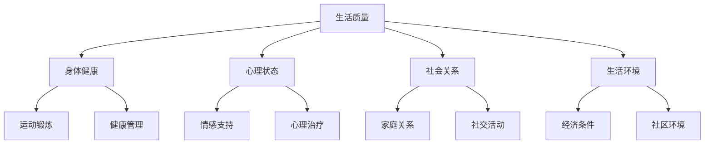

                 

### 引言

在当今社会，随着医疗技术和生活条件的不断改善，人类的平均寿命显著延长，老年人群体逐渐壮大。老年生活的质量不再仅仅取决于生物学上的健康，而是涉及生活的方方面面，包括心理、社交、经济和情感等方面。因此，重新定义晚年价值，探索老年生活的意义，已经成为一个亟需关注的重要课题。

#### 背景介绍

老年人群体的迅速增长，不仅对社会结构带来了深远的影响，也对家庭、医疗、养老等社会服务体系提出了新的挑战。传统的老年观念逐渐被打破，现代老年人不再满足于简单的颐养天年，他们渴望在晚年生活中继续发挥自身价值，保持身心健康，积极参与社会活动。这种趋势迫使社会各界重新审视老年生活的意义，并探索如何更好地支持和满足老年人的生活需求。

#### 核心概念与联系

为了更好地理解老年生活的意义，我们需要引入几个核心概念，并分析它们之间的联系：

1. **生活质量（Quality of Life）**：生活质量是评估个体生活满意度和幸福感的重要指标，它涵盖了身体健康、心理状态、社会关系和生活环境等多个维度。
   
2. **终身学习（Lifelong Learning）**：终身学习是指个体在其一生中持续地获取知识和技能，以适应社会变化和个人发展的需求。

3. **社会参与（Social Engagement）**：社会参与是指个体在社会活动中发挥积极作用，如志愿服务、社区活动等，它有助于增强老年人的社会归属感和生活意义。

4. **情感支持（Emotional Support）**：情感支持是指家庭、朋友和社会对老年人的关爱和陪伴，它对老年人的心理健康和生活满意度有重要影响。

以上四个核心概念共同构成了老年生活价值体系的基础，它们相互交织，共同影响着老年人的生活质量。

#### 文章关键词

- 老年生活
- 生活质量
- 终身学习
- 社会参与
- 情感支持

#### 文章摘要

本文旨在重新定义老年生活的价值，探讨老年生活的意义。通过分析老年生活的社会文化变迁、探索生活的意义、再发现生活的价值、终身学习的重要性、健康维护策略、家庭与社区支持，以及老年生活的创新实践，本文试图为老年人群体的生活提供新的视角和参考。文章通过引入生活质量指数、社会参与度指标等，结合具体案例，详细分析了老年生活的各个方面，旨在帮助老年人找到生活的意义，提升晚年生活的质量。

### 第一部分：老年生活新视角

在进入21世纪后，老年生活正经历着前所未有的变革。这一部分将探讨老年生活的社会文化变迁，以及现代老年人如何重构自己的价值观，面对社会对老年生活的期望与挑战。

#### 第1章：老年生活的社会文化变迁

随着全球社会的老龄化，老年人群体的规模不断扩大，这带来了深远的社会文化变迁。首先，人口结构的变化直接影响社会各阶层的人口比例。越来越多的老年人意味着劳动力市场的缩小和养老成本的上升。此外，家庭结构也在发生变化，传统的多代同堂家庭模式逐渐减少，代际间的交流和支持变得更加复杂。

#### 1.1 老年人群体的社会变迁

老年人群体的社会变迁体现在多个方面。首先，随着寿命的延长，老年人的健康状况和生活方式也在发生变化。越来越多的老年人保持活跃，积极参与社会活动，而不再是简单的休息和养身。其次，经济因素也成为影响老年生活的重要因素。许多老年人不再依赖子女，而是通过储蓄、投资等方式自给自足，甚至有的老年人选择再次创业，追求经济独立。

#### 1.2 老年价值观的现代重构

在传统的观念中，老年生活通常与休息、放松和享受宁静联系在一起。然而，现代老年人对生活的理解正在发生转变。他们不再仅仅满足于度过悠闲的时光，而是追求更加充实和有意义的生活。这种价值观的重构体现在以下几个方面：

1. **终身学习**：现代老年人意识到，学习不仅是一种兴趣，更是保持大脑活力和适应社会变化的重要手段。因此，越来越多的老年人选择参加各种课程和培训，不断学习新知识。
2. **积极参与社会**：老年人不再是社会的被动接受者，而是积极参与社会活动，如志愿服务、社区建设和公共事务的讨论。这种参与不仅增强了老年人的社会归属感，也提升了他们的生活质量。
3. **情感需求**：现代老年人更加重视情感需求，渴望得到家人、朋友和社会的关爱与陪伴。因此，老年人之间建立了更多的社交团体和互助组织，以应对孤独和抑郁。

#### 1.3 社会对老年生活的期望与挑战

社会对老年生活的期望与挑战并存。一方面，社会期待老年人能够保持身心健康，积极参与社会，成为社会的积极力量。另一方面，老年人面临诸多挑战，如健康问题、经济压力和社会支持不足等。

1. **健康问题**：随着年龄的增长，老年人的身体健康问题日益突出。慢性病、骨质疏松、认知衰退等健康问题对老年人的生活质量产生了严重影响。社会对老年人的健康关注日益增加，但健康服务的供给仍需进一步改善。
   
2. **经济压力**：许多老年人面临经济压力，退休金和储蓄可能无法满足他们的生活需求。特别是在医疗费用和生活成本上升的背景下，老年人的经济状况更加严峻。

3. **社会支持**：尽管社会对老年人提供了各种支持，如养老院、医疗保健和社区服务，但这些支持仍存在不足之处。社会对老年人精神需求和经济需求的关注仍然不够，需要进一步优化和支持体系。

综上所述，老年生活的社会文化变迁不仅带来了新的机遇，也提出了新的挑战。老年人需要重新定义自己的晚年价值，找到适合自己的生活方式，同时，社会也需要提供更加全面和有效的支持，以应对老年人群体的需求。

#### 第2章：探索老年生活的意义

在现代社会，老年生活不再仅仅是简单地度过闲暇时光，而是追求充实、有意义的生活方式。这一章将探讨老年人如何反思和审视自己的生活方式，设定新的生活目标，以及如何构建积极的心态，以迎接晚年生活的挑战。

#### 2.1 对生活的反思与审视

老年生活的反思与审视是老年人重新定义生活价值的第一步。随着年龄的增长，老年人有更多的时间和机会来回顾自己的人生经历。这种反思不仅有助于他们更好地理解自己的价值观和生活方式，还能帮助他们发现生活中存在的不足和需要改进的地方。

1. **回顾过去**：老年人可以通过回顾自己的成长经历、职业生涯和家庭生活，来审视自己曾经的决策和生活方式。这种回顾有助于他们理解自己的成功与失败，从而为未来的生活提供宝贵的经验和教训。
   
2. **评估现状**：在回顾过去的基础上，老年人需要评估自己当前的生活状态。他们可以思考自己的健康状况、家庭关系、经济状况以及社会参与度。这种评估有助于他们了解自己的优势和劣势，为设定新的目标提供依据。

3. **反思价值观**：反思个人的价值观是老年人审视生活的重要一环。老年人可以思考自己的信仰、人生目标和价值观是否仍然符合自己的内心需求，是否需要做出调整。

#### 2.2 老年生活的新目标设定

在反思和审视生活后，老年人需要设定新的生活目标，以激发自己的活力和动力。这些目标不仅能够为他们的生活带来新的意义，还能够提升他们的生活质量。

1. **健康目标**：健康是老年人生活的基石。设定健康目标，如保持良好的饮食习惯、定期进行体检、参与适量的运动等，能够帮助老年人维持身体健康，提高生活质量。

2. **学习目标**：终身学习是老年人充实生活的重要方式。设定学习目标，如学习新技能、参加兴趣班、阅读书籍等，能够帮助老年人保持大脑活力，延缓认知衰退。

3. **社会参与目标**：社会参与是老年人保持社交活力和获得满足感的重要途径。设定社会参与目标，如参与志愿服务、加入兴趣小组、参与社区活动等，能够帮助老年人建立新的社交网络，提高社会归属感。

4. **家庭目标**：家庭是老年人最重要的支持系统之一。设定家庭目标，如加强与子女的联系、帮助孙辈的成长、维护家庭和睦等，能够增强家庭关系，提升家庭的幸福感。

#### 2.3 老年生活的积极心态构建

积极心态是老年人应对晚年生活挑战的重要心理资本。构建积极的心态，能够帮助老年人更好地适应生活的变化，提高生活满意度。

1. **接受变化**：随着年龄的增长，身体和心理都会发生许多变化。老年人需要接受这些变化，并学会从中找到乐趣和意义。例如，通过参加运动活动，老年人可以改善自己的身体状况，同时享受运动带来的快乐。

2. **保持乐观**：乐观的态度能够帮助老年人面对生活中的困难和挑战。老年人可以培养乐观的心态，通过积极的自我对话和积极的心理暗示，来改善自己的情绪状态。

3. **培养兴趣爱好**：兴趣爱好是老年人保持积极心态的重要途径。通过培养兴趣爱好，老年人可以找到生活的乐趣和意义。例如，绘画、音乐、园艺等兴趣爱好不仅能够丰富老年人的日常生活，还能提高他们的生活满意度。

4. **保持社交活动**：社交活动是老年人保持积极心态的重要方式。与家人、朋友和社区成员保持联系，参加社交活动，能够帮助老年人减轻孤独感和抑郁情绪，提高生活满意度。

总之，探索老年生活的意义是一个持续的过程，需要老年人不断地反思、设定目标和构建积极心态。通过这个过程，老年人不仅能够找到生活的意义，还能提高自己的生活质量和幸福感。

### 第3章：老年生活的价值再发现

在重新审视和探索老年生活的意义后，老年人需要进一步发掘和实现生活的价值。这一章节将探讨老年人在情感生活、智慧生活和社交参与方面的价值再发现，以及这些价值如何影响他们的生活质量和幸福感。

#### 3.1 情感生活的丰富

情感生活对老年人的心理健康和生活满意度具有至关重要的影响。随着年龄的增长，老年人可能会面临孤独、抑郁等情感问题。因此，丰富情感生活成为老年人晚年生活质量的重要一环。

1. **家庭关系**：家庭是老年人最重要的情感支柱。老年人可以通过加强与子女、孙辈的互动，参加家庭聚会，增进家庭成员之间的情感联系。此外，老年人还可以参与家庭决策，贡献自己的智慧和经验，从而增强家庭关系的紧密性。

2. **友谊网络**：友谊对老年人的心理健康同样重要。老年人可以通过加入兴趣小组、社区活动，结识志同道合的朋友，建立稳定的友谊网络。友谊不仅能够带来快乐和陪伴，还能在老年人遇到困难时提供情感支持和帮助。

3. **情感表达**：老年人需要学会表达自己的情感需求。通过阅读、写作、绘画、音乐等艺术形式，老年人可以表达自己的情感，释放内心的压力。同时，与亲朋好友分享自己的情感体验，也有助于提升情感生活的质量。

4. **心理健康服务**：心理健康服务是丰富老年人情感生活的重要保障。老年人可以通过心理咨询、心理治疗等手段，解决自己的心理问题，提高心理健康水平。此外，参加心理健康讲座和研讨会，也有助于提升老年人的心理素质。

#### 3.2 智慧生活的传承

智慧生活不仅体现在技术应用上，还体现在老年人对知识和经验的传承上。老年人拥有丰富的阅历和知识，通过传承智慧，他们不仅能够对社会做出贡献，还能提升自己的自我价值感。

1. **教育下一代**：老年人可以通过教育下一代，传授自己的知识和经验，帮助他们成长。例如，辅导孙辈学习，分享学习方法和经验，不仅能够增进家庭关系，还能让老年人感受到自己的价值和贡献。

2. **参与社区教育**：老年人可以参与社区教育项目，如担任志愿者讲师，为社区成员提供知识传授和技能培训。这不仅能够丰富老年人的社会生活，还能提升他们的自信心和成就感。

3. **知识分享**：老年人可以通过写作、出版书籍、开设博客等方式，将自己的知识和经验分享给更多的人。知识分享不仅能够传承智慧，还能让老年人感受到自己的思想和价值对社会产生积极影响。

4. **技术应用**：随着科技的发展，老年人也可以通过学习新技术，如使用智能手机、平板电脑等，参与数字化生活。通过技术应用，老年人可以更方便地与家人、朋友保持联系，获取信息和娱乐，提升生活质量。

#### 3.3 社会参与的积极性

社会参与是老年人保持活力、提升幸福感的重要途径。通过积极参与社会活动，老年人可以感受到自己的价值，增强社会归属感。

1. **志愿服务**：志愿服务是老年人参与社会活动的有效方式。老年人可以参与各种志愿服务项目，如社区服务、慈善活动、环保行动等。通过志愿服务，老年人不仅能够帮助他人，还能提升自己的社会参与感和满足感。

2. **社区建设**：老年人可以参与社区建设，为社区的和谐发展做出贡献。例如，参与社区规划、提出建议、组织社区活动等，都能够增强老年人的社会参与感。

3. **公共事务参与**：老年人可以通过参与公共事务，如选举、社区会议、政策咨询等，发挥自己的作用。这种参与不仅能够提升老年人的社会地位，还能增强他们的社会责任感和公民意识。

4. **兴趣小组**：老年人可以根据自己的兴趣，加入各种兴趣小组，如书法、摄影、舞蹈、音乐等。通过兴趣小组的活动，老年人可以结交志同道合的朋友，丰富自己的社交生活，提升生活质量。

#### 3.4 综合影响

丰富情感生活、传承智慧生活和积极参与社会活动，这些行为对老年人的生活质量具有多方面的积极影响。

1. **心理健康**：通过丰富情感生活和参与社会活动，老年人能够减少孤独感、抑郁情绪，提高心理健康水平。

2. **社会关系**：通过建立稳定的友谊网络和社会参与，老年人能够增强社会归属感，提升生活质量。

3. **生活满意度**：通过实现智慧生活和参与社会活动，老年人能够感受到自己的价值和贡献，提高生活满意度。

4. **身体健康**：通过保持积极的生活态度和参与适量的体育活动，老年人能够提高身体健康水平，延缓衰老过程。

综上所述，老年生活的价值再发现不仅能够提升老年人的生活质量，还能让他们在晚年生活中找到新的意义和目标。通过丰富情感生活、传承智慧生活和积极参与社会活动，老年人能够实现自身价值，享受更加充实、有意义的晚年生活。

### 第4章：老年教育与终身学习

随着社会的发展和技术的进步，老年教育与终身学习成为提升老年人生活质量的重要途径。这一章节将探讨老年教育的现状与需求，终身学习的理念与实践，以及老年教育的发展趋势与展望。

#### 4.1 老年教育的现状与需求

老年教育的现状与需求受到社会各界的广泛关注。首先，老年教育的需求呈现出多样化和个性化的特点。老年人渴望学习新知识、掌握新技能，以适应不断变化的社会环境。

1. **学习需求**：老年人的学习需求主要集中在以下几个方面：
   - 技能提升：学习计算机操作、手机应用、网络使用等，以更好地适应数字化生活。
   - 健康知识：了解健康保健、疾病预防等知识，以维护身体健康。
   - 生活技能：学习烹饪、园艺、手工艺等，丰富日常生活。
   - 兴趣爱好：参加书法、绘画、音乐等兴趣班，培养个人爱好。

2. **教育现状**：目前，老年教育在许多国家已经得到不同程度的推广和实施。许多社区、高校和培训机构提供各种形式的老年教育课程，如老年大学、社区学院、远程教育等。

3. **资源供给**：尽管老年教育的需求日益增加，但教育资源供给仍存在一定的不足。特别是在一些发展中国家，老年教育资源有限，覆盖面不够广泛。

#### 4.2 终身学习的理念与实践

终身学习是指个体在其一生中持续地获取知识和技能，以适应社会变化和个人发展的需求。对于老年人而言，终身学习不仅是一种学习方式，更是一种生活态度和生活方式。

1. **理念**：终身学习的理念强调个体自主性、灵活性和持续性。它鼓励老年人根据自己的兴趣和需求，自主选择学习内容和学习方式，实现自我提升和成长。

2. **实践**：老年人在终身学习中的实践主要体现在以下几个方面：

   - **在线学习**：随着互联网技术的发展，老年人可以通过在线课程、教育平台等，随时随地学习新知识。例如，利用MOOC（大规模开放在线课程），老年人可以学习编程、数据分析、英语等课程。

   - **社区学习**：许多社区提供各种形式的老年教育课程，如书法、绘画、摄影等。老年人可以通过参加这些课程，结交新朋友，丰富自己的社交生活。

   - **自主学习**：老年人可以根据自己的兴趣和需求，选择自学。例如，阅读书籍、观看教学视频、参加研讨会等，都是有效的自主学习方式。

   - **跨文化交流**：通过参加国际交流项目，老年人可以了解不同文化，拓宽视野，提升语言能力。

#### 4.3 老年教育的发展趋势与展望

随着社会的老龄化和科技的进步，老年教育呈现出一系列新的发展趋势。

1. **数字化教育**：数字化教育将成为未来老年教育的主要形式。老年人可以通过智能手机、平板电脑等设备，方便地获取学习资源，实现远程学习。

2. **个性化教育**：随着人工智能技术的发展，老年教育将更加个性化。通过分析老年人的学习兴趣、学习能力等数据，教育平台可以提供个性化的学习方案，满足老年人的个性化学习需求。

3. **跨学科教育**：未来老年教育将更加注重跨学科知识的整合，如结合医学、心理学、社会学等多学科知识，提供全面的教育服务。

4. **社区与家庭支持**：家庭和社区在老年教育中扮演着重要角色。家庭可以为老年人提供学习环境和支持，社区可以提供学习资源和社交平台，共同促进老年人终身学习的发展。

5. **国际合作**：随着全球化的深入，老年教育将加强国际合作。通过跨国项目、学术交流等，老年人可以了解不同国家的教育体系和文化，提升自己的综合素质。

总之，老年教育与终身学习在提升老年人生活质量、实现社会可持续发展中具有重要意义。通过不断发展和完善老年教育体系，我们可以为老年人提供更加丰富、多样和个性化的学习机会，帮助他们实现终身学习的目标，享受更加充实、有意义的晚年生活。

### 第5章：老年生活的健康维护

老年生活不仅仅是享受生活的时光，更是需要精心维护健康的关键时期。在这一章节中，我们将探讨老年人健康管理的重要性，如何建立健康的生活方式，以及常见疾病的预防和治疗策略。

#### 5.1 老年人健康管理的重要性

随着年龄的增长，老年人的身体各项机能逐渐下降，面对的健康风险也日益增加。因此，健康管理成为老年人保持健康和预防疾病的关键。以下是老年人健康管理的重要性：

1. **预防疾病**：通过健康管理，老年人可以早期发现潜在的健康问题，及时进行干预和治疗，避免疾病的发生和恶化。
   
2. **提高生活质量**：良好的健康管理能够帮助老年人保持身体和心理的健康，提高生活质量和幸福感。

3. **延缓衰老**：健康的生活方式有助于延缓衰老过程，保持身体的活力和功能。

4. **经济节约**：通过健康管理，老年人可以减少医疗费用支出，降低对医疗资源的依赖，实现经济节约。

#### 5.2 老年人健康生活方式的建立

健康生活方式是老年人保持健康的关键。以下是一些有效的健康生活方式：

1. **合理饮食**：老年人应保持均衡的饮食，摄入足够的营养素，减少高热量、高脂肪和高糖的食物摄入。建议多食用蔬菜、水果、全谷类和低脂肪蛋白质食物。

2. **适量运动**：适量的运动能够增强老年人的体质，提高心肺功能和肌肉力量。建议老年人进行有氧运动，如散步、游泳、瑜伽等，每周至少150分钟。

3. **充足睡眠**：良好的睡眠对老年人的身体健康至关重要。老年人应保持规律的作息时间，确保每天7-8小时的睡眠。

4. **戒烟限酒**：戒烟和限酒是保持健康的重要措施。吸烟和过量饮酒都会增加多种慢性疾病的风险。

5. **心理健康**：老年人应保持积极的心态，减少压力和焦虑。可以通过社交活动、兴趣爱好和心理咨询等方式，维护心理健康。

#### 5.3 老年人常见疾病的预防和治疗

老年人常见疾病包括心血管疾病、慢性呼吸系统疾病、糖尿病、骨质疏松和认知功能障碍等。以下是这些疾病的预防和治疗策略：

1. **心血管疾病**：
   - 预防策略：控制血压、血脂，戒烟限酒，适量运动，保持健康的饮食习惯。
   - 治疗策略：使用药物控制血压、血脂和血糖，定期进行心血管检查。

2. **慢性呼吸系统疾病**：
   - 预防策略：避免吸烟和空气污染，保持良好的生活习惯，定期进行呼吸功能锻炼。
   - 治疗策略：使用吸入剂和其他药物控制症状，定期进行肺功能检查。

3. **糖尿病**：
   - 预防策略：控制体重，保持健康的饮食习惯，适量运动，定期检测血糖。
   - 治疗策略：使用药物控制血糖，定期进行糖尿病相关检查。

4. **骨质疏松**：
   - 预防策略：保持足够的钙摄入，适量运动，避免跌倒，定期进行骨密度检测。
   - 治疗策略：使用药物增加骨密度，进行物理治疗和康复训练。

5. **认知功能障碍**：
   - 预防策略：保持大脑活跃，定期进行认知训练，保持健康的生活方式。
   - 治疗策略：使用药物改善认知功能，进行认知康复训练。

通过健康管理和良好的生活方式，老年人可以有效预防和治疗常见疾病，提高生活质量。健康是晚年生活的重要保障，老年人应重视健康管理，积极维护自己的健康。

### 第6章：家庭支持与社区服务

在老年生活中，家庭支持和社区服务起着至关重要的作用。这一章节将探讨如何构建有效的家庭支持系统，提供有效的社区服务，以及促进老年人社会参与的方法。

#### 6.1 老年家庭支持系统的构建

家庭是老年人最重要的支持系统，构建一个有效的家庭支持系统对于老年人的生活质量具有重要意义。以下是一些构建老年家庭支持系统的关键要素：

1. **家庭成员的参与**：家庭成员应积极参与老年人的日常生活，提供情感支持和生活帮助。通过共同活动和交流，增强家庭成员之间的情感联系。

2. **经济支持**：家庭应确保老年人的基本经济需求得到满足，如提供生活费用、医疗费用等。经济支持不仅可以帮助老年人缓解生活压力，还能提高他们的生活满意度。

3. **生活照料**：家庭成员应协助老年人进行日常生活照料，如做饭、洗衣、打扫卫生等。这些日常照料有助于老年人保持独立生活，提高生活质量。

4. **心理支持**：家庭成员应关注老年人的心理需求，提供情感支持和心理慰藉。老年人常常面临孤独、焦虑和抑郁等心理问题，家庭成员的关心和支持对他们的心理健康至关重要。

5. **健康关怀**：家庭成员应协助老年人进行健康管理和疾病预防，如陪同就医、提醒服药等。通过家庭健康管理，老年人可以更好地维护自己的身体健康。

#### 6.2 社区服务的有效提供

社区服务是支持老年人生活的重要环节，通过提供多样化、个性化的服务，可以满足老年人的不同需求。以下是一些有效的社区服务提供方法：

1. **健康服务**：社区可以提供健康检查、慢性病管理、康复训练等服务，帮助老年人维护身体健康。例如，定期举办健康讲座、提供免费体检、开展康复训练班等。

2. **生活服务**：社区可以提供生活照料服务，如家政服务、送餐服务、清洁服务等，帮助老年人解决日常生活难题。这些服务有助于老年人保持独立生活，提高生活质量。

3. **精神文化活动**：社区可以组织丰富多彩的精神文化活动，如老年大学、兴趣小组、文化活动等，丰富老年人的精神生活。这些活动不仅可以增强老年人的社会参与感，还能提高他们的生活满意度。

4. **社交支持**：社区可以建立社交支持网络，提供社交活动和交流机会，帮助老年人建立新的社交关系。例如，组织社区聚会、志愿者活动、兴趣小组等，促进老年人之间的交流和互动。

5. **紧急援助**：社区应建立紧急援助机制，为老年人提供紧急情况下的帮助。例如，建立紧急呼叫系统、志愿者应急队伍等，确保老年人在紧急情况下能够得到及时援助。

#### 6.3 老年人社会参与的支持与促进

社会参与对老年人的心理健康和生活满意度具有显著影响。以下是一些促进老年人社会参与的支持与促进方法：

1. **志愿服务**：鼓励老年人参与志愿服务，如社区巡逻、慈善活动、环境保护等。志愿服务不仅能够增强老年人的社会归属感，还能提高他们的生活意义。

2. **社区活动**：组织丰富多彩的社区活动，如运动会、文艺表演、讲座等，吸引老年人积极参与。这些活动有助于老年人保持社交活力，提高生活质量。

3. **终身学习**：鼓励老年人参与终身学习，如参加老年大学、兴趣班、在线课程等。终身学习不仅可以提升老年人的知识和技能，还能增强他们的自信心和成就感。

4. **社会参与平台**：建立社会参与平台，为老年人提供参与社会事务的机会。例如，通过社区委员会、公共政策咨询等，让老年人能够发挥自己的作用，参与社会建设。

5. **心理健康支持**：提供心理健康支持和咨询服务，帮助老年人应对生活中的压力和挑战。通过心理咨询、心理治疗等手段，提高老年人的心理健康水平。

通过家庭支持、社区服务和促进社会参与，老年人可以获得全方位的支持，实现生活的自我价值，提升晚年生活的质量。家庭和社区应共同努力，为老年人创造一个温馨、和谐的生活环境。

### 第7章：老年生活的创新实践

在现代社会，老年生活不再是单调的休养时光，而是充满了创新和活力的新领域。这一章节将探讨老年生活服务的新模式、老年人的创业与社会创新，以及未来老年生活的展望。

#### 7.1 老年生活服务的新模式

随着技术的进步和社会的发展，老年生活服务模式也在不断创新。以下是一些新兴的老年生活服务模式：

1. **智慧养老**：智慧养老利用物联网、大数据、人工智能等技术，为老年人提供智能化的生活服务和健康管理。例如，通过智能穿戴设备监测老年人的健康状况，提供实时健康数据分析和预警服务；利用智能机器人进行日常照料，如陪伴、清洁、送餐等。

2. **居家养老**：居家养老注重在老年人居住的环境中提供全方位的支持和服务。通过家庭护理、家政服务、医疗护理等，老年人可以在家中得到专业的照料，同时保持生活的独立性和舒适度。

3. **社区养老**：社区养老通过整合社区资源，为老年人提供便捷的生活服务和社会支持。例如，社区食堂、日间照料中心、老年活动中心等，为老年人提供餐饮、日间照料、文化娱乐等服务，增强老年人的社区归属感。

4. **虚拟养老**：虚拟养老利用虚拟现实和增强现实技术，为老年人提供沉浸式的娱乐和社交体验。例如，通过虚拟现实旅游，老年人可以“游览”世界各地的名胜古迹，享受身临其境的感受；通过虚拟社交平台，老年人可以与朋友和亲人进行互动，缓解孤独感。

#### 7.2 老年人创业与社会创新

老年人不仅享受着丰富的晚年生活，还积极参与到创业和社会创新中，为社会带来新的活力和创意。以下是一些老年人创业和社会创新的例子：

1. **技术咨询与顾问服务**：许多老年人拥有丰富的专业知识和经验，他们可以利用这些优势，提供技术咨询和顾问服务。例如，高级工程师、医生、律师等，可以为企业提供专业指导和管理咨询服务。

2. **手工艺品和艺术品制作**：老年人可以根据自己的兴趣爱好，从事手工艺品和艺术品制作，如绘画、陶艺、编织等。这些活动不仅能够提升老年人的艺术修养，还能通过销售作品获得经济收益。

3. **志愿服务与社会创业**：老年人可以利用自己的时间和经验，参与志愿服务和社会创业。例如，组织社区活动、创办非营利组织、参与公益项目等，为社会做出贡献。

4. **数字创业**：随着互联网技术的发展，老年人也可以通过在线平台，开展数字创业。例如，开设网店、创建博客、设计应用程序等，通过互联网实现自己的创业梦想。

#### 7.3 老年生活的未来展望

未来，老年生活将更加多样化和智能化。以下是一些老年生活的未来展望：

1. **老龄化社会的应对**：随着全球老龄化趋势的加剧，社会各界将更加重视老年人群体，提供更加全面和高质量的服务和支持。例如，建立更加完善的养老保障体系，提供充足的医疗和护理服务。

2. **技术驱动的创新**：未来，科技将进一步融入老年人的生活，提供更加智能和便捷的服务。例如，智能健康监测系统、智能家居设备、虚拟现实社交平台等，将极大提升老年人的生活质量。

3. **多元化养老模式**：未来的养老模式将更加多元化，满足不同老年人的需求。例如，居家养老、社区养老、机构养老等，将根据老年人的偏好和实际情况，提供个性化的养老服务。

4. **终身学习与成长**：终身学习将成为老年人生活的重要组成部分。随着教育资源的丰富和教育技术的进步，老年人将能够更加便捷地获取知识和技能，实现自我提升和成长。

5. **社会参与与价值实现**：老年人将更加积极参与社会事务，发挥自己的经验和智慧。通过志愿服务、社会创新、创业等，老年人将实现自身价值，为社会做出更大贡献。

总之，未来老年生活将是一个充满活力和创新的领域。通过技术进步和社会支持，老年人将能够享受更加丰富、有意义和幸福的晚年生活。

### 第8章：成功案例分享

在探索老年生活的新意义和重新定义晚年价值的过程中，许多成功案例为我们提供了宝贵的经验和启示。这些案例展示了老年人在不同领域中的积极生活，以及家庭与社区的支持如何帮助他们实现新的目标。

#### 8.1 老年人积极生活的典范

张大爷是一位退休的工程师，他并没有因为退休而停下脚步，反而更加积极地投入到社区服务和公益事业中。张大爷每天早晨都会去社区的公园散步，然后参加社区组织的志愿服务活动，如帮助老年人体检、陪伴独居老人等。他还利用自己的专业知识和技能，为社区提供技术咨询服务，帮助年轻居民解决家庭电器和电脑的问题。张大爷的行为不仅提升了他的生活质量，也成为了社区里的楷模，激励了更多老年人参与社会活动。

#### 8.2 家庭与社区的成功故事

王大妈和她的儿子一起生活，他们家庭关系和睦，互相支持。王大妈每天都会亲自为家人准备三餐，并且每天都会花时间陪伴孙子孙女学习。为了帮助母亲保持活跃，王大妈的儿子为她报名了老年大学的绘画班。王大妈在绘画班中结识了许多朋友，不仅丰富了自己的社交生活，还通过作品展示会，让家人和社区成员看到了她的成就。这个家庭通过共同努力，为母亲提供了一个充满爱和支持的生活环境。

#### 8.3 老年教育与学习的实际应用

李大爷是一位热爱学习的老年人，他退休后没有停止学习的步伐。他报名参加了本地大学的老年教育课程，学习了计算机操作、英语和摄影等技能。通过这些课程，李大爷不仅提高了自己的技能，还结识了许多志同道合的朋友。李大爷还通过自学编程，开发了一款老年人健康管理应用，帮助其他老年人更好地管理自己的健康。他的应用受到了广泛好评，并被多个社区和养老院推广使用。

#### 8.4 社会参与的积极性

赵阿姨是一位退休的中学教师，她积极参与社区的文化活动，如书法、舞蹈和摄影俱乐部。赵阿姨在社区摄影俱乐部中不仅展示了她的摄影作品，还组织了许多摄影活动，带领其他老年人一起外出拍照，分享摄影技巧。通过这些活动，赵阿姨不仅提高了自己的摄影技能，还增强了社区成员之间的联系，促进了社区凝聚力。

这些成功案例展示了老年人在重新定义晚年价值过程中所取得的成就。他们通过积极参与社会活动、家庭支持、终身学习以及创新实践，不仅提升了自身的幸福感，也为社会做出了积极贡献。这些案例为我们提供了宝贵的经验和启示，鼓励更多的老年人积极面对生活，找到适合自己的生活方式，实现个人价值。

### 第9章：实践指导与资源推荐

在探索老年生活的意义和重新定义晚年价值的过程中，实践指导与资源推荐起着至关重要的作用。以下将提供一些实用的实践指南和资源，帮助老年人在不同方面提升生活质量和幸福感。

#### 9.1 老年生活实践指南

**心理健康管理**：定期进行心理健康评估，关注情绪变化。可以尝试以下方法：
- **冥想与放松**：每天花几分钟进行深呼吸、冥想或瑜伽，有助于缓解压力和焦虑。
- **社交互动**：参加社区活动，与亲朋好友保持密切联系，增加社交互动。

**身体健康管理**：保持适量的运动和健康的饮食习惯。
- **运动建议**：每周至少进行150分钟的中等强度运动，如散步、游泳、太极拳等。
- **饮食建议**：保持饮食均衡，多吃蔬菜、水果和全谷类食物，减少高盐、高糖和高脂肪食物的摄入。

**终身学习**：不断学习新知识和技能，提升自我价值。
- **课程推荐**：参加老年大学或在线课程，如计算机技能、外语、绘画等。

#### 9.2 老年教育资源推荐

**在线学习平台**：
- **Coursera**：提供大量免费和付费课程，涵盖多个学科领域。
- **edX**：全球知名的教育平台，提供来自顶级大学和机构的在线课程。
- **Udemy**：提供各种技能课程，包括编程、数据分析、摄影等。

**老年教育书籍**：
- 《智慧养老：如何让老年生活更有质量》
- 《活到老，学到老：老年人的学习和生活方式》
- 《幸福晚年：心理调适与生活规划》

**老年人健康手册**：
- 《老年人健康指南：维护身心健康》
- 《老年营养与饮食建议》
- 《老年人常见疾病预防与治疗》

#### 9.3 老年生活服务与支持平台介绍

**智慧养老平台**：
- **阿里健康**：提供在线问诊、药品配送、健康监测等服务。
- **京东健康**：提供健康咨询、体检预约、在线购药等服务。

**社区服务平台**：
- **社区e家**：提供社区服务预约、社区活动报名、志愿者招募等服务。
- **邻里互助**：提供社区成员之间的互助服务，如家政服务、紧急援助等。

**老年人社交平台**：
- **老年网**：提供老年社交、活动资讯、健康咨询等服务。
- **银龄e站**：提供老年生活资讯、在线购物、健康管理等服务。

通过这些实践指南和资源推荐，老年人可以更好地规划自己的生活，提升生活质量，实现个人价值。家庭和社区的支持同样重要，共同努力为老年人创造一个温馨、和谐的生活环境。

### 附录：附加资源与进一步阅读

#### 附录A：相关研究文献

- 《智慧养老发展趋势及实践模式研究》
- 《老年心理健康与生活满意度关系研究》
- 《老年人社交参与与心理健康关联分析》
- 《社区支持系统在老年人健康管理中的作用》
- 《老年教育与终身学习的现状与挑战》

#### 附录B：在线资源与工具

- **Coursera（课程资源）**：[https://www.coursera.org/](https://www.coursera.org/)
- **edX（课程资源）**：[https://www.edx.org/](https://www.edx.org/)
- **Udemy（技能课程）**：[https://www.udemy.com/](https://www.udemy.com/)
- **Alzheimers Society（阿尔茨海默病支持）**：[https://www.alzheimers.org.uk/](https://www.alzheimers.org.uk/)
- **AARP（老年人权益）**：[https://www.aarp.org/](https://www.aarp.org/)

#### 附录C：老年人自助手册

- 《老年人健康生活手册》
- 《老年人心理健康自助指南》
- 《老年人居家安全指南》
- 《老年人应急处理手册》
- 《老年人法律权益保护手册》

通过以上附加资源和进一步阅读，老年人和关心老年人的朋友们可以更加深入地了解老年生活的各个方面，获取实用的建议和指导，提升生活质量和幸福感。

### 附录图与公式

#### 图1：老年生活价值体系

#### 公式1：生活质量指数（QOL）

$$
QOL = f(\text{身体健康}, \text{心理状态}, \text{社会关系}, \text{生活环境})
$$

此公式展示了生活质量（QOL）是由身体健康、心理状态、社会关系和生活环境等多个因素共同决定的。通过这些图和公式，我们能够更好地理解老年生活各个方面的相互关系，为提高生活质量提供科学依据。

