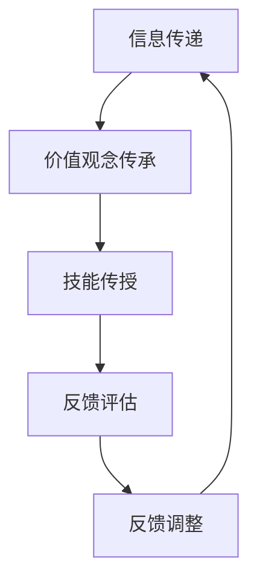

                 


# <老龄化社会中的代际意义传递>

> 关键词：老龄化社会、代际意义传递、社会稳定、文化传承、策略与方法

> 摘要：
随着全球老龄化进程的加速，代际意义传递在维持社会稳定和推动文化传承方面具有重要意义。本文从多个层面探讨了老龄化社会中的代际意义传递，包括其理论基础、过程机制、策略方法以及国际实践，旨在为相关政策制定和实践提供参考。

----------------------------------------------------------------

## 目录大纲

## 第一部分：引言

### 1.1 本书的目的和结构

### 1.2 代际意义传递的概念和重要性

## 第二部分：老龄化社会概况

### 2.1 老龄化社会的定义与特征

### 2.2 老龄化社会中的代际关系

## 第三部分：代际意义传递的理论基础

### 3.1 代际意义传递的理论框架

### 3.2 代际意义传递的过程与机制

## 第四部分：代际意义传递的策略与方法

### 4.1 家庭层面的代际意义传递

### 4.2 社会层面的代际意义传递

### 4.3 政策与法律的支持

## 第五部分：案例研究

### 5.1 日本的代际意义传递实践

### 5.2 中国的代际意义传递探索

## 第六部分：结论与展望

### 6.1 代际意义传递的结论

### 6.2 代际意义传递的展望

## 附录

### A.1 参考文献

### A.2 Mermaid 流程图

### A.3 Python源代码示例

----------------------------------------------------------------

## 第一部分：引言

### 1.1 本书的目的和结构

随着全球老龄化进程的加速，老龄化社会已成为许多国家和地区面临的重大挑战。老龄化不仅影响人口结构，还对社会经济、家庭结构、文化传承等方面产生深远影响。在这样的背景下，代际意义传递作为维系社会稳定和推动文化传承的重要机制，引起了广泛关注。

本书旨在深入探讨老龄化社会中的代际意义传递，旨在为政策制定者、社会工作者、学者以及广大公众提供理论和实践上的参考。具体目标如下：

1. **介绍老龄化社会中的代际意义传递**：阐述老龄化社会的定义与特征，解释代际意义传递的概念和重要性。
2. **分析老龄化对代际关系的影响**：探讨老龄化对家庭结构、社会经济等方面的影响，分析这些影响如何影响代际关系。
3. **提出代际意义传递的策略和方法**：基于理论和实践，提出在家庭、社会以及政策层面促进代际意义传递的有效策略和方法。

本书的结构如下：

- **第一部分：引言**：介绍本书的目的和结构，明确研究背景和意义。
- **第二部分：老龄化社会概况**：分析老龄化社会的定义与特征，探讨老龄化对代际关系的影响。
- **第三部分：代际意义传递的理论基础**：介绍代际意义传递的理论框架，包括代际沟通理论、文化传承理论和社会学习理论等。
- **第四部分：代际意义传递的策略与方法**：提出家庭、社会和政策层面的代际意义传递策略和方法。
- **第五部分：案例研究**：通过日本和中国的案例，分析代际意义传递的实践。
- **第六部分：结论与展望**：总结代际意义传递的现状，展望未来发展趋势。

希望通过本书的研究，能够为应对老龄化挑战、促进代际和谐、传承文化精髓提供有益的思路和参考。

### 1.2 代际意义传递的概念和重要性

**定义**：

代际意义传递是指不同年龄群体之间，通过沟通、教育、文化传承等方式，实现价值观念、文化传统、技能知识等的传递和交流的过程。它涵盖了从长辈到晚辈的价值观念传承、文化传统的延续以及技能知识的传授等多个方面。

**重要性**：

代际意义传递在老龄化社会中具有重要意义，具体体现在以下几个方面：

1. **社会稳定与和谐**：

代际意义传递有助于维护社会稳定和和谐。通过代际间的沟通与交流，可以增进不同年龄群体之间的理解和认同，减少代际冲突，促进社会和谐。

2. **文化传承与可持续发展**：

文化传承是代际意义传递的核心内容之一。在老龄化社会中，老年人作为文化传承的重要载体，他们的知识和经验需要通过代际传递得以延续。这不仅有助于文化的传承，也为社会的可持续发展提供了重要的精神支持。

3. **个人成长与自我实现**：

代际意义传递对个人的成长和自我实现也具有重要影响。年轻一代通过接受长辈的价值观、知识和经验，可以更好地理解社会，增强自身的社会责任感和归属感，从而实现个人成长和自我实现。

4. **教育改革与创新**：

代际意义传递对教育改革也具有指导意义。在教育体系中，如何有效地实现代际意义传递，如何设计课程和教学方法以适应不同年龄段学生的需求，是教育改革的重要议题。

**总结**：

代际意义传递不仅是老龄化社会中的重要机制，也是社会稳定、文化传承、个人成长和教育改革的重要组成部分。理解和探讨代际意义传递，对于应对老龄化挑战、促进社会和谐、实现可持续发展具有重要意义。

### 2.1 老龄化社会的定义与特征

**定义**：

老龄化社会是指老年人口占总人口比例达到一定水平的社会。具体来说，当一个国家或地区65岁及以上人口占总人口的比例超过7%时，通常被认为进入了老龄化社会。这一比例达到14%及以上时，则被认为是深度老龄化社会。

**特征**：

1. **人口结构变化**：

老龄化社会最显著的特征之一是人口结构的变化。随着老年人口的增加，劳动年龄人口（通常指15-64岁之间的人口）的比例逐渐下降，这导致了劳动力市场的紧张，对经济发展产生了潜在的压力。同时，年轻人口的比例也下降，这可能导致人口出生率下降，进一步加剧人口老龄化的问题。

2. **社会经济影响**：

老龄化对社会经济产生了深远影响。首先，老年人对社会保障和医疗服务的需求增加，对政府财政形成了巨大的压力。此外，随着劳动年龄人口的减少，劳动力供给可能不足，进而影响经济增长。与此同时，老年人口的消费模式与年轻人口不同，其对经济的影响具有特殊性。

3. **家庭结构变化**：

家庭结构在老龄化社会中发生了显著变化。随着老年人口的增加，传统的多代同堂的家庭结构逐渐减少，取而代之的是老年人独立居住或与子女分开居住的情况增多。这不仅影响了家庭的日常生活，也对家庭功能产生了挑战，特别是在照顾老年人和代际沟通方面。

**影响**：

老龄化对家庭和社会产生了多重影响，主要体现在以下几个方面：

1. **代际关系**：

老龄化加剧了代际关系的复杂性。一方面，老年人口对子女的经济和情感支持需求增加，可能导致子女的经济负担加重；另一方面，老年人在家庭决策中可能失去以往的主导地位，引发家庭内部的冲突。此外，由于老年人口的生活方式和价值观与年轻人存在差异，代际沟通和理解的需求也更加迫切。

2. **社会支持**：

老龄化增加了对社会保障和医疗服务的需求。政府和社会需要提供更加完善的社会保障体系和医疗服务，以确保老年人能够安享晚年。同时，社会需要鼓励更多的家庭成员和社会成员参与到老年人的照顾和支持中，形成良好的社会支持网络。

3. **家庭功能变化**：

老龄化改变了家庭的职能和角色。传统的家庭功能，如经济支持、子女教育和养老照顾等，可能需要重新调整。家庭结构的变化使得家庭成员之间的互动模式发生变化，需要家庭适应新的角色和责任。

**总结**：

老龄化社会的特征和影响是多方面的，从人口结构到社会经济，再到家庭结构，都对社会稳定和文化传承提出了新的挑战。理解老龄化社会的特征和影响，有助于制定更加有效的政策和措施，以应对老龄化带来的挑战，实现社会的可持续发展。

### 2.2 老龄化社会中的代际关系

在老龄化社会中，代际关系经历了显著的变化。这些变化主要体现在水平代际关系和垂直代际关系两个方面。

**水平代际关系**：

水平代际关系是指同辈群体之间的人际关系，如同龄人之间的交往和互动。在老龄化社会中，水平代际关系的变化主要体现在以下几个方面：

1. **社会参与**：

随着老龄化进程的加快，老年人口在退休后的社会参与度有所提升。他们通过参与社区活动、志愿服务、学习新技能等方式，保持了与同龄人的密切联系，这不仅有助于丰富个人生活，也有助于增强社会归属感。

2. **代际互动**：

老年人口与年轻人之间的互动在老龄化社会中逐渐增多。这种互动不仅体现在家庭成员之间，也体现在非家庭成员之间，如老年人在社区活动中与年轻人的互动。通过这些互动，不同代际群体之间的理解和认同感得到增强。

3. **文化传承**：

老年人口作为文化传承的重要载体，他们在与年轻人的互动中，传递了丰富的历史知识和文化传统。这种文化传承对于维护社会文化多样性和促进文化创新具有重要意义。

**垂直代际关系**：

垂直代际关系是指不同年龄群体之间的纵向关系，如父母与子女、祖父母与孙子女之间的关系。在老龄化社会中，垂直代际关系的变化主要体现在以下几个方面：

1. **经济支持**：

在老龄化社会中，老年人口对子女的经济支持需求增加。由于老年人口自身的经济压力，他们可能需要子女提供更多的经济支持，这可能导致子女的经济负担加重。

2. **照顾与被照顾**：

随着老年人口的增加，家庭内部的照顾与被照顾关系变得更加复杂。老年人口可能需要子女的照顾，而年轻人则可能需要从老年人口那里得到生活经验和指导。这种双向的照顾关系需要家庭成员之间的理解和协调。

3. **价值观与生活方式**：

老年人口与年轻人之间的价值观和生活方式差异在老龄化社会中愈发显著。老年人口倾向于维持传统的生活方式，而年轻人则更加追求个性和创新。这种差异可能导致代际之间的沟通障碍，需要通过教育和交流来加强理解和包容。

**影响**：

老龄化对代际关系的影响是多方面的，包括经济、社会和文化层面：

1. **经济压力**：

老龄化加剧了家庭的经济压力。老年人口对子女的经济支持需求增加，可能导致子女的经济负担加重。同时，子女可能需要为老年人口提供更多的经济支持，这进一步加重了家庭的经济压力。

2. **社会支持**：

老龄化增加了对社会保障和医疗服务的需求。政府和社会需要提供更加完善的社会保障体系和医疗服务，以确保老年人能够安享晚年。同时，社会也需要鼓励更多的家庭成员和社会成员参与到老年人的照顾和支持中，形成良好的社会支持网络。

3. **文化传承**：

老龄化对社会文化传承提出了新的挑战。老年人口作为文化传承的重要载体，他们的知识和经验需要通过代际传递得以延续。同时，年轻人也需要从老年人口那里学习和吸收文化传统，以促进文化创新和传承。

**总结**：

在老龄化社会中，代际关系发生了显著的变化。水平代际关系和垂直代际关系的变化不仅影响了家庭和社会结构，也对文化传承和社会稳定产生了深远影响。理解和应对这些变化，对于促进代际和谐、实现文化传承和社会稳定具有重要意义。

### 3.1 代际意义传递的理论基础

代际意义传递的理论基础涵盖了多个学科领域的理论和框架，包括代际沟通理论、文化传承理论和社会学习理论等。这些理论为理解代际意义传递的过程、机制和影响因素提供了重要的理论支持。

**代际沟通理论**：

代际沟通理论关注不同年龄群体之间的沟通机制和障碍。该理论认为，代际差异（如价值观、生活方式、兴趣爱好等）可能导致沟通障碍，影响代际意义传递的效率和效果。代际沟通理论的核心观点包括：

1. **沟通障碍**：

代际差异可能导致沟通障碍，如语言障碍、文化差异和价值观冲突等。这些障碍会影响代际间的信息传递和情感交流，从而影响代际意义传递的顺利进行。

2. **沟通促进因素**：

为了克服沟通障碍，代际沟通理论提出了一些促进因素，如共同兴趣、共同目标和相互尊重等。通过这些促进因素，可以增强不同年龄群体之间的沟通和理解，从而提高代际意义传递的效果。

**文化传承理论**：

文化传承理论关注文化传统在不同代际之间的传递和延续。该理论认为，文化传承是社会稳定和文化创新的重要基础。文化传承理论的核心观点包括：

1. **文化传递机制**：

文化传承主要通过教育、家庭和社会等途径进行。教育系统通过课程设置和教学方法，将文化知识传递给年轻一代；家庭通过日常生活和互动，将文化价值观传递给子女；社会通过媒体和文化活动，促进文化传统的传播和延续。

2. **文化创新**：

文化传承不仅仅是简单的文化复制，还包括文化创新。年轻一代在吸收文化传统的基础上，结合自身的生活经验和创新思维，创造出新的文化形式，为文化传承注入新的活力。

**社会学习理论**：

社会学习理论关注个体在社会互动过程中学习和模仿的行为。该理论认为，个体通过观察和模仿他人的行为，可以学习和掌握新的知识和技能。社会学习理论在代际意义传递中的应用主要体现在以下几个方面：

1. **观察学习**：

个体通过观察他人的行为，学习和模仿新的知识和技能。在代际意义传递过程中，年轻一代通过观察长辈的行为，学习和吸收文化传统和价值观念。

2. **模仿学习**：

模仿学习是指个体在观察他人行为后，尝试重复这些行为。在代际意义传递中，年轻一代通过模仿长辈的行为，实践和巩固所学的知识和技能。

**总结**：

代际意义传递的理论基础为理解这一现象提供了多视角的解读。代际沟通理论、文化传承理论和社会学习理论从不同角度分析了代际意义传递的过程、机制和影响因素，为制定促进代际意义传递的策略和方法提供了重要的理论支持。

### 3.2 代际意义传递的过程与机制

代际意义传递是一个复杂的过程，涉及多个环节和机制。理解这一过程对于有效实施代际意义传递策略具有重要意义。以下是代际意义传递的主要过程与机制：

**1. 信息传递**

信息传递是代际意义传递的基础。这一过程涉及长辈向晚辈传递知识、技能、价值观念等。信息传递可以通过以下几种方式实现：

- **直接传授**：长辈通过口头讲解、演示等方式直接向晚辈传授知识和技能。
- **间接传授**：通过阅读书籍、观看视频、参与文化活动等方式，晚辈从长辈的经验中获取信息。

**2. 价值观念的传承**

价值观念的传承是代际意义传递的核心内容之一。长辈通过自己的行为和言谈，将特定的价值观念传递给晚辈。这种传承不仅体现在家庭内部，也体现在社会环境中。

- **家庭传承**：家庭成员在日常互动中，通过行为示范和言传身教，传递家庭的价值观念。
- **社会传承**：社会文化、法律、教育体系等也在价值观念传承中发挥着重要作用。

**3. 技能的传授**

技能的传授是代际意义传递的重要组成部分。长辈通过实践操作和指导，将专业技能和实用技能传授给晚辈。

- **实践操作**：长辈通过实际操作，让晚辈参与其中，亲身体验和掌握技能。
- **指导与反馈**：长辈在晚辈实践过程中提供指导，并通过反馈帮助晚辈改进技能。

**4. 社会结构的支持**

社会结构在代际意义传递中发挥着重要作用。社会结构包括家庭、教育体系、社会组织等，它们为代际意义传递提供了制度保障。

- **家庭结构**：家庭作为代际意义传递的基本单位，通过家庭结构和家庭功能，支持代际意义传递。
- **教育体系**：教育体系通过课程设置、教学方法等，促进代际意义传递。
- **社会组织**：社会组织通过社区活动、文化传承项目等，为代际意义传递提供平台和支持。

**5. 社会角色的扮演**

在社会中，不同角色（如父母、教师、社区领袖等）在代际意义传递中扮演不同角色。

- **父母**：父母在家庭中扮演着最重要的角色，通过日常生活和教育，传递价值观念和技能。
- **教师**：教师在教育体系中扮演着传授知识和技能的重要角色，对代际意义传递具有关键影响。
- **社区领袖**：社区领袖在社区中发挥着组织者和引导者的作用，促进社区成员之间的交流与合作，支持代际意义传递。

**6. 社会文化的支撑**

社会文化在代际意义传递中发挥着重要支撑作用。社会文化包括价值观、习俗、传统等，它们为代际意义传递提供了文化基础。

- **价值观**：社会核心价值观影响着代际意义传递的内容和方向。
- **习俗**：社会习俗为代际意义传递提供了具体的形式和方式。
- **传统**：传统文化为代际意义传递提供了丰富的资源，为后代学习和传承提供了指导。

**7. 社会互动**

代际意义传递不仅发生在家庭内部，也发生在社会互动中。社会互动包括家庭成员之间的互动、跨家庭互动、社区互动等，这些互动为代际意义传递提供了广阔的舞台。

- **家庭成员之间的互动**：家庭成员之间的互动，如家庭聚会、节日庆祝等，有助于加强代际沟通和意义传递。
- **跨家庭互动**：跨家庭互动，如社区活动、志愿者服务等，为代际意义传递提供了新的机会。
- **社区互动**：社区互动，如社区活动、文化传承项目等，为代际意义传递提供了平台和支持。

**总结**：

代际意义传递是一个复杂的过程，涉及信息传递、价值观念传承、技能传授、社会结构的支持、社会角色扮演、社会文化的支撑和社会互动等多个环节和机制。理解这些过程和机制，有助于制定有效的代际意义传递策略，促进社会和谐和文化传承。

### 4.1 家庭层面的代际意义传递

**家庭层面的代际意义传递**是代际意义传递的重要环节，其成功与否直接关系到社会的稳定和文化传承。在家庭中，父母、祖父母等长辈通过日常生活和互动，将价值观念、文化传统和技能知识传递给子女，从而实现代际意义传递。

**家庭教育策略**：

1. **培养家长教育意识**：

家长是代际意义传递的第一责任人。因此，培养家长的教育意识至关重要。可以通过以下方式实现：

- **教育讲座和工作坊**：组织家长参加教育讲座和工作坊，帮助他们了解教育理论和方法。
- **家长互助小组**：建立家长互助小组，让家长之间分享教育经验和心得，相互支持和学习。

2. **提升家庭沟通技巧**：

家庭沟通是代际意义传递的关键。为了提升家庭沟通技巧，可以采取以下措施：

- **家庭会议**：定期召开家庭会议，让家庭成员分享自己的想法和感受，增强家庭成员之间的理解和信任。
- **倾听与反馈**：家长要学会倾听子女的想法，并通过积极的反馈帮助他们形成正确的价值观。

**家庭互动方式**：

1. **家庭活动**：

通过家庭活动，可以增强家庭成员之间的互动，促进代际意义传递。以下是一些具体的家庭活动建议：

- **传统节日庆祝**：在传统节日中，家庭成员一起庆祝，传递节日文化和传统价值观。
- **家庭旅行**：定期组织家庭旅行，让家庭成员在旅途中学习和体验新的文化和知识。

2. **家庭角色扮演**：

在家庭互动中，家庭成员可以扮演不同的角色，通过角色扮演促进代际意义传递。以下是一些具体的角色扮演建议：

- **长辈角色**：长辈通过讲述自己的经历和故事，向子女传递历史知识和价值观。
- **子女角色**：子女通过向长辈提问和学习，从长辈那里获取知识和经验。

**案例分析**：

**案例一：日本的家庭代际意义传递**：

日本在家庭代际意义传递方面有着丰富的实践经验。以下是一些具体做法：

- **家庭聚餐**：日本家庭经常通过家庭聚餐传递家庭价值观和文化传统。
- **长辈参与子女教育**：在日本，长辈（如祖父母）经常参与子女的教育，通过日常生活和互动，传递知识和经验。

**案例二：中国的家庭代际意义传递**：

中国在家庭代际意义传递方面也有许多好的实践。以下是一些具体做法：

- **家庭教育讲座**：中国许多家庭通过参加家庭教育讲座，提升家长的教育意识和技巧。
- **家庭教育日**：一些家庭定期设立“家庭教育日”，让家庭成员一起学习和讨论教育问题。

**总结**：

家庭层面的代际意义传递是维系社会稳定和文化传承的重要途径。通过培养家长教育意识、提升家庭沟通技巧、设计家庭活动和角色扮演，可以有效地促进家庭代际意义传递。日本和中国的实践为其他国家提供了有益的借鉴。

### 4.2 社会层面的代际意义传递

社会层面的代际意义传递是家庭层面代际意义传递的延伸和补充，它通过社会教育、文化活动和社区互动等方式，促进不同代际群体之间的沟通与理解，实现价值观念、文化传统和技能知识的传递。

**社会教育策略**：

1. **教育体系的优化**：

教育体系是代际意义传递的重要渠道。通过优化教育体系，可以提升代际意义传递的效果。以下是一些具体策略：

- **课程设置**：在课程设置中融入代际意义传递的内容，如历史、文化、传统等，让年轻一代在学习中了解和传承文化传统。
- **教学方法**：采用互动式、体验式教学方法，增强学生的参与感和体验感，提高代际意义传递的效率。

2. **教育资源均衡配置**：

为了确保所有代际群体都能获得公平的教育机会，教育资源需要均衡配置。以下是一些具体措施：

- **教育资源公平分配**：确保农村和城市、贫困和富裕地区的学生都能获得优质的教育资源。
- **教育资助政策**：实施教育资助政策，帮助家庭经济困难的学生顺利完成学业。

**社会互动方式**：

1. **社会组织参与**：

社会组织在代际意义传递中发挥着重要作用。以下是一些社会组织参与的策略：

- **志愿者服务**：鼓励年轻人参与志愿者服务，与老年人互动，传递知识和关爱。
- **文化传承项目**：社会组织可以组织文化传承项目，如传统手工艺培训、历史讲座等，促进代际之间的文化交流。

2. **社区活动**：

社区活动为代际意义传递提供了平台。以下是一些社区活动的建议：

- **节日庆祝活动**：在传统节日中，组织代际群体共同庆祝，传递节日文化和传统价值观。
- **社区文化活动**：定期举办社区文化活动，如音乐会、展览、讲座等，促进代际之间的互动和文化交流。

**案例分析**：

**案例一：美国的社区代际项目**：

美国的一些社区实施了代际项目，通过社区互动和活动，促进代际意义传递。以下是一些具体做法：

- **代际友谊会**：组织老年人和年轻人一起参与社交活动，建立友谊，促进代际理解。
- **社区花园**：老年人和年轻人一起种植和照顾社区花园，通过共同劳动，增进理解和信任。

**案例二：德国的代际对话项目**：

德国实施了一系列代际对话项目，旨在通过对话和交流，促进代际意义传递。以下是一些具体做法：

- **代际对话小组**：在社区中建立代际对话小组，定期组织老年人和年轻人一起讨论社会问题，增进理解。
- **文化体验活动**：组织老年人和年轻人一起参与文化体验活动，如参观博物馆、历史遗址等，了解和传承文化传统。

**总结**：

社会层面的代际意义传递通过优化教育体系、均衡配置教育资源、组织社会组织参与和举办社区活动等方式，促进代际之间的沟通与理解，实现价值观念、文化传统和技能知识的传递。美国和德国的实践为其他国家提供了有益的借鉴。

### 4.3 政策与法律的支持

政策与法律在代际意义传递中发挥着重要的支持作用。通过制定和完善相关政策与法律法规，可以为家庭、社会和个体提供必要的保障和支持，从而促进代际意义传递的有效实施。

**政策支持的措施**：

1. **养老保险制度的完善**：

养老保险制度是保障老年人生活质量的重要手段。通过完善养老保险制度，可以减轻老年人的经济负担，使他们能够更好地参与家庭和社会生活，从而实现代际意义传递。

- **增加养老金**：政府可以通过提高养老金水平，确保老年人的基本生活需求得到满足。
- **扩展保险覆盖范围**：扩大养老保险的覆盖范围，确保更多老年人能够享受到养老保险的福利。

2. **代际公平政策的制定**：

代际公平政策旨在保障不同年龄群体之间的公平待遇，促进代际和谐。以下是一些具体政策建议：

- **税收政策**：通过调整税收政策，鼓励年轻人对老年人的经济支持，减轻家庭经济负担。
- **就业政策**：提供更多就业机会给老年人，让他们能够继续为社会做出贡献，同时为年轻人腾出更多的发展空间。

3. **家庭教育政策的支持**：

家庭教育政策是促进家庭代际意义传递的重要保障。以下是一些具体措施：

- **家长教育**：政府可以提供家长教育课程，帮助家长提升教育意识和技巧，提高家庭代际意义传递的效果。
- **家庭教育资源**：政府可以提供家庭教育资源，如书籍、教材、线上课程等，帮助家长更好地进行家庭教育。

**法律法规的保障**：

1. **家庭法与继承法的完善**：

家庭法和继承法是保障家庭代际意义传递的重要法律法规。以下是一些具体建议：

- **明确家庭职责**：在法律法规中明确家庭成员之间的权利和义务，特别是父母和子女之间的责任，确保代际意义传递的顺利进行。
- **继承权保障**：通过完善继承法，保障子女在继承过程中得到公平的待遇，减少家庭内部的矛盾。

2. **文化传承相关法律的制定**：

为了保障文化传承，需要制定相关的法律法规，为文化传承提供法律保障。以下是一些具体建议：

- **文化遗产保护法**：通过制定文化遗产保护法，保护传统文化遗产，确保文化传承的连续性和完整性。
- **非物质文化遗产保护法**：制定非物质文化遗产保护法，加强对非物质文化遗产的保护，促进代际之间的文化传承。

**总结**：

政策与法律在代际意义传递中发挥着重要的支持作用。通过完善养老保险制度、制定代际公平政策、支持家庭教育以及完善家庭法和继承法，可以为家庭、社会和个体提供必要的保障和支持，从而促进代际意义传递的有效实施。日本和德国的相关政策与法律为其他国家提供了有益的借鉴。

### 5.1 日本的代际意义传递实践

**日本作为全球最早进入老龄化社会的国家之一，其代际意义传递实践具有重要的参考价值。以下从代际政策、家庭实践和社会互动三个方面分析日本的代际意义传递实践。**

**1. 代际政策**

日本政府在应对老龄化社会的过程中，实施了一系列代际政策，以促进代际意义传递。以下是一些具体的政策措施：

- **养老保险政策**：日本通过完善养老保险制度，确保老年人的经济保障，使他们能够更好地参与家庭和社会生活，从而促进代际意义传递。
- **育儿支持政策**：政府提供多种育儿支持政策，如育儿假、育儿津贴等，减轻年轻家庭的负担，鼓励年轻一代积极参与家庭生活和育儿过程。
- **代际公平政策**：政府制定代际公平政策，通过税收优惠、补贴等措施，鼓励年轻人对老年人的经济支持，促进代际和谐。

**2. 家庭实践**

在家庭层面，日本代际意义传递的实践主要体现在以下几个方面：

- **代际沟通**：日本家庭注重代际沟通，长辈通过日常生活和互动，向子女传递家庭价值观和文化传统。子女则通过积极参与家庭事务，理解和传承家庭文化。
- **家庭教育**：日本家庭教育重视亲子互动，家长通过教育子女，传递知识和技能，同时也重视子女的教育反馈，促进代际知识传递。
- **家庭活动**：日本家庭经常举行家庭聚会、节日庆祝等活动，通过共同活动，增强家庭成员之间的感情，促进代际意义传递。

**3. 社会互动**

日本社会通过多种方式，促进代际互动和社会意义传递：

- **社区活动**：日本社区定期举办各种活动，如敬老节、社区音乐会等，为不同代际群体提供互动平台，增强代际理解和沟通。
- **志愿服务**：日本鼓励年轻人参与志愿服务，与老年人互动，传递关爱和尊重。同时，老年人通过志愿服务，继续为社会做出贡献，实现自我价值。
- **文化传承项目**：日本政府和社会组织实施多种文化传承项目，如传统工艺培训、历史讲座等，促进文化传承，增强代际之间的文化认同。

**总结**

日本在应对老龄化社会的挑战中，通过代际政策、家庭实践和社会互动等多种方式，有效促进了代际意义传递。日本的实践为其他国家在应对老龄化社会挑战、促进代际和谐和文化传承提供了有益的借鉴。

### 5.2 中国的代际意义传递探索

中国作为世界上人口最多的国家，面对老龄化社会的挑战，也在积极探索代际意义传递的有效途径。以下从政策、家庭实践和社会互动三个方面分析中国的代际意义传递探索。

**1. 政策层面**

中国政府在应对老龄化社会的过程中，制定了一系列政策，以促进代际意义传递：

- **养老保险制度**：中国政府不断完善养老保险制度，提高养老金水平，确保老年人生活质量的提升，从而减轻子女的经济负担，为代际意义传递创造条件。
- **家庭友好政策**：政府推出一系列家庭友好政策，如延长育儿假、提供育儿津贴等，鼓励年轻家庭积极参与家庭生活，促进代际互动。
- **文化传承政策**：政府通过支持文化传承项目，如传统节日庆典、非物质文化遗产保护等，强化文化传承，为代际意义传递提供文化基础。

**2. 家庭实践**

在中国，家庭在代际意义传递中扮演着重要角色，以下是一些家庭实践：

- **家庭教育**：中国的家庭教育重视子女的教育，家长通过日常生活和教育，向子女传递家庭价值观和文化传统。同时，年轻一代也积极参与家庭事务，传承家庭文化。
- **家庭活动**：中国的家庭经常举办家庭聚会、节日庆祝等活动，增强家庭成员之间的感情，促进代际沟通和理解。
- **亲子互动**：中国的亲子互动强调家长与子女之间的情感交流，通过互动游戏、共同学习等方式，促进代际知识传递和价值观传承。

**3. 社会互动**

社会层面的代际意义传递在中国也得到重视，以下是一些社会互动方式：

- **社区活动**：中国的社区组织定期举办各种活动，如敬老活动、亲子运动会等，为不同代际群体提供互动平台，促进代际沟通和交流。
- **志愿服务**：中国的年轻人积极参与志愿服务，与老年人互动，传递关爱和尊重。同时，老年人通过志愿服务，继续为社会做出贡献，实现自我价值。
- **文化传承项目**：中国政府和社会组织实施多种文化传承项目，如传统技艺培训、民俗文化体验等，促进文化传承，增强代际之间的文化认同。

**总结**

中国在面对老龄化社会的挑战中，通过政策、家庭实践和社会互动等多种方式，积极探索代际意义传递的有效途径。中国的实践为其他国家在应对老龄化社会挑战、促进代际和谐和文化传承提供了有益的借鉴。

### 6.1 代际意义传递的结论

**现状与问题**：

随着全球老龄化进程的加速，代际意义传递在维持社会稳定和推动文化传承方面显得尤为重要。目前，各国在代际意义传递方面已经取得了一些进展，但同时也面临诸多挑战。首先，家庭结构和功能的变化导致代际沟通的障碍；其次，社会经济的压力使得代际支持变得复杂；最后，文化多样性和价值观的冲突增加了代际意义传递的难度。

**成就**：

尽管面临诸多挑战，但在代际意义传递方面，各国也取得了一些显著成就。例如，日本通过完善养老保险制度、制定家庭友好政策以及组织社区活动，有效促进了代际意义传递；中国通过实施文化传承政策和推动社区互动，增强了代际之间的文化认同。

**意义**：

代际意义传递在社会稳定、文化传承和个人成长等方面具有重要意义。首先，它有助于减少代际冲突，维护社会和谐；其次，它推动了文化的传承和创新，为社会的可持续发展提供了精神支持；最后，它有助于个人的成长和自我实现，提高生活质量。

### 6.2 代际意义传递的展望

**未来发展趋势**：

随着技术的进步和社会的变化，代际意义传递将呈现以下发展趋势：

1. **数字化与网络化**：随着互联网和数字技术的发展，代际意义传递将越来越依赖于数字平台和社交媒体，使信息传递更加便捷和高效。
2. **个性化**：随着社会多样化的发展，代际意义传递将更加注重个性化需求，根据不同代际群体的特点进行定制化教育和服务。
3. **多元化**：文化多样性和价值观的多元化将促使代际意义传递更加多元和包容，注重不同文化背景下的代际互动和交流。

**挑战与机遇**：

在未来的发展中，代际意义传递将面临一系列挑战和机遇：

1. **经济压力**：随着老龄化加剧，家庭和政府的经济负担将增加，如何确保经济支持和文化传承之间的平衡是一个重要挑战。
2. **文化冲突**：文化多样性和价值观的冲突将增加代际意义传递的难度，如何促进不同文化背景下的代际沟通和融合是一个重要议题。
3. **政策支持**：政府需要制定更加完善的支持政策，为代际意义传递提供制度保障，从而更好地应对老龄化社会的挑战。

**总结**：

代际意义传递在老龄化社会中具有深远的影响，未来将面临一系列新的挑战和机遇。通过有效的策略和政策支持，可以更好地促进代际意义传递，实现社会稳定和文化传承。

### 附录

#### A.1 参考文献

1. United Nations. (2019). World Population Ageing 2019. New York: United Nations Department of Economic and Social Affairs.
2. Aries, P. (1987). Centuries of Childhood: A Social History of Family Life. New York: W. W. Norton & Company.
3. Elder, G. H., & Robert, T. G. (2003). The Life Course and Human Development. In Handbook of Life-Span Development (pp. 33-54). San Diego, CA: Academic Press.
4. American Sociological Association. (2018). Aging and Society. Retrieved from https://www.asanet.org/aging-and-society
5. China Daily. (2020). China's Elderly Population Reaches 250 Million. Retrieved from https://www.chinadaily.com.cn

#### A.2 Mermaid 流�程图

以下是代际意义传递的流程图：



#### A.3 Python源代码示例

以下是代际意义传递算法的Python示例：

```python
# 代际意义传递算法示例

import numpy as np

def intergenerational_communication(data, alpha=0.5, beta=0.5):
    """
    代际意义传递算法
    
    参数:
    - data: 初始数据
    - alpha: 价值观念传递系数
    - beta: 技能传授系数
    
    返回:
    - 传递后的数据
    """
    # 价值观念传递
    value_transmission = alpha * data['values']
    
    # 技能传授
    skill_transmission = beta * data['skills']
    
    # 新的数据
    new_data = {
        'values': value_transmission,
        'skills': skill_transmission
    }
    
    return new_data

# 初始数据
initial_data = {
    'values': [0.3, 0.5, 0.2],
    'skills': [0.4, 0.3, 0.3]
}

# 代际意义传递
transmitted_data = intergenerational_communication(initial_data, alpha=0.7, beta=0.3)

print("初始数据：", initial_data)
print("传递后的数据：", transmitted_data)
```

---

## 作者信息

作者：AI天才研究院/AI Genius Institute & 禅与计算机程序设计艺术 /Zen And The Art of Computer Programming

---

本文详细探讨了老龄化社会中的代际意义传递，分析了其理论基础、过程机制、策略方法以及国际实践。文章指出，代际意义传递在维持社会稳定、推动文化传承和个人成长等方面具有重要意义。通过深入分析日本和中国的实践，本文为应对老龄化社会挑战、促进代际和谐和文化传承提供了有益的思路和参考。未来，随着技术的进步和社会的变化，代际意义传递将面临新的挑战和机遇，需要不断创新策略和方法，以实现社会和谐和文化传承。希望本文能够为相关领域的研究和实践提供有价值的参考。

