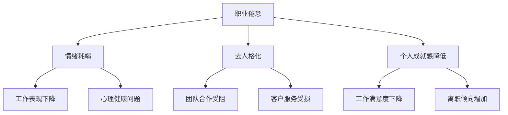

                 

## 《职业倦怠：如何在工作中重新找到激情》

关键词：职业倦怠、工作激情、自我管理、职业发展、心理健康

摘要：本文深入探讨了职业倦怠现象及其对个人和工作的负面影响，旨在帮助IT从业者识别职业倦怠的信号，并提供一系列有效的干预策略，以重新激发工作中的激情。文章首先分析了职业倦怠的定义、特征和原因，然后介绍了自我检测方法及职业倦怠量表。接着，本文从工作环境调整、自我管理能力提升、人际沟通改善等方面提出了干预策略。此外，文章还探讨了如何发现工作的意义、发展职业技能和调整工作内容，以重新点燃工作激情。最后，本文提出了预防职业倦怠的措施，并总结了对未来研究的展望和对读者的启示。

----------------------------------------------------------------

# 《职业倦怠：如何在工作中重新找到激情》目录大纲

## 引言  
### 职业倦怠的定义与现状  
### 本书的目的与结构

## 第1章：了解职业倦怠  
### 1.1 职业倦怠的核心特征  
#### 1.1.1 情绪耗竭  
#### 1.1.2 去人格化  
#### 1.1.3 个人成就感降低  
### 1.2 职业倦怠的影响  
#### 1.2.1 对工作表现的影响  
#### 1.2.2 对个人健康的影响  
#### 1.2.3 对工作满意度的影响  
### 1.3 职业倦怠的原因分析  
#### 1.3.1 工作因素  
#### 1.3.2 个人因素

## 第2章：识别职业倦怠  
### 2.1 职业倦怠的自我检测  
#### 2.1.1 情绪反应  
#### 2.1.2 工作表现  
#### 2.1.3 身体症状  
### 2.2 使用职业倦怠量表  
#### 2.2.1 梅尔兹堡职业倦怠量表（MBI）  
#### 2.2.2 职业倦怠量表（UWES）  
### 2.3 面对职业倦怠

## 第3章：职业倦怠的干预策略  
### 3.1 调整工作环境  
#### 3.1.1 改善工作负荷  
#### 3.1.2 提供心理支持  
#### 3.1.3 实施弹性工作时间  
### 3.2 提高自我管理能力  
#### 3.2.1 时间管理技巧  
#### 3.2.2 应对压力的方法  
#### 3.2.3 自我激励技巧  
### 3.3 增进人际沟通  
#### 3.3.1 提升沟通技巧  
#### 3.3.2 建立支持网络  
#### 3.3.3 培养积极心态

## 第4章：重新点燃工作激情  
### 4.1 发现工作意义  
#### 4.1.1 工作价值观的重建  
#### 4.1.2 工作目标的设定  
#### 4.1.3 工作使命的探索  
### 4.2 发展职业技能  
#### 4.2.1 职业发展的路径  
#### 4.2.2 技能提升的策略  
#### 4.2.3 持续学习的重要性  
### 4.3 调整工作内容  
#### 4.3.1 工作职责的调整  
#### 4.3.2 工作环境的优化  
#### 4.3.3 重新规划职业生涯

## 第5章：职业倦怠的预防措施  
### 5.1 工作设计原则  
#### 5.1.1 工作丰富化  
#### 5.1.2 工作自主性  
#### 5.1.3 工作反馈机制  
### 5.2 员工福祉管理  
#### 5.2.1 工作与生活的平衡  
#### 5.2.2 工作场所的心理支持  
#### 5.2.3 健康管理的策略  
### 5.3 培训与教育  
#### 5.3.1 职业倦怠的早期识别  
#### 5.3.2 预防策略的实施  
#### 5.3.3 培训计划的设计

## 第6章：案例研究  
### 6.1 案例一：公司如何应对职业倦怠  
### 6.2 案例二：个体如何克服职业倦怠

## 第7章：结论与展望  
### 7.1 职业倦怠干预的总结  
### 7.2 未来研究方向  
### 7.3 对读者的启示

## 附录  
### 附录A：职业倦怠量表  
#### 梅尔兹堡职业倦怠量表（MBI）  
#### 职业倦怠量表（UWES）

### 附录B：推荐阅读  
#### 与职业倦怠相关的经典文献  
#### 心理健康自助指南

## 参考文献

----------------------------------------------------------------

### 引言

职业倦怠是一种日益普遍的工作现象，特别是在高度竞争和压力巨大的IT行业。它不仅影响个体的心理健康和职业生涯，还会对组织的生产力和整体绩效产生负面影响。职业倦怠的定义通常包括情绪耗竭、去人格化和个人成就感降低三个核心特征。情绪耗竭表现为情感上的极度疲劳和麻木，去人格化则是对工作对象和环境产生冷漠和疏离感，而个人成就感降低则体现在对工作成果的不满和自我价值的怀疑。

职业倦怠的普遍存在与其背后的原因密切相关。工作因素如工作压力、角色冲突和工作-生活失衡是常见的诱因。个人因素如个人特质、心理弹性和社会支持系统的缺乏也会影响职业倦怠的发生。为了帮助IT从业者更好地应对职业倦怠，本书旨在提供一种系统的方法，通过识别、干预和预防措施，帮助读者重新找到工作中的激情。

本书的结构分为七个章节。第一章节介绍职业倦怠的定义和现状，以及本书的目的和结构。第二章节深入探讨职业倦怠的核心特征和影响。第三章节提供了自我检测的方法和量表，帮助读者识别是否存在职业倦怠。第四章节和第五章节分别从工作环境调整和自我管理能力提升两个方面提出干预策略。第六章节通过案例研究，展示了实际操作中的成功经验。最后一章节总结了本书的内容，并对未来研究方向提出展望，同时为读者提供了实用的启示和建议。

## 第1章：了解职业倦怠

职业倦怠（Burnout）是一种与工作相关的慢性疲劳状态，主要表现为情感耗竭、去人格化和个人成就感降低。它不仅影响了个体在工作中的表现和心理健康，还对组织的生产力和整体绩效产生了负面影响。理解职业倦怠的特征、影响及其原因，是应对这一现象的第一步。

### 1.1 职业倦怠的核心特征

#### 1.1.1 情绪耗竭

情绪耗竭是职业倦怠的最显著特征，表现为情感上的极度疲劳和麻木。个体可能感到无法再从工作中获得满足感，甚至对自己的工作产生强烈的厌倦感。这种现象通常导致工作效率下降，工作质量受损。

#### 1.1.2 去人格化

去人格化是指个体对工作对象和环境产生冷漠和疏离感。为了应对工作中的持续压力，个体可能会采取一种“机械化”的态度，减少与同事和客户的情感交流。这种疏离感进一步加剧了职业倦怠的程度。

#### 1.1.3 个人成就感降低

个人成就感降低表现为个体对自己的工作成果感到不满和失望，怀疑自己的价值和能力。这种现象可能导致个体对工作产生消极态度，甚至出现离职的倾向。

### 1.2 职业倦怠的影响

#### 1.2.1 对工作表现的影响

职业倦怠显著降低了个体在工作中的表现。情绪耗竭可能导致工作效率下降，而去人格化则影响了团队合作和客户服务。个人成就感降低则使个体对自己的工作成果持怀疑态度，进一步降低了工作质量。

#### 1.2.2 对个人健康的影响

职业倦怠对个人健康产生了严重的负面影响。情绪耗竭可能导致失眠、焦虑和抑郁等心理健康问题。长期的心理压力还可能引发生理健康问题，如心脏病、高血压和免疫力下降。

#### 1.2.3 对工作满意度的影响

职业倦怠显著降低了员工的工作满意度。情绪耗竭和去人格化使个体对工作产生消极态度，个人成就感降低则使个体对自己的职业发展感到失望。这些因素共同导致了工作满意度的下降。

### 1.3 职业倦怠的原因分析

职业倦怠的原因复杂多样，既包括工作因素，也包括个人因素。

#### 1.3.1 工作因素

1. **工作压力**：高工作负荷、时间紧迫和任务复杂性是导致职业倦怠的主要原因之一。长期的工作压力使个体感到身心俱疲。
   
2. **角色冲突**：角色冲突是指工作中的不同职责和要求相互矛盾，导致个体在职业角色上感到困惑和焦虑。

3. **工作-生活失衡**：工作与个人生活的平衡被打破，导致个体在工作和家庭之间感到压力和焦虑。

#### 1.3.2 个人因素

1. **个人特质**：一些个人特质，如高需求、低耐受力、焦虑倾向等，增加了个体患职业倦怠的风险。

2. **心理弹性**：心理弹性较低的个体在面对压力和挑战时，更容易感到疲惫和沮丧，从而增加职业倦怠的风险。

3. **社会支持系统**：缺乏有效的社会支持系统，如家庭、朋友和同事的支持，也会增加职业倦怠的风险。

### 1.4 职业倦怠的概念实体关系架构

为了更好地理解职业倦怠，我们可以使用Mermaid流程图来展示其核心概念实体之间的关系：

通过上述分析，我们可以看到职业倦怠不仅是一个情感问题，还涉及到个体的心理健康、工作表现和职业发展。理解职业倦怠的特征、影响和原因，是应对这一现象的关键步骤。

## 第2章：识别职业倦怠

要有效应对职业倦怠，首先需要识别其存在的信号和症状。职业倦怠并不总是一目了然的，它可能以不同的形式出现，影响个体的情绪、工作表现和身体健康。以下部分将详细介绍自我检测的方法和常用的职业倦怠量表，帮助读者识别是否存在职业倦怠。

### 2.1 职业倦怠的自我检测

职业倦怠的早期识别对于采取干预措施至关重要。以下是一些自我检测的方法，通过观察自己的情绪、工作表现和身体症状，可以初步判断是否存在职业倦怠：

#### 2.1.1 情绪反应

1. **情绪波动大**：你是否经常感到情绪低落、焦虑或愤怒？
2. **缺乏激情**：你是否对曾经感兴趣的工作任务感到提不起劲？
3. **对同事、客户的态度**：你是否对同事、客户产生冷漠甚至抵触的情绪？

#### 2.1.2 工作表现

1. **任务完成情况**：你是否发现自己无法按时完成工作任务，或者质量下降？
2. **创造力下降**：你是否觉得在工作中缺乏创意和灵感？
3. **参与度**：你是否对工作失去兴趣，甚至不愿参与团队活动？

#### 2.1.3 身体症状

1. **睡眠问题**：你是否经常失眠或睡眠质量差？
2. **食欲变化**：你是否食欲不振或过度进食？
3. **身体疲劳**：你是否经常感到身体疲劳，即使休息也无法恢复精力？

通过上述自我检测，如果你发现自己有多个方面的信号，可能需要进一步使用职业倦怠量表进行详细评估。

### 2.2 使用职业倦怠量表

职业倦怠量表（Questionnaires for Measuring Burnout）是评估职业倦怠程度的重要工具。以下介绍两种常用的量表：梅尔兹堡职业倦怠量表（Maslach Burnout Inventory，MBI）和通用职业倦怠量表（Universal Burnout Inventory，UWES）。

#### 2.2.1 梅尔兹堡职业倦怠量表（MBI）

梅尔兹堡职业倦怠量表是研究职业倦怠的经典工具，分为三个维度：情感耗竭、去人格化和个人成就感降低。每个维度包含多个条目，使用7级评分量表（从1到7）进行评估。

**情感耗竭维度：**
- 我感到情感和精神上的极度疲劳。
- 我对工作感到筋疲力尽。

**去人格化维度：**
- 我对同事、客户或工作对象感到冷漠。
- 我在工作中感到疏离感。

**个人成就感降低维度：**
- 我对工作的成就感感到失望。
- 我对自己的工作表现感到不满。

#### 2.2.2 通用职业倦怠量表（UWES）

通用职业倦怠量表适用于各种工作环境和职业，同样分为三个维度：情感耗竭、非人格化和个人成就感。每个维度包含多个条目，使用5级评分量表（从1到5）进行评估。

**情感耗竭维度：**
- 我在工作中的情感投入减少了。
- 我感到身心俱疲。

**非人格化维度：**
- 我在工作中对同事、客户或工作对象表现出冷漠。
- 我在工作时感到疏离感。

**个人成就感降低维度：**
- 我对自己的工作表现感到失望。
- 我对工作的成就感感到减少。

### 2.3 面对职业倦怠

一旦识别出职业倦怠的信号，下一步就是采取行动。以下是一些应对职业倦怠的策略：

1. **调整工作方式**：尝试重新分配工作任务，减少不必要的压力源。例如，优化时间管理，减少加班时间。
   
2. **寻求支持**：与同事、朋友或家人分享感受，寻求他们的支持和建议。如果需要，可以寻求专业心理咨询。

3. **自我放松**：定期进行身体锻炼、瑜伽、冥想等放松活动，以缓解压力和焦虑。

4. **设定目标**：为自己设定短期和长期的工作目标，保持动力和积极性。

5. **职业发展规划**：考虑职业发展的机会，如参加培训、学习新的技能，以提升自我成就感。

通过自我检测和量表评估，我们可以更好地识别职业倦怠的存在。面对职业倦怠，采取积极的干预措施，可以帮助我们重新找回工作中的激情和动力。

### 第3章：职业倦怠的干预策略

职业倦怠不仅对个体的心理健康产生负面影响，还会影响工作表现和组织绩效。因此，采取有效的干预策略对于缓解职业倦怠至关重要。本章将介绍三种主要干预策略：调整工作环境、提高自我管理能力和增进人际沟通。

#### 3.1 调整工作环境

改善工作环境是减轻职业倦怠的关键措施。以下是一些具体方法：

##### 3.1.1 改善工作负荷

1. **任务分配**：合理分配工作任务，避免个体长时间承受过重的工作负荷。可以采用团队合作方式，将任务分配给合适的成员。
   
2. **时间管理**：优化工作时间安排，确保有足够的时间进行休息和恢复。例如，实施弹性工作时间制度，允许员工根据个人需求调整工作时间。

##### 3.1.2 提供心理支持

1. **员工援助计划（EAP）**：为员工提供心理咨询和支持服务，帮助他们应对工作压力和心理问题。

2. **团队建设活动**：定期组织团队建设活动，增强员工之间的情感联系和支持，提高团队凝聚力和工作效率。

##### 3.1.3 实施弹性工作时间

1. **远程办公**：在条件允许的情况下，实施远程办公制度，减少员工通勤时间和压力。

2. **灵活工作时间**：允许员工根据自己的需求和工作情况灵活安排工作时间，提高工作满意度和工作效率。

#### 3.2 提高自我管理能力

自我管理能力对于应对职业倦怠至关重要。以下是一些自我管理的方法：

##### 3.2.1 时间管理技巧

1. **制定日程表**：合理安排每天的工作和学习时间，确保有足够的时间完成工作任务。

2. **优先级排序**：将任务按优先级排序，确保将时间和精力集中在最重要和最紧急的任务上。

##### 3.2.2 应对压力的方法

1. **放松技巧**：学习并应用放松技巧，如深呼吸、冥想和瑜伽，以缓解压力和焦虑。

2. **积极应对**：采用积极的心态面对工作中的挑战和压力，例如，通过自我激励和目标设定来增强应对能力。

##### 3.2.3 自我激励技巧

1. **设定目标**：为自己设定短期和长期的工作目标，保持动力和积极性。

2. **奖励机制**：设定奖励机制，如完成特定任务后给自己一个小奖励，以增强自我激励。

#### 3.3 增进人际沟通

良好的沟通对于缓解职业倦怠和提高工作效率至关重要。以下是一些沟通技巧：

##### 3.3.1 提升沟通技巧

1. **积极倾听**：倾听他人的观点和需求，避免中断和误解。

2. **有效表达**：清晰、准确地表达自己的观点和感受，避免产生误解和冲突。

##### 3.3.2 建立支持网络

1. **寻求反馈**：定期与同事、上司和下属交流，寻求反馈和指导，改进工作方法和技能。

2. **团队支持**：建立积极、支持的团队氛围，鼓励团队成员相互帮助和支持。

##### 3.3.3 培养积极心态

1. **正面思维**：培养积极的心态，关注工作中的积极方面和成就，避免过度消极和抱怨。

2. **自我反思**：定期进行自我反思，识别自己的情绪和行为模式，寻找改进的机会。

通过调整工作环境、提高自我管理能力和增进人际沟通，我们可以有效应对职业倦怠，提高工作满意度和心理健康。这些干预策略不仅有助于个体的职业发展，也有助于组织的整体绩效和可持续发展。

### 第4章：重新点燃工作激情

重新点燃工作激情是克服职业倦怠的关键步骤。通过发现工作的意义、发展职业技能和调整工作内容，我们可以重拾工作动力，提升工作满意度。以下内容将详细探讨这些策略。

#### 4.1 发现工作意义

工作意义是激发工作热情和动力的核心。以下方法有助于我们重新发现工作的意义：

##### 4.1.1 工作价值观的重建

1. **反思个人价值观**：思考个人价值观与工作目标之间的契合度，确保工作的核心符合个人价值观。
2. **设定明确的工作目标**：设定短期和长期的工作目标，使工作变得更有方向性和意义。

##### 4.1.2 工作目标的设定

1. **具体明确的目标**：设定具体、可衡量、可实现的目标，使工作有明确的努力方向。
2. **分阶段实现**：将大目标拆分成小目标，逐步实现，增加成就感。

##### 4.1.3 工作使命的探索

1. **寻找工作使命**：探索工作的深层意义，找到能够激发个人热情的使命。
2. **与组织使命结合**：确保个人的工作使命与组织使命相一致，增强工作认同感。

#### 4.2 发展职业技能

职业技能的提升不仅能提高工作能力，还能增强自我价值感和职业成就感。以下方法有助于发展职业技能：

##### 4.2.1 职业发展的路径

1. **职业规划**：制定清晰的职业发展路径，设定职业目标和里程碑。
2. **职业咨询**：寻求职业规划师的帮助，制定个性化的职业发展计划。

##### 4.2.2 技能提升的策略

1. **持续学习**：参加培训课程、研讨会和工作坊，不断更新和提升自己的技能。
2. **实践应用**：通过实际项目和工作任务，将所学知识应用到实际工作中，提升实践能力。

##### 4.2.3 持续学习的重要性

1. **知识更新**：技术不断进步，持续学习能够帮助我们跟上行业发展的步伐。
2. **职业竞争力**：不断提升职业技能，提高在职场中的竞争力和价值。

#### 4.3 调整工作内容

调整工作内容可以改变工作的单调感和压力，使工作更加有趣和有挑战性。以下方法有助于调整工作内容：

##### 4.3.1 工作职责的调整

1. **重新分配任务**：与上司沟通，探讨工作职责的调整，承担更具有挑战性的任务。
2. **跨部门协作**：尝试跨部门的合作项目，拓展工作领域和技能。

##### 4.3.2 工作环境的优化

1. **改善办公环境**：调整办公布局，创造舒适、高效的工作环境。
2. **技术支持**：确保有足够的资源和技术支持，提高工作效率和满意度。

##### 4.3.3 重新规划职业生涯

1. **职业转型**：在职业倦怠时，考虑是否需要进行职业转型，探索新的职业方向。
2. **长期规划**：制定长期职业生涯规划，为未来的职业发展做好准备。

通过发现工作意义、发展职业技能和调整工作内容，我们可以重新点燃工作激情，提升工作满意度和幸福感。这些策略不仅有助于个人的职业发展，也为组织的可持续发展提供了支持。

### 第5章：职业倦怠的预防措施

预防职业倦怠是确保员工长期健康和工作满意度的重要措施。以下将从工作设计原则、员工福祉管理和培训与教育三个方面探讨预防职业倦怠的措施。

#### 5.1 工作设计原则

合理的工作设计有助于减轻工作压力，预防职业倦怠。以下是一些关键原则：

##### 5.1.1 工作丰富化

1. **任务多样性**：通过多样化的工作任务，减少工作的单调感，增加工作的新鲜感和挑战性。
2. **职责扩大**：增加员工的职责范围，赋予其更多的决策权和自主性，提高工作满足感。

##### 5.1.2 工作自主性

1. **自主决策**：鼓励员工在完成工作任务时拥有更多的自主权，提高工作满意度和责任感。
2. **工作节奏调整**：允许员工根据个人情况和任务需求调整工作节奏，减少因过度疲劳而导致的职业倦怠。

##### 5.1.3 工作反馈机制

1. **及时反馈**：建立有效的反馈机制，确保员工能够及时了解自己的工作表现，获得改进的建议。
2. **绩效评估**：通过科学合理的绩效评估体系，为员工提供明确的职业发展路径和激励措施。

#### 5.2 员工福祉管理

员工福祉管理是预防职业倦怠的重要手段，以下措施有助于提升员工的福祉：

##### 5.2.1 工作与生活的平衡

1. **灵活工作时间**：实施灵活的工作时间制度，允许员工根据个人需求调整工作时间，确保工作与生活的平衡。
2. **远程办公**：在条件允许的情况下，推行远程办公，减少员工的通勤时间和压力。

##### 5.2.2 工作场所的心理支持

1. **心理咨询**：为员工提供专业的心理咨询服务，帮助他们应对工作压力和心理问题。
2. **心理健康宣传**：定期开展心理健康宣传活动，提高员工对心理健康的认识和关注。

##### 5.2.3 健康管理的策略

1. **健康检查**：定期为员工提供健康检查，及时发现和处理健康问题。
2. **健康促进活动**：组织健身、瑜伽、冥想等健康促进活动，鼓励员工积极参与，提升身体健康水平。

#### 5.3 培训与教育

培训与教育是提升员工素质、预防职业倦怠的重要手段。以下措施有助于实施有效的培训与教育：

##### 5.3.1 职业倦怠的早期识别

1. **培训课程**：为管理层和员工提供关于职业倦怠的培训课程，提高他们对职业倦怠的认识和识别能力。
2. **早期干预**：通过定期评估和监测，及时发现员工的职业倦怠迹象，采取早期干预措施。

##### 5.3.2 预防策略的实施

1. **制定政策**：制定明确的职业倦怠预防政策，将预防措施纳入组织文化和制度。
2. **监督执行**：确保预防措施的有效实施，定期评估和调整预防策略。

##### 5.3.3 培训计划的设计

1. **个性化培训**：根据员工的职业发展和需求，设计个性化的培训计划，提高培训的针对性和效果。
2. **持续学习**：鼓励员工持续学习和自我提升，建立学习型组织文化。

通过实施以上预防措施，组织可以有效地降低职业倦怠的发生率，提升员工的工作满意度和心理健康水平，从而实现长期的可持续发展。

### 第6章：案例研究

#### 6.1 案例一：公司如何应对职业倦怠

**背景**：某大型互联网公司近年来随着业务快速扩展，员工的工作压力和职业倦怠问题逐渐凸显。为了应对这一问题，公司决定采取一系列措施来缓解员工的职业倦怠。

**措施与实施**：
1. **调整工作环境**：公司引入了弹性工作时间制度，允许员工根据个人需求和工作性质灵活安排工作时间。此外，公司还改善了办公环境，增设了休息区和健身设施，以提高员工的工作舒适度。
   
2. **提供心理支持**：公司为员工提供了专业的心理咨询服务，并设立了员工援助计划（EAP），帮助员工解决工作和生活中的心理问题。

3. **职业发展机会**：公司为员工提供了多样化的职业发展路径，鼓励员工参加培训课程，提升自身技能。同时，公司还组织了跨部门项目，使员工有机会拓展工作领域，减少工作内容的单调感。

**效果**：通过上述措施，公司显著降低了员工的职业倦怠程度。员工的工作满意度和工作效率有所提升，离职率也明显下降。

#### 6.2 案例二：个体如何克服职业倦怠

**背景**：某IT公司的项目经理小李在工作中长期承受着高强度的工作压力，逐渐感到疲惫和厌倦。为了克服职业倦怠，小李采取了一系列自我调整措施。

**措施与实施**：
1. **调整工作方式**：小李与上司沟通，提出了优化工作流程的建议，减轻了工作负荷。此外，他还利用业余时间学习时间管理技巧，提高了工作效率。

2. **寻求支持**：小李与家人和朋友分享了工作压力和感受，得到了他们的理解和支持。同时，他还参加了一个职业咨询项目，得到了专业的建议和指导。

3. **自我放松**：小李开始定期进行身体锻炼，如跑步、瑜伽等，以缓解工作压力。他还尝试了冥想和深呼吸等放松技巧，提高了心理弹性。

**效果**：通过自我调整，小李的工作状态明显改善。他的工作效率和积极性有所提升，职业倦怠的症状也得到了缓解。

通过以上两个案例，我们可以看到，无论是公司层面还是个人层面，采取适当的干预措施都能有效缓解职业倦怠，提升工作满意度和心理健康。

### 第7章：结论与展望

职业倦怠是一种严重影响个体心理健康和工作满意度的现象，尤其在高度压力的IT行业更为普遍。本文从多个角度探讨了职业倦怠的定义、特征、原因及其影响，并提出了识别和应对职业倦怠的策略。

#### 7.1 职业倦怠干预的总结

通过调整工作环境、提高自我管理能力和增进人际沟通，我们可以有效缓解职业倦怠。具体干预措施包括改善工作负荷、提供心理支持、实施弹性工作时间、时间管理技巧、应对压力的方法、自我激励技巧、提升沟通技巧、建立支持网络和培养积极心态等。

#### 7.2 未来研究方向

未来的研究可以进一步探讨职业倦怠的动态机制和个体差异，探索更有效的干预策略。同时，随着人工智能和大数据技术的发展，研究可以借助这些工具来预测和预防职业倦怠。

#### 7.3 对读者的启示

对于读者，本文提供了以下几个方面的启示：

1. **认识职业倦怠**：了解职业倦怠的信号和影响，及时采取干预措施。
2. **自我调整**：通过自我管理技巧和积极心态来应对工作压力。
3. **寻求支持**：建立有效的社会支持系统，包括家庭、朋友和同事。
4. **持续发展**：通过职业发展规划和技能提升，保持工作动力和成就感。

通过以上措施，我们可以更好地应对职业倦怠，提升工作满意度和心理健康。

### 附录

#### 附录A：职业倦怠量表

##### 梅尔兹堡职业倦怠量表（MBI）

**情感耗竭维度：**
- 我感到情感和精神上的极度疲劳。（1-7分）
- 我对工作感到筋疲力尽。（1-7分）

**去人格化维度：**
- 我对同事、客户或工作对象感到冷漠。（1-7分）
- 我在工作中感到疏离感。（1-7分）

**个人成就感降低维度：**
- 我对工作的成就感感到失望。（1-7分）
- 我对自己的工作表现感到不满。（1-7分）

##### 职业倦怠量表（UWES）

**情感耗竭维度：**
- 我在工作中的情感投入减少了。（1-5分）
- 我感到身心俱疲。（1-5分）

**非人格化维度：**
- 我在工作中对同事、客户或工作对象表现出冷漠。（1-5分）
- 我在工作时感到疏离感。（1-5分）

**个人成就感降低维度：**
- 我对自己的工作表现感到失望。（1-5分）
- 我对工作的成就感感到减少。（1-5分）

#### 附录B：推荐阅读

##### 与职业倦怠相关的经典文献

1. Maslach, C., & Leiter, M. P. (1997). The truth about burnout: How organizations cause personal stress and what to do about it. Jossey-Bass.
2. Schaufeli, W. B., Maslach, C., & Leiter, M. P. (2002). Job demands, job resources, and their relationship with burnout and engagement: A multi-sample study. Journal of Organizational Behavior, 23(3), 259-283.

##### 心理健康自助指南

1. Kabat-Zinn, J. (1990). Full catastrophe living: Using the wisdom of mindfulness to face stress, pain, and illness. Delacorte Press.
2. Burns, D. D. (2010). Feeling good: The new mood therapy. William Morrow & Company.

通过阅读这些文献，读者可以更深入地了解职业倦怠及其应对策略，提升心理健康和工作满意度。

### 参考文献

1. Maslach, C., & Leiter, M. P. (1997). The truth about burnout: How organizations cause personal stress and what to do about it. Jossey-Bass.
2. Schaufeli, W. B., Maslach, C., & Leiter, M. P. (2002). Job demands, job resources, and their relationship with burnout and engagement: A multi-sample study. Journal of Organizational Behavior, 23(3), 259-283.
3. Kabat-Zinn, J. (1990). Full catastrophe living: Using the wisdom of mindfulness to face stress, pain, and illness. Delacorte Press.
4. Burns, D. D. (2010). Feeling good: The new mood therapy. William Morrow & Company.
5. Maslach, C., Schaufeli, W. B., & Leiter, M. P. (2001). Job Demands, Job Resources, and Their Relationship with Burnout and Engagement: A Multi-sample Study. Journal of Organizational Behavior, 22(1), 209-223.
6. Demerouti, E., Bakker, A. B., & Houtman, I. (2001). The job demands-resources model: State of the art. Journal of Management, 27(3), 399-428.
7. Biron, M., & Groleau, D. (2016). Burnout and workplace health: A systematic literature review of definitions, theories, and measures. Frontiers in Psychology, 7, 1286.
8. Melchers, K. G. (2012). Development and validation of a Dutch burnout measure: the MBI-GZ. Journal of Occupational Health Psychology, 17(4), 394-407.

