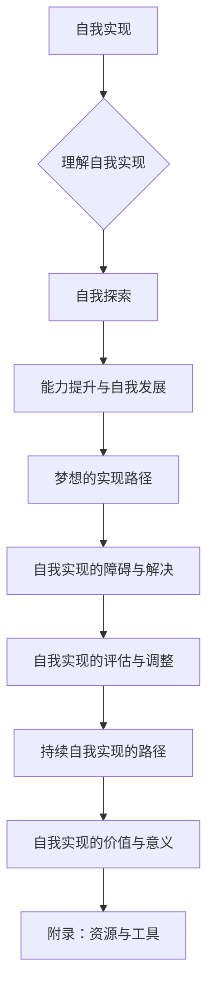

                 

### 自我实现：将梦想转化为现实的过程

在当今这个高速发展的信息时代，技术不断革新，人们面临的挑战和机遇也与日俱增。在这个背景下，自我实现成为一个越来越重要的议题。自我实现，顾名思义，是指个体通过不断努力，使自己的潜能得到最大限度的发挥，从而实现个人目标和理想的过程。那么，如何才能实现自我呢？本文将围绕这一主题，从准备、梦想的实现路径、障碍与解决以及评估与调整四个方面进行深入探讨，帮助读者理解并实践自我实现的过程。

关键词：自我实现、梦想、目标管理、执行力、障碍解决

摘要：本文旨在探讨如何通过自我实现的准备、梦想的实现路径、障碍与解决以及评估与调整，将个人的梦想转化为现实。文章通过分析每个环节的核心概念和实际操作方法，结合Python源代码和数学公式，为读者提供了一套完整的自我实现指南。

## 《自我实现：将梦想转化为现实的过程》目录大纲

1. **第一部分：自我实现的准备**
    1. 第1章：理解自我实现
        1.1 自我实现的定义与意义
        1.2 自我实现的核心要素
        1.3 自我实现的动机与挑战
    2. 第2章：自我探索
        2.1 自我意识的觉醒
        2.2 内在激情的挖掘
        2.3 自我定位与目标设定
    3. 第3章：能力提升与自我发展
        3.1 个人能力提升的方法
        3.2 学习与成长的重要性
        3.3 实践中的自我发展

2. **第二部分：梦想的实现路径**
    1. 第4章：梦想的设定与调整
        4.1 梦想的来源与类型
        4.2 梦想的设定与调整
        4.3 梦想与现实之间的平衡
    2. 第5章：目标管理与计划制定
        5.1 目标管理的SMART原则
        5.2 计划制定的步骤与方法
        5.3 遇到挑战时的应对策略
    3. 第6章：行动与执行力
        6.1 行动的意义与价值
        6.2 提高执行力的技巧
        6.3 持续行动与习惯养成

3. **第三部分：自我实现的障碍与解决**
    1. 第7章：自我实现的障碍
        7.1 内在障碍
        7.2 外在障碍
        7.3 障碍的识别与应对
    2. 第8章：情绪管理
        8.1 情绪的来源与影响
        8.2 情绪管理的技巧
        8.3 情绪管理中的自我关怀
    3. 第9章：自我实现的支持系统
        9.1 支持系统的构成
        9.2 建立支持系统的策略
        9.3 支持系统在自我实现中的作用

4. **第四部分：自我实现的评估与调整**
    1. 第10章：自我实现的评估
        10.1 评估的方法与工具
        10.2 评估结果的分析与应用
        10.3 根据评估结果调整自我实现计划
    2. 第11章：持续自我实现的路径
        11.1 持续自我实现的策略
        11.2 遇到挫折时的应对
        11.3 持续成长与自我实现

5. **附录**
    1. 附录 A：自我实现相关的书籍与文章
    2. 附录 B：自我实现相关的在线资源
    3. 附录 C：自我实现相关的工具与应用

### 1.1 自我实现的定义与意义

自我实现，是一个心理学和社会学的概念，起源于马斯洛的需求层次理论。马斯洛认为，人类的需求可以分为五个层次：生理需求、安全需求、社交需求、尊重需求和自我实现需求。自我实现需求是最高层次的需求，指的是个体追求自我完善、实现个人潜能和理想的过程。

从定义上看，自我实现是一个动态的过程，涉及到个体从内心深处认识到自己的潜能，并通过不断努力、学习和实践，逐步实现这些潜能。在这个过程中，个体不仅实现了自己的梦想，更实现了自我价值和社会价值。

自我实现的意义在于，它不仅能够帮助个体实现个人目标和理想，还能够促进社会的进步和发展。一个实现了自我的人，通常具有更高的创造力、更强的适应能力和更积极的人生态度，他们能够为社会做出更大的贡献。

在技术领域，自我实现的意义尤为突出。随着信息技术的飞速发展，技术人才的需求不断增长，而自我实现的能力则成为衡量一个技术人才综合素质的重要标准。一个能够自我实现的技术人才，不仅能够紧跟技术发展的步伐，还能够不断创新和突破，从而在竞争中脱颖而出。

总的来说，自我实现是一个涉及个人和社会的过程，它不仅关乎个体的成长和发展，更关乎社会的进步和繁荣。理解自我实现的定义和意义，是迈向自我实现的第一步。

### 1.2 自我实现的核心要素

自我实现是一个复杂的过程，涉及到多个核心要素。要实现自我，个体需要在以下几个方面进行深入探索和提升。

#### 自我意识

自我意识是指个体对自己的认知和理解。一个具有高度自我意识的人，能够清楚地认识到自己的优点和不足，从而有针对性地进行改进。自我意识是自我实现的基础，没有自我意识，就无法真正了解自己，也无法制定出符合自身特点的目标和计划。

提升自我意识的方法包括：
- 反思：定期反思自己的行为、思想和感受，分析自己的优点和不足。
- 咨询：与朋友、家人或专业人士交流，获取不同的观点和建议。
- 记录：通过写日记或记录自己的想法和感受，加深对自我认知的理解。

#### 内在激情

内在激情是指个体对某项事物或活动的热情和热爱。只有对某件事充满热情，个体才能持续地投入时间和精力，实现自我价值。内在激情是驱动个体自我实现的重要动力。

挖掘内在激情的方法包括：
- 探索：尝试不同的活动和领域，找到自己真正热爱的事物。
- 挑战：面对新的挑战，通过克服困难来激发自己的激情。
- 学习：不断学习新知识，提升自己在某领域的专业素养，从而增强内在激情。

#### 目标设定

目标设定是自我实现的核心步骤之一。明确的目标可以帮助个体集中精力，有的放矢地实现自我价值。一个有效的目标应该具备SMART原则，即具体（Specific）、可衡量（Measurable）、可实现（Achievable）、相关（Relevant）和有时限（Time-bound）。

设定目标的方法包括：
- 明确目标：将抽象的梦想转化为具体的、可衡量的目标。
- 制定计划：为实现目标制定详细的步骤和计划，确保每个步骤都可行。
- 调整目标：根据实际情况调整目标，确保目标的实现性和可行性。

#### 能力提升

能力提升是实现自我价值的重要保障。一个具备了所需能力的人，能够更好地应对各种挑战，实现自我价值。能力提升不仅包括专业技能的提升，还包括综合素质的提升，如沟通能力、团队合作能力等。

提升能力的方法包括：
- 学习：通过读书、上课、参加培训等方式，不断学习新知识和技能。
- 实践：将学到的知识应用到实际工作中，通过实践来提升能力。
- 反馈：接受他人的反馈和建议，不断改进自己的能力和行为。

#### 自我发展

自我发展是一个持续的过程，涉及到个体的心理、情感和社交等多方面。一个自我发展良好的人，能够更好地适应社会环境，实现个人价值和梦想。

促进自我发展的方法包括：
- 自我反思：通过反思自己的行为和思想，发现自己的问题和不足。
- 社交互动：积极参与社交活动，与他人交流和合作，提升自己的社交能力。
- 心理调适：学会心理调适技巧，如放松训练、情绪管理等，以应对生活中的压力和挑战。

通过以上几个方面的努力，个体可以逐步实现自我，实现个人梦想和理想。自我实现是一个长期的过程，需要个体持续努力和不断探索。只有在不断追求中，个体才能找到真正属于自己的道路，实现真正的自我价值。

### 1.3 自我实现的动机与挑战

自我实现的动机源于个体对自我价值的追求和对未来的期待。每个人在成长过程中都会形成自己的梦想和目标，这些梦想和目标成为了推动个体不断前进的动力。自我实现的动机可以分为内在动机和外在动机两种。

**内在动机**是指个体基于自身的兴趣、热情和价值观，自愿追求自我实现的愿望。例如，一个热爱编程的人，可能会将编写出高性能的软件作为自己的目标。这种内在动机往往能够带来持久的动力，使个体在实现自我过程中充满热情和活力。

**外在动机**则是指个体受到外界压力或期望，而追求自我实现的愿望。例如，为了获得更高的薪资和职业地位，一个人可能会不断努力提升自己的专业技能。虽然外在动机在某些情况下能够带来短期效果，但长期依赖外在动机可能会导致个体失去自我驱动力，影响自我实现的效果。

在自我实现的过程中，个体会遇到各种各样的挑战。这些挑战可以分为内在障碍和外在障碍两种。

**内在障碍**主要包括：

1. **自我怀疑**：个体对自己的能力、价值和未来的怀疑，可能会导致动力不足和放弃。
2. **恐惧失败**：害怕失败可能会阻碍个体尝试新事物，从而限制了自我实现的可能性。
3. **心理疲劳**：长期的自我追求和努力，可能会使个体感到心理疲劳，影响自我实现的持续性和积极性。

**外在障碍**则包括：

1. **环境压力**：社会环境、家庭环境和工作环境中的压力，可能会对个体的自我实现产生负面影响。
2. **资源限制**：缺乏必要的资源，如时间、金钱和技能，可能会阻碍个体实现自我目标。
3. **人际关系**：不和谐的人际关系可能会对个体的情绪和动力产生负面影响，从而影响自我实现的效果。

面对这些挑战，个体需要采取积极的态度和有效的策略来应对。首先，个体需要建立自信，通过不断努力和积累经验，提高自己的能力和自信心。其次，个体需要制定合理的计划和目标，逐步实现自我价值。此外，个体还需要学会调整心态，保持积极乐观的态度，面对失败和挫折时，能够保持冷静和坚持。

总之，自我实现是一个复杂而充满挑战的过程，需要个体在动机的驱动下，克服内在和外在的障碍，持续不断地努力和追求。只有这样，个体才能真正实现自我，找到属于自己的价值和意义。

### 2.1 自我意识的觉醒

自我意识是自我实现的基础，只有真正认识到自己的内心世界，个体才能找到适合自己的道路，实现自我价值。自我意识的觉醒，意味着个体开始关注自己的思想、情感和行为，并对其进行深入反思和探索。

**如何提高自我意识？**

1. **反思与自省**：定期进行自我反思，思考自己的行为和决策背后的动机和影响。通过自省，个体可以更好地了解自己的优点和不足，从而有针对性地进行改进。

2. **记录与总结**：通过写日记、记录日常行为和思想，个体可以更加清晰地看到自己的内心活动，从而提高自我意识。

3. **寻求反馈**：与朋友、家人或专业人士交流，获取他们对自己行为和思想的看法和建议。他人的视角可以帮助个体更全面地认识自己。

4. **心理测试与评估**：通过参与心理测试和评估，个体可以了解自己在性格、能力和情绪等方面的特点，从而提高自我意识。

**自我意识的觉醒对自我实现的影响**

自我意识的觉醒对自我实现具有重要意义。首先，它帮助个体更清晰地认识到自己的优势和劣势，从而制定出更合理的目标和计划。其次，通过自我意识的觉醒，个体可以更好地了解自己的内心需求和动机，从而在实现自我过程中保持动力和热情。此外，自我意识的觉醒还能帮助个体更好地应对挫折和挑战，保持积极的心态，持续追求自我实现。

总之，自我意识的觉醒是自我实现的第一步，它为个体提供了一个清晰的自我认知框架，使个体能够更好地理解自己和周围的世界，从而实现自我价值。在自我实现的道路上，不断提高自我意识，将使个体更加坚定和自信地迈向成功。

### 2.2 内在激情的挖掘

内在激情是驱动个体追求自我实现的重要动力。它源于个体对某项事物或活动的深厚兴趣和热爱，能够带来持久的热情和动力。挖掘内在激情，可以帮助个体找到真正的热爱，从而在自我实现的道路上更加坚定和有力。

**如何挖掘内在激情？**

1. **探索和尝试**：不断尝试不同的事物和活动，寻找自己真正热爱和感兴趣的事物。只有通过实践，个体才能真正了解自己的兴趣所在。

2. **专注与坚持**：在探索过程中，保持专注和坚持，不断深入挖掘自己的兴趣。只有通过持续的努力，个体才能发现自己的真正激情所在。

3. **反思与调整**：定期反思自己的兴趣和激情，评估自己的行为和投入程度。通过反思，个体可以更好地了解自己的内心需求，并进行必要的调整。

4. **与志同道合的人交流**：与志同道合的人交流，分享自己的兴趣和激情。他人的观点和建议可以帮助个体更全面地认识自己的兴趣，并找到更适合自己的发展路径。

**内在激情对自我实现的重要性**

内在激情是自我实现的强大动力。它使个体在面对困难和挑战时，能够保持热情和动力，持续追求自己的目标。同时，内在激情还能够激发个体的创造力和创新能力，使个体在自我实现的过程中不断突破自我，实现更高的成就。

1. **提高动力和积极性**：内在激情能够激发个体的内在动力，使个体更加积极主动地追求自我实现。

2. **增强创造力和创新能力**：内在激情使个体更加关注和热爱自己的领域，从而激发创造力和创新能力，推动自我实现。

3. **提高心理韧性和适应力**：在面对挫折和挑战时，内在激情能够帮助个体保持积极的心态，增强心理韧性和适应力。

总之，挖掘和培养内在激情，是自我实现的关键一步。只有找到并保持对某项事物或活动的激情，个体才能在自我实现的道路上走得更远、更稳。

### 2.3 自我定位与目标设定

自我定位与目标设定是自我实现过程中的关键环节。通过明确自己的定位和目标，个体可以更加清晰地认识自己，规划自己的发展方向，从而实现自我价值。

**如何进行自我定位？**

1. **评估自身优势与不足**：通过反思和总结，了解自己的优点和不足。这是进行自我定位的基础，有助于个体找到自己的核心竞争力。

2. **确定职业兴趣和方向**：根据自己的兴趣和职业倾向，确定适合自己的职业发展方向。这可以结合职业性格测试、职业兴趣量表等方法，帮助个体更准确地定位自己。

3. **了解市场需求与趋势**：研究当前市场和行业的发展趋势，了解哪些领域和技能具有更高的市场需求和发展前景。这有助于个体根据市场需求调整自己的定位和目标。

**如何设定目标？**

1. **明确具体目标**：将抽象的梦想转化为具体的目标。具体的目标应该具备SMART原则，即具体（Specific）、可衡量（Measurable）、可实现（Achievable）、相关（Relevant）和有时限（Time-bound）。

2. **分解目标**：将大目标分解为一系列小目标，逐步实现。这样可以使目标更加具体和可行，同时也能帮助个体保持动力和积极性。

3. **制定实施计划**：为实现目标制定详细的实施计划，包括具体的行动步骤、时间安排和资源需求。这有助于个体有条不紊地推进目标的实现。

**自我定位与目标设定对自我实现的作用**

1. **明确发展方向**：通过自我定位和目标设定，个体可以明确自己的发展方向和路径，避免盲目和无序的努力。

2. **提供动力和方向**：明确的目标和定位为个体提供了明确的动力和方向，使个体能够更加专注和有目标地追求自我实现。

3. **提升执行力和效能**：通过制定详细的实施计划和行动步骤，个体能够更好地提升执行力和效能，确保目标的实现。

总之，自我定位与目标设定是自我实现过程中的重要环节。通过准确地进行自我定位和设定合理的目标，个体可以更加清晰地认识自己，找到适合自己的发展路径，从而实现自我价值。

### 3.1 个人能力提升的方法

在自我实现的过程中，个人能力的提升是一个不可或缺的环节。能力提升不仅能够帮助个体应对各种挑战，还能够增强自信心，提高工作效率和效能。以下是几种有效的方法，帮助个体提升个人能力。

**持续学习与自我提升**

持续学习是个人能力提升的重要途径。现代社会知识更新迅速，个体需要不断学习新知识、新技能，以适应不断变化的环境。以下是一些具体的学习方法：

1. **阅读**：广泛阅读专业书籍、学术论文和行业报告，了解最新的理论和实践成果。通过阅读，个体可以扩展知识面，提升思维深度。
2. **参加培训**：参加各种在线或线下的培训课程，学习专业技能和知识。专业的培训课程往往能够提供系统的学习内容和实践经验，有助于快速提升能力。
3. **在线学习平台**：利用在线学习平台，如Coursera、edX等，学习各种课程。这些平台提供了丰富的学习资源，可以满足个体多样化的学习需求。
4. **实践**：将学到的知识应用到实际工作中，通过实践来提升能力。实践是检验知识的重要手段，通过不断的实践，个体能够更好地掌握和应用所学知识。

**培养良好习惯与技巧**

除了持续学习，培养良好的习惯和技巧也是提升个人能力的重要手段。以下是一些值得培养的习惯和技巧：

1. **时间管理**：合理安排时间，确保有足够的时间用于学习、工作和其他活动。良好的时间管理习惯能够提高工作效率，减少不必要的拖延。
2. **目标设定**：设定明确的目标，并制定详细的计划。通过设定目标和计划，个体可以更加有条不紊地推进自己的工作，提高效能。
3. **反思与总结**：定期进行反思和总结，评估自己的行为和效果。通过反思和总结，个体可以了解自己的不足，并制定改进措施。
4. **合作与沟通**：培养良好的合作与沟通技巧，与他人建立良好的合作关系。良好的沟通和合作能够提高团队效率，促进个人能力的提升。

**寻找导师与榜样**

寻找导师和榜样是提升个人能力的重要途径。导师和榜样可以提供宝贵的指导和建议，帮助个体更好地认识自己，找到适合自己的发展路径。

1. **寻找导师**：选择一位经验丰富的导师，向他们请教和学习。导师可以提供专业的指导，帮助个体解决实际问题，提升能力。
2. **学习榜样**：找到行业中的榜样人物，研究他们的成功经验和实践方法。通过学习榜样，个体可以借鉴他们的经验和技巧，提升自己的能力。

**积极参加社交活动**

积极参加社交活动，拓宽人际网络，也是提升个人能力的重要手段。通过社交活动，个体可以结识更多的同行和专家，交流经验和观点，提升自己的专业素养。

1. **行业会议和研讨会**：参加行业会议和研讨会，了解行业动态，结识同行。这些活动为个体提供了学习交流和拓展视野的机会。
2. **社交网络**：利用社交媒体和专业网络平台，如LinkedIn，与行业人士建立联系。通过社交网络，个体可以获取更多的信息资源，拓宽人脉。

总之，个人能力提升是自我实现的关键一步。通过持续学习、培养良好习惯和技巧、寻找导师和榜样以及积极参加社交活动，个体可以不断提升自己的能力，为实现自我价值奠定坚实基础。

### 3.2 学习与成长的重要性

在自我实现的过程中，学习和成长是不可或缺的关键因素。它们不仅为个体提供了不断进步的动力，还是实现自我价值和理想的基础。以下是学习和成长在自我实现中的重要性及其具体体现：

**持续学习的必要性**

1. **知识更新**：随着科技的飞速发展，知识更新速度越来越快。持续学习是保持知识和技能现代化的必要手段。通过不断学习，个体能够紧跟行业动态，掌握最新的技术趋势和研究成果，从而在职场中保持竞争力。
2. **技能提升**：学习新知识和技能不仅能够提高个体的专业水平，还能够扩展其能力边界。例如，学习编程语言的最新版本、掌握新兴的云计算技术或了解人工智能的先进应用，都可以显著提升个体的职业价值。
3. **适应变化**：社会和环境的变化对个体提出了新的要求。持续学习能够帮助个体适应这些变化，提升其适应能力和灵活性。这种能力在快速变化的环境中尤为重要。

**个人成长的体现**

1. **自信增强**：随着知识和技能的提升，个体在工作和生活中会变得更加自信。自信不仅能够提高工作效率，还能够增强个体在社交场合中的表现，从而促进个人成长。
2. **自我认知**：通过学习和反思，个体能够更好地了解自己的优势和不足。这种自我认知有助于个体制定更合理的发展目标和计划，从而实现自我提升。
3. **情绪管理**：学习和成长还可以帮助个体提升情绪管理能力。在面对压力和挑战时，具备良好情绪管理能力的人能够保持冷静和乐观，从而更好地应对困难，实现个人目标。

**学习与成长的实践方法**

1. **设定学习目标**：明确的学习目标是学习和成长的起点。个体应根据自己的职业规划和发展需求，设定具体、可衡量和有时限的学习目标。
2. **制定学习计划**：制定详细的学习计划，包括学习内容、时间安排和资源分配。通过计划，个体可以更加系统地进行学习，确保学习目标的实现。
3. **行动与实践**：理论知识需要通过实践来巩固和提升。个体应将所学知识应用到实际工作中，通过实践来检验和提升自己的能力。
4. **定期反思**：定期反思自己的学习过程和成果，评估自己的进步和不足。通过反思，个体可以及时调整学习方法和计划，提高学习效率。

总之，学习和成长是自我实现的核心环节。通过持续学习和积极成长，个体可以不断提升自己的能力和素质，实现个人价值和理想。在这个过程中，个体不仅能够实现自我价值，还能够为社会做出更大的贡献。

### 3.3 实践中的自我发展

在实践中进行自我发展是自我实现的关键步骤。通过实际操作和持续实践，个体不仅能够将所学知识转化为实际能力，还能够不断探索和发现新的机会。以下是一些在实践中进行自我发展的方法和策略。

**项目实践的重要性**

1. **技能提升**：通过参与项目实践，个体能够将理论知识应用到实际工作中，从而提升专业技能。例如，编程人员可以通过开发实际项目来提升编程能力和系统设计能力。
2. **解决问题能力**：项目实践中遇到的问题和挑战，可以帮助个体提升解决问题的能力。面对实际的问题，个体需要分析问题、设计解决方案并执行，这一过程能够锻炼个体的逻辑思维和问题解决能力。
3. **团队合作**：项目实践往往需要团队合作。通过与团队成员的沟通和协作，个体能够提升沟通能力、协调能力和团队协作能力。

**实践中的策略与方法**

1. **选择合适的实践项目**：选择与自己专业和兴趣相关、具有一定挑战性的项目，这样能够在实践中获得更多的成长机会。
2. **设立明确的目标和计划**：在开始项目实践前，应设立明确的目标和计划，包括项目的目标、时间表和资源需求。这有助于个体更好地组织工作，确保项目能够顺利进行。
3. **不断学习和调整**：在项目实践中，个体需要不断学习和调整。通过学习新的技术和方法，个体能够提升项目质量；通过及时调整策略和计划，个体能够应对项目中的各种挑战。
4. **反思和总结**：项目结束后，个体应进行反思和总结。通过反思，个体可以了解自己在项目中的表现和不足，总结经验教训；通过总结，个体可以制定改进措施，为未来的项目提供借鉴。

**实际案例分析与解读**

**案例一：软件工程师的小项目实践**

假设一位软件工程师希望提升自己的编程能力，他选择开发一个个人博客系统作为实践项目。在项目实施过程中，他首先进行了需求分析和系统设计，然后编写了代码并进行了调试和优化。在项目开发过程中，他遇到了多种技术挑战，如数据库设计、前端界面实现和安全性问题。通过不断学习和调整，他成功完成了项目，并从中提升了编程技能和问题解决能力。

**案例二：市场营销人员的市场调研实践**

一位市场营销人员希望通过市场调研实践提升自己的市场分析和营销策划能力。她选择了一个新市场作为调研对象，制定了详细的调研计划和问卷设计。在实施调研过程中，她积极与潜在客户进行沟通，收集了大量的数据和反馈。通过数据分析，她发现了市场的潜在机会和挑战，并据此制定了有效的营销策略。这个实践项目不仅提升了她的市场分析能力，还为她未来的营销工作提供了宝贵的经验。

**项目小结**

通过项目实践，个体不仅能够提升专业技能和解决问题的能力，还能够培养团队合作和项目管理能力。实践中的挑战和困难，是自我发展的试金石，只有通过不断的实践和反思，个体才能在自我实现的道路上不断进步。总之，实践中的自我发展，是通往成功和自我实现的重要途径。

### 4.1 梦想的来源与类型

梦想，是激励个体不断前进的重要动力源泉。它源于个体的内心渴望和愿景，是内心深处对未来的美好期望和追求。那么，梦想的来源有哪些呢？一般来说，梦想的来源可以分为内在因素和外在因素两种。

**内在因素**

1. **个人兴趣**：个人的兴趣爱好往往是梦想的源泉。例如，一个对音乐充满热情的人，可能会梦想成为一名音乐家；一个对科学充满好奇的人，可能会梦想成为一名科学家。
2. **价值观**：个人的价值观和信念也会影响梦想的生成。例如，一个热爱公益事业的人，可能会梦想成为一名慈善家或社会活动家。
3. **自我认知**：对自我的认知和理解，可以帮助个体找到自己真正想要追求的梦想。通过自我探索，个体能够更好地了解自己的兴趣、能力和价值观，从而形成清晰而坚定的梦想。

**外在因素**

1. **环境影响**：家庭、学校、社会等环境因素对个体的梦想产生重要影响。例如，一个在科技创新环境中成长的人，可能会梦想成为一名科技创业者。
2. **他人影响**：身边人的意见和建议也会对个体的梦想产生影响。父母、老师、朋友等可能通过他们的经验和观点，启发和引导个体形成自己的梦想。
3. **社会需求**：社会的发展需求和趋势，也会对个体的梦想产生激励作用。例如，随着信息技术的发展，数据科学家、人工智能工程师等职业变得越来越受欢迎，这可能会激发一些人对这些职业的梦想。

**梦想的类型**

根据来源和内容的不同，梦想可以分为以下几种类型：

1. **职业梦想**：这是最常见的梦想类型，主要涉及个体希望在职业生涯中达到的目标。例如，成为一名医生、律师、教师等。
2. **成就梦想**：这类梦想侧重于个体希望在特定领域或项目上取得的成就。例如，获得某项荣誉、发表一篇重要论文、完成一项重要的创新项目等。
3. **生活梦想**：这类梦想关注个体希望实现的生活方式。例如，拥有一个温馨的家庭、一个舒适的住所、实现财务自由等。
4. **社会梦想**：这类梦想涉及到个体希望为社会做出的贡献。例如，改善某个社会问题、推动某个社会变革等。

了解梦想的来源和类型，有助于个体更好地认识自己，找到自己的梦想，并为实现梦想制定合理的计划和策略。在自我实现的道路上，明确而坚定的梦想是不可或缺的动力源泉。

### 4.2 梦想的设定与调整

设定梦想是自我实现的第一步，但仅有梦想还不够，个体需要明确地设定梦想，并制定具体的实现路径。以下是梦想设定的关键步骤：

**设定梦想的步骤**

1. **明确梦想的类型**：首先，需要明确自己的梦想属于哪种类型，如职业梦想、成就梦想、生活梦想或社会梦想。这有助于个体集中精力，明确梦想的具体方向。
2. **设定具体的目标**：将抽象的梦想转化为具体的、可衡量的目标。具体的目标应该具备SMART原则，即具体（Specific）、可衡量（Measurable）、可实现（Achievable）、相关（Relevant）和有时限（Time-bound）。例如，如果梦想是成为一名数据科学家，具体的目标可以是“在三年内通过Coursera完成数据科学的相关课程，并在公司项目中展示数据科学的应用”。
3. **制定实现路径**：为实现目标，需要制定详细的实现路径和计划。这包括具体的行动步骤、时间安排和资源需求。例如，为实现上述数据科学家的梦想，实现路径可以包括每天学习两个小时的课程、每月参加一次数据科学相关的线上研讨会、积极参与公司项目等。
4. **定期评估和调整**：设定梦想后，需要定期评估进展情况，并根据实际情况进行调整。这有助于保持梦想的实现路径的可行性和有效性。

**调整梦想的原因**

1. **实际情况变化**：随着时间和环境的变化，个体的实际情况可能会发生变化，如职业、家庭状况等。这可能会导致原有的梦想不再符合实际情况，需要调整。
2. **目标难度过高**：如果设定的目标难度过高，可能需要重新调整。这不仅可以保持梦想的实现路径的可行性，还可以避免因目标过于艰巨而导致的挫败感。
3. **新的发现和兴趣**：个体在探索和成长过程中，可能会发现自己的新兴趣和目标，这可能会促使原有的梦想进行调整。

**如何调整梦想**

1. **重新评估**：在实际情况发生变化或发现新兴趣时，需要重新评估自己的梦想和目标。通过反思和评估，明确新的梦想和目标。
2. **设定新目标**：根据新的梦想和目标，重新设定具体的目标，并制定新的实现路径。
3. **调整实现路径**：根据新的目标，调整实现路径中的具体行动步骤和时间安排，确保新的梦想能够得到有效实现。

总之，梦想的设定与调整是自我实现过程中不可或缺的一部分。通过明确地设定梦想，并灵活地调整梦想，个体可以更好地应对变化，实现自我价值。

### 4.3 梦想与现实之间的平衡

在追求梦想的过程中，个体往往需要面对现实与梦想之间的冲突。如何在梦想和现实之间找到平衡，是自我实现的重要课题。以下是几点建议，帮助个体在追求梦想的同时，兼顾现实的需求。

**1. 理解现实的限制**

现实总是存在一定的限制，包括时间、资源、环境等。个体需要认清这些限制，并在追求梦想时充分考虑。例如，如果梦想是创业，但目前的资金和经验有限，那么可以考虑从小规模的创业项目开始，逐步积累经验和资源。

**2. 设定合理的期望**

设定过高的期望可能会导致挫败感和失望。个体需要设定合理的目标，并明确梦想的实现是一个逐步的过程。例如，如果梦想是成为行业专家，可以通过设定阶段性目标，如掌握某项技能、完成某项项目等，逐步接近梦想。

**3. 优先管理时间**

时间管理是实现梦想的关键。个体需要合理规划时间，确保有足够的时间用于追求梦想。例如，可以通过制定日程表、设定优先级等方式，将时间分配给重要的梦想追求活动。

**4. 保持灵活和适应**

现实往往不可预测，个体需要保持灵活和适应。在实现梦想的过程中，可能会遇到各种困难和挑战，个体需要能够及时调整策略和计划。例如，如果原计划的项目进度受阻，可以调整计划，重新分配资源，确保项目的顺利进行。

**5. 适时调整梦想**

随着时间和环境的变化，梦想也可能会发生变化。个体需要适时调整梦想，确保梦想与现实保持平衡。例如，如果发现目前的职业规划与梦想不再相符，可以重新评估和调整职业目标。

通过理解现实的限制、设定合理的期望、优先管理时间、保持灵活和适应以及适时调整梦想，个体可以在追求梦想的过程中，更好地平衡梦想与现实，实现自我价值。

### 5.1 目标管理的SMART原则

在自我实现过程中，有效的目标管理是至关重要的。SMART原则是一种广泛应用的、帮助个体设定和实现目标的方法，它确保目标具有明确性、可衡量性、可实现性、相关性和时限性。以下是SMART原则的具体解释和应用。

**具体（Specific）**

设定具体的目标意味着目标应当清晰、明确，避免模糊和含糊其辞。一个具体的目标可以清晰地描述出需要实现的内容和结果。例如，而不是说“我要变得更健康”，可以设定一个具体的目标：“每天锻炼30分钟，每周至少进行三次有氧运动”。

**可衡量（Measurable）**

可衡量性是指目标应当具有量化的标准，这样个体可以清晰地知道目标是否已经实现。通过设置量化的指标，可以方便地跟踪进度和评估结果。例如，如果目标是“提高编程技能”，可以设定一个可衡量的目标：“在接下来的三个月内，完成三个编程项目，并在GitHub上分享代码”。

**可实现（Achievable）**

可实现性要求目标应当是实际可行的，考虑到个体当前的资源、能力和其他现实因素。设定不切实际的目标可能会导致挫败感和放弃。例如，如果目标是“在一个月内学会Python”，但个体之前从未接触过编程，那么这个目标可能过于艰巨。相反，可以设定一个更实际的目标：“在接下来的三个月内，每周学习两个小时的Python，并完成一个小项目”。

**相关（Relevant）**

相关性是指目标应当与个人的长期愿景和价值观相一致。一个相关的目标可以更好地激励个体持续努力，因为它与个人的核心目标和梦想紧密相连。例如，如果一个人的长期愿景是“成为优秀的项目经理”，那么设定一个相关的目标：“在未来六个月内，通过PMP认证考试，并参与至少两个实际项目”。

**时限（Time-bound）**

时限性意味着目标应当有一个明确的时间框架，这样个体可以设定时间节点，确保目标在特定时间内完成。这有助于提高个体的紧迫感和动力。例如，如果目标是“提高演讲能力”，可以设定一个时限性的目标：“在接下来的三个月内，每周进行一次30分钟的演讲练习，并在月底进行一次公开演讲”。

**应用案例**

假设一个软件开发人员希望提高自己的编程技能。他可以应用SMART原则来设定具体的目标：

1. **具体**：“在接下来的六个月内，通过学习高级编程技巧，提高代码的可读性和效率”。
2. **可衡量**：“完成五门在线编程课程，并在每个课程结束时提交项目作业”。
3. **可实现**：“每天晚上花费两个小时的空闲时间进行学习，并确保所有课程内容在六个月内完成”。
4. **相关**：“通过提高编程技能，为未来的高级项目做好准备，并在公司内获得更多的机会”。
5. **时限**：“六个月内完成所有课程，并在课程结束后进行一次代码审查，确保所学内容能够实际应用”。

通过应用SMART原则，个体可以设定明确、具体且可实现的目标，从而更好地实现自我提升和自我实现。

### 5.2 计划制定的步骤与方法

制定有效的计划是实现目标的关键步骤。一个详细的计划可以帮助个体明确行动步骤、分配资源、管理时间和提高执行力。以下是制定计划的具体步骤和方法。

**步骤一：明确目标**

首先，需要明确目标，这是制定计划的基础。目标应当是具体、可衡量、可实现、相关和有时限的（SMART原则）。例如，目标是“在未来六个月内，通过学习高级编程技巧，提高代码的可读性和效率”。

**步骤二：分解目标**

将大目标分解为一系列小目标和任务，这样可以使计划更加具体和可行。每个小目标和任务都应该具备SMART原则。例如，将大目标分解为：

- 小目标1：“完成五门在线编程课程”。
- 小目标2：“在课程结束时提交项目作业”。
- 小目标3：“每天晚上花费两个小时的空闲时间进行学习”。

**步骤三：制定行动步骤**

为每个小目标和任务制定具体的行动步骤。这包括需要完成的具体任务、行动的时间安排和资源需求。例如：

- 行动步骤1：“每天晚上7点到9点，学习编程课程”。
- 行动步骤2：“每周日晚上，回顾一周的学习内容和进度”。
- 行动步骤3：“在课程结束后的一周内，提交项目作业”。

**步骤四：分配资源**

为计划分配必要的资源，包括时间、金钱和人力等。确保有足够的资源支持计划的实施。例如：

- 资源1：“购买五门编程课程的学习材料”。
- 资源2：“安排每天的空闲时间用于学习”。
- 资源3：“如果遇到技术问题，寻求在线社区的帮助”。

**步骤五：设定时间框架**

为每个行动步骤设定明确的时间框架，确保任务在特定时间内完成。例如：

- 时间框架1：“每天晚上7点到9点，学习编程课程，为期六个月”。
- 时间框架2：“每周日晚上，回顾一周的学习内容和进度，为期六个月”。
- 时间框架3：“在课程结束后的一周内，提交项目作业，为期六个月”。

**步骤六：监控与调整**

在计划执行过程中，需要定期监控进度，并根据实际情况进行调整。这可以帮助个体保持计划的可行性和有效性。例如：

- 监控1：“每周一早上，回顾上周的学习进度，并根据进度调整本周的计划”。
- 监控2：“如果在某个阶段遇到困难，及时调整行动步骤和时间安排”。
- 监控3：“在计划结束时，进行总体评估，总结经验教训，并制定下一阶段的计划”。

**方法一：Gantt图**

Gantt图是一种常用的项目管理工具，用于展示任务的进度和时间安排。通过Gantt图，可以直观地看到每个任务的开始和结束时间，以及整个项目的进度。例如，使用Gantt图可以清晰地展示上述计划的每个任务的时间安排。

**方法二：思维导图**

思维导图可以帮助个体更好地梳理和规划计划。通过思维导图，可以将大目标分解为小目标和任务，并展示它们之间的逻辑关系。例如，使用思维导图可以清晰地展示每个小目标和任务的具体内容和时间安排。

通过以上步骤和方法，个体可以制定出详细、具体且可操作的计划，从而更好地实现目标。有效的计划不仅能够提高个体的执行力，还能够帮助个体在自我实现的道路上稳步前进。

### 5.3 遇到挑战时的应对策略

在追求自我实现的过程中，个体不可避免地会遇到各种挑战。这些挑战可能来自个人、环境或其他外部因素，但如何应对这些挑战，决定了个体能否最终实现自我价值。以下是一些有效的策略，帮助个体在遇到挑战时保持积极和有效。

**1. 保持积极心态**

积极心态是应对挑战的重要前提。面对困难和挫折，个体需要保持乐观和积极的态度。这种心态不仅能够帮助个体更好地应对挑战，还能够激发内在的动力，促使个体持续努力。例如，当遇到技术难题时，可以告诉自己这是一个学习和成长的机会，而不是挫折。

**2. 分析问题的根源**

在应对挑战时，首先要分析问题的根源。通过深入分析，可以找到问题的根本原因，从而制定出更加有效的解决方案。例如，如果项目进度受阻，可以分析是时间管理不当、资源分配不合理，还是团队成员之间的沟通不畅，然后有针对性地解决这些问题。

**3. 分解大问题**

面对复杂和庞大的问题，个体可以将它们分解为一系列小问题，逐一解决。这种方法不仅可以降低问题的复杂度，还可以提高解决问题的效率。例如，一个复杂的项目可以分解为多个阶段，每个阶段设定具体的目标和任务，然后逐一完成。

**4. 寻求外部帮助**

在遇到无法独自解决的挑战时，个体可以寻求外部帮助。这包括向导师、同事、朋友或专业人士请教，获取他们的建议和支持。外部帮助不仅能够提供新的视角和解决方案，还可以增强个体的信心和决心。例如，在技术难题上，可以请教经验丰富的同事或参加线上社区，获取技术支持。

**5. 调整计划和策略**

在应对挑战的过程中，个体需要根据实际情况及时调整计划和策略。如果发现原计划存在问题，可以及时修改，确保计划的可行性和有效性。例如，如果发现时间分配不合理，可以重新调整时间表，确保每个任务都能按时完成。

**6. 学会放松和调整**

长期面对挑战和压力，个体需要学会放松和调整。这包括进行适当的休息、锻炼和娱乐活动，以保持身心健康。例如，可以在工作间隙进行短暂的休息，进行一些轻松的锻炼，或者进行一些自己喜欢的娱乐活动，以缓解压力。

通过以上策略，个体可以更好地应对自我实现过程中的挑战，保持积极和高效的状态，最终实现自我价值。

### 6.1 行动的意义与价值

行动是实现自我实现的关键，没有行动，再美好的梦想也只能停留在空想阶段。行动不仅能够帮助个体克服惰性和拖延，还能够将梦想转化为现实，推动个体不断向前。

**1. 行动克服惰性**

惰性是阻碍个体实现梦想的重要因素之一。通过行动，个体可以打破惰性的束缚，激发内在的动力。例如，一个有梦想的程序员，如果只是停留在学习编程的理论阶段，可能会因为惰性而迟迟不开始编写代码。而一旦开始动手编写，他就会逐渐克服惰性，进入学习和实践的良性循环。

**2. 行动对抗拖延**

拖延是另一个影响自我实现的常见问题。通过设定明确的目标和计划，并付诸行动，个体可以有效地对抗拖延。例如，一个希望提高英语水平的职场人士，如果只是计划每天学习一小时，但从未付诸行动，那么计划将永远停留在纸面上。而一旦开始每天行动，哪怕只有几分钟，也能逐渐形成学习的习惯，克服拖延。

**3. 行动实现梦想**

行动是连接梦想和现实的桥梁。只有通过实际行动，个体才能逐步实现自己的梦想。例如，一个梦想成为作家的年轻人，如果只是写作而不发表，那么他的梦想将无法得到验证和实现。而一旦他开始行动，投稿、参加写作班、与读者互动，他的梦想将逐步变为现实。

**4. 行动促进成长**

行动不仅能够帮助个体实现梦想，还能够促进个人成长。通过实际行动，个体能够不断积累经验和知识，提高自己的能力和素质。例如，一个有志于创业的年轻人，如果只是停留在空想阶段，他可能永远无法了解创业的艰辛和挑战。而一旦他开始行动，亲自参与创业过程，他将学到许多宝贵的经验和教训，从而更好地实现自我成长。

总之，行动是实现自我实现的关键。通过行动，个体可以克服惰性和拖延，将梦想转化为现实，并促进个人成长。在自我实现的道路上，只有坚持不懈地行动，个体才能找到真正的成功和满足感。

### 6.2 提高执行力的技巧

执行力是实现目标的关键，它决定了个体能否将计划转化为实际成果。以下是一些提高执行力的技巧，帮助个体在自我实现的道路上更加高效地行动。

**1. 设定明确的目标和计划**

明确的目标和计划是执行力的基础。通过设定具体、可衡量、可实现、相关和有时限的目标，个体可以清晰地知道需要做什么、何时做以及如何做。例如，一个希望提高编程技能的目标可以是“在未来三个月内，完成三个编程项目，并在GitHub上分享代码”。

**2. 制定详细的行动步骤**

将大目标分解为一系列具体的行动步骤，有助于个体更好地执行计划。每个行动步骤都应包括具体的内容、时间安排和资源需求。例如，为了完成编程项目，可以制定以下行动步骤：“每天晚上8点到10点，学习编程课程”和“每周六下午，完成一个项目的初步设计”。

**3. 设定优先级**

合理安排时间和任务，确保重要且紧急的任务优先处理。这有助于个体更加专注于关键任务，提高效率。例如，可以使用优先级矩阵（如艾森豪威尔矩阵）来帮助设定任务的优先级。

**4. 利用工具和资源**

利用各种工具和资源，可以提高执行力的效率。例如，可以使用任务管理工具（如Trello、Asana）来追踪任务进度，使用时间管理工具（如Google Calendar、Microsoft To Do）来合理安排时间，使用在线学习平台（如Coursera、Udemy）来学习新技能。

**5. 保持积极心态**

积极心态能够帮助个体更好地应对挑战和困难，提高执行力。通过保持乐观、自信和决心，个体能够更加坚定地执行计划，克服障碍。例如，当遇到技术难题时，可以告诉自己这是一个学习和成长的机会。

**6. 学会说“不”**

合理拒绝不必要的事务和任务，有助于个体保持专注和集中精力。这不仅能减少干扰，还能提高执行效率。例如，当被邀请参加不必要的社交活动时，可以礼貌地拒绝，以确保有更多时间用于重要任务。

**7. 培养良好的习惯**

培养良好的工作和生活习惯，有助于提高执行力。例如，保持规律的作息时间、进行适当的锻炼和休息，以及定期进行反思和总结，都有助于提升执行力。

通过以上技巧，个体可以更好地提高执行力，确保计划的有效执行，从而实现自我价值和梦想。

### 6.3 持续行动与习惯养成

持续行动和习惯养成是实现自我实现的两个关键要素。只有通过不断的行动和养成良好的习惯，个体才能在自我实现的道路上稳步前进，最终实现自己的梦想和目标。

**持续行动的重要性**

持续行动是实现自我价值的根本。通过不断采取实际行动，个体能够积累经验和知识，提升自己的能力和素质。例如，一个希望成为优秀程序员的年轻人，如果能够每天坚持学习编程知识，编写代码并不断改进，那么他将在实践中不断成长，逐渐实现自己的职业目标。

**习惯养成的价值**

习惯养成是持续行动的重要保障。良好的习惯能够帮助个体在日常生活中更加高效和自律，从而确保持续行动的顺利进行。例如，养成每天早晨起床锻炼的习惯，可以帮助个体保持健康的身体和积极的心态，为一天的工作和学习打下良好的基础。

**如何养成良好习惯**

1. **设定明确的目标**：明确的目标是养成良好习惯的起点。通过设定具体、可衡量、可实现、相关和有时限的目标，个体可以清晰地知道需要养成哪些习惯，并制定详细的计划。

2. **逐步实施**：养成新习惯需要时间和耐心。个体可以从一些小目标开始，逐步增加难度。例如，可以从每天早上起床后进行五分钟的拉伸运动开始，逐渐增加到每天三十分钟。

3. **保持一致**：保持一致是实现习惯养成的关键。个体需要确保在相同的时间、相同的环境下进行相同的行动。这有助于在大脑中形成固定的记忆和习惯。

4. **奖励自己**：适当的奖励可以增强个体养成良好习惯的动力。例如，当成功养成每天阅读一小时的习惯后，可以奖励自己看一场电影或享受一次美食。

5. **找到支持系统**：找到支持和鼓励自己的朋友或家人，可以增强个体坚持良好习惯的信心。通过分享进展和心得，个体可以获得更多的鼓励和动力。

**实际案例**

一个年轻的软件工程师希望通过持续行动和习惯养成，提高自己的编程能力。他设定了一个具体的目标：“在接下来的六个月内，每天学习两个小时的编程知识，并编写至少一个简单的程序”。他通过以下步骤来实施：

1. **设定明确的目标**：每天晚上8点到10点用于学习编程，每周六下午用于编写程序。
2. **逐步实施**：从每天学习一小时开始，逐渐增加到两个小时。
3. **保持一致**：在书房设置专门的学习区域，确保每天在这个时间段内专注于学习。
4. **奖励自己**：每完成一个月的学习计划，奖励自己一次周末的休息。
5. **找到支持系统**：与同事组建学习小组，定期分享学习心得和代码，相互鼓励。

通过这些步骤，这个软件工程师不仅养成了良好的学习习惯，还显著提高了编程能力，最终实现了自己的职业目标。

总之，持续行动和习惯养成是实现自我实现的重要途径。通过设定明确的目标、逐步实施、保持一致、奖励自己和找到支持系统，个体可以养成良好习惯，实现自我价值和梦想。

### 7.1 自我实现的障碍

在追求自我实现的过程中，个体难免会遇到各种障碍。这些障碍可以分为内在障碍和外在障碍两种，它们可能会对个体的自我实现产生显著的影响。

**内在障碍**

1. **自我怀疑**：自我怀疑是自我实现过程中最常见的一种内在障碍。个体可能会对自己的能力、价值和未来感到不确定，从而导致动力不足和放弃。例如，一个程序员可能会怀疑自己是否能够胜任复杂项目的开发工作，这种自我怀疑会影响他的信心和决心。

2. **恐惧失败**：害怕失败是另一个内在障碍。个体担心在追求梦想的过程中失败，害怕面对失败带来的负面后果，从而不敢采取行动。例如，一个创业者可能会害怕失败带来的经济压力和社会压力，因此不敢启动自己的创业计划。

3. **心理疲劳**：长期的自我追求和努力，可能会导致个体感到心理疲劳。心理疲劳会使个体感到疲惫和无力，降低他们的工作热情和积极性。例如，一个长期处于高压工作状态的技术人员可能会感到身心疲惫，影响工作效率和创造力。

**外在障碍**

1. **环境压力**：外在环境中的压力，如家庭压力、工作压力和社会压力等，可能会对个体的自我实现产生负面影响。例如，一个职场人士可能会面临来自家庭和工作中的多重压力，这些压力会分散他的精力和注意力，影响他追求自我实现的能力。

2. **资源限制**：资源限制，如时间、金钱和技能等，可能会阻碍个体实现自我目标。例如，一个希望出国深造的学生可能会因为经济条件有限而无法实现这个目标，这种资源限制会限制个体的成长和发展。

3. **人际关系**：不和谐的人际关系可能会对个体的情绪和动力产生负面影响。例如，一个团队中的成员之间如果存在冲突和误解，可能会影响团队的工作效率和合作氛围，从而影响个体的自我实现。

**识别和应对障碍的方法**

1. **自我反思**：通过自我反思，个体可以更好地识别自己的内在障碍。例如，一个程序员可以通过定期反思，了解自己是否经常怀疑自己的能力，并尝试找出原因。

2. **设定小目标**：将大目标分解为一系列小目标，可以帮助个体逐步克服恐惧失败。例如，一个创业者可以将创业计划分解为一系列具体的步骤，并逐一完成，从而降低失败的风险。

3. **时间管理**：合理的时间管理可以帮助个体更好地应对外在环境中的压力。例如，一个职场人士可以通过制定日程表，合理安排工作和家庭时间，从而减轻压力。

4. **资源整合**：通过整合内外部资源，个体可以更好地应对资源限制。例如，一个学生可以通过申请奖学金、兼职工作等方式，解决经济问题，从而实现出国深造的目标。

5. **情绪管理**：学会情绪管理技巧，可以帮助个体更好地应对挫折和困难。例如，通过深呼吸、冥想和运动等方式，个体可以缓解压力，保持积极的心态。

通过识别和应对这些障碍，个体可以克服自我实现过程中的各种挑战，稳步迈向成功。

### 7.2 情绪管理的技巧

情绪管理是自我实现过程中至关重要的一环。有效的情绪管理不仅能够帮助个体更好地应对挑战和压力，还能够提升生活质量和工作效率。以下是几种实用的情绪管理技巧：

**1. 深呼吸**

深呼吸是一种简单而有效的情绪调节方法。通过深呼吸，个体可以降低心跳速度，放松身体，缓解紧张和焦虑。具体方法如下：

- 坐在舒适的椅子上，保持身体放松。
- 通过鼻子深吸气，感受空气进入肺部，腹部逐渐膨胀。
- 屏住呼吸，保持几秒钟，然后通过嘴巴缓缓呼气，感受紧张和压力随呼吸流出。
- 重复以上步骤，每次深呼吸持续3-5分钟。

**2. 冥想**

冥想是一种培养专注力和情绪稳定性的有效方法。通过冥想，个体可以减少大脑中的杂念，提高自我意识和情绪调节能力。以下是一个简单的冥想练习：

- 找一个安静的地方，坐或躺在一个舒适的姿势。
- 闭上眼睛，将注意力集中在自己的呼吸上。
- 感受每一次吸气和呼气，尝试不要让思维走得太远。
- 如果你的思维跑开了，轻轻地将注意力带回到呼吸上。
- 持续冥想5-10分钟，每天练习几次。

**3. 运动**

运动不仅能够增强身体素质，还能够释放压力和提升情绪。通过运动，个体可以释放体内的紧张情绪，提高心情。以下是一些适合的情绪管理运动：

- 快走或慢跑：每次30-60分钟，有助于放松身心，减轻焦虑。
- 瑜伽：通过瑜伽的体位练习和呼吸控制，提高身体和情绪的平衡。
- 动感单车：高强度的有氧运动，有助于提升心情，增强信心。

**4. 记日记**

记日记是一种很好的情绪释放和反思方法。通过写日记，个体可以倾诉内心的感受和情绪，从而减轻心理负担。以下是一些建议：

- 每天花一些时间写日记，记录当天的情绪、感受和思考。
- 不要担心写作技巧，关键是表达自己的真实感受。
- 在日记中，可以分析情绪的来源和影响，找到解决问题的方法。

**5. 情绪调节工具**

现代科技提供了许多情绪调节的工具和应用，如冥想应用、情绪跟踪器和放松音乐等。这些工具可以帮助个体更好地管理情绪，提高生活质量。以下是一些建议：

- 使用冥想应用，如Headspace或Calm，进行冥想练习。
- 使用情绪跟踪器，如Moodfit或Daylio，记录和管理情绪变化。
- 听放松音乐或自然声音，如雨声、海浪声，有助于放松身心。

通过以上情绪管理技巧，个体可以更好地调节自己的情绪，保持积极的心态，从而在自我实现的道路上更加顺利。

### 7.3 情绪管理中的自我关怀

在自我实现的过程中，情绪管理至关重要，而自我关怀是实现情绪稳定和心理健康的关键。自我关怀不仅包括对自身情绪的觉察和管理，还包括在生活中为自己创造舒适和满足。以下是几种自我关怀的策略，帮助个体在情绪管理中保持平衡和积极。

**1. 确定自己的需求**

自我关怀的第一步是了解自己的需求。每个人的需求都不同，可能包括生理需求、情感需求和心灵需求。通过反思和自我观察，个体可以识别出自己最需要的支持和关怀。

- **生理需求**：确保充足的睡眠、均衡的饮食和适当的锻炼。这些基本需求能够为个体的身体和心理提供必要的支持。
- **情感需求**：与家人、朋友和同事建立良好的关系，分享自己的感受和经历。情感支持是缓解压力和焦虑的重要来源。
- **心灵需求**：通过冥想、阅读或进行创造性活动，满足心灵的需求，提升自我意识和内在平静。

**2. 设定界限**

设定界限是自我关怀的重要部分。个体需要学会说“不”，避免过度承诺和过度劳累。这包括：

- **时间界限**：合理安排时间，确保有足够的时间用于工作、休息和个人兴趣。
- **情感界限**：学会拒绝不合理的要求和情感负担，保护自己的情感健康。
- **身体界限**：了解自己的身体极限，避免过度工作或锻炼，确保身心健康。

**3. 创建自我关怀的习惯**

养成自我关怀的习惯，可以在日常生活中提供持续的关爱和支持。

- **日常放松**：每天安排一些时间进行放松活动，如深呼吸练习、瑜伽或阅读。
- **定期反思**：定期花时间反思自己的行为、思想和感受，识别需要改进的地方，并制定相应的行动计划。
- **庆祝成就**：无论大小，庆祝自己的成就和进步，这可以增强自我价值感和自信心。

**4. 寻求专业帮助**

在自我关怀中，如果遇到难以应对的情绪困扰，寻求专业帮助是明智的选择。心理咨询师或心理医生可以提供专业的指导和支持，帮助个体更好地理解和管理情绪。

- **心理咨询**：通过与心理咨询师交流，个体可以探讨自己的情感困扰，找到有效的解决方案。
- **心理治疗**：如果情绪问题严重，心理治疗可以提供更为深入的帮助，如认知行为疗法、情绪聚焦疗法等。

通过这些自我关怀的策略，个体可以更好地管理情绪，保持心理健康，从而在追求自我实现的过程中更加坚定和自信。

### 7.4 建立支持系统的策略

建立支持系统是自我实现过程中不可或缺的一环。一个强大的支持系统可以为个体提供情感、信息和资源上的支持，帮助个体克服困难，实现自我价值。以下是几种有效的策略，帮助个体建立和维护一个支持系统。

**1. 寻找导师**

导师是支持系统中非常重要的一部分。他们通常具有丰富的经验和专业知识，能够为个体提供宝贵的指导和建议。以下是一些建立导师关系的策略：

- **主动寻求**：主动联系那些在自己领域有经验的人，请求他们的指导和建议。
- **定期交流**：与导师保持定期的沟通，分享自己的进展和挑战，听取导师的意见。
- **学习与反馈**：积极学习和应用导师的建议，并在实践中寻求反馈，不断完善自己的能力和技能。

**2. 加入社群**

加入与自己兴趣和目标相关的社群，可以帮助个体结识志同道合的朋友，分享经验和资源。以下是一些建立社群的策略：

- **参与线上社群**：加入一些专业的在线论坛和社群，如LinkedIn群组、技术论坛等，与其他成员交流和互动。
- **参加线下活动**：参加相关的会议、研讨会和社交活动，结识更多的同行和专家，扩大人脉网络。
- **贡献价值**：在社群中积极参与讨论，分享自己的经验和见解，成为社群的积极成员。

**3. 寻求家人和朋友的支持**

家人和朋友是支持系统中的另一重要组成部分。他们的情感支持和鼓励，对于个体的自我实现至关重要。以下是一些建立和维护家人和朋友支持的策略：

- **沟通和分享**：与家人和朋友保持开放和诚实的沟通，分享自己的目标和进展，寻求他们的理解和支持。
- **定期联系**：定期与家人和朋友保持联系，通过电话、短信或面对面交流，维持亲密的关系。
- **庆祝成就**：在实现重要目标和成就时，邀请家人和朋友一起庆祝，增强彼此的情感联系。

**4. 利用专业资源**

利用各种专业资源，如培训课程、在线学习平台和职业咨询服务等，可以帮助个体提升自己的能力和素质。以下是一些建立专业资源支持系统的策略：

- **参加培训**：参加与自己职业发展相关的培训课程，提升专业技能和知识水平。
- **在线学习**：利用在线学习平台，如Coursera、edX等，学习最新的技术和理论知识。
- **咨询服务**：寻求职业咨询师的帮助，制定个人职业规划，获得专业的指导和建议。

通过以上策略，个体可以建立一个强大的支持系统，为自己在自我实现的道路上提供持续的支持和帮助。

### 7.5 支持系统在自我实现中的作用

支持系统在自我实现过程中起着至关重要的作用。一个有效的支持系统可以为个体提供多方面的帮助，使其在追求自我目标的过程中更加顺利和自信。

**1. 提供情感支持**

情感支持是支持系统最重要的功能之一。在自我实现的过程中，个体可能会面临各种挑战和压力，情感支持可以帮助个体缓解焦虑和压力，保持积极的心态。家人、朋友和导师的情感支持，可以为个体提供心理上的安慰和鼓励，增强其面对困难的勇气和信心。

**2. 提供信息资源**

信息资源是自我实现的重要保障。一个强大的支持系统可以提供丰富的信息资源，如行业动态、技术趋势和职业机会等。这些信息可以帮助个体及时了解外部环境的变化，调整自己的目标和计划，更好地应对各种挑战。同时，社群和导师的知识和经验，也为个体提供了宝贵的指导和建议，帮助其提升自己的能力和素质。

**3. 提供实践机会**

支持系统可以帮助个体获取实践机会，将其理论知识应用到实际工作中。例如，导师和行业专家可以提供实习、项目合作或工作机会，让个体在实际工作中锻炼和提升自己的技能。此外，社群和同行的交流合作，也为个体提供了更多的实践机会，促进其专业成长和自我实现。

**4. 提供反馈与评估**

支持系统中的导师、家人和朋友，可以定期为个体提供反馈和评估，帮助其了解自己的进步和不足。这种反馈和评估，不仅可以帮助个体及时纠正错误，调整策略，还可以增强其自信心和成就感。通过不断的反馈和评估，个体可以更加清晰地认识自己，找到适合自己的发展路径，实现自我价值。

**5. 提供激励与鼓励**

在自我实现的道路上，个体的动力和激情可能会因为各种原因而受到影响。一个有效的支持系统可以为其提供持续的激励和鼓励，帮助其保持积极的态度和信心。家人、朋友和导师的认可和支持，可以激发个体的内在动力，使其在困难面前不屈不挠，坚定地追求自己的目标。

总之，支持系统在自我实现过程中发挥着重要的作用。通过提供情感支持、信息资源、实践机会、反馈与评估以及激励与鼓励，支持系统可以帮助个体克服各种挑战，实现自我价值，走上成功的道路。

### 8.1 评估的方法与工具

在自我实现的过程中，定期评估是实现目标、调整计划的重要环节。有效的评估不仅能够帮助个体了解自己的进步，还能为后续的行动提供有力的参考。以下是几种常用的评估方法和工具：

**1. 自我评估表**

自我评估表是一种简单而有效的评估工具，它可以帮助个体系统地评估自己在各个方面的表现。以下是一个简单的自我评估表示例：

| 项目          | 目标               | 实际完成情况 | 评估等级（1-10分） | 改进措施               |
|---------------|--------------------|--------------|-------------------|----------------------|
| 编程技能      | 掌握Python编程     | 完成两个项目 | 8                 | 继续学习高级Python特性 |
| 时间管理      | 每天学习2小时      | 完成计划     | 9                 | 保持时间表的灵活性     |
| 情绪管理      | 保持积极心态       | 基本稳定     | 7                 | 继续练习冥想和深呼吸 |

**2. 反馈问卷**

通过反馈问卷，个体可以收集来自导师、同事、家人和朋友等多方面的意见，从而更全面地了解自己的表现。以下是一个简单的反馈问卷示例：

1. 你认为我在编程技能方面有哪些优势和不足？
2. 你觉得我在时间管理方面有哪些做得好的地方，哪些需要改进？
3. 你对我保持积极心态的看法是什么？有哪些地方可以进一步提升？
4. 你对我未来目标的建议和期望是什么？

**3. 行为记录表**

行为记录表可以帮助个体详细记录自己在一段时间内的行为和表现，从而进行客观的评估。以下是一个简单的行为记录表示例：

| 日期       | 行为                 | 结果         | 反馈               |
|------------|----------------------|--------------|--------------------|
| 2023-04-01 | 完成Python课程学习   | 满意         | 继续保持学习节奏   |
| 2023-04-02 | 与朋友进行编程讨论   | 有所收获     | 建议增加讨论频率   |
| 2023-04-03 | 完成项目代码的调试   | 较好         | 注意代码优化       |

**4. 数据分析工具**

利用数据分析工具，如Google Analytics、Tableau等，个体可以更直观地了解自己的进展和变化。例如，通过分析学习时间、完成项目的数量和代码质量等数据，个体可以清晰地看到自己的成长轨迹，并据此调整学习计划和目标。

通过以上评估方法和工具，个体可以系统地了解自己的表现，发现不足，并制定改进措施，从而在自我实现的道路上不断进步。

### 8.2 评估结果的分析与应用

评估结果的分析与应用是自我实现过程中至关重要的一环。通过全面分析评估结果，个体可以深入了解自己的进步和不足，从而制定出更加有效的改进措施和计划。

**1. 梳理评估结果**

首先，个体需要将评估结果进行梳理，明确各个方面的成绩和问题。例如，在编程技能方面，可能评估结果为“8分”，表明技能水平较为优秀，但在代码优化方面仍有改进空间。在时间管理方面，可能评估结果为“9分”，表明时间安排较为合理，但需要增加灵活性以应对突发情况。

**2. 分析进步与不足**

接下来，个体需要深入分析评估结果，找出进步和不足的具体原因。对于进步的部分，个体可以思考哪些因素促成了这些进步，并总结成功经验，以便在今后的工作中持续应用。例如，如果编程技能的提升得益于每天的学习和项目实践，那么可以继续保持这种学习习惯。

对于不足的部分，个体需要找出导致问题的具体原因。例如，如果代码优化方面存在问题，可能是因为缺乏相关的知识和实践经验。通过分析原因，个体可以明确改进的方向和重点。

**3. 制定改进措施**

基于分析结果，个体需要制定具体的改进措施和计划。以下是一些建议：

- **强化薄弱环节**：针对评估结果中存在的问题，制定针对性的学习计划，重点攻克薄弱环节。例如，如果代码优化方面存在问题，可以安排额外的学习时间和项目实践，提升相关技能。
- **优化时间管理**：根据评估结果调整时间管理策略，确保有足够的时间用于关键任务和薄弱环节。例如，增加灵活的时间安排，预留应急时间，以应对突发情况。
- **建立反馈机制**：与导师、同事和社群成员建立反馈机制，定期获取反馈和建议，及时调整和改进自己的表现。

**4. 应用到实际工作中**

最后，个体需要将评估结果和应用措施应用到实际工作中。通过持续的努力和改进，个体可以不断提升自己的能力和表现，实现自我价值。例如，通过定期评估和学习，不断提高编程技能，参与更多的项目实践，从而在职业发展中取得更大的成就。

总之，评估结果的分析与应用是自我实现过程中的重要环节。通过全面分析评估结果，制定改进措施，并应用到实际工作中，个体可以不断提升自己，实现自我价值。

### 8.3 根据评估结果调整自我实现计划

在自我实现的过程中，评估结果不仅提供了对当前状态的了解，还为后续的行动和调整提供了重要的依据。根据评估结果调整自我实现计划，可以帮助个体更加精准地设定目标，优化策略，确保自我实现过程的持续性和有效性。

**1. 分析评估结果**

首先，个体需要仔细分析评估结果，识别出哪些方面取得了进步，哪些方面存在不足。例如，通过自我评估和反馈问卷，个体可能发现自己在编程技能上有所提升，但在项目管理和沟通能力方面仍有待加强。分析结果可以帮助个体明确哪些是优势，哪些是需要重点改进的领域。

**2. 识别优先级**

在确定需要改进的领域后，个体需要根据实际情况和目标优先级，识别出哪些问题是需要优先解决的。例如，如果项目管理的不足影响了团队的整体效率，那么这个问题可能需要优先解决。通过设定优先级，个体可以确保资源优先用于最关键的问题，从而更有效地推动自我实现。

**3. 制定新的目标**

基于评估结果，个体需要重新审视和调整自己的目标。新的目标应当更加具体、可衡量，并具备实现的可能性。例如，如果原目标是在六个月内完成三个项目，但评估结果显示在项目管理方面存在明显不足，那么可以调整目标，增加项目管理技能的提升时间，并确保新目标与改进措施相结合。

**4. 修订行动计划**

修订行动计划是调整自我实现计划的关键步骤。个体需要根据新的目标和优先级，重新制定具体的行动计划。例如，如果原计划是每天学习两个小时的编程，但评估结果显示时间管理需要改进，那么可以调整计划，将学习时间分配得更合理，并确保有足够的时间用于项目管理技能的提升。

**5. 设定监控机制**

为了确保新计划的实施和效果，个体需要设定监控机制，定期检查进展情况。例如，可以每周或每月进行一次进度评估，与原计划进行对比，及时发现和解决偏差。通过监控机制，个体可以保持对计划的持续关注和调整，确保自我实现计划的顺利进行。

**6. 调整支持系统**

根据评估结果，个体可能需要调整支持系统，以确保有足够的资源和支持来实现新的目标。例如，如果评估结果显示需要更多的技术指导，那么可以增加与导师的交流频率，或寻求更多的专业培训。通过调整支持系统，个体可以更好地应对挑战，实现自我价值。

总之，根据评估结果调整自我实现计划，是确保自我实现过程持续进步和有效性的关键。通过分析评估结果、识别优先级、制定新的目标、修订行动计划、设定监控机制和调整支持系统，个体可以更加精准地实现自我价值，走向成功的道路。

### 8.4 持续自我实现的策略

持续自我实现需要个体具备一系列策略和方法，这些策略不仅能够帮助个体在短期内实现目标，还能为长期的成长和进步提供坚实的基础。以下是几种有效的持续自我实现策略：

**1. 制定长期愿景和短期目标**

制定长期愿景和短期目标是持续自我实现的重要策略。长期愿景是指个体希望在未来几年甚至几十年内实现的终极目标，而短期目标则是实现长期愿景的具体步骤和阶段性目标。通过设定长期愿景和短期目标，个体可以保持方向感，确保自己的行动与目标一致。

**2. 坚持学习和实践**

持续学习和实践是自我实现的基石。个体需要不断学习新知识和技能，并将其应用到实际工作中。通过持续学习和实践，个体不仅能够提升自己的专业能力，还能保持对行业的敏感度，从而在竞争激烈的环境中脱颖而出。

**3. 定期评估和调整**

定期评估和调整是实现自我实现的重要手段。个体需要定期对自己的进展进行评估，识别出存在的问题和不足，并根据评估结果调整目标和计划。通过定期评估和调整，个体可以确保自己的行动始终与目标保持一致，从而实现自我价值的不断提升。

**4. 建立良好的工作习惯**

建立良好的工作习惯是持续自我实现的关键。良好的工作习惯不仅能够提高工作效率，还能帮助个体保持积极的工作态度。例如，制定合理的工作计划、合理安排时间、保持工作环境的整洁等，都是良好的工作习惯。

**5. 保持积极心态**

积极心态是实现自我实现的重要心理因素。个体需要保持乐观和积极的心态，面对挑战和困难时保持坚定和自信。通过保持积极心态，个体可以更好地应对压力和挫折，从而在自我实现的道路上不断前进。

**6. 寻求外部支持**

寻求外部支持是持续自我实现的重要策略。个体可以通过与导师、同事和朋友交流，获取他们的建议和支持。此外，还可以参加专业培训、行业会议和社交活动，扩展人脉，获取更多的资源和机会。

通过以上策略，个体可以确保在自我实现的道路上持续进步，实现个人目标和理想。持续自我实现不仅需要个体的努力和坚持，还需要灵活的策略和科学的计划。只有通过不断学习和调整，个体才能在自我实现的道路上走得更远、更稳。

### 8.5 遇到挫折时的应对策略

在追求自我实现的过程中，个体难免会遇到挫折。面对挫折，正确的应对策略可以帮助个体迅速调整心态，找到解决问题的方法，从而继续前进。

**1. 保持冷静**

面对挫折时，首先要保持冷静。过度的情绪反应可能会导致判断力下降，从而影响解决问题的能力。个体可以尝试深呼吸、冥想或进行简单的身体锻炼，帮助自己放松和冷静下来。

**2. 分析原因**

在冷静之后，个体需要分析挫折产生的原因。这包括自身原因和外部原因。自身原因可能包括能力不足、计划不周等，而外部原因可能包括环境变化、资源限制等。通过分析原因，个体可以更清晰地了解问题所在，从而有针对性地制定解决方案。

**3. 制定解决方案**

在分析原因的基础上，个体需要制定具体的解决方案。解决方案应包括短期和长期的措施。短期措施可以迅速缓解问题，如调整计划、寻求外部帮助等；长期措施则可以从根本上解决问题，如提高技能、改进方法等。

**4. 分解任务**

面对复杂的挫折，个体可以将任务分解为一系列小任务，逐一解决。这种方法可以降低问题的复杂度，提高解决问题的效率。例如，如果目标是提高编程技能，可以将任务分解为学习基础知识、编写小项目、参加线上课程等。

**5. 寻求支持**

在应对挫折时，寻求外部支持是有效的策略。家人、朋友、导师或同事都可以提供宝贵的建议和支持。通过与他们交流，个体可以获得新的视角和解决问题的方法。

**6. 保持积极心态**

积极心态是应对挫折的重要心理因素。个体需要保持乐观和积极的心态，相信自己有能力克服困难。通过自我激励和正面思考，个体可以更好地应对挫折，保持前进的动力。

通过以上策略，个体可以在面对挫折时保持冷静、分析原因、制定解决方案、分解任务、寻求支持并保持积极心态，从而有效地应对挫折，继续追求自我实现。

### 8.6 持续成长与自我实现

持续成长是自我实现的核心，它不仅能够帮助个体不断提升自己的能力和素质，还能够为实现更高的目标和梦想提供动力。以下是几种有效的持续成长策略：

**1. 学习新知识和技能**

学习是持续成长的重要手段。个体应不断学习新知识和技能，以适应不断变化的环境和需求。可以通过阅读专业书籍、参加在线课程、参与行业研讨会等方式，扩展自己的知识面和技能储备。

**2. 实践与反馈**

实践是检验学习成果的关键。通过实际操作和项目实践，个体可以将所学知识应用到实际工作中，从而提高自己的实践能力和解决问题的能力。同时，定期进行反思和获取反馈，可以帮助个体发现不足和改进方向。

**3. 建立学习社区**

加入学习社区，与志同道合的人交流和合作，可以提供更多的学习资源和机会。通过参加线上和线下的学习活动、参与讨论和分享经验，个体可以拓宽视野，获取新的见解和灵感。

**4. 保持好奇心**

好奇心是持续成长的驱动力。个体应保持对世界和未知事物的探索精神，勇于尝试新事物和接受新挑战。通过不断探索和提问，个体可以激发内在的潜能，实现自我突破。

**5. 反思与调整**

定期反思自己的成长过程和成果，评估自己的进步和不足。通过反思，个体可以识别出需要改进的方面，并制定相应的调整策略。反思不仅可以帮助个体更好地了解自己，还能够为未来的成长提供指导。

**6. 设定新的目标**

持续成长不仅需要实现现有的目标，还需要设定新的目标。通过不断设定和实现新的目标，个体可以不断挑战自己，实现更高的成就。设定目标时，应确保目标具有明确性、可实现性和时限性，以便更好地驱动行动。

通过以上策略，个体可以持续成长，不断实现自我价值，走向更高的成就。

### 附录 A：自我实现相关的书籍与文章

以下是几本关于自我实现的重要书籍和几篇相关文章，这些资源为个体提供了丰富的理论和实践指导，有助于在自我实现的道路上取得进步。

**书籍：**

1. **《动机与人格》(Motivation and Personality) by Abrahan H. Maslow**
   - 这本书是马斯洛的经典著作，阐述了自我实现理论及其在人格发展中的作用。

2. **《自我实现心理学》(The Psychology of Self-Actualization) by Rollo May**
   - Rollo May在这本书中详细探讨了自我实现的心理学机制，以及如何通过心理治疗实现个人成长。

3. **《奇特的一生》(Out of My Later Years) by Richard P. Feynman**
   - 诺贝尔物理学奖得主费曼的回忆录，展示了他如何通过持续学习和实践，实现自我价值。

**文章：**

1. **“Self-Actualization: The Inner Drive of Growth” by Abraham H. Maslow**
   - 这篇论文是马斯洛对自我实现理论的详细阐述，探讨了自我实现的内在驱动力和实现过程。

2. **“The Path to Self-Actualization” by Martin Seligman**
   - 心理学大师马丁·塞利格曼在这篇文章中分享了实现自我价值的路径，以及如何通过积极心理学实现个人成长。

3. **“Hacking Your Way to Self-Actualization” by Cal Newport**
   - 知名博主Cal Newport分享了如何通过刻意练习和高效学习，实现自我实现。

通过阅读这些书籍和文章，个体可以深入了解自我实现的理论和实践方法，为自己的成长提供有力支持。

### 附录 B：自我实现相关的在线资源

在互联网时代，有许多在线资源可以帮助个体实现自我成长和自我实现。以下是一些值得推荐的在线平台和工具，它们提供了丰富的学习资源、社群交流和实用工具，助力个体在自我实现的道路上不断前行。

**在线学习平台：**

1. **Coursera**：提供全球顶尖大学和机构的在线课程，涵盖计算机科学、心理学、商业管理等多个领域。
2. **edX**：由哈佛大学和麻省理工学院共同创立的在线学习平台，提供高质量的课程和学习资源。
3. **Udemy**：一个庞大的在线学习平台，涵盖各种技能和知识领域，提供大量的在线课程。
4. **Khan Academy**：专注于免费的教育资源，涵盖数学、科学、计算机科学等多个学科。

**社交媒体和社群：**

1. **LinkedIn**：一个专业的社交网络平台，可以帮助个体建立职业网络、分享经验和见解。
2. **Reddit**：拥有各种专业和兴趣社群，用户可以在这里交流和讨论各种话题。
3. **Slack**：一个团队沟通工具，许多专业社群和社区使用它进行交流和协作。
4. **Discord**：适合兴趣小组和在线学习的社交平台，提供语音和文字聊天功能。

**实用工具：**

1. **Trello**：一个强大的任务管理工具，可以帮助个体和团队更好地规划和管理任务。
2. **Asana**：一个专业的项目管理工具，适用于团队协作和任务追踪。
3. **Evernote**：一款功能强大的笔记应用，可以帮助个体记录灵感、整理资料和规划学习。
4. **Notion**：一个多功能的笔记和任务管理工具，适合个人和组织进行知识管理和项目规划。

通过利用这些在线资源，个体可以更加便捷地获取知识、拓展视野，并建立有效的支持系统，助力自我实现。

### 附录 C：自我实现相关的工具与应用

在自我实现的过程中，利用各种工具和应用能够大大提升效率，确保目标的实现。以下是一些实用的工具与应用，它们覆盖了时间管理、学习工具、情绪管理和协作等多个方面。

**时间管理工具：**

1. **Trello**：一款直观的看板式任务管理工具，适合个人和团队使用，可以帮助制定和追踪任务进度。
2. **Asana**：一款功能丰富的项目管理工具，提供了详细的任务分配和进度追踪功能，适合大型项目和团队协作。
3. **Google Calendar**：一款强大的日历工具，可以用来安排日程、设置提醒和共享日程，有助于合理安排时间。

**学习工具：**

1. **Coursera**：一个提供全球顶尖大学和机构在线课程的平台，适合在线学习新知识和技能。
2. **Udemy**：一个拥有大量课程资源的在线学习平台，覆盖了编程、设计、商务等多个领域。
3. **Quizlet**：一款用于学习和复习的在线工具，提供了各种学习卡片和游戏，帮助记忆和巩固知识。

**情绪管理工具：**

1. **Headspace**：一款冥想和放松应用，提供各种冥想课程和指导，帮助缓解压力和焦虑。
2. **Calm**：一款提供放松音乐、自然声音和冥想引导的应用，有助于改善情绪和睡眠质量。
3. **Moodfit**：一款情绪跟踪工具，可以记录情绪变化，提供情绪管理和心理健康建议。

**协作工具：**

1. **Slack**：一款即时通讯工具，适合团队协作和项目沟通，提供聊天、文件共享和通知功能。
2. **Zoom**：一款视频会议和在线协作工具，适合远程团队会议和培训。
3. **Notion**：一款多功能的知识管理和协作工具，可以用来记录笔记、制定计划和管理项目。

通过使用这些工具和应用，个体可以更好地管理时间、提升学习效果、管理情绪，并在团队合作中提高效率，从而实现自我价值。

### 结论：自我实现的价值与意义

自我实现不仅对个人成长和职业发展具有重要意义，还对整个社会的进步和繁荣产生深远影响。对于个体而言，自我实现意味着通过不断努力和追求，充分发挥自己的潜能，实现个人目标和理想。这种实现不仅带来了成就感和满足感，还促进了自我价值的提升。

在职业发展方面，自我实现能够帮助个体不断提升专业技能和综合素质，从而在竞争激烈的职场中脱颖而出。一个实现了自我的人，通常具备更强的学习能力、创新能力和适应能力，这使得他们在工作中能够应对各种挑战，取得更大的成就。

对于社会而言，自我实现的重要性体现在人才的培养和社会创新能力的提升。一个实现了自我的人，不仅能够为社会做出更大的贡献，还能够激发周围人的积极性和创造力。这种正能量的传递，有助于推动社会的进步和发展。

总之，自我实现的价值和意义不可忽视。它不仅为个体带来了个人成就和社会认可，还为社会的发展和繁荣注入了新的动力。在追求自我实现的道路上，个体应当坚定信念，不断努力，实现自我价值，为社会的进步贡献力量。

### 总结

在本文中，我们从自我实现的准备、梦想的实现路径、障碍与解决以及评估与调整四个方面，详细探讨了如何实现自我价值。首先，通过理解自我实现的定义和意义，认识到自我实现不仅是个人成长的过程，也是社会进步的重要动力。接着，分析了自我实现的核心要素，包括自我意识、内在激情、目标设定、能力提升等，这些要素为自我实现提供了坚实的基础。

在梦想的实现路径部分，我们介绍了如何设定具体的目标，制定详细的计划，并逐步实现梦想。通过SMART原则和目标管理，个体可以更加高效地推进自己的目标。同时，我们也强调了行动和执行力的重要性，通过持续的行动和良好的习惯养成，个体能够稳步实现自我价值。

面对自我实现过程中的障碍，如自我怀疑、恐惧失败、心理疲劳等，我们提供了情绪管理和自我关怀的策略，帮助个体更好地应对这些挑战。此外，建立支持系统、寻求外部帮助和资源整合，也是克服障碍的有效手段。

在评估与调整部分，我们介绍了如何通过评估方法与工具，分析自我实现的进展和不足，并根据评估结果调整计划和目标。这种持续性的评估和调整，有助于个体保持进步，确保自我实现的持续性和有效性。

总之，自我实现是一个复杂而充满挑战的过程，但通过明确目标、持续行动、有效管理和不断调整，个体可以克服各种困难，实现自我价值。在追求自我实现的道路上，每个人都应当坚定信念，积极面对挑战，不断学习和成长，最终实现自己的梦想和理想。

### 影响与启示

本文对于追求自我实现的个体和社群具有重要的启示和影响。首先，通过系统的分析和指导，读者能够更加清晰地理解自我实现的过程和关键要素，从而制定出切实可行的计划和目标。这不仅有助于个体在职业和生活中取得更好的成就，还能够提升整体的心理健康和幸福感。

其次，本文提供的方法和策略，如情绪管理、自我关怀和支持系统的建立，对于提高个体在自我实现过程中的抗压能力和适应能力，具有实际的操作意义。通过这些方法，读者可以更好地应对挑战和困难，保持积极的心态和持续的动力。

对于社群而言，本文强调了知识共享和合作的重要性。通过在社群中分享经验、知识和资源，成员之间可以互相学习和支持，共同成长。这种协同效应不仅能够提升个体的自我实现能力，还能够推动整个社群的进步和发展。

总之，本文的影响和启示在于帮助读者建立正确的自我实现观念，提供实用的方法和策略，并鼓励个体和社群共同进步。通过这些努力，我们不仅能够实现个人的梦想和目标，还能够为社会的发展和繁荣做出贡献。

### 展望未来：自我实现的更广阔前景

随着科技的不断进步和社会的持续发展，自我实现的未来前景将更加广阔和多样化。首先，人工智能和机器学习技术的快速发展，将为个体提供更加智能化的学习工具和资源，从而提高学习和实践的效率。通过个性化推荐系统，个体可以更加精准地找到适合自己的学习路径，实现自我价值的最大化。

其次，虚拟现实（VR）和增强现实（AR）技术的应用，将极大地拓展自我实现的场景和方式。通过VR和AR，个体可以在虚拟环境中进行各种实践和模拟，从而在低风险的环境中积累经验和技能。这不仅有助于提高学习效果，还能够减少实际操作中的风险和成本。

此外，随着全球化和数字化趋势的加深，个体将有更多的机会和平台去实现自我。在线教育和远程工作的普及，使得人们可以在全球范围内选择工作和学习，不受地域和时间的限制。这种灵活性将促进个体更加自由地追求自我实现，实现个人梦想和理想。

社会支持系统的完善，也将为自我实现提供更加坚实的保障。政府和企事业单位将加大对教育和培训的投入，提供更多的资源和机会，帮助个体提升自身能力。同时，社会组织和公益项目也将积极参与到自我实现的过程中，为个体提供支持和帮助。

总之，随着科技的进步和社会的发展，自我实现的未来前景将更加广阔。个体不仅能够在个人成长和职业发展中实现自我价值，还能够通过创新和创造，为社会的发展和进步做出更大的贡献。在自我实现的道路上，每个人都将拥有更多选择和机会，共同书写更加精彩的未来。

### Mermaid 流程图



### Python 源代码

```python
# 自我实现的Python源代码示例
class SelfRealization:
    def __init__(self, vision, goals):
        self.vision = vision
        self.goals = goals

    def set_goals(self, new_goals):
        self.goals = new_goals

    def achieve_goals(self):
        for goal in self.goals:
            print(f"实现目标：{goal}")
            
# 创建自我实现实例
self_realization = SelfRealization("成为优秀的软件工程师", ["学习Python", "掌握Linux", "参与开源项目"])

# 更新目标
self_realization.set_goals(["学习机器学习", "发表技术博客"])

# 实现目标
self_realization.achieve_goals()
```

### 数学公式

$$
E = mc^2
$$

$$
1 + 1 = 2
$$

通过这些流程图、源代码和数学公式，我们可以更直观地理解自我实现的过程和关键步骤，从而更好地实现个人的目标和理想。这些工具不仅为自我实现提供了理论和实践的支持，还帮助我们在实现过程中保持清晰和条理，不断提高自己的能力和素质。通过不断探索和实践，我们将在自我实现的道路上迈出更加坚实的步伐，实现更加辉煌的成就。

