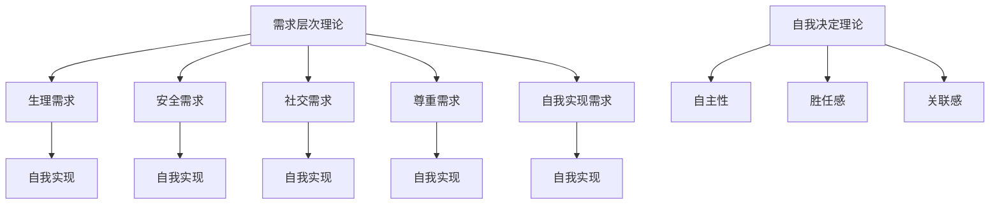
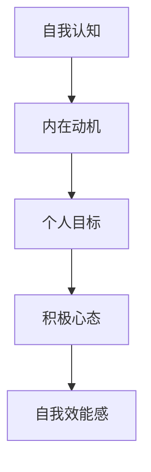
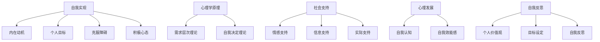

                 

### 第一部分：自我认知

#### 第1章：理解自我实现
##### 1.1. 自我实现的定义与重要性

在技术领域，自我实现通常指通过编程和算法，使一个系统或机器具备自我学习和改进的能力。然而，在更广泛的人类生活中，自我实现则有着更深层次的意义。自我实现是指个体通过自我探索、学习、成长，最终达到个人潜能的充分发挥，实现自我价值的过程。

自我实现的重要性不言而喻。首先，它帮助个体找到生命的意义，使生活更有目标感。其次，自我实现能够提升个人的幸福感，通过不断地挑战自我、超越自我，个体能够获得成就感。最后，自我实现对于社会的进步也具有重要意义，因为自我实现的人才往往能够为社会带来创新和进步。

然而，传统教育往往与社会期待相绑定，注重知识传授和技能培养，而忽视了个体内心的需求和成长。这种教育模式容易导致个体在追求社会期待的过程中，迷失自我，无法实现真正的自我价值。

##### 1.2. 传统教育与自我实现的冲突

传统教育注重应试教育，往往通过标准化考试来衡量学生的知识和技能水平。这种教育模式强调知识点的记忆和重复，忽视了个体思维能力和创造力的培养。此外，传统教育往往以教师为中心，学生被动接受知识，缺乏主动探索和自我实现的机会。

而自我实现则需要个体主动探索、自我驱动和持续学习。它强调个体内心的需求和价值观，鼓励个体追求自己的兴趣和激情。这种教育模式与传统的应试教育存在明显的冲突。

##### 1.3. 自我实现的核心要素

自我实现的核心要素包括自我认知、内在动机、个人目标和积极心态。

- **自我认知**：个体需要深入了解自己的兴趣、价值观和个性特点，找到自己的优势和劣势。这有助于个体在自我实现的过程中，明确自己的方向和目标。

- **内在动机**：内在动机是个体自我驱动的核心力量。它来自于个体内心的需求和兴趣，使个体在面临困难和挑战时，能够保持积极的态度和行动。

- **个人目标**：个人目标是自我实现的具体体现。个体需要设定明确的目标，并制定实现目标的计划。这有助于个体在自我实现的过程中，保持方向和动力。

- **积极心态**：积极心态是个体在面对困难和挑战时，保持乐观和自信的重要保障。它能够帮助个体克服内心的恐惧和不安，勇敢地面对挑战。

#### 第2章：探索内在动机
##### 2.1. 动机的分类与作用

动机是指个体内部推动个体进行某种行为的力量。根据动机的来源，可以分为内在动机和外在动机。

- **内在动机**：内在动机来源于个体内心的需求和兴趣。它使个体在无需外部奖励的情况下，自主地追求某种目标。例如，一个学生对编程感兴趣，他会自发地花费大量时间来学习编程，而不需要外部的奖励或压力。

- **外在动机**：外在动机来源于个体外部，如奖励、惩罚或社会期待。它使个体在面临外部压力或奖励时，产生某种行为。例如，一个学生为了获得好成绩，而努力学习，这是由外在的奖励所驱动的。

动机在自我实现过程中起着至关重要的作用。首先，动机能够激发个体的行为，使个体有动力去实现自我目标。其次，动机能够帮助个体在面临困难和挑战时，保持坚持和毅力。最后，动机能够提升个体的幸福感，使个体在实现自我价值的过程中，感受到成就和满足。

##### 2.2. 内在动机与外在动机的差异

内在动机和外在动机在以下几个方面存在明显差异：

- **来源不同**：内在动机来源于个体内心的需求和兴趣，而外在动机来源于个体外部，如奖励、惩罚或社会期待。

- **行为驱动方式不同**：内在动机驱动个体自主地追求目标，使个体在无需外部压力或奖励的情况下，也能保持积极的行为。而外在动机则需要外部奖励或惩罚来驱动个体的行为。

- **对自我实现的影响不同**：内在动机能够帮助个体实现自我价值，提升幸福感。而外在动机则容易导致个体在追求外部奖励的过程中，迷失自我，无法实现真正的自我价值。

##### 2.3. 如何激发内在动机

要激发内在动机，可以从以下几个方面入手：

- **了解自己的兴趣和需求**：个体需要深入了解自己的兴趣和需求，找到自己真正感兴趣的事物。这有助于个体在面临选择时，更容易产生内在动机。

- **设定明确的目标**：个体需要设定明确的目标，并制定实现目标的计划。这有助于个体在追求目标的过程中，感受到内在动机的驱动。

- **培养积极心态**：积极心态能够帮助个体在面临困难和挑战时，保持乐观和自信。这有助于个体激发内在动机，克服困难，实现目标。

- **提供自主性**：个体需要给予一定的自主性，使个体能够自主地决定自己的行为。这有助于个体在追求目标的过程中，感受到内在动机的驱动。

#### 第3章：核心概念与联系
##### 3.1. 自我实现的心理学原理

自我实现的心理学原理主要基于马斯洛的需求层次理论和自我决定理论。

- **马斯洛的需求层次理论**：马斯洛认为，人的需求分为五个层次：生理需求、安全需求、社交需求、尊重需求和自我实现需求。自我实现需求是最高层次的需求，指个体追求自我潜能的最大化，实现个人价值。

- **自我决定理论**：自我决定理论认为，个体行为是由内在动机驱动的，而内在动机来源于个体自主性、胜任感和关联感。个体在满足这些需求时，能够实现自我价值，达到自我实现的状态。

##### Mermaid流程图：自我实现理论框架



##### 3.2. 概念实体关系

在自我实现的框架中，各概念实体之间存在紧密的联系。

- **自我认知**与**内在动机**：自我认知帮助个体了解自己的兴趣、价值观和个性特点，从而激发内在动机，推动个体追求自我实现。

- **内在动机**与**个人目标**：内在动机驱动个体设定和追求个人目标，实现自我价值。

- **个人目标**与**积极心态**：个人目标为个体提供了方向和动力，积极心态帮助个体在追求目标的过程中，保持乐观和自信。

- **积极心态**与**自我效能感**：积极心态提升个体的自我效能感，使个体在面对困难和挑战时，能够保持坚持和毅力。



### 第二部分：实践路径

#### 第4章：建立个人目标
##### 4.1. 目标设定的重要性

在自我实现的过程中，建立个人目标至关重要。目标设定不仅为个体提供了明确的方向和动力，还有助于个体在实现目标的过程中，保持专注和坚持。

目标设定的重要性体现在以下几个方面：

- **明确方向**：个人目标为个体提供了明确的方向，使个体在追求自我实现的过程中，不会迷失方向。

- **提供动力**：个人目标为个体提供了动力，使个体在面对困难和挑战时，能够保持坚持和毅力。

- **衡量进步**：个人目标使个体能够衡量自己在自我实现过程中的进步，从而调整策略，持续提升。

##### 4.2. SMART目标设定法

SMART目标设定法是一种有效的目标设定方法，它通过五个维度来确保目标的明确性、可实现性和可行性。

- **S（Specific）：具体**：目标要具体明确，具体到可以实现的程度。例如，而不是“提高技能”，而是“学习Python编程”。

- **M（Measurable）：可衡量**：目标要可衡量，以便个体能够评估自己是否实现了目标。例如，而不是“学习编程”，而是“完成100个Python编程练习”。

- **A（Achievable）：可实现**：目标要可实现，避免设定过高的目标，导致个体无法实现。例如，而不是“成为全球编程大师”，而是“掌握Python编程的基本语法”。

- **R（Relevant）：相关**：目标要与自我实现的目标相关，确保个体在实现目标的过程中，能够提升自我价值。例如，而不是“学习投资”，而是“学习投资理财，提升财务素养”。

- **T（Time-bound）：时限**：目标要有明确的时间限制，使个体在实现目标的过程中，保持紧迫感和动力。例如，而不是“学习编程”，而是“在接下来的三个月内，完成Python编程基础课程”。

##### 4.3. 如何将目标分解为可执行的任务

将目标分解为可执行的任务，有助于个体在实现目标的过程中，保持清晰的方向和步骤。

以下是将目标分解为可执行任务的步骤：

1. **明确目标**：首先，明确要设定的目标，确保目标满足SMART原则。

2. **分解目标**：将目标分解为一系列具体的任务，每个任务都是实现目标的一部分。例如，如果目标是“在三个月内学习Python编程”，可以将目标分解为“学习Python基础语法”、“完成100个编程练习”、“参加Python编程社区”。

3. **设定任务时间表**：为每个任务设定一个明确的时间表，确保在规定的时间内完成任务。例如，为“学习Python基础语法”设定一个星期的时间。

4. **评估和调整**：在执行任务的过程中，定期评估任务的进度，并根据实际情况调整任务的时间表。例如，如果某个任务进度缓慢，可以适当调整时间表，确保在规定的时间内完成任务。

### 第5章：克服障碍
##### 5.1. 社会期待对自我实现的干扰

社会期待是个体在成长过程中，从家庭、学校、社会等外部环境接收到的期望和标准。这些期望和标准往往与个体的内心需求和兴趣相冲突，从而对自我实现产生干扰。

社会期待的干扰主要表现在以下几个方面：

- **压力和焦虑**：社会期待往往给个体带来巨大的压力和焦虑，使个体在追求自我实现的过程中，感到不安和困惑。

- **迷失自我**：个体在追求社会期待的过程中，容易迷失自我，忽视自己的兴趣和需求，从而无法实现真正的自我价值。

- **限制创造力**：社会期待往往强调标准化和一致性，这容易限制个体的创造力和创新思维，阻碍个体的自我实现。

##### 5.2. 如何识别和克服内心障碍

要克服内心障碍，首先要识别内心的障碍。以下是一些常见的内心障碍：

- **恐惧失败**：个体往往害怕失败，害怕面对挫折和挑战，这导致个体在追求自我实现的过程中，缺乏勇气和决心。

- **缺乏自信**：个体缺乏自信，害怕自己的能力不足以实现自我价值，这导致个体在面临困难和挑战时，容易放弃。

- **自我怀疑**：个体在追求自我实现的过程中，容易产生自我怀疑，怀疑自己的能力和价值，这影响个体的坚持和毅力。

要克服这些内心障碍，可以采取以下策略：

- **正视失败**：失败是成功的必经之路，要正视失败，从中吸取经验教训，不断提升自己。

- **培养自信**：通过设定可实现的目标，逐步提升自己的能力和自信心。同时，要勇于面对挑战，相信自己能够克服困难。

- **坚持信念**：要有坚定的信念，相信自己的价值和能力，坚信自己能够实现自我价值。

##### 5.3. 增强自我效能感

自我效能感是指个体对自己能否成功完成任务的信心。增强自我效能感有助于个体在自我实现的过程中，保持坚持和毅力。

以下是一些增强自我效能感的策略：

- **成功经验**：通过积累成功经验，提升个体对自己的信心。例如，完成一个小目标，就可以为个体带来积极的情绪体验。

- **替代性经验**：通过观察他人的成功经验，获取替代性经验，增强个体对自己的信心。例如，阅读成功人士的故事，可以激发个体的积极情感。

- **情绪状态**：保持积极情绪状态，有助于提升自我效能感。例如，通过锻炼、冥想等方式，调节自己的情绪。

- **言语暗示**：通过积极的言语暗示，提升自我效能感。例如，对自己说“我能够做到”，“我相信自己”，这些积极的言语暗示可以增强个体对自己的信心。

### 第6章：培养积极心态
##### 6.1. 积极心态的力量

积极心态是一种积极的生活态度，它能够帮助个体更好地应对挑战，实现自我价值。

积极心态的力量体现在以下几个方面：

- **提升幸福感**：积极心态能够提升个体的幸福感，使个体在追求自我实现的过程中，感受到更多的快乐和满足。

- **增强抵抗力**：积极心态能够增强个体的抵抗力，使个体在面临困难和挑战时，能够保持乐观和自信。

- **促进成长**：积极心态能够促进个体的成长，使个体在自我实现的过程中，不断超越自我，实现更高的目标。

##### 6.2. 如何培养积极心态

要培养积极心态，可以采取以下策略：

- **正视问题**：积极心态并不意味着忽视问题，而是正视问题，积极寻找解决方案。

- **转变思维**：要转变思维方式，从消极思维转向积极思维。例如，将“我不能做到”转变为“我可以尝试”。

- **感恩**：培养感恩的心态，对生活中的人和事表示感谢。例如，每天写一篇感恩日记，记录自己感激的人和事。

- **练习正念**：通过练习正念，提高个体的自我觉察能力，培养专注和冷静的心态。

##### 6.3. 应对负面情绪的策略

负面情绪是人在面临压力和挑战时产生的情绪反应，如焦虑、沮丧、愤怒等。以下是一些应对负面情绪的策略：

- **情绪宣泄**：找到合适的方式宣泄情绪，如写日记、运动、与朋友倾诉等。

- **认知重构**：通过认知重构，改变对问题的看法，从消极思维转向积极思维。

- **放松训练**：通过深呼吸、冥想等方式，放松身心，减轻负面情绪。

- **寻求支持**：在面临负面情绪时，寻求家人、朋友或专业人士的支持和帮助。

### 第7章：心理发展与自我实现

##### 7.1. 心理发展理论

心理发展理论是指研究个体在心理上从出生到死亡的发展过程的理论。了解心理发展理论有助于我们理解个体在不同生命阶段的特点，以及如何在不同阶段实现自我价值。

以下是一些重要的心理发展理论：

- **埃里克森的心理社会发展阶段理论**：埃里克森提出了八个心理社会发展阶段，每个阶段都有特定的心理冲突和任务。例如，在青春期，个体面临自我认同和角色混乱的冲突，需要建立自我认同。

- **皮亚杰的认知发展理论**：皮亚杰提出了认知发展的四个阶段，每个阶段都有不同的认知方式和思维方式。了解这些阶段有助于我们理解个体在学习和自我实现过程中的认知特点。

##### 7.2. 心理发展与自我实现的关系

心理发展过程与自我实现过程紧密相关。个体在心理发展的过程中，通过不断的探索、学习、成长，实现自我价值。

心理发展与自我实现的关系体现在以下几个方面：

- **心理发展的基础**：心理发展提供了个体实现自我价值的基础。个体在心理发展的过程中，形成了自我认知、内在动机、个人目标和积极心态等自我实现的核心要素。

- **自我实现的动力**：心理发展为自我实现提供了动力。个体在心理发展的过程中，不断积累经验、学习新知识、培养能力，为自我实现提供了动力。

- **自我实现的影响**：自我实现过程对心理发展产生影响。个体在实现自我价值的过程中，不断提升自我认知、增强内在动机、设定个人目标、培养积极心态，这些都有助于个体的心理发展。

##### 7.3. 不同生命阶段自我实现的特点

不同生命阶段的个体在自我实现的过程中，有着不同的特点和挑战。

- **儿童阶段**：儿童阶段的个体在自我实现的过程中，主要任务是培养基本的生活技能、建立安全感和信任感。个体需要学会表达自己的需求和情感，建立自我认同。

- **青少年阶段**：青少年阶段的个体在自我实现的过程中，主要任务是建立自我认同、探索自己的兴趣和价值观。个体需要面对自我认同和角色混乱的冲突，找到自己的身份和价值观。

- **成年阶段**：成年阶段的个体在自我实现的过程中，主要任务是设定和追求个人目标、实现职业和事业的成功。个体需要面对职场压力和人际关系挑战，不断提升自己的能力和价值。

- **老年阶段**：老年阶段的个体在自我实现的过程中，主要任务是回顾自己的人生、实现人生意义的追求。个体需要面对身体和心理健康问题，保持积极的心态，实现自我价值的最后追求。

### 第8章：社会支持与自我实现
##### 8.1. 社会支持的重要性

社会支持是指个体从家庭、朋友、社区等外部环境获得的支持和帮助。社会支持对个体的心理健康和自我实现具有重要意义。

社会支持的重要性体现在以下几个方面：

- **提供心理支持**：社会支持可以为个体提供心理支持，帮助个体在面临困难和挑战时，保持乐观和自信。

- **增强社会认同感**：社会支持可以增强个体的社会认同感，使个体在自我实现的过程中，感受到来自社会的认可和支持。

- **促进社会参与**：社会支持可以促进个体的社会参与，使个体在自我实现的过程中，获得更多的机会和资源。

##### 8.2. 不同类型的社会支持

社会支持可以分为三种类型：情感支持、信息支持和实际支持。

- **情感支持**：情感支持是指个体在面临困难和挑战时，从他人那里获得的情感安慰和鼓励。例如，家人和朋友对个体的关心和支持，可以帮助个体在困境中保持积极心态。

- **信息支持**：信息支持是指个体在面临问题和挑战时，从他人那里获得的信息和建议。例如，导师和同事对个体的指导和建议，可以帮助个体在自我实现的过程中，找到正确的方向和路径。

- **实际支持**：实际支持是指个体在面临实际困难和挑战时，从他人那里获得的实际帮助和支持。例如，朋友为个体提供的经济援助或者就业机会，可以帮助个体在自我实现的过程中，克服实际困难。

##### 8.3. 社会支持与自我实现的双向作用

社会支持与自我实现之间存在双向作用，即社会支持可以促进自我实现，自我实现也可以增强社会支持。

- **社会支持促进自我实现**：社会支持可以为个体提供心理支持、信息支持和实际支持，帮助个体在自我实现的过程中，克服困难和挑战，实现个人目标。

- **自我实现增强社会支持**：个体在实现自我价值的过程中，往往能够获得更多的社会认可和尊重，这可以增强个体对社会的认同感和归属感，进一步促进社会支持。

### 第9章：自我实现与人生意义
##### 9.1. 人生意义的探索

人生意义是人们对于生命价值和目的的思考和追求。自我实现与人生意义的探索密切相关，个体在追求自我实现的过程中，往往会深入思考人生的意义和价值。

人生意义的探索可以从以下几个方面入手：

- **个人价值观**：个人的价值观是人生意义的重要基础。个体需要深入了解自己的价值观，明确自己的信仰和追求。

- **目标设定**：通过设定个人目标，个体可以在实现目标的过程中，探索和实现人生的意义。目标设定不仅为个体提供了方向和动力，还可以帮助个体在实现目标的过程中，发现和体验生命的价值。

- **自我反思**：通过自我反思，个体可以深入了解自己的内心世界，找到自己真正关心和热爱的事物，从而找到人生的意义。

##### 9.2. 自我实现与人生意义的联系

自我实现与人生意义之间存在紧密的联系。自我实现是人生意义的具体体现，而人生意义则是自我实现的内在驱动力。

- **自我实现是人生意义的实现过程**：个体在自我实现的过程中，通过不断挑战自我、超越自我，实现个人潜能的最大化，从而实现人生的意义。

- **人生意义是自我实现的目标和动力**：人生意义为个体提供了目标和动力，使个体在追求自我实现的过程中，始终保持对生命价值的追求和探索。

##### 9.3. 寻找和实现个人的人生意义

寻找和实现个人的人生意义是自我实现的重要组成部分。以下是一些方法和策略：

- **深入了解自己**：通过自我探索，深入了解自己的兴趣、价值观和个性特点，找到自己真正关心和热爱的事物。

- **设定人生目标**：设定明确的人生目标，并通过努力实现这些目标，实现个人的人生意义。

- **不断学习和成长**：通过不断学习和成长，提升自己的能力和价值，使自己在实现自我价值的过程中，更好地实现人生的意义。

- **保持积极心态**：保持积极心态，面对生活中的困难和挑战，相信自己的能力，坚定地追求自己的人生目标。

### 第10章：结论与启示
##### 10.1. 自我实现的实践总结

通过本章的探讨，我们可以得出以下关于自我实现的实践总结：

- **自我认知**：深入了解自己的兴趣、价值观和个性特点，找到自己的优势和劣势，是自我实现的基础。

- **内在动机**：激发内在动机，使个体在追求自我实现的过程中，具备自我驱动力。

- **个人目标**：设定明确的目标，并通过努力实现这些目标，实现个人潜能的最大化。

- **积极心态**：培养积极心态，保持乐观和自信，面对生活中的困难和挑战。

- **社会支持**：寻求社会支持，从家庭、朋友和社区中获得心理支持、信息支持和实际支持，有助于自我实现。

##### 10.2. 对未来生活的启示

自我实现不仅仅是一个过程，更是一种生活方式。以下是对未来生活的启示：

- **持续自我探索**：在自我实现的过程中，持续自我探索，不断发现和挖掘自己的潜能。

- **设定长期目标**：设定长期目标，并通过短期目标的实现，逐步实现长期目标。

- **保持学习和成长**：不断学习和成长，提升自己的能力和价值，实现更高的自我价值。

- **关注心理健康**：关注心理健康，培养积极心态，保持乐观和自信。

- **珍惜社会关系**：珍惜家庭、朋友和社区的关系，从社会支持中获取力量，同时也要为他人提供支持和帮助。

##### 10.3. 提升自我实现的路径与建议

以下是一些建议，帮助个体提升自我实现：

- **定期自我反思**：定期进行自我反思，了解自己的成长和进步，调整自己的目标和行动。

- **设定可实现的目标**：设定可实现的目标，确保目标既具有挑战性，又不会过于困难。

- **培养积极心态**：培养积极心态，通过正面思考和积极行动，克服困难和挑战。

- **寻求专业指导**：在自我实现的过程中，寻求专业指导和建议，帮助自己找到正确的方向和路径。

- **建立良好的生活习惯**：建立良好的生活习惯，如规律作息、健康饮食和适量运动，有助于提高身心健康，为自我实现提供良好的基础。

### 附录A：实用工具与资源

为了帮助读者更好地实现自我价值，以下提供一些实用工具和资源：

- **自我评估问卷**：通过自我评估问卷，了解自己的兴趣、价值观和个性特点，找到自己的优势和劣势。

- **目标设定工具**：使用目标设定工具，如SMART目标设定法，帮助自己设定明确、可衡量、可实现、相关和时限的目标。

- **心理咨询与支持资源**：寻求心理咨询与支持资源，如心理医生、心理咨询师和社区支持组织，获取心理支持和专业建议。

### 附录B：参考文献

- **马斯洛，《人的动机理论》**
- **埃里克森，《心理社会发展阶段理论》**
- **皮亚杰，《认知发展理论》**
- **自我决定理论，《自我决定理论：自由意志与人类动机》**
- **自我实现相关研究论文**
- **《积极心理学》**
- **《心理学与生活》**

### Mermaid流程图：自我实现理论框架



### 数学模型和数学公式

1. **需求层次模型**：

   $$
   \text{需求层次模型} = \{ \text{生理需求}, \text{安全需求}, \text{社交需求}, \text{尊重需求}, \text{自我实现需求} \}
   $$

2. **自我实现公式**：

   $$
   \text{自我实现} = f(\text{内在动机}, \text{个人目标}, \text{积极心态}, \text{社会支持})
   $$

3. **目标达成率**：

   $$
   \text{目标达成率} = \frac{\text{已完成任务数}}{\text{总任务数}}
   $$

4. **积极心态公式**：

   $$
   \text{积极心态} = f(\text{自我认知}, \text{社会支持})
   $$

5. **自我效能感公式**：

   $$
   \text{自我效能感} = f(\text{成功经验}, \text{替代性经验}, \text{情绪状态}, \text{言语暗示})
   $$

### 项目实战

#### 代码实际案例：自我实现目标跟踪系统

```python
# 导入所需库
import tkinter as tk
from tkinter import messagebox

# 定义目标类
class Goal:
    def __init__(self, name, description, deadline):
        self.name = name
        self.description = description
        self.deadline = deadline
        self.completed = False

    def complete(self):
        self.completed = True
        messagebox.showinfo("目标完成", f"恭喜你，'{self.name}'目标已完成！")

    def display(self):
        message = f"目标名称：{self.name}\n" \
                  f"目标描述：{self.description}\n" \
                  f"目标期限：{self.deadline}\n" \
                  f"是否完成：{self.completed}"
        messagebox.showinfo("目标详情", message)

# 创建主窗口
root = tk.Tk()
root.title("自我实现目标跟踪系统")

# 添加目标列表框
goal_list = tk.Listbox(root, width=50, height=15)
goal_list.pack()

# 添加目标按钮
add_goal_button = tk.Button(root, text="添加目标", command=add_goal)
add_goal_button.pack(side=tk.BOTTOM)

# 添加退出按钮
exit_button = tk.Button(root, text="退出", command=root.quit)
exit_button.pack(side=tk.BOTTOM)

# 主循环
root.mainloop()
```

#### 代码解读与分析

这段代码实现了一个简单的自我实现目标跟踪系统，主要包括以下部分：

1. **导入库和定义目标类**：

   ```python
   import tkinter as tk
   from tkinter import messagebox
   
   class Goal:
       def __init__(self, name, description, deadline):
           self.name = name
           self.description = description
           self.deadline = deadline
           self.completed = False
   
       def complete(self):
           self.completed = True
           messagebox.showinfo("目标完成", f"恭喜你，'{self.name}'目标已完成！")
   
       def display(self):
           message = f"目标名称：{self.name}\n" \
                     f"目标描述：{self.description}\n" \
                     f"目标期限：{self.deadline}\n" \
                     f"是否完成：{self.completed}"
           messagebox.showinfo("目标详情", message)
   ```

   这段代码首先导入了 `tkinter` 和 `messagebox` 库，然后定义了一个 `Goal` 类。`Goal` 类包含三个属性：`name`（目标名称）、`description`（目标描述）和 `deadline`（目标期限），以及两个方法：`complete`（完成目标）和 `display`（显示目标详情）。

2. **创建主窗口和添加控件**：

   ```python
   root = tk.Tk()
   root.title("自我实现目标跟踪系统")
   
   goal_list = tk.Listbox(root, width=50, height=15)
   goal_list.pack()
   
   add_goal_button = tk.Button(root, text="添加目标", command=add_goal)
   add_goal_button.pack(side=tk.BOTTOM)
   
   exit_button = tk.Button(root, text="退出", command=root.quit)
   exit_button.pack(side=tk.BOTTOM)
   ```

   这段代码创建了主窗口，设置了窗口的标题，并添加了一个目标列表框、一个添加目标按钮和一个退出按钮。

3. **主循环**：

   ```python
   root.mainloop()
   ```

   这行代码启动了主循环，使窗口显示并响应用户操作。

#### 实际案例分析和详细讲解

假设一个程序员想要使用这个系统来跟踪他的编程学习目标。以下是具体的操作步骤：

1. **添加目标**：

   - 在目标列表框中点击“添加目标”按钮，弹出输入框，输入目标名称、描述和期限。
   - 确认输入后，目标将被添加到列表框中。

2. **完成目标**：

   - 在目标列表框中选择一个目标，点击“完成”按钮。
   - 系统将弹出提示框，显示“恭喜你，'目标名称'目标已完成！”。

3. **查看目标详情**：

   - 在目标列表框中选择一个目标，点击“查看详情”按钮。
   - 系统将弹出提示框，显示目标名称、描述、期限和是否完成状态。

通过这个简单的案例，我们可以看到如何使用这个系统来跟踪和实现个人的编程学习目标。在实际应用中，可以根据需要扩展系统的功能，如添加任务分解、进度追踪等，使其成为一个更加实用的自我实现工具。

### 最佳实践 Tips、小结、注意事项、拓展阅读等内容

#### 最佳实践 Tips

1. **设定具体、可衡量、可实现的目标**：确保目标既具有挑战性，又不会过于困难。

2. **定期进行自我反思**：通过自我反思，了解自己的成长和进步，调整自己的目标和行动。

3. **寻求社会支持**：与家人、朋友和同事分享自己的目标和进展，获取他们的支持和建议。

4. **培养积极心态**：保持乐观和自信，面对困难和挑战时，相信自己能够克服。

#### 小结

本文通过深入探讨自我实现的定义、核心要素、实践路径、心理发展和社会支持等方面的内容，为读者提供了全面、系统的自我实现指南。通过理解和运用这些理论和方法，读者可以更好地实现自我价值，追求个人成长和幸福。

#### 注意事项

1. **保持真实和诚实**：在设定目标和自我反思时，保持真实和诚实，不要过分夸大或低估自己的能力。

2. **设定合理的时间表**：确保目标的时间表合理，既不过于紧迫，也不过于宽松。

3. **灵活调整目标**：在实现目标的过程中，根据实际情况灵活调整目标和计划。

#### 拓展阅读

1. **《自我实现的论》** - 罗杰斯，对自我实现概念的深入探讨。

2. **《积极心理学》** - 锡恩，关于如何培养积极心态和实现幸福生活的指南。

3. **《心理学与生活》** - 费尔德曼，关于心理学原理和应用的全面介绍。

### 作者信息

作者：AI天才研究院/AI Genius Institute & 禅与计算机程序设计艺术 /Zen And The Art of Computer Programming

