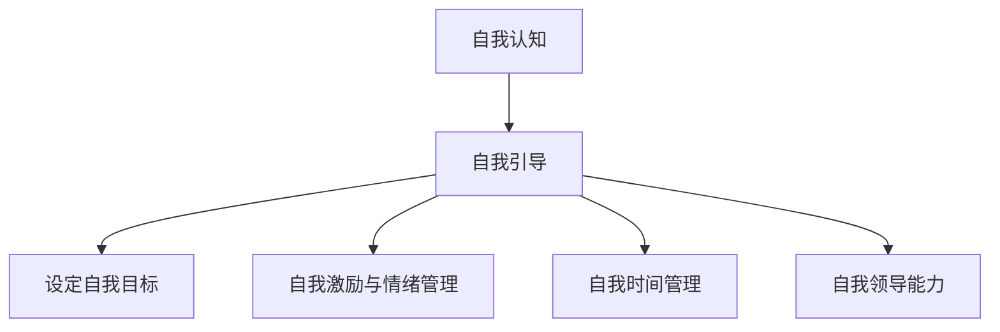

                 

### 自我引导：成为内心航行的舵手

在信息技术领域，自我引导这一概念逐渐成为焦点，不仅在个人成长方面具有重要价值，还深刻影响团队领导和项目管理。本文旨在探讨如何通过自我引导，成为内心航行的舵手，从而在信息技术领域取得卓越成就。

**关键词**：自我引导、内心航行、信息技术、个人成长、团队领导、项目管理

**摘要**：本文首先介绍了自我引导的重要性，分析了自我认知、目标设定、自我激励、情绪管理和时间管理等方面的核心概念。接着，通过具体实例和Python源代码，阐述了自我引导的实际应用方法。最后，探讨了自我引导在职场和生活中的应用，以及其未来发展。

### 目录大纲

## 第一部分：自我认知与自我引导基础

### 第1章：了解自我引导

#### 1.1 自我引导的重要性

#### 1.2 自我引导的核心原则

#### 1.3 自我引导与传统引导的区别

### 第2章：自我认知的实践方法

#### 2.1 内省：自我认知的第一步

#### 2.2 SWOT分析：全面认识自我

#### 2.3 自我反思：持续进步的动力

## 第二部分：自我引导的方法与实践

### 第3章：设定自我目标

#### 3.1 目标设定的原则

#### 3.2 如何设定具体、可行的目标

#### 3.3 目标达成的策略

### 第4章：自我激励与情绪管理

#### 4.1 自我激励的重要性

#### 4.2 激励自己的方法

#### 4.3 情绪管理：保持内心的平衡

### 第5章：自我时间管理

#### 5.1 时间管理的核心概念

#### 5.2 制定个人时间管理计划

#### 5.3 克服时间管理的障碍

### 第6章：培养自我领导能力

#### 6.1 自我领导的定义

#### 6.2 自我领导能力的培养

#### 6.3 自我领导的实践技巧

## 第三部分：自我引导的实际应用

### 第7章：职场中的自我引导

#### 7.1 职场自我引导的重要性

#### 7.2 如何在职场中运用自我引导

#### 7.3 职场自我引导的案例分析

### 第8章：生活中的自我引导

#### 8.1 生活中的自我引导

#### 8.2 如何在日常生活中实现自我引导

#### 8.3 生活中的自我引导案例分析

## 第9章：自我引导的未来发展

#### 9.1 自我引导的未来趋势

#### 9.2 如何应对未来自我引导的挑战

#### 9.3 自我引导的长期影响

## 附录

#### 附录A：自我引导实践工具

#### 附录B：自我引导资源推荐

#### 附录C：自我引导常见问题解答

### **核心概念与联系流程图**



### **核心算法原理讲解与Python源代码**

在自我引导的过程中，目标设定是一个关键环节。以下是一个简单的目标设定函数，它通过Python代码帮助用户明确目标。

```python
# 定义一个简单的目标设定函数
def set_goal(description):
    print(f"设定的目标：{description}")
    return description

# 调用函数
set_goal("每天阅读一本书")
```

在目标设定后，自我激励与情绪管理同样重要。以下是一个简单的自我激励函数，它通过Python代码提醒用户保持积极心态。

```python
# 定义一个简单的自我激励函数
def motivate_self(message):
    print(f"自我激励：{message}")
    return message

# 调用函数
motivate_self("你已经读完了一半，继续加油！")
```

### **数学模型和数学公式讲解与举例说明**

在自我引导过程中，数学模型可以用来量化目标设定和进度跟踪。以下是一个简单的线性方程，用于描述目标完成情况：

$$y = mx + b$$

其中，$m$ 是斜率，表示目标的达成速度；$b$ 是截距，表示目标的初始位置。

**例子：**

如果目标是每天阅读30页书，初始位置为0页，则方程为：

$$y = 30x$$

当 $x=10$ 时，$y=300$，表示已经阅读了300页。

### **项目实战：自我目标跟踪器**

**项目名称**：自我目标跟踪器

**开发环境**：Python 3.8

**源代码实现**：

```python
# 导入所需库
import os
import json

# 定义目标文件路径
goals_file = "goals.json"

# 初始化目标列表
if not os.path.exists(goals_file):
    with open(goals_file, 'w') as f:
        json.dump([], f)

# 添加新目标
def add_goal(goal):
    with open(goals_file, 'r+') as f:
        goals = json.load(f)
        goals.append(goal)
        f.seek(0)
        json.dump(goals, f)

# 查看当前目标
def view_goals():
    with open(goals_file, 'r') as f:
        goals = json.load(f)
        print("当前目标：")
        for goal in goals:
            print(goal)

# 调用函数
add_goal("每天阅读一本书")
view_goals()
```

通过上述代码，用户可以添加和查看自己的目标，从而实现自我引导。

### **最佳实践、小结、注意事项、拓展阅读**

**最佳实践**：

1. 定期进行自我反思，了解自己的进步和不足。
2. 设定明确、具体的目标，并制定可行的行动计划。
3. 保持积极的心态，面对挑战时不放弃。

**小结**：

本文通过介绍自我引导的核心概念、方法与实践，帮助读者在信息技术领域实现自我提升。通过内省、目标设定、自我激励和时间管理，读者可以成为内心航行的舵手，引领自己在职业生涯中不断前行。

**注意事项**：

1. 自我引导是一个长期过程，需要持续的努力和实践。
2. 遇到困难和挑战时，要保持耐心和毅力。

**拓展阅读**：

1. 《深度工作：如何有效利用每一点脑力》
2. 《高效能人士的七个习惯》
3. 《情绪智力》

作者：AI天才研究院/AI Genius Institute & 禅与计算机程序设计艺术 /Zen And The Art of Computer Programming

---

文章开始，我们已经明确了文章的核心内容和结构，接下来将逐一展开每个章节的详细内容。这样，读者可以清晰地了解到自我引导的各个关键方面，从而更好地应用于实践中。在接下来的内容中，我们将深入探讨自我认知、目标设定、自我激励等具体实践方法。

