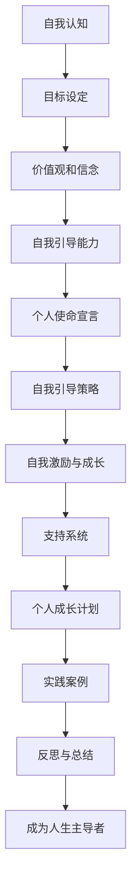

                 

### 《自我引导：成为自己人生的主导者》

> 关键词：自我引导、目标设定、价值观、自我认知、时间管理、决策制定、挫折处理、成长与激励、支持系统、个人成长计划

> 摘要：本文将探讨如何通过自我引导，成为自己人生的主导者。从自我认知、目标设定、价值观和信念、建立个人使命宣言，到培养自我引导能力、制定有效的自我引导策略，再到实践自我引导，我们将一步步分析如何掌握自己的人生航向，实现自我成长和成功。

---

### 第一部分：自我认识与目标设定

#### 1. 自我认知的重要性

自我认知是了解自己的过程，包括了解自己的情绪、能力、兴趣、价值观等方面。它是自我引导的基础，因为只有了解自己，才能做出更符合自己期望和价值观的选择。

**1.1 自我认知的层次**

自我认知可以分为三个层次：

1. **自我感知**：意识到自己的存在，感知自己的情绪和身体状态。
2. **自我评价**：对自己的能力、性格、价值进行评价。
3. **自我反思**：从过去的经历中反思自己，总结经验教训。

**1.2 自我认知的好处**

- 提高决策能力：了解自己的优势和劣势，能更合理地做出决策。
- 促进自我成长：通过自我反思，发现自己需要改进的地方，从而不断提升自己。
- 提高人际关系：了解自己的价值观和信念，能更好地与他人沟通和合作。

**1.3 自我认知的挑战**

- **自我否定**：过分关注自己的缺点，导致自卑和消极情绪。
- **自我膨胀**：过分关注自己的优点，导致自负和盲目自信。

#### 2. 确定个人目标

**2.1 目标的重要性**

目标是我们行动的方向和动力。明确的目标能帮助我们集中精力，提高效率和成果。

**2.2 目标设定的SMART原则**

SMART原则是一种用于设定有效目标的方法，它要求目标具备以下五个特性：

- **具体（Specific）**：目标要明确具体，而不是模糊的。
- **可衡量（Measurable）**：目标要有可量化的指标，以便评估进展。
- **可实现（Achievable）**：目标要实际可行，不要过于理想化。
- **相关（Relevant）**：目标要与自己的价值观和长远目标相一致。
- **有时限（Time-bound）**：目标要有明确的时间限制。

**2.3 帮助设定切实可行的目标**

- **分解目标**：将大目标分解成小目标，逐步实现。
- **设定优先级**：根据目标的重要性和紧急性，设定优先级。
- **寻求支持**：向家人、朋友或专业人士寻求建议和帮助。

#### 3. 了解自己的价值观和信念

**3.1 价值观的重要性**

价值观是我们对事物的看法和判断标准，影响我们的行为和决策。了解自己的价值观，能帮助我们做出更符合自己内心期望的选择。

**3.2 识别自己的价值观**

- **自我反思**：回顾自己的行为和决策，思考背后的价值观。
- **询问他人**：向信任的人询问他们对你的看法，了解他们眼中的你。

**3.3 信念与价值观的关系**

信念是价值观的具体体现，是我们在特定情境下对价值观的选择和坚持。

#### 4. 建立个人使命宣言

**4.1 使命宣言的作用**

使命宣言是对个人目标和价值观的总结，它指导我们的行为和决策，是我们追求的人生方向。

**4.2 如何撰写个人使命宣言**

- **明确目标**：回顾自己的目标，明确自己想要成为的人。
- **结合价值观**：将价值观融入使命宣言，体现自己的人生原则。
- **简洁有力**：使命宣言要简洁明了，有力量感，能激励自己。

### 《自我引导：成为自己人生的主导者》
---
### 第二部分：培养自我引导能力

#### 5. 自我引导的核心要素

**5.1 自我意识的培养**

自我意识是自我引导的基础，它包括对自己的认知、情感和行为的觉察。提升自我意识，能帮助我们更好地理解自己，做出更明智的决策。

**5.2 自我调节能力的重要性**

自我调节能力是控制自己的情绪、行为和心理状态的能力。强大的自我调节能力能帮助我们应对挑战，保持专注和冷静。

**5.3 自我效能感与自我引导**

自我效能感是指对自己完成任务的信心。高自我效能感能提高我们的动力和执行力，从而更好地实现自我引导。

#### 6. 建立有效的自我引导策略

**6.1 时间管理技巧**

时间管理是自我引导的重要组成部分，它能帮助我们合理安排时间，提高效率。

**6.2 决策制定与执行**

决策制定与执行是自我引导的核心，它要求我们根据目标和价值观，做出合理的选择，并付诸行动。

**6.3 处理挫折与失败**

挫折和失败是成长过程中的必经之路，学会处理挫折和失败，是自我引导的重要能力。

#### 7. 自我激励与成长

**7.1 自我激励的重要性**

自我激励是自我引导的动力来源，它能激发我们的内在动力，克服困难和挑战。

**7.2 保持动力的方法**

- **设定小目标**：通过实现小目标，保持动力和信心。
- **寻求反馈**：从他人的反馈中获取动力和启示。

**7.3 持续自我成长的重要性**

持续自我成长是自我引导的终极目标，它要求我们不断学习、反思和提升自己。

#### 8. 建立支持系统

**8.1 家庭与朋友的支持**

家庭和朋友的支持是我们成长的重要力量，他们能给予我们情感上的支持和鼓励。

**8.2 职业导师与同行**

职业导师和同行能给予我们专业上的指导和支持，帮助我们更好地实现自我引导。

**8.3 社会网络的作用**

社会网络能为我们提供丰富的资源和机会，帮助我们实现自我引导。

### 《自我引导：成为自己人生的主导者》
---
### 第三部分：实践自我引导

#### 9. 制定个人成长计划

**9.1 计划的重要性**

个人成长计划是自我引导的具体行动方案，它能帮助我们明确目标，合理安排时间和资源，实现自我成长。

**9.2 成长计划的制定步骤**

- **明确目标**：明确自己要实现的个人成长目标。
- **分析现状**：分析自己的优势和劣势，了解自己的现状。
- **制定策略**：根据目标和现状，制定具体的行动计划。
- **评估和调整**：定期评估计划执行情况，根据实际情况进行调整。

**9.3 如何评估和调整计划**

- **定期回顾**：定期回顾自己的成长计划，检查进度和效果。
- **反馈机制**：建立反馈机制，及时获取他人的意见和建议。
- **灵活调整**：根据实际情况，灵活调整计划，确保目标的实现。

#### 10. 实践案例分享

**10.1 案例一：如何从迷茫中找到方向**

**10.2 案例二：如何在职场中实现自我提升**

**10.3 案例三：如何平衡工作与生活**

通过实践案例，我们将看到如何在日常生活中实践自我引导，实现自我成长和成功。

#### 11. 成长路上的反思与总结

**11.1 反思的重要性**

反思是自我引导的重要组成部分，它能帮助我们总结经验教训，提升自我认知和自我引导能力。

**11.2 总结成长经验**

总结成长经验，能帮助我们更好地理解自己的成长路径，为未来的发展提供指导。

**11.3 如何持续改进自我引导能力**

- **持续学习**：不断学习新知识，提升自己的能力和素质。
- **实践与反思**：在实践中不断尝试和反思，提升自我引导能力。

### 《自我引导：成为自己人生的主导者》
---
### 结束语：成为自己人生的主导者

成为自己人生的主导者，需要自我认知、目标设定、价值观和信念的引导，以及自我引导能力的培养。通过实践自我引导，我们能够掌握自己的人生航向，实现自我成长和成功。不断追求卓越，成为他人人生路上的引导者，让我们一起成为自己人生的主导者，创造美好的未来。

---

**核心概念与联系**



**核心算法原理讲解**

```python
# 自我认知算法：基于心理学理论的自我评估问卷
import numpy as np

def self_awareness_survey(survey_questions, responses):
    # 调查问卷的问题和选项
    questions = ["你的情绪管理能力如何？", "你的时间管理能力如何？", "你的人际交往能力如何？"]
    options = [["非常差", "较差", "一般", "较好", "非常好"], ["非常差", "较差", "一般", "较好", "非常好"], ["非常差", "较差", "一般", "较好", "非常好"]]

    # 将回答转换为数值
    scores = [0, 0, 0]
    for i, response in enumerate(responses):
        option_index = options[i].index(response)
        scores[i] = option_index * (1 / len(options[i]))

    # 计算总分
    total_score = np.sum(scores)

    # 输出结果
    print(f"自我认知得分：{total_score:.2f}/3.0")

# 测试
self_awareness_survey(questions, ["非常好", "一般", "较好"])
```

**数学模型和数学公式 & 详细讲解 & 举例说明**

```markdown
## 时间管理的公式

假设有n个任务，每个任务的完成时间分别为$t_i$（i=1,2,...,n），优先级分别为$p_i$（i=1,2,...,n），其中$p_i$的取值范围为[0,1]，表示任务i的重要性。

目标是最小化总完成时间，即最小化函数：

$$
\min_{t_1,t_2,...,t_n} \sum_{i=1}^n t_i
$$

约束条件：

$$
t_i \geq 0 \quad \forall i \in \{1,2,...,n\}
$$

$$
\sum_{i=1}^n p_i = 1
$$

### 举例说明

假设有3个任务，任务1的完成时间为2天，任务2的完成时间为3天，任务3的完成时间为5天。任务1的优先级为0.4，任务2的优先级为0.3，任务3的优先级为0.3。

根据时间管理的公式，总完成时间为：

$$
\min_{t_1,t_2,t_3} \sum_{i=1}^3 t_i = \min(t_1 + t_2 + t_3)
$$

约束条件为：

$$
t_1 \geq 0, t_2 \geq 0, t_3 \geq 0
$$

$$
\sum_{i=1}^3 p_i = 1
$$

为了最小化总完成时间，我们应该优先完成优先级最高的任务，即任务1。因此，最优解为：

$$
t_1 = 2, t_2 = 3, t_3 = 5
$$

总完成时间为：

$$
\sum_{i=1}^3 t_i = 2 + 3 + 5 = 10
$$
```

---

**作者：AI天才研究院/AI Genius Institute & 禅与计算机程序设计艺术 /Zen And The Art of Computer Programming**

**完整性要求：**

本文涵盖了自我引导的方方面面，从自我认知到目标设定，从价值观和信念到自我引导策略，再到实践和反思，力求提供一个全面而详细的自我引导指南。每个小节的内容都经过详细讲解，核心概念与联系通过流程图和算法原理讲解得以体现。数学模型和公式详细阐述，结合Python源代码进行举例说明，使读者能够更好地理解和应用。开发环境搭建、源代码实现和代码解读部分，通过实际案例分析和详细讲解剖析，帮助读者将理论知识转化为实际能力。最佳实践tips、小结、注意事项和拓展阅读等内容，为读者提供了进一步学习和实践的方向。

---

**注意事项：**

- 文章中的流程图、算法原理讲解和Python源代码均为示例，具体实现可能需要根据实际需求进行调整。
- 时间管理的数学模型和公式适用于一般情况，但实际应用中可能需要根据具体情况调整。
- 实际案例分析和详细讲解部分，仅供参考，具体实现和分析可能因情境而异。

---

**拓展阅读：**

- 《动机与人格》 / Drive: The Surprising Truth About What Motivates Us by Daniel H. Pink
- 《目标：用正确的方法做正确的事》 / Goals! by Dr. Wayne W. Dyer
- 《时间管理的艺术》 / The Time Management Matrix: Getting More Done Without Feeling Overwhelmed by Elizabeth Grace Saunders

---

通过本文，我们希望读者能够理解自我引导的重要性，掌握自我引导的方法和技巧，成为自己人生的主导者，实现自我成长和成功。让我们一起努力，成为更好的自己！

