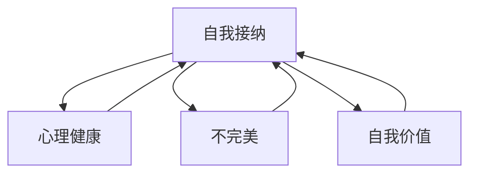

                 

# 自我接纳：在不完美中找到和解

> 关键词：自我接纳、心理健康、不完美、自我价值、自我反思、自我成长

> 摘要：
本文旨在探讨自我接纳的重要性，及其在提升心理健康、应对不完美和建立自我价值等方面的作用。通过分析自我接纳的核心概念、算法原理、数学模型，以及实际应用案例，帮助读者理解和实践自我接纳的方法，从而在生活与职业发展中找到内心的和解与和谐。

----------------------------------------------------------------

## 第一部分：自我接纳的背景与意义

### 第1章：自我接纳的重要性

自我接纳是指个体对自己的全面认可，无论是优点还是缺点，无论是成功还是失败。这种全面认可不仅是对自己的尊重，更是对人性本质的深刻理解。

在当今社会，自我接纳的重要性日益凸显。随着社会的竞争压力不断加大，人们往往更加关注自己的不足，而忽略了自己的优点。这种心态不仅容易导致焦虑和抑郁，还会影响个人的心理健康和生活质量。

自我接纳的价值和好处主要体现在以下几个方面：

1. **提升心理健康**：自我接纳有助于降低焦虑和抑郁情绪，增强心理韧性，提升整体心理健康水平。
2. **促进自我成长**：自我接纳使个体能够正视自己的不足，从而有机会进行改进和成长。
3. **建立和谐人际关系**：自我接纳能够减少对他人的评判和期待，从而更容易与他人建立和谐的关系。
4. **提高生活质量**：自我接纳使个体更加关注当下，享受生活，从而提高生活质量。

### 第2章：自我接纳与心理健康的联系

心理健康是指个体心理活动的健康状态，包括情感、认知、行为等方面。自我接纳与心理健康之间存在密切联系。

首先，自我接纳有助于提升心理健康。当个体能够接纳自己的不完美时，会减少自我否定的情绪，从而降低焦虑和抑郁的水平。研究表明，自我接纳与心理健康之间存在正相关关系。

其次，心理健康对自我接纳也有重要影响。一个心理健康的人更有可能接纳自己的不完美，因为他们拥有更强的心理韧性，能够更好地应对生活中的挑战。

### 第3章：不完美与自我接纳

不完美是人类的共性，每个人都有自己的不完美之处。然而，很多人因为追求完美而陷入自我否定和焦虑。自我接纳的核心在于接纳自己的不完美，理解不完美是人类的共性，从而减轻内心的负担，实现内心的和解。

不完美是否需要改变，这是一个值得深思的问题。在某些情况下，改变不完美是有必要的，例如，当不完美影响到个体的生活和工作时。然而，在大多数情况下，接纳不完美是更健康、更积极的选择。

接纳不完美，拥抱真实自我，是实现自我接纳的关键。通过接纳自己的不完美，个体可以更好地了解自己，从而找到真正的自我。这种真实自我不仅使个体更加自信，还能帮助个体建立更健康的人际关系。

## 第二部分：自我接纳的方法与技巧

### 第4章：认识自我，探索自我

认识自我是自我接纳的第一步。自我反思是一种有效的认识自我的方法。自我反思不仅可以帮助个体了解自己的优点和不足，还能帮助个体认识到自己的情绪和行为模式。

如何进行自我反思？

1. **定期反思**：每天或每周花一些时间进行反思，思考自己的行为、情绪和思维模式。
2. **写日记**：将反思的内容写下来，有助于加深对自我的理解。
3. **与他人交流**：与他人分享自己的反思，有助于获得不同的视角和建议。

### 第5章：接纳自我，释放自我

接纳自我是一个过程，需要时间和耐心。以下是一些帮助接纳自我的技巧：

1. **放下完美主义**：意识到完美是不存在的，每个人都有不完美之处。
2. **关注自己的成就**：回顾自己的成就，认识到自己的价值和能力。
3. **练习自我接纳**：每天告诉自己，我接纳自己的不完美。

释放自我是指放下对自己的过度要求和限制，让自己自由地表达和成长。以下是一些帮助释放自我的方法：

1. **学会说“不”**：拒绝那些对自己没有意义或有害的要求。
2. **追求自己的兴趣和爱好**：做自己喜欢的事情，享受生活的乐趣。
3. **勇敢面对挑战**：不要因为害怕失败而放弃尝试。

### 第6章：建立自我价值，提升自我

建立自我价值是自我接纳的核心。以下是如何建立自我价值的几个方面：

1. **自我认同**：认识到自己的价值和独特性，相信自己是值得被尊重和爱的。
2. **自我尊重**：对自己的行为和决定负责，不轻易放弃自己的原则。
3. **自我激励**：设定目标，并为实现这些目标而努力。

提升自我是通过不断学习和成长来增强自己的能力和价值。以下是一些提升自我的方法：

1. **终身学习**：不断学习新知识和技能，保持好奇心和求知欲。
2. **锻炼身体**：保持良好的身体健康，有助于提高自信心和积极性。
3. **培养良好习惯**：养成健康的生活习惯，如规律的作息、健康的饮食等。

## 第三部分：自我接纳的实际应用

### 第7章：自我接纳在职业发展中的应用

在职业发展中，自我接纳可以帮助个体更好地面对挑战和压力，从而实现职业目标。

如何将自我接纳应用于职业发展？

1. **认识自己的职业优势**：了解自己的职业兴趣和能力，找到自己的职业方向。
2. **接纳自己的不足**：认识到自己的不足，并采取措施进行改进。
3. **设定合理的目标**：设定既具挑战性又可实现的目标，逐步提升自己的职业能力。

### 第8章：自我接纳在个人成长中的应用

个人成长是一个不断探索和发现自我的过程。自我接纳在这个过程中起着至关重要的作用。

如何将自我接纳应用于个人成长？

1. **接受自己的不完美**：认识到每个人都有不完美之处，这是人类共性的体现。
2. **培养自我反思能力**：通过自我反思，了解自己的成长过程和需要改进的地方。
3. **积极参与社会活动**：通过参与社会活动，拓展自己的视野和人际网络，促进个人成长。

### 第9章：自我接纳在生活中的应用

在生活中，自我接纳可以帮助个体更好地应对压力和挑战，享受生活的乐趣。

如何将自我接纳应用于生活？

1. **放下过去的遗憾**：接受过去的失败和错误，从中吸取教训，继续前进。
2. **关注当下的美好**：珍惜现在的时光，享受生活中的每一个瞬间。
3. **培养积极的心态**：用积极的心态看待生活中的困难和挑战，相信自己有能力克服。

## 附录

### 附录A：自我接纳相关资源与工具

为了更好地理解和应用自我接纳，以下是一些推荐的资源与工具：

1. **相关书籍**：《接纳自己》、《自我接纳的力量》等。
2. **相关网站**：如心理学网站、自我提升社区等。
3. **相关应用程序**：如冥想应用、日记应用等。

### 附录B：自我接纳实践指南

为了帮助读者更好地实践自我接纳，以下是一些实用的指南：

1. **自我反思**：每天花时间进行自我反思，记录自己的情绪、想法和行动。
2. **接纳自我**：每天告诉自己，我接纳自己的不完美。
3. **建立自我价值**：设定目标，并为实现这些目标而努力。

总结：

自我接纳是一项重要的自我提升技能，它有助于提升心理健康、应对不完美、建立自我价值，并在职业发展和个人成长中发挥积极作用。通过本文的探讨，希望读者能够更好地理解自我接纳的重要性，并在实践中应用自我接纳的方法，找到内心的和解与和谐。

### 核心概念与联系

自我接纳、心理健康、不完美和自我价值是本文讨论的核心概念。它们之间的关系可以用以下Mermaid流程图来表示：



- **自我接纳**：全面认可自己的优点和缺点，是对自我的一种健康态度。
- **心理健康**：自我接纳有助于提升心理健康，而心理健康也能促进自我接纳。
- **不完美**：自我接纳的核心在于接纳自己的不完美，理解不完美是人类的共性。
- **自我价值**：建立自我价值是自我接纳的基础，一个没有自我价值的人很难真正接纳自己。

### 核心算法原理讲解

在自我接纳的过程中，可以使用以下几种算法原理：

#### 自我反思算法

自我反思是自我接纳的第一步。它包括以下几个步骤：

1. **自我观察**：观察自己的行为、情绪和思维模式。
2. **自我分析**：分析自己的行为、情绪和思维模式的原因和影响。
3. **自我评价**：评价自己的行为、情绪和思维模式，识别优点和不足。

以下是一个简单的Python代码示例，用于实现自我反思算法：

```python
def self_reflection():
    print("开始自我反思...")
    # 自我观察
    action = input("请描述你当前的行为：")
    emotion = input("请描述你当前的情绪：")
    thought = input("请描述你当前的想法：")
    
    # 自我分析
    reason = input("请分析你的行为、情绪和想法的原因：")
    impact = input("请分析你的行为、情绪和想法的影响：")
    
    # 自我评价
    print("自我评价：")
    print("行为：", action)
    print("情绪：", emotion)
    print("想法：", thought)
    print("原因：", reason)
    print("影响：", impact)

self_reflection()
```

#### 接纳算法

接纳算法是一种认知行为疗法，它通过改变个体的思维模式和行为模式，帮助个体接纳自己的不完美。以下是接纳算法的核心步骤：

1. **放下完美主义**：认识到完美是不存在的，每个人都有不完美之处。
2. **关注自己的成就**：回顾自己的成就，认识到自己的价值和能力。
3. **练习自我接纳**：每天告诉自己，我接纳自己的不完美。

以下是一个简单的Python代码示例，用于实现接纳算法：

```python
def self_接纳():
    print("开始练习自我接纳...")
    # 放下完美主义
    print("放下完美主义：")
    print("我认识到完美是不存在的，每个人都有不完美之处。")
    
    # 关注自己的成就
    print("关注自己的成就：")
    achievement = input("请描述你最近的一个成就：")
    print("你的成就是：", achievement)
    
    # 练习自我接纳
    print("练习自我接纳：")
    print("我接纳自己的不完美，我珍惜自己的优点和成就。")

self_接纳()
```

#### 建立自我价值算法

建立自我价值是一个长期的过程，它包括以下几个步骤：

1. **自我认同**：认识到自己的价值和独特性，相信自己是值得被尊重和爱的。
2. **自我尊重**：对自己的行为和决定负责，不轻易放弃自己的原则。
3. **自我激励**：设定目标，并为实现这些目标而努力。

以下是一个简单的Python代码示例，用于实现建立自我价值的算法：

```python
def establish_self_value():
    print("开始建立自我价值...")
    # 自我认同
    print("自我认同：")
    print("我认识到自己的价值和独特性，我值得被尊重和爱。")
    
    # 自我尊重
    print("自我尊重：")
    principle = input("请描述你的一个原则：")
    print("你的原则是：", principle)
    
    # 自我激励
    print("自我激励：")
    goal = input("请设定一个目标：")
    print("你的目标是：", goal)
    action = input("请描述你为实现目标将采取的行动：")
    print("你的行动是：", action)

establish_self_value()
```

### 数学模型和数学公式

在自我接纳的过程中，可以使用一些数学模型和公式来帮助我们更好地理解和应用自我接纳的概念。以下是一些常见的数学模型和公式：

#### 自我接纳模型

自我接纳模型可以表示为：

$$
自我接纳 = f(自我认同, 自我尊重, 自我激励)
$$

其中，$f$ 表示一个函数，它将自我认同、自我尊重和自我激励转换为自我接纳的程度。

#### 心理健康模型

心理健康模型可以表示为：

$$
心理健康 = f(心理状态, 心理应对能力)
$$

其中，$f$ 表示一个函数，它将心理状态和心理应对能力转换为心理健康水平。

#### 自我价值模型

自我价值模型可以表示为：

$$
自我价值 = f(自我认同, 自我尊重, 自我激励)
$$

其中，$f$ 表示一个函数，它将自我认同、自我尊重和自我激励转换为自我价值的程度。

### 项目实战

以下是一个自我接纳项目实战的示例，包括开发环境搭建、源代码实现、代码解读和实际案例分析。

#### 开发环境搭建

为了实现自我接纳项目，我们需要以下开发环境：

1. Python 3.8 或更高版本
2. PyCharm 或其他 Python 集成开发环境（IDE）
3. 终端或命令提示符

#### 源代码实现

以下是一个简单的自我接纳项目，包括三个核心模块：自我反思、接纳自我和建立自我价值。

```python
# self_reflection.py
def self_reflection():
    print("开始自我反思...")
    action = input("请描述你当前的行为：")
    emotion = input("请描述你当前的情绪：")
    thought = input("请描述你当前的想法：")
    print("行为：", action)
    print("情绪：", emotion)
    print("想法：", thought)

# self_接纳.py
def self_接纳():
    print("开始练习自我接纳...")
    print("放下完美主义：")
    print("我认识到完美是不存在的，每个人都有不完美之处。")
    achievement = input("请描述你最近的一个成就：")
    print("你的成就是：", achievement)
    print("练习自我接纳：")
    print("我接纳自己的不完美，我珍惜自己的优点和成就。")

# establish_self_value.py
def establish_self_value():
    print("开始建立自我价值...")
    print("自我认同：")
    print("我认识到自己的价值和独特性，我值得被尊重和爱。")
    principle = input("请描述你的一个原则：")
    print("你的原则是：", principle)
    goal = input("请设定一个目标：")
    print("你的目标是：", goal)
    action = input("请描述你为实现目标将采取的行动：")
    print("你的行动是：", action)
```

#### 代码解读

- `self_reflection.py` 模块用于实现自我反思功能，包括自我观察、自我分析和自我评价。
- `self_接纳.py` 模块用于实现接纳自我功能，包括放下完美主义、关注自己的成就和练习自我接纳。
- `establish_self_value.py` 模块用于实现建立自我价值功能，包括自我认同、自我尊重和自我激励。

#### 实际案例分析

假设小明在一天结束时进行自我反思，他描述了自己的行为、情绪和想法。然后，他练习自我接纳，放下完美主义，并设定了一个目标。接下来，他开始建立自我价值，认识到自己的价值和独特性。

```plaintext
小明进行自我反思：
行为： 我今天完成了一项重要的工作。
情绪： 感到有些焦虑，担心工作做得不够好。
想法： 我应该做得更好，但我也知道我不可能完美。

小明练习自我接纳：
放下完美主义： 我认识到完美是不存在的，每个人都有不完美之处。
成就： 我今天完成了一项重要的工作，这是我的一大成就。
自我接纳： 我接纳自己的不完美，我珍惜自己的优点和成就。

小明建立自我价值：
自我认同： 我认识到自己的价值和独特性，我值得被尊重和爱。
原则： 我坚持诚实和正直的原则。
目标： 我设定了一个目标，要在下一个月内完成另一个重要的工作。
行动： 我将采取具体的行动来实现这个目标，包括每天花更多的时间在工作上。
```

#### 项目小结

通过这个自我接纳项目，我们可以看到如何使用Python代码来帮助个体进行自我反思、接纳自我和建立自我价值。这个项目不仅有助于提升个体的心理健康，还能帮助个体在面对不完美时找到和解的方法。

#### 最佳实践 tips

- **定期反思**：每天花一些时间进行自我反思，有助于更好地了解自己，提升自我接纳能力。
- **设定目标**：设定具体、可实现的目标，并制定行动计划，有助于提升自我价值。
- **保持积极心态**：用积极的心态看待生活中的挑战和困难，有助于提高自我接纳水平。

#### 小结

自我接纳是一项重要的自我提升技能，它有助于提升心理健康、应对不完美、建立自我价值，并在职业发展和个人成长中发挥积极作用。通过本文的探讨，希望读者能够更好地理解自我接纳的重要性，并在实践中应用自我接纳的方法，找到内心的和解与和谐。

#### 注意事项

- **自我接纳不是一蹴而就的**：自我接纳是一个长期的过程，需要持续的努力和实践。
- **避免自我否定**：在自我接纳的过程中，避免对自己进行过度否定，而是要关注自己的优点和成就。
- **寻求专业帮助**：如果自我接纳的过程遇到困难，可以寻求心理咨询师或专业心理治疗师的帮助。

#### 拓展阅读

- 《接纳自己：如何拥抱不完美的自己》
- 《自我接纳的力量：提升心理健康，实现人生目标》
- 《自我价值论：自我认同与自我价值的建构》
- 《认知行为疗法：如何改变你的思维和行为》

### 附录

#### 附录A：自我接纳相关资源与工具

- **相关书籍**：
  - 《接纳自己：如何拥抱不完美的自己》
  - 《自我接纳的力量：提升心理健康，实现人生目标》
  - 《自我价值论：自我认同与自我价值的建构》
- **相关网站**：
  - [自我接纳](https://www.self-acceptance.com/)
  - [心理健康网](https://www.mentalhealth.gov/)
  - [认知行为疗法](https://www.cbtselfhelp.co.uk/)
- **相关应用程序**：
  - [冥想应用](https://headspace.com/)
  - [日记应用](https://day.one/)
  - [自我反思应用](https://冥想星球.com/)

#### 附录B：自我接纳实践指南

- **实践指南一：自我反思**
  - 每天花一些时间进行自我反思，思考自己的行为、情绪和思维模式。
  - 将反思的内容写下来，有助于加深对自我的理解。
  - 与他人分享自己的反思，有助于获得不同的视角和建议。
- **实践指南二：接纳自我**
  - 放下完美主义，认识到每个人都有不完美之处。
  - 关注自己的成就，认识到自己的价值和能力。
  - 练习自我接纳，每天告诉自己，我接纳自己的不完美。
- **实践指南三：建立自我价值**
  - 认识到自己的价值和独特性，相信自己是值得被尊重和爱的。
  - 对自己的行为和决定负责，不轻易放弃自己的原则。
  - 设定目标，并为实现这些目标而努力。

### 作者信息

作者：AI天才研究院/AI Genius Institute & 禅与计算机程序设计艺术 /Zen And The Art of Computer Programming

AI天才研究院致力于探索人工智能的前沿技术，推动人工智能在各领域的应用。同时，我们也关注心理健康和个人成长，希望通过技术手段帮助更多人实现自我提升和内心和解。我们的著作《禅与计算机程序设计艺术》旨在通过计算机编程的哲学思考，帮助读者在繁忙的生活中找到内心的宁静和智慧。

