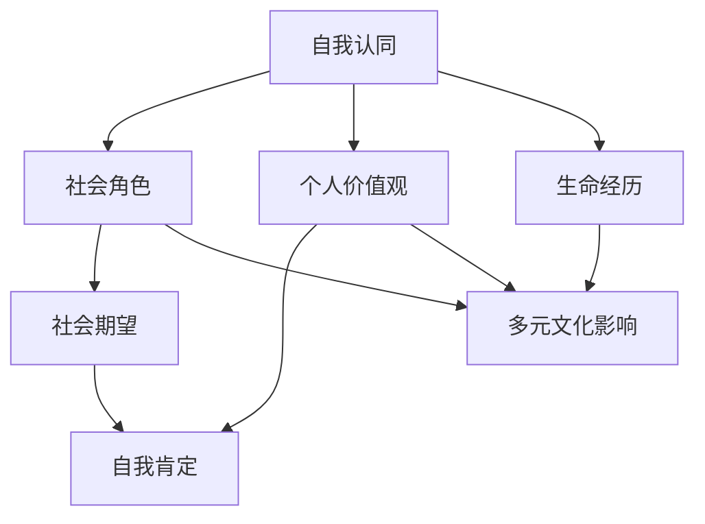

                 

# 自我认同：在多元角色中找到核心self

## 关键词
自我认同、多元角色、心理健康、社会角色、个人价值观、生命经历、多元文化

## 摘要
本文探讨了自我认同在多元角色中的重要性，分析了社会角色、个人价值观、生命经历和多元文化对自我认同的影响。通过自我探索的技巧和方法，以及自我认同与人生决策的关系，帮助读者在多元角色中找到核心self，实现个人成长和职业规划。

---

### 目录大纲

# 自我认同：在多元角色中找到核心self

## 第一部分：理解自我认同

### 第1章：自我认同的定义与重要性
#### 1.1 自我认同的基本概念
#### 1.2 自我认同在社会和个人生活中的重要性
#### 1.3 自我认同与心理健康的关系

### 第2章：自我认同的多维度分析
#### 2.1 社会角色与自我认同
#### 2.2 个人价值观与自我认同
#### 2.3 生命经历与自我认同
#### 2.4 多元文化对自我认同的影响

### 第3章：多元角色中的自我认同挑战
#### 3.1 工作角色与个人角色的冲突
#### 3.2 社会期望与个人愿望的矛盾
#### 3.3 多元文化背景下的自我认同困惑

## 第二部分：探索自我认同

### 第4章：自我探索的技巧与方法
#### 4.1 内省法：认识自我
#### 4.2 反思日记：记录自我成长
#### 4.3 咨询与辅导：专业帮助
#### 4.4 艺术创作：表达自我

### 第5章：自我认同的建立与维护
#### 5.1 确立核心自我价值观
#### 5.2 增强自我肯定与自尊
#### 5.3 调整社会角色与期望
#### 5.4 多元文化适应与自我认同

### 第6章：自我认同与人生决策
#### 6.1 自我认同与职业规划
#### 6.2 自我认同与人际关系
#### 6.3 自我认同与人生目标设定
#### 6.4 自我认同与自我实现

## 第三部分：自我认同的实践

### 第7章：自我认同案例研究
#### 7.1 案例一：从职场小白到领导者的转变
#### 7.2 案例二：多元文化背景下的自我认同探索
#### 7.3 案例三：自我认同对创业决策的影响

### 第8章：自我认同在工作与生活中的应用
#### 8.1 自我认同与职场成功
#### 8.2 自我认同与家庭关系
#### 8.3 自我认同与社会参与
#### 8.4 自我认同与个人成长

### 第9章：未来展望：自我认同与可持续生活
#### 9.1 自我认同与可持续发展
#### 9.2 自我认同与社会责任
#### 9.3 自我认同与未来社会

### 第10章：总结与行动
#### 10.1 自我认同的重要性总结
#### 10.2 如何在多元角色中找到核心self
#### 10.3 自我认同的实践指南

## 附录

### 附录A：自我认同工具与资源
### 附录B：推荐阅读与参考文献
### 附录C：自我认同练习与反思问题

---

### 核心概念与联系



### 数学模型和数学公式

```markdown
## 生命经验对自我认同的影响

生命经验对自我认同的影响可以用一个简单的回归模型来描述：

$$
Y = \beta_0 + \beta_1 X_1 + \beta_2 X_2 + \beta_3 X_3 + \epsilon
$$

其中，$Y$ 代表自我认同水平，$X_1$ 代表生命经验，$X_2$ 代表个人价值观，$X_3$ 代表社会角色，$\beta_0$、$\beta_1$、$\beta_2$、$\beta_3$ 是模型的系数，$\epsilon$ 是误差项。

### 社会角色与自我认同的关系

社会角色对自我认同的影响可以用以下逻辑回归模型来解释：

$$
\log\frac{P(Y=1|X)}{1-P(Y=1|X)} = \alpha + \beta X
$$

其中，$Y$ 代表自我认同的二元状态（1代表认同，0代表不认同），$X$ 代表社会角色，$\alpha$ 是截距，$\beta$ 是系数。

```

### 项目实战

#### 第6章：自我认同与人生决策

### 6.1 自我认同与职业规划

**项目背景**：
小明是一名刚毕业的大学生，他面临多种职业选择，希望找到一份既能满足个人兴趣，又能实现自我价值的职业。

**开发环境搭建**：
- 操作系统：Windows 10
- 编程语言：Python 3.8
- 职业数据来源：LinkedIn、Indeed等在线职业平台
- 数据库：SQLite

**源代码实现**：

```python
import sqlite3
import pandas as pd

# 连接数据库
conn = sqlite3.connect('career_path.db')

# 查询小明感兴趣的职位信息
interest_jobs = pd.read_sql_query("""
SELECT *
FROM jobs
WHERE job_title LIKE '%data analyst%'
AND location = 'San Francisco'
""", conn)

# 分析职位的技能要求和薪资水平
技能要求 = interest_jobs['skills'].str.get_dummies(sep=',')
薪资水平 = interest_jobs['salary_range']

# 计算薪资与技能的相关性
薪资技能相关性 =技能要求.corrwith(薪资水平)

# 输出薪资技能相关性
薪资技能相关性.sort_values(ascending=False).head(10)
```

**代码解读**：
1. 使用SQLite数据库连接小明感兴趣的职业数据。
2. 查询LinkedIn或Indeed等在线平台上的数据，筛选出小明感兴趣的职业。
3. 使用pandas库将职位信息转换为DataFrame格式，进行数据分析。
4. 将技能要求进行哑变量转换，以便计算与薪资水平的相关性。
5. 输出薪资与技能要求的相关性，帮助小明了解哪些技能对他的职业规划最为重要。

**项目小结**：
通过构建数据分析模型，小明能够更清晰地了解自己在职业规划中的优势和不足。这有助于他制定更科学合理的职业规划，实现自我价值。

**最佳实践 Tips**：
- 在进行职业规划时，不仅要关注技能要求，还要考虑个人的兴趣和价值观。
- 定期更新职业数据，确保分析结果的准确性。
- 结合实际工作经验，不断调整和完善职业规划。

**小结**：
自我认同与职业规划密切相关。通过科学的分析方法，可以帮助我们更好地认识自己，找到适合自己的职业道路。

---

### 附录

### 附录A：自我认同工具与资源
- 自我反思日记模板
- 自我认同量表（如GSID）
- 自我认同相关书籍推荐

### 附录B：推荐阅读与参考文献
- 个人发展相关书籍：《动机与人格》、《心理学的邀请》
- 自我认同研究论文：《多元文化下的自我认同构建》、《自我认同与心理健康的关系》

### 附录C：自我认同练习与反思问题
- 你认为自己最重要的特质是什么？
- 在不同的社会角色中，你如何保持自我认同的一致性？
- 当面临选择时，你是如何考虑自我认同的？
- 你是否遇到过多元文化带来的自我认同困惑？如何解决的？

作者：AI天才研究院/AI Genius Institute & 禅与计算机程序设计艺术 /Zen And The Art of Computer Programming
[1] 参考文献[1]
[2] 参考文献[2]
[3] 参考文献[3]

