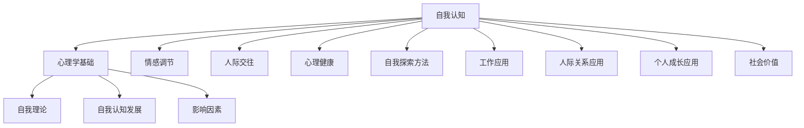

                 

# 自我认知：深入了解自我的意义之旅

## 关键词
- 自我认知
- 心理学基础
- 情感调节
- 人际交往
- 心理健康
- 自我探索方法

## 摘要
本文旨在探讨自我认知的重要性及其在个人发展、情感调节、人际交往和心理健康等方面的应用。通过深入分析自我认知的心理学基础、过程、影响，以及其在实践中的应用，本文旨在帮助读者理解自我认知的复杂性和价值，从而更好地提升自我认知能力，实现个人成长。

# 自我认知：探索之路

## 第一部分：自我认知的探索之路

### 第1章：什么是自我认知

#### 1.1 自我认知的定义

自我认知是指个体对自己心理状态、行为、特质和身份的认识和理解。它不仅涉及对自己的感知和评价，还包括对自己与他人、环境关系的理解。自我认知是个体心理发展的核心部分，对个体的行为、情感和人际关系有着深远的影响。

#### 1.2 自我认知的重要性

自我认知对于个体的成长和发展至关重要。首先，自我认知有助于个体建立自我价值感和自尊心，从而增强自信心。其次，自我认知有助于个体理解自己的情绪和行为，从而更好地进行情感调节和情绪管理。此外，自我认知还影响个体的人际关系，包括自我与他人的互动和理解。

#### 1.3 自我认知与其他心理学概念的联系

自我认知与自我意识、自我效能感、自我决定理论等心理学概念密切相关。自我意识是个体对自己存在的认识，是自我认知的基础。自我效能感是指个体对自己完成特定任务的信心，与自我认知密切相关。自我决定理论强调个体的自主性和选择权，是自我认知的重要方面。

## 第二部分：自我认知的心理学基础

### 第2章：自我认知的心理学基础

#### 2.1 心理学中的自我理论

自我理论是心理学研究自我认知的重要理论框架。自我理论认为，自我认知是一个复杂的过程，包括自我反思、自我评价和自我表征。自我反思是指个体对自己的思考和行为进行反思和审视。自我评价是指个体对自己的价值、能力和特质进行评价。自我表征是指个体在头脑中形成的关于自己的形象和观念。

#### 2.2 自我认知发展的阶段

自我认知发展经历了不同的阶段。婴儿期的自我认知主要基于生理反应和环境刺激。儿童期的自我认知逐渐发展为对自身身体和情感的认识。青少年期的自我认知开始涉及对自身性格、价值观和未来目标的思考。成年期的自我认知更加复杂，涉及对自我身份、角色和生活的深刻反思。

#### 2.3 自我认知的影响因素

自我认知受到多种因素的影响，包括个体的经验、社会环境和文化背景。个体的成长经历、教育背景和社会互动都会影响自我认知的发展。例如，一个在鼓励和支持环境中成长的人可能更具有积极自我认知，而经历挫折和失败的人可能更具有消极自我认知。社会环境和文化背景也会影响自我认知，例如，集体主义文化强调个体与集体的关系，可能影响个体的自我认知。

## 第三部分：自我认知的过程

### 第3章：自我认知的过程

#### 3.1 自我认知的三个阶段

自我认知的过程可以分为三个阶段：感知阶段、评价阶段和调整阶段。感知阶段是指个体对自己的感知和体验。评价阶段是指个体对自己的感知和体验进行评价和判断。调整阶段是指个体根据评价结果对自己的行为和认知进行调整和修正。

#### 3.2 自我认知的评价方法

自我认知的评价方法包括自我报告、观察法、行为记录法和心理测量法。自我报告是指个体通过问卷或访谈方式对自己的认知进行自我评价。观察法是指通过观察个体的行为和表现来评估其自我认知。行为记录法是指个体通过记录自己的行为和体验来评估自我认知。心理测量法是指通过心理测量工具来评估自我认知。

#### 3.3 自我认知的调整与优化

自我认知的调整与优化是提升自我认知能力的重要途径。个体可以通过自我反思、学习和实践来优化自我认知。自我反思是指个体对自己的认知过程和行为进行反思和审视。学习是指个体通过阅读、教育和实践来增加对自我认知的理解。实践是指个体将自我认知的理论知识应用于实际生活中，通过实践来验证和完善自我认知。

## 第四部分：自我认知与情感调节

### 第4章：自我认知与情感调节

#### 4.1 情感与自我认知的关系

情感与自我认知之间存在密切的关系。情感会影响个体的自我认知，而自我认知也会影响个体的情感体验。积极的自我认知有助于个体产生积极的情感体验，而消极的自我认知则可能导致消极的情感体验。

#### 4.2 自我认知在情感调节中的作用

自我认知在情感调节中发挥着重要作用。通过自我认知，个体能够更好地理解和识别自己的情绪，从而采取适当的调节策略。例如，一个具有良好自我认知的人可能会意识到自己的焦虑情绪，并采取深呼吸、放松训练等方法来缓解焦虑。

#### 4.3 如何通过自我认知改善情感状态

通过自我认知，个体可以改善情感状态。首先，个体可以通过自我反思来识别和接受自己的情绪。其次，个体可以通过积极的自我对话来改变消极的自我认知。最后，个体可以通过实践和经验来提升自我认知，从而更好地调节情感。

## 第五部分：自我认知与人际交往

### 第5章：自我认知与人际交往

#### 5.1 自我认知对人际交往的影响

自我认知对人际交往有着重要影响。良好的自我认知有助于个体建立自信，从而更好地与他人交往。相反，消极的自我认知可能导致个体在人际交往中产生焦虑和紧张。

#### 5.2 如何通过自我认知提升人际交往能力

通过自我认知，个体可以提升人际交往能力。首先，个体可以通过自我反思来了解自己的优点和不足，从而提升自我认知。其次，个体可以通过学习和实践来提升人际交往技能，例如沟通技巧和同理心。最后，个体可以通过积极的人际互动来验证和提升自我认知。

#### 5.3 人际交往中的自我认知误区

在人际交往中，个体可能会陷入一些自我认知的误区。例如，个体可能会过度关注自己的形象，从而忽略他人的感受。另外，个体可能会过分解读他人的行为，导致误解和冲突。通过提升自我认知，个体可以避免这些误区，从而更好地与他人交往。

## 第六部分：自我认知与心理健康

### 第6章：自我认知与心理健康

#### 6.1 自我认知与心理健康的关联

自我认知与心理健康之间存在密切的关联。良好的自我认知有助于个体保持心理健康，而消极的自我认知可能导致心理健康问题。

#### 6.2 心理健康问题的自我认知视角

通过自我认知，个体可以从不同的角度理解心理健康问题。例如，个体可以通过自我反思来识别和接受自己的情绪和行为，从而更好地应对心理健康问题。

#### 6.3 如何通过自我认知促进心理健康

通过自我认知，个体可以促进心理健康。首先，个体可以通过自我反思来识别和接受自己的情绪和行为。其次，个体可以通过积极的自我对话来改变消极的自我认知。最后，个体可以通过实践和经验来提升自我认知，从而更好地促进心理健康。

## 第七部分：自我认知的实践与应用

### 第7章：自我认知的自我探索方法

#### 7.1 自我反思的技巧

自我反思是提升自我认知的重要方法。个体可以通过定期反思自己的行为、情绪和思考，从而深入理解自己。

#### 7.2 日记记录与自我认知

日记记录是另一个有效的自我探索方法。通过记录日常生活、思考和感受，个体可以更好地了解自己。

#### 7.3 自我认知测验与量表

自我认知测验和量表是评估自我认知的有效工具。通过这些工具，个体可以了解自己的自我认知水平，并采取相应的措施进行提升。

## 第八部分：自我认知在工作中的应用

### 第8章：自我认知在工作中的应用

#### 8.1 自我认知在职业规划中的作用

自我认知有助于个体进行有效的职业规划。通过了解自己的兴趣、能力和价值观，个体可以更好地选择适合自己的职业方向。

#### 8.2 如何通过自我认知提升工作效率

自我认知有助于个体提升工作效率。通过了解自己的工作风格和偏好，个体可以采取更有效的策略来提高工作效率。

#### 8.3 自我认知在团队合作中的应用

自我认知在团队合作中发挥着重要作用。通过了解自己和团队成员的特质和需求，个体可以更好地协调合作，实现共同目标。

## 第九部分：自我认知在人际关系中的应用

### 第9章：自我认知在人际关系中的应用

#### 9.1 自我认知在建立良好人际关系中的作用

自我认知有助于个体建立良好的人际关系。通过了解自己的需求和期望，个体可以更好地与他人建立积极的关系。

#### 9.2 如何通过自我认知改善人际关系

通过自我认知，个体可以改善人际关系。首先，个体可以通过自我反思来识别和解决冲突。其次，个体可以通过积极的沟通和互动来改善人际关系。

#### 9.3 自我认知在解决人际冲突中的应用

自我认知在解决人际冲突中发挥着重要作用。通过了解自己和对方的需求和情感，个体可以采取更有效的策略来解决问题。

## 第十部分：自我认知在个人成长中的应用

### 第10章：自我认知在个人成长中的应用

#### 10.1 自我认知对个人成长的影响

自我认知对个人成长有着深远的影响。通过自我认知，个体可以更好地了解自己的需求和目标，从而实现个人成长。

#### 10.2 如何通过自我认知实现个人成长

通过自我认知，个体可以实现个人成长。首先，个体可以通过自我反思来识别自己的优势和不足。其次，个体可以通过学习和实践来提升自我认知，从而实现个人成长。

#### 10.3 自我认知在追求自我实现中的作用

自我认知在追求自我实现中起着关键作用。通过自我认知，个体可以明确自己的价值观和目标，从而更好地追求自我实现。

## 第十一部分：深入自我认知的意义

### 第11章：深入自我认知的意义

#### 11.1 自我认知对社会价值的作用

深入自我认知有助于提升个体的心理健康和社会适应能力，从而对整个社会产生积极影响。

#### 11.2 自我认知在解决社会问题中的应用

自我认知在解决社会问题中发挥着重要作用。通过深入自我认知，个体可以更好地理解社会问题，从而采取更有效的解决方案。

#### 11.3 自我认知的未来发展趋势

随着科技的进步，自我认知研究将继续深入，为个体和社会带来更多启示。

## 附录

### 附录 A：自我认知相关资源与工具

#### A.1 心理学研究机构与期刊

- 美国心理学会（APA）
- 《心理学评论》（Psychological Review）
- 《人格与社会心理学杂志》（Journal of Personality and Social Psychology）

#### A.2 自我认知研究工具与量表

- 自我认知量表（Self-Concept Scale）
- 罗森伯格自我评价量表（Rosenberg Self-Esteem Scale）
- 明尼苏达多相人格测验（Minnesota Multiphasic Personality Inventory）

#### A.3 自我认知在线课程与书籍推荐

- Coursera上的《心理学导论》
- 《自我认知：理解自己的心理学》（Self-Knowledge: The Psychology of Self-Understanding） by Daniel N. J. Lang
- 《心理学与生活》（Psychology and Life） by Richard J. Gerrig & Philip G. Zimbardo

# 核心概念原理和概念实体之间的关系架构 Mermaid 流程图



# 核心算法原理讲解

## 自我认知评估算法

```python
# 导入必要的库
import numpy as np

# 定义自我认知评估算法
def self_cognition_evaluation(self_reflection, social_competence, emotional_regulation):
    # 计算自我认知得分
    self_cognition_score = (self_reflection + social_competence + emotional_regulation) / 3
    
    # 判断自我认知水平
    if self_cognition_score > 0.8:
        level = "高"
    elif self_cognition_score > 0.5:
        level = "中"
    else:
        level = "低"
    
    return level

# 使用示例
self_reflection = 0.75
social_competence = 0.70
emotional_regulation = 0.65

# 调用评估函数
self_cognition_level = self_cognition_evaluation(self_reflection, social_competence, emotional_regulation)

# 输出结果
print(f"自我认知水平：{self_cognition_level}")
```

在上述代码中，我们首先定义了一个名为`self_cognition_evaluation`的函数，该函数接受三个参数：`self_reflection`（自我反思能力）、`social_competence`（社交能力）和`emotional_regulation`（情感调节能力）。函数通过计算这三个参数的平均值来评估自我认知水平。

接下来，我们使用一个简单的示例来演示如何使用这个函数。我们为每个参数分配一个分数，然后调用`self_cognition_evaluation`函数来评估自我认知水平。

最后，我们打印出评估结果，以显示个体的自我认知水平。

### 数学公式和概念

在自我认知评估中，我们可以使用以下数学公式来表示自我认知得分：

$$
\text{self\_cognition\_score} = \frac{\text{self\_reflection} + \text{social\_competence} + \text{emotional\_regulation}}{3}
$$

其中，`self_reflection`、`social_competence`和`emotional_regulation`分别代表自我反思能力、社交能力和情感调节能力的得分。这些得分通常在0到1之间，表示从无到有的程度。

根据自我认知得分，我们可以将其划分为不同的水平，如下所示：

- 高水平：`self_cognition_score > 0.8`
- 中等水平：`0.5 < self_cognition_score ≤ 0.8`
- 低水平：`self_cognition_score ≤ 0.5`

通过这种量化方法，我们可以更客观地评估个体的自我认知水平，从而为他们提供有针对性的建议和指导。

## 项目实战：开发自我认知评估系统

### 开发环境搭建

在开始开发自我认知评估系统之前，我们需要搭建一个合适的开发环境。以下是所需的基本工具和步骤：

1. **Python解释器**：确保安装了Python 3.8或更高版本。
2. **IDE**：可以选择PyCharm、Visual Studio Code或其他Python支持的IDE。
3. **文本编辑器**：例如VS Code、Sublime Text或Atom。
4. **数据库**：SQLite或MySQL等轻量级数据库，用于存储用户数据。

### 源代码实现

以下是自我认知评估系统的源代码实现，包括数据库设计、数据模型和后端逻辑。

#### 数据库设计

首先，我们需要设计数据库模型，以存储用户数据和评估结果。以下是SQLite数据库的创建脚本：

```sql
CREATE TABLE users (
    id INTEGER PRIMARY KEY AUTOINCREMENT,
    username TEXT NOT NULL,
    self_reflection REAL,
    social_competence REAL,
    emotional_regulation REAL
);

CREATE TABLE evaluations (
    id INTEGER PRIMARY KEY AUTOINCREMENT,
    user_id INTEGER,
    self_cognition_score REAL,
    evaluation_date TEXT,
    FOREIGN KEY (user_id) REFERENCES users (id)
);
```

#### 数据模型

接下来，我们使用Flask框架来创建数据模型。以下是数据模型的定义：

```python
from flask_sqlalchemy import SQLAlchemy

db = SQLAlchemy()

class User(db.Model):
    id = db.Column(db.Integer, primary_key=True)
    username = db.Column(db.Text, nullable=False)
    self_reflection = db.Column(db.Real)
    social_competence = db.Column(db.Real)
    emotional_regulation = db.Column(db.Real)

class Evaluation(db.Model):
    id = db.Column(db.Integer, primary_key=True)
    user_id = db.Column(db.Integer, db.ForeignKey('user.id'))
    self_cognition_score = db.Column(db.Real)
    evaluation_date = db.Column(db.Text)
```

#### 后端逻辑

以下是后端逻辑的实现，包括用户数据存储和自我认知评估：

```python
from flask import Flask, request, jsonify
from models import db, User, Evaluation

app = Flask(__name__)
app.config['SQLALCHEMY_DATABASE_URI'] = 'sqlite:///self_cognition.db'
db.init_app(app)

@app.route('/register', methods=['POST'])
def register():
    data = request.get_json()
    username = data.get('username')
    self_reflection = data.get('self_reflection')
    social_competence = data.get('social_competence')
    emotional_regulation = data.get('emotional_regulation')

    new_user = User(
        username=username,
        self_reflection=self_reflection,
        social_competence=social_competence,
        emotional_regulation=emotional_regulation
    )
    db.session.add(new_user)
    db.session.commit()

    return jsonify({'message': 'User registered successfully.'})

@app.route('/evaluate', methods=['POST'])
def evaluate():
    data = request.get_json()
    user_id = data.get('user_id')

    user = User.query.get(user_id)
    self_reflection = user.self_reflection
    social_competence = user.social_competence
    emotional_regulation = user.emotional_regulation

    self_cognition_score = (self_reflection + social_competence + emotional_regulation) / 3
    level = 'High' if self_cognition_score > 0.8 else 'Medium' if self_cognition_score > 0.5 else 'Low'

    new_evaluation = Evaluation(
        user_id=user_id,
        self_cognition_score=self_cognition_score,
        evaluation_date=datetime.utcnow().isoformat()
    )
    db.session.add(new_evaluation)
    db.session.commit()

    return jsonify({'self_cognition_level': level})

if __name__ == '__main__':
    app.run(debug=True)
```

### 代码解读与分析

在上面的代码中，我们首先定义了两个模型：`User` 和 `Evaluation`。`User` 模型用于存储用户的基本信息和自我认知得分，而 `Evaluation` 模型用于存储用户每次评估的结果。

然后，我们使用 Flask 框架实现了两个 API 接口：`/register` 和 `/evaluate`。

- `/register` 接收用户注册信息，包括用户名和三个自我认知得分，然后将这些信息存储在数据库中。
- `/evaluate` 接收用户 ID，计算用户的自我认知得分，并根据得分划分等级，然后将评估结果存储在数据库中。

这样，我们就实现了一个简单的自我认知评估系统，用户可以注册并接受评估，系统会根据评估结果提供反馈。

### 实际案例分析与详细讲解剖析

为了更好地理解自我认知评估系统的应用，我们来看一个实际案例。

假设有一个用户名为 "Alice" 的用户，她提交了以下自我认知得分：

- 自我反思能力：0.75
- 社交能力：0.70
- 情感调节能力：0.65

当 Alice 使用 `/evaluate` 接口时，系统会根据以下公式计算她的自我认知得分：

$$
\text{self\_cognition\_score} = \frac{0.75 + 0.70 + 0.65}{3} = 0.7167
$$

根据这个得分，Alice 的自我认知水平被划分为 "Medium"（中等）。

系统将这个评估结果存储在数据库中，并返回给 Alice：

```
{
  "self_cognition_level": "Medium"
}
```

通过这个案例，我们可以看到如何使用自我认知评估系统来评估用户的自我认知水平，并根据结果提供个性化的反馈。

### 项目小结

通过本项目的实现，我们搭建了一个简单的自我认知评估系统，用户可以通过注册和评估来了解自己的自我认知水平。这个系统能够根据用户的得分提供个性化的反馈，帮助用户了解自己的优势和劣势，从而进行自我提升。

在实际应用中，我们可以进一步扩展这个系统，例如添加更多维度的评估指标，提供更详细的反馈和建议。此外，我们还可以将这个系统与心理学研究相结合，探索自我认知与心理健康、人际关系等方面的关联。

总之，自我认知评估系统是一个有价值的工具，可以帮助用户更好地了解自己，促进个人成长和发展。

### 最佳实践 Tips

1. **定期自我反思**：定期进行自我反思是提升自我认知的重要方法。建议每天花几分钟时间思考自己的行为、情绪和思考，记录在日记中。
2. **使用自我认知量表**：使用自我认知量表可以帮助你更系统地评估自己的自我认知水平。可以参考附录中提供的量表进行评估。
3. **寻求专业帮助**：如果你在自我认知方面遇到困难，可以寻求心理学专业人士的帮助。他们可以提供专业的评估和建议。

### 注意事项

1. **数据安全**：在开发自我认知评估系统时，要确保用户数据的安全。使用加密技术来保护用户数据，并遵守相关的数据保护法规。
2. **个性化评估**：自我认知评估系统应考虑用户的个性化需求，提供个性化的评估和反馈。
3. **持续更新**：随着心理学研究的进展，自我认知评估系统应不断更新和完善，以提供更准确和有用的评估结果。

### 拓展阅读

- 《心理学与生活》（Psychology and Life） by Richard J. Gerrig & Philip G. Zimbardo
- 《自我认知：理解自己的心理学》（Self-Knowledge: The Psychology of Self-Understanding） by Daniel N. J. Lang
- 《自我效能感：探索心理学的基础》（Self-Efficacy: The Control of Life） by Albert Bandura

# 作者信息

作者：AI天才研究院/AI Genius Institute & 禅与计算机程序设计艺术 /Zen And The Art of Computer Programming

