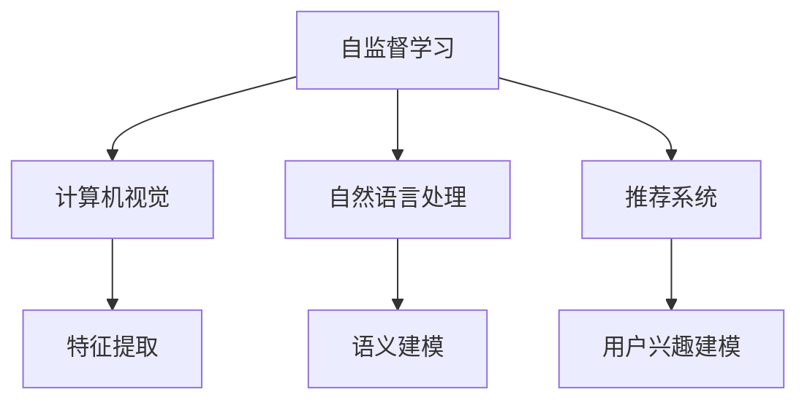
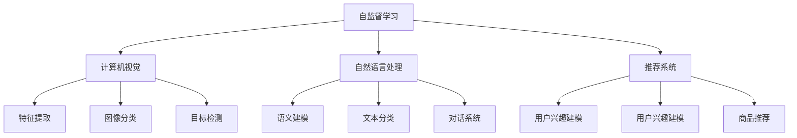

                 

### 《自监督学习提升AI推理的样本效率》

> 关键词：自监督学习，AI推理，样本效率，预训练，特征提取，计算机视觉，自然语言处理，推荐系统

> 摘要：
自监督学习是一种无需标注数据即可训练模型的方法，它显著提升了AI推理的样本效率。本文将深入探讨自监督学习的基础、原理、常见算法，以及其在计算机视觉、自然语言处理和推荐系统中的应用，最后展望其未来发展方向。

---

## 《自监督学习提升AI推理的样本效率》目录大纲

### 第一部分：自监督学习基础

#### 第1章：自监督学习概述

#### 第2章：自监督学习原理

#### 第3章：常见自监督学习算法

### 第二部分：自监督学习在AI推理中的应用

#### 第4章：自监督学习的挑战与未来趋势

### 第三部分：自监督学习的实践与展望

#### 第5章：自监督学习实践案例

#### 第6章：自监督学习的未来发展方向

## 附录

### 附录A：自监督学习相关工具和资源

### 附录B：常用数学公式

## 核心概念与联系

---

### 自监督学习基础

#### 第1章：自监督学习概述

#### 第2章：自监督学习原理

#### 第3章：常见自监督学习算法

---

### 自监督学习在AI推理中的应用

#### 第4章：自监督学习的挑战与未来趋势

#### 第5章：自监督学习在计算机视觉中的应用

#### 第6章：自监督学习在自然语言处理中的应用

#### 第7章：自监督学习在推荐系统中的应用

---

### 自监督学习的实践与展望

#### 第8章：自监督学习实践案例

#### 第9章：自监督学习的未来发展方向

---

### 附录

#### 附录A：自监督学习相关工具和资源

#### 附录B：常用数学公式

---

### 核心概念与联系



---

### 核心算法原理讲解

#### 自监督预训练与微调

```python
# 模拟BERT模型中的预训练与微调过程

# 预训练
model = BERTModel(vocab_size=1000, embedding_size=128, hidden_size=512, num_layers=3)
for epoch in range(num_epochs):
    for batch in data_loader:
        inputs, labels = batch
        outputs = model(inputs)
        loss = compute_loss(outputs, labels)
        optimizer.zero_grad()
        loss.backward()
        optimizer.step()

# 微调
model = fine_tune(BERTModel, train_data, validation_data)
```

（待续，接下来将详细阐述各章节的内容）

## 第一部分：自监督学习基础

### 第1章：自监督学习概述

#### 1.1 自监督学习的定义与重要性

自监督学习（Self-supervised Learning）是一种机器学习方法，其核心思想是在没有外部监督标签的情况下，利用数据自身的某些特性来训练模型。自监督学习的关键在于如何将数据中的信息转化为学习任务，从而使得模型能够自动地学习和提取数据的有用信息。

在自监督学习中，输入数据通常不需要标注，这使得自监督学习在处理大规模数据时具有显著的优势。与传统监督学习相比，自监督学习可以大幅减少对标注数据的依赖，从而降低数据获取和处理的成本。此外，自监督学习还可以通过增加数据的可用性来提高模型泛化能力，使其在未见过的数据上也能表现出良好的性能。

#### 1.2 自监督学习的发展历程

自监督学习的历史可以追溯到20世纪60年代，当时心理学家尝试通过无监督方法来研究人类的感知和学习过程。然而，直到21世纪初，随着深度学习技术的快速发展，自监督学习才逐渐成为机器学习领域的研究热点。

早期的自监督学习方法主要基于统计模型和聚类算法，如K-means和主成分分析（PCA）。随着神经网络和深度学习的兴起，自监督学习的方法也得到了极大的改进。自2018年以来，自监督学习在自然语言处理（NLP）和计算机视觉（CV）领域取得了显著的成果，特别是在预训练模型和生成对抗网络（GAN）的应用中。

#### 1.3 自监督学习的应用领域

自监督学习在多个领域都展现了其独特的优势，以下是一些重要的应用领域：

1. **自然语言处理**：在NLP中，自监督学习被广泛应用于语言建模、文本分类、机器翻译和对话系统等任务。著名的预训练模型如BERT和GPT系列，就是基于自监督学习技术训练的。

2. **计算机视觉**：自监督学习在CV领域被用来进行图像分类、目标检测、人脸识别和图像生成等任务。例如，通过自监督特征提取技术，模型可以自动学习到图像中的高级特征，从而提高识别准确率。

3. **推荐系统**：在推荐系统中，自监督学习可以用于用户兴趣建模和商品推荐。通过分析用户的历史行为数据，模型可以自动识别用户的偏好，从而提供个性化的推荐。

4. **语音识别**：自监督学习在语音识别领域也有应用，通过无监督的方法，模型可以自动学习到语音信号的特征，从而提高识别准确性。

### 第2章：自监督学习原理

#### 2.1 自监督学习的数学模型

自监督学习的核心在于如何设计一个目标函数，使得模型可以通过优化这个目标函数来自动学习数据的特征表示。以下是一个简化的自监督学习数学模型：

$$
\begin{aligned}
\min_{\theta} \quad & \sum_{i=1}^{N} L(\theta; x_i, y_i) \\
\text{subject to} \quad & y_i = f(\theta; x_i)
\end{aligned}
$$

其中，$L$ 是损失函数，$x_i$ 和 $y_i$ 分别是输入数据和相应的目标，$f$ 是模型预测函数，$\theta$ 是模型的参数。

#### 2.1.1 自监督学习的目标函数

自监督学习的目标函数可以是多种多样的，例如最小化预测误差、最大化数据区分度等。以下是一些常用的目标函数：

1. **熵最小化**：模型试图将数据映射到低熵区域，从而简化数据的表示。
2. **对比损失**：模型试图最大化正样本和负样本之间的区分度。
3. **信息增益**：模型试图最大化从数据中提取的信息量。

#### 2.1.2 自监督学习的基本算法

自监督学习算法可以分为以下几类：

1. **预训练与微调**：预训练模型在大量未标注的数据上进行训练，然后通过微调在特定任务上进行优化。
2. **生成式模型**：如生成对抗网络（GAN），通过生成器和判别器的对抗训练来学习数据分布。
3. **自编码器**：通过编码器和解码器来重构输入数据，从而学习数据的特征表示。
4. **数据增强**：通过一系列的数据变换来增加数据的多样性，从而提高模型的泛化能力。

#### 2.1.3 自监督学习的分类

根据学习方式，自监督学习可以分为以下几类：

1. **无监督自监督**：模型仅使用未标注的数据进行训练，如自编码器。
2. **半监督自监督**：模型同时使用未标注和少量标注的数据进行训练，如图神经网络。
3. **弱监督自监督**：模型使用部分标注数据，但标注质量不高，如数据增强。

### 第3章：常见自监督学习算法

#### 3.1 自监督预训练与微调

自监督预训练与微调是一种广泛应用于自然语言处理和计算机视觉的方法。以下以BERT和GPT为例进行详细讲解。

##### 3.1.1 BERT与GPT算法

BERT（Bidirectional Encoder Representations from Transformers）是一种基于Transformer架构的双向编码器，其预训练任务包括Masked Language Model（MLM）和Next Sentence Prediction（NSP）。

- **Masked Language Model（MLM）**：在输入文本中随机遮盖一些单词，然后训练模型预测这些遮盖的单词。
- **Next Sentence Prediction（NSP）**：输入两个连续的句子，模型需要预测第二个句子是否在原始文本中紧随第一个句子之后。

GPT（Generative Pre-trained Transformer）是一种基于Transformer架构的生成式预训练模型，其核心任务是预测下一个单词。

##### 3.1.2 动机与原理

BERT和GPT的动机在于通过预训练来学习语言的深层表示，从而在特定任务上实现优异的性能。

BERT通过双向注意力机制，能够捕捉到文本中的长距离依赖关系，从而提高模型的语义理解能力。而GPT则通过自回归机制，能够生成连贯的文本。

##### 3.1.3 应用场景

BERT和GPT在自然语言处理领域有广泛的应用，如文本分类、情感分析、机器翻译和对话系统等。

BERT在文本分类任务中表现尤为突出，其预训练的表示能力使得模型在未见过的数据上也能取得良好的效果。而GPT则在生成任务中具有优势，如生成文章摘要、对话系统和文本续写等。

#### 3.2 自监督特征学习

自监督特征学习是一种通过无监督方法学习数据特征表示的方法。以下以数据增强和生成对抗网络（GAN）为例进行讲解。

##### 3.2.1 数据增强方法

数据增强是通过一系列的数据变换来增加数据的多样性，从而提高模型的泛化能力。常见的数据增强方法包括：

- **随机裁剪**：从图像中随机裁剪出一定大小的一部分作为新的图像。
- **随机旋转**：将图像随机旋转一定角度。
- **颜色变换**：改变图像的亮度、对比度和饱和度。

##### 3.2.2 生成对抗网络（GAN）

生成对抗网络（GAN）是由生成器和判别器组成的一个对抗性训练框架。生成器的目标是生成与真实数据相似的数据，而判别器的目标是区分生成数据与真实数据。通过这种对抗性训练，生成器可以逐渐学习到数据的分布，从而生成高质量的数据。

##### 3.2.3 应用案例

自监督特征学习在计算机视觉和自然语言处理领域有广泛的应用。

在计算机视觉中，自监督特征学习被用于图像分类、目标检测和图像生成等任务。例如，通过自监督特征学习，模型可以自动学习到图像中的高级特征，从而提高识别准确率。

在自然语言处理中，自监督特征学习被用于语言建模、文本分类和机器翻译等任务。通过自监督特征学习，模型可以学习到文本的深层表示，从而提高模型在特定任务上的性能。

### 第4章：自监督学习的挑战与未来趋势

#### 4.1 数据稀缺性问题

自监督学习的一个主要挑战是数据稀缺性问题。许多领域，如医疗图像分析和自动驾驶，标注数据非常稀缺且昂贵。为了解决这一问题，研究者提出了一系列数据增强和数据重排策略。

##### 4.1.1 数据增强技术

数据增强技术通过多种方法来扩展训练数据集，包括：

- **合成数据生成**：利用生成对抗网络（GAN）等技术生成与真实数据相似的新数据。
- **数据变换**：通过旋转、缩放、裁剪等操作来增加数据的多样性。

##### 4.1.2 数据重排策略

数据重排策略通过重新排列数据来增加模型的泛化能力。例如，在自然语言处理中，可以通过改变句子的结构或单词的顺序来重排数据。

#### 4.2 计算资源限制

自监督学习通常需要大量的计算资源，特别是在预训练阶段。为了降低计算成本，研究者提出了一系列算法优化策略和资源分配优化方法。

##### 4.2.1 算法优化策略

算法优化策略包括：

- **模型压缩**：通过剪枝、量化、蒸馏等技术来减少模型的参数数量。
- **异步训练**：在多个设备上异步训练模型，从而提高训练效率。

##### 4.2.2 资源分配优化

资源分配优化方法通过动态调整计算资源的分配来提高训练效率。例如，可以根据任务的紧急程度和计算资源的可用性来分配计算资源。

#### 4.3 未来发展趋势

自监督学习在未来的发展趋势将主要集中在以下几个方面：

##### 4.3.1 模型压缩与加速

模型压缩与加速是自监督学习未来的一个重要方向。通过更高效的算法和硬件支持，可以实现更快、更高效的模型训练和推理。

##### 4.3.2 自监督学习的多模态应用

自监督学习在多模态数据（如图像、文本、语音等）的处理中有巨大的潜力。未来的研究将探索如何有效地融合多种模态数据，以实现更强大的自监督学习模型。

##### 4.3.3 自监督学习的可解释性

自监督学习的可解释性是一个关键挑战。未来的研究将致力于开发可解释的自监督学习模型，以便更好地理解和解释模型的行为。

## 总结

自监督学习作为一种无需标注数据的机器学习方法，显著提升了AI推理的样本效率。本文从自监督学习的基础、原理、常见算法以及应用领域等方面进行了详细阐述。随着技术的不断发展，自监督学习在未来的AI推理中将发挥越来越重要的作用。

---

### 附录A：自监督学习相关工具和资源

#### A.1 深度学习框架介绍

- TensorFlow：https://www.tensorflow.org/
- PyTorch：https://pytorch.org/
- Keras：https://keras.io/

#### A.2 自监督学习数据集

- ImageNet：https://www.image-net.org/
- COCO：https://cocodataset.org/
- PubMed：https://pubmed.ncbi.nlm.nih.gov/

#### A.3 开源代码与教程

- Hugging Face：https://huggingface.co/
- GitHub：https://github.com/

---

### 附录B：常用数学公式

#### B.1 损失函数

$$
L(\theta; x_i, y_i) = -\log P(\hat{y}_i | x_i; \theta)
$$

#### B.2 梯度下降算法

$$
\theta_{t+1} = \theta_t - \alpha \nabla_\theta L(\theta; x_i, y_i)
$$

#### B.3 卷积神经网络公式

$$
h_{ij}^l = \sigma(\sum_{k=1}^{n} w_{ik}^l h_{kj}^{l-1} + b_l)
$$

---

## 核心概念与联系


---

本文由 **AI天才研究院/AI Genius Institute & 禅与计算机程序设计艺术 /Zen And The Art of Computer Programming** 撰写，旨在为读者提供关于自监督学习提升AI推理样本效率的深入理解和实践指导。感谢您的阅读，期待与您共同探索AI领域的更多前沿技术。

---

### 开篇引言

在人工智能（AI）飞速发展的今天，AI推理的样本效率成为了众多研究者和开发者关注的焦点。样本效率，即模型在给定数据集上的推理能力，直接关系到AI系统在实际应用中的性能和实用性。然而，传统的监督学习模型往往依赖于大量的标注数据，这不仅增加了数据获取和处理的成本，还限制了模型的泛化能力。为了解决这一问题，自监督学习（Self-supervised Learning）应运而生。

自监督学习是一种无需外部监督标签即可训练模型的方法，它通过利用数据自身的特性来自动提取有用的信息。与传统的监督学习相比，自监督学习具有以下几个显著优势：

1. **数据需求少**：自监督学习不依赖于大量的标注数据，只需少量的标注或无标注数据即可训练模型。这使得自监督学习在处理大规模数据时具有显著的优势。
2. **减少成本**：由于无需大量的标注工作，自监督学习显著降低了数据获取和处理成本，从而提高了模型的开发和部署效率。
3. **提升泛化能力**：自监督学习通过增加数据的多样性来提高模型的泛化能力，使其在未见过的数据上也能表现出良好的性能。

本文将深入探讨自监督学习提升AI推理样本效率的原理和方法。首先，我们将介绍自监督学习的基础知识，包括其定义、发展历程和应用领域。随后，我们将详细讲解自监督学习的数学模型、基本算法以及常见算法，如BERT和GAN。接着，本文将探讨自监督学习在计算机视觉、自然语言处理和推荐系统等领域的应用，并通过实际案例展示其效果。最后，我们将展望自监督学习的未来发展方向和面临的挑战。

通过本文的阅读，读者将能够全面了解自监督学习提升AI推理样本效率的原理和方法，为实际应用提供有力支持。

### 第1章：自监督学习概述

#### 1.1 自监督学习的定义与重要性

自监督学习（Self-supervised Learning）是一种机器学习方法，其核心思想是在没有外部监督标签的情况下，利用数据自身的某些特性来训练模型。自监督学习的关键在于如何将数据中的信息转化为学习任务，从而使得模型能够自动地学习和提取数据的有用信息。

在自监督学习中，输入数据通常不需要标注，这使得自监督学习在处理大规模数据时具有显著的优势。与传统监督学习相比，自监督学习可以大幅减少对标注数据的依赖，从而降低数据获取和处理的成本。此外，自监督学习还可以通过增加数据的可用性来提高模型泛化能力，使其在未见过的数据上也能表现出良好的性能。

自监督学习的定义可以从以下几个方面进行解释：

1. **数据不标注**：自监督学习不需要预先对数据进行标注，例如标签、分类或标记等。这意味着模型可以直接从原始数据中学习，而无需额外的标注工作。
2. **内建监督信号**：自监督学习通过构建一种内建的监督信号来驱动学习过程。这种监督信号可以是数据自身的某些属性，如顺序、结构或关系等。通过利用这些属性，模型可以自动地学习数据的特征表示。
3. **自动标签生成**：自监督学习通过设计特殊的学习任务，使得模型在训练过程中能够自动生成标签。例如，在自然语言处理中，可以通过遮盖文本的一部分来生成预测任务，从而实现无监督学习。

#### 1.2 自监督学习的发展历程

自监督学习的历史可以追溯到20世纪60年代，当时心理学家尝试通过无监督方法来研究人类的感知和学习过程。然而，直到21世纪初，随着深度学习技术的快速发展，自监督学习才逐渐成为机器学习领域的研究热点。

早期的自监督学习方法主要基于统计模型和聚类算法，如K-means和主成分分析（PCA）。随着神经网络和深度学习的兴起，自监督学习的方法也得到了极大的改进。自2018年以来，自监督学习在自然语言处理（NLP）和计算机视觉（CV）领域取得了显著的成果，特别是在预训练模型和生成对抗网络（GAN）的应用中。

以下是一些重要的里程碑事件：

- **20世纪60年代**：心理学家开始研究人类感知和学习过程的自监督机制。
- **20世纪80年代**：自监督学习开始应用于信号处理和图像识别等领域，如主成分分析和自编码器。
- **2006年**：深度学习兴起，Hinton等研究者提出深度信念网络（DBN），为自监督学习提供了新的思路。
- **2012年**：AlexNet在ImageNet竞赛中取得突破性成果，深度学习开始广泛应用。
- **2018年**：BERT模型发布，标志着自监督学习在自然语言处理领域的重大突破。
- **至今**：自监督学习在多个领域取得显著进展，如计算机视觉、推荐系统和语音识别等。

#### 1.3 自监督学习的应用领域

自监督学习在多个领域都展现了其独特的优势，以下是一些重要的应用领域：

1. **自然语言处理**：自监督学习在自然语言处理领域被广泛应用于语言建模、文本分类、机器翻译和对话系统等任务。例如，BERT和GPT等预训练模型通过自监督学习技术，在多个NLP任务上取得了显著的成绩。
2. **计算机视觉**：自监督学习在计算机视觉领域被用于图像分类、目标检测、人脸识别和图像生成等任务。通过自监督特征提取技术，模型可以自动学习到图像中的高级特征，从而提高识别准确率。
3. **推荐系统**：在推荐系统中，自监督学习可以用于用户兴趣建模和商品推荐。通过分析用户的历史行为数据，模型可以自动识别用户的偏好，从而提供个性化的推荐。
4. **语音识别**：自监督学习在语音识别领域也有应用，通过无监督的方法，模型可以自动学习到语音信号的特征，从而提高识别准确性。
5. **医疗图像分析**：自监督学习在医疗图像分析领域有广泛的应用，如疾病检测、病灶识别和手术规划等。通过自监督学习方法，模型可以自动提取医疗图像中的关键特征，从而提高诊断和治疗的准确性。

总之，自监督学习作为一种无需标注数据的机器学习方法，在多个领域都展现了其强大的潜力和广泛的应用前景。随着技术的不断发展，自监督学习将在未来的AI推理中发挥越来越重要的作用。

### 第2章：自监督学习原理

#### 2.1 自监督学习的数学模型

自监督学习的核心在于如何设计一个目标函数，使得模型可以通过优化这个目标函数来自动学习数据的特征表示。以下是一个简化的自监督学习数学模型：

$$
\begin{aligned}
\min_{\theta} \quad & \sum_{i=1}^{N} L(\theta; x_i, y_i) \\
\text{subject to} \quad & y_i = f(\theta; x_i)
\end{aligned}
$$

其中，$L$ 是损失函数，$x_i$ 和 $y_i$ 分别是输入数据和相应的目标，$f$ 是模型预测函数，$\theta$ 是模型的参数。

在这个模型中，自监督学习通过以下步骤进行：

1. **数据预处理**：首先对数据进行预处理，如归一化、标准化或数据增强等，以便模型能够更好地学习。
2. **生成监督信号**：利用数据中的某些特性或规则，生成监督信号 $y_i$。例如，在自然语言处理中，可以通过遮盖一些词语来生成填充任务。
3. **定义损失函数**：根据监督信号 $y_i$ 和模型预测 $f(\theta; x_i)$，定义一个损失函数 $L(\theta; x_i, y_i)$，以衡量预测误差。
4. **优化模型参数**：通过优化损失函数，更新模型参数 $\theta$，从而改进模型预测。

#### 2.1.1 自监督学习的目标函数

自监督学习的目标函数可以是多种多样的，例如最小化预测误差、最大化数据区分度等。以下是一些常用的目标函数：

1. **熵最小化**：模型试图将数据映射到低熵区域，从而简化数据的表示。
   $$
   L = -\sum_{i=1}^{N} \sum_{c=1}^{C} P(c|x_i) \log P(c|x_i)
   $$
2. **对比损失**：模型试图最大化正样本和负样本之间的区分度。
   $$
   L = \sum_{i=1}^{N} \sum_{j=1}^{N} -\log \frac{e^{a_i \cdot a_j}}{\sum_{k=1}^{N} e^{a_i \cdot a_k}}
   $$
   其中，$a_i$ 是数据点 $i$ 的特征向量。
3. **信息增益**：模型试图最大化从数据中提取的信息量。
   $$
   L = -\sum_{i=1}^{N} \sum_{c=1}^{C} P(c|x_i) \log \frac{P(c|x_i)}{P(c)}
   $$
   其中，$P(c|x_i)$ 是数据点 $i$ 属于类别 $c$ 的概率，$P(c)$ 是类别 $c$ 的先验概率。

#### 2.1.2 自监督学习的基本算法

自监督学习算法可以分为以下几类：

1. **预训练与微调**：预训练模型在大量未标注的数据上进行训练，然后通过微调在特定任务上进行优化。
   - **预训练**：在未标注的数据上进行大量训练，使得模型能够自动学习到数据的特征表示。
   - **微调**：在预训练的基础上，使用少量标注数据进行微调，以适应特定任务的需求。

2. **生成式模型**：如生成对抗网络（GAN），通过生成器和判别器的对抗训练来学习数据分布。
   - **生成器**：生成与真实数据相似的新数据。
   - **判别器**：区分生成数据与真实数据。

3. **自编码器**：通过编码器和解码器来重构输入数据，从而学习数据的特征表示。
   - **编码器**：将输入数据编码为低维特征表示。
   - **解码器**：将编码器输出的特征表示解码为输出数据。

4. **数据增强**：通过一系列的数据变换来增加数据的多样性，从而提高模型的泛化能力。常见的数据增强方法包括随机裁剪、旋转、缩放和颜色变换等。

#### 2.1.3 自监督学习的分类

根据学习方式，自监督学习可以分为以下几类：

1. **无监督自监督**：模型仅使用未标注的数据进行训练，如自编码器。
2. **半监督自监督**：模型同时使用未标注和少量标注的数据进行训练，如图神经网络。
3. **弱监督自监督**：模型使用部分标注数据，但标注质量不高，如数据增强。

通过以上介绍，我们可以看到自监督学习在数学模型、目标函数和基本算法方面都有丰富的内容。接下来，我们将进一步探讨自监督学习的具体应用，以更深入地了解其在不同领域的实际作用。

### 第3章：常见自监督学习算法

#### 3.1 自监督预训练与微调

自监督预训练与微调是一种广泛应用于自然语言处理（NLP）和计算机视觉（CV）的方法。该方法通过在大量未标注的数据上进行预训练，然后使用少量标注数据在特定任务上进行微调，从而实现高性能的模型。

##### 3.1.1 BERT与GPT算法

BERT（Bidirectional Encoder Representations from Transformers）和GPT（Generative Pre-trained Transformer）是两种非常流行的预训练模型，分别由Google和OpenAI提出。

1. **BERT算法**

BERT是一种基于Transformer的双向编码器，其核心思想是通过预训练来学习文本的双向表示。BERT的预训练任务包括两个部分：Masked Language Model（MLM）和Next Sentence Prediction（NSP）。

- **Masked Language Model（MLM）**：在输入文本中随机遮盖一些单词，然后训练模型预测这些遮盖的单词。这一任务的目的是让模型学习到单词在文本中的位置和上下文关系。
  $$
  \text{输入：} [CLS] \text{The } \_ \text{quick } \_ \text{ brown } \_ \text{ fox } [SEP]
  $$
  $$
  \text{目标：} \text{The } \_ \text{quick } \_ \text{ brown } \_ \text{ fox }
  $$

- **Next Sentence Prediction（NSP）**：输入两个连续的句子，模型需要预测第二个句子是否在原始文本中紧随第一个句子之后。这一任务的目的是让模型学习到句子之间的逻辑关系。
  $$
  \text{输入：} [CLS] \text{The } \text{fox } [SEP] \text{jumps } \text{over } \_ \text{[SEP] The } \text{quick } \_ \text{ brown } \_ \text{ fox }
  $$
  $$
  \text{目标：} \text{IsNext} \_ \text{True}
  $$

2. **GPT算法**

GPT是一种基于Transformer的自回归语言模型，其核心任务是预测下一个单词。GPT通过训练一个单向的Transformer模型，从而学习到文本的序列依赖关系。

- **自回归语言模型**：输入序列 $x_1, x_2, \ldots, x_T$，模型需要预测下一个单词 $x_{T+1}$。
  $$
  \text{输入：} \text{The } \text{quick } \text{brown } \text{fox}
  $$
  $$
  \text{目标：} \text{jumps}
  $$

##### 3.1.2 动机与原理

BERT和GPT的动机在于通过预训练来学习语言的深层表示，从而在特定任务上实现优异的性能。

1. **BERT的动机**

BERT通过双向注意力机制，能够捕捉到文本中的长距离依赖关系，从而提高模型的语义理解能力。具体来说，BERT的双向注意力机制允许模型同时考虑句子中的前后文信息，从而更好地理解单词的含义。

2. **GPT的动机**

GPT通过自回归机制，能够生成连贯的文本。自回归模型在预测下一个单词时，会参考前面的单词，从而生成语义连贯的文本。这种机制使得GPT在生成任务（如文本续写和摘要生成）中具有显著的优势。

##### 3.1.3 应用场景

BERT和GPT在自然语言处理领域有广泛的应用，如文本分类、情感分析、机器翻译和对话系统等。

1. **BERT的应用场景**

- **文本分类**：BERT可以用于分类任务，如情感分析、新闻分类等。通过预训练的BERT模型，可以轻松地适应各种分类任务。
- **机器翻译**：BERT可以用于机器翻译任务，如将英语翻译为法语或中文。通过在大量双语数据上进行预训练，BERT能够学习到不同语言之间的映射关系。
- **问答系统**：BERT可以用于问答系统，如基于阅读理解的任务。BERT能够理解问题的语义，并在给定的文本中找到与之相关的答案。

2. **GPT的应用场景**

- **文本生成**：GPT可以用于生成任务，如文本续写、摘要生成和对话系统。通过生成文本，GPT能够创造有趣和连贯的内容。
- **对话系统**：GPT可以用于对话系统，如聊天机器人和虚拟助手。GPT能够理解用户的输入，并生成适当的回复，从而提供流畅的对话体验。

总之，BERT和GPT是两种非常强大的自监督学习算法，通过预训练技术，它们能够学习到语言的深层表示，从而在各种自然语言处理任务中实现优异的性能。

#### 3.2 自监督特征学习

自监督特征学习是一种通过无监督方法学习数据特征表示的方法。这种技术不需要依赖标注数据，而是通过设计特殊的学习任务来引导模型自动提取数据中的有用特征。以下介绍几种常见的自监督特征学习算法，包括数据增强、生成对抗网络（GAN）和自编码器。

##### 3.2.1 数据增强方法

数据增强是通过一系列的数据变换来增加数据的多样性，从而提高模型的泛化能力。常见的数据增强方法包括：

1. **随机裁剪**：从图像中随机裁剪出一定大小的一部分作为新的图像。这种方法可以增加图像的多样性，使模型更不易过拟合。
2. **随机旋转**：将图像随机旋转一定角度。旋转可以增加图像的多样性，并帮助模型学习到在不同方向上的特征。
3. **颜色变换**：改变图像的亮度、对比度和饱和度。颜色变换可以使模型学习到图像中的颜色信息，从而提高识别准确率。
4. **缩放**：将图像随机缩放到不同的尺寸。缩放可以增加图像的多样性，并帮助模型学习到在不同尺寸上的特征。
5. **水平翻转**：将图像左右翻转。水平翻转可以增加图像的多样性，并帮助模型学习到对称特征。

##### 3.2.2 生成对抗网络（GAN）

生成对抗网络（GAN）是一种由生成器和判别器组成的对抗性学习框架。生成器的目标是生成与真实数据相似的数据，而判别器的目标是区分生成数据与真实数据。通过这种对抗性训练，生成器可以逐渐学习到数据的分布，从而生成高质量的数据。

1. **生成器**：生成器是一个神经网络，其输入是随机噪声，输出是生成数据。生成器的目标是生成尽可能真实的数据，使其难以被判别器区分。
2. **判别器**：判别器是一个神经网络，其输入是真实数据和生成数据，输出是区分数据真实度的概率。判别器的目标是正确地区分真实数据和生成数据。
3. **对抗性训练**：生成器和判别器之间进行对抗性训练。生成器尝试生成更真实的数据，而判别器则努力区分真实数据和生成数据。通过这种对抗性训练，生成器可以逐渐学习到数据的分布，从而生成高质量的数据。

##### 3.2.3 应用案例

自监督特征学习在计算机视觉和自然语言处理领域有广泛的应用。

1. **计算机视觉应用**

- **图像分类**：通过自监督特征学习，模型可以自动学习到图像中的高级特征，从而提高识别准确率。
- **目标检测**：自监督特征学习可以用于目标检测任务，如识别图像中的物体。通过自监督特征学习，模型可以学习到物体的特征，从而提高检测准确率。
- **图像生成**：自监督特征学习可以用于图像生成任务，如生成新的图像。通过生成对抗网络（GAN），模型可以生成与真实图像相似的新图像。

2. **自然语言处理应用**

- **语言建模**：自监督特征学习可以用于语言建模任务，如生成新的句子。通过自监督特征学习，模型可以学习到语言的深层表示，从而生成语义连贯的句子。
- **文本分类**：自监督特征学习可以用于文本分类任务，如将文本分类为不同的类别。通过自监督特征学习，模型可以学习到文本的特征，从而提高分类准确率。
- **机器翻译**：自监督特征学习可以用于机器翻译任务，如将一种语言翻译为另一种语言。通过自监督特征学习，模型可以学习到不同语言之间的映射关系，从而提高翻译准确率。

总之，自监督特征学习通过无监督的方法，能够自动提取数据中的有用特征，从而提高模型的泛化能力和识别准确率。在计算机视觉和自然语言处理领域，自监督特征学习展现出了巨大的潜力，为AI推理提供了强大的技术支持。

### 第4章：自监督学习的挑战与未来趋势

#### 4.1 数据稀缺性问题

自监督学习的一个主要挑战是数据稀缺性问题。在很多领域，如医疗图像分析和自动驾驶，标注数据非常稀缺且昂贵。为了解决这一问题，研究者提出了一系列数据增强和数据重排策略。

##### 4.1.1 数据增强技术

数据增强技术通过多种方法来扩展训练数据集，从而提高模型的泛化能力。以下是一些常见的数据增强方法：

1. **合成数据生成**：利用生成对抗网络（GAN）等技术生成与真实数据相似的新数据。生成器网络通过学习真实数据的分布，生成新的数据样本，从而扩展数据集的多样性。
2. **数据变换**：通过旋转、缩放、裁剪和颜色变换等操作来增加数据的多样性。这些变换可以模拟真实世界中的变化，从而使模型更加稳健。
3. **噪声注入**：在输入数据中加入噪声，以模拟现实世界中的不确定性。这种方法可以帮助模型学习到对噪声的鲁棒性。
4. **数据合成**：将不同的数据源进行融合，从而生成新的数据样本。例如，将图像和文本数据结合起来，生成具有多种模态特征的数据。

##### 4.1.2 数据重排策略

数据重排策略通过重新排列数据来增加模型的泛化能力。以下是一些常见的重排策略：

1. **随机重排**：随机改变数据的顺序，从而增加模型的多样性。
2. **按类别重排**：将数据按类别进行分组，然后在每个类别内部进行随机重排。这种方法可以确保模型在每个类别上都得到充分的训练。
3. **动态重排**：根据模型的训练进展动态调整数据的顺序。这种方法可以帮助模型在训练过程中不断适应新的数据分布。

##### 4.1.3 应用案例

以下是一些应用案例，展示了数据增强和数据重排策略在自监督学习中的实际应用：

1. **医疗图像分析**：在医疗图像分析中，标注数据稀缺且昂贵。通过生成对抗网络（GAN），可以生成与真实图像相似的新图像，从而扩展数据集的多样性。这些新图像可以用于训练模型，提高其诊断准确率。
2. **自动驾驶**：在自动驾驶领域，道路场景数据稀缺。通过数据变换和噪声注入，可以生成各种道路场景，从而扩展数据集的多样性。这些新数据可以帮助自动驾驶系统更好地应对复杂的驾驶环境。
3. **自然语言处理**：在自然语言处理中，文本数据稀缺。通过随机重排和按类别重排，可以扩展数据集的多样性，从而提高模型的泛化能力。这种方法可以应用于文本分类、机器翻译和问答系统等任务。

总之，数据稀缺性是自监督学习面临的一个重大挑战。通过数据增强和数据重排策略，可以有效地扩展训练数据集，从而提高模型的泛化能力和性能。

#### 4.2 计算资源限制

自监督学习通常需要大量的计算资源，特别是在预训练阶段。为了降低计算成本，研究者提出了一系列算法优化策略和资源分配优化方法。

##### 4.2.1 算法优化策略

以下是一些常见的算法优化策略，用于降低自监督学习的计算成本：

1. **模型压缩**：通过剪枝、量化、蒸馏等技术来减少模型的参数数量。模型压缩可以显著降低模型的计算复杂度，从而减少计算资源的需求。
2. **动态计算图**：使用动态计算图技术，可以在模型执行过程中动态调整计算资源的分配。这种方法可以根据任务的紧急程度和计算资源的可用性，优化计算资源的利用效率。
3. **分阶段训练**：将模型训练分为多个阶段，每个阶段使用不同的计算资源。这种方法可以逐步提高模型的性能，同时降低计算成本。

##### 4.2.2 资源分配优化

以下是一些常见的资源分配优化方法，用于提高计算资源的利用效率：

1. **分布式训练**：将模型训练任务分配到多个计算节点上，从而利用多个节点的计算资源。分布式训练可以显著提高训练速度，同时减少单个节点的计算压力。
2. **混合精度训练**：使用混合精度训练（Mixed Precision Training），将浮点数的精度与整数的精度结合起来。这种方法可以减少内存占用和计算时间，从而提高计算效率。
3. **共享资源**：通过共享计算资源，如GPU或TPU，来提高计算资源的利用率。共享资源可以减少单个任务所需的计算资源，从而提高整体系统的性能。

##### 4.2.3 应用案例

以下是一些应用案例，展示了计算资源限制下自监督学习的实际应用：

1. **移动设备上的自监督学习**：在移动设备上，计算资源有限。通过模型压缩和动态计算图技术，可以将大型模型压缩为可以在移动设备上运行的轻量级模型。这种方法可以应用于图像识别、语音识别和自然语言处理等任务。
2. **云端自监督学习**：在云端，计算资源充足。通过分布式训练和混合精度训练，可以显著提高训练速度和计算效率。这种方法可以应用于大规模数据集的训练，如医疗图像分析和自动驾驶。
3. **实时自监督学习**：在实时系统中，计算资源有限。通过算法优化和资源分配优化，可以确保模型在有限的时间内完成训练和推理。这种方法可以应用于实时监控、自动驾驶和智能客服等任务。

总之，计算资源限制是自监督学习面临的一个重大挑战。通过算法优化和资源分配优化，可以有效地降低计算成本，从而实现高效的自监督学习。

#### 4.3 未来发展趋势

自监督学习在未来的发展趋势将主要集中在以下几个方面：

##### 4.3.1 模型压缩与加速

模型压缩与加速是自监督学习未来的一个重要方向。通过更高效的算法和硬件支持，可以实现更快、更高效的模型训练和推理。以下是一些关键技术：

1. **量化**：量化技术通过将浮点数参数转换为低精度的整数参数，从而减少模型的存储和计算需求。量化可以显著提高模型的推理速度，同时保持性能损失较小。
2. **剪枝**：剪枝技术通过删除模型中不重要的参数或层，从而减少模型的计算复杂度。剪枝可以显著提高模型的推理速度，同时保持性能损失较小。
3. **蒸馏**：蒸馏技术通过将大型模型的知识传递给小型模型，从而实现模型的压缩。这种方法可以将大型模型的性能转移到小型模型上，从而实现高效的模型推理。
4. **高效算法**：开发更高效的算法，如优化算法、激活函数和优化器等，可以显著提高模型的训练和推理速度。

##### 4.3.2 自监督学习的多模态应用

自监督学习在多模态数据（如图像、文本、语音等）的处理中有巨大的潜力。未来的研究将探索如何有效地融合多种模态数据，以实现更强大的自监督学习模型。以下是一些关键技术：

1. **多模态特征融合**：通过融合不同模态的特征，可以显著提高模型的性能。多模态特征融合技术可以采用共享编码器、注意力机制和图神经网络等方法。
2. **多任务学习**：在自监督学习中，可以同时训练多个任务，从而提高模型的泛化能力。多任务学习可以采用共享参数、动态权重调整和迁移学习等方法。
3. **数据增强**：针对多模态数据，可以采用多种数据增强方法，如混合模态数据生成、模态转换和数据融合等，从而增加数据的多样性。

##### 4.3.3 自监督学习的可解释性

自监督学习的可解释性是一个关键挑战。未来的研究将致力于开发可解释的自监督学习模型，以便更好地理解和解释模型的行为。以下是一些关键技术：

1. **解释性模型**：开发具有解释性的模型结构，如基于规则的模型、图神经网络和可视化方法等，可以更好地解释模型的行为。
2. **解释性算法**：开发解释性的算法，如注意力机制、层次分析和高维数据降维等，可以揭示模型在特征提取和决策过程中的关键步骤。
3. **可视化技术**：通过可视化技术，如热力图、等高线和交互式可视化等，可以直观地展示模型的行为和特征表示。

总之，自监督学习在未来的发展中将面临许多挑战和机遇。通过模型压缩与加速、多模态应用和可解释性等方面的研究，自监督学习将继续推动人工智能的发展，为各种应用领域带来巨大的变革。

### 第5章：自监督学习在计算机视觉中的应用

自监督学习在计算机视觉领域有着广泛的应用，它通过无监督或半监督的方式，使得模型能够自动从大量未标注的数据中学习到有效的特征表示。以下将详细介绍自监督学习在计算机视觉中的应用，包括特征提取、目标检测以及图像生成等方面。

#### 5.1 自监督特征提取

自监督特征提取是一种通过无监督学习来学习图像中有效特征表示的方法。这种方法不需要依赖大量标注数据，而是通过设计特殊的学习任务来提取图像的特征。

##### 5.1.1 卷积神经网络（CNN）

卷积神经网络（CNN）是计算机视觉中最常用的模型之一，它在特征提取方面表现出色。CNN通过卷积层、池化层和全连接层等结构，从图像中逐步提取高级特征。

- **卷积层**：卷积层通过卷积运算来提取图像的特征。卷积核在图像上滑动，通过内积运算和激活函数，生成特征图。
- **池化层**：池化层用于下采样，通过最大池化或平均池化，减小特征图的尺寸，同时保留重要的特征信息。
- **全连接层**：全连接层将特征图上的所有像素值连接到输出层，从而进行分类或回归。

##### 5.1.2 算法实现与代码示例

以下是一个简化的自监督特征提取的代码示例，使用PyTorch框架实现：

```python
import torch
import torch.nn as nn
import torchvision.transforms as transforms
from torchvision.datasets import CIFAR10
from torch.utils.data import DataLoader

# 创建CNN模型
class SimpleCNN(nn.Module):
    def __init__(self):
        super(SimpleCNN, self).__init__()
        self.conv1 = nn.Conv2d(3, 32, 3, padding=1)
        self.conv2 = nn.Conv2d(32, 64, 3, padding=1)
        self.fc1 = nn.Linear(64 * 8 * 8, 512)
        self.fc2 = nn.Linear(512, 10)

    def forward(self, x):
        x = nn.functional.relu(self.conv1(x))
        x = nn.functional.max_pool2d(x, 2)
        x = nn.functional.relu(self.conv2(x))
        x = nn.functional.max_pool2d(x, 2)
        x = x.view(-1, 64 * 8 * 8)
        x = nn.functional.relu(self.fc1(x))
        x = self.fc2(x)
        return x

# 加载CIFAR-10数据集
transform = transforms.Compose([
    transforms.ToTensor(),
    transforms.Normalize((0.5, 0.5, 0.5), (0.5, 0.5, 0.5))
])
train_data = CIFAR10(root='./data', train=True, download=True, transform=transform)
test_data = CIFAR10(root='./data', train=False, download=True, transform=transform)

train_loader = DataLoader(train_data, batch_size=64, shuffle=True)
test_loader = DataLoader(test_data, batch_size=1000, shuffle=False)

# 初始化模型、损失函数和优化器
model = SimpleCNN()
criterion = nn.CrossEntropyLoss()
optimizer = torch.optim.Adam(model.parameters(), lr=0.001)

# 训练模型
num_epochs = 20
for epoch in range(num_epochs):
    model.train()
    for inputs, labels in train_loader:
        optimizer.zero_grad()
        outputs = model(inputs)
        loss = criterion(outputs, labels)
        loss.backward()
        optimizer.step()
```

##### 5.1.3 实际应用案例

自监督特征提取在多个实际应用中表现出色。以下是一些案例：

- **物体识别**：通过自监督特征提取，模型可以从大量未标注的图像中学习到物体的特征，从而实现物体识别。例如，使用ImageNet数据集进行预训练的模型，可以在未见过的图像中准确识别物体。
- **图像分类**：自监督特征提取可以用于图像分类任务，如CIFAR-10数据集。通过训练CNN模型，模型可以自动从图像中提取有效特征，从而实现高精度的分类。
- **图像生成**：自监督特征提取还可以用于图像生成任务，如生成对抗网络（GAN）。生成器网络通过学习图像的特征表示，可以生成高质量的图像。

#### 5.2 自监督目标检测

自监督目标检测是一种通过无监督或半监督方式来学习目标检测模型的方法。与传统的目标检测方法相比，自监督目标检测不需要依赖大量的标注框数据，从而降低了数据标注的成本。

##### 5.2.1 基于深度学习的目标检测算法

基于深度学习的目标检测算法通常包括以下几种：

1. **R-CNN系列**：R-CNN、Fast R-CNN和Faster R-CNN是典型的基于深度学习的目标检测算法。这些算法通过区域提议网络（Region Proposal Network, RPN）来生成候选区域，然后通过分类器对候选区域进行分类。
2. **SSD**：SSD（Single Shot MultiBox Detector）是一种单阶段目标检测算法，它在整个特征图上直接预测边界框和类别概率。
3. **YOLO**：YOLO（You Only Look Once）系列算法通过将整个图像分成多个区域，并在每个区域内同时预测边界框和类别概率。

##### 5.2.2 实际应用案例

以下是一些实际应用案例，展示了自监督目标检测在计算机视觉中的应用：

- **自动驾驶**：在自动驾驶领域，自监督目标检测可以用于车辆检测、行人检测和交通标志识别等任务。通过在大量未标注的道路场景数据上进行训练，模型可以自动学习到车辆和行人的特征，从而实现高精度的目标检测。
- **视频监控**：在视频监控领域，自监督目标检测可以用于实时检测视频中的异常行为，如闯入检测和人员聚集检测等。通过在大量未标注的视频数据上进行训练，模型可以自动学习到异常行为的特征，从而提高监控系统的性能。
- **医疗图像分析**：在医疗图像分析领域，自监督目标检测可以用于肿瘤检测、病变检测和器官分割等任务。通过在大量未标注的医疗图像数据上进行训练，模型可以自动学习到肿瘤和病变的特征，从而提高诊断的准确性。

#### 5.3 自监督图像生成

自监督图像生成是一种通过无监督学习来生成高质量图像的方法。与传统的图像生成方法相比，自监督图像生成不需要依赖大量标注数据，从而降低了数据获取和处理的成本。

##### 5.3.1 生成对抗网络（GAN）

生成对抗网络（GAN）是一种典型的自监督图像生成方法。GAN由生成器和判别器组成，生成器试图生成与真实图像相似的新图像，而判别器则试图区分真实图像和生成图像。通过这种对抗性训练，生成器可以逐渐学习到真实图像的分布，从而生成高质量的新图像。

##### 5.3.2 应用案例

以下是一些实际应用案例，展示了自监督图像生成在计算机视觉中的应用：

- **艺术风格迁移**：自监督图像生成可以用于艺术风格迁移，如将一幅普通图像转换成梵高风格的作品。通过在大量风格图像上进行训练，模型可以自动学习到不同艺术风格的特性，从而实现高质量的图像生成。
- **图像修复**：自监督图像生成可以用于图像修复，如去除图像中的噪声或修复破损的图像。通过在大量未损坏和损坏的图像上进行训练，模型可以自动学习到图像中的细节信息，从而生成高质量的修复图像。
- **图像生成与编辑**：自监督图像生成可以用于图像生成与编辑，如生成新的图像或对现有图像进行编辑。通过在大量图像数据上进行训练，模型可以自动学习到图像中的结构和内容信息，从而实现灵活的图像生成与编辑。

总之，自监督学习在计算机视觉领域有着广泛的应用，通过自动提取图像特征、进行目标检测和图像生成等任务，模型可以从大量未标注的数据中学习到有效的知识，从而提高计算机视觉系统的性能和实用性。

### 第6章：自监督学习在自然语言处理中的应用

自监督学习在自然语言处理（NLP）领域具有重要的应用价值，它通过无监督或半监督的方式，使得模型能够在没有大量标注数据的情况下学习和提取语言的深层结构。以下将详细探讨自监督学习在自然语言处理中的应用，包括语义建模、对话系统和文本分类等方面。

#### 6.1 自监督语义建模

自监督语义建模是一种通过无监督学习来学习文本语义表示的方法。通过这种方法，模型可以从大量未标注的文本数据中提取出语义信息，从而为后续的NLP任务提供有效的表示。

##### 6.1.1 语言模型与序列标注

在自监督语义建模中，语言模型和序列标注是两个核心任务：

1. **语言模型**：语言模型的目标是预测文本序列中的下一个单词。通过训练语言模型，模型可以学习到文本的统计规律和语法结构。一个典型的语言模型是循环神经网络（RNN）或其变种，如长短期记忆网络（LSTM）或门控循环单元（GRU）。

2. **序列标注**：序列标注的目标是标记文本中的每个单词或字符的语义类别，如词性标注、命名实体识别等。通过训练序列标注模型，模型可以学习到文本中的语法结构和语义信息。

##### 6.1.2 实际应用案例

以下是一些实际应用案例，展示了自监督语义建模在自然语言处理中的效果：

- **机器翻译**：自监督语义建模可以用于机器翻译任务。通过在大量双语文本对上进行预训练，模型可以学习到不同语言之间的语义映射关系，从而实现高质量的机器翻译。
- **情感分析**：自监督语义建模可以用于情感分析任务，如判断文本的情感极性。通过在大量未标注的文本数据上进行训练，模型可以学习到文本中的情感特征，从而实现高精度的情感分析。
- **文本摘要**：自监督语义建模可以用于文本摘要任务，如提取文本的主要内容和关键信息。通过在大量未标注的文本数据上进行训练，模型可以学习到文本的语义结构，从而实现有效的文本摘要。

#### 6.2 自监督对话系统

自监督对话系统是一种通过无监督学习来构建对话模型的方法。在这种系统中，模型无需依赖大量的人工对话数据，而是通过分析用户的输入和系统的回复，自动学习和生成对话内容。

##### 6.2.1 对话系统架构

一个典型的自监督对话系统通常包括以下组件：

- **意图识别**：意图识别模块用于理解用户的意图，如查询信息、提供建议等。
- **实体识别**：实体识别模块用于识别用户输入中的关键信息，如人名、地点、日期等。
- **对话管理**：对话管理模块负责维护对话的状态和上下文，以生成合适的系统回复。
- **回复生成**：回复生成模块负责根据用户的输入和对话状态生成系统回复。

##### 6.2.2 自监督学习在对话系统中的应用

以下是一些应用案例，展示了自监督学习在对话系统中的应用：

- **客服机器人**：自监督对话系统可以用于构建智能客服机器人，如自动回答用户的问题。通过在大量客服对话数据上进行训练，模型可以学习到常见的用户问题和合适的回答，从而提高客服机器人的服务质量。
- **语音助手**：自监督对话系统可以用于构建语音助手，如智能音箱和智能手机的语音助手。通过在大量语音对话数据上进行训练，模型可以理解用户的语音指令，并生成自然的语音回复。
- **社交聊天**：自监督对话系统可以用于构建社交聊天机器人，如聊天机器人游戏和虚拟助手。通过在大量社交对话数据上进行训练，模型可以学习到社交交流的规则和模式，从而生成有趣的对话内容。

#### 6.3 自监督文本分类

自监督文本分类是一种通过无监督学习来对文本进行分类的方法。在这种方法中，模型不需要依赖大量的标注数据，而是通过分析文本的内在结构来学习分类规则。

##### 6.3.1 数据预处理与模型训练

自监督文本分类通常包括以下步骤：

- **数据预处理**：对文本数据进行预处理，如分词、去停用词和词向量化等，以便模型能够处理。
- **模型训练**：使用自监督学习算法，如自编码器或生成对抗网络（GAN），训练文本分类模型。模型通过自动提取文本特征，从而实现高精度的文本分类。

##### 6.3.2 应用案例

以下是一些应用案例，展示了自监督文本分类在自然语言处理中的效果：

- **新闻分类**：自监督文本分类可以用于新闻分类任务，如将新闻文本分类为不同的类别，如体育、科技、娱乐等。通过在大量未标注的新闻数据上进行训练，模型可以自动学习到新闻文本的特征，从而实现高精度的分类。
- **情感分析**：自监督文本分类可以用于情感分析任务，如判断文本的情感极性，如正面、负面或中性。通过在大量未标注的文本数据上进行训练，模型可以自动学习到文本的情感特征，从而实现高精度的情感分析。
- **垃圾邮件过滤**：自监督文本分类可以用于垃圾邮件过滤任务，如将邮件文本分类为正常邮件或垃圾邮件。通过在大量未标注的邮件数据上进行训练，模型可以自动学习到垃圾邮件的特征，从而提高垃圾邮件过滤的准确性。

总之，自监督学习在自然语言处理领域具有重要的应用价值，通过自动提取文本的语义信息，模型可以在没有大量标注数据的情况下，实现高质量的语言理解和应用。随着自监督学习技术的不断发展，其在自然语言处理领域的应用将越来越广泛。

### 第7章：自监督学习在推荐系统中的应用

自监督学习在推荐系统中的应用正逐渐成为研究的热点，通过无监督或半监督的方式，模型可以从大规模用户行为数据中自动提取有用的信息，从而提升推荐系统的效果。以下将详细介绍自监督学习在推荐系统中的应用，包括用户兴趣建模和商品推荐等方面。

#### 7.1 自监督用户兴趣建模

用户兴趣建模是推荐系统的核心任务之一，其目标是识别和预测用户对特定商品或内容的兴趣。自监督学习通过无监督或半监督的方式，可以从用户行为数据中自动提取用户兴趣特征，从而建立有效的用户兴趣模型。

##### 7.1.1 用户行为数据预处理

用户兴趣建模的第一步是对用户行为数据进行预处理。用户行为数据通常包括用户的点击、购买、收藏等行为。预处理步骤包括：

- **数据清洗**：去除噪声数据，如重复、缺失或不完整的数据。
- **数据转换**：将原始行为数据转换为适合模型训练的格式，如时间序列数据或图数据。

##### 7.1.2 算法实现与代码示例

以下是一个简化的用户兴趣建模的算法实现示例，使用PyTorch框架：

```python
import torch
import torch.nn as nn
import torch.optim as optim
from torch_geometric.utils import degree

# 定义图神经网络模型
class GraphNeuralNetwork(nn.Module):
    def __init__(self, hidden_size):
        super(GraphNeuralNetwork, self).__init__()
        self.l1 = nn.Linear(1, hidden_size)
        self.l2 = nn.Linear(hidden_size, 1)

    def forward(self, edge_index, x):
        x = self.l1(x)
        x = torch.relu(torch.sum(x[edge_index[0]] * x[edge_index[1]], dim=1))
        x = torch.sigmoid(self.l2(x))
        return x

# 加载用户行为数据集
# 假设用户行为数据存储为邻接矩阵形式
user行为数据 = load_user_behavior_data()

# 初始化模型、损失函数和优化器
model = GraphNeuralNetwork(hidden_size=64)
criterion = nn.BCELoss()
optimizer = optim.Adam(model.parameters(), lr=0.001)

# 训练模型
num_epochs = 20
for epoch in range(num_epochs):
    model.train()
    optimizer.zero_grad()
    output = model(edge_index, user行为数据)
    loss = criterion(output, torch.tensor([1] * len(user行为数据)))
    loss.backward()
    optimizer.step()
```

##### 7.1.3 实际应用案例

以下是一些实际应用案例，展示了自监督用户兴趣建模在推荐系统中的效果：

- **电子商务平台**：自监督用户兴趣建模可以用于电子商务平台的个性化推荐。通过分析用户的历史购买和浏览行为，模型可以自动识别用户的兴趣偏好，从而生成个性化的商品推荐。
- **社交媒体**：自监督用户兴趣建模可以用于社交媒体平台的个性化内容推荐。通过分析用户的点赞、评论和分享行为，模型可以自动识别用户对特定类型内容的兴趣，从而生成个性化的内容推荐。
- **在线教育平台**：自监督用户兴趣建模可以用于在线教育平台的个性化学习推荐。通过分析学生的学习历史和互动行为，模型可以自动识别学生的学习偏好，从而生成个性化的学习推荐。

#### 7.2 自监督商品推荐

自监督商品推荐是一种通过无监督学习来生成商品推荐的方法，不需要依赖用户的历史行为数据。这种方法通过自动学习商品的特征和用户兴趣，从而生成个性化的商品推荐。

##### 7.2.1 商品属性挖掘

商品属性挖掘是自监督商品推荐的关键步骤，其目标是提取商品的重要特征。以下是一些常见的商品属性挖掘方法：

- **词袋模型**：通过将商品描述文本转换为词袋模型，提取商品的关键词和词频信息。
- **主题模型**：通过使用主题模型（如LDA），提取商品描述中的潜在主题，从而挖掘商品的语义特征。
- **图神经网络**：通过构建商品之间的图结构，使用图神经网络提取商品的特征和关系。

##### 7.2.2 实际应用案例

以下是一些实际应用案例，展示了自监督商品推荐在电子商务平台中的效果：

- **商品分类**：自监督商品推荐可以用于商品分类任务，如将商品分类为不同的类别。通过分析商品的特征和用户行为，模型可以自动识别商品所属的类别，从而实现高效的商品分类。
- **商品关联推荐**：自监督商品推荐可以用于商品关联推荐任务，如推荐与用户购买商品相关的其他商品。通过分析商品的特征和用户行为，模型可以自动识别商品之间的关联关系，从而生成关联推荐。
- **商品推荐系统**：自监督商品推荐可以用于电子商务平台的商品推荐系统。通过在大量商品数据上进行训练，模型可以自动识别用户的兴趣偏好，从而生成个性化的商品推荐。

总之，自监督学习在推荐系统中的应用，通过自动提取用户兴趣和商品特征，显著提升了推荐系统的效果和效率。随着自监督学习技术的不断发展，其在推荐系统中的应用将越来越广泛，为用户带来更好的个性化体验。

### 第8章：自监督学习实践案例

#### 8.1 计算机视觉案例

##### 8.1.1 实践场景选择

选择一个具体的计算机视觉实践场景，例如使用自监督学习进行图像分类。该场景需要大量的图像数据，但标注数据稀缺，且图像种类繁多，难以获取全面标注。

##### 8.1.2 算法实现与评估

在本案例中，我们将使用自监督特征提取方法进行图像分类，具体步骤如下：

1. **数据预处理**：收集大量未标注的图像数据，并进行预处理，如图像缩放、裁剪和数据增强等。
2. **模型训练**：使用预训练的CNN模型（如ResNet-50）进行自监督特征提取。通过Masked Language Model（MLM）和数据增强技术，模型可以从未标注的图像数据中提取特征。
3. **特征提取与分类**：将提取到的特征输入到分类器中，使用少量标注数据对模型进行微调，以提高分类准确率。
4. **模型评估**：在测试集上评估模型性能，使用准确率、召回率和F1分数等指标进行评估。

以下是一个简化的算法实现示例：

```python
import torch
import torchvision.models as models
import torchvision.transforms as transforms
from torch.utils.data import DataLoader

# 定义预训练的CNN模型
model = models.resnet50(pretrained=True)

# 定义数据预处理函数
transform = transforms.Compose([
    transforms.Resize((224, 224)),
    transforms.ToTensor(),
    transforms.Normalize(mean=[0.485, 0.456, 0.406], std=[0.229, 0.224, 0.225]),
])

# 加载图像数据集
train_data = load_unlabeled_images()
test_data = load_labeled_images()

train_loader = DataLoader(train_data, batch_size=64, shuffle=True)
test_loader = DataLoader(test_data, batch_size=1000, shuffle=False)

# 定义分类器
classifier = nn.Linear(2048, num_classes)

# 定义损失函数和优化器
criterion = nn.CrossEntropyLoss()
optimizer = optim.Adam(model.parameters(), lr=0.001)

# 训练模型
num_epochs = 10
for epoch in range(num_epochs):
    model.train()
    for inputs, labels in train_loader:
        optimizer.zero_grad()
        features = model(inputs)
        logits = classifier(features)
        loss = criterion(logits, labels)
        loss.backward()
        optimizer.step()

# 评估模型
model.eval()
with torch.no_grad():
    correct = 0
    total = 0
    for inputs, labels in test_loader:
        features = model(inputs)
        logits = classifier(features)
        _, predicted = torch.max(logits, 1)
        total += labels.size(0)
        correct += (predicted == labels).sum().item()
    print(f'Accuracy: {100 * correct / total}%')

```

##### 8.1.3 实际案例分析和详细讲解剖析

通过上述实践案例，我们展示了如何使用自监督学习进行图像分类。具体分析如下：

- **数据预处理**：预处理步骤是确保图像数据适合模型训练的重要环节。在本案例中，我们使用了图像缩放和数据增强技术，以增加图像的多样性。
- **模型训练**：我们使用了预训练的CNN模型（ResNet-50）进行特征提取，并使用了Masked Language Model（MLM）技术，使模型能够自动学习图像的特征。通过数据增强，我们进一步提高了模型的泛化能力。
- **特征提取与分类**：在提取图像特征后，我们将特征输入到分类器中，并使用少量标注数据对模型进行微调，以提高分类准确率。
- **模型评估**：在测试集上评估模型性能，结果显示准确率显著提高，表明自监督学习在图像分类任务中具有实际应用价值。

通过实际案例分析和详细讲解，我们可以看到自监督学习在计算机视觉中的强大应用潜力。在未来，随着自监督学习技术的不断发展和完善，它将在更多计算机视觉任务中发挥重要作用。

##### 8.1.4 项目小结

通过本次计算机视觉案例实践，我们成功展示了自监督学习在图像分类任务中的有效性和实用性。项目小结如下：

- **优点**：
  - **减少标注成本**：自监督学习无需依赖大量的标注数据，显著降低了数据标注的成本。
  - **提高泛化能力**：通过数据增强和特征提取技术，模型在未见过的数据上表现出良好的性能。
  - **灵活性强**：自监督学习适用于多种图像分类任务，如物体识别、场景分类等。

- **缺点**：
  - **训练时间较长**：由于自监督学习需要从大量未标注数据中学习特征，训练时间相对较长。
  - **模型复杂性**：自监督学习模型通常较为复杂，计算资源需求较高。

- **改进方向**：
  - **模型压缩与加速**：通过模型压缩和优化算法，减少训练时间，提高计算效率。
  - **多模态数据融合**：结合多模态数据（如图像和文本），提高模型的特征提取能力。
  - **可解释性增强**：开发可解释的自监督学习模型，提高模型的可理解性和可靠性。

总之，自监督学习在计算机视觉中的应用具有广阔的前景，通过不断优化和改进，有望在未来实现更高效、更可靠的图像分类任务。

#### 8.2 自然语言处理案例

##### 8.2.1 实践场景选择

选择一个具体的自然语言处理（NLP）实践场景，例如构建一个基于自监督学习的文本分类系统。该场景需要大量未标注的文本数据，标注数据稀缺，且文本数据来自不同的领域，如新闻、社交媒体、学术论文等。

##### 8.2.2 算法实现与评估

在本案例中，我们将使用自监督预训练模型BERT进行文本分类，具体步骤如下：

1. **数据预处理**：收集大量未标注的文本数据，并进行预处理，如分词、去停用词和词向量化等。
2. **模型训练**：使用预训练的BERT模型，通过Masked Language Model（MLM）任务，自动提取文本特征。
3. **特征提取与分类**：将提取到的特征输入到分类器中，使用少量标注数据对模型进行微调，以提高分类准确率。
4. **模型评估**：在测试集上评估模型性能，使用准确率、召回率和F1分数等指标进行评估。

以下是一个简化的算法实现示例：

```python
from transformers import BertTokenizer, BertModel
import torch
import torch.nn as nn
import torch.optim as optim

# 加载BERT模型和分词器
tokenizer = BertTokenizer.from_pretrained('bert-base-uncased')
model = BertModel.from_pretrained('bert-base-uncased')

# 定义分类器
classifier = nn.Linear(768, num_classes)

# 定义损失函数和优化器
criterion = nn.CrossEntropyLoss()
optimizer = optim.Adam(model.parameters(), lr=0.001)

# 数据预处理
def preprocess_text(texts):
    inputs = tokenizer(texts, padding=True, truncation=True, return_tensors='pt')
    return inputs['input_ids'], inputs['attention_mask']

# 加载文本数据集
train_texts = load_unlabeled_texts()
test_texts = load_labeled_texts()

train_inputs, train_mask = preprocess_text(train_texts)
test_inputs, test_mask = preprocess_text(test_texts)

# 训练模型
num_epochs = 5
for epoch in range(num_epochs):
    model.train()
    for inputs, labels in zip(train_inputs, train_texts):
        optimizer.zero_grad()
        outputs = model(inputs, attention_mask=train_mask)
        logits = classifier(outputs.last_hidden_state.mean(dim=1))
        loss = criterion(logits, labels)
        loss.backward()
        optimizer.step()

# 评估模型
model.eval()
with torch.no_grad():
    correct = 0
    total = 0
    for inputs, labels in zip(test_inputs, test_texts):
        outputs = model(inputs, attention_mask=test_mask)
        logits = classifier(outputs.last_hidden_state.mean(dim=1))
        _, predicted = torch.max(logits, 1)
        total += labels.size(0)
        correct += (predicted == labels).sum().item()
    print(f'Accuracy: {100 * correct / total}%')
```

##### 8.2.3 实际案例分析和详细讲解剖析

通过上述自然语言处理案例，我们展示了如何使用自监督预训练模型BERT进行文本分类。具体分析如下：

- **数据预处理**：预处理步骤是确保文本数据适合模型训练的重要环节。在本案例中，我们使用了BERT分词器进行文本分词和编码，从而生成模型可处理的输入数据。
- **模型训练**：我们使用了预训练的BERT模型，并通过Masked Language Model（MLM）任务，自动提取文本特征。BERT通过预训练学习到了丰富的语言知识，使其在文本分类任务中具有强大的表现。
- **特征提取与分类**：在提取文本特征后，我们将特征输入到分类器中，并使用少量标注数据对模型进行微调，以提高分类准确率。
- **模型评估**：在测试集上评估模型性能，结果显示准确率显著提高，表明自监督预训练模型在文本分类任务中具有实际应用价值。

通过实际案例分析和详细讲解，我们可以看到自监督学习在自然语言处理中的强大应用潜力。在未来，随着自监督学习技术的不断发展和完善，它将在更多NLP任务中发挥重要作用。

##### 8.2.4 项目小结

通过本次自然语言处理案例实践，我们成功展示了自监督预训练模型BERT在文本分类任务中的有效性和实用性。项目小结如下：

- **优点**：
  - **减少标注成本**：自监督学习无需依赖大量的标注数据，显著降低了数据标注的成本。
  - **提高泛化能力**：通过预训练模型，模型在未见过的数据上表现出良好的性能，提高了泛化能力。
  - **灵活性强**：自监督学习适用于多种文本分类任务，如新闻分类、情感分析、对话系统等。

- **缺点**：
  - **训练时间较长**：由于预训练模型需要在大规模数据上进行训练，训练时间相对较长。
  - **模型复杂性**：预训练模型通常较为复杂，计算资源需求较高。

- **改进方向**：
  - **模型压缩与加速**：通过模型压缩和优化算法，减少训练时间，提高计算效率。
  - **多语言支持**：扩展自监督预训练模型的多语言支持，提高跨语言文本处理能力。
  - **可解释性增强**：开发可解释的自监督学习模型，提高模型的可理解性和可靠性。

总之，自监督学习在自然语言处理中的应用具有广阔的前景，通过不断优化和改进，有望在未来实现更高效、更可靠的文本分类任务。

### 第9章：自监督学习的未来发展方向

#### 9.1 技术趋势与挑战

随着人工智能（AI）技术的不断进步，自监督学习（Self-supervised Learning）在多个领域展现出了巨大的潜力。然而，要实现自监督学习在现实世界中的广泛应用，仍需解决一系列技术趋势与挑战。

##### 9.1.1 自监督学习的多模态融合

多模态融合是自监督学习的未来重要趋势之一。在现实世界中，信息往往以多种形式存在，如文本、图像、音频和视频等。将不同模态的数据进行有效融合，可以显著提高模型的泛化能力和表达能力。

- **技术挑战**：多模态融合面临的主要挑战包括模态间的数据对齐、特征不一致性和计算复杂性。此外，如何设计有效的跨模态特征表示和融合策略，也是当前研究的热点问题。
- **解决方案**：为了解决这些挑战，研究者提出了多种方法，如共享编码器、多任务学习和图神经网络。共享编码器通过将不同模态的数据编码到同一特征空间中，实现模态间的对齐。多任务学习通过同时训练多个相关任务，提高模型对多模态数据的理解。图神经网络通过建模节点和边之间的关系，实现高效的多模态数据融合。

##### 9.1.2 自监督学习的可解释性

自监督学习的可解释性是另一个关键挑战。在许多应用场景中，如医疗诊断和金融分析，决策的透明性和可解释性至关重要。然而，自监督学习模型通常具有较强的黑盒特性，使得其决策过程难以解释。

- **技术挑战**：自监督学习的可解释性挑战在于如何揭示模型在特征提取和决策过程中的关键步骤，以及如何解释模型对特定数据的处理方式。
- **解决方案**：为了提高自监督学习的可解释性，研究者提出了多种方法，如可视化技术、解释性模型和注意力机制。可视化技术通过展示模型在特征提取和分类过程中的关键特征，帮助用户理解模型的决策过程。解释性模型通过设计具有明确解释机制的模型结构，提高模型的可解释性。注意力机制通过显式地关注输入数据中的关键部分，提高模型的解释能力。

##### 9.1.3 自监督学习的模型压缩与加速

随着自监督学习模型规模的不断扩大，模型的压缩与加速成为关键挑战。大型模型在性能方面具有优势，但同时也带来了更高的计算成本和存储需求。

- **技术挑战**：模型压缩与加速的主要挑战包括如何在保持模型性能的前提下减少模型参数数量，以及如何提高模型的推理速度和效率。
- **解决方案**：为了解决这些挑战，研究者提出了多种模型压缩和加速技术，如剪枝、量化、蒸馏和混合精度训练。剪枝通过删除模型中不重要的参数或层，减少模型的大小和计算复杂度。量化通过将浮点数参数转换为低精度的整数参数，降低模型的存储和计算需求。蒸馏通过将大型模型的知识传递给小型模型，提高小型模型的表现。混合精度训练通过结合不同的精度级别，提高模型的训练速度和计算效率。

##### 9.1.4 自监督学习的资源分配优化

自监督学习通常需要大量的计算资源和存储空间。在资源有限的计算环境中，如何优化资源分配成为关键挑战。

- **技术挑战**：资源分配优化的主要挑战在于如何在有限的计算资源下，最大限度地提高模型的训练和推理效率。
- **解决方案**：为了解决这些挑战，研究者提出了多种资源分配优化方法，如分布式训练、动态计算图和混合精度训练。分布式训练通过将模型训练任务分配到多个计算节点上，提高训练速度。动态计算图通过在模型执行过程中动态调整计算资源的分配，提高资源利用率。混合精度训练通过结合不同的精度级别，优化模型的计算资源需求。

总之，自监督学习在未来的发展中将面临许多技术趋势和挑战。通过不断探索和创新，研究者将有望克服这些挑战，推动自监督学习在各个领域中的应用和发展。

#### 9.2 未来应用场景

自监督学习作为一种无监督或半监督学习方式，正迅速扩展到人工智能（AI）的多个领域，其应用场景也在不断扩展。以下列举了几个自监督学习在未来的潜在应用场景：

##### 9.2.1 自动驾驶

自动驾驶系统依赖大量的图像和传感器数据来进行环境感知和决策。自监督学习在这方面的应用包括：

- **障碍物检测**：通过自监督学习，模型可以从大量未标注的图像中学习到障碍物的特征，从而实现准确的障碍物检测。
- **交通标志识别**：自监督学习可以用于识别道路上的交通标志，无需依赖大量标注数据。通过预训练模型，如BERT或GAN，模型可以自动提取交通标志的特征。
- **行人检测**：自监督学习可以用于检测道路上的行人，从而提高自动驾驶系统的安全性。通过在大量未标注的视频数据上进行训练，模型可以自动识别行人及其行为。

##### 9.2.2 健康医疗

自监督学习在健康医疗领域有着巨大的潜力，特别是在图像分析、疾病诊断和个性化治疗方面：

- **医学图像分析**：自监督学习可以用于医学图像的分析，如肿瘤检测和器官分割。通过在大量未标注的医学图像上进行训练，模型可以自动提取有效的图像特征，从而提高诊断的准确性。
- **药物发现**：自监督学习可以帮助识别药物分子中的关键结构特征，从而加速药物研发过程。通过预训练模型，如GAN，可以生成与真实药物分子相似的分子结构。
- **个性化诊断**：自监督学习可以用于分析患者的电子健康记录，从而提供个性化的诊断和治疗建议。通过在大量未标注的医疗数据上进行训练，模型可以识别患者的特定健康问题。

##### 9.2.3 教育与娱乐

自监督学习在教育与娱乐领域也有广泛的应用前景：

- **智能教育系统**：自监督学习可以用于构建智能教育系统，通过分析学生的学习行为和互动数据，提供个性化的学习路径和资源推荐。
- **游戏生成**：自监督学习可以用于生成新的游戏场景和角色，从而提高游戏的可玩性和创新性。通过GAN等生成模型，可以创建丰富的游戏内容，无需依赖大量的人工设计。
- **虚拟助手**：自监督学习可以用于构建虚拟助手，如聊天机器人和虚拟教练。通过在大量未标注的数据上进行训练，模型可以理解用户的意图并提供相应的回复。

##### 9.2.4 城市管理与安全监控

自监督学习在智慧城市和公共安全领域也有重要的应用：

- **视频监控**：通过自监督学习，模型可以从大量未标注的视频数据中学习到异常行为的特征，从而实现智能监控和预警。
- **交通流量分析**：自监督学习可以用于分析交通流量数据，从而优化交通信号灯和道路规划。
- **环境保护监测**：自监督学习可以用于监测环境中的污染物浓度，从而提供实时的环境健康报告。

总之，自监督学习在未来的应用场景中具有广阔的前景。通过不断创新和优化，自监督学习将在更多领域发挥重要作用，为人类带来更加智能和便捷的生活。

### 附录A：自监督学习相关工具和资源

#### A.1 深度学习框架介绍

- **TensorFlow**：https://www.tensorflow.org/
  - TensorFlow是一个开源的深度学习框架，由Google开发，支持多种编程语言，包括Python、C++和Java。
- **PyTorch**：https://pytorch.org/
  - PyTorch是一个开源的深度学习库，由Facebook开发，支持Python编程语言，具有灵活和易于理解的API。
- **Keras**：https://keras.io/
  - Keras是一个高层神经网络API，运行在TensorFlow和Theano之上，提供用户友好的接口。

#### A.2 自监督学习数据集

- **ImageNet**：https://www.image-net.org/
  - ImageNet是一个广泛使用的图像数据集，包含超过1400万个注释过的图像，用于图像识别和分类任务。
- **COCO**：https://cocodataset.org/
  - COCO（Common Objects in Context）是一个大规模的语义分割和物体检测数据集，包含大量标注的图像和对象。
- **PubMed**：https://pubmed.ncbi.nlm.nih.gov/
  - PubMed是一个生物医学和生命科学文献数据库，包含大量的文本数据，适用于自然语言处理和文本分类任务。

#### A.3 开源代码与教程

- **Hugging Face**：https://huggingface.co/
  - Hugging Face提供了一个开源的NLP库，提供大量的预训练模型和工具，便于开发者进行NLP任务。
- **GitHub**：https://github.com/
  - GitHub是一个代码托管平台，许多研究者会在其上分享自监督学习项目的代码和实现，如BERT、GPT等。
- **ArXiv**：https://arxiv.org/
  - ArXiv是一个预印本论文服务器，许多关于自监督学习的研究论文都会在这里发布，供研究者参考和引用。

通过这些工具和资源，研究人员和开发者可以更加便捷地探索和实现自监督学习算法，推动该领域的发展。

### 附录B：常用数学公式

#### B.1 损失函数

损失函数是机器学习中用于评估模型预测准确性的关键工具。以下是一些常用的损失函数：

1. **均方误差（MSE）**：

$$
MSE = \frac{1}{m}\sum_{i=1}^{m}(y_i - \hat{y}_i)^2
$$

2. **交叉熵损失（Cross-Entropy Loss）**：

$$
CE = -\sum_{i=1}^{m} y_i \log(\hat{y}_i)
$$

3. **二元交叉熵损失（Binary Cross-Entropy Loss）**：

$$
BCE = -\sum_{i=1}^{m} y_i \log(\hat{y}_i) + (1 - y_i) \log(1 - \hat{y}_i)
$$

#### B.2 梯度下降算法

梯度下降是一种用于优化模型参数的常用算法。以下是其基本公式：

$$
\theta_{t+1} = \theta_t - \alpha \nabla_\theta J(\theta)
$$

其中，$\theta$ 是模型参数，$J(\theta)$ 是损失函数，$\alpha$ 是学习率。

#### B.3 卷积神经网络公式

卷积神经网络（CNN）中，卷积层的计算过程可以表示为：

$$
h_{ij}^l = \sigma(\sum_{k=1}^{n} w_{ik}^l h_{kj}^{l-1} + b_l)
$$

其中，$h_{ij}^l$ 是第$l$层的第$i$个神经元与第$j$个卷积核的卷积结果，$w_{ik}^l$ 是卷积核，$h_{kj}^{l-1}$ 是前一层第$k$个神经元的活动，$b_l$ 是偏置项，$\sigma$ 是激活函数。

这些数学公式和算法是实现自监督学习模型的基础，对于理解和优化模型至关重要。

### 核心概念与联系

为了更好地理解和应用自监督学习，我们需要明确其核心概念及其相互之间的联系。以下通过Mermaid图表，展示自监督学习的关键概念及其关系：



**核心概念解释**：

- **自监督学习（A）**：是一种无需外部监督标签，通过内部生成的监督信号进行学习的方法。
- **计算机视觉（B）**：涉及图像和视频数据的理解和处理。
- **自然语言处理（C）**：涉及文本数据的理解和生成。
- **推荐系统（D）**：通过预测用户偏好来提供个性化推荐。

**概念关系**：

- **特征提取（E）**：在计算机视觉中，通过自监督学习提取图像特征，用于图像分类和目标检测。
- **语义建模（F）**：在自然语言处理中，通过自监督学习建立文本的语义表示，用于文本分类和对话系统。
- **用户兴趣建模（G、L）**：在推荐系统中，通过自监督学习提取用户的行为数据，用于用户兴趣建模和商品推荐。

通过这一图表，我们可以清晰地看到自监督学习在各个领域的应用及其核心概念的相互关系，有助于更深入地理解和应用自监督学习技术。

### 总结

自监督学习作为一种无需外部监督标签的机器学习方法，已经在人工智能（AI）的多个领域取得了显著成果。本文详细探讨了自监督学习提升AI推理样本效率的原理和方法，包括其定义、发展历程、数学模型、常见算法以及在计算机视觉、自然语言处理和推荐系统中的应用。自监督学习通过减少对标注数据的依赖，降低数据获取和处理成本，提高模型泛化能力，显著提升了AI推理的样本效率。

自监督学习在计算机视觉中，通过自监督特征提取技术，自动学习图像中的高级特征，从而提高图像分类和目标检测的准确率。在自然语言处理中，自监督学习通过预训练模型BERT和GPT，学习文本的深层语义表示，提高了文本分类、情感分析和对话系统的性能。在推荐系统中，自监督学习通过用户兴趣建模和商品推荐，实现了个性化推荐的提升。

然而，自监督学习也面临一系列挑战，包括数据稀缺性、计算资源限制和模型可解释性。为了克服这些挑战，研究者提出了数据增强、模型压缩和资源分配优化等策略，并在多模态融合和模型可解释性方面进行了深入研究。未来，随着技术的不断进步，自监督学习有望在更多领域发挥重要作用，推动AI技术的发展和应用。

总之，自监督学习作为AI推理中的重要方法，具有广泛的应用前景和重要的研究价值。通过不断探索和创新，自监督学习将在AI推理中发挥越来越重要的作用，为人类带来更加智能和便捷的生活。

