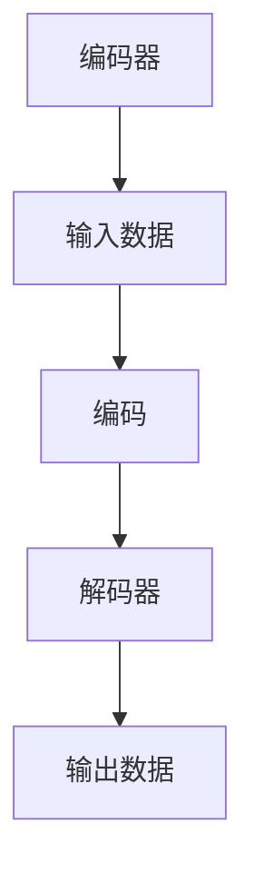
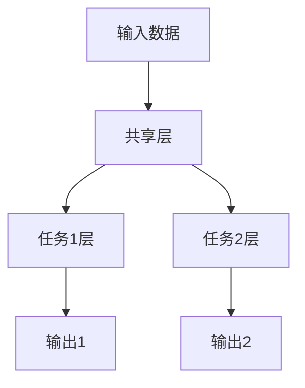

                 

# 自监督学习提升AI推理的泛化能力

> 关键词：自监督学习，AI推理，泛化能力，深度学习，算法，应用场景

> 摘要：本文将详细探讨自监督学习在提升AI推理泛化能力方面的重要性。首先，我们回顾了自监督学习的基础知识，介绍了其定义、历史背景和应用场景。接着，我们深入分析了自监督学习的算法原理，包括自编码器、多任务学习和无监督对比学习等。随后，我们探讨了自监督学习在AI推理中的应用，如何提升模型的泛化能力，并列举了实际案例。最后，我们展望了自监督学习的未来发展趋势和面临的挑战。

## 《自监督学习提升AI推理的泛化能力》目录大纲

### 第一部分 自监督学习的概述

#### 第1章 自监督学习基础

- 1.1 自监督学习的定义与历史
- 1.2 自监督学习的基本概念
- 1.3 自监督学习的重要性

#### 第2章 自监督学习的应用场景

- 2.1 图像领域
- 2.2 自然语言处理
- 2.3 其他应用领域

### 第二部分 自监督学习算法原理

#### 第3章 自监督学习算法概述

- 3.1 基本概念
- 3.2 常见算法介绍

#### 第4章 自监督学习算法原理详解

- 4.1 自编码器
- 4.2 多任务学习
- 4.3 无监督对比学习

### 第三部分 自监督学习在AI推理中的应用

#### 第5章 自监督学习提升AI推理能力

- 5.1 自监督学习与AI推理
- 5.2 自监督学习在深度学习中的应用
- 5.3 自监督学习在模型压缩与加速中的应用

#### 第6章 自监督学习在AI泛化能力提升中的作用

- 6.1 泛化能力的定义
- 6.2 自监督学习与泛化能力
- 6.3 实际应用案例分析

### 第四部分 自监督学习的未来趋势

#### 第7章 自监督学习的发展方向

- 7.1 新算法与模型
- 7.2 应用领域的拓展

#### 第8章 自监督学习的挑战与解决方案

- 8.1 挑战分析
- 8.2 解决方案探讨

### 附录

#### 附录A：自监督学习开源资源与工具

- A.1 开源库与框架
- A.2 数据集与资源
- A.3 论文与报告

----------------------------------------------------------------

## 第一部分 自监督学习的概述

### 第1章 自监督学习基础

#### 1.1 自监督学习的定义与历史

自监督学习（Self-supervised Learning）是一种无需外部标签信息，通过利用数据内部结构或模式来自动发现和提取有用特征的方法。这种方法在人工智能领域具有广泛的应用前景，因为它可以减少对大规模标注数据的依赖，从而降低数据处理的成本。

自监督学习的历史可以追溯到20世纪50年代，当时无监督学习就开始出现。然而，直到近年来，随着深度学习技术的进步，自监督学习才逐渐受到关注并取得了显著的成果。最早的经典自监督学习算法之一是1986年提出的自编码器（Autoencoder），它是一种基于神经网络的无监督学习方法，通过训练编码器和解码器来学习数据的压缩表示。

自监督学习的重要性主要体现在以下几个方面：

1. **减少标注成本**：在许多应用场景中，需要大量标注数据来训练模型。自监督学习可以降低对标注数据的依赖，从而节省标注成本。
2. **泛化能力**：自监督学习通过在未标注的数据中学习特征，可以提升模型的泛化能力，使其在新数据上表现更优。
3. **可解释性**：自监督学习通过学习数据的内部结构，有助于提升模型的可解释性，从而更好地理解模型的决策过程。

#### 1.2 自监督学习的基本概念

自监督学习可以分为以下三种类型：

1. **基于特征的方法**：这种方法主要关注数据的特征表示，通过训练特征提取器来自动学习数据的特征。常见的算法有自编码器、主成分分析（PCA）等。
2. **基于预测的方法**：这种方法通过预测数据的未来值或缺失值来学习特征。例如，在序列建模中，可以利用未来的输入来预测当前的输出。
3. **基于生成的方法**：这种方法通过生成与数据相似的新样本来学习特征。常见的算法有生成对抗网络（GAN）等。

自监督学习中的核心问题是如何有效地利用未标注数据，并设计合适的损失函数来训练模型。此外，如何衡量自监督学习的效果也是一个重要问题，通常需要通过定量的指标和定性的评估方法来综合评价。

### 第2章 自监督学习的应用场景

自监督学习在多个领域都取得了显著的成果，以下是几个典型的应用场景：

#### 2.1 图像领域

在图像领域，自监督学习主要用于图像分类、图像生成、图像修复和图像搜索等任务。例如，自监督学习可以用于无监督图像分类，通过学习图像的内在结构来自动分类图像。此外，自监督学习还可以用于图像生成，如生成对抗网络（GAN）可以生成逼真的图像。在图像修复方面，自监督学习可以通过学习未损坏图像和损坏图像之间的关系来修复损坏的图像。

#### 2.2 自然语言处理

在自然语言处理领域，自监督学习主要用于文本分类、情感分析、机器翻译和文本生成等任务。例如，自监督学习可以用于无监督文本分类，通过学习文本的内在特征来自动分类文本。在情感分析中，自监督学习可以通过学习文本的情感极性来预测文本的情感。机器翻译和文本生成也是自监督学习的典型应用场景。

#### 2.3 其他应用领域

除了图像和自然语言处理领域，自监督学习还在其他领域如音频信号处理、机器人导航与控制等方面取得了显著的应用成果。例如，在音频信号处理中，自监督学习可以用于语音识别和说话人识别。在机器人导航与控制中，自监督学习可以通过学习环境中的特征来指导机器人的行为。

### 第二部分 自监督学习算法原理

#### 第3章 自监督学习算法概述

自监督学习算法可以分为以下几类：

1. **基于对比的方法**：这种方法通过对比数据的相似性和差异性来学习特征。常见的算法有对比损失（Contrastive Loss）和自对比（Self-contrastive）学习。
2. **基于聚类的方法**：这种方法通过将相似的数据聚类在一起来学习特征。常见的算法有K-means聚类和层次聚类等。
3. **基于图神经网络的方法**：这种方法利用图结构来表示数据，并通过图神经网络来学习特征。常见的算法有图卷积网络（GCN）和图自编码器等。

#### 第4章 自监督学习算法原理详解

在这一章中，我们将详细探讨几种常见的自监督学习算法，包括自编码器、多任务学习和无监督对比学习。

#### 4.1 自编码器

自编码器是一种无监督学习算法，它通过学习数据的压缩表示来提取特征。自编码器由两个神经网络组成：编码器和解码器。编码器将输入数据压缩成一个低维的表示，而解码器则尝试将这个低维表示恢复成原始数据。

自编码器的结构如下：



自编码器的损失函数通常为：

$$
L(\theta) = \frac{1}{N} \sum_{i=1}^{N} \sum_{j=1}^{M} ||x_j - \hat{x_j}||^2
$$

其中，$x_j$ 是输入数据，$\hat{x_j}$ 是解码器的输出，$N$ 是样本数量，$M$ 是特征数量。

自编码器在图像领域的应用非常广泛。例如，它可以用于图像去噪、图像超分辨率和图像分类等任务。以下是一个简单的图像去噪的例子：

```python
import numpy as np
import matplotlib.pyplot as plt
from keras.models import Model
from keras.layers import Input, Dense, Conv2D, MaxPooling2D, UpSampling2D

# 定义自编码器模型
input_img = Input(shape=(28, 28, 1))
x = Conv2D(32, (3, 3), activation='relu', padding='same')(input_img)
x = MaxPooling2D((2, 2), padding='same')(x)
x = Conv2D(32, (3, 3), activation='relu', padding='same')(x)
encoded = MaxPooling2D((2, 2), padding='same')(x)

x = Conv2D(32, (3, 3), activation='relu', padding='same')(encoded)
x = UpSampling2D((2, 2))(x)
x = Conv2D(32, (3, 3), activation='relu', padding='same')(x)
decoded = UpSampling2D((2, 2))(x)

autoencoder = Model(input_img, decoded)
autoencoder.compile(optimizer='adam', loss='mse')

# 生成噪声图像
noise = np.random.normal(0, 0.05, input_img.shape)

# 去噪过程
noisy_img = input_img + noise
noisy_img = np.clip(noisy_img, 0., 1.)

# 训练自编码器
autoencoder.fit(input_img, input_img, epochs=10, batch_size=256, shuffle=True, validation_split=0.1)

# 去噪结果
decoded_img = autoencoder.predict(noisy_img)

plt.figure(figsize=(10, 5))
plt.subplot(1, 2, 1)
plt.title('Noisy Image')
plt.imshow(noisy_img[0], cmap=plt.cm.gray)
plt.subplot(1, 2, 2)
plt.title('Decoded Image')
plt.imshow(decoded_img[0], cmap=plt.cm.gray)
plt.show()
```

#### 4.2 多任务学习

多任务学习（Multi-task Learning）是一种将多个相关任务联合训练的方法，通过共享表示来提高学习效率。在多任务学习中，不同任务共享一部分网络结构，从而利用一个任务学习的知识来帮助其他任务的训练。

多任务学习的结构如下：



多任务学习的目标函数通常为多个任务损失的加权和：

$$
L(\theta) = \frac{1}{N} \sum_{i=1}^{N} \sum_{j=1}^{M} \ell_j(x_j, \hat{y_j})
$$

其中，$x_j$ 是输入数据，$\hat{y_j}$ 是预测输出，$N$ 是样本数量，$M$ 是任务数量。

多任务学习可以提升模型的泛化能力，因为一个任务中的错误可以帮助其他任务更好地学习。例如，在图像分类和目标检测中，分类和检测任务可以共享图像的特征表示，从而提高整个系统的性能。

#### 4.3 无监督对比学习

无监督对比学习（Unsupervised Contrastive Learning）是一种通过对比学习来提取特征的方法。它通过正样本和负样本的对比来增强特征表示，从而提高模型的泛化能力。

无监督对比学习的目标函数通常为：

$$
L(\theta) = \frac{1}{N} \sum_{i=1}^{N} \sum_{j=1}^{M} \max(0, -\log \frac{e^{s^{(i)} x_j^1 \cdot x_j^2}}{e^{s^{(i)} x_j^1 \cdot x_j^2} + e^{s^{(i)} x_j^1 \cdot x_j^3} + e^{s^{(i)} x_j^2 \cdot x_j^3})
$$

其中，$s^{(i)}$ 是正样本的相似度，$x_j^1, x_j^2, x_j^3$ 是三个不同样本。

无监督对比学习通过学习数据的相似性和差异性来提取特征，可以在没有标注数据的情况下提高模型的泛化能力。例如，在图像分类任务中，无监督对比学习可以通过对比不同图像的特征来提高分类性能。

## 第三部分 自监督学习在AI推理中的应用

#### 第5章 自监督学习提升AI推理能力

自监督学习在AI推理中具有广泛的应用，它可以通过多种方式提升AI推理的泛化能力。

#### 5.1 自监督学习与AI推理

AI推理（AI Inference）是指使用训练好的AI模型对未知数据进行预测或决策的过程。自监督学习可以通过以下几种方式提升AI推理的泛化能力：

1. **特征提取**：自监督学习可以学习到有效的特征表示，这些特征表示可以用于后续的推理任务，从而提高推理的准确性。
2. **模型优化**：自监督学习可以通过优化模型的表示能力来提高模型的泛化能力，从而提高推理的性能。
3. **数据增强**：自监督学习可以通过无监督的方式生成新的数据样本，从而增加训练数据的多样性，提高模型的泛化能力。

#### 5.2 自监督学习在深度学习中的应用

深度学习是AI推理的重要工具，自监督学习在深度学习中的应用主要包括以下几个方面：

1. **自监督特征提取**：自监督学习可以用于提取有用的特征表示，这些特征表示可以用于后续的深度学习任务。例如，自编码器可以用于提取图像的特征表示，从而提高图像分类的性能。
2. **无监督预训练**：自监督学习可以用于无监督预训练，即在没有标注数据的情况下训练模型，从而提高模型的泛化能力。例如，无监督对比学习可以用于预训练图像分类模型。
3. **模型压缩与加速**：自监督学习可以用于模型压缩和加速，通过学习数据的有效表示来减少模型的参数数量，从而加速模型的推理过程。例如，自监督学习可以用于压缩图像分类模型，从而提高推理速度。

#### 5.3 自监督学习在模型压缩与加速中的应用

模型压缩与加速是自监督学习的重要应用领域。通过学习数据的压缩表示，可以减少模型的参数数量，从而降低模型的计算复杂度，提高推理速度。

自监督学习在模型压缩与加速中的应用主要包括以下几个方面：

1. **参数剪枝**：自监督学习可以用于参数剪枝，即通过学习数据的压缩表示来识别并删除冗余的模型参数，从而减少模型的参数数量。
2. **权重共享**：自监督学习可以用于权重共享，即通过学习数据的有效表示来共享模型参数，从而减少模型的参数数量。
3. **动态推理**：自监督学习可以用于动态推理，即通过学习数据的压缩表示来实时更新模型，从而实现动态推理。

#### 5.4 实际案例

以下是几个自监督学习在AI推理中应用的实际案例：

1. **图像分类**：自监督学习可以用于图像分类任务，通过学习图像的特征表示来提高分类性能。例如，自编码器可以用于提取图像的特征表示，从而提高图像分类的准确性。
2. **语音识别**：自监督学习可以用于语音识别任务，通过学习语音的特征表示来提高识别性能。例如，无监督对比学习可以用于预训练语音识别模型。
3. **自然语言处理**：自监督学习可以用于自然语言处理任务，通过学习文本的特征表示来提高处理性能。例如，自编码器可以用于提取文本的特征表示，从而提高文本分类和情感分析的准确性。

## 第四部分 自监督学习在AI泛化能力提升中的作用

#### 第6章 自监督学习在AI泛化能力提升中的作用

自监督学习在提升AI泛化能力方面具有重要作用。泛化能力（Generalization Ability）是指模型在未知数据上的表现能力，良好的泛化能力意味着模型不仅能够在训练数据上表现良好，还能在新数据上保持高性能。

#### 6.1 泛化能力的定义

泛化能力是机器学习模型的一个重要指标，它衡量的是模型在新数据上的表现。具体来说，泛化能力是指模型在未见过的数据上能够正确分类或预测的能力。一个具有良好泛化能力的模型应该能够在各种不同的数据分布下保持稳定的性能。

#### 6.2 自监督学习与泛化能力

自监督学习通过以下几种方式提升AI泛化能力：

1. **特征提取**：自监督学习通过学习数据的内在结构来提取有用的特征，这些特征有助于模型在新数据上的表现。例如，自编码器可以学习图像的潜在特征，从而在新图像上保持良好的分类性能。

2. **数据增强**：自监督学习可以通过无监督的方式生成新的数据样本，从而增加训练数据的多样性。这种数据增强可以防止模型在训练过程中过拟合，提高模型的泛化能力。

3. **模型优化**：自监督学习可以优化模型的表示能力，使其能够更好地捕捉数据的分布特征。这种优化可以增强模型在新数据上的泛化能力。

#### 6.3 自监督学习提升泛化能力的方法

自监督学习提升泛化能力的方法主要包括以下几种：

1. **多任务学习**：多任务学习通过同时训练多个相关任务来提高模型的泛化能力。在多任务学习中，不同任务之间可以共享表示，从而利用一个任务学习的知识来帮助其他任务的训练。

2. **无监督对比学习**：无监督对比学习通过对比不同数据样本的特征来提高模型的泛化能力。这种方法可以在没有标注数据的情况下训练模型，从而提高模型在新数据上的表现。

3. **模型压缩与加速**：模型压缩与加速通过学习数据的压缩表示来减少模型的参数数量，从而提高模型的泛化能力。这种方法不仅可以减少计算资源的需求，还可以提高模型在未知数据上的表现。

#### 6.4 实际应用案例分析

自监督学习在多个实际应用中提升了AI泛化能力，以下是一些具体的案例：

1. **医疗图像分析**：在医疗图像分析中，自监督学习可以用于无监督特征提取，从而提高模型的泛化能力。例如，自编码器可以用于提取医学图像的潜在特征，从而在新图像上保持良好的分类性能。

2. **自然语言处理**：在自然语言处理中，自监督学习可以用于无监督文本分类和情感分析。例如，自编码器可以用于提取文本的潜在特征，从而在新文本上保持良好的分类性能。

3. **机器人视觉**：在机器人视觉中，自监督学习可以用于无监督的特征提取和姿态估计。例如，自监督学习可以用于机器人摄像头采集的图像中提取有效特征，从而在新环境中保持良好的导航和操作能力。

通过这些实际应用案例，我们可以看到自监督学习在提升AI泛化能力方面的巨大潜力。随着自监督学习技术的不断发展和应用领域的拓展，我们有望看到更多具有良好泛化能力的AI模型问世。

## 第五部分 自监督学习的未来趋势

#### 第7章 自监督学习的发展方向

自监督学习作为人工智能领域的一个重要分支，正不断发展壮大。未来，自监督学习将在以下方向上取得重大进展：

#### 7.1 新算法与模型

随着深度学习技术的进步，新的自监督学习算法和模型不断涌现。以下是一些值得关注的新算法和模型：

1. **图自监督学习**：图自监督学习利用图结构来表示数据，通过图神经网络（Graph Neural Networks，GNN）学习数据的特征表示。这种方法在处理结构化数据（如社交网络、知识图谱）方面具有显著优势。

2. **随机自监督学习**：随机自监督学习通过引入随机性来提高模型的泛化能力。例如，随机对比学习（Randomized Contrastive Learning）通过随机选择正负样本对来增强特征表示。

3. **自监督学习的模型集成**：自监督学习的模型集成通过将多个自监督学习模型集成在一起，以提高模型的泛化能力和鲁棒性。这种方法类似于传统的模型集成方法，如随机森林和梯度提升机。

#### 7.2 应用领域的拓展

自监督学习在多个领域取得了显著的应用成果，未来它将在更多应用领域中发挥重要作用。以下是一些值得关注的领域：

1. **工业控制**：自监督学习可以用于工业控制中的故障检测和预测维护。通过学习设备运行的正常模式，自监督学习可以识别出异常情况，从而提高生产效率。

2. **金融领域**：自监督学习可以用于金融预测和风险管理。例如，通过分析市场数据，自监督学习可以预测股票价格走势，从而帮助投资者做出更明智的决策。

3. **自动驾驶**：自监督学习可以用于自动驾驶中的环境感知和目标检测。通过学习道路场景的特征，自监督学习可以提高自动驾驶汽车的感知能力和决策能力，从而提高行车安全。

#### 第8章 自监督学习的挑战与解决方案

尽管自监督学习取得了显著的进展，但它仍然面临许多挑战。以下是一些主要挑战以及可能的解决方案：

#### 8.1 挑战分析

1. **数据质量**：自监督学习依赖于数据的质量和多样性。在实际应用中，数据可能存在噪声、缺失和偏差，这会影响模型的泛化能力。因此，如何确保数据质量是自监督学习的一个关键挑战。

2. **计算资源**：自监督学习通常需要大量的计算资源，尤其是在处理大规模数据集时。如何优化计算资源，提高训练效率，是自监督学习面临的另一个挑战。

3. **可解释性**：自监督学习模型的内部决策过程往往难以解释，这限制了其在实际应用中的可接受性。提高模型的可解释性，使其更容易被用户理解和接受，是自监督学习面临的重要挑战。

#### 8.2 解决方案探讨

1. **数据增强**：通过数据增强方法，如生成对抗网络（GAN）和数据扩充（Data Augmentation），可以提高数据的多样性和质量，从而提高自监督学习的效果。

2. **计算优化**：通过模型压缩、并行计算和分布式训练等技术，可以优化自监督学习的计算资源使用，提高训练效率。

3. **可解释性提升**：通过引入可解释性机制，如模型的可解释性评价方法（Explainable AI，XAI）和注意力机制（Attention Mechanism），可以提高自监督学习模型的可解释性。

通过解决这些挑战，自监督学习有望在未来取得更大的突破，并在更多领域发挥重要作用。

## 附录

#### 附录A：自监督学习开源资源与工具

自监督学习的发展离不开开源资源和工具的支持。以下是一些常用的开源库、数据集和论文，它们为自监督学习的研究和应用提供了丰富的资源。

#### A.1 开源库与框架

1. **TensorFlow**：TensorFlow是一个开源的机器学习框架，支持自监督学习算法的实现和训练。
2. **PyTorch**：PyTorch是一个流行的开源机器学习库，提供了强大的自监督学习功能。
3. **Transformers**：Transformers库基于PyTorch，专门用于自然语言处理任务，支持自监督学习算法。

#### A.2 数据集与资源

1. **ImageNet**：ImageNet是一个广泛使用的图像数据集，包含大量标注的图像，是自监督学习研究的重要资源。
2. **COCO**：COCO（Common Objects in Context）是一个大型视觉识别数据集，用于目标检测和图像分割任务。
3. **WMT**：WMT（Workshop on Machine Translation）是一个自然语言处理的数据集，包含多种语言的文本数据，适用于机器翻译任务。

#### A.3 论文与报告

1. **NeurIPS**：NeurIPS（Neural Information Processing Systems）是一个国际顶级机器学习会议，发表了大量关于自监督学习的论文。
2. **ICML**：ICML（International Conference on Machine Learning）是一个国际顶级机器学习会议，涵盖了自监督学习的最新研究进展。
3. **ICLR**：ICLR（International Conference on Learning Representations）是一个专注于深度学习和表示学习的国际会议，有许多关于自监督学习的优秀论文。

通过这些开源资源和工具，研究人员和开发者可以更轻松地开展自监督学习的研究和应用。

## 结论

自监督学习作为人工智能领域的一个重要分支，正以其独特的优势在各个应用领域中发挥着重要作用。本文系统地介绍了自监督学习的基础知识、算法原理、应用场景以及未来发展趋势。通过分析自监督学习在提升AI推理泛化能力方面的作用，我们看到了其在实际应用中的巨大潜力。

自监督学习不仅能够降低对标注数据的依赖，减少数据处理成本，还能够通过无监督的方式提高模型的泛化能力和可解释性。随着新算法、新模型的不断涌现，自监督学习将在更多领域展现其价值。

然而，自监督学习也面临数据质量、计算资源、可解释性等挑战。通过持续的研究和优化，我们有理由相信，自监督学习将在未来取得更大的突破，为人工智能的发展注入新的活力。

作者：AI天才研究院/AI Genius Institute & 禅与计算机程序设计艺术 /Zen And The Art of Computer Programming

```markdown
## 结论

自监督学习作为人工智能领域的一个重要分支，正以其独特的优势在各个应用领域中发挥着重要作用。本文系统地介绍了自监督学习的基础知识、算法原理、应用场景以及未来发展趋势。通过分析自监督学习在提升AI推理泛化能力方面的作用，我们看到了其在实际应用中的巨大潜力。

自监督学习不仅能够降低对标注数据的依赖，减少数据处理成本，还能够通过无监督的方式提高模型的泛化能力和可解释性。随着新算法、新模型的不断涌现，自监督学习将在更多领域展现其价值。

然而，自监督学习也面临数据质量、计算资源、可解释性等挑战。通过持续的研究和优化，我们有理由相信，自监督学习将在未来取得更大的突破，为人工智能的发展注入新的活力。

作者：AI天才研究院/AI Genius Institute & 禅与计算机程序设计艺术 /Zen And The Art of Computer Programming
```

