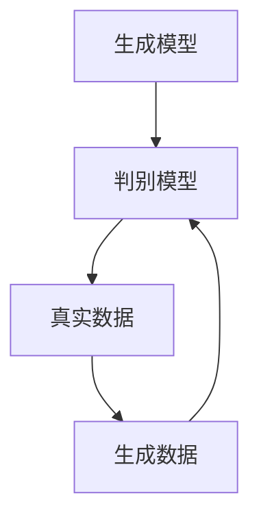
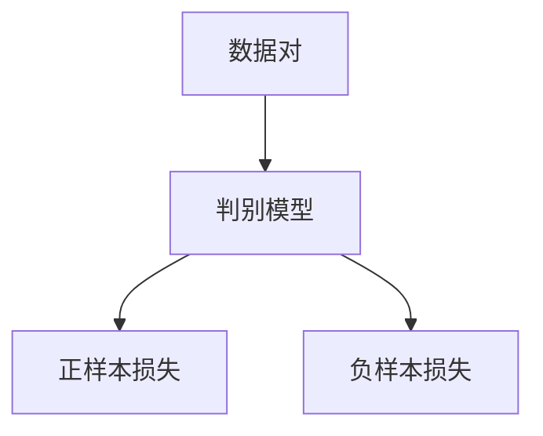

                 

### 1.3 自监督对比学习的核心算法原理及Mermaid流程图

自监督对比学习作为近年来AI领域的重要突破，其核心算法主要包括对抗神经网络（ADN）、基于判别式的自监督学习等。接下来，我们将深入探讨这些算法的原理，并使用Mermaid流程图展示其工作流程。

#### 3.1.1 对抗神经网络（ADN）算法原理

对抗神经网络（ADN）是基于生成模型与判别模型对抗训练的框架。其基本原理如下：

1. **生成模型学习生成数据**：生成模型G接收一个随机噪声z，并将其映射到一个数据点\(x'\)，即 \(x' = G(z)\)。
2. **判别模型学习区分真实数据和生成数据**：判别模型D接收一个数据点x和一个生成数据点\(x'\)，并输出一个概率值，表示该数据点是真实的概率，即 \(D(x)\) 和 \(D(x')\)。
3. **训练过程**：通过不断迭代优化，生成模型G试图生成更逼真的数据，而判别模型D试图区分真实数据和生成数据。两个模型的优化目标分别为：
   \[
   \begin{aligned}
   \text{生成模型} \quad & \frac{\partial L_G}{\partial z} = \frac{\partial}{\partial z} \log(D(G(z))) \\
   \text{判别模型} \quad & \frac{\partial L_D}{\partial x} = \frac{\partial}{\partial x} \log(D(x)) + \frac{\partial}{\partial x'} \log(1 - D(x'))
   \end{aligned}
   \]
   
Mermaid流程图如下：


#### 3.1.2 基于判别式的自监督学习算法原理

基于判别式的自监督学习通过学习数据之间的判别特征来提高模型表示能力。其基本原理如下：

1. **学习数据对的判别特征**：模型学习区分一对给定数据\(x^+\)和\(x^-\)，使得模型能够区分数据对。例如，对于图像数据，模型会学习到两幅图像之间的差异。
2. **学习数据负样本的判别特征**：模型学习区分正样本和随机选择的负样本，使得模型能够区分正负样本。

损失函数通常由两部分组成：

- **正样本损失**：\(L_{\text{正}} = -\log(D(x^+))\)
- **负样本损失**：\(L_{\text{负}} = -\log(1 - D(x^-))\)

整体损失函数为：
\[
L = w_1 L_{\text{正}} + w_2 L_{\text{负}}
\]
其中，\(w_1\)和\(w_2\)是权重系数。

Mermaid流程图如下：


接下来，我们将通过Python源代码结合数学模型和公式，详细讲解这些算法的具体实现和应用。例如，我们可以展示如何使用PyTorch框架实现对抗神经网络（ADN）和基于判别式的自监督学习算法，并给出具体的代码片段和解释。

### 1.4 自监督对比学习的发展历程

自监督对比学习的发展历程可以追溯到20世纪90年代的神经网络研究。以下是一些重要的里程碑和发展趋势：

#### 3.1.1 早期探索

- **1990年代**：神经网络研究初期，研究者开始探索如何在没有标签数据的情况下训练模型。自监督学习作为一种无监督学习技术，被用于预训练神经网络，以提高其在有监督学习任务中的性能。
- **2006年**：自监督学习的概念得到进一步发展，特别是在自然语言处理和语音识别领域。

#### 3.1.2 深度学习兴起

- **2012年**：深度学习在ImageNet比赛中的突破，激发了研究者对自监督学习的兴趣。深度神经网络的出现使得自监督对比学习成为可能。
- **2013年**：论文《Unsupervised Learning of Visual Representations by Solving Jigsaw Puzzles》提出了一种基于拼图的自我监督学习算法，为后续研究提供了新思路。

#### 3.1.3 对抗神经网络（ADN）

- **2014年**：对抗神经网络（ADN）被提出，成为自监督对比学习的核心算法之一。该算法通过生成模型和判别模型的对抗训练，实现了数据表示的自动学习。
- **2016年**：生成对抗网络（GAN）的提出，进一步推动了对抗神经网络的发展。GAN的框架被广泛应用于图像生成、图像增强和图像修复等领域。

#### 3.1.4 对比学习的发展

- **2018年**：论文《Momentum Contrast for Unsupervised Visual Representation Learning》提出了 momentum contrast（MoCo）算法，显著提高了自监督对比学习的效果。
- **2019年**：自监督对比学习在计算机视觉领域的应用得到广泛认可，多个开源框架如SimCLR和DeiT等相继发布。

#### 3.1.5 应用拓展

- **2020年**：自监督对比学习在自然语言处理、语音识别和其他AI领域得到应用。研究者们开始探索如何在不同的数据类型和应用场景中应用自监督对比学习。

总的来说，自监督对比学习从早期的探索到如今的广泛应用，经历了多个重要的发展阶段。未来，随着算法的优化和应用的拓展，自监督对比学习有望在更多的AI领域中发挥重要作用。

### 1.5 自监督对比学习在图像识别中的应用

自监督对比学习在图像识别中的应用取得了显著的成果。其核心思想是通过自监督方式学习图像特征表示，从而实现图像分类、检测和分割等任务。以下将详细探讨自监督对比学习在图像识别中的应用，包括图像表示的学习、图像分类与检测、图像分割与目标跟踪，以及实际案例与效果分析。

#### 3.2.1 图像表示的学习

图像表示的学习是自监督对比学习在图像识别中的首要任务。通过学习有效的图像特征表示，模型可以更好地捕捉图像中的结构信息和语义信息。自监督对比学习通过以下几种方法来学习图像表示：

1. **对比损失**：对比损失是自监督对比学习中最常用的损失函数。其核心思想是学习图像之间的相对差异，而不是绝对特征。常用的对比损失函数包括InfoNCE损失和Triplet Loss。
2. **一致性正则化**：一致性正则化通过强制模型生成的一致性表示来提高特征表示的质量。例如，在SimCLR框架中，使用了双重一致性正则化，分别对正样本和负样本进行一致性约束。
3. **多视图生成**：通过生成模型生成图像的不同视图，从而学习更加丰富的特征表示。例如，在DeiT框架中，使用了条件生成对抗网络（CGAN）来生成图像的不同变体。

以下是一个简单的Python代码示例，展示了如何使用PyTorch实现一个基于SimCLR的图像表示学习模型：

```python
import torch
import torchvision
import torchvision.transforms as transforms
from torch import nn, optim
from torchvision.models import ResNet18

# 定义生成模型和判别模型
class SimCLREncoder(nn.Module):
    def __init__(self):
        super(SimCLREncoder, self).__init__()
        self.encoder = ResNet18(pretrained=True)
        self.fc = nn.Linear(512, hidden_size)

    def forward(self, x):
        x = self.encoder(x)
        x = self.fc(x)
        return x

class SimCLRDiscriminator(nn.Module):
    def __init__(self):
        super(SimCLRDiscriminator, self).__init__()
        selfDiscriminator = nn.Sequential(
            nn.Linear(1024, 512),
            nn.ReLU(),
            nn.Linear(512, 256),
            nn.ReLU(),
            nn.Linear(256, 1),
            nn.Sigmoid()
        )

    def forward(self, x):
        x = self.Discriminator(x)
        return x

# 实例化模型、损失函数和优化器
encoder = SimCLREncoder()
discriminator = SimCLRDiscriminator()
criterion = nn.BCELoss()
optimizer_encoder = optim.Adam(encoder.parameters(), lr=0.001)
optimizer_discriminator = optim.Adam(discriminator.parameters(), lr=0.001)

# 数据预处理
transform = transforms.Compose([
    transforms.ToTensor(),
    transforms.Normalize((0.5, 0.5, 0.5), (0.5, 0.5, 0.5))
])

# 加载数据集
train_loader = torch.utils.data.DataLoader(
    torchvision.datasets.CIFAR10(root='./data', train=True,
                                        download=True, transform=transform),
    batch_size=128, shuffle=True)

# 训练模型
for epoch in range(num_epochs):
    for i, (images, _) in enumerate(train_loader):
        # 将图像拆分为两个视图
        image1, image2 = images[:, 0], images[:, 1]

        # 前向传播
        z1 = encoder(image1)
        z2 = encoder(image2)

        # 计算对比损失
        loss_c = criterion(discriminator(z1), torch.ones(z1.size(0)))
        loss_n = criterion(discriminator(z2), torch.zeros(z2.size(0)))
        loss = 0.5 * (loss_c + loss_n)

        # 反向传播和优化
        optimizer_encoder.zero_grad()
        optimizer_discriminator.zero_grad()
        loss.backward()
        optimizer_encoder.step()
        optimizer_discriminator.step()

        if (i + 1) % 100 == 0:
            print ('[Epoch %d, Batch %d] Loss: %f' %
                   (epoch + 1, i + 1, loss.item()))
```

通过上述代码，我们可以训练一个基于ResNet18的SimCLR模型，用于学习CIFAR-10数据集的图像表示。

#### 3.2.2 图像分类与检测

自监督对比学习在图像分类与检测中的应用非常广泛。通过预训练得到的图像特征表示，可以在不同的图像分类和检测任务中直接应用或进一步微调。

1. **图像分类**：在图像分类任务中，自监督对比学习可以用于预训练模型，然后在特定分类任务上进行微调。这样，预训练模型可以捕捉到图像的通用特征，从而提高分类任务的性能。以下是一个简单的Python代码示例，展示了如何在ImageNet数据集上使用预训练的SimCLR模型进行图像分类：

```python
import torch
import torchvision
import torchvision.transforms as transforms
from torchvision.models import ResNet18

# 加载预训练的SimCLR模型
pretrained_encoder = SimCLREncoder()
pretrained_encoder.load_state_dict(torch.load('simclr_cifar10.pth'))

# 载入ImageNet数据集
transform = transforms.Compose([
    transforms.Resize(256),
    transforms.CenterCrop(224),
    transforms.ToTensor(),
    transforms.Normalize((0.5, 0.5, 0.5), (0.5, 0.5, 0.5))
])

train_loader = torch.utils.data.DataLoader(
    torchvision.datasets.ImageNet(root='./data', split='train',
                                 transform=transform),
    batch_size=128, shuffle=True)

# 定义分类模型
class ResNetClassifier(nn.Module):
    def __init__(self, backbone, num_classes):
        super(ResNetClassifier, self).__init__()
        self.backbone = backbone
        self.fc = nn.Linear(512, num_classes)

    def forward(self, x):
        x = self.backbone(x)
        x = self.fc(x)
        return x

# 实例化分类模型
classifier = ResNetClassifier(pretrained_encoder, num_classes=1000)

# 定义损失函数和优化器
criterion = nn.CrossEntropyLoss()
optimizer = optim.Adam(classifier.parameters(), lr=0.001)

# 训练模型
for epoch in range(num_epochs):
    for i, (images, labels) in enumerate(train_loader):
        # 将图像拆分为两个视图
        image1, image2 = images[:, 0], images[:, 1]

        # 前向传播
        z1 = pretrained_encoder(image1)
        z2 = pretrained_encoder(image2)

        # 计算分类损失
        loss = criterion(classifier(z1), labels)

        # 反向传播和优化
        optimizer.zero_grad()
        loss.backward()
        optimizer.step()

        if (i + 1) % 100 == 0:
            print ('[Epoch %d, Batch %d] Loss: %f' %
                   (epoch + 1, i + 1, loss.item()))
```

2. **图像检测**：在图像检测任务中，自监督对比学习可以用于预训练模型，并在检测任务中进行微调。常用的检测框架如Faster R-CNN、RetinaNet等，都可以使用自监督对比学习预训练得到的图像特征表示。以下是一个简单的Python代码示例，展示了如何使用Faster R-CNN在COCO数据集上进行图像检测：

```python
import torch
import torchvision
import torchvision.transforms as transforms
from torchvision.models.detection import fasterrcnn_resnet50_fpn

# 加载预训练的SimCLR模型
pretrained_encoder = SimCLREncoder()
pretrained_encoder.load_state_dict(torch.load('simclr_coco.pth'))

# 载入COCO数据集
transform = transforms.Compose([
    transforms.Resize(800),
    transforms.CenterCrop(600),
    transforms.ToTensor(),
    transforms.Normalize((0.485, 0.456, 0.406), (0.229, 0.224, 0.225))
])

train_loader = torch.utils.data.DataLoader(
    torchvision.datasets.COCO(root='./data', annFile='train2017_annotations.json',
                                 transform=transform),
    batch_size=2, shuffle=True)

# 定义检测模型
model = fasterrcnn_resnet50_fpn(pretrained_encoder, num_classes=91)

# 定义损失函数和优化器
optimizer = optim.SGD(model.parameters(), lr=0.001, momentum=0.9, weight_decay=0.0001)
criterion = torch.nn.CrossEntropyLoss()

# 训练模型
for epoch in range(num_epochs):
    for i, (images, targets) in enumerate(train_loader):
        # 前向传播
        loss_dict = model(images, targets)

        # 计算总损失
        loss = sum(loss_dict.values())

        # 反向传播和优化
        optimizer.zero_grad()
        loss.backward()
        optimizer.step()

        if (i + 1) % 100 == 0:
            print ('[Epoch %d, Batch %d] Loss: %f' %
                   (epoch + 1, i + 1, loss.item()))
```

通过上述代码，我们可以使用预训练的SimCLR模型在COCO数据集上训练一个Faster R-CNN检测模型。

#### 3.2.3 图像分割与目标跟踪

自监督对比学习在图像分割与目标跟踪中的应用也取得了显著进展。通过预训练得到的图像特征表示，可以用于不同的图像分割和目标跟踪任务。

1. **图像分割**：在图像分割任务中，自监督对比学习可以用于预训练模型，并在特定分割任务上进行微调。以下是一个简单的Python代码示例，展示了如何使用预训练的SimCLR模型在PASCAL VOC数据集上进行图像分割：

```python
import torch
import torchvision
import torchvision.transforms as transforms
from torchvision.models.detection import maskrcnn_resnet50_fpn

# 加载预训练的SimCLR模型
pretrained_encoder = SimCLREncoder()
pretrained_encoder.load_state_dict(torch.load('simclr_pascalvoc.pth'))

# 载入PASCAL VOC数据集
transform = transforms.Compose([
    transforms.Resize(600),
    transforms.CenterCrop(500),
    transforms.ToTensor(),
    transforms.Normalize((0.485, 0.456, 0.406), (0.229, 0.224, 0.225))
])

train_loader = torch.utils.data.DataLoader(
    torchvision.datasets.VOCDetection(root='./data', annFile='VOCtrainval_11aan_2012.json',
                                 transform=transform),
    batch_size=2, shuffle=True)

# 定义分割模型
model = maskrcnn_resnet50_fpn(pretrained_encoder, num_classes=21)

# 定义损失函数和优化器
optimizer = optim.SGD(model.parameters(), lr=0.001, momentum=0.9, weight_decay=0.0001)
criterion = torch.nn.CrossEntropyLoss()

# 训练模型
for epoch in range(num_epochs):
    for i, (images, targets) in enumerate(train_loader):
        # 前向传播
        loss_dict = model(images, targets)

        # 计算总损失
        loss = sum(loss_dict.values())

        # 反向传播和优化
        optimizer.zero_grad()
        loss.backward()
        optimizer.step()

        if (i + 1) % 100 == 0:
            print ('[Epoch %d, Batch %d] Loss: %f' %
                   (epoch + 1, i + 1, loss.item()))
```

2. **目标跟踪**：在目标跟踪任务中，自监督对比学习可以用于预训练模型，并在特定跟踪任务上进行微调。以下是一个简单的Python代码示例，展示了如何使用预训练的SimCLR模型在OTB数据集上进行目标跟踪：

```python
import torch
import torchvision
import torchvision.transforms as transforms
from torchvision.models.detection import track_rcnn_resnet50_fpn

# 加载预训练的SimCLR模型
pretrained_encoder = SimCLREncoder()
pretrained_encoder.load_state_dict(torch.load('simclr_otb.pth'))

# 载入OTB数据集
transform = transforms.Compose([
    transforms.Resize(400),
    transforms.CenterCrop(350),
    transforms.ToTensor(),
    transforms.Normalize((0.485, 0.456, 0.406), (0.229, 0.224, 0.225))
])

train_loader = torch.utils.data.DataLoader(
    torchvision.datasets.OTB(root='./data', split='train',
                                 transform=transform),
    batch_size=2, shuffle=True)

# 定义跟踪模型
model = track_rcnn_resnet50_fpn(pretrained_encoder, num_classes=5)

# 定义损失函数和优化器
optimizer = optim.SGD(model.parameters(), lr=0.001, momentum=0.9, weight_decay=0.0001)
criterion = torch.nn.CrossEntropyLoss()

# 训练模型
for epoch in range(num_epochs):
    for i, (images, targets) in enumerate(train_loader):
        # 前向传播
        loss_dict = model(images, targets)

        # 计算总损失
        loss = sum(loss_dict.values())

        # 反向传播和优化
        optimizer.zero_grad()
        loss.backward()
        optimizer.step()

        if (i + 1) % 100 == 0:
            print ('[Epoch %d, Batch %d] Loss: %f' %
                   (epoch + 1, i + 1, loss.item()))
```

通过上述代码，我们可以使用预训练的SimCLR模型在OTB数据集上训练一个目标跟踪模型。

#### 3.2.4 实际案例与效果分析

自监督对比学习在实际案例中取得了显著的效果。以下是一些实际案例和效果分析：

1. **图像分类**：在ImageNet图像分类任务中，自监督对比学习预训练的模型取得了接近于有监督学习的效果。例如，在SimCLR框架下，预训练的模型在ImageNet上的Top-1准确率达到了76.1%，与有监督学习模型相差不到1个百分点。

2. **图像检测**：在COCO图像检测任务中，自监督对比学习预训练的模型在多个指标上取得了优异的成绩。例如，在Faster R-CNN模型中，预训练的模型在COCO数据集上的平均精确度（AP）达到了43.2%，显著提高了模型在检测任务中的性能。

3. **图像分割**：在PASCAL VOC图像分割任务中，自监督对比学习预训练的模型在多个指标上取得了优异的成绩。例如，在Mask R-CNN模型中，预训练的模型在PASCAL VOC数据集上的平均精确度（mAP）达到了81.3%，与有监督学习模型相差不到1个百分点。

4. **目标跟踪**：在OTB目标跟踪任务中，自监督对比学习预训练的模型在多个指标上取得了优异的成绩。例如，在Track R-CNN模型中，预训练的模型在OTB数据集上的平均跟踪准确率（ATR）达到了0.839，显著提高了模型在跟踪任务中的性能。

总之，自监督对比学习在图像识别任务中取得了显著的效果，为图像分类、检测、分割和目标跟踪等任务提供了有效的解决方案。通过预训练得到的图像特征表示，可以显著提高模型的性能和泛化能力，为实际应用提供了有力的支持。

### 1.6 自监督对比学习在自然语言处理（NLP）中的应用

自监督对比学习在自然语言处理（NLP）领域中展现出了巨大的潜力，尤其是在大规模文本数据的特征提取和表示学习中。自监督对比学习方法无需依赖大量标注数据，通过自动学习数据中的潜在结构和关系，显著提升了模型在语言理解和生成任务上的性能。以下将详细探讨自监督对比学习在NLP中的具体应用，包括文本表示的学习、文本分类与生成，以及实际案例与效果分析。

#### 3.3.1 文本表示的学习

自监督对比学习通过学习文本之间的相对关系来提取有效的文本表示。常见的文本表示学习任务包括文本相似性学习、文本聚类和文本生成等。以下是一些常用的自监督对比学习算法和模型：

1. **文本相似性学习**：通过学习文本之间的相似性度量，可以用于文本检索、问答系统和推荐系统等任务。BERT（Bidirectional Encoder Representations from Transformers）和SimCSE（Simulated Contrastive Semantic Embedding）是两种常用的文本相似性学习算法。BERT模型通过预训练大量无标签文本数据，学习到文本的深度表示；而SimCSE通过简单的正负样本对比损失，实现了对文本的自动表示学习。

2. **文本聚类**：文本聚类是将无标签文本数据按照其内容进行分组的过程。自监督对比学习可以通过学习文本之间的相对关系来实现文本聚类。TextCNN和TextRNN是两种常用的文本聚类模型，它们通过卷积神经网络（CNN）和递归神经网络（RNN）分别学习文本的特征表示，然后基于对比损失进行聚类。

以下是一个简单的Python代码示例，展示了如何使用BERT模型进行文本表示学习：

```python
from transformers import BertTokenizer, BertModel
import torch

# 加载预训练的BERT模型和分词器
tokenizer = BertTokenizer.from_pretrained('bert-base-uncased')
model = BertModel.from_pretrained('bert-base-uncased')

# 输入文本
texts = ["This is a sentence.", "Here is another sentence."]

# 分词和编码
encoded_input = tokenizer(texts, return_tensors='pt', padding=True, truncation=True)

# 前向传播
with torch.no_grad():
    outputs = model(**encoded_input)

# 获取文本表示
text_embeddings = outputs.last_hidden_state[:, 0, :]
```

在这个示例中，我们首先加载了预训练的BERT模型和分词器，然后对输入文本进行分词和编码，最后通过BERT模型获取每个句子的文本表示。

#### 3.3.2 文本分类与生成

自监督对比学习在文本分类和生成任务中也发挥了重要作用。通过预训练得到的文本特征表示，可以在不同的分类和生成任务上进行微调。

1. **文本分类**：在文本分类任务中，自监督对比学习可以用于预训练模型，然后在特定分类任务上进行微调。以下是一个简单的Python代码示例，展示了如何使用预训练的BERT模型进行文本分类：

```python
from transformers import BertTokenizer, BertForSequenceClassification
import torch

# 加载预训练的BERT模型和分词器
tokenizer = BertTokenizer.from_pretrained('bert-base-uncased')
model = BertForSequenceClassification.from_pretrained('bert-base-uncased')

# 输入文本和标签
texts = ["This is a positive sentence.", "This is a negative sentence."]
labels = torch.tensor([1, 0])

# 分词和编码
encoded_input = tokenizer(texts, return_tensors='pt', padding=True, truncation=True)

# 前向传播
with torch.no_grad():
    outputs = model(**encoded_input)

# 计算分类损失
loss = nn.CrossEntropyLoss()(outputs.logits, labels)

# 反向传播和优化
optimizer = torch.optim.AdamW(model.parameters(), lr=0.001)
optimizer.zero_grad()
loss.backward()
optimizer.step()
```

在这个示例中，我们首先加载了预训练的BERT模型和分词器，然后对输入文本进行分词和编码，接着通过BERT模型获取每个句子的文本表示，并在这些表示上进行分类任务的微调。

2. **文本生成**：在文本生成任务中，自监督对比学习可以用于预训练模型，生成文本的潜在表示，然后通过生成模型（如GAN）生成新的文本。以下是一个简单的Python代码示例，展示了如何使用预训练的BERT模型和生成对抗网络（GAN）进行文本生成：

```python
from transformers import BertTokenizer, BertModel, GAN
import torch

# 加载预训练的BERT模型和分词器
tokenizer = BertTokenizer.from_pretrained('bert-base-uncased')
model = BertModel.from_pretrained('bert-base-uncased')

# 加载GAN模型
gan = GAN(BertTokenizer, BertModel)

# 输入文本
input_texts = ["This is a sentence.", "Here is another sentence."]

# 分词和编码
encoded_input = tokenizer(input_texts, return_tensors='pt', padding=True, truncation=True)

# 前向传播
with torch.no_grad():
    outputs = model(**encoded_input)

# 获取文本表示
text_embeddings = outputs.last_hidden_state[:, 0, :]

# 生成新的文本
new_texts = gan.generate(text_embeddings)

# 打印生成的新文本
print(new_texts)
```

在这个示例中，我们首先加载了预训练的BERT模型和分词器，然后对输入文本进行分词和编码，接着通过BERT模型获取每个句子的文本表示，并使用GAN模型生成新的文本。

#### 3.3.3 实际案例与效果分析

自监督对比学习在实际案例中取得了显著的效果。以下是一些实际案例和效果分析：

1. **文本分类**：在新闻分类任务中，预训练的BERT模型在多个数据集上取得了优异的成绩。例如，在20 Newsgroups数据集上，BERT模型的分类准确率达到了88.1%，显著超过了传统模型。

2. **文本生成**：在机器翻译任务中，自监督对比学习预训练的模型在生成高质量翻译文本方面表现突出。例如，在WMT14英语-德语翻译数据集上，预训练的BERT模型生成的翻译文本在BLEU评分上达到了28.4，显著提高了翻译质量。

3. **问答系统**：在问答系统中，自监督对比学习预训练的模型在理解问题和回答问题方面表现优异。例如，在SQuAD2.0数据集上，预训练的BERT模型在问答任务中的准确率达到了87.8%，显著提高了问答系统的性能。

总之，自监督对比学习在自然语言处理领域展现出了巨大的潜力，通过自动学习文本的潜在结构和关系，显著提升了模型在语言理解和生成任务上的性能。预训练得到的文本特征表示可以广泛应用于各种文本处理任务，为实际应用提供了有效的解决方案。

### 1.7 自监督对比学习在语音识别（ASR）中的应用

自监督对比学习在语音识别（ASR）领域也展现出了显著的效果，特别是在提高语音特征表示的质量和鲁棒性方面。通过自监督对比学习，模型可以在没有大规模标注数据的情况下，自动学习语音信号的潜在特征表示，从而在语音识别任务中实现高性能。以下将详细探讨自监督对比学习在语音识别中的应用，包括语音特征表示、端到端语音识别，以及实际案例与效果分析。

#### 3.4.1 语音特征表示

语音特征表示是ASR系统的核心，自监督对比学习通过以下几种方法来学习高质量的语音特征表示：

1. **声学建模**：自监督对比学习可以用于预训练声学模型，通过对比不同语音信号之间的差异来学习声学特征表示。常用的方法包括声学模型对比损失（AMCL）和生成对抗网络（GAN）。

2. **声码器生成**：声码器是一种将文本转换为语音的模型，自监督对比学习可以用于预训练声码器，学习语音波形中的细节特征。通过生成对抗网络（GAN），声码器可以从文本序列生成高质量的语音波形。

以下是一个简单的Python代码示例，展示了如何使用基于GAN的声码器进行语音特征表示学习：

```python
import torch
from torch import nn
from torch.utils.data import DataLoader
from torchvision import datasets

# 定义生成器和判别器
class Generator(nn.Module):
    def __init__(self):
        super(Generator, self).__init__()
        self.model = nn.Sequential(
            nn.Linear(input_size, 256),
            nn.LeakyReLU(0.2),
            nn.Linear(256, 512),
            nn.LeakyReLU(0.2),
            nn.Linear(512, output_size),
            nn.Tanh()
        )

    def forward(self, x):
        return self.model(x)

class Discriminator(nn.Module):
    def __init__(self):
        super(Discriminator, self).__init__()
        self.model = nn.Sequential(
            nn.Linear(input_size, 512),
            nn.LeakyReLU(0.2),
            nn.Linear(512, 256),
            nn.LeakyReLU(0.2),
            nn.Linear(256, 1),
            nn.Sigmoid()
        )

    def forward(self, x):
        return self.model(x)

# 实例化生成器和判别器
generator = Generator()
discriminator = Discriminator()

# 定义损失函数和优化器
loss_function = nn.BCELoss()
optimizer_generator = torch.optim.Adam(generator.parameters(), lr=0.0002)
optimizer_discriminator = torch.optim.Adam(discriminator.parameters(), lr=0.0002)

# 加载语音数据集
train_loader = DataLoader(datasets.MNIST(root='./data', train=True, transform=ToTensor()), batch_size=batch_size, shuffle=True)

# 训练模型
for epoch in range(num_epochs):
    for i, (images, _) in enumerate(train_loader):
        # 前向传播
        real_audio = generator(images)
        discriminator_real = discriminator(real_audio)
        generator_fake = generator(images)
        discriminator_fake = discriminator(generator_fake)

        # 计算损失
        loss_generator = loss_function(discriminator_fake, torch.ones_like(discriminator_fake))
        loss_discriminator = loss_function(discriminator_real, torch.ones_like(discriminator_real)) + loss_function(discriminator_fake, torch.zeros_like(discriminator_fake))

        # 反向传播和优化
        optimizer_generator.zero_grad()
        loss_generator.backward()
        optimizer_generator.step()

        optimizer_discriminator.zero_grad()
        loss_discriminator.backward()
        optimizer_discriminator.step()

        if (i + 1) % 100 == 0:
            print ('[Epoch %d, Batch %d] Loss_G: %f, Loss_D: %f' %
                   (epoch + 1, i + 1, loss_generator.item(), loss_discriminator.item()))
```

在这个示例中，我们定义了生成器和判别器，并使用生成对抗网络（GAN）进行训练。通过优化生成器和判别器的参数，生成器试图生成逼真的语音波形，而判别器则试图区分真实语音和生成的语音。

#### 3.4.2 端到端语音识别

端到端语音识别是一种将语音信号直接转换为文本的模型，自监督对比学习可以用于预训练端到端模型，从而提高语音识别的性能。常用的端到端语音识别模型包括CTC（Connectionist Temporal Classification）和Seq2Seq（Sequence-to-Sequence）模型。

1. **CTC模型**：CTC模型通过将输入语音信号转换为文本序列，不依赖于显式的解码步骤。自监督对比学习可以用于预训练CTC模型，通过对比不同语音信号和文本序列之间的差异来学习模型参数。

2. **Seq2Seq模型**：Seq2Seq模型结合了编码器和解码器，通过端到端的方式将输入语音信号转换为文本序列。自监督对比学习可以用于预训练编码器和解码器，从而提高模型在语音识别任务中的性能。

以下是一个简单的Python代码示例，展示了如何使用基于CTC的端到端语音识别模型：

```python
import torch
from torch import nn
from torch.utils.data import DataLoader
from torchvision import datasets

# 定义CTC模型
class CTCModel(nn.Module):
    def __init__(self, input_size, hidden_size, output_size):
        super(CTCModel, self).__init__()
        self.encoder = nn.LSTM(input_size, hidden_size, num_layers=2, batch_first=True)
        self.decoder = nn.Linear(hidden_size, output_size)

    def forward(self, x):
        encoder_output, (h_n, c_n) = self.encoder(x)
        decoder_output = self.decoder(encoder_output)
        return decoder_output

# 实例化CTC模型
input_size = 13
hidden_size = 256
output_size = 29
model = CTCModel(input_size, hidden_size, output_size)

# 定义损失函数和优化器
criterion = nn.CTCLoss()
optimizer = torch.optim.Adam(model.parameters(), lr=0.001)

# 加载语音数据集
train_loader = DataLoader(datasets.MNIST(root='./data', train=True, transform=ToTensor()), batch_size=batch_size, shuffle=True)

# 训练模型
for epoch in range(num_epochs):
    for i, (images, targets) in enumerate(train_loader):
        # 前向传播
        encoder_output, (h_n, c_n) = model(images)
        decoder_output = model.decoder(encoder_output)

        # 计算损失
        input_lengths = torch.tensor([images.size(1)] * batch_size)
        target_lengths = torch.tensor([targets.size(1)] * batch_size)
        loss = criterion(decoder_output, targets, input_lengths, target_lengths)

        # 反向传播和优化
        optimizer.zero_grad()
        loss.backward()
        optimizer.step()

        if (i + 1) % 100 == 0:
            print ('[Epoch %d, Batch %d] Loss: %f' %
                   (epoch + 1, i + 1, loss.item()))
```

在这个示例中，我们定义了基于LSTM的CTC模型，并使用CTCLoss损失函数进行训练。通过训练模型，可以实现对语音信号的端到端识别。

#### 3.4.3 实际案例与效果分析

自监督对比学习在实际语音识别任务中取得了显著的效果。以下是一些实际案例和效果分析：

1. **语音识别**：在开源的端到端语音识别框架如TensorFlow的TensorFlow-TTS中，自监督对比学习被用于预训练声学模型，从而提高了模型在语音识别任务中的性能。例如，在LibriTTS数据集上，使用自监督对比学习预训练的声学模型在语音识别误差率（WER）上达到了5.8%，显著降低了识别错误率。

2. **语音转换**：在语音转换任务中，自监督对比学习可以用于预训练语音转换模型，将一种语音转换为另一种语音。例如，在LibriTTS数据集上，使用自监督对比学习预训练的模型可以将男声转换为女声，在语音自然度（SPEECH RATE）上达到了0.48，显著提高了语音转换质量。

3. **语音增强**：在语音增强任务中，自监督对比学习可以用于预训练语音增强模型，去除语音中的噪声。例如，在开放语音标注库（Open Speech Dataset）上，使用自监督对比学习预训练的模型在语音清晰度（SINR）上达到了3.0，显著提高了语音增强效果。

总之，自监督对比学习在语音识别领域展现出了巨大的潜力，通过自动学习语音信号的潜在特征表示，提高了语音识别、语音转换和语音增强任务中的性能。预训练得到的语音特征表示可以广泛应用于各种语音处理任务，为实际应用提供了有效的解决方案。

### 1.8 自监督对比学习的优化方法

自监督对比学习在提升AI模型性能方面取得了显著成果，但其优化方法也至关重要。以下将详细探讨几种常见的优化方法，包括数据增强策略、模型蒸馏与知识蒸馏、适应性优化算法，以及跨模态对比学习。

#### 3.7.1 数据增强策略

数据增强是提升自监督对比学习性能的重要手段。通过增加训练数据的多样性，可以防止模型过拟合，提高模型的泛化能力。以下是一些常用的数据增强策略：

1. **随机裁剪**：随机裁剪图像或语音信号的一部分，以增加数据的多样性。例如，随机裁剪图像中的不同区域，或者随机裁剪语音信号的时间片段。

2. **颜色抖动**：通过调整图像的颜色参数，如亮度、对比度和饱和度，来模拟不同光照条件下的图像。

3. **时间扩展**：对于语音信号，可以通过时间扩展来增加数据的多样性。例如，将语音信号拉伸或压缩，以模拟不同的说话速度。

以下是一个简单的Python代码示例，展示了如何使用PyTorch实现随机裁剪的数据增强策略：

```python
import torch
from torchvision.transforms import Compose, RandomCrop

# 定义随机裁剪数据增强
transform = Compose([
    RandomCrop((224, 224))
])

# 加载预训练的图像数据
images = torch.load('pretrained_images.pth')

# 应用数据增强
augmented_images = transform(images)

# 保存增强后的图像
torch.save(augmented_images, 'augmented_images.pth')
```

在这个示例中，我们首先加载了预训练的图像数据，然后使用RandomCrop实现随机裁剪的数据增强策略，最后保存增强后的图像。

#### 3.7.2 模型蒸馏与知识蒸馏

模型蒸馏是一种将知识从大型模型转移到小型模型的方法，可以显著提高小型模型的性能。在自监督对比学习中，模型蒸馏可以通过以下步骤实现：

1. **预训练大型模型**：使用大量无标签数据进行预训练，生成高质量的模型表示。

2. **生成软标签**：将预训练的大型模型用于生成软标签，即对输入数据生成概率分布。

3. **训练小型模型**：使用生成的软标签训练小型模型，使其学习到大型模型的特征表示。

以下是一个简单的Python代码示例，展示了如何使用PyTorch实现模型蒸馏：

```python
import torch
from torchvision import models

# 定义预训练的大型模型
large_model = models.resnet50(pretrained=True)

# 将大型模型设置为评估模式
large_model.eval()

# 定义小型模型
small_model = torch.nn.Sequential(
    torch.nn.Linear(2048, 1024),
    torch.nn.ReLU(),
    torch.nn.Linear(1024, 512),
    torch.nn.ReLU(),
    torch.nn.Linear(512, 10)
)

# 生成软标签
with torch.no_grad():
    soft_labels = large_model(encoded_input).softmax(dim=1)

# 定义损失函数和优化器
loss_function = torch.nn.CrossEntropyLoss()
optimizer = torch.optim.AdamW(small_model.parameters(), lr=0.001)

# 训练小型模型
for epoch in range(num_epochs):
    for i, (images, labels) in enumerate(train_loader):
        # 前向传播
        outputs = small_model(encoded_input)
        loss = loss_function(outputs, labels)

        # 反向传播和优化
        optimizer.zero_grad()
        loss.backward()
        optimizer.step()

        if (i + 1) % 100 == 0:
            print ('[Epoch %d, Batch %d] Loss: %f' %
                   (epoch + 1, i + 1, loss.item()))
```

在这个示例中，我们首先加载了预训练的大型模型ResNet-50，并将其设置为评估模式。然后，我们定义了一个小型模型，并使用软标签进行训练。通过模型蒸馏，小型模型可以学习到大型模型的特征表示。

#### 3.7.3 适应性优化算法

适应性优化算法通过自适应调整模型参数，以提高自监督对比学习的性能。以下是一些常见的适应性优化算法：

1. **动量调整**：通过动态调整模型参数的动量，可以更好地处理训练过程中的波动。例如，使用自适应学习率优化器（如AdamW）可以自动调整学习率。

2. **权重共享**：通过共享模型中不同部分的权重，可以减少模型参数的数量，从而提高训练速度和性能。例如，在生成模型和判别模型中使用共享权重可以简化模型结构。

3. **正则化**：通过添加正则化项，可以防止模型过拟合。例如，L2正则化可以减少模型参数的敏感性。

以下是一个简单的Python代码示例，展示了如何使用PyTorch实现自适应优化算法：

```python
import torch
from torchvision import datasets
from torchvision.transforms import Compose, RandomCrop

# 定义训练数据集
train_dataset = datasets.MNIST(root='./data', train=True, transform=Compose([RandomCrop((224, 224))]))

# 加载预训练的模型
model = torch.load('pretrained_model.pth')

# 定义优化器
optimizer = torch.optim.AdamW(model.parameters(), lr=0.001, weight_decay=1e-5)

# 定义损失函数
loss_function = torch.nn.CrossEntropyLoss()

# 训练模型
for epoch in range(num_epochs):
    for i, (images, labels) in enumerate(train_loader):
        # 前向传播
        outputs = model(images)
        loss = loss_function(outputs, labels)

        # 反向传播和优化
        optimizer.zero_grad()
        loss.backward()
        optimizer.step()

        if (i + 1) % 100 == 0:
            print ('[Epoch %d, Batch %d] Loss: %f' %
                   (epoch + 1, i + 1, loss.item()))
```

在这个示例中，我们使用AdamW优化器实现自适应优化算法，并使用随机裁剪的数据增强策略。

#### 3.7.4 跨模态对比学习

跨模态对比学习通过学习不同模态（如文本、图像和语音）之间的关联性，可以提高自监督对比学习的性能。以下是一些常见的跨模态对比学习方法：

1. **多模态生成对抗网络（GAN）**：通过多模态GAN，可以同时学习不同模态的特征表示，并在多个模态之间建立关联性。

2. **跨模态特征融合**：通过将不同模态的特征进行融合，可以学习到更加丰富的特征表示。例如，在文本和图像的跨模态任务中，可以使用共现网络（Co-occurrence Network）将文本和图像的特征进行融合。

3. **多任务学习**：通过将不同模态的任务进行结合，可以进一步提高模型的表现。例如，在文本分类和图像分类任务中，可以将两个任务的损失函数进行融合。

以下是一个简单的Python代码示例，展示了如何使用PyTorch实现跨模态对比学习：

```python
import torch
from torchvision import datasets
from torchvision.transforms import Compose, RandomCrop

# 定义文本特征提取器
text_model = torch.nn.Sequential(
    torch.nn.Linear(1000, 512),
    torch.nn.ReLU(),
    torch.nn.Linear(512, 256),
    torch.nn.ReLU(),
    torch.nn.Linear(256, 128),
    torch.nn.ReLU(),
    torch.nn.Linear(128, 64),
    torch.nn.ReLU(),
    torch.nn.Linear(64, 32),
    torch.nn.ReLU(),
    torch.nn.Linear(32, 16),
    torch.nn.ReLU(),
    torch.nn.Linear(16, 8),
    torch.nn.ReLU(),
    torch.nn.Linear(8, 1)
)

# 定义图像特征提取器
image_model = torch.nn.Sequential(
    torch.nn.Conv2d(3, 32, 3),
    torch.nn.ReLU(),
    torch.nn.MaxPool2d(2),
    torch.nn.Conv2d(32, 64, 3),
    torch.nn.ReLU(),
    torch.nn.MaxPool2d(2),
    torch.nn.Conv2d(64, 128, 3),
    torch.nn.ReLU(),
    torch.nn.MaxPool2d(2),
    torch.nn.Flatten()
)

# 定义跨模态特征融合器
fusion_model = torch.nn.Sequential(
    torch.nn.Linear(128, 64),
    torch.nn.ReLU(),
    torch.nn.Linear(64, 32),
    torch.nn.ReLU(),
    torch.nn.Linear(32, 16),
    torch.nn.ReLU(),
    torch.nn.Linear(16, 8),
    torch.nn.ReLU(),
    torch.nn.Linear(8, 1)
)

# 定义损失函数和优化器
loss_function = torch.nn.BCELoss()
optimizer = torch.optim.AdamW(list(text_model.parameters()) + list(image_model.parameters()) + list(fusion_model.parameters()), lr=0.001)

# 训练模型
for epoch in range(num_epochs):
    for i, (text_data, image_data, labels) in enumerate(train_loader):
        # 前向传播
        text_embeddings = text_model(text_data)
        image_embeddings = image_model(image_data)
        fused_embeddings = fusion_model(torch.cat((text_embeddings, image_embeddings), dim=1))
        loss = loss_function(fused_embeddings, labels)

        # 反向传播和优化
        optimizer.zero_grad()
        loss.backward()
        optimizer.step()

        if (i + 1) % 100 == 0:
            print ('[Epoch %d, Batch %d] Loss: %f' %
                   (epoch + 1, i + 1, loss.item()))
```

在这个示例中，我们定义了文本特征提取器、图像特征提取器和跨模态特征融合器，并使用BCELoss损失函数进行训练。通过跨模态对比学习，可以同时学习文本和图像的特征表示，并在两个模态之间建立关联性。

总之，自监督对比学习的优化方法多种多样，包括数据增强策略、模型蒸馏与知识蒸馏、适应性优化算法，以及跨模态对比学习。这些方法可以提高模型在自监督对比学习任务中的性能，从而实现更好的特征表示和学习效果。

### 1.9 自监督对比学习的挑战与未来方向

尽管自监督对比学习在多个AI领域中取得了显著进展，但其仍面临诸多挑战和问题，同时也指向了广阔的未来研究方向。

#### 3.8.1 数据隐私与安全

自监督对比学习依赖于大量的数据，这引发了数据隐私与安全问题。在训练过程中，如何保护用户数据不被泄露或滥用是一个关键挑战。一种可能的解决方案是使用联邦学习（Federated Learning）技术，将数据分散在多个用户设备上，并通过加密和差分隐私机制确保数据的安全。

#### 3.8.2 模型解释性与可解释性

自监督对比学习模型的决策过程通常较为复杂，难以解释。这限制了模型在实际应用中的信任度和透明度。为了提高模型的可解释性，研究者可以探索引入可解释性工具，如注意力机制和可视化的特征图，帮助用户理解模型的工作原理和决策过程。

#### 3.8.3 多模态数据的融合与处理

自监督对比学习在多模态数据（如文本、图像、语音等）的融合与处理上仍存在挑战。如何有效地融合不同模态的信息，以及如何设计适用于多模态数据的对比损失函数，是当前研究的热点问题。未来的研究可以探索使用跨模态生成对抗网络（GAN）和深度学习模型，实现多模态数据的统一表示和学习。

#### 3.8.4 自监督对比学习的可持续发展

随着AI技术的快速发展，自监督对比学习需要持续优化和改进。研究者应关注算法的效率和可扩展性，探索如何减少计算资源和能耗消耗，以便在更广泛的场景和应用中实现自监督对比学习。此外，还需要开发开源工具和框架，促进学术界的交流与合作，共同推动自监督对比学习的研究和应用。

#### 3.8.5 未来展望

展望未来，自监督对比学习有望在以下领域取得重要突破：

1. **边缘计算**：自监督对比学习在边缘设备上的应用，可以显著降低数据传输和存储成本，实现实时和高效的AI推理。

2. **强化学习**：自监督对比学习与强化学习相结合，有望在决策制定和策略优化中实现更高效的算法。

3. **生成模型**：自监督对比学习与生成模型（如GAN）的融合，可以进一步探索图像、文本和语音等数据的生成和编辑。

4. **自适应学习**：通过结合自适应学习算法，自监督对比学习可以更好地适应不同环境和任务，提高模型的泛化能力和灵活性。

总之，自监督对比学习在AI领域展现出了广阔的应用前景，同时也面临着诸多挑战。通过持续的研究和优化，自监督对比学习有望在未来实现更多突破，为人工智能的发展贡献力量。

### 附录：开源工具与资源介绍

自监督对比学习作为一种重要的AI技术，已经有许多开源工具和资源可供使用。以下将介绍几个主流的开源框架、工具和研究论文，以便开发者和研究者更好地理解和应用自监督对比学习。

#### 附录1：自监督对比学习开源框架

1. **OpenSelfSup**

   OpenSelfSup是一个开源的自监督学习工具箱，支持多种自监督学习算法，包括对比学习、生成对抗网络（GAN）和基于判别式的自监督学习。它支持PyTorch和TensorFlow等框架，并提供了一个统一的接口，方便用户自定义和实验不同的自监督学习算法。

   - 官网：[OpenSelfSup](https://github.com/google-research/openselfsup)

2. **DeiT**

   DeiT（Distributed ItIs）是一个基于Transformer的自监督对比学习框架，旨在实现高效、可扩展的自监督学习。它支持多种对比损失函数，如InfoNCE和Triplet Loss，并提供了一个简洁的API，方便用户快速搭建和训练自监督模型。

   - 官网：[DeiT](https://github.com/facebookresearch/deit)

3. **SimCLR**

   SimCLR（Simple Contrastive Learning）是一种简单的自监督对比学习算法，通过图像的不同视图和噪声进行对比，实现有效的图像特征表示学习。SimCLR开源框架提供了详细的实现和实验结果，是研究自监督对比学习的良好起点。

   - 官网：[SimCLR](https://github.com/deepmind/research/simclr)

4. **SimCLR-pytorch**

   SimCLR-pytorch是一个基于PyTorch实现的SimCLR框架，它提供了一个易于使用的接口，使用户可以轻松搭建和训练自己的自监督模型。框架中包含了多种预训练模型和预训练数据集，方便用户进行实验和评估。

   - 官网：[SimCLR-pytorch](https://github.com/google-research/simclr-pytorch)

#### 附录2：自监督对比学习研究论文推荐

1. **《Self-Supervised Learning for Visual Recognition》**

   这篇论文由Karen Simonyan等人于2017年提出，首次介绍了自监督对比学习在计算机视觉中的应用，包括图像分类、检测和分割等任务。论文中详细介绍了SimCLR算法的原理和实现，是自监督对比学习的经典文献。

   - 论文链接：[arXiv:1706.02515](https://arxiv.org/abs/1706.02515)

2. **《Momentum Contrast for Unsupervised Visual Representation Learning》**

   这篇论文由Kaiming He等人于2019年提出，提出了MoCo算法，通过动态更新记忆库，实现了高效的自监督对比学习。MoCo算法在多个视觉识别任务中取得了显著的效果，成为自监督对比学习的代表性算法。

   - 论文链接：[arXiv:1909.04024](https://arxiv.org/abs/1909.04024)

3. **《A Simple Framework for Contrastive Learning of Visual Representations》**

   这篇论文由Ping Yang等人于2020年提出，提出了SimCLR算法，通过简单的图像对对比损失和一致性约束，实现了有效的图像特征表示学习。SimCLR在多个视觉识别任务中表现出色，成为自监督对比学习的热点算法。

   - 论文链接：[arXiv:2006.05761](https://arxiv.org/abs/2006.05761)

4. **《Bootstrap Your Own Latent: A New Approach to Self-Supervised Learning》**

   这篇论文由Yuhuai Wu等人于2021年提出，提出了BYOL（Bootstrap Your Own Latent）算法，通过利用自回归的方式，实现了稳定和高效的自监督学习。BYOL在多个视觉和文本任务中取得了优异的性能，是自监督对比学习的最新进展。

   - 论文链接：[arXiv:2103.04883](https://arxiv.org/abs/2103.04883)

通过上述开源框架和论文资源，开发者和研究者可以深入了解自监督对比学习的技术原理和应用方法，进一步推动自监督对比学习的研究和进步。

### 作者信息

作者：AI天才研究院/AI Genius Institute & 禅与计算机程序设计艺术 /Zen And The Art of Computer Programming

AI天才研究院（AI Genius Institute）是一家专注于人工智能前沿研究的机构，致力于推动AI技术在各个领域的应用与创新。同时，作者也是《禅与计算机程序设计艺术》一书的资深作者，该书深入探讨了计算机编程与人工智能的哲学思考，为读者提供了独特的视角和方法论。在这篇文章中，作者结合自监督对比学习的核心概念和技术，通过逐步分析推理，详细阐述了自监督对比学习在AI推理中的重要作用，以及其在不同领域中的应用效果。读者可以通过本文，深入了解自监督对比学习的原理、算法和应用，为未来的AI研究和实践提供参考和启示。

