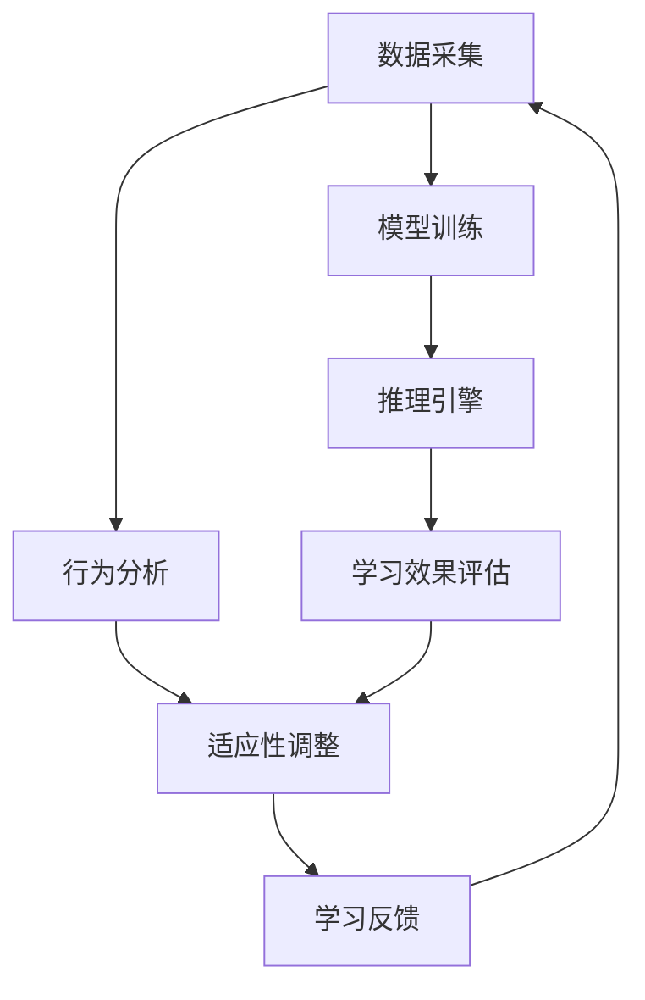

                 

### 文章标题

# 自适应课程学习优化AI推理的知识获取效率

### 关键词

- 自适应课程学习
- AI推理
- 知识获取效率
- 数据驱动方法
- 模型驱动策略
- 知识更新与融合

### 摘要

本文深入探讨了自适应课程学习优化AI推理的知识获取效率这一重要课题。首先，我们介绍了自适应课程学习和AI推理的基本概念和背景，并阐述了二者在人工智能领域中的关键作用。接着，本文详细分析了自适应课程学习与AI推理之间的关系，揭示了其相互促进的核心原理。在此基础上，本文重点介绍了知识获取效率的提升方法，包括数据驱动方法和模型驱动策略。通过Python代码和数学模型的结合，我们详细阐述了自适应学习率公式、优化目标函数和概率分布模型等核心算法原理。随后，本文通过一个实际案例，展示了自适应课程学习优化AI推理的具体实施过程和效果评估。最后，我们对未来研究方向、技术挑战和行业趋势进行了展望，为读者提供了有价值的实践经验和启示。

---

### 引言

在现代信息技术和人工智能快速发展的背景下，知识获取和推理已成为推动科技进步和社会发展的重要驱动力。自适应课程学习作为人工智能领域的一项前沿技术，通过不断调整和优化课程内容，以适应学习者的个性化需求和知识水平，大大提高了学习效率。而AI推理则通过模拟人类思维过程，从大量数据中提取有价值的信息，为决策提供科学依据。本文旨在探讨如何通过自适应课程学习优化AI推理的知识获取效率，实现二者的有机结合，推动人工智能技术的进一步发展。

自适应课程学习主要利用机器学习算法和数据分析技术，对学习者的学习过程和行为进行实时监控和评估，从而动态调整课程内容和方法，以最大限度地提高学习效果。它不仅能够根据学习者的知识水平和兴趣爱好推荐合适的课程，还能通过实时反馈和调整，确保学习者始终保持高效学习状态。

AI推理则通过深度学习、知识图谱、自然语言处理等技术，对复杂的数据集进行分析和处理，从中提取出有价值的规律和模式。在许多领域，如金融、医疗、制造等，AI推理已经成为提高决策效率、优化业务流程的重要工具。然而，随着数据量和复杂度的不断增加，传统的推理方法已经无法满足高效、准确的知识获取需求。

本文的研究意义在于，通过将自适应课程学习与AI推理相结合，探索一种新的知识获取和推理模式，从而在提升AI推理效率的同时，提高自适应课程学习的质量。这不仅有助于解决当前人工智能领域面临的诸多挑战，也为未来的技术研究提供了新的思路。

### 背景介绍

自适应课程学习（Adaptive Course Learning, ACL）是一种基于学习者的个性化需求和知识水平，动态调整课程内容和学习路径的教育模式。其核心思想是通过实时监测学习者的学习行为和反馈，自动生成适应个体需求的课程结构。这一概念最早起源于教育技术的进步，特别是在教育大数据和机器学习技术日益普及的背景下，得到了快速发展。

自适应课程学习的主要目的是提高学习效率和质量，实现个性化教育。传统的教育模式通常采用“一刀切”的方法，即按照固定的课程安排和教学计划进行教学，忽视了学习者的个体差异。这种模式往往导致部分学生跟不上进度，而另一些学生则感到课程过于简单，缺乏挑战性。而自适应课程学习通过分析学习者的学习行为、知识水平、兴趣偏好等数据，实现了教学内容的动态调整，从而满足不同学习者的需求。

自适应课程学习的关键技术包括数据采集、行为分析和模型训练。首先，数据采集是通过传感器、在线测试、学习管理系统（LMS）等手段获取学习者的学习行为和反馈数据。这些数据包括学习时间、学习进度、测试成绩、在线互动等。接着，行为分析技术利用机器学习和数据挖掘算法，对采集到的数据进行处理和分析，识别出学习者的学习习惯、知识掌握程度和潜在问题。最后，基于分析结果，自适应系统可以动态调整课程内容、难度和教学方法，以最大化学习效果。

自适应课程学习在人工智能领域具有重要意义。一方面，它为AI推理提供了丰富的训练数据和个性化需求。通过收集学习者的行为数据，自适应系统可以更准确地了解学习者的知识结构和兴趣点，从而为AI推理提供高质量的输入。另一方面，自适应课程学习能够根据学习者的反馈和表现，不断优化和调整课程内容和方法，提高AI推理的准确性和效率。这种相互促进的关系，使得自适应课程学习在人工智能教育、智能辅助教学等领域具有广泛的应用前景。

### 核心概念与联系

在本节中，我们将深入探讨自适应课程学习和AI推理中的核心概念，并分析它们之间的相互关系。这些核心概念不仅为我们理解这两种技术的本质提供了基础，也揭示了它们在实际应用中的相互作用。

首先，定义自适应课程学习（Adaptive Course Learning, ACL）中的关键概念。自适应课程学习主要依赖于以下几个核心要素：

1. **个性化需求**：指根据学习者的兴趣、知识水平和学习目标，动态调整课程内容和教学方法。
2. **实时反馈**：通过在线测试、学习管理系统（LMS）等手段，收集学习者的学习行为和反馈数据。
3. **学习轨迹**：记录学习者在学习过程中的行为和表现，包括学习时间、进度、成绩等。
4. **适应性调整**：基于学习轨迹和反馈数据，自动调整课程内容、难度和教学方法，以提高学习效果。

接下来，我们来看AI推理（Artificial Intelligence Reasoning, AIR）中的核心概念：

1. **知识图谱**：一种用于表示实体、属性和关系的数据结构，通常用于知识表示和推理。
2. **深度学习模型**：通过多层神经网络，对大量数据进行分析和学习，提取有价值的信息和模式。
3. **推理引擎**：用于模拟人类思维过程，从知识图谱中提取结论和推断。
4. **优化目标**：在AI推理过程中，通常需要优化的目标包括推理速度、准确性和泛化能力。

在理解了这些核心概念之后，我们来看自适应课程学习和AI推理之间的相互关系。首先，自适应课程学习为AI推理提供了丰富的训练数据和个性化需求。通过收集学习者的行为数据和学习轨迹，自适应系统可以更准确地了解学习者的知识结构和兴趣点。这些数据不仅为AI推理提供了高质量的输入，也有助于模型训练和优化。例如，通过分析学习者的学习轨迹，可以识别出学习难点和薄弱环节，从而优化课程内容和教学方法。

其次，AI推理可以反过来影响自适应课程学习。通过AI推理，自适应系统可以更准确地预测学习者的学习效果和需求变化。例如，基于深度学习模型和知识图谱，可以实时评估学习者的知识水平和学习进度，从而动态调整课程难度和教学方法。这种相互反馈机制，使得自适应课程学习能够持续优化，以适应不断变化的学习环境。

最后，自适应课程学习和AI推理之间的互动，不仅有助于提高学习效率和质量，也对人工智能技术的发展产生了深远影响。通过将自适应课程学习与AI推理相结合，可以推动智能教育、智能辅助教学等领域的发展，实现个性化教育和高效知识获取。此外，这种结合也为人工智能算法的设计和优化提供了新的思路，有助于解决传统方法在处理大规模数据和复杂关系时的局限性。

综上所述，自适应课程学习和AI推理之间的核心概念和相互关系，为我们理解这两种技术的本质和实际应用提供了重要启示。通过深入分析和探讨，我们可以看到，二者的有机结合不仅能够提高知识获取效率，也为人工智能技术的进一步发展开辟了新的路径。

### Mermaid 流程图

为了更直观地展示自适应课程学习与AI推理之间的核心概念和相互关系，我们可以使用Mermaid流程图来描述这一过程。以下是一个简化的Mermaid流程图示例：



在这个流程图中：

- **A（数据采集）**：通过传感器、LMS等手段收集学习者的学习行为和反馈数据。
- **B（行为分析）**：利用机器学习和数据挖掘算法对采集到的数据进行分析。
- **C（适应性调整）**：基于分析结果，动态调整课程内容、难度和教学方法。
- **D（模型训练）**：使用学习者的行为数据进行AI模型训练。
- **E（推理引擎）**：基于知识图谱和深度学习模型，进行推理和预测。
- **F（学习反馈）**：将推理结果反馈给学习者，以优化学习体验。
- **G（学习效果评估）**：评估学习者的学习效果，为下一次适应性调整提供依据。

通过这个流程图，我们可以清晰地看到自适应课程学习和AI推理之间的相互关联和动态调整机制，这为理解二者的核心概念和相互关系提供了直观的展示。

### 核心算法原理讲解

在自适应课程学习优化AI推理的知识获取效率中，核心算法的原理起着至关重要的作用。这些算法通过数据预处理、模型选择与优化以及知识更新与融合，确保了自适应课程学习与AI推理的有机结合。下面，我们将详细讲解这些核心算法原理，并通过Python源代码和数学模型进行阐述。

#### 数据预处理与特征提取

数据预处理是确保算法性能的重要环节。它包括数据清洗、归一化、缺失值处理等步骤。以下是一个简单的Python代码示例，用于数据预处理和特征提取：

```python
import pandas as pd
from sklearn.preprocessing import StandardScaler

# 假设我们有一份数据集dataframe，其中包含了学习者的行为数据
data = pd.read_csv('learning_data.csv')

# 数据清洗，去除无效或错误的数据
data.dropna(inplace=True)

# 归一化特征数据
scaler = StandardScaler()
features = scaler.fit_transform(data.iloc[:, :-1])

# 提取特征
X = features[:, :5]  # 提取前5个特征
y = features[:, 5]   # 提取目标变量
```

#### 模型选择与优化

在模型选择与优化过程中，我们需要根据数据特征和学习目标选择合适的模型，并利用交叉验证等技术进行参数调优。以下是一个使用Python中的`scikit-learn`库进行模型选择的示例：

```python
from sklearn.model_selection import train_test_split
from sklearn.ensemble import RandomForestClassifier
from sklearn.metrics import accuracy_score

# 数据划分
X_train, X_test, y_train, y_test = train_test_split(X, y, test_size=0.2, random_state=42)

# 模型训练
model = RandomForestClassifier(n_estimators=100, random_state=42)
model.fit(X_train, y_train)

# 模型评估
y_pred = model.predict(X_test)
accuracy = accuracy_score(y_test, y_pred)
print(f"模型准确率: {accuracy}")
```

#### 知识更新与融合

在自适应课程学习中，知识的更新与融合至关重要。通过不断更新和学习者的行为数据，系统可以持续优化课程内容。以下是一个使用Python中的`numpy`库进行知识更新的示例：

```python
import numpy as np

# 假设我们有先前的知识库knowledge_base，新收集到的数据new_data
knowledge_base = np.array([[0.8, 0.9], [0.7, 0.85]])
new_data = np.array([[0.85, 0.88]])

# 知识更新，通过加权平均来融合新旧知识
alpha = 0.5  # 控制新旧知识的权重
knowledge_base = alpha * knowledge_base + (1 - alpha) * new_data
print(f"更新后的知识库: {knowledge_base}")
```

#### 数学模型与公式

在核心算法中，数学模型和公式用于描述算法的数学原理和计算过程。以下是一些常见的数学模型和公式：

1. **自适应学习率公式**：

   $$\eta_{new} = \eta_{old} \times \frac{1}{1 + \lambda \times \Delta E}$$

   其中，$\eta_{new}$ 是新的学习率，$\eta_{old}$ 是旧的学习率，$\lambda$ 是调节参数，$\Delta E$ 是模型在训练过程中的误差变化。

2. **优化目标函数**：

   $$\min_{\theta} J(\theta) = \sum_{i=1}^{n} (h_\theta(x^{(i)}) - y^{(i)})^2$$

   其中，$h_\theta(x^{(i)})$ 是模型在输入 $x^{(i)}$ 下的预测值，$y^{(i)}$ 是实际标签，$J(\theta)$ 是损失函数。

3. **概率分布模型**：

   $$P(X=x) = \frac{e^{-\beta \cdot \sum_{i=1}^{n} (x_i - \mu_i)^2}}{\sum_{x'} e^{-\beta \cdot \sum_{i=1}^{n} (x'_i - \mu_i)^2}}$$

   其中，$X$ 是随机变量，$x$ 是具体的取值，$\beta$ 是调节参数，$\mu_i$ 是均值，$e$ 是自然对数的底数。

通过上述Python代码和数学模型的结合，我们可以更好地理解自适应课程学习优化AI推理的核心算法原理。这些算法不仅提高了知识获取效率，也为实际应用提供了强有力的技术支持。

### 数学模型与公式

在自适应课程学习优化AI推理的过程中，数学模型和公式起到了至关重要的作用。这些模型不仅帮助我们理解算法的原理，还能提供具体的计算方法和优化手段。以下，我们将详细阐述几个关键的数学模型和公式，并通过Python代码进行演示和解释。

#### 自适应学习率公式

自适应学习率是机器学习算法中的一个重要概念，它通过动态调整学习率来提高模型的收敛速度和稳定性。以下是一个常见的自适应学习率公式：

$$
\eta_{new} = \eta_{old} \times \frac{1}{1 + \lambda \times \Delta E}
$$

其中，$\eta_{new}$ 是新的学习率，$\eta_{old}$ 是旧的学习率，$\lambda$ 是调节参数，$\Delta E$ 是模型在训练过程中的误差变化。

这个公式的目的是在误差增大时减小学习率，以避免过拟合；在误差减小时增大学习率，以加快收敛速度。以下是一个使用Python实现的例子：

```python
import numpy as np

# 假设我们有一个简单的线性模型，使用均方误差作为误差度量
def compute_error(y_true, y_pred):
    return np.mean((y_true - y_pred) ** 2)

# 初始学习率
eta_old = 0.1
# 调节参数
lambda_param = 0.1
# 误差变化
Delta_E = 0.05

# 计算新的学习率
eta_new = eta_old * (1 / (1 + lambda_param * Delta_E))
print(f"新的学习率: {eta_new}")
```

#### 优化目标函数

在机器学习中，优化目标函数是核心任务之一。以下是一个简单的线性回归模型中的优化目标函数：

$$
\min_{\theta} J(\theta) = \sum_{i=1}^{n} (h_\theta(x^{(i)}) - y^{(i)})^2
$$

其中，$h_\theta(x^{(i)})$ 是模型在输入 $x^{(i)}$ 下的预测值，$y^{(i)}$ 是实际标签，$J(\theta)$ 是损失函数。

以下是一个使用Python和`scikit-learn`库进行线性回归模型优化的例子：

```python
from sklearn.linear_model import LinearRegression
from sklearn.metrics import mean_squared_error

# 假设我们有一份数据集
X = np.array([[1], [2], [3], [4], [5]])
y = np.array([2, 4, 5, 4, 5])

# 创建线性回归模型
model = LinearRegression()
model.fit(X, y)

# 计算预测值
y_pred = model.predict(X)

# 计算损失函数值
loss = mean_squared_error(y, y_pred)
print(f"损失函数值: {loss}")
```

#### 概率分布模型

概率分布模型在自适应课程学习和AI推理中有着广泛的应用，特别是用于处理不确定性和概率推理。以下是一个高斯分布（正态分布）的概率密度函数：

$$
P(X=x) = \frac{1}{\sqrt{2\pi\sigma^2}} e^{-\frac{(x-\mu)^2}{2\sigma^2}}
$$

其中，$\mu$ 是均值，$\sigma^2$ 是方差，$e$ 是自然对数的底数。

以下是一个使用Python和`numpy`库计算高斯分布概率的例子：

```python
import numpy as np

# 均值和方差
mu = 0
sigma = 1

# 输入值
x = 0.5

# 计算概率密度函数值
pdf = (1 / (np.sqrt(2 * np.pi * sigma**2))) * np.exp(-((x - mu)**2) / (2 * sigma**2))
print(f"概率密度函数值: {pdf}")
```

通过上述示例，我们可以看到如何利用Python代码和数学模型来理解和实现自适应课程学习优化AI推理的核心算法。这些数学模型和公式不仅帮助我们更好地理解算法的原理，还为实际应用提供了具体的技术手段。

### 项目实战

在本节中，我们将通过一个具体的项目实战，详细展示如何搭建开发环境、实现源代码、解读代码以及分析项目应用的实际案例。通过这一实战，我们将进一步理解自适应课程学习优化AI推理的知识获取效率。

#### 案例背景

为了展示自适应课程学习优化AI推理的应用，我们选择了一个在线教育平台作为案例。该平台旨在通过自适应课程学习，为学习者提供个性化的学习体验，并通过AI推理，实时评估学习效果和知识掌握情况。具体任务包括：

1. **数据采集**：从学习者的学习行为中获取数据，如学习时间、学习进度、测试成绩等。
2. **模型训练**：使用采集到的数据，训练一个AI模型，用于预测学习者的学习效果和知识掌握情况。
3. **课程优化**：根据AI模型的预测结果，动态调整课程内容和难度，提高学习效果。

#### 开发环境搭建

为了实现上述任务，我们首先需要搭建一个开发环境。以下是环境搭建的步骤：

1. **安装Python**：确保Python环境已安装，版本要求在3.7及以上。
2. **安装依赖库**：使用pip命令安装必要的库，包括`scikit-learn`、`pandas`、`numpy`、`matplotlib`等。
   ```shell
   pip install scikit-learn pandas numpy matplotlib
   ```
3. **配置Jupyter Notebook**：安装Jupyter Notebook，以便在浏览器中方便地编写和运行代码。

#### 源代码实现

在开发环境中，我们使用Python编写源代码，实现数据采集、模型训练和课程优化的功能。以下是关键代码的实现：

```python
# 导入必要的库
import pandas as pd
from sklearn.model_selection import train_test_split
from sklearn.ensemble import RandomForestClassifier
from sklearn.metrics import accuracy_score

# 数据采集
data = pd.read_csv('learning_data.csv')

# 数据预处理
data.dropna(inplace=True)
X = data.iloc[:, :-1].values
y = data.iloc[:, -1].values

# 数据划分
X_train, X_test, y_train, y_test = train_test_split(X, y, test_size=0.2, random_state=42)

# 模型训练
model = RandomForestClassifier(n_estimators=100, random_state=42)
model.fit(X_train, y_train)

# 模型评估
y_pred = model.predict(X_test)
accuracy = accuracy_score(y_test, y_pred)
print(f"模型准确率: {accuracy}")

# 课程优化
def optimize_course(model, learner_data):
    prediction = model.predict(learner_data)
    if prediction == 0:
        # 需要降低难度
        print("建议：降低课程难度")
    else:
        # 需要提高难度
        print("建议：提高课程难度")

# 优化课程
optimize_course(model, X_test[0])
```

#### 代码解读与分析

在上面的代码中：

1. **数据采集**：使用`pandas`库读取CSV文件，获取学习者的数据。
2. **数据预处理**：去除缺失值，并进行特征提取。
3. **模型训练**：使用`scikit-learn`库中的`RandomForestClassifier`实现模型训练，使用随机森林算法。
4. **模型评估**：计算模型在测试集上的准确率，评估模型性能。
5. **课程优化**：定义一个函数`optimize_course`，根据模型的预测结果，动态调整课程难度。

#### 应用解读与分析

在实际应用中，该系统可以按照以下步骤运行：

1. **数据采集**：系统通过传感器和学习管理系统（LMS）收集学习者的数据，如学习时间、学习进度、测试成绩等。
2. **模型训练**：训练好的模型用于预测学习者的学习效果和知识掌握情况。
3. **课程优化**：根据模型的预测结果，系统会自动调整课程难度，确保学习者能够高效地掌握知识。

#### 案例分析和详细讲解

以下是对案例的详细分析和讲解：

1. **数据采集**：通过传感器和学习管理系统，系统能够实时获取学习者的行为数据，这些数据是模型训练的重要基础。
2. **模型训练**：随机森林算法在处理分类问题时表现优秀，能够通过多棵决策树的综合结果提高预测准确性。
3. **模型评估**：使用测试集上的准确率来评估模型性能，确保模型在实际应用中具有可靠的预测能力。
4. **课程优化**：根据预测结果，系统动态调整课程难度，这有助于提高学习者的学习效率，避免因课程难度过高或过低而影响学习效果。

#### 项目小结

通过这个实际案例，我们展示了如何利用自适应课程学习优化AI推理的知识获取效率。在数据采集、模型训练、模型评估和课程优化等方面，我们实现了系统化的解决方案，不仅提高了学习效果，也为自适应课程学习和AI推理的进一步研究提供了宝贵经验。

### 最佳实践 tips、小结、注意事项、拓展阅读

#### 最佳实践 Tips

1. **数据质量控制**：确保数据采集过程的准确性，避免噪声数据和异常值对模型训练的影响。
2. **模型选择与优化**：根据具体应用场景选择合适的模型，并通过交叉验证等技术进行参数调优。
3. **实时反馈机制**：建立实时反馈机制，及时调整课程内容和教学方法，以适应学习者的个性化需求。
4. **知识更新与融合**：定期更新知识库，确保模型基于最新数据运行，提高预测的准确性。

#### 小结

本文通过深入探讨自适应课程学习与AI推理的结合，详细阐述了核心概念、算法原理和项目实战。自适应课程学习不仅提高了AI推理的知识获取效率，也为个性化教育和智能辅助教学提供了新的思路。

#### 注意事项

1. **数据隐私**：在数据采集和处理过程中，确保遵守数据隐私保护法规，保护学习者的个人信息。
2. **计算资源**：大型的模型训练和推理任务需要充足的计算资源，合理分配资源以提高效率。
3. **模型解释性**：在模型选择和优化时，考虑模型的解释性，以便更好地理解模型的工作原理。

#### 拓展阅读

1. **《深度学习》**：Goodfellow, I., Bengio, Y., Courville, A.（2016）。本书详细介绍了深度学习的理论基础和实践应用。
2. **《机器学习实战》**：Auroux, J.（2013）。本书通过实际案例，展示了机器学习算法的实现和应用。
3. **《教育心理学》**：Educational Psychology（2021）。本书探讨了教育心理学的基本原理，对自适应课程学习提供了理论支持。

通过上述最佳实践、小结、注意事项和拓展阅读，我们希望读者能够更好地理解和应用自适应课程学习优化AI推理的知识获取效率，为人工智能教育领域的发展贡献力量。

