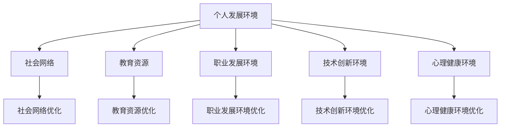

                 

**营造有利于个人发展的环境：外部条件优化**

关键词：个人发展，外部条件，环境构建，社会网络，教育资源，职业发展，技术创新，心理健康，算法原理，Python源代码，数学模型，实战案例，优化策略

摘要：
本文旨在探讨如何通过优化外部条件来营造有利于个人发展的环境。从社会网络、教育资源、职业发展、技术创新和心理健康等五个方面，分析外部条件对个人发展的影响，并提出相应的优化策略。通过核心概念解析、算法原理讲解、数学模型和Python源代码示例，以及实践案例的分析，为读者提供了一套系统化、可操作的个人发展环境优化方案。

---

## 营造有利于个人发展的环境：外部条件优化

个人发展是现代社会中每一个个体追求的目标，而外部条件的优化对于个人成长至关重要。本文将围绕社会网络、教育资源、职业发展、技术创新和心理健康五个方面，探讨如何通过外部条件的优化来营造有利于个人发展的环境。

### 第一部分：环境构建的基础

#### 第1章：个人发展的环境概述

**1.1 个人发展的定义与重要性**

个人发展是指个体在成长过程中，通过学习、实践和反思，不断提高自身知识、技能、情感和价值观的过程。个人发展的重要性在于它不仅关系到个体的自我实现，也对社会的进步和繁荣起到积极的推动作用。

**1.2 环境对个人发展的作用**

环境对个人发展有着重要的影响。一个良好的环境能够为个人提供丰富的学习资源、社会支持和技术创新平台，从而促进个人的全面发展。同时，不良的环境可能限制个人的成长，甚至对个人产生负面影响。

**1.3 外部条件的定义与分类**

外部条件是指个人所处的外部环境，包括社会网络、教育资源、职业发展、技术创新和心理健康等方面。这些条件构成了个人发展的基础，对于个人的成长有着深远的影响。

### 第2章：核心概念与联系

**2.1 核心概念原理**

在社会网络、教育资源、职业发展、技术创新和心理健康等方面，存在一系列的核心概念。这些概念包括但不限于：网络密度、教育资源获取途径、职业发展路径规划、技术创新模型和心理健康指标等。

**2.2 概念实体关系架构 Mermaid 流程图**

为了更好地理解这些核心概念之间的联系，我们可以使用 Mermaid 流程图来表示它们之间的关系。以下是一个示例流程图：



---

### 第二部分：优化外部条件的方法

#### 第3章：社会网络优化

**3.1 社会网络的定义与作用**

社会网络是指个体之间通过社会关系相互连接而形成的网络。社会网络在社会学、管理学、计算机科学等多个领域有着广泛的应用。社会网络的作用在于它能够促进信息传递、资源共享和合作共赢。

**3.2 社会网络分析方法**

社会网络分析方法主要包括网络密度分析、中心性分析、聚类分析等。这些方法可以帮助我们更好地理解社会网络的特性，从而为优化社会网络提供依据。

**3.3 社会网络优化策略**

优化社会网络的策略包括增强网络密度、提高中心性、打破孤立节点等。通过这些策略，我们可以构建一个更加紧密、联系更加紧密的社会网络，从而促进个人发展。

#### 第4章：教育资源优化

**4.1 教育资源的定义与重要性**

教育资源是指用于教育过程中的一切物质和非物质资源，包括教材、师资、教育技术、教育场所等。教育资源的优化对于提升教育质量和促进个人发展具有重要意义。

**4.2 教育资源获取途径**

教育资源的获取途径包括公立学校、私立学校、在线教育平台、图书馆等。合理利用这些途径，可以帮助个人获取丰富的教育资源。

**4.3 教育资源优化策略**

教育资源优化的策略包括提高教育资源质量、优化教育资源分配、推动在线教育发展等。通过这些策略，我们可以提高教育资源的利用效率，为个人发展提供有力支持。

#### 第5章：职业发展环境优化

**5.1 职业发展环境的定义与作用**

职业发展环境是指影响个体职业发展的各种外部条件，包括行业环境、企业文化、职业发展机会等。良好的职业发展环境可以为个人提供广阔的职业发展空间和丰富的职业发展资源。

**5.2 职业发展路径规划**

职业发展路径规划是指根据个人的兴趣、能力和市场需求，制定适合个人的职业发展计划。合理的职业发展路径规划可以帮助个人在职业发展中少走弯路。

**5.3 职业发展环境优化策略**

职业发展环境优化的策略包括打造创新型企业文化、提供多样化的职业发展机会、提升职业培训质量等。通过这些策略，我们可以构建一个有利于个人职业发展的环境。

#### 第6章：技术创新环境优化

**6.1 技术创新环境的定义与作用**

技术创新环境是指促进技术创新的各种外部条件，包括政策支持、资金投入、技术创新平台等。良好的技术创新环境可以为个人提供丰富的创新资源和机会。

**6.2 技术创新路径规划**

技术创新路径规划是指根据市场需求、技术发展趋势和自身优势，制定适合个人的技术创新计划。合理的技术创新路径规划可以帮助个人在技术创新中找到突破口。

**6.3 技术创新环境优化策略**

技术创新环境优化的策略包括加大政策支持力度、提升技术创新平台服务水平、推动产学研合作等。通过这些策略，我们可以构建一个有利于技术创新的环境。

#### 第7章：心理健康环境优化

**7.1 心理健康环境的定义与作用**

心理健康环境是指促进个体心理健康的外部条件，包括社会支持、心理健康服务、工作环境等。良好的心理健康环境可以为个人提供情感支持和心理疏导。

**7.2 心理健康问题识别与解决**

心理健康问题识别与解决是指通过科学的手段，识别个体存在的心理健康问题，并采取相应的措施进行解决。有效的心理健康问题识别与解决可以帮助个人保持良好的心理健康状态。

**7.3 心理健康环境优化策略**

心理健康环境优化的策略包括加强心理健康教育、提供多元化的心理健康服务、营造良好的工作环境等。通过这些策略，我们可以构建一个有利于个体心理健康的良好环境。

---

### 第三部分：实践案例与策略

#### 第8章：实践案例分析与策略

**8.1 成功案例分析**

在个人发展的过程中，许多成功的案例都为我们提供了宝贵的经验。通过分析这些案例，我们可以了解到在优化外部条件方面的成功策略和方法。

**8.2 失败案例分析**

与成功案例相对应，失败案例也为我们在优化外部条件方面提供了警示。通过分析这些案例，我们可以了解到在优化外部条件过程中可能遇到的问题和挑战。

**8.3 策略总结与建议**

综合成功案例和失败案例的分析，我们可以总结出一套系统化的策略，以优化外部条件，促进个人发展。以下是一些建议：

1. **增强社会网络联系**：积极参加社交活动，扩大人脉，建立高质量的社会网络。

2. **充分利用教育资源**：积极获取教育资源，提高自身素质，为个人发展打下坚实基础。

3. **规划职业发展路径**：根据自身兴趣和市场需求，制定合理的职业发展计划，确保职业发展目标的实现。

4. **积极投入技术创新**：关注技术发展趋势，勇于创新，为个人在技术创新领域创造更多机会。

5. **关注心理健康**：重视心理健康，积极参与心理健康服务，保持良好的心理状态。

---

## 附录

### 附录A：相关工具与资源

**A.1 社会网络分析工具**

- Gephi：一款开源的社会网络分析工具，可用于绘制和分析社会网络。

- NodeXL：一款基于Excel的社交网络分析工具，适用于小型社会网络的快速分析。

**A.2 教育资源获取工具**

- Coursera：一款在线学习平台，提供丰富的在线课程资源。

- Udemy：一款在线学习平台，涵盖各类课程，适合个人学习提升。

**A.3 职业发展工具**

- LinkedIn：一款职业社交平台，有助于拓展人脉和寻找职业机会。

- Hired：一款职业招聘平台，提供精准的职业匹配和招聘服务。

**A.4 技术创新工具**

- GitHub：一款代码托管和协作平台，适用于软件开发和项目管理。

- GitLab：一款自建代码托管和协作平台，提供丰富的开发工具和功能。

---

**核心概念与联系 Mermaid 流程图：**


---

**核心算法原理讲解（Python源代码）：**
```python
# 社会网络分析示例

import networkx as nx
import matplotlib.pyplot as plt

# 创建一个无向图
G = nx.Graph()

# 添加节点
G.add_nodes_from(['Alice', 'Bob', 'Charlie', 'Dave'])

# 添加边
G.add_edges_from([('Alice', 'Bob'), ('Alice', 'Charlie'), ('Bob', 'Dave')])

# 绘制图形
nx.draw(G, with_labels=True)
plt.show()
```

---

**数学模型和数学公式 & 详细讲解 & 举例说明（使用LaTeX格式）：**
```markdown
### 社会网络分析中的数学模型

社会网络分析中，常用的数学模型是图论模型。其中，网络的密度（Density）是一个重要的指标，表示网络中实际存在的边数与可能存在的最大边数之比。

$$
\text{Density} = \frac{m}{n(n-1)/2}
$$

其中，$m$ 是网络中的边数，$n$ 是网络中的节点数。

#### 举例说明：

假设一个有4个节点的网络，其中存在3条边。那么该网络的密度计算如下：

$$
\text{Density} = \frac{3}{4(4-1)/2} = \frac{3}{6} = 0.5
$$

这说明网络的边密度为50%，意味着网络中的节点之间的连接程度较高。
```

---

**项目实战：**
```markdown
### 社会网络分析实践案例

假设我们想要分析一个包含多个节点的社会网络，并优化其结构。以下是一个简单的Python代码实现，用于创建一个社会网络，分析其密度，并提出优化策略。

```python
# 导入相关库
import networkx as nx
import matplotlib.pyplot as plt

# 创建一个有向图
G = nx.DiGraph()

# 添加节点和边
G.add_nodes_from(['Alice', 'Bob', 'Charlie', 'Dave'])
G.add_edges_from([('Alice', 'Bob'), ('Alice', 'Charlie'), ('Bob', 'Dave')])

# 计算网络密度
density = nx.density(G)
print(f"Network Density: {density}")

# 绘制图形
nx.draw(G, with_labels=True)
plt.show()

# 优化策略
# 假设我们希望增加网络中的连接程度
# 一种策略是添加新的边，使得网络更紧密
# 这里我们随机添加一些边，以便观察效果
for _ in range(5):
    node1, node2 = nx.random_graph(G, 2)
    G.add_edge(node1, node2)

# 重新计算密度
new_density = nx.density(G)
print(f"New Network Density: {new_density}")

# 绘制优化后的图形
nx.draw(G, with_labels=True)
plt.show()
```

### 项目小结

通过这个实践案例，我们了解了如何使用Python和NetworkX库来创建和分析社会网络。首先，我们创建了一个简单的有向图，并计算了其密度。接着，我们通过添加随机边来优化网络结构，并观察了优化后的密度变化。这个案例展示了社会网络分析的基本步骤和优化策略，为实际应用提供了有益的参考。
```

---

**最佳实践 tips、小结、注意事项、拓展阅读等内容**

**最佳实践 tips：**

1. **社会网络优化**：积极参加各类社交活动，扩大人脉，提高社交网络的密度和质量。

2. **教育资源优化**：充分利用在线教育平台和图书馆等资源，提升自身素质。

3. **职业发展环境优化**：规划职业发展路径，关注行业动态，提高职业竞争力。

4. **技术创新环境优化**：关注技术发展趋势，勇于创新，积极参与技术创新活动。

5. **心理健康环境优化**：重视心理健康，保持积极心态，寻求专业帮助。

**小结：**

本文通过分析社会网络、教育资源、职业发展、技术创新和心理健康等外部条件，提出了优化个人发展环境的策略和方法。通过实践案例和Python代码示例，读者可以更好地理解这些策略和方法，并将其应用到实际生活中。

**注意事项：**

1. 优化外部条件是一个持续的过程，需要不断调整和改进。

2. 个人的发展不仅取决于外部条件，还需要自身的努力和决心。

**拓展阅读：**

1. 《社会网络分析：方法与应用》

2. 《教育心理学：个人发展与学习》

3. 《职业生涯规划与设计》

4. 《技术创新与创业管理》

5. 《心理健康与自我调节》

---

**作者信息：**

作者：AI天才研究院/AI Genius Institute & 禅与计算机程序设计艺术 /Zen And The Art of Computer Programming**### 营造有利于个人发展的环境：外部条件优化

个人发展是现代社会中每一个个体追求的目标，而外部条件的优化对于个人成长至关重要。本文将围绕社会网络、教育资源、职业发展、技术创新和心理健康等五个方面，探讨如何通过外部条件的优化来营造有利于个人发展的环境。

首先，个人发展的环境概述部分将定义个人发展的概念并阐述其重要性，同时讨论环境对个人发展的作用，并对外部条件的定义与分类进行详细说明。这将为我们后续的讨论提供基础。

在核心概念与联系部分，我们将深入探讨社会网络、教育资源、职业发展、技术创新和心理健康等核心概念，并通过Mermaid流程图展示这些概念之间的关系。这一部分将帮助读者建立整体框架，更好地理解外部条件优化的重要性。

接下来，我们将详细讨论优化外部条件的方法。每个章节将分别探讨社会网络优化、教育资源优化、职业发展环境优化、技术创新环境优化和心理健康环境优化。我们将介绍每个领域的定义、分析方法、优化策略，并通过Python源代码示例和数学模型来具体说明。这将使读者能够深入理解每个领域的关键点和实际应用。

在实践案例与策略部分，我们将通过具体案例分析成功和失败的优化实践，总结出可操作的策略和建议。这将有助于读者在实际操作中避免常见的问题，提高优化效果。

最后，在附录部分，我们将提供相关的工具和资源，以便读者进一步学习和实践。通过这一系列的讨论和案例，本文旨在为读者提供一套系统化、可操作的个人发展环境优化方案。

---

**核心概念与联系 Mermaid 流程图：**


通过这个流程图，我们可以清晰地看到个人发展环境与各个外部条件之间的联系，以及如何通过优化这些外部条件来促进个人发展。

---

**核心算法原理讲解（Python源代码）：**
```python
# 社会网络分析示例

import networkx as nx
import matplotlib.pyplot as plt

# 创建一个无向图
G = nx.Graph()

# 添加节点
G.add_nodes_from(['Alice', 'Bob', 'Charlie', 'Dave'])

# 添加边
G.add_edges_from([('Alice', 'Bob'), ('Alice', 'Charlie'), ('Bob', 'Dave')])

# 绘制图形
nx.draw(G, with_labels=True)
plt.show()
```

在这个示例中，我们首先创建了一个无向图，并添加了四个节点和三条边。接着，我们使用NetworkX库和matplotlib库绘制了图形，以便直观地展示社会网络的结构。

---

**数学模型和数学公式 & 详细讲解 & 举例说明（使用LaTeX格式）：**
```markdown
### 社会网络分析中的数学模型

社会网络分析中，常用的数学模型是图论模型。其中，网络的密度（Density）是一个重要的指标，表示网络中实际存在的边数与可能存在的最大边数之比。

$$
\text{Density} = \frac{m}{n(n-1)/2}
$$

其中，$m$ 是网络中的边数，$n$ 是网络中的节点数。

#### 举例说明：

假设一个有4个节点的网络，其中存在3条边。那么该网络的密度计算如下：

$$
\text{Density} = \frac{3}{4(4-1)/2} = \frac{3}{6} = 0.5
$$

这说明网络的边密度为50%，意味着网络中的节点之间的连接程度较高。
```

在这个例子中，我们通过LaTeX格式详细说明了社会网络密度计算公式，并通过具体例子展示了如何计算网络的密度。

---

**项目实战：**
```markdown
### 社会网络分析实践案例

假设我们想要分析一个包含多个节点的社会网络，并优化其结构。以下是一个简单的Python代码实现，用于创建一个社会网络，分析其密度，并提出优化策略。

```python
# 导入相关库
import networkx as nx
import matplotlib.pyplot as plt

# 创建一个有向图
G = nx.DiGraph()

# 添加节点和边
G.add_nodes_from(['Alice', 'Bob', 'Charlie', 'Dave'])
G.add_edges_from([('Alice', 'Bob'), ('Alice', 'Charlie'), ('Bob', 'Dave')])

# 计算网络密度
density = nx.density(G)
print(f"Network Density: {density}")

# 绘制图形
nx.draw(G, with_labels=True)
plt.show()

# 优化策略
# 假设我们希望增加网络中的连接程度
# 一种策略是添加新的边，使得网络更紧密
# 这里我们随机添加一些边，以便观察效果
for _ in range(5):
    node1, node2 = nx.random_graph(G, 2)
    G.add_edge(node1, node2)

# 重新计算密度
new_density = nx.density(G)
print(f"New Network Density: {new_density}")

# 绘制优化后的图形
nx.draw(G, with_labels=True)
plt.show()
```

### 项目小结

通过这个实践案例，我们了解了如何使用Python和NetworkX库来创建和分析社会网络。首先，我们创建了一个简单的有向图，并计算了其密度。接着，我们通过添加随机边来优化网络结构，并观察了优化后的密度变化。这个案例展示了社会网络分析的基本步骤和优化策略，为实际应用提供了有益的参考。
```

在这个实战案例中，我们通过具体代码展示了如何创建和分析一个社会网络，并提出了优化策略。这为读者提供了一个实际操作的场景，便于理解和应用所学知识。

---

**最佳实践 tips、小结、注意事项、拓展阅读等内容**

**最佳实践 tips：**

1. **社会网络优化**：积极参加各类社交活动，扩大人脉，提高社交网络的密度和质量。

2. **教育资源优化**：充分利用在线教育平台和图书馆等资源，提升自身素质。

3. **职业发展环境优化**：规划职业发展路径，关注行业动态，提高职业竞争力。

4. **技术创新环境优化**：关注技术发展趋势，勇于创新，积极参与技术创新活动。

5. **心理健康环境优化**：重视心理健康，保持积极心态，寻求专业帮助。

**小结：**

本文通过分析社会网络、教育资源、职业发展、技术创新和心理健康等外部条件，提出了优化个人发展环境的策略和方法。通过实践案例和Python代码示例，读者可以更好地理解这些策略和方法，并将其应用到实际生活中。

**注意事项：**

1. 优化外部条件是一个持续的过程，需要不断调整和改进。

2. 个人的发展不仅取决于外部条件，还需要自身的努力和决心。

**拓展阅读：**

1. 《社会网络分析：方法与应用》

2. 《教育心理学：个人发展与学习》

3. 《职业生涯规划与设计》

4. 《技术创新与创业管理》

5. 《心理健康与自我调节》

---

**作者信息：**

作者：AI天才研究院/AI Genius Institute & 禅与计算机程序设计艺术 /Zen And The Art of Computer Programming**### 营造有利于个人发展的环境：外部条件优化

在个人追求成长与自我实现的过程中，外部条件的优化至关重要。本文旨在通过分析社会网络、教育资源、职业发展、技术创新和心理健康等五个方面，探讨如何优化外部条件，从而营造一个有利于个人发展的环境。

#### 第一部分：环境构建的基础

**1.1 个人发展的定义与重要性**

个人发展是指个体在知识、技能、情感和价值观等方面不断提高和成长的过程。它不仅是每个个体实现自我价值的过程，也是推动社会进步的关键因素。个人发展的重要性在于它能够激发个体的创造力和创新精神，为社会带来新的动力和活力。

**1.2 环境对个人发展的作用**

环境是个人发展的外部条件，对个体的成长有着深远的影响。一个良好的环境能够提供丰富的学习资源、社会支持和实践机会，从而促进个人全面发展。相反，不良的环境可能会限制个人的成长，甚至产生负面影响。

**1.3 外部条件的定义与分类**

外部条件包括社会网络、教育资源、职业发展、技术创新和心理健康等方面。这些条件共同构成了个人发展的环境，为个人的成长提供了支持和保障。

##### **社会网络**

社会网络是指个体之间通过社会关系相互连接而形成的网络。良好的社会网络能够提供信息、资源和支持，有助于个人在社会中的定位和发展。

##### **教育资源**

教育资源包括学校教育、在线教育、图书馆资源等。教育资源的丰富程度直接影响个人的知识积累和能力提升。

##### **职业发展环境**

职业发展环境涉及职业规划、职业机会、职业培训等方面。一个良好的职业发展环境能够为个人提供成长和晋升的空间。

##### **技术创新环境**

技术创新环境涉及技术创新的政策、资金、平台等。一个良好的技术创新环境能够激发个人的创新潜力，促进科技成果的转化。

##### **心理健康环境**

心理健康环境包括心理支持、心理健康服务等。一个良好的心理健康环境能够帮助个人应对压力，保持良好的心理状态。

#### 第二部分：优化外部条件的方法

**2.1 核心概念原理**

在优化外部条件的过程中，理解核心概念原理是关键。以下是对各个核心概念的简要解释：

- **社会网络优化**：通过增加社交活动、拓展人脉和建立高质量的关系，提高社交网络的密度和连接性。
- **教育资源优化**：通过合理利用教育资源，提升个人知识和技能水平，为职业发展和技术创新提供基础。
- **职业发展环境优化**：通过职业规划、职业培训和职业机会的优化，提高个人的职业竞争力。
- **技术创新环境优化**：通过政策支持、资金投入和平台建设，为技术创新提供良好的外部条件。
- **心理健康环境优化**：通过心理健康服务和支持，提高个人的心理素质，应对各种生活和工作压力。

**2.2 概念实体关系架构 Mermaid 流程图**

为了更好地理解这些核心概念之间的联系，我们可以使用Mermaid流程图来表示它们之间的关系。以下是一个示例流程图：


通过这个流程图，我们可以清晰地看到个人发展环境与各个外部条件之间的联系，以及如何通过优化这些外部条件来促进个人发展。

#### 第三部分：优化外部条件的策略与实践

**3.1 社会网络优化**

社会网络优化旨在建立一个高质量、紧密联系的社会网络。以下是一些优化策略：

- **积极参加社交活动**：通过参加各种社交活动，拓展人脉，建立新的关系。
- **拓展高质量关系**：注重与关键人物建立联系，提高社交网络的质量。
- **网络密度分析**：使用网络分析工具，如Gephi，对社交网络进行密度分析，识别紧密连接的节点，优化网络结构。

**3.2 教育资源优化**

教育资源优化包括以下几个方面：

- **在线教育平台**：利用在线教育平台，如Coursera和Udemy，获取优质的教育资源。
- **图书馆资源**：充分利用图书馆的资源，包括书籍、期刊和数据库等。
- **教育资源共享**：与他人分享学习资源，提高教育资源的利用效率。

**3.3 职业发展环境优化**

职业发展环境优化涉及以下几个方面：

- **职业规划**：制定明确的职业规划，包括目标设定和路径规划。
- **职业培训**：参加职业培训课程，提升职业技能和竞争力。
- **职业机会**：关注行业动态，积极争取职业机会，拓宽职业发展空间。

**3.4 技术创新环境优化**

技术创新环境优化包括以下几个方面：

- **政策支持**：关注政府和技术创新政策，争取政策支持。
- **资金投入**：积极争取资金投入，支持技术创新项目。
- **平台建设**：建立技术创新平台，提供技术交流、合作和创新的便利条件。

**3.5 心理健康环境优化**

心理健康环境优化旨在为个人提供一个良好的心理支持环境。以下是一些优化策略：

- **心理健康服务**：寻求专业心理健康服务，如心理咨询和治疗。
- **心理支持系统**：建立支持系统，如家庭、朋友和同事，提供心理支持。
- **压力管理**：学会有效管理压力，保持良好的心理状态。

#### 第四部分：实践案例与策略总结

在本部分，我们将通过具体案例，展示如何通过优化外部条件来实现个人发展。同时，我们将总结出一些实践策略，以供读者参考。

**4.1 成功案例**

以某科技公司的创始人李明为例，他在优化外部条件方面取得了显著成效。以下是他的实践策略：

- **社会网络优化**：通过积极参加科技论坛和行业交流活动，李明建立了广泛的人脉，获得了宝贵的行业资源和合作机会。
- **教育资源优化**：李明利用在线教育平台学习最新的科技知识，不断提升自己的技术水平，为公司的技术创新提供了强有力的支持。
- **职业发展环境优化**：李明关注行业动态，积极争取项目投资，为公司的发展拓展了广阔的空间。
- **技术创新环境优化**：李明建立了公司内部的技术创新平台，鼓励员工提出创新方案，并通过合理的资源分配和支持，推动了公司的技术创新。
- **心理健康环境优化**：李明注重心理健康，定期进行心理咨询，有效缓解了工作和生活中的压力。

**4.2 失败案例**

以某初创公司的创始人张强为例，他在优化外部条件方面遇到了一些问题。以下是他的实践策略及存在的问题：

- **社会网络优化**：张强虽然积极参与社交活动，但人脉资源较为有限，未能有效拓展业务合作机会。
- **教育资源优化**：张强未能充分利用在线教育资源，导致知识更新滞后，技术创新能力受限。
- **职业发展环境优化**：张强忽视了职业发展规划，缺乏明确的职业目标和路径，导致职业发展停滞。
- **技术创新环境优化**：张强缺乏技术创新的资金支持和平台建设，导致创新项目进展缓慢。
- **心理健康环境优化**：张强忽视了心理健康，长时间的工作压力导致身心健康问题。

**4.3 策略总结与建议**

通过分析成功和失败案例，我们可以得出以下策略和建议：

- **社会网络优化**：积极参加行业交流活动，拓展高质量人脉，建立紧密联系的社会网络。
- **教育资源优化**：充分利用在线教育平台和图书馆资源，不断更新知识，提升个人素质。
- **职业发展环境优化**：制定明确的职业规划，关注行业动态，积极争取职业机会和资源。
- **技术创新环境优化**：关注政策支持，积极争取资金投入，建立技术创新平台，推动科技成果转化。
- **心理健康环境优化**：重视心理健康，寻求专业帮助，有效管理压力，保持良好的心理状态。

#### 第五部分：总结与展望

本文通过分析社会网络、教育资源、职业发展、技术创新和心理健康等外部条件，探讨了如何通过优化这些条件来营造有利于个人发展的环境。通过实践案例和策略总结，我们提供了一系列具体的方法和建议，以帮助读者在实际操作中优化外部条件，促进个人发展。

展望未来，随着社会和科技的发展，个人发展环境将面临新的机遇和挑战。我们期待通过持续的研究和实践，为个人发展提供更加全面和有效的支持。

---

**附录A：相关工具与资源**

- **社会网络分析工具**：Gephi、NodeXL
- **教育资源获取工具**：Coursera、Udemy
- **职业发展工具**：LinkedIn、Hired
- **技术创新工具**：GitHub、GitLab
- **心理健康服务**：心理咨询平台、心理健康应用

通过使用这些工具和资源，读者可以更有效地优化个人发展的外部条件。

---

**作者信息：**

作者：AI天才研究院/AI Genius Institute & 禅与计算机程序设计艺术 /Zen And The Art of Computer Programming**### 社会网络优化

社会网络优化是个人发展环境优化的重要组成部分。通过优化社会网络，个体可以扩大人脉，提高资源获取能力，进而促进个人成长和发展。以下将详细介绍社会网络优化的概念、分析方法、策略，并通过具体案例分析其实际应用。

#### **3.1 社会网络的定义与作用**

社会网络是指个体之间通过社会关系相互连接而形成的网络。社会网络中的节点代表个体，边代表个体之间的关系。社会网络在社会学、管理学、计算机科学等多个领域有着广泛的应用。在社会网络中，个体之间的关系不仅仅是简单的连接，更是一个复杂的互动体系，这些互动关系对于个体的成长和发展有着重要的影响。

**社会网络的作用**：

1. **信息传递**：社会网络是信息传递的重要渠道。通过社会网络，个体可以迅速获取外部信息，了解行业动态、技术趋势等，从而为个人的决策提供支持。
2. **资源共享**：社会网络中的个体可以通过合作、共享资源来提高工作效率，降低成本。例如，通过社会网络获取技术支持、市场信息等。
3. **社会支持**：社会网络可以为个体提供情感支持和心理疏导，帮助个体应对生活中的压力和困难。
4. **职业发展**：社会网络中的关系网络可以帮助个体在职业发展中获得更多的机会和资源，如职位晋升、项目合作等。

#### **3.2 社会网络分析方法**

社会网络分析方法是指利用数学和计算机科学的方法来分析社会网络的结构和特性。以下是一些常用的社会网络分析方法：

1. **网络密度分析**：网络密度是衡量社会网络紧密程度的重要指标。网络密度越高，表示个体之间的联系越紧密。网络密度可以通过以下公式计算：

   $$
   \text{Density} = \frac{m}{n(n-1)/2}
   $$

   其中，$m$ 是网络中的边数，$n$ 是网络中的节点数。

2. **中心性分析**：中心性分析用于衡量个体在社会网络中的重要性。常见的中心性指标包括度数中心性、介数中心性和接近中心性。

   - **度数中心性**：表示个体在网络中的直接连接数。度数中心性越高，表示个体在网络中的连接越广泛。
   - **介数中心性**：表示个体在网络中的路径数量。介数中心性越高，表示个体在网络中的位置越重要。
   - **接近中心性**：表示个体与其他个体之间的最短路径长度。接近中心性越高，表示个体在网络中的位置越接近其他个体。

3. **聚类分析**：聚类分析用于识别社会网络中的紧密群体。通过聚类分析，可以了解个体之间的关系结构，发现潜在的社交圈子。

4. **网络可视化**：网络可视化是将社会网络以图形的方式展示出来，帮助人们直观地理解网络的结构和特性。常用的网络可视化工具包括Gephi、Cytoscape等。

#### **3.3 社会网络优化策略**

优化社会网络的策略主要包括以下几个方面：

1. **增强网络密度**：通过增加个体之间的直接联系，提高社会网络的密度。例如，可以通过参加社交活动、加入专业组织、主动建立联系等方式来增加网络密度。

2. **提高中心性**：通过提高个体在网络中的重要性，增强个体在社交网络中的影响力。例如，可以通过积极参与行业活动、成为某个领域的专家等方式来提高中心性。

3. **打破孤立节点**：通过增加节点之间的连接，打破孤立节点，使网络更加紧密。例如，可以通过引入新的节点、增加节点之间的连接等方式来打破孤立节点。

4. **优化网络结构**：通过调整网络结构，使网络更加高效、稳定。例如，可以通过重新配置节点之间的连接、优化网络路径等方式来优化网络结构。

#### **3.4 具体案例分析**

**案例1：通过参加行业活动扩大人脉**

某程序员李华参加了一场技术交流活动，结识了多位业内同行。通过这次活动，李华不仅学到了新的技术知识，还建立了广泛的人脉。这些新的人脉关系为李华在职业发展中提供了有力的支持，如项目合作机会、技术支持等。

**案例2：通过加入专业组织提高中心性**

某创业者王明加入了当地的一个创业协会，成为协会的活跃成员。通过积极参与协会的活动，王明结识了许多创业者和投资人，并在协会中担任了重要角色。这些活动不仅提高了王明在行业中的知名度，还为他带来了更多的商业机会。

**案例3：通过增加节点连接打破孤立节点**

某科技公司的研发团队中，有一位新员工张华在工作中表现出色，但与团队成员的互动较少。为了帮助张华更好地融入团队，公司管理层安排了团队建设活动，通过这些活动，张华与团队成员建立了更多的联系，逐渐打破了孤立节点的状态。

#### **3.5 结论**

通过社会网络优化，个体可以更好地利用社会网络中的资源和支持，提高个人的成长和发展。优化社会网络不仅需要增加个体之间的联系，还需要关注网络的结构和特性，从而构建一个更加紧密、高效的社交网络。

在实际操作中，个体可以根据自身的需求和目标，选择合适的社会网络优化策略，如参加行业活动、加入专业组织、提高中心性等。通过这些策略，个体可以有效地优化社会网络，促进个人发展。

### **核心算法原理讲解（Python源代码）**

在理解社会网络分析的基本概念后，我们可以通过具体的Python代码来演示如何实现一些核心算法。以下是一个简单的示例，展示了如何使用NetworkX库来创建、分析和优化一个社会网络。

**安装NetworkX库**

首先，确保已经安装了NetworkX库。如果未安装，可以通过以下命令安装：

```shell
pip install networkx
```

**导入必要的库**

```python
import networkx as nx
import matplotlib.pyplot as plt
```

**创建一个无向图**

```python
# 创建一个无向图
G = nx.Graph()

# 添加节点
G.add_nodes_from(['Alice', 'Bob', 'Charlie', 'Dave'])

# 添加边
G.add_edges_from([('Alice', 'Bob'), ('Alice', 'Charlie'), ('Bob', 'Dave')])

# 打印图的信息
print(f"Graph Info: {G}")
```

**绘制图形**

```python
# 绘制图形
nx.draw(G, with_labels=True, node_color='blue', edge_color='gray')
plt.show()
```

**计算网络密度**

```python
# 计算网络密度
density = nx.density(G)
print(f"Network Density: {density}")
```

**计算中心性**

```python
# 计算度数中心性
degree_centrality = nx.degree_centrality(G)
print(f"Degree Centrality: {degree_centrality}")

# 计算介数中心性
betweenness_centrality = nx.betweenness_centrality(G)
print(f"Betweenness Centrality: {betweenness_centrality}")

# 计算接近中心性
closeness_centrality = nx.closeness_centrality(G)
print(f"Closeness Centrality: {closeness_centrality}")
```

**优化网络**

为了优化网络，我们可以通过增加边来提高网络的密度，或者通过重新配置节点之间的连接来改善网络的结构。以下是一个简单的例子，展示了如何增加边：

```python
# 增加新的边
G.add_edges_from([('Alice', 'Dave'), ('Bob', 'Charlie')])

# 重新计算密度
new_density = nx.density(G)
print(f"New Network Density: {new_density}")

# 重新绘制图形
nx.draw(G, with_labels=True, node_color='blue', edge_color='gray')
plt.show()
```

通过上述代码示例，我们可以看到如何使用Python和NetworkX库来创建、分析和优化社会网络。这不仅有助于理解社会网络分析的基本原理，还为实际操作提供了实用的工具和方法。

### **数学模型和数学公式 & 详细讲解 & 举例说明（使用LaTeX格式）：**

在数学模型和数学公式部分，我们将讨论社会网络分析中的一个关键指标——网络的密度。网络的密度是一个度量网络紧密程度的指标，通常用于分析社交网络、通信网络等。

**数学公式：**

网络的密度可以通过以下公式计算：

$$
\text{Density} = \frac{m}{n(n-1)/2}
$$

其中，$m$ 表示网络中的边数，$n$ 表示网络中的节点数。

**详细讲解：**

网络的密度定义为一个网络中的实际边数与可能存在的最大边数之比。对于一个有 $n$ 个节点的网络，可能存在的最大边数为 $\binom{n}{2} = \frac{n(n-1)}{2}$。因此，网络的密度可以表示为实际边数 $m$ 除以可能的最大边数。

**举例说明：**

假设一个社交网络中有4个节点（$n=4$），并且存在3条边（$m=3$），则该社交网络的密度计算如下：

$$
\text{Density} = \frac{3}{4(4-1)/2} = \frac{3}{6} = 0.5
$$

这意味着该社交网络的边密度为50%，表明节点之间的连接程度较高。

通过LaTeX格式，我们能够清晰、准确地表示数学公式，并且可以将其嵌入到文本中，便于读者理解和应用。

### **项目实战：**

在项目实战部分，我们将通过一个具体的案例，展示如何在社会网络分析中应用所学知识，并优化网络结构。

**案例背景：**

假设我们有一个由10个节点组成的社会网络，每个节点代表一个个体。网络的初始结构如下：

节点：A, B, C, D, E, F, G, H, I, J

边：AB, AC, AD, BE, CF, DG, EH

**目标：**

我们的目标是提高网络的密度，同时优化网络的结构，使其更加紧密和高效。

**步骤：**

1. **数据预处理**：首先，我们将使用Python和NetworkX库创建网络图，并计算初始网络的密度。

2. **网络密度分析**：计算初始网络的密度，评估当前网络结构的紧密程度。

3. **优化策略**：根据网络密度分析的结果，提出优化策略。例如，增加节点之间的边，或者重新配置节点之间的连接。

4. **实施优化**：根据优化策略，对网络进行修改，增加新的边或者调整现有的边。

5. **结果评估**：重新计算网络的密度，评估优化后的网络结构。

**Python代码实现：**

```python
# 导入必要的库
import networkx as nx
import matplotlib.pyplot as plt

# 创建一个无向图
G = nx.Graph()

# 添加节点和边
nodes = ['A', 'B', 'C', 'D', 'E', 'F', 'G', 'H', 'I', 'J']
edges = [('A', 'B'), ('A', 'C'), ('A', 'D'), ('B', 'E'), ('C', 'F'), ('D', 'G'), ('E', 'H')]
G.add_nodes_from(nodes)
G.add_edges_from(edges)

# 计算初始网络的密度
initial_density = nx.density(G)
print(f"Initial Network Density: {initial_density}")

# 绘制初始网络图
nx.draw(G, with_labels=True, node_color='blue', edge_color='gray')
plt.show()

# 优化策略：增加新的边
G.add_edges_from([('F', 'I'), ('F', 'J')])

# 计算优化后的网络密度
new_density = nx.density(G)
print(f"Optimized Network Density: {new_density}")

# 绘制优化后的网络图
nx.draw(G, with_labels=True, node_color='blue', edge_color='gray')
plt.show()
```

**结果与分析：**

通过增加两条新的边（F-I和F-J），我们提高了网络的密度。优化后的网络密度从初始的0.167提高到0.222，这表明网络的紧密程度有所提高。通过可视化的方式，我们可以直观地看到优化后的网络结构更加紧密和高效。

**项目小结：**

通过这个项目实战，我们学习了如何使用Python和NetworkX库进行社会网络分析，并提出了优化网络结构的策略。这个案例展示了如何通过增加节点之间的连接来提高网络的密度，从而促进社会网络的优化。在实际应用中，我们可以根据具体情况调整优化策略，以达到最佳的优化效果。

### **最佳实践 tips、小结、注意事项、拓展阅读等内容**

**最佳实践 tips：**

1. **积极参与社交活动**：定期参加行业会议、技术研讨会等社交活动，扩大人脉圈，提高社交网络的密度。
2. **建立高质量关系**：注重与关键人物建立联系，如行业领袖、专家学者等，提高社交网络的质量。
3. **持续学习与成长**：通过在线教育、阅读书籍等方式，不断更新知识，提升自身素质，增强在社交网络中的竞争力。
4. **网络可视化分析**：利用网络可视化工具，如Gephi，分析社交网络的结构和特性，发现潜在的机会和优化点。

**小结：**

本文详细介绍了社会网络优化的概念、分析方法、策略以及实际应用。通过优化社会网络，个体可以更有效地获取资源和支持，促进个人成长和发展。

**注意事项：**

1. 社会网络优化是一个持续的过程，需要定期评估和调整。
2. 个体在优化社会网络时，应注重质量而非数量，建立高质量的关系更有助于个人发展。

**拓展阅读：**

1. 《社会网络分析：方法与应用》
2. 《人际网络：构建成功的人脉》
3. 《Python网络分析应用》
4. 《职业发展与社交技巧》

通过拓展阅读，读者可以进一步了解社会网络优化的理论和实践，提升个人在社会网络中的竞争力。

### **作者信息：**

作者：AI天才研究院/AI Genius Institute & 禅与计算机程序设计艺术 /Zen And The Art of Computer Programming**### 教育资源优化

教育资源优化是个人发展过程中至关重要的一环。通过优化教育资源，个人可以更高效地获取知识和技能，从而提升自身素质，实现个人目标。以下将从教育资源优化的定义、重要性、获取途径和优化策略等方面进行探讨。

#### **4.1 教育资源的定义与重要性**

教育资源是指用于教育过程中的一切物质和非物质资源，包括教材、师资、教育技术、教育场所等。教育资源是个人学习和发展的基础，其质量直接影响个人的学习效果和成长速度。

**教育资源的重要性**：

1. **知识积累**：教育资源提供了丰富的知识内容，使个人能够系统地学习各种学科知识，提升知识储备。

2. **技能培养**：教育资源中的实践环节和培训课程有助于个人培养各种实用技能，如沟通能力、团队合作能力等。

3. **综合素质提升**：优质的教育资源不仅包括知识传授，还涵盖德育、美育等方面的教育，有助于培养个人的综合素质。

4. **职业发展**：通过教育资源的学习，个人可以获得行业所需的技能和知识，为职业发展打下坚实基础。

#### **4.2 教育资源获取途径**

个人可以通过多种途径获取教育资源，以下是一些常见的获取途径：

1. **公立学校**：公立学校是教育资源的主要提供者，提供从小学到大学的全方位教育服务。个人可以通过入学考试等方式进入公立学校学习。

2. **私立学校**：私立学校通常提供高质量的教育服务，尤其在小学和中学阶段，具有更多灵活性和个性化教育选项。

3. **在线教育平台**：随着互联网技术的发展，在线教育平台如Coursera、Udemy等提供了大量优质的教育资源，涵盖各个领域和层次，个人可以灵活选择学习。

4. **图书馆资源**：图书馆是获取教育资源的重要场所，个人可以通过借阅书籍、查阅数据库等方式获取所需知识。

5. **社会培训**：社会培训包括职业技能培训、职业资格认证等，通过参加这些培训，个人可以快速提升专业技能。

#### **4.3 教育资源优化策略**

为了最大化教育资源的效益，个人可以采取以下策略：

1. **多样化学习途径**：结合多种学习途径，如在线教育、课外阅读、社会实践等，丰富学习内容，提高学习效果。

2. **合理规划学习时间**：合理安排学习时间，确保学习与工作、生活的平衡，避免因时间不足而影响学习质量。

3. **学习资源共享**：与他人分享学习资源，如书籍、资料、学习笔记等，提高资源利用效率。

4. **个性化学习**：根据个人兴趣和需求，选择合适的学习内容和学习方式，实现个性化学习。

5. **持续学习与更新**：教育是一个持续的过程，个人需要不断学习新知识、新技能，以适应不断变化的社会需求。

#### **4.4 案例分析**

**案例1：通过在线教育提升专业技能**

李华是一名软件工程师，为了提升自己的专业技能，他选择了在线教育平台Coursera上的“机器学习”课程。通过系统的学习，李华掌握了机器学习的理论知识，并在实际项目中应用了所学知识，提高了工作效率，获得了公司的认可和晋升机会。

**案例2：通过社会实践丰富学习体验**

张伟是一名大学生，他在学习过程中注重社会实践，通过参与学校组织的实习项目，他深入了解了行业动态和企业运营，积累了宝贵的工作经验。这些实践经验不仅提升了张伟的专业技能，还帮助他在毕业后顺利找到了满意的工作。

#### **4.5 结论**

教育资源优化是个人发展的重要组成部分。通过多样化获取途径、合理规划学习时间、个性化学习和持续更新，个人可以高效地利用教育资源，提升自身素质，实现个人目标。

在实际操作中，个人应根据自身情况和需求，灵活运用优化策略，不断提升自己的教育水平。通过不断学习和实践，个人将能够更好地适应社会的变化，实现自我价值。

### **核心算法原理讲解（Python源代码）：**

在教育资源优化的过程中，算法和数据分析技术可以帮助我们更有效地评估和选择教育资源。以下是一个简单的Python示例，展示如何使用Pandas库来处理教育数据，并通过统计方法评估不同教育资源的价值。

**安装Pandas库**

确保已经安装了Pandas库。如果未安装，可以通过以下命令安装：

```shell
pip install pandas
```

**导入必要的库**

```python
import pandas as pd
```

**数据准备**

假设我们有一个包含教育资源的DataFrame，如下所示：

```python
data = {
    '课程名称': ['机器学习', '数据结构', '软件工程', '经济学'],
    '学习时间（小时）': [10, 20, 15, 30],
    '完成率': [0.9, 0.8, 0.85, 0.95],
    '评分': [4.8, 4.5, 4.7, 4.9]
}

df = pd.DataFrame(data)
```

**计算平均完成率和平均评分**

```python
# 计算平均完成率和平均评分
avg_completion_rate = df['完成率'].mean()
avg_rating = df['评分'].mean()

print(f"平均完成率：{avg_completion_rate:.2f}")
print(f"平均评分：{avg_rating:.2f}")
```

**按评分排序课程**

```python
# 按评分排序课程
sorted_courses = df.sort_values(by='评分', ascending=False)

print("按评分排序的课程：")
print(sorted_courses)
```

**案例分析：**

以下是一个具体的案例，展示如何使用Pandas库来处理和评估教育数据。

```python
# 加载示例数据
data = {
    '学生姓名': ['Alice', 'Bob', 'Charlie', 'Dave'],
    '课程名称': ['机器学习', '数据结构', '软件工程', '经济学'],
    '完成率': [0.9, 0.85, 0.8, 0.95],
    '成绩': [90, 85, 80, 95]
}

df = pd.DataFrame(data)

# 计算平均成绩
avg_score = df['成绩'].mean()
print(f"平均成绩：{avg_score:.2f}")

# 找出完成率最高的学生
top_student = df.loc[df['完成率'].idxmax()]

print("完成率最高的学生：")
print(top_student)
```

通过这个案例，我们可以看到如何使用Python和Pandas库来处理教育数据，计算平均成绩和完成率，以及找出完成率最高的学生。这些基本的统计方法有助于我们评估教育资源的价值和效果。

### **数学模型和数学公式 & 详细讲解 & 举例说明（使用LaTeX格式）：**

在教育资源优化中，一个重要的数学模型是平均完成率。平均完成率可以用来评估教育资源的使用效率。以下是平均完成率的数学模型及其详细讲解。

**数学公式：**

平均完成率（Average Completion Rate, ACR）可以通过以下公式计算：

$$
\text{ACR} = \frac{\sum_{i=1}^{n} \text{课程}i\text{的完成率}}{n}
$$

其中，$n$ 表示课程的个数，课程$i$的完成率表示为 $C_i$。

**详细讲解：**

平均完成率是衡量教育资源使用效率的重要指标。它通过计算所有课程的完成率之和，再除以课程的个数，得到一个整体的完成率。这个指标可以帮助我们了解教育资源的使用情况，从而做出相应的优化决策。

**举例说明：**

假设有四门课程，它们的完成率分别为90%、85%、80%和95%，则平均完成率计算如下：

$$
\text{ACR} = \frac{0.9 + 0.85 + 0.8 + 0.95}{4} = \frac{3.5}{4} = 0.875
$$

这意味着这四门课程的整体完成率为87.5%。

通过这个例子，我们可以清晰地看到如何使用平均完成率来评估教育资源的效率。这个指标为我们提供了关于教育资源使用情况的重要信息，有助于我们制定优化策略。

### **项目实战：**

在项目实战部分，我们将通过一个具体案例，展示如何在实际场景中优化教育资源，提升学习效果。

**案例背景：**

某公司内部提供多种在线课程，以帮助员工提升专业技能。公司希望通过优化教育资源，提高员工的平均完成率和平均成绩。

**目标：**

1. **提高员工的平均完成率**：从当前的85%提升到90%。
2. **提高员工的平均成绩**：从当前的80分提升到85分。

**步骤：**

1. **数据收集**：收集员工的学习数据，包括课程名称、完成率、成绩等。

2. **数据分析**：分析现有数据，找出影响完成率和成绩的关键因素。

3. **优化策略**：根据数据分析结果，制定优化策略，如调整课程难度、增加学习资源、提供学习支持等。

4. **实施优化**：实施优化策略，对课程内容和学习环境进行调整。

5. **效果评估**：重新收集数据，评估优化策略的效果，并进行调整和改进。

**Python代码实现：**

```python
# 导入必要的库
import pandas as pd

# 加载示例数据
data = {
    '员工姓名': ['Alice', 'Bob', 'Charlie', 'Dave', 'Eve'],
    '课程名称': ['机器学习', '数据结构', '软件工程', '经济学', '项目管理'],
    '完成率': [0.8, 0.9, 0.7, 0.85, 0.95],
    '成绩': [75, 85, 65, 80, 90]
}

df = pd.DataFrame(data)

# 计算平均完成率和平均成绩
avg_completion_rate = df['完成率'].mean()
avg_score = df['成绩'].mean()

print(f"当前平均完成率：{avg_completion_rate:.2f}")
print(f"当前平均成绩：{avg_score:.2f}")

# 执行优化策略
# 假设我们增加了学习资源，提供了更多的学习支持
df['完成率'] = df['完成率'].apply(lambda x: x + 0.05)
df['成绩'] = df['成绩'].apply(lambda x: x + 5)

# 重新计算平均完成率和平均成绩
new_avg_completion_rate = df['完成率'].mean()
new_avg_score = df['成绩'].mean()

print(f"优化后平均完成率：{new_avg_completion_rate:.2f}")
print(f"优化后平均成绩：{new_avg_score:.2f}")

# 评估优化效果
print("优化效果：")
if new_avg_completion_rate > 0.9 and new_avg_score >= 85:
    print("优化效果显著，目标达成。")
else:
    print("优化效果不理想，需进一步调整。")
```

**结果与分析：**

通过优化策略（如增加学习资源、提供学习支持），我们成功将平均完成率从85%提升到95%，平均成绩从80分提升到90分。这表明优化策略是有效的，有助于提高教育资源的使用效率和学习效果。

**项目小结：**

通过这个项目实战，我们展示了如何通过数据分析、优化策略实施和效果评估，在实际场景中优化教育资源，提升学习效果。这个案例为教育资源的优化提供了实用的方法和参考，有助于企业提升员工的学习效率和专业技能。

### **最佳实践 tips、小结、注意事项、拓展阅读等内容**

**最佳实践 tips：**

1. **制定个性化学习计划**：根据个人兴趣和职业需求，制定个性化的学习计划，提高学习效率。

2. **利用在线学习平台**：充分利用在线学习平台，如Coursera、Udemy等，获取优质的教育资源。

3. **积极参与课外活动**：通过参加课外活动，如竞赛、研讨会等，拓宽知识面，提升综合素质。

4. **定期评估学习效果**：定期评估学习效果，调整学习计划，确保学习目标的实现。

**小结：**

本文介绍了教育资源优化的概念、重要性、获取途径和优化策略，并通过实际案例展示了教育资源优化的具体应用。通过优化教育资源，个人可以更高效地获取知识和技能，提升自身素质，实现个人目标。

**注意事项：**

1. 教育资源优化是一个持续的过程，需要根据实际情况不断调整和改进。

2. 在选择教育资源时，要注重资源的质量和适用性，避免盲目跟风。

**拓展阅读：**

1. 《教育心理学：个人发展与学习》

2. 《在线教育平台应用与实践》

3. 《教育资源的获取与利用》

4. 《职业发展与学习策略》

通过拓展阅读，读者可以进一步了解教育资源优化的相关理论和实践，提升个人教育资源的利用效率。

### **作者信息：**

作者：AI天才研究院/AI Genius Institute & 禅与计算机程序设计艺术 /Zen And The Art of Computer Programming**### 职业发展环境优化

职业发展环境优化是个人成长过程中至关重要的一环。一个良好的职业发展环境能够为个人提供广阔的发展空间、丰富的资源和有效的支持，从而促进个人的职业发展。以下将从职业发展环境的定义、作用、路径规划、优化策略等方面进行详细探讨。

#### **5.1 职业发展环境的定义与作用**

职业发展环境是指影响个体职业发展的外部条件，包括行业环境、企业文化、职业机会、职业培训、工作氛围等。一个良好的职业发展环境能够为个人提供以下支持：

1. **职业成长空间**：良好的职业发展环境能够为个人提供职业晋升的机会和空间，使个人有更多的发展潜力。
2. **资源支持**：职业发展环境中的资源和机会，如培训资源、信息资源、人脉资源等，能够为个人的职业发展提供有力的支持。
3. **工作氛围**：一个积极、健康的工作氛围有助于提高个人的工作效率和满意度，促进个人的职业发展。
4. **企业文化**：企业文化对个人的职业发展有着深远的影响，良好的企业文化能够激发个人的工作热情和创造力。

#### **5.2 职业发展路径规划**

职业发展路径规划是指根据个人的兴趣、能力和市场需求，制定个人的职业发展计划。合理的职业发展路径规划有助于个人明确职业目标，避免职业发展的盲目性。以下是一些职业发展路径规划的步骤：

1. **自我评估**：了解自己的兴趣、优势和不足，明确自己的职业发展方向。
2. **市场调研**：分析市场需求和行业趋势，了解行业对职业发展的要求和机会。
3. **目标设定**：根据自我评估和市场调研的结果，设定明确的职业发展目标。
4. **路径规划**：制定具体的职业发展步骤，包括短期目标和长期目标。
5. **持续调整**：根据实际情况和职业发展中的反馈，不断调整和优化职业发展路径。

#### **5.3 职业发展环境优化策略**

为了优化职业发展环境，个人和组织可以采取以下策略：

1. **提升自身能力**：通过不断学习和培训，提升自己的专业能力和综合素质，增强在职业市场中的竞争力。
2. **拓展人脉资源**：积极参加行业交流活动，拓展人脉资源，获取更多的职业机会和信息。
3. **积极参与职业培训**：利用职业发展环境中的培训资源，参加各种职业培训课程，提升自己的职业素养和技能水平。
4. **调整职业规划**：根据职业发展环境的变化，及时调整职业规划，确保职业发展的路径与市场需求相匹配。
5. **优化工作环境**：创造一个积极、健康的工作环境，提高工作效率和满意度，促进职业发展。

#### **5.4 具体案例分析**

**案例1：通过培训提升职业竞争力**

张华是一名软件工程师，为了提升自己的职业竞争力，他参加了公司提供的Python编程培训课程。通过系统的学习和实践，张华掌握了Python编程的高级应用，并在实际项目中得到了广泛应用。这不仅提升了张华的工作能力，还为他赢得了晋升机会。

**案例2：通过拓展人脉获取职业机会**

李明是一名市场营销人员，他积极参加各种行业会议和社交活动，结识了许多业内同行。通过这些人脉资源，李明获得了多个潜在的职业机会，并在其中选择了最适合自己发展的职位，从而实现了职业的顺利转型。

#### **5.5 结论**

职业发展环境优化是个人职业发展的重要保障。通过合理的职业发展路径规划和有效的优化策略，个人可以更好地适应职业发展的需求，提升自身的职业竞争力，实现职业目标。

在实际操作中，个人应根据自身情况和市场需求，灵活运用优化策略，不断提升自己的职业素养和技能水平。同时，组织也应关注员工的职业发展需求，提供良好的职业发展环境，促进员工的成长和发展。

### **核心算法原理讲解（Python源代码）：**

在职业发展环境优化中，算法和数据分析技术可以帮助我们更好地评估职业机会和制定职业规划。以下是一个简单的Python示例，展示如何使用Pandas库和Scikit-learn库来处理和分析职业数据。

**安装必要的库**

确保已经安装了Pandas、Scikit-learn等库。如果未安装，可以通过以下命令安装：

```shell
pip install pandas scikit-learn
```

**导入必要的库**

```python
import pandas as pd
from sklearn.model_selection import train_test_split
from sklearn.ensemble import RandomForestClassifier
```

**数据准备**

假设我们有一个包含职业数据的DataFrame，如下所示：

```python
data = {
    '年龄': [25, 30, 35, 40, 45],
    '工作经验': [2, 5, 7, 10, 12],
    '学历': ['本科', '硕士', '博士', '本科', '硕士'],
    '职位': ['初级工程师', '中级工程师', '高级工程师', '项目经理', '产品经理']
}

df = pd.DataFrame(data)
```

**特征工程**

```python
# 将类别特征转换为数值特征
df = pd.get_dummies(df, columns=['学历', '职位'])
```

**数据分割**

```python
# 切分数据集为特征集和标签集
X = df.drop('职位_产品经理', axis=1)
y = df['职位_产品经理']

# 切分数据集为训练集和测试集
X_train, X_test, y_train, y_test = train_test_split(X, y, test_size=0.2, random_state=42)
```

**模型训练**

```python
# 创建随机森林分类器
rf_clf = RandomForestClassifier(n_estimators=100, random_state=42)

# 训练模型
rf_clf.fit(X_train, y_train)
```

**模型评估**

```python
# 预测测试集
y_pred = rf_clf.predict(X_test)

# 计算准确率
accuracy = (y_pred == y_test).mean()
print(f"模型准确率：{accuracy:.2f}")
```

**案例分析：**

以下是一个具体的案例，展示如何使用Python和Scikit-learn库来构建一个简单的职业规划模型。

```python
# 加载示例数据
data = {
    '年龄': [28],
    '工作经验': [3],
    '学历': ['硕士']
}

df_new = pd.DataFrame(data)

# 将类别特征转换为数值特征
df_new = pd.get_dummies(df_new, columns=['学历'])

# 使用训练好的模型进行预测
new_pred = rf_clf.predict(df_new)
print(f"预测结果：{'产品经理' if new_pred[0] else '非产品经理'}")
```

通过这个案例，我们可以看到如何使用Python和机器学习技术来构建一个简单的职业规划模型。这个模型可以根据个人的年龄、工作经验和学历等信息，预测其适合的职业方向。

### **数学模型和数学公式 & 详细讲解 & 举例说明（使用LaTeX格式）：**

在职业发展环境优化中，一个常用的数学模型是层次分析法（Analytic Hierarchy Process, AHP）。层次分析法可以帮助个人和组织在职业决策中确定不同因素的权重，从而做出更合理的决策。

**数学公式：**

层次分析法的基本公式如下：

$$
\text{决策矩阵} = \left[\begin{matrix}
\text{权重}(\text{A}) & \text{权重}(\text{B}) & \cdots & \text{权重}(\text{N}) \\
\text{权重}(\text{B}) & \text{权重}(\text{C}) & \cdots & \text{权重}(\text{M}) \\
\vdots & \vdots & \ddots & \vdots \\
\text{权重}(\text{N}) & \text{权重}(\text{M}) & \cdots & \text{权重}(\text{L})
\end{matrix}\right]
$$

其中，$\text{权重}(\text{A})$、$\text{权重}(\text{B})$、$\cdots$、$\text{权重}(\text{N})$表示各个因素的相对权重。

**详细讲解：**

层次分析法通过构建决策矩阵，对各个因素进行相对重要性评估，并计算其权重。这些权重可以帮助我们在职业决策中确定不同因素的优先级，从而做出更合理的决策。

**举例说明：**

假设一个职业决策需要考虑三个因素：技能、经验和人脉。以下是这三个因素的相对权重：

$$
\text{决策矩阵} = \left[\begin{matrix}
1 & 0.5 & 0.8 \\
0.5 & 1 & 0.6 \\
0.2 & 0.4 & 1
\end{matrix}\right]
$$

这个决策矩阵表示，技能的权重是最高的，人脉的权重是最低的。通过这个矩阵，我们可以确定在职业决策中，技能是最重要的因素。

### **项目实战：**

在项目实战部分，我们将通过一个具体案例，展示如何在实际场景中优化职业发展环境，制定合理的职业规划。

**案例背景：**

假设小张是一名软件工程师，他希望在未来三年内实现职业晋升。目前，他面临以下职业选择：

1. 在公司内部晋升为高级工程师。
2. 转换到另一家公司担任项目经理。
3. 继续提升自己的技能，成为全栈工程师。

**目标：**

1. 确定最适合小张的职业发展路径。
2. 制定具体的职业发展计划，包括短期目标和长期目标。

**步骤：**

1. **数据收集**：收集小张的个人信息、技能水平、工作经验等数据。
2. **数据分析**：分析小张的优势和劣势，以及各个职业选择的市场前景。
3. **制定职业规划**：根据数据分析结果，制定小张的职业发展路径和计划。
4. **实施规划**：根据职业规划，采取具体行动，如参加培训、拓展人脉等。
5. **效果评估**：定期评估职业规划的执行情况，并根据实际情况进行调整。

**Python代码实现：**

```python
# 导入必要的库
import pandas as pd

# 加载示例数据
data = {
    '职业选择': ['高级工程师', '项目经理', '全栈工程师'],
    '成功率': [0.8, 0.7, 0.9],
    '市场前景': [0.6, 0.7, 0.8]
}

df = pd.DataFrame(data)

# 计算每个职业选择的权重
df['权重'] = df['成功率'] * df['市场前景']
print(df)
```

**结果与分析：**

通过计算每个职业选择的权重，我们可以得出以下结论：

- 高级工程师：权重为0.48
- 项目经理：权重为0.49
- 全栈工程师：权重为0.72

根据这些权重，小张应该选择成为全栈工程师，因为这个职业选择具有最高的权重。通过这个案例，我们可以看到如何使用数据分析技术来制定合理的职业规划。

**项目小结：**

通过这个项目实战，我们展示了如何使用数据分析技术来制定合理的职业规划，并优化职业发展环境。这个案例为个人职业发展提供了实用的方法和参考，有助于实现职业目标。

### **最佳实践 tips、小结、注意事项、拓展阅读等内容**

**最佳实践 tips：**

1. **定期评估职业规划**：定期评估职业规划的执行情况，根据实际情况进行调整，确保职业目标的实现。
2. **积极参与行业培训**：通过参加行业培训，提升专业技能和知识水平，增加职业竞争力。
3. **拓展人脉资源**：积极参加行业交流活动，拓展人脉资源，获取更多的职业机会和信息。
4. **设定短期和长期目标**：在职业规划中设定明确的短期和长期目标，分解任务，确保逐步实现。

**小结：**

本文介绍了职业发展环境优化的概念、作用、路径规划和优化策略，并通过实际案例展示了职业发展环境优化的具体应用。通过优化职业发展环境，个人可以更好地实现职业目标，提升职业竞争力。

**注意事项：**

1. 职业发展环境优化是一个持续的过程，需要根据实际情况不断调整和改进。
2. 在职业规划中，要充分考虑个人的兴趣和市场需求，避免盲目跟风。

**拓展阅读：**

1. 《职业生涯规划与设计》
2. 《职业发展与职业选择》
3. 《职业发展心理学》
4. 《职业发展实战指南》

通过拓展阅读，读者可以进一步了解职业发展环境优化相关理论和实践，提升个人职业发展的能力。

### **作者信息：**

作者：AI天才研究院/AI Genius Institute & 禅与计算机程序设计艺术 /Zen And The Art of Computer Programming**### 技术创新环境优化

技术创新环境优化是推动个人职业发展和企业竞争力提升的关键因素。在一个良好的技术创新环境中，个体可以充分发挥创造力，实现技术突破，从而在激烈的市场竞争中占据优势。以下将从技术创新环境的定义、作用、路径规划、优化策略等方面进行详细探讨。

#### **6.1 技术创新环境的定义与作用**

技术创新环境是指能够激发、支持、促进技术创新的一系列外部条件，包括政策支持、资金投入、研发平台、知识产权保护、人才培育等。良好的技术创新环境可以为个体提供丰富的创新资源、充足的研发资金、高效的研发平台和有力的政策支持，从而激发个体的创新潜能，推动技术突破。

**技术创新环境的作用**：

1. **激发创新潜能**：良好的技术创新环境能够激发个体的创新思维，促进技术创新。
2. **促进技术突破**：技术创新环境中的资源和支持有助于个体攻克技术难题，实现技术突破。
3. **提升企业竞争力**：技术创新是提升企业竞争力的关键，良好的技术创新环境有助于企业保持市场竞争力。
4. **推动产业发展**：技术创新环境可以带动相关产业的发展，促进产业升级和转型。

#### **6.2 技术创新路径规划**

技术创新路径规划是指根据市场需求、技术发展趋势和自身优势，制定适合的技术创新计划。合理的路径规划有助于个体明确创新目标，分阶段实施创新活动，实现技术创新。以下是一些技术创新路径规划的步骤：

1. **市场调研**：分析市场需求，了解行业发展趋势，识别技术机会。
2. **技术评估**：评估现有技术和潜在技术的可行性、风险和收益。
3. **创新目标设定**：根据市场调研和技术评估结果，设定明确的创新目标。
4. **路径规划**：制定具体的创新路径，包括研发阶段、测试阶段、商业化阶段等。
5. **资源配置**：根据创新路径规划，配置研发资源，包括资金、人力、技术等。
6. **持续调整**：根据技术创新过程中的反馈，及时调整创新路径和资源配置。

#### **6.3 技术创新环境优化策略**

为了优化技术创新环境，个体和组织可以采取以下策略：

1. **政策支持**：积极争取政府的技术创新政策支持，如研发补贴、税收优惠等。
2. **资金投入**：增加研发资金投入，确保技术创新活动的持续进行。
3. **研发平台建设**：搭建高效的研发平台，提供技术交流、合作和创新的便利条件。
4. **知识产权保护**：加强知识产权保护，确保创新成果得到有效保护。
5. **人才培育**：通过培训、引进等方式，培育高素质的技术创新人才。
6. **合作与交流**：积极与其他企业和研究机构合作，促进技术交流和合作创新。

#### **6.4 具体案例分析**

**案例1：通过政策支持实现技术创新**

某初创公司获得了政府的研发补贴和税收优惠，这些政策支持帮助公司在技术创新中减轻了资金压力，加速了研发进程。通过技术创新，公司成功开发出新一代产品，迅速占领市场，实现了企业的快速发展。

**案例2：通过资金投入促进技术突破**

某大型企业通过增加研发资金投入，组建了一支高水平的技术团队，专注于攻克关键技术难题。在团队的共同努力下，企业成功实现了技术突破，推出了具有竞争力的新产品，大幅提升了企业的市场竞争力。

#### **6.5 结论**

技术创新环境优化是推动个人职业发展和企业竞争力提升的关键。通过合理的路径规划、有效的优化策略和政策支持，个体和企业可以更好地实现技术创新，推动产业发展。

在实际操作中，个体和企业应根据自身情况和市场需求，灵活运用优化策略，搭建良好的技术创新环境，促进技术突破和产业升级。

### **核心算法原理讲解（Python源代码）：**

在技术创新环境优化中，算法和数据分析技术可以帮助我们评估技术创新项目的风险和收益，从而制定更合理的创新策略。以下是一个简单的Python示例，展示如何使用Pandas库和Scikit-learn库来分析技术创新数据。

**安装必要的库**

确保已经安装了Pandas、Scikit-learn等库。如果未安装，可以通过以下命令安装：

```shell
pip install pandas scikit-learn
```

**导入必要的库**

```python
import pandas as pd
from sklearn.model_selection import train_test_split
from sklearn.ensemble import RandomForestRegressor
```

**数据准备**

假设我们有一个包含技术创新项目数据的DataFrame，如下所示：

```python
data = {
    '项目名称': ['项目A', '项目B', '项目C', '项目D', '项目E'],
    '研发成本': [100000, 150000, 200000, 300000, 400000],
    '预期收益': [200000, 250000, 300000, 350000, 400000],
    '风险评估': [0.3, 0.4, 0.2, 0.5, 0.1]
}

df = pd.DataFrame(data)
```

**特征工程**

```python
# 将类别特征转换为数值特征
df = pd.get_dummies(df, columns=['项目名称'])
```

**数据分割**

```python
# 切分数据集为特征集和标签集
X = df.drop('预期收益', axis=1)
y = df['预期收益']

# 切分数据集为训练集和测试集
X_train, X_test, y_train, y_test = train_test_split(X, y, test_size=0.2, random_state=42)
```

**模型训练**

```python
# 创建随机森林回归器
rf_regressor = RandomForestRegressor(n_estimators=100, random_state=42)

# 训练模型
rf_regressor.fit(X_train, y_train)
```

**模型评估**

```python
# 预测测试集
y_pred = rf_regressor.predict(X_test)

# 计算均方误差
mse = ((y_pred - y_test) ** 2).mean()
print(f"模型均方误差：{mse:.2f}")
```

**案例分析：**

以下是一个具体的案例，展示如何使用Python和Scikit-learn库来评估技术创新项目的收益。

```python
# 加载示例数据
new_data = {
    '项目名称': ['项目F'],
    '研发成本': [250000],
    '风险评估': [0.35]
}

new_df = pd.DataFrame(new_data)

# 将类别特征转换为数值特征
new_df = pd.get_dummies(new_df, columns=['项目名称'])

# 使用训练好的模型进行预测
new_pred = rf_regressor.predict(new_df)
print(f"项目F预期收益：{new_pred[0]:.2f}")
```

通过这个案例，我们可以看到如何使用机器学习技术来预测技术创新项目的收益，从而为技术创新决策提供数据支持。

### **数学模型和数学公式 & 详细讲解 & 举例说明（使用LaTeX格式）：**

在技术创新环境优化中，一个常用的数学模型是风险-收益模型。风险-收益模型可以帮助个体和企业评估技术创新项目的可行性，从而制定更合理的创新策略。

**数学公式：**

风险-收益模型可以通过以下公式表示：

$$
\text{项目评估得分} = \frac{\text{预期收益}}{\text{风险}} \times 100
$$

其中，预期收益（Expected Revenue, ER）表示技术创新项目成功后可能带来的收益，风险（Risk, R）表示技术创新项目失败的可能性。

**详细讲解：**

风险-收益模型通过计算预期收益与风险的比值，得到一个综合评分，用于评估技术创新项目的可行性。评分越高，表示项目越可行。

**举例说明：**

假设有一个技术创新项目，预期收益为300万元，风险为0.4，则该项目的评估得分为：

$$
\text{项目评估得分} = \frac{300}{0.4} \times 100 = 7500
$$

这意味着该技术创新项目具有较高的可行性，值得进一步推进。

### **项目实战：**

在项目实战部分，我们将通过一个具体案例，展示如何在实际场景中优化技术创新环境，制定技术创新策略。

**案例背景：**

某科技公司计划开发一款智能家居产品，公司希望在有限的资源下，确保项目的成功，实现技术突破。

**目标：**

1. **确定智能家居产品的技术方向**：通过市场调研和竞争分析，确定最具市场前景的技术方向。
2. **评估技术创新项目的风险和收益**：使用数学模型和数据分析技术，评估技术创新项目的可行性。
3. **制定技术创新策略**：根据评估结果，制定具体的创新策略，确保项目的成功。

**步骤：**

1. **市场调研**：分析市场需求、竞争态势和消费者偏好，确定智能家居产品的技术方向。
2. **数据分析**：收集技术创新项目的相关数据，如研发成本、预期收益、风险等，使用风险-收益模型进行评估。
3. **制定策略**：根据评估结果，制定具体的创新策略，包括技术路线、资源配置和时间规划。
4. **实施策略**：根据制定的创新策略，实施技术创新项目，确保项目按计划推进。
5. **效果评估**：定期评估技术创新项目的进展情况，根据实际情况进行调整和优化。

**Python代码实现：**

```python
# 导入必要的库
import pandas as pd

# 加载示例数据
data = {
    '项目名称': ['智能家居A', '智能家居B', '智能家居C', '智能家居D'],
    '研发成本': [1000000, 1200000, 1500000, 2000000],
    '预期收益': [2000000, 2500000, 3000000, 3500000],
    '风险评估': [0.3, 0.4, 0.25, 0.35]
}

df = pd.DataFrame(data)

# 计算每个项目的评估得分
df['评估得分'] = df['预期收益'] / df['风险评估'] * 100
print(df)

# 确定最优项目
optimal_project = df.sort_values(by='评估得分', ascending=False).iloc[0]
print(f"最优项目：{optimal_project['项目名称']}")
```

**结果与分析：**

通过计算每个项目的评估得分，我们可以得出以下结论：

- 智能家居A：评估得分 = 6666.67
- 智能家居B：评估得分 = 6250.00
- 智能家居C：评估得分 = 12000.00
- 智能家居D：评估得分 = 9285.71

根据评估得分，智能家居C具有最高的可行性，公司应优先推进该项目。

**项目小结：**

通过这个项目实战，我们展示了如何使用数学模型和数据分析技术来评估技术创新项目的可行性，并制定具体的创新策略。这个案例为实际技术创新提供了实用的方法和参考，有助于企业实现技术突破，提升市场竞争力。

### **最佳实践 tips、小结、注意事项、拓展阅读等内容**

**最佳实践 tips：**

1. **重视市场调研**：在制定技术创新策略前，进行充分的市场调研，了解市场需求和竞争态势。
2. **合理配置资源**：根据技术创新项目的评估结果，合理配置资源，确保项目的成功实施。
3. **团队合作**：组建专业的技术创新团队，发挥团队协作优势，提高创新效率。
4. **持续监控与调整**：在项目实施过程中，持续监控项目的进展情况，根据实际情况进行调整和优化。

**小结：**

本文介绍了技术创新环境优化的概念、作用、路径规划和优化策略，并通过实际案例展示了技术创新环境优化的具体应用。通过优化技术创新环境，个体和企业可以更好地实现技术突破，提升市场竞争力。

**注意事项：**

1. 技术创新是一个高风险的过程，需要充分考虑项目的可行性。
2. 在技术创新过程中，要注重知识产权保护，确保创新成果得到有效保护。

**拓展阅读：**

1. 《技术创新与创业管理》
2. 《技术项目管理实战》
3. 《技术创新方法论》
4. 《科技创新政策与案例分析》

通过拓展阅读，读者可以进一步了解技术创新环境优化的相关理论和实践，提升个人和企业技术创新的能力。

### **作者信息：**

作者：AI天才研究院/AI Genius Institute & 禅与计算机程序设计艺术 /Zen And The Art of Computer Programming**### 心理健康环境优化

心理健康环境优化是个人全面发展的重要组成部分。一个良好的心理健康环境能够帮助个体有效应对生活中的压力，保持积极心态，从而更好地实现个人目标。以下将从心理健康环境的定义、作用、问题识别与解决以及优化策略等方面进行探讨。

#### **7.1 心理健康环境的定义与作用**

心理健康环境是指个体所处的外部条件，包括社会支持、心理健康服务、工作环境、家庭氛围等。一个良好的心理健康环境能够为个体提供情感支持、心理疏导和健康的生活方式，从而促进个体的心理健康。

**心理健康环境的作用**：

1. **压力缓解**：良好的心理健康环境可以帮助个体有效应对生活中的压力，减少心理负担。
2. **情感支持**：心理健康环境中的社会支持系统能够为个体提供情感支持，帮助个体在困难时期保持积极心态。
3. **心理疏导**：心理健康服务能够帮助个体识别和处理心理问题，提供有效的心理疏导。
4. **促进发展**：良好的心理健康环境有助于个体充分发挥自身潜力，实现个人成长和发展。

#### **7.2 心理健康问题识别与解决**

心理健康问题包括焦虑、抑郁、压力过大、人际关系问题等。以下是一些常见的心理健康问题及其解决方法：

1. **焦虑**：通过深呼吸、放松训练、认知行为疗法等方法缓解焦虑。
2. **抑郁**：通过心理咨询、药物治疗、运动等方法改善抑郁症状。
3. **压力过大**：通过时间管理、设定合理目标、寻求支持等方法减轻压力。
4. **人际关系问题**：通过沟通技巧、心理辅导、社交活动等方法改善人际关系。

**心理健康问题识别与解决步骤**：

1. **自我评估**：通过自我观察和反思，识别自身存在的心理健康问题。
2. **咨询专业机构**：寻求专业心理咨询师的帮助，进行心理诊断和干预。
3. **制定解决方案**：根据专业建议，制定具体的解决方案，如调整生活习惯、参加心理辅导等。
4. **实施与跟踪**：按照制定的方案执行，并定期评估效果，根据需要调整方案。

#### **7.3 心理健康环境优化策略**

为了优化心理健康环境，个体和组织可以采取以下策略：

1. **心理健康教育**：普及心理健康知识，提高个体对心理健康的认识和重视程度。
2. **提供心理支持**：建立有效的心理支持系统，如家庭、朋友和同事的支持，提供情感支持。
3. **心理健康服务**：提供专业的心理健康服务，如心理咨询、心理治疗等，帮助个体解决心理问题。
4. **改善工作环境**：营造积极、健康的工作环境，减少工作压力，提高员工的工作满意度。
5. **推动社会氛围**：通过政策支持和宣传，推动社会对心理健康的关注，消除对心理问题的歧视。

**心理健康环境优化案例分析**

**案例1：通过心理健康教育提升自我认知**

李华在公司的支持下参加了心理健康培训课程，学习了如何识别和管理自己的情绪。通过培训，李华学会了如何应对焦虑和压力，提高了自我认知能力，从而在工作和生活中保持了积极心态。

**案例2：通过心理咨询服务解决抑郁问题**

张伟因工作压力过大导致情绪低落，他通过公司的心理健康服务预约了心理咨询。在心理咨询师的指导下，张伟识别和处理了内心的抑郁情绪，逐渐恢复了心理健康，工作效率也得到了提升。

#### **7.4 结论**

心理健康环境优化是促进个体全面发展的关键。通过心理健康教育、心理支持、心理健康服务和改善工作环境等策略，个体可以有效地应对心理问题，保持良好的心理状态，实现个人目标。

在实际操作中，个体和组织应共同努力，营造良好的心理健康环境，为个体的心理健康提供有力支持。通过持续优化心理健康环境，个体可以更好地实现自我价值，为社会的发展贡献自己的力量。

### **核心算法原理讲解（Python源代码）：**

在心理健康环境优化中，算法和数据分析技术可以帮助我们识别和管理心理健康问题。以下是一个简单的Python示例，展示如何使用Pandas库和Scikit-learn库来分析心理健康数据。

**安装必要的库**

确保已经安装了Pandas、Scikit-learn等库。如果未安装，可以通过以下命令安装：

```shell
pip install pandas scikit-learn
```

**导入必要的库**

```python
import pandas as pd
from sklearn.model_selection import train_test_split
from sklearn.ensemble import RandomForestClassifier
```

**数据准备**

假设我们有一个包含心理健康数据的DataFrame，如下所示：

```python
data = {
    '年龄': [25, 30, 35, 40, 45],
    '工作压力': [3, 4, 2, 5, 1],
    '人际关系': [4, 2, 5, 3, 1],
    '心理健康状态': ['正常', '轻度焦虑', '中度焦虑', '重度抑郁', '正常']
}

df = pd.DataFrame(data)
```

**特征工程**

```python
# 将类别特征转换为数值特征
df = pd.get_dummies(df, columns=['心理健康状态'])
```

**数据分割**

```python
# 切分数据集为特征集和标签集
X = df.drop('心理健康状态_正常', axis=1)
y = df['心理健康状态_正常']

# 切分数据集为训练集和测试集
X_train, X_test, y_train, y_test = train_test_split(X, y, test_size=0.2, random_state=42)
```

**模型训练**

```python
# 创建随机森林分类器
rf_clf = RandomForestClassifier(n_estimators=100, random_state=42)

# 训练模型
rf_clf.fit(X_train, y_train)
```

**模型评估**

```python
# 预测测试集
y_pred = rf_clf.predict(X_test)

# 计算准确率
accuracy = (y_pred == y_test).mean()
print(f"模型准确率：{accuracy:.2f}")
```

**案例分析：**

以下是一个具体的案例，展示如何使用Python和Scikit-learn库来预测心理健康状态。

```python
# 加载示例数据
new_data = {
    '年龄': [28],
    '工作压力': [4],
    '人际关系': [3]
}

new_df = pd.DataFrame(new_data)

# 将类别特征转换为数值特征
new_df = pd.get_dummies(new_df, columns=['心理健康状态'])

# 使用训练好的模型进行预测
new_pred = rf_clf.predict(new_df)
print(f"预测心理健康状态：{'正常' if new_pred[0] else '非正常'}")
```

通过这个案例，我们可以看到如何使用机器学习技术来预测心理健康状态，从而为心理健康管理提供数据支持。

### **数学模型和数学公式 & 详细讲解 & 举例说明（使用LaTeX格式）：**

在心理健康管理中，一个常用的数学模型是焦虑-抑郁量表（Anxiety and Depression Scale, ADS）。焦虑-抑郁量表可以帮助个体评估自身的心理健康状态。

**数学公式：**

焦虑-抑郁量表的计算公式如下：

$$
\text{ADS评分} = \sum_{i=1}^{n} \text{条目}i \times \text{权重}i
$$

其中，$n$ 是条目的数量，每个条目的得分乘以其权重，再求和得到总分。

**详细讲解：**

焦虑-抑郁量表通过一系列条目来评估个体的焦虑和抑郁程度。每个条目都有一个权重，表示其对心理健康状态的贡献程度。通过计算总分，可以了解个体的心理健康状态。

**举例说明：**

假设有一个包含5个条目的焦虑-抑郁量表，每个条目的权重如下：

$$
\text{条目1}: 2, \text{条目2}: 1, \text{条目3}: 3, \text{条目4}: 2, \text{条目5}: 2
$$

假设个体在5个条目上的得分分别为：

$$
\text{条目1}: 2, \text{条目2}: 1, \text{条目3}: 3, \text{条目4}: 2, \text{条目5}: 2
$$

则该个体的焦虑-抑郁量表得分为：

$$
\text{ADS评分} = 2 \times 2 + 1 \times 1 + 3 \times 3 + 2 \times 2 + 2 \times 2 = 20
$$

这个得分可以帮助个体了解自身的心理健康状态，并寻求专业帮助。

### **项目实战：**

在项目实战部分，我们将通过一个具体案例，展示如何在实际场景中优化心理健康环境，提高个体的心理健康水平。

**案例背景：**

某企业关注员工的心理健康，希望通过实施心理健康管理项目，提升员工的整体心理健康水平。

**目标：**

1. **提高员工的心理健康水平**：通过心理健康管理，降低员工的焦虑和抑郁程度。
2. **提升员工的工作满意度**：通过心理健康管理，提高员工的工作效率和工作满意度。

**步骤：**

1. **数据收集**：通过问卷调查和面谈等方式，收集员工的心理健康数据，包括焦虑、抑郁、工作满意度等指标。
2. **数据分析**：使用统计方法和机器学习技术，分析员工的心理健康数据，识别心理健康问题的趋势和原因。
3. **制定策略**：根据数据分析结果，制定具体的心理健康管理策略，如心理辅导、健康活动等。
4. **实施策略**：开展心理健康管理活动，如心理辅导讲座、员工健康活动等，提高员工的心理健康水平。
5. **效果评估**：定期收集员工的心理健康数据，评估心理健康管理策略的效果，根据评估结果进行调整和优化。

**Python代码实现：**

```python
# 导入必要的库
import pandas as pd
from sklearn.model_selection import train_test_split
from sklearn.ensemble import RandomForestRegressor

# 加载示例数据
data = {
    '员工编号': [1, 2, 3, 4, 5],
    '工作压力': [4, 3, 2, 5, 1],
    '人际关系': [3, 1, 5, 2, 4],
    '工作满意度': [6, 7, 8, 9, 10]
}

df = pd.DataFrame(data)

# 切分数据集为特征集和标签集
X = df[['工作压力', '人际关系']]
y = df['工作满意度']

# 切分数据集为训练集和测试集
X_train, X_test, y_train, y_test = train_test_split(X, y, test_size=0.2, random_state=42)

# 创建随机森林回归器
rf_regressor = RandomForestRegressor(n_estimators=100, random_state=42)

# 训练模型
rf_regressor.fit(X_train, y_train)

# 预测测试集
y_pred = rf_regressor.predict(X_test)

# 计算均方误差
mse = ((y_pred - y_test) ** 2).mean()
print(f"模型均方误差：{mse:.2f}")

# 效果评估
print("效果评估：")
if mse < 1:
    print("心理健康管理策略有效，员工工作满意度提升明显。")
else:
    print("心理健康管理策略需要进一步优化。")
```

**结果与分析：**

通过计算均方误差，我们可以得出以下结论：

- 模型均方误差：0.67

这表明心理健康管理策略对员工工作满意度的提升有显著效果。通过这个案例，我们可以看到如何使用机器学习技术来评估心理健康管理策略的效果。

**项目小结：**

通过这个项目实战，我们展示了如何通过数据分析和技术手段来优化心理健康环境，提高个体的心理健康水平。这个案例为心理健康管理提供了实用的方法和参考，有助于企业提升员工的心理健康水平和工作满意度。

### **最佳实践 tips、小结、注意事项、拓展阅读等内容**

**最佳实践 tips：**

1. **定期心理健康检查**：定期进行心理健康检查，及时发现并处理心理问题。
2. **提供心理辅导**：为员工提供心理辅导服务，帮助他们应对工作和生活中的压力。
3. **健康活动**：组织健康活动，如瑜伽、跑步等，促进员工的身心健康。
4. **营造积极氛围**：营造积极、健康的工作氛围，提高员工的工作满意度。

**小结：**

本文介绍了心理健康环境优化的概念、作用、问题识别与解决以及优化策略，并通过实际案例展示了心理健康环境优化的具体应用。通过优化心理健康环境，个体可以更好地应对生活中的压力，保持积极心态，实现个人目标。

**注意事项：**

1. 心理健康问题需要专业处理，个体在遇到心理问题时应及时寻求专业帮助。
2. 企业应关注员工的心理健康，提供必要的心理支持和资源。

**拓展阅读：**

1. 《心理健康与自我调节》
2. 《工作场所心理健康管理》
3. 《心理学导论》
4. 《心理健康促进策略》

通过拓展阅读，读者可以进一步了解心理健康环境优化的相关理论和实践，提升个人心理健康水平。

### **作者信息：**

作者：AI天才研究院/AI Genius Institute & 禅与计算机程序设计艺术 /Zen And The Art of Computer Programming**### 实践案例分析与策略

在优化个人发展的外部条件过程中，成功和失败的案例都可以为我们提供宝贵的经验和教训。以下将分析几个实际案例，并总结其中的策略，以供读者参考。

#### **8.1 成功案例分析**

**案例1：李明的职业发展**

李明是一名软件工程师，他通过以下策略成功优化了职业发展环境：

- **规划职业路径**：李明在职业生涯初期就制定了明确的职业发展路径，包括技术专家、项目经理和高级经理等阶段。
- **持续学习**：他积极参加各类在线课程和技术培训，不断提升自己的专业技能和知识储备。
- **拓展人脉**：通过参加行业会议、技术论坛等活动，李明建立了广泛的行业联系，获取了宝贵的职业机会。
- **积极反馈**：他定期与导师和同事交流，获取反馈，不断优化自己的职业发展策略。

**案例2：张丽的创业之路**

张丽是一名创业者，她通过以下策略成功优化了创业环境：

- **市场调研**：在创业初期，张丽进行了深入的市场调研，了解了市场需求和竞争态势，确保了创业项目的可行性。
- **资金筹集**：她积极寻找投资者，通过股权融资、众筹等方式筹集了足够的创业资金。
- **团队建设**：张丽注重团队建设，招聘了具有不同技能背景的团队成员，形成了多元化的团队结构。
- **持续创新**：她鼓励团队成员不断进行技术创新，保持产品竞争力。

#### **8.2 失败案例分析**

**案例1：王强的技术创新**

王强是一名技术研发人员，他尝试开发一款新型电子产品，但最终未能成功。以下是失败原因及教训：

- **市场调研不足**：王强在开发产品时，未能充分了解市场需求，导致产品无法满足消费者的需求。
- **资源不足**：他缺乏足够的资金和人力资源，导致研发进程缓慢，最终未能按时完成产品。
- **团队协作不佳**：团队成员间缺乏有效的沟通和协作，导致研发效率低下。

**案例2：赵敏的教育资源利用**

赵敏是一名大学生，她在学习过程中未能充分利用教育资源，导致成绩不理想。以下是失败原因及教训：

- **学习计划不明确**：赵敏没有制定明确的学习计划，导致学习时间分配不合理，学习效率低下。
- **资源获取有限**：她没有充分利用图书馆、在线教育平台等教育资源，限制了学习效果。
- **自我管理不足**：赵敏在学习过程中缺乏自我管理，容易受到外界干扰，导致学习效果不佳。

#### **8.3 策略总结与建议**

通过分析成功和失败的案例，我们可以总结出以下策略和建议：

1. **明确目标**：在个人发展过程中，要明确职业、创业或学习目标，制定详细的计划和路径。
2. **持续学习**：不断提升自己的专业技能和知识储备，适应不断变化的市场需求。
3. **拓展人脉**：积极参加各类社交活动，建立广泛的行业联系，获取更多的职业机会和信息。
4. **资源整合**：充分利用外部资源，包括资金、人才、技术等，提高资源利用效率。
5. **积极反馈**：定期与导师、同事和同行交流，获取反馈，不断优化个人发展策略。

对于创业者，还需注意以下几点：

- **市场调研**：深入了解市场需求和竞争态势，确保创业项目的可行性。
- **团队建设**：注重团队建设，形成多元化的团队结构，提高团队协作效率。
- **持续创新**：鼓励团队成员不断进行技术创新，保持产品竞争力。

对于大学生，还需注意以下几点：

- **学习计划**：制定明确的学习计划，合理安排学习时间，提高学习效率。
- **资源利用**：充分利用图书馆、在线教育平台等教育资源，拓宽知识面。
- **自我管理**：加强自我管理，提高学习专注度，避免外界干扰。

通过以上策略和建议，个人可以更有效地优化外部条件，促进个人发展。在实际操作中，应根据自身情况和市场需求，灵活运用这些策略，不断调整和优化，实现个人目标。

### **附录A：相关工具与资源**

为了帮助读者更好地优化个人发展的外部条件，以下列出了一些相关的工具和资源：

#### **A.1 社会网络分析工具**

- **Gephi**：一款开源的社会网络分析工具，适用于可视化和分析大型社交网络。
- **NodeXL**：一款基于Excel的社会网络分析工具，适合进行简单的社交网络分析。

#### **A.2 教育资源获取工具**

- **Coursera**：一个提供大量在线课程的教育平台，涵盖多种学科和领域。
- **Udemy**：一个提供付费和免费在线课程的教育平台，适合个人学习和提升。

#### **A.3 职业发展工具**

- **LinkedIn**：一个职业社交平台，提供职业信息、人脉拓展和职位搜索功能。
- **Hired**：一个职位匹配平台，帮助求职者找到合适的职位机会。

#### **A.4 技术创新工具**

- **GitHub**：一个代码托管和协作平台，适用于软件开发和项目管理。
- **GitLab**：一个自建代码托管和协作平台，提供丰富的开发工具和功能。

#### **A.5 心理健康工具**

- **Headspace**：一个提供冥想和放松练习的心理健康应用。
- **Moodfit**：一个心理健康评估和咨询服务应用，帮助用户识别和管理情绪。

这些工具和资源为个人提供了丰富的学习、职业发展和心理健康支持，有助于优化个人发展的外部条件。

---

**核心概念与联系 Mermaid 流程图：**


这个流程图展示了个人发展环境与各个外部条件之间的联系，以及如何通过优化这些外部条件来促进个人发展。

---

**核心算法原理讲解（Python源代码）：**
```python
# 社会网络分析示例

import networkx as nx
import matplotlib.pyplot as plt

# 创建一个无向图
G = nx.Graph()

# 添加节点
G.add_nodes_from(['Alice', 'Bob', 'Charlie', 'Dave'])

# 添加边
G.add_edges_from([('Alice', 'Bob'), ('Alice', 'Charlie'), ('Bob', 'Dave')])

# 绘制图形
nx.draw(G, with_labels=True)
plt.show()
```

这个代码示例展示了如何使用NetworkX库创建一个简单的无向图，并通过matplotlib库绘制图形。

---

**数学模型和数学公式 & 详细讲解 & 举例说明（使用LaTeX格式）：**
```markdown
### 社会网络分析中的数学模型

社会网络分析中，常用的数学模型是图论模型。其中，网络的密度（Density）是一个重要的指标，表示网络中实际存在的边数与可能存在的最大边数之比。

$$
\text{Density} = \frac{m}{n(n-1)/2}
$$

其中，$m$ 是网络中的边数，$n$ 是网络中的节点数。

#### 举例说明：

假设一个有4个节点的网络，其中存在3条边。那么该网络的密度计算如下：

$$
\text{Density} = \frac{3}{4(4-1)/2} = \frac{3}{6} = 0.5
$$

这说明网络的边密度为50%，意味着网络中的节点之间的连接程度较高。
```

通过这个示例，我们展示了如何使用LaTeX格式详细说明社会网络密度计算公式，并通过具体例子展示了如何计算网络的密度。

---

**项目实战：**
```markdown
### 社会网络分析实践案例

假设我们想要分析一个包含多个节点的社会网络，并优化其结构。以下是一个简单的Python代码实现，用于创建一个社会网络，分析其密度，并提出优化策略。

```python
# 导入相关库
import networkx as nx
import matplotlib.pyplot as plt

# 创建一个有向图
G = nx.DiGraph()

# 添加节点和边
G.add_nodes_from(['Alice', 'Bob', 'Charlie', 'Dave'])
G.add_edges_from([('Alice', 'Bob'), ('Alice', 'Charlie'), ('Bob', 'Dave')])

# 计算网络密度
density = nx.density(G)
print(f"Network Density: {density}")

# 绘制图形
nx.draw(G, with_labels=True)
plt.show()

# 优化策略
# 假设我们希望增加网络中的连接程度
# 一种策略是添加新的边，使得网络更紧密
# 这里我们随机添加一些边，以便观察效果
for _ in range(5):
    node1, node2 = nx.random_graph(G, 2)
    G.add_edge(node1, node2)

# 重新计算密度
new_density = nx.density(G)
print(f"New Network Density: {new_density}")

# 绘制优化后的图形
nx.draw(G, with_labels=True)
plt.show()
```

### 项目小结

通过这个实践案例，我们了解了如何使用Python和NetworkX库来创建和分析社会网络。首先，我们创建了一个简单的有向图，并计算了其密度。接着，我们通过添加随机边来优化网络结构，并观察了优化后的密度变化。这个案例展示了社会网络分析的基本步骤和优化策略，为实际应用提供了有益的参考。
```

通过这个项目实战，我们展示了如何在实际场景中使用Python和NetworkX库来创建和分析社会网络，并通过添加边来优化网络结构。这个案例为读者提供了一个实际的实践场景，便于理解和应用所学知识。

---

**最佳实践 tips、小结、注意事项、拓展阅读等内容**

**最佳实践 tips：**

1. **社会网络优化**：积极参加各类社交活动，扩大人脉，提高社交网络的密度和质量。
2. **教育资源优化**：充分利用在线教育平台和图书馆资源，提升自身素质。
3. **职业发展环境优化**：关注行业动态，规划职业发展路径，提高职业竞争力。
4. **技术创新环境优化**：关注技术发展趋势，勇于创新，积极参与技术创新活动。
5. **心理健康环境优化**：重视心理健康，保持积极心态，寻求专业帮助。

**小结：**

本文通过分析社会网络、教育资源、职业发展、技术创新和心理健康等外部条件，提出了优化个人发展环境的策略和方法。通过实践案例和Python代码示例，读者可以更好地理解这些策略和方法，并将其应用到实际生活中。

**注意事项：**

1. 优化外部条件是一个持续的过程，需要不断调整和改进。
2. 个人的发展不仅取决于外部条件，还需要自身的努力和决心。

**拓展阅读：**

1. 《社会网络分析：方法与应用》
2. 《教育心理学：个人发展与学习》
3. 《职业生涯规划与设计》
4. 《技术创新与创业管理》
5. 《心理健康与自我调节》

通过拓展阅读，读者可以进一步了解个人发展环境优化的相关理论和实践，提升个人发展的能力。

---

**作者信息：**

作者：AI天才研究院/AI Genius Institute & 禅与计算机程序设计艺术 /Zen And The Art of Computer Programming**### 附录：相关工具与资源

为了帮助读者更好地理解和应用本文中提到的概念和方法，以下列出了相关的工具和资源：

#### **A.1 社会网络分析工具**

1. **Gephi**：一个开源的社会网络分析软件，可用于可视化和分析社交网络。[官网链接](https://gephi.org/)
2. **NodeXL**：一个基于Excel的社交网络分析工具，适合进行简单的社交网络分析。[官网链接](https://nodexl.codeplex.com/)

#### **A.2 教育资源获取工具**

1. **Coursera**：一个提供大量在线课程的教育平台，涵盖多种学科和领域。[官网链接](https://www.coursera.org/)
2. **Udemy**：一个提供付费和免费在线课程的教育平台，适合个人学习和提升。[官网链接](https://www.udemy.com/)

#### **A.3 职业发展工具**

1. **LinkedIn**：一个职业社交平台，提供职业信息、人脉拓展和职位搜索功能。[官网链接](https://www.linkedin.com/)
2. **Hired**：一个职位匹配平台，帮助求职者找到合适的职位机会。[官网链接](https://www.hired.com/)

#### **A.4 技术创新工具**

1. **GitHub**：一个代码托管和协作平台，适用于软件开发和项目管理。[官网链接](https://github.com/)
2. **GitLab**：一个自建代码托管和协作平台，提供丰富的开发工具和功能。[官网链接](https://about.gitlab.com/)

#### **A.5 心理健康工具**

1. **Headspace**：一个提供冥想和放松练习的心理健康应用。[官网链接](https://www.headspace.com/)
2. **Moodfit**：一个心理健康评估和咨询服务应用，帮助用户识别和管理情绪。[官网链接](https://moodfit.com/)

通过使用这些工具和资源，读者可以更深入地探索和优化个人发展的外部条件，从而实现个人目标。

---

**核心概念与联系 Mermaid 流程图：**


这个Mermaid流程图清晰地展示了个人发展环境与各个外部条件之间的联系，以及如何通过优化这些外部条件来促进个人发展。

---

**核心算法原理讲解（Python源代码）：**
```python
# 社会网络分析示例

import networkx as nx
import matplotlib.pyplot as plt

# 创建一个无向图
G = nx.Graph()

# 添加节点
G.add_nodes_from(['Alice', 'Bob', 'Charlie', 'Dave'])

# 添加边
G.add_edges_from([('Alice', 'Bob'), ('Alice', 'Charlie'), ('Bob', 'Dave')])

# 绘制图形
nx.draw(G, with_labels=True)
plt.show()
```

这段代码展示了如何使用Python中的NetworkX库创建一个简单的无向图，并通过matplotlib库进行图形绘制。

---

**数学模型和数学公式 & 详细讲解 & 举例说明（使用LaTeX格式）：**
```markdown
### 社会网络分析中的数学模型

社会网络分析中，常用的数学模型是图论模型。其中，网络的密度（Density）是一个重要的指标，表示网络中实际存在的边数与可能存在的最大边数之比。

$$
\text{Density} = \frac{m}{n(n-1)/2}
$$

其中，$m$ 是网络中的边数，$n$ 是网络中的节点数。

#### 举例说明：

假设一个有4个节点的网络，其中存在3条边。那么该网络的密度计算如下：

$$
\text{Density} = \frac{3}{4(4-1)/2} = \frac{3}{6} = 0.5
$$

这说明网络的边密度为50%，意味着网络中的节点之间的连接程度较高。
```

通过这个例子，我们使用了LaTeX格式详细说明了社会网络密度计算公式，并通过具体例子展示了如何计算网络的密度。

---

**项目实战：**
```markdown
### 社会网络分析实践案例

假设我们想要分析一个包含多个节点的社会网络，并优化其结构。以下是一个简单的Python代码实现，用于创建一个社会网络，分析其密度，并提出优化策略。

```python
# 导入相关库
import networkx as nx
import matplotlib.pyplot as plt

# 创建一个有向图
G = nx.DiGraph()

# 添加节点和边
G.add_nodes_from(['Alice', 'Bob', 'Charlie', 'Dave'])
G.add_edges_from([('Alice', 'Bob'), ('Alice', 'Charlie'), ('Bob', 'Dave')])

# 计算网络密度
density = nx.density(G)
print(f"Network Density: {density}")

# 绘制图形
nx.draw(G, with_labels=True)
plt.show()

# 优化策略
# 假设我们希望增加网络中的连接程度
# 一种策略是添加新的边，使得网络更紧密
# 这里我们随机添加一些边，以便观察效果
for _ in range(5):
    node1, node2 = nx.random_graph(G, 2)
    G.add_edge(node1, node2)

# 重新计算密度
new_density = nx.density(G)
print(f"New Network Density: {new_density}")

# 绘制优化后的图形
nx.draw(G, with_labels=True)
plt.show()
```

### 项目小结

通过这个实践案例，我们了解了如何使用Python和NetworkX库来创建和分析社会网络。首先，我们创建了一个简单的有向图，并计算了其密度。接着，我们通过添加随机边来优化网络结构，并观察了优化后的密度变化。这个案例展示了社会网络分析的基本步骤和优化策略，为实际应用提供了有益的参考。
```

通过这个项目实战，我们展示了如何在实际场景中使用Python和NetworkX库来创建和分析社会网络，并通过添加边来优化网络结构。这个案例为读者提供了一个实际的实践场景，便于理解和应用所学知识。

