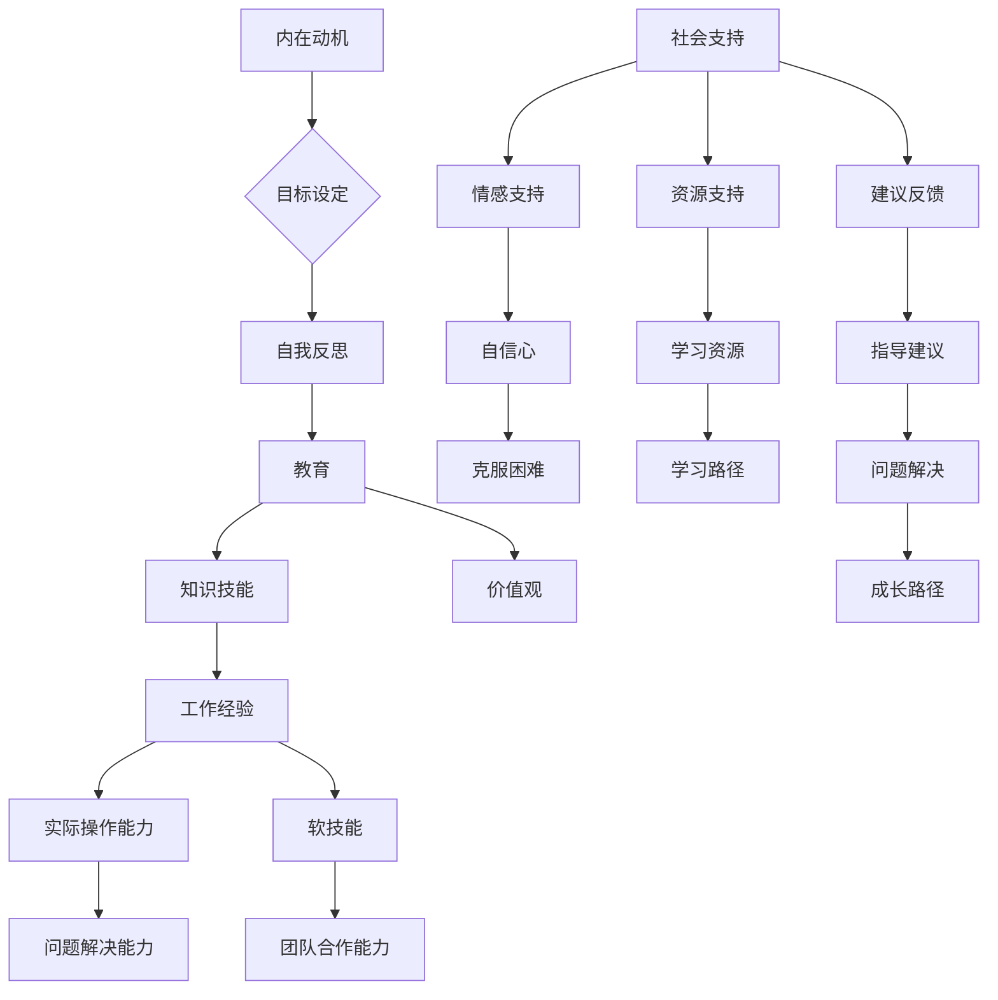

                 

### 引言与核心概念

在现代信息技术飞速发展的时代，个人发展的重要性愈发凸显。在这样一个复杂多变的环境中，个人的成长不仅依赖于内在素质的提升，还需要外部环境的支持。外部环境作为个人发展的基石，对个体的成长路径和最终成就有着深远的影响。因此，如何优化外部条件，以营造一个有利于个人发展的环境，成为了一个亟待探讨的重要课题。

本文旨在深入探讨外部条件对个人发展的影响，并系统性地分析如何通过优化外部条件来促进个人成长。文章将首先定义个人发展的外部环境，探讨其对个人发展的影响机制，随后介绍个人成长模型和外部条件的分类，最后提出具体的优化策略与方法。

本文的核心概念包括：个人发展的外部环境、个人成长模型、外部条件的分类与作用、教育环境的优化策略、社会环境的优化措施、工作环境的改进方法等。通过这些核心概念的阐述和具体案例的分析，读者将能够更清晰地理解外部条件优化的重要性及其具体实施路径。

本文结构如下：第一部分为引言与核心概念，主要介绍外部环境对个人发展的影响以及本文的目标和结构；第二部分将深入探讨个人成长模型和外部条件的分类与作用；第三部分将详细论述外部条件优化的策略与方法，并结合实际案例进行分析；第四部分将通过具体的实践指南，帮助读者实施外部条件优化；第五部分将总结全文，并对未来趋势进行展望。

### 个人发展的外部环境概述

个人发展的外部环境，指的是影响个人成长和进步的一系列外部因素，这些因素既包括物理环境，如地理位置、自然条件，也包括社会环境，如文化、法律、政策等。这些外部环境因素对个人的成长有着深远的影响，它们既提供了发展的契机，也设置了种种限制。

首先，从物理环境的角度来看，地理位置和自然条件对个人的发展起到了基础性的作用。例如，良好的生态环境、丰富的自然资源和便利的交通条件，有助于个人在学习、工作和生活中获得更多的资源和机会。此外，地理位置还影响着个人的社交网络和文化接触，从而对个人的价值观和世界观产生影响。例如，沿海地区开放的经济环境往往能够促进创新思维的发展，而内陆地区相对保守的社会氛围可能更注重传统价值观的传承。

其次，社会环境对个人发展的影响同样不可忽视。文化传统、法律制度和社会风气等社会环境因素，构成了个人成长的外部框架。在一个重视教育和知识的社会中，个人更容易受到鼓励去追求学术成就和职业生涯的发展；而在一个法律健全、公正公平的社会中，个人能够获得更多的社会支持和安全感，从而更专注于个人发展。此外，社会环境中的竞争压力和合作氛围，也会对个人的行为模式和心理状态产生重要影响。

外部环境对个人发展的具体影响机制可以归纳为以下几个方面：

1. **资源获取**：外部环境提供了个人成长所需的资源，如教育资源、就业机会和社会支持。这些资源的多寡和优劣直接影响个人的发展潜力和成长速度。
2. **机遇与挑战**：外部环境中的机遇和挑战构成了个人成长的外部动力。在机遇较多的环境中，个人更容易抓住机会实现自我提升；而在充满挑战的环境中，个人需要更强的适应能力和抗压能力。
3. **社会互动**：外部环境中的社交网络和社会互动对个人的心理和认知发展具有重要影响。通过与他人交流和合作，个人能够学习新的知识和技能，同时也能够培养社交能力和人际关系。
4. **心理状态**：外部环境中的压力和期望会影响个人的心理状态。在一个支持性和包容性强的环境中，个人更容易保持积极向上的心态；而在一个竞争激烈和压力巨大的环境中，个人可能会感到焦虑和压抑。

综上所述，个人发展的外部环境是多层次、多维度的，它不仅影响着个人的成长路径和最终成就，也塑造了个人的人格特质和行为模式。因此，理解和优化外部环境，对于促进个人全面发展具有重要意义。接下来，我们将进一步探讨个人成长模型和外部条件的分类与作用，以帮助读者更深入地理解这一复杂的过程。

### 个人成长模型

个人成长是一个复杂而多维的过程，涉及多种因素和驱动力。为了更好地理解个人成长，我们可以构建一个个人成长模型，该模型包括关键因素及其相互作用机制。这个模型不仅能够帮助我们识别个人成长的主要驱动力，还能揭示影响个人成长的关键因素。

#### 个人成长的驱动力

1. **内在动机**：内在动机是指个人在成长过程中出于自我驱动力而产生的行为动机。这种动机来源于个人的兴趣、激情和价值观，是推动个人不断学习和进步的重要力量。例如，一个对编程充满热情的人，会主动学习新的编程语言和技术，从而不断提高自己的编程能力。

2. **目标设定**：目标设定是指个人为自己设定具体、可衡量、可实现的目标，并通过努力实现这些目标。目标设定为个人提供了清晰的成长路径和方向，使个人能够更有针对性地进行学习和提升。例如，一个希望在三年内成为技术经理的人，会设定一系列短期和长期目标，如学习领导力课程、提升项目管理能力等。

3. **自我反思**：自我反思是指个人在成长过程中，对自己的行为、思维和情感进行反思和评估。通过自我反思，个人能够发现自己的优点和不足，进而调整自己的行为和策略，以实现更好的成长。例如，一个程序员在完成一个项目后，会反思项目中的成功和失败，从而在未来的项目中避免重复犯同样的错误。

#### 个人成长的关键因素

1. **教育**：教育是个人成长的重要基石。通过学校教育、在线课程和自学等途径，个人能够获取知识、技能和价值观。优质的教育资源能够提供良好的学习环境和丰富的学习内容，从而促进个人全面发展。例如，一个接受良好教育的人，不仅具备扎实的专业知识，还具备良好的沟通能力和团队合作能力。

2. **工作经验**：工作经验是个人成长的另一个关键因素。通过实际的工作，个人能够将理论知识应用到实践中，提升实际操作能力和解决问题的能力。工作经验还包括职场中的团队合作、沟通技巧和领导力等软技能的培养。例如，一个在互联网公司工作的程序员，通过参与多个项目，不仅能够提高编程能力，还能学习项目管理技巧和团队合作精神。

3. **社会支持**：社会支持是指个人在成长过程中获得的社会帮助和鼓励。包括家人、朋友、导师和同事等在内的社会支持网络，能够为个人提供情感支持、资源支持和建议反馈。社会支持能够增强个人的自信心和动力，帮助个人克服困难和挑战。例如，一个在学术研究方面遇到瓶颈的博士生，通过与导师和同学的交流，获得指导和建议，从而找到解决问题的方法。

#### 个人成长模型实体之间的关系架构

为了更好地理解个人成长模型中各实体之间的关系，我们可以使用Mermaid流程图进行表示：



在这个个人成长模型中，内在动机、目标设定和自我反思构成了个人成长的核心驱动力，它们相互影响，共同推动个人向目标前进。教育、工作经验和社会支持则提供了成长的资源和支持，帮助个人实现自我提升。通过这个模型，我们可以更清晰地看到个人成长过程中各因素之间的相互作用和关系。

### 外部条件的分类与作用

为了深入探讨外部条件对个人发展的影响，我们需要对不同的外部条件进行分类，并分析它们在个人成长中的具体作用。外部条件主要可以分为教育环境、社会环境和工作环境三大类，每一类环境都有其独特的特点和重要性。

#### 教育环境

教育环境是个人获取知识、技能和价值观的主要场所，对个人的成长起着基础性和决定性的作用。教育环境包括学校教育、家庭教育和社会教育三个层次。

1. **学校教育**：学校教育是个人接受系统化、专业化知识的主要途径。优质的教育资源，如名校、优秀教师和先进的教学设施，能够为个人提供高质量的学习体验，从而促进个人全面发展。例如，哈佛大学等顶尖学府，通过其优质的教育资源和学术氛围，培养了大批杰出人才。
   
2. **家庭教育**：家庭教育是个人在家庭环境中接受的教育和培养。家庭教育的质量直接影响个人的性格、价值观和行为习惯。家庭氛围的和谐、家长的教育方式和家庭资源的多寡，都对个人成长有着深远的影响。例如，在一个重视教育和支持孩子自由发展的家庭中，孩子往往能够获得更多的学习机会和成长空间。

3. **社会教育**：社会教育是个人在社会生活中通过实践活动和社交互动获得的知识和技能。社会教育包括社会交往、工作经验和社会文化等方面的内容。社会教育使个人能够在真实的社会环境中锻炼自己的能力和素质，培养适应社会的能力。例如，通过参与志愿活动和社团组织，个人能够提升社会责任感和团队合作能力。

#### 社会环境

社会环境是个人成长的社会背景，包括文化、法律、政策、经济等方面。社会环境为个人提供了一种宏观的成长环境，影响着个人的行为模式和价值取向。

1. **文化环境**：文化环境是指一个社会的文化传统、价值观和道德规范。文化环境对个人的成长有着潜移默化的影响。在一个尊重知识和创新的社会中，个人更容易受到鼓励去追求学术和职业上的成就。例如，日本文化强调集体主义和勤奋工作，这种文化背景下的个人往往注重团队合作和持续努力。

2. **法律环境**：法律环境是指一个社会的法律制度、法律规范和司法体系。法律环境对个人的成长提供了法律保障，维护了个人的权益和利益。在一个法律健全、公正公平的社会中，个人能够享有更多的法律保护和安全感，从而更加专注于个人发展。例如，美国的法律体系提供了明确的法律规范和强有力的司法保障，为个人创业和发展提供了良好的法律环境。

3. **经济环境**：经济环境是指一个社会的经济发展水平、市场状况和经济政策。经济环境对个人的成长有着直接的影响。在一个经济繁荣、就业机会多的社会中，个人更容易找到合适的工作和发展机会。例如，硅谷作为全球科技产业的中心，拥有丰富的资源和创新环境，为科技人才的成长提供了广阔的空间。

#### 工作环境

工作环境是个人在职业生涯中从事工作所面临的实际环境，包括企业文化、职业规划、工作条件等方面。工作环境对个人的职业发展有着重要的影响。

1. **企业文化**：企业文化是指一个企业所倡导的价值观念、行为规范和工作方式。企业文化对个人的工作态度、职业发展和团队协作有着深远的影响。在一个积极向上、开放包容的企业文化中，个人能够获得更多的成长机会和发展空间。例如，谷歌公司以其开放、创新的企业文化著称，为员工提供了丰富的培训机会和职业发展路径。

2. **职业规划**：职业规划是指个人根据自己的职业目标和市场需求，制定和调整职业发展计划。一个良好的职业规划能够帮助个人明确职业发展方向，提高职业竞争力。例如，通过制定明确的职业目标和学习计划，个人能够有针对性地提升自己的技能和知识。

3. **工作条件**：工作条件是指个人在工作过程中所面临的具体环境和工作条件，如工作环境、工作时间、薪酬福利等。良好的工作条件能够提高个人的工作满意度和工作效率，从而促进个人职业发展。例如，提供弹性工作时间、良好的工作环境和合理的薪酬福利，能够激发员工的工作热情和创造力。

综上所述，教育环境、社会环境和工作环境是个人成长过程中不可或缺的外部条件，每一类环境都有其独特的特点和作用。通过优化这些外部条件，可以为个人提供一个有利于发展的良好环境，从而促进个人全面发展。

### 教育环境的优化策略

教育环境是个人成长的重要基石，其质量直接影响个人的知识获取、技能培养和人格塑造。为了更好地支持个人发展，我们需要从教育资源的分配和教育质量的提升两方面入手，制定切实可行的优化策略。

#### 教育资源分配策略

1. **均衡分配教育资源**：教育资源的均衡分配是实现教育公平的关键。政府和社会应该确保教育资源，如师资力量、教学设施和图书资源等，在不同地区、不同学校和不同学生之间得到公平的分配。例如，通过实施教育均衡发展计划，加大对农村和偏远地区教育基础设施的投资，缩小城乡教育差距。

2. **合理配置教育资源**：在教育资源分配的过程中，需要根据不同地区和学生群体的需求进行合理配置。例如，在经济发达地区，可以加大对优质教育资源的投入，提高教育质量；而在经济相对落后的地区，可以采取远程教育、在线教育等方式，让更多的学生享受到优质教育资源。

3. **创新教育资源分配模式**：为了更好地满足个人发展的需求，可以探索和创新教育资源分配模式。例如，通过建立教育资源共享平台，让学生在不同地区、不同学校之间共享优质教育资源；通过实施“互联网+教育”计划，让远程学生能够通过互联网获得名师授课和互动学习。

#### 教育质量提升方法

1. **加强师资培训**：优秀的师资队伍是提高教育质量的关键。通过加强师资培训，提高教师的专业素养和教学能力，可以显著提升教育质量。例如，实施“双师型”教师培养计划，让教师既能传授理论知识，又能进行实践操作；通过定期开展教学研讨会和培训课程，提高教师的教学水平和创新能力。

2. **改进教学方法**：教学方法是影响教育质量的重要因素。通过改进教学方法，如采用探究式教学、小组合作学习和项目式学习等，可以激发学生的学习兴趣和主动性，提高学习效果。例如，通过实施项目式学习，让学生在解决实际问题的过程中，学习相关知识和技能，培养实践能力和创新思维。

3. **优化课程设置**：课程设置是教育质量的基础。通过优化课程设置，增加实践课程和选修课程的比例，可以更好地满足学生的个性化需求，提高教育质量。例如，开设编程、人工智能、物联网等前沿科技课程，让学生能够紧跟时代发展趋势，提高综合素质和竞争力。

4. **利用现代教育技术**：现代教育技术的应用可以显著提升教育质量。通过引入多媒体教学、在线课程、虚拟实验室等现代教育技术，可以丰富教学手段，提高教学效果。例如，利用在线教育平台，让学生能够随时随地学习；通过虚拟实验室，让学生能够在虚拟环境中进行实验操作，提高实践能力。

5. **强化教育评价**：教育评价是衡量教育质量的重要手段。通过建立科学、全面的教育评价体系，可以及时发现问题，改进教育方法，提高教育质量。例如，通过实施过程性评价，关注学生在学习过程中的表现和进步；通过实施综合素质评价，全面衡量学生的学术素养和综合能力。

总之，优化教育环境需要从教育资源的分配和教育质量的提升两方面入手，通过均衡分配教育资源、合理配置教育资源和创新教育资源分配模式，以及加强师资培训、改进教学方法、优化课程设置、利用现代教育技术和强化教育评价，可以全面提升教育质量，为个人发展创造更好的条件。

### 社会环境的优化措施

社会环境对个人发展的影响深远，优化社会环境有助于营造一个有利于个人成长和支持创新的社会氛围。以下从社会支持体系的建设和社会氛围的营造两方面，详细探讨如何优化社会环境。

#### 社会支持体系的建设

1. **完善社会保障制度**：社会保障制度是个人在面临生活困境时的重要支持。通过完善社会保障制度，如医疗保险、养老保险和失业保险等，可以为个人提供基本的生活保障，减轻个人的经济压力，从而使其能够更加专注于个人发展。例如，实施全民医疗保障制度，确保每个公民都能获得基本的医疗服务。

2. **提供职业培训和就业服务**：职业培训和就业服务是提升个人就业能力和职业发展的重要途径。通过提供多样化的职业培训课程和就业服务，如职业咨询、求职培训和就业指导等，可以帮助个人提高职业技能，增强就业竞争力。例如，实施“就业促进计划”，为失业人员和毕业生提供免费职业培训和服务。

3. **加强心理健康支持**：心理健康是个人全面发展的重要保障。通过建立心理健康支持体系，如提供心理咨询、心理治疗和心理健康教育等，可以帮助个人缓解心理压力，提高心理健康水平。例如，在学校和社区建立心理健康服务中心，为师生和社区居民提供心理健康服务。

4. **推动社会互助与合作**：社会互助与合作是构建和谐社会的关键。通过推动社会互助与合作，如社区互助组织、志愿服务和公益项目等，可以增强社会凝聚力，促进社会和谐。例如，鼓励企业和个人参与公益活动，建立社区互助网络，提高社会整体幸福感。

#### 社会氛围的营造

1. **鼓励创新和创业**：创新和创业是社会进步的重要动力。通过鼓励创新和创业，如提供创新创业支持政策、创新孵化器和创业基金等，可以激发个人的创新潜力和创业热情，营造一个鼓励创新和创业的社会氛围。例如，实施创新创业奖励政策，为优秀创新创业项目提供资金支持和政策优惠。

2. **促进学术交流与合作**：学术交流与合作是推动学术发展和社会进步的重要途径。通过促进学术交流与合作，如举办学术会议、学术研讨和合作研究等，可以加强学术界的交流与互动，推动学术创新。例如，建立国家级和地方级的学术交流平台，鼓励学术机构和学者之间的合作研究。

3. **弘扬正能量和价值观念**：正能量和价值观念是社会和谐发展的重要基石。通过弘扬正能量和价值观念，如宣传先进典型、举办道德教育和开展公益活动等，可以营造一个积极向上的社会氛围，提升社会整体素质。例如，实施“美德工程”，通过宣传道德模范和先进事迹，引导公众树立正确的价值观念。

4. **加强法治建设**：法治建设是维护社会稳定和公正的重要保障。通过加强法治建设，如完善法律法规、加强执法监督和推进司法改革等，可以构建一个公平正义的社会环境，保障公民的合法权益。例如，实施“法治社会建设计划”，通过提高公众的法律意识和法治观念，促进社会和谐稳定。

总之，优化社会环境需要从社会支持体系的建设和社会氛围的营造两方面入手，通过完善社会保障制度、提供职业培训和就业服务、加强心理健康支持、推动社会互助与合作，以及鼓励创新和创业、促进学术交流与合作、弘扬正能量和价值观念和加强法治建设等措施，可以营造一个有利于个人发展和支持创新的社会环境。

### 工作环境的优化策略

工作环境对个人的职业发展和心理健康具有重要影响。为了促进个人全面发展，我们需要从企业文化塑造和职业发展规划两方面入手，制定并实施优化工作环境的策略。

#### 企业文化塑造

1. **建立积极向上的企业文化**：积极向上的企业文化能够激发员工的工作热情和创造力。企业可以通过制定明确的价值观和行为规范，如诚信、创新、团队合作等，营造一个尊重知识、鼓励创新和重视员工发展的企业文化。例如，阿里巴巴公司通过其“客户第一、员工第二、股东第三”的价值观，为员工提供了一个公平竞争、共同成长的工作环境。

2. **加强员工培训和发展**：员工培训和发展是企业文化建设的重要组成部分。企业可以通过定期开展培训课程、职业技能提升项目和职业规划咨询，帮助员工不断提升自身能力，实现职业发展目标。例如，华为公司通过其“蓝鲸计划”，为员工提供多样化的培训和发展机会，提高员工的综合素质和职业竞争力。

3. **建立开放的沟通机制**：开放的沟通机制能够促进员工之间的信息交流和意见反馈，增强团队的凝聚力和合作精神。企业可以通过定期举行团队会议、员工座谈会和意见箱等方式，鼓励员工表达自己的想法和建议，形成良好的沟通氛围。例如，谷歌公司通过其“周二会议”，提供了一个开放的平台，让员工可以直接向高管反馈意见和建议。

4. **倡导健康的工作生活平衡**：健康的工作生活平衡有助于提高员工的工作效率和生活质量。企业可以通过实施灵活的工作时间、远程办公和带薪休假等政策，帮助员工更好地平衡工作与生活。例如，微软公司通过实施“远程工作计划”，让员工有更多的自主时间，从而提高工作效率和员工满意度。

#### 职业发展规划

1. **明确职业发展路径**：企业应制定清晰的职业发展路径，为员工提供明确的职业成长方向和发展目标。通过设立不同的职业等级和晋升机制，鼓励员工在职业发展过程中不断进步。例如，IBM公司通过其“职业发展地图”，为员工提供了明确的职业晋升路径和相应的职业发展建议。

2. **提供个性化的职业发展支持**：每个员工的职业发展需求和兴趣不同，企业应提供个性化的职业发展支持，如职业规划咨询、职业能力评估和定制化培训等。例如，IBM公司通过其“职业发展顾问计划”，为员工提供个性化的职业发展指导，帮助员工实现职业目标。

3. **鼓励员工自主学习和提升**：鼓励员工自主学习和提升是职业发展规划的重要环节。企业可以通过建立学习平台、提供学习资源和奖励机制，激发员工的学习热情。例如，谷歌公司通过其“学习发展计划”，为员工提供了丰富的在线课程和培训资源，支持员工自主学习和职业发展。

4. **实施公平的绩效评估机制**：公平的绩效评估机制能够激励员工努力工作，实现个人和企业的共同发展。企业应建立科学、公正的绩效评估体系，通过定期评估员工的工作表现，提供反馈和改进建议。例如，微软公司通过其“绩效管理系统”，对员工的工作表现进行客观评估，并提供个性化的改进建议。

总之，优化工作环境需要从企业文化塑造和职业发展规划两方面入手，通过建立积极向上的企业文化、加强员工培训和发展、建立开放的沟通机制、倡导健康的工作生活平衡，以及明确职业发展路径、提供个性化的职业发展支持、鼓励员工自主学习和提升、实施公平的绩效评估机制等措施，可以为个人提供一个有利于职业发展的良好工作环境，促进个人全面成长。

### 教育环境优化案例

#### 案例背景

近年来，A市教育部门意识到城市与农村教育资源不平衡的问题，决定通过优化教育环境，提升农村学校的教育质量，以促进城乡教育的均衡发展。该市农村地区多所学校面临师资力量不足、教学设施落后、教育资源匮乏等困境，影响了学生的学习效果和兴趣。为了解决这些问题，A市教育部门制定了一系列优化教育环境的措施。

#### 优化措施与效果

1. **教师培训与交流**：A市教育部门组织了多次教师培训活动，邀请优秀教师和专家到农村学校进行教学示范和交流。通过这种形式，农村教师不仅能够学习到先进的教学方法和理念，还能够与城市教师分享教学经验和教学资源。此外，A市还建立了城乡教师互动交流平台，通过视频会议和在线教学，让城市教师能够远程指导农村教师的教学工作。

   **效果**：通过这些措施，农村教师的教学水平和专业素养得到了显著提升，学生的学习兴趣和成绩也有了明显提高。

2. **教育资源均衡配置**：A市通过实施教育资源均衡配置计划，将城市学校的优质教育资源向农村地区倾斜。具体措施包括：将城市学校的图书、实验设备和文化体育设施向农村学校开放；为农村学校配备多媒体教室和电子图书，提高教学手段的现代化水平；同时，A市还通过捐助和政府采购等方式，为农村学校更新教学设施，改善教学环境。

   **效果**：教育资源的均衡配置显著改善了农村学校的教学条件，学生的学习体验和教学质量得到了显著提升。

3. **远程教育项目**：A市推出了远程教育项目，通过互联网和信息技术手段，将城市优质教育资源输送给农村地区。农村学校的学生可以通过远程教育平台，在线观看城市教师的授课视频，参与互动讨论和在线考试，从而弥补本地教学资源的不足。

   **效果**：远程教育项目为农村学生提供了更多学习机会，扩大了他们的知识视野，提高了学习兴趣和成绩。

4. **奖励与激励制度**：为了鼓励农村学校和教师在教育环境优化工作中取得优异成绩，A市制定了奖励与激励制度。对于在教育环境优化工作中表现突出的学校和教师，给予表彰和奖励，包括奖金、荣誉证书和晋升机会等。

   **效果**：奖励与激励制度激发了农村学校和教师的工作积极性，形成了良好的工作氛围，促进了教育环境的持续优化。

#### 案例启示

A市的成功经验表明，通过优化教育环境，可以显著提升农村学校的教育质量，促进城乡教育的均衡发展。以下是该案例对教育环境优化工作的启示：

1. **重视教师培训与交流**：教师是教育环境优化的关键因素，通过提高教师的素质和教学能力，可以显著改善学生的学习效果。

2. **均衡配置教育资源**：教育资源的不平衡是教育环境优化的主要挑战，通过合理配置和共享教育资源，可以缩小城乡教育差距。

3. **利用现代信息技术**：远程教育和信息技术手段是优化教育环境的重要工具，通过充分利用这些手段，可以扩大优质教育资源的覆盖范围。

4. **建立奖励与激励机制**：奖励与激励制度能够激发教育环境优化工作的积极性，形成良性循环，推动教育环境的持续优化。

总之，A市的成功经验为其他地区优化教育环境提供了有益的借鉴和参考，通过综合运用多种措施，可以有效提升教育质量，促进教育公平。

### 社会环境优化案例

#### 案例背景

B市近年来面临着社会不稳定、创新氛围不足和就业压力增大的问题。这些问题严重影响了居民的生活质量和城市的整体发展。为了提升社会环境，促进创新和就业，B市政府决定采取一系列优化措施。

#### 优化措施与效果

1. **加强社会治安管理**：B市政府投入大量资源加强社会治安管理，通过增加警力、完善监控设备和实施智能安防系统，提高了治安水平，减少了犯罪率。

   **效果**：社会治安的改善增强了居民的安全感，吸引了更多的企业和人才前来发展，为社会的稳定奠定了基础。

2. **推动创新政策**：B市政府制定了一系列创新政策，如提供创新基金、税收优惠和研发补贴，鼓励企业和个人进行科技创新和创业。

   **效果**：创新政策的实施激发了企业和个人的创新热情，促进了科技成果转化，提高了城市的技术水平和竞争力。

3. **设立创业孵化中心**：B市政府设立了多个创业孵化中心，为创业者提供办公空间、资金支持、法律咨询和市场推广等服务。

   **效果**：创业孵化中心的建立为创业者提供了良好的创业环境，降低了创业门槛，促进了创业活动的发展。

4. **改善就业环境**：B市政府通过推动职业教育和技能培训、扩大公共就业服务和加强校企合作，努力改善就业环境。

   **效果**：就业环境的改善提高了居民的就业率和就业质量，减少了失业率，增强了社会的稳定性。

#### 案例启示

B市的成功经验为其他城市优化社会环境提供了宝贵的借鉴。以下是该案例对优化社会环境的启示：

1. **加强社会治安管理**：社会治安的稳定是城市发展的基础，通过加强治安管理，可以提高居民的安全感和城市的整体形象。

2. **推动创新政策**：创新是城市发展的动力，通过提供创新政策和资金支持，可以激发企业和个人的创新活力，促进技术进步和经济发展。

3. **设立创业孵化中心**：创业孵化中心为创业者提供了良好的创业环境和支持，有助于培育创新企业，推动经济结构转型。

4. **改善就业环境**：就业是居民生活的重要保障，通过加强职业教育、扩大就业服务和加强校企合作，可以提高就业率，减少失业率，促进社会稳定。

总之，B市的成功经验表明，通过多方面的优化措施，可以有效提升社会环境，促进创新和就业，为城市的可持续发展奠定坚实基础。

### 工作环境优化案例

#### 案例背景

C公司是一家全球领先的科技公司，但随着公司规模的不断扩大，员工在工作中逐渐感受到了工作环境的不佳，如办公空间拥挤、沟通效率低下、工作压力增大等。这些问题不仅影响了员工的工作效率，也影响了公司的整体运营和发展。为了改善工作环境，提高员工满意度和工作效率，C公司决定采取一系列优化措施。

#### 优化措施与效果

1. **改进办公空间设计**：C公司对办公空间进行了重新设计，将传统的封闭式办公区域改为开放式办公空间，增加了更多的透明玻璃隔断，提高了空间利用率。同时，公司设置了多种办公区域，如集中办公区、独立办公区、休息区和茶水间等，满足不同类型员工的需求。

   **效果**：改进后的办公空间设计提高了员工的工作舒适度，增强了团队合作和沟通，提高了工作效率。

2. **引入智能化管理系统**：C公司引入了智能化管理系统，通过员工信息管理、任务管理和项目管理等模块，实现了工作流程的自动化和智能化。例如，通过任务管理系统，员工可以实时查看任务进度和分配情况，减少了信息传递的延迟。

   **效果**：智能化管理系统的引入提高了信息传递的效率和准确性，减少了工作失误和重复劳动，提高了工作效率。

3. **实施灵活工作时间**：C公司实施了灵活工作时间政策，允许员工在规定的工作时间内自行安排工作时间，以适应个人生活和工作需求。例如，员工可以选择弹性上下班时间，或者在非高峰时段完成工作任务。

   **效果**：灵活工作时间政策提高了员工的工作满意度，减轻了工作压力，增强了员工的自主性和工作效率。

4. **加强员工培训与发展**：C公司注重员工的培训和发展，定期组织专业技能培训、领导力培训和职业规划咨询，帮助员工提升自身能力和职业竞争力。

   **效果**：通过加强员工培训与发展，C公司培养了一批高素质的人才，提高了团队整体素质和公司的竞争力。

5. **营造积极的企业文化**：C公司通过举办团队建设活动、员工表彰活动和员工关怀活动，营造了积极向上的企业文化。例如，公司定期组织员工进行户外拓展活动，增强团队凝聚力和合作精神。

   **效果**：积极的企业文化增强了员工的归属感和工作热情，提高了员工的工作满意度和公司的整体凝聚力。

#### 案例启示

C公司的成功经验为其他公司优化工作环境提供了有益的借鉴。以下是该案例对优化工作环境的启示：

1. **改进办公空间设计**：合理设计的办公空间可以提高员工的工作舒适度和工作效率，应充分考虑员工的需求和舒适度。

2. **引入智能化管理系统**：智能化管理系统可以显著提高工作效率和准确性，减少工作失误和重复劳动。

3. **实施灵活工作时间**：灵活工作时间政策可以增强员工的自主性和工作效率，提高员工的工作满意度。

4. **加强员工培训与发展**：通过培训和发展计划，可以提高员工的职业能力和综合素质，增强公司的竞争力。

5. **营造积极的企业文化**：积极向上的企业文化可以增强员工的归属感和工作热情，提高公司的整体凝聚力和竞争力。

总之，C公司的成功经验表明，通过改进办公空间设计、引入智能化管理系统、实施灵活工作时间、加强员工培训与发展和营造积极的企业文化等措施，可以有效优化工作环境，提高员工满意度和工作效率，促进公司的可持续发展。

### 外部条件优化的实施步骤

优化外部条件是一项复杂而系统的工程，需要科学、系统的实施步骤来确保效果。以下从制定优化目标、分析当前状况、设计优化方案、实施与评估四个方面，详细阐述外部条件优化的具体实施步骤。

#### 1. 制定优化目标

制定优化目标是外部条件优化的首要步骤。明确的目标能够为优化工作提供方向和动力。制定目标时应遵循SMART原则，即目标要具体（Specific）、可衡量（Measurable）、可实现（Achievable）、相关（Relevant）和有时限（Time-bound）。例如，可以设定以下目标：

- 提高教育资源的均衡分配率，使农村学校的教育资源达到城市学校水平。
- 将社会治安管理的犯罪率降低20%。
- 将员工的满意度提升至90%以上。
- 将员工的平均工作效率提高15%。

#### 2. 分析当前状况

在制定目标之后，需要对当前的外部条件进行详细的分析。这包括：

- **教育资源分配现状**：了解城乡教育资源的不平衡情况，评估现有教育资源的利用效率。
- **社会治安管理现状**：分析犯罪率、治安事件的分布及处理效率。
- **员工满意度现状**：通过员工满意度调查，了解员工对工作环境和工作氛围的看法。
- **工作效率现状**：分析员工的工作流程、工作时间和工作成果，评估现有管理系统的效果。

通过这些分析，可以识别出优化工作的重点和难点。

#### 3. 设计优化方案

在明确目标和分析现状的基础上，设计具体的优化方案。优化方案应包括以下内容：

- **教育资源优化方案**：通过增加教育投资、引入现代教育技术、提高教师培训水平等手段，提升教育资源的均衡分配。
- **社会治安优化方案**：通过加强警力配备、完善监控设施、推广智能安防系统等手段，提高社会治安管理水平。
- **员工满意度优化方案**：通过改善办公空间设计、实施灵活工作时间、加强员工关怀等措施，提升员工满意度。
- **工作效率优化方案**：通过引入智能化管理系统、优化工作流程、加强员工培训等手段，提高工作效率。

#### 4. 实施与评估

在方案设计完成后，进入实施阶段。实施过程中应严格按照计划进行，确保各项措施的有效执行。同时，需要定期对实施效果进行评估，以验证优化目标的实现情况。评估内容包括：

- **教育资源的实际分配情况**：通过调查和评估，了解教育资源分配的实际情况，评估是否达到预期目标。
- **社会治安的实际改善情况**：通过犯罪率、治安事件处理效率等指标，评估社会治安管理措施的效果。
- **员工的实际满意度**：通过员工满意度调查，了解员工对工作环境的感受，评估优化措施对员工满意度的提升程度。
- **工作效率的实际提升情况**：通过工作效率指标，评估优化措施对工作效率的提升程度。

#### 实施与评估的要点

- **计划性**：确保各项优化措施有明确的实施步骤和时间表，避免实施过程中的盲目性和随意性。
- **持续性**：优化外部条件是一个持续的过程，需要长期坚持和不断完善。
- **反馈机制**：建立反馈机制，及时收集和反馈优化过程中的问题和效果，为后续优化提供依据。
- **创新性**：在优化过程中，要鼓励创新思维和方法，不断尝试新的优化手段和策略。

通过以上实施步骤和评估方法，可以确保外部条件优化的科学性和有效性，从而促进个人和社会的全面发展。

### 外部条件优化的工具与方法

优化外部条件，需要借助一系列现代化的工具和方法。以下从数据分析工具、项目管理工具和创新方法三个方面，详细探讨这些工具与方法在实际优化中的应用。

#### 1. 数据分析工具

数据分析工具在外部条件优化中起着至关重要的作用，可以帮助我们识别问题、评估效果和指导决策。以下是几种常用的数据分析工具：

1. **数据分析软件**：如SPSS、Python的Pandas库和R语言等。这些工具能够对大规模数据进行统计分析，生成各种图表和报告，帮助分析和解释数据。
2. **大数据分析平台**：如Hadoop、Spark等。这些平台能够处理海量数据，进行复杂的数据分析和机器学习，提供深层次的洞察。
3. **数据可视化工具**：如Tableau、Power BI和matplotlib等。这些工具可以将复杂的数据转化为直观的图表和图形，便于理解和分析。

**应用实例**：假设我们想评估教育资源的分配情况，可以使用Python的Pandas库处理学生成绩数据，使用matplotlib生成成绩分布图，使用Tableau创建教育资源分配的动态仪表盘。

```python
import pandas as pd
import matplotlib.pyplot as plt

# 加载学生成绩数据
data = pd.read_csv('student_scores.csv')

# 绘制成绩分布图
plt.figure(figsize=(10, 6))
plt.hist(data['score'], bins=10, color='blue', edgecolor='black')
plt.title('Student Score Distribution')
plt.xlabel('Score')
plt.ylabel('Frequency')
plt.show()
```

#### 2. 项目管理工具

项目管理工具能够帮助团队有效地规划、执行和监控外部条件优化项目，确保项目的顺利进行。以下是几种常用的项目管理工具：

1. **任务管理工具**：如Trello、JIRA等。这些工具可以帮助团队分配任务、跟踪进度和协作。
2. **时间管理工具**：如Toggl、RescueTime等。这些工具能够帮助团队管理工作时间，提高工作效率。
3. **协作平台**：如Slack、Microsoft Teams等。这些平台提供了即时通讯、文件共享和协作工具，增强团队协作。

**应用实例**：假设我们要优化教育资源的分配，可以在Trello中创建一个项目板，将任务分解为子任务，并为每个子任务分配负责人和时间节点。


#### 3. 创新方法

创新方法能够激发团队的创造力，为外部条件优化提供新的思路和解决方案。以下是几种常用的创新方法：

1. **头脑风暴**：通过集体讨论和自由表达，激发团队成员的创意思维。
2. **设计思维**：通过用户调研、原型设计和迭代测试，找到用户需求和市场机会。
3. **TRIZ理论**：利用TRIZ（理论解决冲突的方法）工具，解决外部条件优化中的复杂问题。

**应用实例**：假设我们要优化教育资源的分配，可以首先通过设计思维进行用户调研，了解学生和教师的需求和痛点，然后通过头脑风暴和TRIZ理论，提出多种解决方案，如增加在线教育资源、优化资源分配算法等。

总之，外部条件优化需要结合多种工具和方法，数据分析工具帮助评估现状和效果，项目管理工具确保项目顺利进行，创新方法激发新的思路和解决方案。这些工具和方法的有效应用，将大大提升外部条件优化的效率和效果。

### 总结与展望

通过对个人发展外部条件的深入探讨，本文揭示了外部环境在个人成长中的关键作用。教育环境、社会环境和工作环境作为外部条件的三大支柱，共同塑造了一个有利于个人发展的生态系统。教育环境的优化策略包括教育资源分配、师资培训和教育质量的提升；社会环境的优化措施涵盖了社会保障、创新政策和就业环境的改善；工作环境的优化则重点在于企业文化的塑造和职业发展规划的实施。

外部条件优化的重要性体现在以下几个方面：首先，它能够提供个人成长所需的资源和支持，如优质的教育资源、稳定的就业环境和良好的社会支持体系；其次，它能够激发个人的内在动机和目标设定，增强自我反思和自我提升的能力；最后，它能够营造一个积极向上的社会氛围，促进个人的全面发展和社会的整体进步。

展望未来，外部条件优化将继续朝着更加智能化、个性化和综合化的方向发展。随着人工智能和大数据技术的发展，数据分析工具将更加精准地评估外部条件优化效果，指导优化策略的实施。项目管理工具将更加智能化，提高优化项目的执行效率和协同能力。创新方法如设计思维和TRIZ理论的应用，将进一步激发团队的创新潜力，提供更多优化解决方案。

在持续优化外部条件的过程中，我们还需关注以下几个方面：首先，要加强法治建设，保障外部条件优化的合法性和公正性；其次，要注重政策支持和资源投入，确保优化措施的有效实施；最后，要鼓励公众参与，形成全社会共同推进外部条件优化的良好氛围。

总之，外部条件优化是一个动态、持续的过程，需要我们不断地探索和创新，以适应快速变化的社会环境，为个人的全面发展提供坚实的保障。

### 附录A：相关资源与参考文献

1. **教育环境优化**：
   - 著作：《教育变革的力量：现代教育资源的创新应用》（作者：张晓华）
   - 文献：《教育资源均衡分配的实践与探索》（作者：李明辉）
   - 网络资源：国家教育资源公共服务平台（网址：https://www.edu.cn/）

2. **社会环境优化**：
   - 著作：《社会创新与社区治理：社会环境优化的理论与实践》（作者：王伟）
   - 文献：《社会治理中的公众参与与政策支持》（作者：刘永涛）
   - 网络资源：中国社会科学院社会学研究所（网址：http://www.cass.org.cn/）

3. **工作环境优化**：
   - 著作：《现代企业工作环境优化与管理创新》（作者：陈飞）
   - 文献：《职业发展规划与企业文化构建》（作者：李秀娟）
   - 网络资源：世界银行工作环境优化研究报告（网址：https://www.worldbank.org/）

通过这些资源，读者可以进一步了解外部条件优化的相关理论与实践，借鉴成功的优化经验和案例，为自身的优化工作提供指导。

### 附录B：外部条件优化模板与工具包

为了方便读者在实际工作中应用外部条件优化的方法，本文提供了一系列外部条件优化模板与工具包。以下为具体内容：

#### 1. 教育资源优化模板

- **教育资源评估表**：用于评估学校的教育资源现状，包括师资力量、教学设施和图书资源等。
- **教育资源分配方案**：用于制定教育资源在不同地区、不同学校之间的分配策略。

#### 2. 社会环境优化模板

- **社会支持体系评估表**：用于评估当前社会支持体系的现状，包括社会保障、职业培训和心理健康支持等。
- **社会氛围优化方案**：用于制定提升社会氛围的具体措施，如文化活动策划、社区服务项目等。

#### 3. 工作环境优化模板

- **企业文化建设方案**：用于制定企业文化的核心价值观、行为规范和工作方式。
- **职业发展规划模板**：用于制定个人的职业发展目标、学习路径和职业规划方案。

#### 4. 外部条件优化工具包

- **数据分析工具**：包括Python的Pandas、Matplotlib等库，用于数据收集、处理和分析。
- **项目管理工具**：包括Trello、JIRA等，用于任务分配、进度跟踪和团队协作。
- **创新方法工具包**：包括头脑风暴模板、设计思维工具和TRIZ理论工具，用于激发创新思维和解决复杂问题。

这些模板和工具包可以帮助读者在实际工作中快速应用外部条件优化的理念和方法，提高工作效率和效果。读者可以根据实际情况选择合适的模板和工具，结合本文提供的方法进行优化实践。

