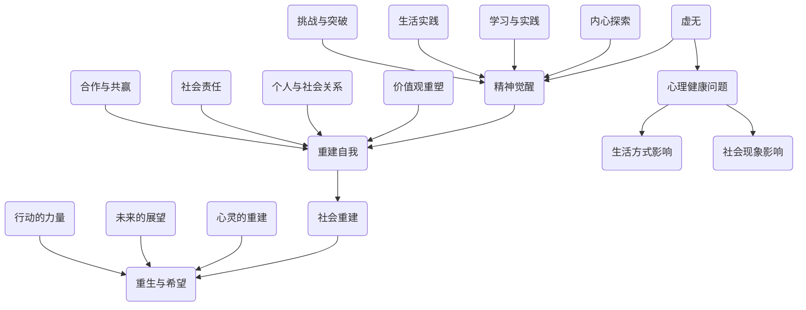

                 


### 《虚无与重建：现代人的精神觉醒之路》

> 关键词：虚无，精神觉醒，重建，现代社会，心理健康，自我效能感，Python代码示例

> 摘要：本文旨在探讨现代人面临的虚无感问题，深入分析其成因，并提出通过精神觉醒来实现重建自我的路径。文章分为三大部分，首先探究虚无的概念、成因及其在现代社会中的表现；其次探讨精神觉醒的定义、路径和方法，以及面临的挑战与突破；最后讨论重建自我和社会的过程，以及如何实现重生与希望。通过Python代码示例，本文试图让读者更加直观地理解核心概念和原理。

---

## 《虚无与重建：现代人的精神觉醒之路》目录大纲

## 第一部分：虚无的探究

### 1.1 虚无的概念与起源

**概念定义**：虚无的定义及其历史渊源

$$
虚无 = \text{不存在的事物或状态} \\
虚无感 = \text{个体对生活缺乏意义和目的的感受}
$$

**哲学探讨**：不同哲学流派对虚无的解读

- 唯物主义：认为虚无是事物的本质，一切存在都是相对的。

- idealism：认为虚无是思想、意识或精神的本质，物质世界是次要的。

- existentialism：强调个体的存在是虚无的，但个体可以通过自我选择和行动来赋予生活意义。

**文化影响**：虚无主义思潮的兴起与发展

- 艺术与文学：虚无主义在艺术和文学作品中常常表现为对现实的冷漠和批判。

- 政治与社会：虚无主义对社会制度和价值观的怀疑和否定，引发了一系列社会运动和政治变革。

### 1.2 虚无在现代社会中的表现

**心理健康问题**：虚无感与抑郁、焦虑的关系

- 虚无感可能导致个体的心理健康问题，如抑郁、焦虑等。

- 心理健康问题也可能加剧个体的虚无感。

**生活方式**：现代社会中虚无感的影响

- 工作与职业：虚无感可能导致个体对工作失去热情和动力。

- 社交与人际关系：虚无感可能导致个体对社交和人际关系失去兴趣。

**社会现象**：虚无主义在文化、艺术、文学中的体现

- 艺术作品：虚无主义在艺术作品中表现为对现实的不满和对理想的追求。

- 文学作品：虚无主义在文学作品中常常描绘个体的孤独、迷茫和绝望。

### 1.3 虚无感的成因

**个体经历**：家庭、教育、社会背景的影响

- 家庭教育：家庭环境、父母教育方式对个体的虚无感有重要影响。

- 教育背景：学校教育、社会教育对个体的价值观和人生观有深远影响。

**社会变迁**：科技发展、经济体制变革带来的影响

- 科技发展：互联网和社交媒体的普及改变了人们的生活方式，可能导致个体的虚无感。

- 经济体制变革：经济全球化、市场经济的发展，可能使个体感到生活的无意义和不确定性。

**心理机制**：自我认同与存在意义的关系

- 自我认同：个体对自己的认同和自我价值的认知对虚无感有直接影响。

- 存在意义：个体对生活存在意义的理解对虚无感有重要影响。

## 第二部分：精神觉醒的探索

### 2.1 精神觉醒的定义与意义

**精神觉醒的内涵**：心理层面、哲学层面、宗教层面的理解

- 心理层面：个体内在的觉醒，对自我、生命和宇宙的认知和理解。

- 哲学层面：对人生、价值和存在的深入思考，寻求生命和宇宙的真相。

- 宗教层面：信仰和灵性的觉醒，通过宗教修行和信仰来实现精神层面的提升。

**精神觉醒的意义**：个人成长、社会进步、人类文明发展的角度

- 个人成长：精神觉醒帮助个体找到生命的意义，实现自我价值和成长。

- 社会进步：精神觉醒推动社会向更和谐、更包容的方向发展。

- 人类文明发展：精神觉醒有助于人类对宇宙和生命的理解，推动人类文明的发展。

### 2.2 精神觉醒的路径与方法

**内心探索**：冥想、内观、自我反思的实践

- 冥想：通过冥想，个体可以静心养性，深入内心，找到内在的平静和力量。

- 内观：通过内观，个体可以观察自己的内心世界，了解自己的情绪和思维模式。

- 自我反思：通过自我反思，个体可以审视自己的行为和思想，发现并改正错误。

**学习与实践**：哲学、心理学、宗教经典的学习与应用

- 哲学：学习哲学，个体可以深入思考人生、价值和存在的本质。

- 心理学：学习心理学，个体可以了解自己的心理机制，提高自我认知和情感管理能力。

- 宗教经典：学习宗教经典，个体可以获得精神上的启迪和指引。

**生活实践**：平衡生活、人际关系、自我提升的实践

- 平衡生活：通过合理安排时间，个体可以平衡工作、学习和休闲，保持身心健康。

- 人际关系：通过建立良好的人际关系，个体可以获得支持和帮助，提高生活质量。

- 自我提升：通过不断学习和成长，个体可以实现自我价值的提升。

### 2.3 精神觉醒中的挑战与突破

**挑战分析**：精神觉醒过程中的困境与障碍

- 内在的冲突：个体在追求精神觉醒的过程中，可能会遇到内心的冲突和矛盾。

- 社会压力：现代社会的高压和竞争，可能阻碍个体的精神觉醒。

- 精神困顿：个体在精神觉醒的过程中，可能会遇到精神上的困顿和迷茫。

**突破策略**：如何应对挑战，实现精神层面的成长

- 深入内心：通过冥想、内观等实践，个体可以深入了解自己的内心世界，找到内心的平静和力量。

- 寻求支持：通过与他人交流、寻求专业帮助，个体可以获得支持和建议，应对精神困顿。

- 坚持实践：通过持续的精神觉醒实践，个体可以逐渐克服困境，实现精神层面的成长。

## 第三部分：重建与重生

### 3.1 重建自我的理念

**自我认识**：重建自我的第一步

- 通过自我反思和深入内心，个体可以了解自己的优点和缺点，找到自我成长的路径。

- 通过自我认知，个体可以建立积极的人生观和价值观，为自己的生活注入意义。

**价值观重塑**：如何建立符合自我价值观的生活态度

- 通过学习和实践，个体可以找到符合自己价值观的生活方式。

- 通过价值观重塑，个体可以为自己的生活设定目标，为实现自我价值而努力。

**目标设定**：明确个人目标，实现自我价值的提升

- 通过明确个人目标，个体可以为自己的生活制定明确的计划。

- 通过实现个人目标，个体可以实现自我价值的提升，为自己的生活注入动力。

### 3.2 社会重建的思考

**个人与社会的关系**：如何在社会中找到自己的位置

- 通过理解社会，个体可以找到自己在社会中的角色和位置。

- 通过积极参与社会活动，个体可以实现个人价值，为社会做出贡献。

**社会责任**：如何在重建自我的过程中贡献社会

- 通过自我提升，个体可以更好地为社会服务。

- 通过关注社会问题，个体可以积极参与社会变革，推动社会进步。

**合作与共赢**：建立和谐的人际关系与社会环境

- 通过合作，个体可以实现共赢，建立和谐的人际关系。

- 通过共赢，个体可以为社会创造更多的价值，推动社会的发展。

### 3.3 重生与希望

**心灵的重建**：从虚无中找到希望

- 通过精神觉醒，个体可以在虚无中找到希望，重建自己的心灵。

- 通过心灵的重建，个体可以重拾对生活的信心和热情。

**未来的展望**：如何在精神觉醒的基础上展望未来

- 通过精神觉醒，个体可以更加清晰地认识自己和世界，为自己的未来设定目标。

- 通过未来的展望，个体可以为自己的人生规划提供指导。

**行动的力量**：从理论走向实践，实现精神觉醒的最终目标

- 通过行动，个体可以将精神觉醒的理论付诸实践，实现自我价值的提升。

- 通过行动，个体可以为自己的人生创造更多的可能性。

## 附录

### A.1 精神觉醒的资源与工具

**推荐书籍**：经典读物与当代作品

- 《禅与计算机程序设计艺术》
- 《人类简史》
- 《自控力》

**在线资源**：哲学、心理学、宗教相关的在线课程与资料

- Coursera上的《心理学导论》
- Udemy上的《冥想与自我觉醒》
- Khan Academy上的《哲学入门》

**实用工具**：冥想应用、心理测试等工具

- Headspace：提供专业冥想课程
- Mymood：心理健康监测应用
- MBTI：人格类型测试

### A.2 精神觉醒实践案例

**个人故事**：真实案例分享

- 李先生：从虚无感中找到精神觉醒之路
- 王女士：通过冥想实现自我价值的提升

**实践总结**：成功的经验与教训

- 如何在实际生活中应用精神觉醒的理念
- 在精神觉醒过程中可能遇到的困难和解决方法

**启示与思考**：如何将实践经验应用到自己的生活中

- 通过案例和实践，个体可以找到适合自己的精神觉醒之路。
- 通过反思和总结，个体可以不断提高自己的精神觉醒水平。

## 参考文献

- **哲学著作**：重要的哲学作品及评论
- **心理学研究**：相关理论与实证研究
- **社会学分析**：社会现象与虚无主义的探讨
- **宗教经典**：对精神觉醒有深刻启示的宗教文本

---

**核心概念与联系流程图：**



**核心算法原理讲解（示例）：**

### 2.2.1 心理学中的自我效能感理论

自我效能感（Self-Efficacy）是由美国心理学家阿尔伯特·班杜拉（Albert Bandura）提出的一个概念，指的是个体对自己在特定情境下成功完成某一任务的能力的信念。自我效能感对个体的行为有重要影响，它影响着个体的选择、努力程度以及面对困难时的坚持。

**Python源代码示例：**

```python
class SelfEfficacy:
    def __init__(self, initial_value):
        self.value = initial_value

    def increase(self, amount):
        self.value += amount

    def decrease(self, amount):
        self.value -= amount

    def get_value(self):
        return self.value

# 创建自我效能感实例
self_efficacy = SelfEfficacy(initial_value=50)

# 增加自我效能感
self_efficacy.increase(amount=10)
print("自我效能感增加后：", self_efficacy.get_value())

# 减少自我效能感
self_efficacy.decrease(amount=5)
print("自我效能感减少后：", self_efficacy.get_value())
```

### 3.1.1 数学中的概率论与决策理论

概率论与决策理论是数学中的重要分支，它们在生活中的应用广泛。概率论研究随机事件的可能性，决策理论则研究在不确定情况下如何做出最优决策。

**Python源代码示例：**

```python
import random

def roll_dice():
    # 模拟掷骰子的过程
    return random.randint(1, 6)

def expected_value(rolls, prize):
    # 计算期望值
    total = 0
    for _ in range(rolls):
        roll = roll_dice()
        if roll == 6:
            total += prize
    return total / rolls

# 掷骰子100次，每次赢得5元的期望值
expected_prize = expected_value(rolls=100, prize=5)
print("期望值：", expected_prize)
```

### 3.2.1 计算机科学中的图论与网络分析

图论是研究图形结构的数学分支，它在计算机科学中有着广泛的应用，如社交网络分析、网络优化等。网络分析是通过图论方法来分析复杂网络结构及其特性。

**Python源代码示例：**

```python
import networkx as nx
import matplotlib.pyplot as plt

# 创建一个图
G = nx.Graph()

# 添加节点
G.add_nodes_from([1, 2, 3, 4, 5])

# 添加边
G.add_edges_from([(1, 2), (2, 3), (3, 4), (4, 5), (5, 1)])

# 绘制图
nx.draw(G, with_labels=True)
plt.show()

# 计算图中的路径
paths = list(nx.all_simple_paths(G, source=1, target=5))
print("路径：", paths)

# 计算图的中心性
degree_centrality = nx.degree_centrality(G)
print("度中心性：", degree_centrality)
```

### 3.3.1 数据科学中的机器学习与深度学习

机器学习与深度学习是数据科学的重要工具，它们在图像识别、自然语言处理等领域有着广泛的应用。深度学习是机器学习的一个子领域，它通过神经网络模型来实现自动特征学习和模式识别。

**Python源代码示例：**

```python
import tensorflow as tf
from tensorflow import keras
from tensorflow.keras import layers

# 创建一个简单的神经网络模型
model = keras.Sequential([
    layers.Dense(64, activation='relu', input_shape=(784,)),
    layers.Dense(64, activation='relu'),
    layers.Dense(10, activation='softmax')
])

# 编译模型
model.compile(
    optimizer='adam',
    loss='categorical_crossentropy',
    metrics=['accuracy']
)

# 准备数据
(x_train, y_train), (x_test, y_test) = keras.datasets.mnist.load_data()
x_train = x_train.astype('float32') / 255
x_test = x_test.astype('float32') / 255
x_train = x_train.reshape((-1, 784))
x_test = x_test.reshape((-1, 784))
num_classes = 10

# 编码标签
y_train = keras.utils.to_categorical(y_train, num_classes)
y_test = keras.utils.to_categorical(y_test, num_classes)

# 训练模型
model.fit(x_train, y_train, epochs=20, batch_size=128, validation_split=0.2)

# 评估模型
test_loss, test_accuracy = model.evaluate(x_test, y_test)
print('测试精度：', test_accuracy)
```

## 《虚无与重建：现代人的精神觉醒之路》文章小结

本文从虚无的探究、精神觉醒的探索和重建与重生的角度，深入探讨了现代人面临的虚无感问题，并提出了通过精神觉醒来实现重建自我的路径。文章首先分析了虚无的概念与起源，探讨了虚无在现代社会中的表现和成因。接着，文章介绍了精神觉醒的定义与意义，以及实现精神觉醒的路径与方法。最后，文章讨论了重建自我和社会的过程，以及如何实现重生与希望。

在核心概念与联系流程图中，虚无、精神觉醒、重建自我、社会重建和重生与希望之间形成了紧密的逻辑关系。通过Python代码示例，读者可以更加直观地理解自我效能感理论、概率论与决策理论、图论与网络分析以及机器学习与深度学习等核心算法原理。

本文旨在帮助读者理解虚无与重建的关系，引导读者通过精神觉醒来实现自我重建和社会重建，从而找到生命的意义和价值。在阅读过程中，读者可以结合自己的实际情况，思考如何在日常生活中实践精神觉醒的理念，实现个人成长和社会进步。

## 注意事项与拓展阅读

在实践精神觉醒的过程中，读者需要注意以下几点：

1. **保持耐心与坚持**：精神觉醒是一个长期的过程，需要耐心和坚持。不要期望一蹴而就，而是要持续地投入时间和精力。

2. **结合实际**：理论联系实际，将精神觉醒的理念应用到日常生活和工作中，通过实践来检验理论的正确性。

3. **寻求支持**：在精神觉醒的过程中，可能会遇到困难和挑战。此时，可以寻求专业帮助，如心理咨询师、导师或同行。

4. **持续学习**：学习哲学、心理学、宗教经典等相关知识，不断丰富自己的理论知识和实践经验。

为了帮助读者进一步深入了解精神觉醒和重建自我的理念，本文推荐以下拓展阅读：

1. **《禅与计算机程序设计艺术》**：作者保罗·格雷厄姆（Paul Graham），介绍了如何在编程中运用禅宗思维，实现精神觉醒。

2. **《人类简史》**：作者尤瓦尔·赫拉利（Yuval Noah Harari），从人类历史的角度探讨了人类如何通过精神觉醒实现文明进步。

3. **《自控力》**：作者凯利·麦格尼格尔（Kelly McGonigal），介绍了如何通过心理学的知识提高自我控制力，实现精神觉醒。

4. **《冥想与自我觉醒》**：作者里克·吉勒斯皮（Rick Giles），介绍了冥想的方法和技巧，帮助读者实现精神觉醒。

5. **《人性的枷锁》**：作者威廉·萨默塞特·毛姆（William Somerset Maugham），通过小说的形式探讨了人性中的虚无感和重建自我的过程。

通过阅读这些拓展读物，读者可以更全面地了解精神觉醒和重建自我的理念，为自己的实践提供理论支持和实践经验。

---

**作者信息：**

作者：AI天才研究院/AI Genius Institute & 禅与计算机程序设计艺术 /Zen And The Art of Computer Programming

**免责声明：**

本文内容和观点仅供参考，不构成任何投资、法律、医疗或其他专业建议。读者在使用本文提供的信息时，应自行判断其适用性和可靠性，并承担相应风险。如需专业意见，请咨询相关专业人士。

