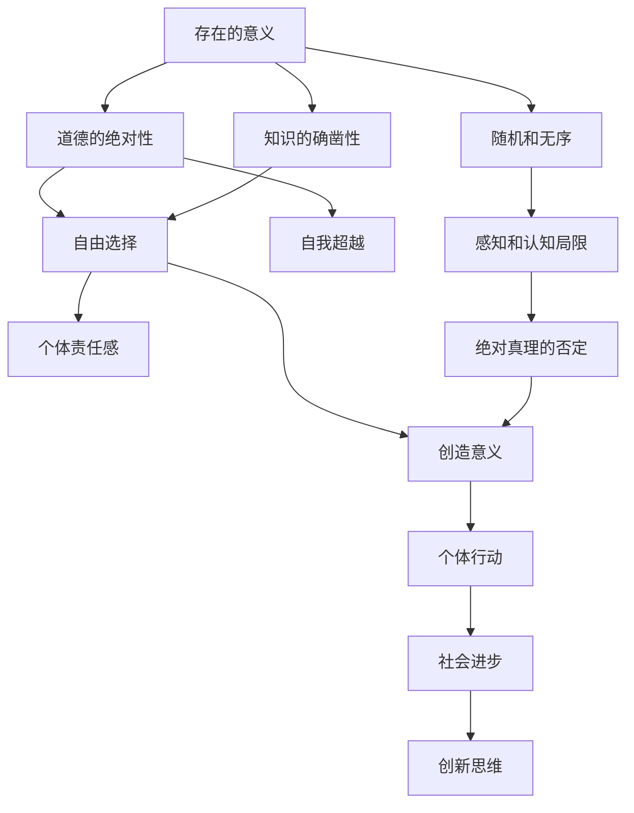

                 

### 背景介绍

虚无主义，这一哲学思想流派，源于对现实世界的质疑和对存在意义的探讨。它主张，宇宙和生命本身缺乏固有的意义和目的，人类的一切追求和信仰都只是虚幻的幻觉。虚无主义的核心观点是：由于人类的感知和认知能力的局限性，我们无法确定任何绝对真理或终极目的，因此，所有的价值和意义都应受到质疑和反思。

虚无主义的思想并非凭空而生，其根源可以追溯到古代哲学。例如，古希腊哲学家赫拉克利特曾提出，世界是无序的、不确定的，而人类试图为其寻找意义，却注定会失败。这种观点在后来的西方哲学中不断演变和发展，尤其在现代哲学中，虚无主义成为了一种重要的思想潮流。

在20世纪，虚无主义得到了进一步的推广和深化。尼采的“上帝已死”宣言，标志着传统价值观的崩溃，他认为，个体需要通过自我超越，找到自己的价值和意义。萨特的存在主义哲学则进一步将虚无主义推向极端，强调人类在存在中的自由选择和责任。

然而，虚无主义并非全然消极，它也激发了一种强烈的创新思维。面对虚无主义的质疑，人们开始重新审视自己和社会，寻求新的价值和意义。创新思维，正是在这种质疑和探索中诞生的。它强调，通过不断质疑现状，打破常规思维，寻找新的解决方案，从而推动社会和科技的进步。

在科技领域，虚无主义和创新思维的结合尤为显著。例如，计算机科学中的许多突破，如人工智能、量子计算等，都是在对传统理论和方法的质疑中，找到新的发展方向。可以说，虚无主义不仅为创新思维提供了理论基础，也为其注入了动力。

本文将围绕虚无主义与创新思维的关系，探讨以下核心问题：

1. 虚无主义的核心概念和哲学背景。
2. 创新思维的基础理论和方法。
3. 虚无主义如何激发创新思维，并产生新的可能性。
4. 实际案例中虚无主义和创新思维的结合与影响。

通过逐步分析这些主题，我们希望揭示虚无主义与创新思维之间的深刻联系，以及它们如何在质疑中寻找新的可能性。

### 虚无主义的核心概念与哲学背景

虚无主义的核心概念可以追溯到对宇宙和生命的根本质疑。它主张，宇宙和生命本身缺乏固有的意义和目的，人类的一切追求和信仰都只是虚幻的幻觉。这种观点否定了传统哲学中的许多基本假设，如存在的目的、道德的绝对标准以及知识的确凿性。

首先，虚无主义质疑存在的意义。它认为，宇宙和生命是随机的、无序的，没有预设的目标或设计。这种观点可以追溯到古希腊哲学家赫拉克利特，他提出世界是无序的、不确定的，而人类试图为其寻找意义，却注定会失败。赫拉克利特的思想为后来的虚无主义提供了哲学基础。

其次，虚无主义挑战道德的绝对性。它认为，道德规范并非天生的，而是人类为了维护社会秩序而创造的。虚无主义者主张，个体应该摆脱这些人为的道德束缚，追求自由和真实。这种观点在尼采的哲学中得到了充分体现，尼采认为，道德是一种自我欺骗，个体需要通过自我超越，找到自己的价值和意义。

虚无主义还质疑知识的确凿性。它认为，由于人类的感知和认知能力的局限性，我们无法确定任何绝对真理或终极目的。这种观点在存在主义哲学中得到了进一步发展。萨特的存在主义强调，人类在存在中是自由的，但同时也面临着选择的责任。由于没有预设的目的或指导，个体必须通过自己的选择和行动来创造意义。

虚无主义的核心概念可以概括为：质疑存在的意义、挑战道德的绝对性以及否定知识的确凿性。这些概念虽然看似消极，但它们为创新思维提供了重要的理论基础。

在哲学背景方面，虚无主义的发展可以追溯到19世纪末和20世纪初。这个时期，欧洲经历了两次世界大战和工业革命的冲击，传统价值观受到严重挑战。许多哲学家开始质疑现代社会的基础，尼采和萨特等人的思想成为这一时期的代表。

尼采的“上帝已死”宣言标志着传统价值观的崩溃。他认为，宗教和道德都是对人类自由的束缚，个体应该摆脱这些束缚，追求真实的存在。尼采的这种思想对后来的虚无主义和存在主义产生了深远影响。

萨特的存在主义哲学则进一步将虚无主义推向极端。他认为，人类在存在中的自由选择和责任是不可逃避的。萨特主张，通过自由选择，个体可以创造出自己的意义，但这种选择也意味着个体必须承担相应的责任。这种观点强调了个体在创造意义过程中的主动性和创造性。

虚无主义的核心概念和哲学背景虽然较为悲观，但它们揭示了人类存在的本质困境，为创新思维提供了深刻的启示。通过质疑传统观念和价值观，虚无主义促使人们重新审视自己和世界，从而激发出新的思维方式和创新的可能性。

### 虚无主义的核心概念实体关系架构 Mermaid 流程图

为了更直观地展示虚无主义的核心概念和它们之间的关系，我们可以使用 Mermaid 流程图来描述。以下是虚无主义的核心概念实体关系架构的 Mermaid 图：



在这个流程图中，A 表示存在的意义，B 表示道德的绝对性，C 表示知识的确凿性。虚无主义质疑这些传统概念，认为它们缺乏基础，因此提出了质疑。D 表示自由选择，这是虚无主义的核心之一，认为个体在无意义的世界中必须通过自由选择来寻找意义。E 表示个体责任感，这是自由选择的结果，意味着个体必须为自己的选择和行动承担责任。F 表示自我超越，这是尼采思想的核心，主张个体需要超越传统的道德束缚，寻找真实的存在。G 表示随机和无序，这是对宇宙和生命本质的描述，认为它们缺乏预设的目标或设计。H 表示感知和认知局限，这是对人类认知能力的局限性的描述，认为我们无法确定任何绝对真理。I 表示绝对真理的否定，这是对知识的确凿性的质疑，认为没有绝对真理。J 表示创造意义，这是自由选择和个体责任感的结果，通过个体的行动和选择来创造意义。K 表示个体行动，这是实现创造意义的具体行动。L 表示社会进步，这是个体行动对社会的影响，通过个体的创新和进步推动社会的进步。M 表示创新思维，这是虚无主义和创新思维结合的结果，通过质疑传统观念和价值观，激发出新的思维方式和创新的可能性。

通过这个 Mermaid 流程图，我们可以清晰地看到虚无主义的核心概念及其相互关系，以及这些概念如何推动创新思维的发展。

### 创新思维的基础理论

创新思维是一种通过质疑现状、打破常规、寻找新解决方案的思维模式。它不仅是一种能力，更是一种方法论，能够帮助我们在面对复杂问题时找到独特的解决途径。要深入理解创新思维，我们需要从其构成要素、发展阶段和核心方法三个方面进行分析。

#### 构成要素

创新思维的构成要素主要包括以下几个方面：

1. **问题识别**：创新思维始于对问题的识别和定义。一个敏锐的问题识别能力是创新思维的基础，它要求我们能够从日常生活中的琐事中发现潜在的问题，从而激发创新的灵感。

2. **信息收集**：在识别问题后，收集与问题相关的信息至关重要。这不仅包括直接的数据和事实，还包括来自不同领域和视角的观点和见解。丰富的信息储备能够为创新提供源源不断的素材。

3. **联想与关联**：创新思维的一个重要特点就是能够将看似不相关的事物联系起来，形成新的见解和解决方案。这种能力依赖于我们的联想能力和对事物之间关联的敏锐洞察。

4. **批判性思维**：批判性思维是指对现有观念和方法的质疑和评估能力。通过批判性思维，我们能够挑战传统观念，发现其局限性和改进的空间。

5. **创造力**：创造力是创新思维的核心要素，它体现在能够产生新颖和有价值的想法。创造力不仅依赖于个人的天赋，还需要通过实践和训练不断提升。

#### 发展阶段

创新思维的发展可以分为以下几个阶段：

1. **准备阶段**：在这个阶段，我们主要进行问题的识别和信息收集。通过对问题的深入理解和信息的广泛积累，为后续的创新过程打下基础。

2. **孕育阶段**：在孕育阶段，我们开始进行内部的思考和信息整合。这个阶段可能需要较长的时间，因为创新思维往往需要经过反复的思考和碰撞才能形成。

3. **启发阶段**：在启发阶段，我们可能会受到外部的启示或灵感，这些启示往往能够推动我们突破思维的局限，产生新的想法。

4. **实现阶段**：在实现阶段，我们将新的想法转化为具体的行动。这一阶段需要将创意与实际操作相结合，通过实验和验证来验证其可行性。

5. **评估阶段**：在评估阶段，我们会对创新成果进行评估和优化。通过评估，我们可以发现创新过程中的不足，并进行改进，使其更加完善。

#### 核心方法

创新思维的核心方法包括以下几个方面：

1. **头脑风暴**：头脑风暴是一种集体思维活动，通过快速产生大量的想法，从而激发创新的灵感。在头脑风暴中，鼓励自由发言，不限制想法的荒谬程度，最终筛选出可行的创意。

2. **思维导图**：思维导图是一种图形化的思维工具，通过将信息以分支结构的形式呈现，帮助人们梳理思路，发现事物之间的关联。思维导图能够促进创新思维的发散和整合。

3. **设计思维**：设计思维是一种以人为本的创新方法，强调用户需求和体验。通过设计思维，我们能够从用户的角度出发，设计出更加符合用户需求的产品和服务。

4. **原型迭代**：原型迭代是一种通过快速构建和测试原型，不断迭代和优化的方法。通过原型迭代，我们能够在短时间内验证创意的可行性，并及时调整和改进。

5. **跨界合作**：跨界合作是创新思维的一种重要方式，通过不同领域专家的协作，能够产生新的思维碰撞和创意。跨界合作能够打破传统的思维框架，激发创新的可能性。

通过理解创新思维的构成要素、发展阶段和核心方法，我们可以更好地培养和运用创新思维，从而在面对复杂问题时找到新的解决方案。创新思维不仅是一种能力，更是一种生活方式，它能够推动我们在质疑中寻找新的可能性，不断推动个人和社会的进步。

### 创新思维的核心方法与实践

创新思维的核心方法与实践是理解和应用这些方法的关键。以下我们将详细探讨几种关键方法，包括头脑风暴、思维导图、设计思维和原型迭代，并举例说明如何在实际中应用这些方法。

#### 头脑风暴

头脑风暴是一种通过集体思维产生大量创意的方法。其核心原则是自由思考，不评价和限制任何想法，让创意自由流动。以下是头脑风暴的具体步骤和实践：

1. **准备阶段**：明确问题或挑战，确保所有参与者都了解背景和目标。

2. **规定时间**：通常设定20-30分钟的时间，以确保讨论的效率和集中度。

3. **自由发言**：每个参与者轮流发言，提出任何与问题相关的想法，无论多么不切实际。

4. **记录想法**：在白板或笔记本上记录所有想法，确保不遗漏任何创意。

5. **后续整理**：在头脑风暴结束后，对记录的想法进行整理和筛选，将不相关或重复的想法去除，对可行的创意进行进一步的讨论和发展。

**实践示例**：假设我们要开发一款新型智能手表，以下是一个头脑风暴的例子：

- 参与者1：我们可以在手表上增加健康监测功能。
- 参与者2：手表应该具备防水功能，适合各种环境。
- 参与者3：我们可以集成GPS功能，帮助用户追踪运动路线。
- 参与者4：加入触摸屏，方便用户操作。

通过这个例子，我们可以看到，头脑风暴帮助我们从多个角度提出了许多创意，为产品的开发提供了丰富的思路。

#### 思维导图

思维导图是一种将信息以图形化的方式呈现的工具，有助于梳理思路和发现事物之间的关联。以下是创建思维导图的基本步骤：

1. **确定中心主题**：在思维导图中央绘制一个圆形或方框，标记核心问题或主题。

2. **绘制分支**：从中心主题出发，绘制出主要的分支，每个分支代表一个主要的思想或方向。

3. **添加子分支**：在每个主要分支下，继续绘制子分支，细化每一个思想。

4. **使用关键词和图像**：为了更直观，使用关键词和图像来表示每个分支和子分支。

5. **连接和整理**：将相关分支和子分支连接起来，形成一个完整的思维网络。

**实践示例**：假设我们要策划一场科技展会，以下是一个思维导图的例子：

```
科技展会
├── 展品展示
│   ├── 人工智能
│   │   ├── 智能家居
│   │   └── 自动驾驶
│   ├── 量子计算
│   └── 生物科技
├── 技术讲座
│   ├── 创新思维
│   ├── 新兴技术趋势
│   └── 项目案例分享
└── 展商交流
    ├── 现场洽谈
    ├── 线上互动
    └── 合作签约
```

通过这个思维导图，我们可以清晰地看到展会的各个部分及其相互关系，有助于全面规划和执行。

#### 设计思维

设计思维是一种以人为本的创新方法，强调理解用户需求、构建原型和迭代优化。以下是设计思维的主要步骤：

1. **理解用户**：通过访谈、观察和用户调研，深入了解目标用户的需求和痛点。

2. **定义问题**：基于用户需求，明确要解决的问题或目标。

3. **创意生成**：运用头脑风暴、思维导图等方法，生成多种可能的解决方案。

4. **构建原型**：快速构建最小可行性产品或服务原型，进行初步验证。

5. **用户测试**：将原型展示给用户，收集反馈，了解其使用体验。

6. **迭代优化**：根据用户反馈，对原型进行改进和优化，再次测试，直至满足用户需求。

**实践示例**：假设我们要设计一个在线教育平台，以下是一个设计思维的例子：

1. **理解用户**：通过访谈教师和学生，了解他们在使用现有在线教育平台时的困难和需求。

2. **定义问题**：发现教师需要更方便的课件管理和学生互动功能，学生希望有更多个性化学习资源。

3. **创意生成**：生成多个解决方案，如增加互动功能、改进课件管理、提供个性化学习路径等。

4. **构建原型**：开发一个简单的MVP（最小可行性产品），包括基本的课件管理和学生互动功能。

5. **用户测试**：邀请一组教师和学生试用平台，收集他们的反馈。

6. **迭代优化**：根据反馈，改进课件管理和互动功能，再次测试，确保满足用户需求。

通过这个设计思维的过程，我们能够开发出更符合用户需求的教育平台，提高用户满意度。

#### 原型迭代

原型迭代是通过快速构建和测试原型，不断迭代和优化的方法。以下是原型迭代的主要步骤：

1. **定义目标**：明确要解决的问题或目标，确保团队对项目有共同的理解。

2. **构建原型**：使用低成本的工具和方法，快速构建一个简单的原型。

3. **用户测试**：将原型展示给用户，收集他们的反馈和使用体验。

4. **分析反馈**：对用户反馈进行详细分析，找出原型中的问题和改进点。

5. **迭代优化**：根据分析结果，对原型进行改进和优化。

6. **再次测试**：重复测试过程，确保每次迭代都有实质性的改进。

**实践示例**：假设我们要开发一款手机游戏，以下是一个原型迭代的例子：

1. **定义目标**：明确游戏的类型、目标用户和核心玩法。

2. **构建原型**：使用游戏引擎开发一个简单的游戏原型，包括基本的游戏机制和界面。

3. **用户测试**：邀请一些目标用户测试游戏，收集他们对游戏难度、玩法和界面的反馈。

4. **分析反馈**：分析用户反馈，发现游戏难度过高和界面设计不友好。

5. **迭代优化**：调整游戏难度，优化界面设计，增加用户互动元素。

6. **再次测试**：邀请用户重新测试游戏，确保改进点被接受。

通过原型迭代，我们能够迅速发现和解决问题，提高产品的质量和用户满意度。

通过以上对创新思维核心方法与实践的详细探讨，我们可以看到，这些方法在实际应用中具有重要的作用，能够帮助我们更好地应对复杂问题，推动创新和进步。

### 实际案例中的虚无主义与创新思维的结合

虚无主义与创新思维的结合在实际案例中展现出了强大的推动力。通过以下几个具体案例，我们可以看到这两种思想如何相互补充，推动社会和科技的发展。

#### 案例一：特斯拉与电动汽车革命

特斯拉的创始人埃隆·马斯克（Elon Musk）是一位深受虚无主义思想影响的创新者。他坚信，人类面临的能源危机和气候变化问题需要通过革命性的技术来解决。特斯拉的电动汽车项目就是一个典型的结合了虚无主义和创新思维的案例。

**虚无主义的影响**：马斯克受虚无主义影响，质疑传统的汽车产业和能源体系。他认识到，石油资源有限，而依赖石油的汽车产业对环境造成了巨大的破坏。因此，他决定挑战这个传统体系，寻找新的解决方案。

**创新思维的运用**：特斯拉通过创新思维，开发出了高性能、高续航的电动汽车，并推动了整个电动汽车行业的革命。特斯拉的电池技术和电动动力系统不仅提高了电动汽车的性能，还大幅降低了生产成本，使其更加普及。

**成果与影响**：特斯拉的电动汽车项目不仅改变了人们对汽车和能源的传统观念，还为电动汽车行业的发展奠定了基础。特斯拉的成功激励了更多企业投入到电动汽车的研发中，推动了整个行业的进步。

#### 案例二：开源软件与互联网革命

开源软件的发展是虚无主义与创新思维结合的另一个典型例子。开源软件运动起源于对传统软件许可模式的质疑，认为软件应该开放源代码，让社区成员共同参与开发，从而推动技术的进步。

**虚无主义的影响**：开源软件运动的发起者认为，传统的软件许可模式限制了技术的传播和发展。他们质疑，为什么软件应该被私有化，而不应该作为一种公共资源，让更多的人受益。

**创新思维的运用**：开源软件运动通过创新思维，创造了一种新的软件开发模式。开发者可以自由地共享代码，共同改进软件，这不仅提高了软件的质量，还加速了技术的传播。

**成果与影响**：开源软件的成功案例不胜枚举，如Linux操作系统、Apache Web服务器等。这些开源软件不仅广泛应用于企业和个人，还推动了互联网技术的发展。开源软件模式改变了软件开发的传统模式，促进了技术的快速进步。

#### 案例三：硅谷创业生态

硅谷作为全球科技创新的中心，是虚无主义与创新思维结合的最佳体现。硅谷的创业生态鼓励创业者质疑现状，寻找新的商业机会，并通过创新思维实现这些机会。

**虚无主义的影响**：硅谷的创业者们受到虚无主义思想的影响，对传统产业和商业模式持怀疑态度。他们相信，通过创新，可以颠覆现有的市场格局，创造新的价值。

**创新思维的运用**：硅谷的创业者们运用创新思维，不断探索新的技术和商业模型。他们通过快速原型迭代和用户测试，迅速验证和改进自己的创意。

**成果与影响**：硅谷的创业生态催生了无数成功的科技公司，如谷歌、苹果、Facebook等。这些公司不仅改变了人们的日常生活，还推动了整个社会的进步。硅谷的成功证明了虚无主义与创新思维结合的巨大潜力。

通过这些案例，我们可以看到，虚无主义与创新思维的结合不仅推动了技术和社会的发展，还激发了无限的创意和可能性。虚无主义的质疑精神促使我们不断反思和改进，而创新思维则提供了实现这些改进的工具和方法。在虚无主义和创新思维的共同推动下，我们能够迎接未来的挑战，实现更加美好的未来。

### 虚无主义与创新思维的碰撞与融合

虚无主义与创新思维的碰撞与融合，为个体和社会带来了深远的影响。首先，虚无主义通过质疑传统价值观和既有体系，激发了个体的独立思考能力。在面对无意义和不确定性的世界中，个体需要通过自我探索和反思，寻找自己的价值和方向。这种独立思考能力是创新思维的基础，它促使个体跳出传统框架，寻找新的解决方案。

其次，创新思维则为虚无主义提供了具体的实践路径。通过质疑和打破现状，个体可以运用创新思维，发现新的问题和机遇。例如，特斯拉的创始人埃隆·马斯克受到虚无主义思想的影响，质疑传统汽车产业和能源体系，但通过创新思维，他成功地推动了电动汽车和可再生能源技术的发展。这种结合不仅实现了个人价值的超越，也对社会产生了积极的变革。

在个体层面，虚无主义与创新思维的融合有助于提升个体的自我意识和创造力。通过质疑和反思，个体能够更加清晰地认识到自己的需求和愿望，从而激发出独特的创意和见解。这种自我超越的过程，不仅提升了个体的生活质量，也为社会的进步提供了新的动力。

在社会层面，虚无主义与创新思维的融合推动了社会的创新和变革。在科技、商业、文化等各个领域，这种结合催生了无数的创新成果。例如，开源软件运动和互联网革命，就是虚无主义与创新思维结合的典范。通过质疑和打破传统软件许可模式，开源软件运动推动了技术的快速传播和进步；而互联网革命则通过创新思维，改变了人们的沟通方式和生活方式。

此外，虚无主义与创新思维的融合还促进了社会的包容性和多样性。虚无主义的质疑精神使得社会更加开放和多元，鼓励不同声音和观点的存在。而创新思维则通过多种方法和工具，将这些多样的观点和想法转化为具体的实践。这种包容性和多样性不仅丰富了社会文化，也增强了社会的适应能力和创新能力。

总之，虚无主义与创新思维的碰撞与融合，为个体和社会带来了巨大的价值。它不仅激发了个体独立思考和创造力，也推动了社会的创新和进步。在未来的发展中，这种融合将继续发挥重要作用，帮助我们应对不断变化的世界，实现更加美好的未来。

### 如何培养创新思维

培养创新思维是一个复杂而系统的过程，需要个体和社会共同努力。以下是一些具体的步骤和策略，帮助个体在日常生活中培养和提高创新思维：

#### 1. 质疑现状，打破常规

质疑现状是培养创新思维的第一步。我们需要对现有的观念、方法和社会规范持怀疑态度，思考是否存在更优的解决方案。例如，在日常生活中，尝试挑战传统的生活方式，如使用替代能源、选择环保产品等。通过这些实践，我们可以培养质疑和反思的能力。

#### 2. 拓展知识领域，积累广泛信息

创新思维依赖于广泛的知识储备和跨学科的思维方式。因此，我们应该积极拓展知识领域，阅读不同领域的书籍、论文和资料，参加各种讲座和工作坊。此外，通过跨学科的学习和思考，我们可以发现不同领域之间的关联，从而激发新的创意。

#### 3. 培养联想能力，发现事物间的联系

联想能力是创新思维的重要基础。我们可以通过练习联想思维，如思维导图、联想游戏等，来培养这种能力。例如，尝试在短时间内列出与某个关键词相关的所有事物，或者通过观察日常生活中的事物，发现它们之间的隐含联系。

#### 4. 练习批判性思维，不盲从权威

批判性思维是创新思维的重要组成部分。我们应该学会质疑权威，不盲从现有的观点和方法。通过批判性思维，我们可以发现问题的本质，从而找到更好的解决方案。例如，在讨论中，勇于提出不同的观点，进行深入的辩论和思考。

#### 5. 保持好奇心，勇于探索新领域

好奇心是推动创新的重要动力。我们应该保持对世界的好奇心，勇于探索新领域和未知的事物。例如，可以尝试学习新的技能和知识，参加不同的活动，体验不同的文化和生活方式。这种探索能够激发我们的创意，拓宽我们的思维视野。

#### 6. 参与团队协作，共享思维碰撞

团队协作是培养创新思维的有效途径。在团队中，我们可以通过与不同背景和技能的人合作，共享思维碰撞，激发新的创意。例如，可以参加各种团队项目，与他人讨论和分享想法，从他人的观点中获得启发。

#### 7. 原型迭代，快速验证和改进

原型迭代是一种有效的创新实践方法。通过快速构建原型并不断迭代和改进，我们可以迅速验证和优化创意。例如，在开发新产品或服务时，可以先构建一个简单的原型，邀请用户测试并收集反馈，然后根据反馈进行改进。

#### 8. 反思和总结，持续优化

培养创新思维是一个持续的过程。我们应该定期反思和总结自己的思维模式和实践经验，发现不足之处，并进行改进。例如，可以记录自己的思考过程和创意点子，定期回顾和评估，找出可以优化的地方。

总之，培养创新思维需要个体的积极参与和持续努力。通过质疑现状、拓展知识、培养联想能力、练习批判性思维、保持好奇心、参与团队协作、原型迭代和反思总结，我们可以逐步提高自己的创新思维水平，为个人和社会的发展做出贡献。

### 总结与展望

虚无主义与创新思维的结合，为我们提供了一个全新的视角来审视世界和解决问题。虚无主义通过质疑传统价值观和既有体系，激发了个体的独立思考和创造力；而创新思维则提供了具体的方法和工具，将这种创造力转化为实际的解决方案。这种结合不仅推动了科技的进步和社会的变革，也为我们提供了应对未来挑战的新思路。

在现代社会，虚无主义和创新思维的结合具有深远的意义。它鼓励我们不断质疑现状，寻找新的可能性，从而推动社会的持续进步。无论是科技领域的新突破，还是商业模式的创新，虚无主义与创新思维的结合都发挥了关键作用。

展望未来，虚无主义与创新思维的结合将继续发挥重要作用。随着全球化和信息化的深入发展，不确定性将成为常态，我们需要更加灵活和创新的方式来应对。虚无主义与创新思维的结合，将帮助我们更好地适应这种变化，找到新的发展方向。

在此，我呼吁广大读者，积极拥抱虚无主义与创新思维的结合，敢于质疑传统观念，勇于尝试新方法。通过这种结合，我们不仅可以提升自己的创新能力，也为社会的进步贡献自己的力量。让我们在质疑中寻找新的可能性，共同创造一个更加美好的未来。

### 注意事项与最佳实践 tips

在实践虚无主义与创新思维的结合过程中，需要注意以下几点：

1. **平衡质疑与建设**：虚无主义强调质疑和反思，但在实际操作中，我们需要平衡质疑与建设。在质疑既有体系的同时，也要积极寻找和构建新的解决方案。

2. **避免过度悲观**：虚无主义可能导致过度悲观，影响创新动力。因此，在质疑现状时，要保持乐观的态度，寻找积极的解决方案。

3. **尊重他人观点**：在创新思维的过程中，尊重他人的观点和意见非常重要。通过团队协作和多元化思维，能够产生更多的创意和灵感。

4. **持续学习和实践**：培养创新思维需要持续的学习和实践。不断吸收新知识，尝试新的方法和工具，是提升创新思维的关键。

5. **关注用户体验**：在创新过程中，关注用户体验和实际需求至关重要。通过用户测试和反馈，可以优化创新成果，提高其实用性和接受度。

6. **保持耐心与毅力**：创新思维的发展不是一蹴而就的，需要时间和持续的努力。保持耐心和毅力，不断尝试和优化，是成功的关键。

通过遵循这些注意事项和最佳实践 tips，我们可以更有效地结合虚无主义与创新思维，推动个人和社会的进步。

### 拓展阅读

为了进一步深入了解虚无主义与创新思维的相关内容，以下是几本推荐阅读的书籍和资源：

1. **《存在主义哲学导论》（Introduction to Existentialism）** - 作者：丹尼尔·奥尔巴赫（Daniel O. Dahlstrom）
   这本书系统地介绍了存在主义哲学的基本概念和重要思想，有助于理解虚无主义和存在主义之间的关系。

2. **《创新者的思考方式》（The Innovator's Mindset）** - 作者：乔治·德克（George D. Davis）
   本书详细阐述了创新思维的原理和实践方法，结合了大量实际案例，是培养创新思维的优秀读物。

3. **《虚无主义的挑战：哲学、文学与艺术的现代面孔》（The Challenge of nihilism: Philosophy, Literature, and the Arts in the Modern Age）** - 作者：克里斯蒂安·拉特（Christian Lauer）
   本书分析了虚无主义在哲学、文学和艺术领域的影响，探讨了虚无主义与现代文化之间的关系。

4. **《思维的乐趣：创造性思维导论》（The Enjoyment of Thinking: An Introduction to Creative Thinking）** - 作者：爱德华·O. 马丁（Edward O. Martin）
   本书介绍了多种创造性思维的方法和技巧，包括头脑风暴、联想思维、设计思维等，适合希望提升创新能力的读者。

5. **在线资源：TED演讲“如何培养创新思维”（How to Develop an Innovator's Mindset）** - 讲师：戴维·凯利（Dave Kelly）
   这场TED演讲通过生动的案例和实用的方法，详细介绍了如何培养创新思维，是了解这一主题的绝佳资源。

通过阅读这些书籍和资源，读者可以更深入地理解虚无主义与创新思维的核心概念，并掌握实践这些思想的具体方法。希望这些推荐对您的研究和思考有所帮助。

