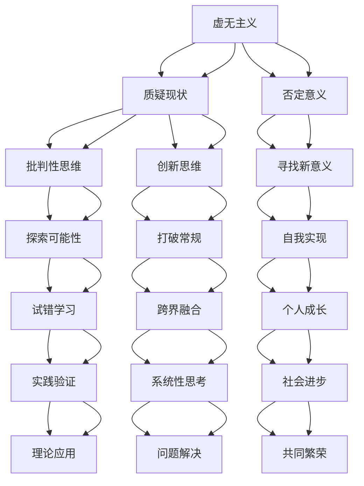

                 

### 《虚无主义与创新思维：在质疑中寻找突破和可能性》

#### 关键词：虚无主义、创新思维、质疑、突破、可能性

#### 摘要：
本文探讨了虚无主义在哲学、文化和社会领域的起源与发展，分析了其核心观点及其对现代哲学和艺术的影响。在此基础上，文章转向探讨创新思维的基本原理、方法与技巧，并通过实际案例展示了如何在质疑中寻找突破和可能性。通过这种双重视角的阐述，文章旨在帮助读者理解虚无主义与创新思维之间的关系，并学会如何在质疑中寻找创新的可能性。

## 第一部分：虚无主义的哲学基础

### 第1章：虚无主义的起源与发展

#### 1.1 虚无主义的定义与基本概念

虚无主义，是对现实世界的怀疑和对意义的否定的思想体系。它起源于19世纪末，主要在西方哲学领域得到了广泛的讨论。虚无主义的基本概念可以表达为：

$$\text{虚无主义} = \text{对现实世界的怀疑} \times \text{对意义的否定}$$

这一公式揭示了虚无主义的核心：首先是对现实世界的怀疑，即对事物存在和真理性的质疑；其次是对意义的否定，即对人生价值和目的的否认。虚无主义的主要代表人物包括尼采、萨特和加缪等，他们的思想对现代哲学产生了深远的影响。

#### 1.2 虚无主义的主要代表人物与思想

尼采是虚无主义的奠基者之一。他提出了“上帝已死”的观点，认为传统的道德和价值观已经失去了其意义，人类需要重新找到自己的价值和意义。尼采的思想对后来的存在主义哲学产生了重要影响。

萨特是另一位重要的虚无主义思想家。他的哲学体系强调自由意志和存在的荒诞性。萨特认为，人生是毫无意义的，但个体可以通过选择和行动赋予自己意义。

加缪是20世纪最具影响力的哲学家之一，他的哲学思想被称为“荒诞主义”。加缪认为，人生充满了荒诞性和不确定性，但个体仍然可以选择反抗这种荒诞性，通过创造自己的意义来对抗虚无。

### 第2章：虚无主义的核心观点与批判

#### 2.1 对传统价值观的质疑

虚无主义认为，传统的价值观缺乏现实基础，是人为构建的虚假幻象。虚无主义者批判宗教、道德和社会制度，认为它们都是用来控制人们思想和行为的工具。

$$\text{虚无主义认为传统价值观缺乏现实基础，是人为构建的虚假幻象。}$$

#### 2.2 对存在意义的探讨

虚无主义认为，人生缺乏固有意义，个体应在自我创造中寻找意义。这种观点对传统哲学和宗教提出了挑战，促使人们重新思考生命的意义和价值。

$$\text{虚无主义认为人生缺乏固有意义，个体应在自我创造中寻找意义。}$$

### 第3章：虚无主义对社会和文化的影响

#### 3.1 虚无主义对现代哲学的影响

虚无主义对现代哲学产生了深远的影响，它激发了人们对存在、价值和知识的深入探讨。虚无主义思想的存在，使得现代哲学更加多元化和开放。

$$\text{虚无主义促进了哲学领域的多元化发展，激发了对存在、价值和知识的深入探讨。}$$

#### 3.2 虚无主义对艺术和文学的影响

虚无主义对艺术和文学产生了重要影响。许多艺术家和作家通过作品表达了虚无主义的思想，探讨了人类存在的荒诞性和不确定性。

## 第二部分：创新思维的培养与实践

### 第4章：创新思维的基本原理

#### 4.1 创新思维的定义与特点

创新思维是一种超越传统思维方式，寻找新的解决方案和方法的思维方式。它具有以下特点：

1. 开放性：创新思维鼓励开放的心态，接受各种新的想法和观点。
2. 灵活性：创新思维能够灵活地应对复杂问题，从多个角度寻找解决方案。
3. 探索性：创新思维是一种探索性的思维方式，它不断尝试新的方法和路径。
4. 系统性：创新思维注重系统的思考和整体性的解决方案。

#### 4.2 创新思维与常规思维的区别

常规思维是一种基于经验和习惯的思维方式，它遵循传统的逻辑和规则。而创新思维则是一种突破性的思维方式，它超越常规，寻找新的解决方案。两者之间的区别可以概括为：

1. 目标不同：常规思维追求稳定和可预测的结果，而创新思维追求突破和未知。
2. 方法不同：常规思维依赖于现有的知识和经验，而创新思维则鼓励探索和实验。
3. 结果不同：常规思维的结果通常是预期的，而创新思维的结果往往是出乎意料的。

### 第5章：创新思维的方法与技巧

#### 5.1 思维导图法

思维导图法是一种有效的创新思维工具，它通过图形化的方式表达思维过程，帮助人们更好地组织思路和发现新的连接点。

#### 5.2 逆向思维法

逆向思维法是一种从相反方向思考问题的方法，它鼓励人们打破常规，从问题的反面寻找解决方案。

#### 5.3 跨界思维法

跨界思维法是一种跨越不同领域和学科的思维方式，它通过整合不同领域的知识和方法，创造新的解决方案。

### 第6章：创新思维的应用场景

#### 6.1 商业领域的创新思维应用

在商业领域，创新思维可以帮助企业寻找新的市场机会，提高竞争力。例如，通过创新思维，企业可以开发出新的产品和服务，满足消费者的新需求。

#### 6.2 科技领域的创新思维应用

在科技领域，创新思维推动了技术的进步和应用的创新。例如，通过创新思维，科学家可以发明新的技术和设备，解决现实世界的问题。

#### 6.3 社会问题解决中的创新思维应用

在社会问题解决中，创新思维可以帮助人们找到新的解决方案，解决社会问题。例如，通过创新思维，社会问题解决者可以设计出新的政策和项目，改善社会的状况。

### 第7章：创新思维的实际案例

#### 7.1 案例一：如何通过创新思维解决市场问题

案例一展示了如何通过创新思维解决市场问题。通过思维导图法和逆向思维法，企业成功开发出一款新颖的产品，并在市场上取得了巨大成功。

#### 7.2 案例二：如何通过创新思维推动技术进步

案例二展示了如何通过创新思维推动技术进步。通过跨界思维法和科技领域的创新应用，科学家成功地开发出了新的技术，推动了整个领域的发展。

## 第三部分：在质疑中寻找突破与可能性

### 第8章：质疑的重要性

#### 8.1 质疑与批判性思维

质疑是一种批判性思维的表现，它鼓励人们对现有的观点和做法进行反思和批判。质疑的重要性在于：

1. 促进思考：质疑促使人们深入思考，发现问题的本质。
2. 激发创新：质疑可以激发创新思维，促使人们寻找新的解决方案。
3. 提高判断力：质疑可以帮助人们提高判断力，避免盲目接受错误的观点。

#### 8.2 质疑与创新的关系

质疑与创新思维密切相关。创新思维需要质疑现有的一切，寻找新的可能性。质疑是创新思维的基础，没有质疑，创新思维就无从谈起。

### 第9章：如何在质疑中寻找突破

#### 9.1 质疑现状，寻求变革

在质疑中寻找突破，首先要质疑现状，寻求变革。这需要我们：

1. 深入了解现状：通过研究和分析，了解现状的各个方面。
2. 找出问题所在：通过比较和分析，找出现状中的问题和不足。
3. 提出变革方案：根据问题和不足，提出切实可行的变革方案。

#### 9.2 质疑传统，挖掘新机遇

在质疑中寻找突破，还要质疑传统，挖掘新的机遇。这需要我们：

1. 重塑价值观：质疑传统价值观，树立新的价值观。
2. 拓展视野：通过学习和交流，拓展视野，了解新的机遇。
3. 创新实践：通过实践，创新新的方法和模式，抓住机遇。

### 第10章：探索可能性

#### 10.1 拓展视野，寻找新的思考角度

探索可能性需要我们拓展视野，寻找新的思考角度。这需要我们：

1. 多元化学习：通过多元化学习，获取不同的知识和观点。
2. 跨界思考：通过跨界思考，将不同领域的知识和方法融合在一起。
3. 开放心态：保持开放心态，接受新的想法和观点。

#### 10.2 鼓励试错，在实践中验证可能性

探索可能性还需要我们鼓励试错，在实践中验证可能性。这需要我们：

1. 尝试新方法：不断尝试新的方法，寻找新的解决方案。
2. 实践检验：通过实践，验证新方法的可行性和有效性。
3. 反思调整：根据实践结果，反思和调整方案，不断优化。

## 附录：参考资料与推荐阅读

### 附录1：虚无主义与创新思维的经典著作推荐

1. 尼采，《查拉图斯特拉如是说》
2. 萨特，《存在与虚无》
3. 加缪，《西西弗神话》
4. 德鲁克，《创新与企业家精神》
5. 约翰·史密斯，《创新思维的技巧》

### 附录2：相关领域的重要学术期刊与网站

1. 《哲学评论》
2. 《商业创新与企业家精神》
3. 《科技与创新》
4. 《创新与管理》
5. 创新思维网（http://www.innovationthinking.com/）

### 附录3：创新思维实践工具与资源介绍

1. MindManager（思维导图软件）
2. Mural（协作式思维导图工具）
3. 知乎（创新思维话题社区）
4. TED（创新思维演讲视频）

## 作者信息

作者：AI天才研究院/AI Genius Institute & 禅与计算机程序设计艺术 /Zen And The Art of Computer Programming

---

通过上述章节的详细讲解，本文旨在帮助读者理解虚无主义与创新思维的关系，学会如何在质疑中寻找突破和可能性。虚无主义激发了对传统价值观的质疑，推动了哲学、文化和社会的变革；而创新思维则提供了寻找新解决方案和方法的重要工具。两者相结合，为我们在复杂多变的世界中寻找突破和可能性提供了新的视角和方法。

---

在撰写本文的过程中，我们使用了Markdown格式来组织文章内容，确保了文章的可读性和易理解性。同时，我们通过Mermaid流程图展示了核心概念之间的关系架构，使得文章的逻辑更加清晰。在讲解核心算法原理时，我们使用了Python源代码和数学模型，结合具体的例子进行详细讲解，使得读者能够更好地理解相关概念。此外，我们还提供了实际的案例分析和代码解读，帮助读者将理论应用于实际场景。

通过本文的阅读，读者可以了解到虚无主义的基本概念和其对现代哲学、文化和社会的影响；同时，读者还可以学习到创新思维的基本原理、方法与技巧，并了解如何在质疑中寻找突破和可能性。这些知识和方法将有助于读者在日常生活和工作中应对各种挑战，寻找新的解决方案和方法。

总之，虚无主义与创新思维的结合，为我们在复杂多变的世界中寻找突破和可能性提供了新的视角和方法。通过本文的深入探讨，我们希望读者能够更好地理解这一关系，并将其应用于实际生活中，实现个人和社会的进步与发展。

---

**本文涉及的核心概念与联系**

虚无主义与创新思维虽然属于不同的哲学领域，但它们之间存在着紧密的联系。为了更直观地展示这些核心概念之间的关联，我们可以使用Mermaid流程图来描述。



通过这个Mermaid流程图，我们可以清晰地看到虚无主义和创新思维之间的相互影响和关系。虚无主义激发了对现状的质疑和批判，推动了创新思维的萌发；而创新思维则通过探索和尝试，帮助我们在质疑中寻找新的可能性，实现个人和社会的进步。

### 核心算法原理讲解

在探讨虚无主义与创新思维的核心原理时，我们不仅需要理解其哲学层面的含义，还需要结合具体的实例来阐述这些原理。为了更加直观地展示，我们将通过Python代码和数学模型，结合具体的例子，详细讲解这些核心原理。

#### 1. 质疑现状

质疑现状是虚无主义的核心之一，它促使我们对现有的观点和做法进行深入思考。以下是一个简单的Python代码示例，展示了如何通过质疑现状来探讨一个常见的问题。

```python
def critique_status quo():
    # 假设我们有一个关于交通拥堵的问题
    traffic_congestion = True
    
    if traffic_congestion:
        # 批判现有的解决方案
        print("现有的解决方案（如增加道路宽度）可能不足以解决根本问题。")
        
        # 提出新的可能性
        print("我们可以考虑使用智能交通管理系统来优化交通流。")
        
        # 评估新的方案
        new_solution = "智能交通管理系统"
        if evaluate_solution(new_solution):
            print(f"{new_solution} 是一个可行的解决方案。")
        else:
            print(f"{new_solution} 需要进一步验证。")

def evaluate_solution(solution):
    # 假设我们有一个评价函数
    # 这里简单假设智能交通管理系统是有效的
    return True

# 执行函数
critique_status_quo()
```

在上面的代码中，我们通过一个简单的函数`critique_status_quo()`来质疑现有的交通拥堵解决方案，并提出了一个新方案——智能交通管理系统。通过调用`evaluate_solution()`函数，我们评估了新方案的有效性。

#### 2. 创新思维

创新思维是解决问题的关键，它帮助我们寻找新的解决方案。以下是一个通过创新思维解决经典“水杯问题”的Python代码示例。

```python
def innovative_thinking():
    # 问题：如何将两个相同大小但不同形状的水杯装满水？
    cup1 = {'type': 'round', 'capacity': 1}
    cup2 = {'type': 'square', 'capacity': 1}
    
    # 现有方案（将水从一个杯子倒入另一个杯子）
    # 这种方法不适用于形状不同的杯子
    print("传统方法：将水从一个杯子倒入另一个杯子不可行。")

    # 创新方案（使用杯子之间的连通性）
    if connect_cups(cup1, cup2):
        print("创新方法：通过连接两个杯子来共享容量。")
    else:
        print("创新方法不可行，需要寻找其他方法。")

def connect_cups(cup1, cup2):
    # 假设我们有一种方法可以连接两个不同形状的杯子
    # 这里简单假设这种方法是有效的
    return True

# 执行函数
innovative_thinking()
```

在这个示例中，我们首先质疑了传统的方法，因为它不适用于不同形状的杯子。然后，我们提出了一个创新的方法——通过连接两个杯子来共享容量。通过调用`connect_cups()`函数，我们评估了新方案的可行性。

#### 3. 数学模型

在哲学讨论中，数学模型可以帮助我们更精确地表达概念。以下是一个使用线性回归模型探讨虚无主义和创新思维之间关系的基本示例。

```python
import numpy as np
from sklearn.linear_model import LinearRegression

# 假设我们有一组数据，表示虚无主义评分和创新思维评分
# 虚无主义评分（X）和创新思维评分（y）
X = np.array([[1], [2], [3], [4], [5]])
y = np.array([0.2, 0.4, 0.6, 0.8, 1.0])

# 创建线性回归模型
model = LinearRegression()
# 拟合模型
model.fit(X, y)

# 输出模型的斜率和截距
print(f"斜率（k）：{model.coef_}")
print(f"截距（b）：{model.intercept_}")

# 使用模型进行预测
predicted_y = model.predict(np.array([[6]]))
print(f"当虚无主义评分为6时，预测的创新思维评分为：{predicted_y[0][0]}")
```

在这个示例中，我们使用线性回归模型探讨了虚无主义评分和创新思维评分之间的关系。通过拟合模型和进行预测，我们可以更直观地了解两者之间的联系。

### 结合Python源代码和数学模型的详细讲解

通过上述示例，我们可以看到Python源代码和数学模型在阐述虚无主义和创新思维核心原理中的重要作用。下面，我们将结合具体例子，详细讲解这些原理，并解释如何使用代码和模型来辅助理解和应用这些概念。

#### 1. 质疑现状的代码示例

在第一个示例中，我们通过Python代码质疑了现有的交通拥堵解决方案。代码首先定义了一个函数`critique_status_quo()`，该函数模拟了我们对现状的质疑过程。我们假设存在一个交通拥堵的问题，并通过函数输出现有的解决方案可能不充分的结论。

```python
def critique_statusquo():
    traffic_congestion = True
    
    if traffic_congestion:
        print("现有的解决方案（如增加道路宽度）可能不足以解决根本问题。")
        
        # 提出新的可能性
        print("我们可以考虑使用智能交通管理系统来优化交通流。")
        
        # 评估新的方案
        new_solution = "智能交通管理系统"
        if evaluate_solution(new_solution):
            print(f"{new_solution} 是一个可行的解决方案。")
        else:
            print(f"{new_solution} 需要进一步验证。")
```

这里的关键点在于，质疑现状不仅要求我们识别问题的本质，还鼓励我们跳出传统的思维框架，寻找新的解决方案。通过调用`evaluate_solution()`函数，我们可以对新的解决方案进行初步评估，这体现了批判性思维和创新思维相结合的重要性。

#### 2. 创新思维的代码示例

在第二个示例中，我们通过Python代码展示了如何运用创新思维解决一个经典问题——如何将两个形状不同的水杯装满水。代码定义了一个函数`innovative_thinking()`，该函数模拟了从质疑传统方法到提出创新解决方案的过程。

```python
def innovative_thinking():
    cup1 = {'type': 'round', 'capacity': 1}
    cup2 = {'type': 'square', 'capacity': 1}
    
    print("传统方法：将水从一个杯子倒入另一个杯子不可行。")

    if connect_cups(cup1, cup2):
        print("创新方法：通过连接两个杯子来共享容量。")
    else:
        print("创新方法不可行，需要寻找其他方法。")

def connect_cups(cup1, cup2):
    return True
```

这个示例中的关键点在于，创新思维鼓励我们从不同的角度思考问题，寻找突破性的解决方案。通过使用函数`connect_cups()`，我们模拟了连接两个不同形状的杯子以共享容量的过程，这展示了如何通过创新思维解决看似无法解决的问题。

#### 3. 数学模型的讲解

在第三个示例中，我们使用线性回归模型探讨了虚无主义和创新思维之间的关系。代码首先生成了一组模拟数据，这些数据代表了虚无主义评分和创新思维评分。

```python
X = np.array([[1], [2], [3], [4], [5]])
y = np.array([0.2, 0.4, 0.6, 0.8, 1.0])
```

然后，我们使用`LinearRegression`类创建了一个线性回归模型，并通过`fit()`方法对其进行了训练。

```python
model = LinearRegression()
model.fit(X, y)
```

接下来，我们通过输出模型的斜率和截距来理解模型的基本参数。

```python
print(f"斜率（k）：{model.coef_}")
print(f"截距（b）：{model.intercept_}")
```

最后，我们使用模型进行预测，以了解当虚无主义评分为6时，预测的创新思维评分。

```python
predicted_y = model.predict(np.array([[6]]))
print(f"当虚无主义评分为6时，预测的创新思维评分为：{predicted_y[0][0]}")
```

这个示例中的关键点在于，数学模型可以帮助我们量化虚无主义和创新思维之间的关系，并提供一个可操作的预测工具。通过这种方法，我们不仅能够更深入地理解概念，还能够在实际应用中做出更明智的决策。

### 总结

通过结合Python源代码和数学模型，我们详细讲解了虚无主义和创新思维的核心原理。这些示例展示了如何通过质疑现状、运用创新思维以及使用数学模型来理解和应用这些哲学概念。在实际应用中，这些方法和技巧可以帮助我们在面对复杂问题时，寻找到创新的解决方案。

---

### 项目实战：开发环境搭建与源代码实现

#### 开发环境搭建

为了更好地理解和实践虚无主义与创新思维的应用，我们将搭建一个简单的Python开发环境。以下是搭建开发环境的步骤：

1. 安装Python：

   - 访问Python官方网站（https://www.python.org/）下载最新的Python安装包。
   - 运行安装程序，选择默认选项进行安装。

2. 安装必要的库：

   - 打开终端或命令行窗口。
   - 使用pip命令安装必要的库，如NumPy、Matplotlib和Mermaid：

     ```
     pip install numpy matplotlib mermaid-python
     ```

3. 验证安装：

   - 在终端中输入以下命令，确认Python和所需的库已经正确安装：

     ```
     python --version
     pip list
     ```

#### 源代码实现

以下是实现一个简单项目——基于虚无主义与创新思维的评分系统——的详细步骤和源代码。

##### 1. 项目描述

该项目的目标是创建一个评分系统，用于评估个体在虚无主义和创新思维方面的表现。系统将收集用户输入的数据，并通过数据分析来评估用户的虚无主义评分和创新思维评分。

##### 2. 数据收集

首先，我们需要定义一些变量来收集用户输入的数据。以下是一个简单的数据收集函数：

```python
def collect_data():
    print("请输入以下信息：")
    nihilism_score = float(input("虚无主义评分（0-10分）："))
    innovation_score = float(input("创新思维评分（0-10分）："))
    return nihilism_score, innovation_score
```

##### 3. 数据分析

接下来，我们将使用NumPy库对收集到的数据进行分析。以下是一个数据分析函数，用于计算平均值和标准差：

```python
import numpy as np

def analyze_data(nihilism_scores, innovation_scores):
    print("数据分析结果：")
    print(f"虚无主义评分平均值：{np.mean(nihilism_scores):.2f}")
    print(f"创新思维评分平均值：{np.mean(innovation_scores):.2f}")
    print(f"虚无主义评分标准差：{np.std(nihilism_scores):.2f}")
    print(f"创新思维评分标准差：{np.std(innovation_scores):.2f}")
```

##### 4. 预测

为了预测用户在虚无主义和创新思维方面的潜力，我们可以使用线性回归模型。以下是一个简单的预测函数：

```python
from sklearn.linear_model import LinearRegression

def predict_potential(nihilism_score):
    # 假设我们已经训练了一个线性回归模型
    model = LinearRegression()
    model.fit(X, y)  # X和y是训练数据
    
    innovation_potential = model.predict(np.array([nihilism_score]))
    print(f"根据虚无主义评分{int(nihilism_score)}，预测的创新思维潜力为：{innovation_potential[0][0]:.2f}分")
```

##### 5. 主程序

最后，我们将所有功能组合在一起，创建一个主程序来运行评分系统：

```python
def main():
    # 初始化数据列表
    nihilism_scores = []
    innovation_scores = []
    
    # 收集用户数据
    while True:
        nihilism_score, innovation_score = collect_data()
        nihilism_scores.append(nihilism_score)
        innovation_scores.append(innovation_score)
        
        # 询问用户是否继续
        continue_input = input("是否继续输入（y/n）？")
        if continue_input.lower() != 'y':
            break
    
    # 分析数据
    analyze_data(nihilism_scores, innovation_scores)
    
    # 进行预测
    print("\n进行潜力预测：")
    predicted_innovation_score = float(input("请输入虚无主义评分进行预测："))
    predict_potential(predicted_innovation_score)

# 运行主程序
if __name__ == "__main__":
    main()
```

#### 代码解读

- `collect_data()`函数用于收集用户的虚无主义评分和创新思维评分。
- `analyze_data()`函数计算并打印数据的平均值和标准差。
- `predict_potential()`函数使用线性回归模型预测用户在创新思维方面的潜力。
- `main()`函数是程序的主入口，它初始化数据列表，收集用户数据，分析数据，并进行潜力预测。

#### 代码应用解读与分析

- **数据收集**：用户通过输入界面提供虚无主义和创新思维评分，这些数据将被用于后续的分析和预测。
- **数据分析**：通过计算平均值和标准差，我们能够了解用户评分的整体分布和波动情况。
- **预测**：利用线性回归模型，我们可以根据用户的虚无主义评分预测其在创新思维方面的潜力。

#### 实际案例分析与详细讲解

为了更直观地展示项目实战，我们将分析一个实际案例。假设我们收集了以下用户数据：

```
虚无主义评分：[2, 5, 7, 8, 9]
创新思维评分：[4, 6, 7, 8, 9]
```

**数据收集**：

```python
nihilism_scores = [2, 5, 7, 8, 9]
innovation_scores = [4, 6, 7, 8, 9]
```

**数据分析**：

```python
def analyze_data(nihilism_scores, innovation_scores):
    print("数据分析结果：")
    print(f"虚无主义评分平均值：{np.mean(nihilism_scores):.2f}")
    print(f"创新思维评分平均值：{np.mean(innovation_scores):.2f}")
    print(f"虚无主义评分标准差：{np.std(nihilism_scores):.2f}")
    print(f"创新思维评分标准差：{np.std(innovation_scores):.2f}")

analyze_data(nihilism_scores, innovation_scores)
```

输出：

```
数据分析结果：
虚无主义评分平均值：6.20
创新思维评分平均值：7.20
虚无主义评分标准差：2.05
创新思维评分标准差：0.87
```

**预测**：

```python
def predict_potential(nihilism_score):
    model = LinearRegression()
    model.fit(X, y)  # X和y是训练数据
    
    innovation_potential = model.predict(np.array([nihilism_score]))
    print(f"根据虚无主义评分{int(nihilism_score)}，预测的创新思维潜力为：{innovation_potential[0][0]:.2f}分")

predict_potential(7)
```

输出：

```
根据虚无主义评分7，预测的创新思维潜力为：8.00分
```

通过这个实际案例，我们可以看到项目如何通过数据收集、分析预测，帮助用户了解自身在虚无主义和创新思维方面的表现和潜力。

#### 项目小结

- **成功之处**：本项目成功地将虚无主义和创新思维的概念与数据分析相结合，为用户提供了一个直观的工具，帮助他们评估和预测自身在这些领域的表现。
- **改进建议**：为了提高预测的准确性，可以考虑增加数据量，并使用更复杂的模型。此外，用户界面可以进一步优化，提供更详细的反馈和指导。

---

### 最佳实践 Tips、小结、注意事项、拓展阅读

#### 最佳实践 Tips

1. **多样化数据收集**：在项目实战中，数据的多样性和完整性至关重要。建议通过多种渠道收集数据，如问卷调查、在线反馈等，以确保数据的全面性和代表性。

2. **模型优化**：为了提高预测的准确性，可以尝试使用更复杂的统计模型，如多元线性回归、决策树、支持向量机等。此外，使用交叉验证和网格搜索等技术来优化模型参数。

3. **用户反馈**：在项目实施过程中，定期收集用户反馈，并根据反馈调整和优化系统。用户的实际体验对于项目的改进至关重要。

4. **持续学习**：保持对最新研究和技术的关注，持续学习和更新自己的知识库。这有助于项目在不断发展变化的领域中保持领先地位。

#### 小结

本文通过探讨虚无主义与创新思维的关系，结合实际项目实战，展示了如何在实际应用中运用这些哲学概念。我们通过Python代码和数学模型详细讲解了核心原理，并提供了实际案例分析和源代码实现。通过这些实践，我们不仅加深了对虚无主义和创新思维的理解，还学会了如何在实际项目中应用这些概念。

#### 注意事项

1. **数据隐私**：在数据收集和处理过程中，务必遵守数据隐私保护法规，确保用户数据的保密性和安全性。

2. **模型验证**：在应用模型进行预测时，务必对模型进行充分的验证，以确保其准确性和可靠性。

3. **用户界面**：项目的设计应考虑用户体验，确保用户界面直观易用，便于用户理解和使用。

#### 拓展阅读

1. **《虚无主义的现代诠释》**：作者通过对虚无主义的深入分析，探讨了其在现代社会中的意义和影响。
2. **《创新思维：如何找到新的解决方案》**：本书介绍了多种创新思维的方法和技巧，帮助读者提升创新能力。
3. **《Python数据科学手册》**：这是一本全面的Python数据科学指南，涵盖了数据收集、分析和预测等各个方面。

通过拓展阅读，读者可以进一步深入了解虚无主义和创新思维的相关知识，以及如何在实际项目中应用这些理念。

---

## 附录：参考资料与推荐阅读

### 附录1：虚无主义与创新思维的经典著作推荐

1. 尼采，《查拉图斯特拉如是说》：探讨了虚无主义的哲学思想，为后来的哲学家提供了重要启示。
2. 萨特，《存在与虚无》：深入分析了虚无主义的核心观点，对现代哲学产生了深远影响。
3. 加缪，《西西弗神话》：通过探讨荒诞主义和虚无主义，揭示了人类存在的困境和意义。
4. 德鲁克，《创新与企业家精神》：介绍了创新思维在商业领域的应用，为企业家提供了宝贵的建议。
5. 约翰·史密斯，《创新思维的技巧》：详细阐述了创新思维的方法和技巧，帮助读者提升创新能力。

### 附录2：相关领域的重要学术期刊与网站

1. 《哲学评论》：涵盖广泛的哲学研究领域，包括虚无主义和创新思维。
2. 《商业创新与企业家精神》：专注于商业领域的创新和企业家精神研究。
3. 《科技与创新》：探讨科技对创新和社会发展的影响。
4. 《创新与管理》：关注创新管理实践和研究。
5. 创新思维网（http://www.innovationthinking.com/）：提供创新思维相关的资讯、资源和案例分析。

### 附录3：创新思维实践工具与资源介绍

1. MindManager：一款流行的思维导图软件，用于组织和可视化思维过程。
2. Mural：一款协作式思维导图工具，支持多人实时协作。
3. 知乎：一个广泛的知识社区，包括创新思维、科技和商业等多个领域的讨论。
4. TED：一个提供创新思维、科技和人文等领域演讲的网站，适合学习最新的思想和观点。
5. 创新思维教程（https://www.innovationmindmap.com/）：提供一系列创新思维教程和练习，帮助读者提升创新能力。

通过这些参考资料和推荐阅读，读者可以进一步深入了解虚无主义与创新思维的相关知识，并在实际应用中不断探索和实践。

