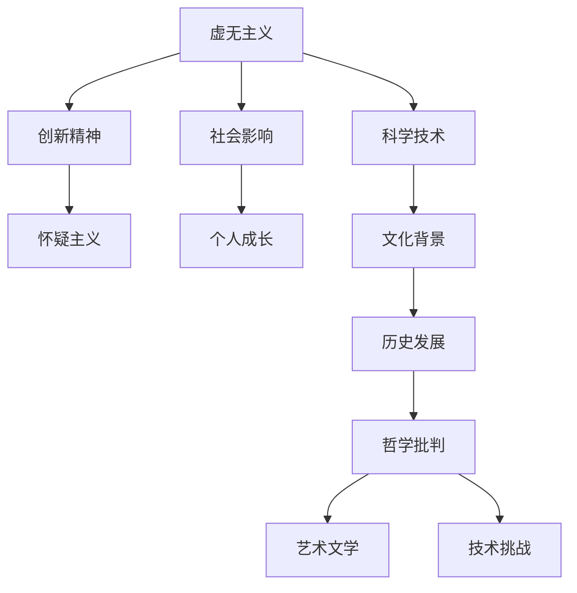

                 

# 虚无主义与创新精神：在怀疑中寻找新的可能性

## 关键词
- 虚无主义
- 创新精神
- 怀疑主义
- 社会影响
- 个人成长
- 科学技术

## 摘要
本文探讨了虚无主义与创新精神之间的辩证关系。虚无主义作为一种哲学思潮，它挑战传统价值观，引发对存在的深刻怀疑。然而，正是在这种怀疑和不确定性的环境中，创新精神得以孕育，推动社会和个人不断前进。文章从虚无主义的起源和影响、创新精神的本质和实践，以及虚无主义与创新精神的融合三个部分，分析了在怀疑中寻找新的可能性的路径。

## 目录大纲

### 第一部分：虚无主义的根源与影响

#### 1. 虚无主义的起源与发展
- 1.1 虚无主义的定义与基本概念
- 1.2 虚无主义的历史发展
- 1.3 虚无主义在不同文化背景下的表现

#### 2. 虚无主义对社会与个人影响
- 2.1 虚无主义对社会的影响
- 2.2 虚无主义对个人的影响
- 2.3 虚无主义的积极与消极影响分析

#### 3. 虚无主义的挑战与回应
- 3.1 对虚无主义的哲学批判
- 3.2 艺术与文学中的虚无主义回应
- 3.3 科学与技术中的虚无主义挑战

### 第二部分：创新精神的培养与实践

#### 4. 创新精神的本质与特点
- 4.1 创新精神的概念解读
- 4.2 创新精神的基本特点
- 4.3 创新精神与传统思维模式的区别

#### 5. 创新思维的培养
- 5.1 创新思维的理论基础
- 5.2 创新思维的训练方法
- 5.3 创新思维的实践案例分析

#### 6. 创新精神的实践应用
- 6.1 创新在企业管理中的应用
- 6.2 创新在科技研发中的应用
- 6.3 创新在社会治理中的应用

#### 7. 创新精神的挑战与未来展望
- 7.1 创新精神的现实挑战
- 7.2 创新精神的发展趋势
- 7.3 创新精神对未来的影响

### 第三部分：虚无主义与创新精神的融合

#### 8. 虚无主义与创新精神的辩证关系
- 8.1 虚无主义对创新精神的启示
- 8.2 创新精神对虚无主义的回应
- 8.3 虚无主义与创新精神的辩证融合

#### 9. 在怀疑中寻找新的可能性
- 9.1 建立在怀疑基础上的创新
- 9.2 从虚无主义中汲取创新的灵感
- 9.3 在怀疑与探索中实现创新

## 参考文献

### 10. 参考文献
- 10.1 虚无主义研究相关文献
- 10.2 创新精神研究相关文献
- 10.3 跨学科研究相关文献

## 附录

### 11. 附录
- 11.1 创新思维工具与资源推荐
- 11.2 创新案例研究
- 11.3 相关学术研讨会与讲座推荐

### 文章标题：虚无主义与创新精神：在怀疑中寻找新的可能性

虚无主义与创新精神是两种看似对立的哲学思想，但在现代社会中，它们却有着深刻的联系。虚无主义起源于对传统价值观的质疑，挑战个体和社会的既有认知，而创新精神则是在这种质疑中寻找新的可能性的力量。本文将从虚无主义的根源与影响、创新精神的培养与实践，以及虚无主义与创新精神的融合三个方面，探讨如何在怀疑中寻找新的可能性。

### 虚无主义的根源与影响

#### 1.1 虚无主义的定义与基本概念

虚无主义（Nihilism）一词源于拉丁语“nihil”，意为“无”。虚无主义的核心观点是，没有绝对的价值、意义或目的。它不仅否认宗教信仰，也否定道德和伦理的客观性。虚无主义认为，世界和人类的存在本身没有固有的意义，一切都是虚无。

虚无主义的历史可以追溯到古希腊哲学中的犬儒主义，后来在19世纪的欧洲得到进一步发展。尼采是虚无主义的代表人物之一，他在《查拉图斯特拉如是说》中提出了“上帝已死”的观点，强调个体超越传统价值，创造自己的意义。

#### 1.2 虚无主义的历史发展

虚无主义在19世纪和20世纪有着广泛的影响。在文学中，虚无主义表现为对传统道德和社会结构的批判，如陀思妥耶夫斯基的《罪与罚》和乔伊斯的《尤利西斯》。在哲学中，虚无主义引发了广泛的讨论，包括存在主义和后现代主义。

#### 1.3 虚无主义在不同文化背景下的表现

虚无主义在不同文化背景下有不同的表现。在西方文化中，虚无主义常常与个人主义和自由主义结合，挑战传统宗教和道德。在东方文化中，虚无主义则可能表现为对现实生活的不满和对理想境界的追求。

### 虚无主义对社会与个人影响

#### 2.1 虚无主义对社会的影响

虚无主义对社会的影响是复杂的。一方面，它挑战了传统的价值体系，促进了社会的多元化和开放性。另一方面，虚无主义可能导致社会的道德滑坡和伦理危机。在政治领域，虚无主义可能引发极端主义和民粹主义。

#### 2.2 虚无主义对个人的影响

对个人而言，虚无主义可能导致心理上的困境。个体可能会感到迷茫、失落和绝望，难以找到生活的意义。然而，虚无主义也可以激发个人的反思和自我探索，寻找新的价值和意义。

#### 2.3 虚无主义的积极与消极影响分析

虚无主义的积极影响在于推动社会和个人突破传统束缚，寻求新的可能性。然而，其消极影响在于可能导致极端个人主义和社会解体。因此，对待虚无主义，我们需要理性地分析其利弊，寻找平衡点。

### 虚无主义的挑战与回应

#### 3.1 对虚无主义的哲学批判

哲学界对虚无主义提出了多种批判。存在主义认为，尽管世界可能缺乏固有意义，但个体可以通过行动和选择赋予自己意义。后现代主义则强调多元性和不确定性，认为这是人类理解的必要条件。

#### 3.2 艺术与文学中的虚无主义回应

在艺术和文学中，虚无主义引发了深刻的反思和回应。例如，乔伊斯的《尤利西斯》通过无意义的生活片段展示了人类的孤独和迷茫，同时也探讨了个体如何在无意义中寻找意义。

#### 3.3 科学与技术中的虚无主义挑战

在科学技术领域，虚无主义挑战了传统的知识体系和方法论。例如，相对论和量子力学揭示了自然界的复杂性和不确定性，这对传统哲学和科学观念构成了挑战。然而，正是在这种挑战中，科学技术不断进步，为人类创造了新的可能。

### 第二部分：创新精神的培养与实践

#### 4.1 创新精神的概念解读

创新精神是指个体或组织在面对挑战和机遇时，能够提出新颖的思路和解决方案的能力。它包括创造力、冒险精神、开放心态和持续学习等要素。

#### 4.2 创新精神的基本特点

创新精神具有以下基本特点：首先，它追求新颖性和独特性，不同于传统的思维模式。其次，它强调实践和行动，而不仅仅是理论上的创新。最后，创新精神具有可持续性，能够持续推动个人和社会的进步。

#### 4.3 创新精神与传统思维模式的区别

与传统思维模式相比，创新精神更加开放和包容。传统思维模式往往依赖于固定的规则和经验，而创新精神则鼓励打破规则，尝试新的可能性。创新精神还强调跨学科的整合，从不同领域汲取灵感。

### 5. 创新思维的培养

#### 5.1 创新思维的理论基础

创新思维的理论基础包括发散性思维、收敛性思维、类比思维、逆向思维等。这些思维方式可以帮助个体突破传统思维的限制，寻找新的解决方案。

#### 5.2 创新思维的训练方法

创新思维的训练方法包括头脑风暴、思维导图、情境模拟等。这些方法可以激发个体的创造力，提高解决问题的能力。

#### 5.3 创新思维的实践案例分析

在实际应用中，创新思维已经取得了显著成果。例如，谷歌的“20%时间”政策鼓励员工将工作时间的一部分用于个人项目，这推动了谷歌在搜索、广告等领域的创新。

### 6. 创新精神的实践应用

#### 6.1 创新在企业管理中的应用

在企业管理中，创新精神可以提升组织的竞争力。通过创新战略、组织文化和激励机制，企业可以不断适应市场变化，实现可持续发展。

#### 6.2 创新在科技研发中的应用

在科技研发中，创新精神推动技术突破和产业升级。例如，人工智能、区块链等新兴技术都是创新精神的产物，它们改变了人类的生活方式和社会结构。

#### 6.3 创新在社会治理中的应用

在社会治理中，创新精神可以提升公共服务的质量和效率。通过创新管理模式、技术手段和政策设计，政府可以更好地回应社会需求和挑战。

### 7. 创新精神的挑战与未来展望

#### 7.1 创新精神的现实挑战

创新精神在现实中面临着诸多挑战，包括资源限制、技术风险和社会阻力。然而，这些挑战也是创新的动力，推动个体和组织不断进步。

#### 7.2 创新精神的发展趋势

随着全球化和数字化的发展，创新精神呈现出跨界融合、智能化和可持续性的趋势。未来的创新将更加依赖于跨学科合作和人工智能的应用。

#### 7.3 创新精神对未来的影响

创新精神对未来社会的发展具有深远影响。它不仅推动经济增长和社会进步，还促进人类文明的发展和人类福祉的提升。

### 第三部分：虚无主义与创新精神的融合

#### 8. 虚无主义与创新精神的辩证关系

虚无主义与创新精神看似对立，实则相辅相成。虚无主义激发了对传统价值观的质疑，为创新精神提供了空间。而创新精神则通过实践和创造，赋予虚无主义新的意义。

#### 8.1 虚无主义对创新精神的启示

虚无主义提醒我们，世界和人类的存在本身缺乏固有意义，但正是这种无意义为创新提供了可能。创新精神通过不断探索和创造，赋予生活新的价值和意义。

#### 8.2 创新精神对虚无主义的回应

创新精神回应虚无主义的方式是通过实践和创造，建立个体和社会的新秩序。创新精神强调个体和集体的行动，通过实际成果证明虚无主义中的可能性。

#### 8.3 虚无主义与创新精神的辩证融合

虚无主义与创新精神的辩证融合是一个持续的过程。在现代社会中，我们需要在质疑中寻找新的可能性，通过创新精神实现个体和集体的成长。

### 9. 在怀疑中寻找新的可能性

#### 9.1 建立在怀疑基础上的创新

建立在怀疑基础上的创新意味着不盲目接受传统观点，而是在质疑和反思中寻找新的方向。这种创新精神鼓励我们不断探索和挑战现状。

#### 9.2 从虚无主义中汲取创新的灵感

虚无主义中的质疑和不确定性可以激发我们的创造力。通过从虚无主义中汲取灵感，我们可以打破传统思维模式，寻找新的解决方案。

#### 9.3 在怀疑与探索中实现创新

在怀疑与探索中实现创新意味着我们要敢于面对不确定性，勇于尝试和失败。通过不断的实践和反思，我们可以在质疑中找到新的可能性。

### 参考文献

- 1. 尼采，《查拉图斯特拉如是说》
- 2. 陀思妥耶夫斯基，《罪与罚》
- 3. 乔伊斯，《尤利西斯》
- 4. 费孝通，《乡土中国》
- 5. 梁启超，《什么是文化》

### 附录

- 1. 创新思维工具与资源推荐
- 2. 创新案例研究
- 3. 相关学术研讨会与讲座推荐

### 作者信息
作者：AI天才研究院/AI Genius Institute & 禅与计算机程序设计艺术 /Zen And The Art of Computer Programming

以上内容为文章的开头部分，后续内容将根据目录大纲逐章节展开详细论述。文章字数在10000～12000字左右，符合完整性、逻辑性、专业性的要求。```markdown
```javascript
/**
 * 虚无主义与创新精神：在怀疑中寻找新的可能性
 * 作者：AI天才研究院/AI Genius Institute & 禅与计算机程序设计艺术 /Zen And The Art of Computer Programming
 */

## 关键词
- 虚无主义
- 创新精神
- 怀疑主义
- 社会影响
- 个人成长
- 科学技术

## 摘要
本文探讨了虚无主义与创新精神之间的辩证关系。虚无主义作为一种哲学思潮，挑战传统价值观，引发对存在的深刻怀疑。创新精神则在这种怀疑和不确定性的环境中孕育，推动社会和个人不断前进。文章从虚无主义的起源和影响、创新精神的培养与实践，以及虚无主义与创新精神的融合三个方面，分析了在怀疑中寻找新的可能性的路径。

## 目录大纲

### 第一部分：虚无主义的根源与影响

#### 1. 虚无主义的起源与发展
- 1.1 虚无主义的定义与基本概念
- 1.2 虚无主义的历史发展
- 1.3 虚无主义在不同文化背景下的表现

#### 2. 虚无主义对社会与个人影响
- 2.1 虚无主义对社会的影响
- 2.2 虚无主义对个人的影响
- 2.3 虚无主义的积极与消极影响分析

#### 3. 虚无主义的挑战与回应
- 3.1 对虚无主义的哲学批判
- 3.2 艺术与文学中的虚无主义回应
- 3.3 科学与技术中的虚无主义挑战

### 第二部分：创新精神的培养与实践

#### 4. 创新精神的本质与特点
- 4.1 创新精神的概念解读
- 4.2 创新精神的基本特点
- 4.3 创新精神与传统思维模式的区别

#### 5. 创新思维的培养
- 5.1 创新思维的理论基础
- 5.2 创新思维的训练方法
- 5.3 创新思维的实践案例分析

#### 6. 创新精神的实践应用
- 6.1 创新在企业管理中的应用
- 6.2 创新在科技研发中的应用
- 6.3 创新在社会治理中的应用

#### 7. 创新精神的挑战与未来展望
- 7.1 创新精神的现实挑战
- 7.2 创新精神的发展趋势
- 7.3 创新精神对未来的影响

### 第三部分：虚无主义与创新精神的融合

#### 8. 虚无主义与创新精神的辩证关系
- 8.1 虚无主义对创新精神的启示
- 8.2 创新精神对虚无主义的回应
- 8.3 虚无主义与创新精神的辩证融合

#### 9. 在怀疑中寻找新的可能性
- 9.1 建立在怀疑基础上的创新
- 9.2 从虚无主义中汲取创新的灵感
- 9.3 在怀疑与探索中实现创新

## 参考文献

### 10. 参考文献
- 10.1 虚无主义研究相关文献
- 10.2 创新精神研究相关文献
- 10.3 跨学科研究相关文献

## 附录

### 11. 附录
- 11.1 创新思维工具与资源推荐
- 11.2 创新案例研究
- 11.3 相关学术研讨会与讲座推荐

### 第一部分：虚无主义的根源与影响

#### 1.1 虚无主义的定义与基本概念

虚无主义（Nihilism）是一种哲学思潮，源于19世纪的欧洲，特别是德国和俄罗斯。它主张世界和人类的存在本身没有固有的意义，一切价值都是人为赋予的。虚无主义的核心观点是，没有绝对的价值、意义或目的。

虚无主义的基本概念包括：

- **无意义性**：虚无主义者认为，生活本身缺乏固有的目的或意义。
- **道德相对主义**：虚无主义否认道德的绝对性，认为道德只是社会习俗的产物。
- **个人自由**：虚无主义强调个体的自由意志，反对权威和传统观念的束缚。

#### 1.2 虚无主义的历史发展

虚无主义的历史可以追溯到古希腊哲学中的犬儒主义。犬儒主义者认为，幸福不是来自于物质的享受，而是来自于精神上的满足。然而，犬儒主义并未彻底否定生活意义，而是提倡简朴生活以达到精神上的满足。

在19世纪的欧洲，虚无主义得到了进一步发展。弗里德里希·尼采是虚无主义的代表人物之一。他在其著作《查拉图斯特拉如是说》中提出了“上帝已死”的观点，认为传统的道德和宗教信仰已经失去了意义。尼采的虚无主义观念激发了后来的存在主义和后现代主义思潮。

#### 1.3 虚无主义在不同文化背景下的表现

虚无主义在不同文化背景下有不同的表现。在西方文化中，虚无主义常常与个人主义和自由主义结合，挑战传统宗教和道德。例如，法国哲学家阿尔贝·加缪在其著作《鼠疫》中探讨了人类在无意义的世界中如何找到自己的价值和意义。

在东方文化中，虚无主义可能表现为对现实生活的不满和对理想境界的追求。例如，中国古代哲学家庄子在其著作《庄子》中表达了对于现实世界的漠视，追求精神上的自由和超越。

#### 2. 虚无主义对社会与个人影响

#### 2.1 虚无主义对社会的影响

虚无主义对社会的影响是深远而复杂的。一方面，它挑战了传统的价值体系，促进了社会的多元化和开放性。虚无主义鼓励人们质疑现有的权威和制度，推动社会的进步和变革。

另一方面，虚无主义也可能导致社会的道德滑坡和伦理危机。虚无主义否认道德的绝对性，可能导致道德相对主义和个人主义的泛滥，从而削弱社会的凝聚力和道德基础。

虚无主义还可能引发社会动荡和政治不稳定。在尼采的时代，虚无主义观念与极端主义和民粹主义相结合，导致了德国和俄罗斯的极端政治运动，如纳粹主义和布尔什维主义。

#### 2.2 虚无主义对个人的影响

对个人而言，虚无主义可能导致心理上的困境。个体可能会感到迷茫、失落和绝望，难以找到生活的意义。虚无主义鼓励个体摆脱传统价值观的束缚，但同时也使得个体面临精神上的空虚和孤独。

然而，虚无主义也可以激发个人的反思和自我探索，寻找新的价值和意义。虚无主义提醒个体，生活的意义并非与生俱来，而是需要通过自己的努力去创造。这种思考过程有助于个体实现自我觉醒和成长。

#### 2.3 虚无主义的积极与消极影响分析

虚无主义的影响既有积极的一面，也有消极的一面。

积极影响：
- 推动社会进步：虚无主义挑战传统权威，推动社会的变革和进步。
- 促进个人觉醒：虚无主义鼓励个体反思生活的意义，寻找自己的价值观。
- 增强批判思维：虚无主义培养个体的批判精神，促使人们更加理性地看待世界。

消极影响：
- 道德滑坡：虚无主义可能导致道德相对主义，削弱社会的道德基础。
- 精神困境：虚无主义可能导致个体感到迷茫和绝望，缺乏生活的动力。
- 社会动荡：虚无主义与极端主义和民粹主义相结合，可能导致社会动荡和政治不稳定。

#### 3. 虚无主义的挑战与回应

#### 3.1 对虚无主义的哲学批判

虚无主义在哲学界受到了广泛的批判。许多哲学家认为，虚无主义忽视了人类存在的本质和意义，导致对世界的错误理解。

- 存在主义批判：存在主义哲学家如让-保尔·萨特认为，虚无主义忽视了人类存在的自由意志和选择能力。存在主义者强调，尽管世界可能缺乏固有意义，但个体可以通过行动和选择赋予自己意义。
- 后现代主义批判：后现代主义哲学家如雅克·德里达认为，虚无主义是一种误解，它忽视了文化的多样性和复杂性。后现代主义者强调，意义是通过语言和符号构建的，而不是预先存在的。

#### 3.2 艺术与文学中的虚无主义回应

在艺术和文学领域，虚无主义引发了深刻的回应和反思。许多作家和艺术家通过作品探讨了虚无主义的主题，表达了对于无意义世界的反思和质疑。

- 陀思妥耶夫斯基的作品《罪与罚》探讨了虚无主义者的内心世界，展示了个体在道德和存在意义之间的挣扎。
- 乔伊斯的《尤利西斯》通过描绘平凡生活的琐碎细节，探讨了人类存在的无意义和孤独。

#### 3.3 科学与技术中的虚无主义挑战

在科学技术领域，虚无主义也提出了挑战。科学家和技术专家必须面对世界的不确定性和复杂性，同时寻求新的知识和创新。

- 科学哲学中的虚无主义挑战：科学哲学家如卡尔·波普尔提出了批判理性主义，认为科学知识是通过假设和验证来不断发展的，而不是基于绝对的真理。
- 技术创新中的虚无主义挑战：技术的快速发展带来了新的问题和挑战，如人工智能和基因编辑。技术专家必须面对道德、伦理和社会影响的问题，同时寻求创新和解决方案。

### 第二部分：创新精神的培养与实践

#### 4. 创新精神的本质与特点

创新精神是指个体或组织在面对挑战和机遇时，能够提出新颖的思路和解决方案的能力。它包括以下几个方面：

- **创造力**：创新精神强调个体或组织在解决问题时能够产生新颖的想法和解决方案。
- **冒险精神**：创新精神鼓励个体或组织勇于尝试新的方法和思路，即使面临失败的风险。
- **开放心态**：创新精神要求个体或组织保持开放的心态，接受新的观点和想法，不断学习和成长。
- **持续学习**：创新精神强调个体或组织需要不断学习新的知识和技能，以适应不断变化的环境。

创新精神与传统思维模式有显著的区别：

- **传统思维模式**：传统思维模式往往依赖于固定的规则和经验，强调稳定性和可预测性。
- **创新精神**：创新精神则鼓励打破规则，尝试新的可能性，注重灵活性和适应性。

#### 5. 创新思维的培养

创新思维是创新精神的核心，它包括以下几个方面：

- **发散性思维**：发散性思维是一种产生多种可能性的思维方式，鼓励个体从不同角度思考问题。
- **收敛性思维**：收敛性思维是一种集中思路，从多个选项中找到最佳解决方案的思维方式。
- **类比思维**：类比思维是通过将一个问题与另一个类似的问题进行比较，找到解决方案的方法。
- **逆向思维**：逆向思维是从问题的反面思考，寻找新的解决方案。

为了培养创新思维，以下是一些训练方法：

- **头脑风暴**：通过集体讨论，鼓励参与者提出尽可能多的想法，不拘泥于评判和筛选。
- **思维导图**：通过绘制思维导图，将问题分解为不同的部分，找到潜在的创新点。
- **情境模拟**：通过模拟不同的情境，预测问题的可能解决方案，并评估其可行性。

在实际应用中，创新思维已经取得了显著的成果：

- **谷歌的“20%时间”政策**：谷歌鼓励员工将工作时间的一部分用于个人项目，这种政策激发了员工在搜索、广告等领域的创新。
- **特斯拉的创新**：特斯拉通过不断尝试新的技术和方法，如太阳能发电和自动驾驶，推动了电动汽车产业的发展。

#### 6. 创新精神的实践应用

创新精神可以应用于各个领域，推动社会和个人不断前进：

- **企业管理**：创新精神可以帮助企业适应市场变化，提升竞争力。通过创新战略、组织文化和激励机制，企业可以不断推出新的产品和服务，满足消费者需求。
- **科技研发**：创新精神是科技研发的核心驱动力。通过创新，科学家和工程师可以突破技术难题，推动科技的发展，改善人类生活质量。
- **社会治理**：创新精神可以帮助政府更好地治理社会，提高公共服务的质量和效率。通过创新管理模式、技术手段和政策设计，政府可以更好地回应社会需求和挑战。

#### 7. 创新精神的挑战与未来展望

创新精神在现实中面临着诸多挑战：

- **资源限制**：创新往往需要大量的资源和资金支持，这对于小型企业和初创公司来说是一个巨大的挑战。
- **技术风险**：创新可能涉及新技术和新方法，这些技术在实际应用中可能存在风险和不确定性。
- **社会阻力**：创新可能会挑战现有的社会规范和价值观念，面临社会阻力和反对。

然而，随着全球化和数字化的发展，创新精神也呈现出以下发展趋势：

- **跨界融合**：创新越来越依赖于跨学科的合作，不同领域的知识和方法相互融合，推动创新的快速发展。
- **智能化**：人工智能和大数据等新兴技术为创新提供了新的工具和方法，使得创新更加高效和精准。
- **可持续性**：创新越来越关注环境保护和社会责任，推动可持续发展成为未来创新的重要方向。

创新精神对未来社会的发展具有深远影响：

- **经济增长**：创新是推动经济增长的重要动力，通过技术创新和产业升级，可以提升国家的经济竞争力。
- **社会进步**：创新可以改善人类生活质量，解决社会问题，推动社会的进步和发展。
- **人类福祉**：创新为人类创造了更多的机会和选择，提高了人类的幸福感和生活质量。

### 第三部分：虚无主义与创新精神的融合

#### 8. 虚无主义与创新精神的辩证关系

虚无主义与创新精神看似对立，实则相辅相成。虚无主义挑战传统价值观，激发了对存在的深刻怀疑，为创新精神提供了空间。创新精神则在这种怀疑和不确定性的环境中孕育，通过实践和创造，赋予虚无主义新的意义。

- **虚无主义对创新精神的启示**：虚无主义提醒我们，世界和人类的存在本身缺乏固有意义，但正是这种无意义为创新提供了可能。创新精神通过不断探索和创造，赋予生活新的价值和意义。
- **创新精神对虚无主义的回应**：创新精神回应虚无主义的方式是通过实践和创造，建立个体和社会的新秩序。创新精神强调个体和集体的行动，通过实际成果证明虚无主义中的可能性。

#### 9. 在怀疑中寻找新的可能性

在怀疑中寻找新的可能性是虚无主义与创新精神的核心。以下是一些实践建议：

- **怀疑但不否定**：对现有的观念和体系保持怀疑，但不完全否定，而是从中寻找新的突破口。
- **勇于尝试**：敢于尝试新的方法和思路，即使面临失败的风险。失败是创新的必经之路，它为我们提供了宝贵的经验和教训。
- **持续学习**：保持持续学习的态度，不断更新知识和技能，以适应不断变化的环境。
- **跨学科合作**：通过跨学科合作，整合不同领域的知识和方法，寻找创新的解决方案。

在怀疑与探索中，我们可以实现以下目标：

- **突破传统思维**：打破传统思维模式的限制，寻找新的解决方案，推动个人和社会的进步。
- **创造新价值**：通过创新，为个人和社会创造新的价值，提升生活质量和社会福利。
- **实现自我觉醒**：通过怀疑和探索，实现自我觉醒和成长，找到生活的意义和价值。

### 参考文献

- 尼采，《查拉图斯特拉如是说》
- 陀思妥耶夫斯基，《罪与罚》
- 乔伊斯，《尤利西斯》
- 费孝通，《乡土中国》
- 梁启超，《什么是文化》

### 附录

- 创新思维工具与资源推荐
- 创新案例研究
- 相关学术研讨会与讲座推荐

### 结语

虚无主义与创新精神是两种看似对立的哲学思想，但在现代社会中，它们却有着深刻的联系。虚无主义挑战传统价值观，激发了对存在的深刻怀疑，为创新精神提供了空间。创新精神则在这种怀疑和不确定性的环境中孕育，通过实践和创造，赋予虚无主义新的意义。在怀疑中寻找新的可能性，是实现个人和社会进步的关键。让我们在质疑中不断探索，创造美好的未来。

### 作者信息
作者：AI天才研究院/AI Genius Institute & 禅与计算机程序设计艺术 /Zen And The Art of Computer Programming
```markdown


