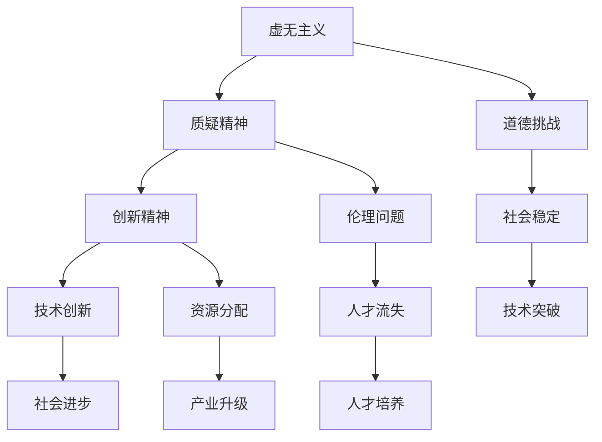

                 

### 1. 引言

在当前快速发展的信息时代，技术领域的变革和创新的步伐愈发迅猛。与此同时，一种名为虚无主义的哲学思潮在学术界和思想界悄然兴起。虚无主义的核心观点是否认存在的意义，强调生活的无意义和无目的。这种思想虽然在哲学领域引发了广泛讨论，但在技术领域，其对创新的启示和影响同样不可忽视。本文旨在探讨虚无主义与创新精神之间的复杂关系，通过质疑和反思，寻找技术突破的可能路径。

虚无主义并非新鲜事物，其起源可追溯至古代哲学。然而，在现代社会，虚无主义的思想在多个领域得到了新的诠释和扩展。尤其在技术领域，虚无主义引发的质疑和反思，促使我们重新审视现有的技术和创新模式，推动更深入的思考和实践。虚无主义强调无意义和无目的，这一观点似乎与创新精神背道而驰。然而，如果我们深入分析，可以发现虚无主义在一定程度上促进了创新精神的诞生和发展。

本文将分为以下几个部分进行探讨。首先，我们将回顾虚无主义的起源和发展，理解其核心概念和特点。接下来，我们将探讨创新精神的重要性，分析其对技术和社会进步的推动作用。随后，我们将探讨虚无主义与创新精神之间的联系，揭示它们如何相互影响和促进。最后，我们将通过实际案例，展示虚无主义在创新实践中的应用，并总结虚无主义与创新精神带来的挑战与机遇。

通过本文的探讨，我们希望能够揭示虚无主义与创新精神之间的复杂关系，为技术领域的发展提供新的视角和启示。在质疑中寻找突破，正是我们走向未来技术创新的关键一步。虚无主义不仅是一种哲学思潮，更是一种推动技术和思想进步的催化剂。在接下来的内容中，我们将一步步深入探讨这一主题。让我们开始这段思维的旅程，一起探寻虚无主义与创新精神的奥秘。### 2. 虚无主义的起源与发展

虚无主义作为一种哲学思潮，其起源可以追溯到古代哲学，并在中世纪和现代哲学中不断发展演变。虚无主义的核心观点是否认存在的意义，强调生活的无意义和无目的。这种思想虽然在哲学领域引发了广泛讨论，但其影响远不止于此。在技术领域，虚无主义同样具有重要的启示和影响。

#### 2.1 虚无主义的概念与特点

虚无主义（Nihilism）源自拉丁语“nihil”，意为“无”。其基本概念是否认任何绝对的价值和意义，强调存在的空虚和荒诞。虚无主义认为，人类追求的道德、宗教、文化等价值体系都是没有意义的，生活本身缺乏内在的目的和意义。

虚无主义的特点主要包括以下几点：

1. **否定主义**：虚无主义否定一切既有的价值观和信仰，认为这些价值观和信仰都是建立在错误的基础之上。

2. **绝望感**：虚无主义往往给人一种绝望的感觉，因为它否定了生活的意义和目的，导致人们感到无助和困惑。

3. **质疑一切**：虚无主义强调对一切事物的质疑和反思，不盲目接受任何既有的观念和结论。

4. **非理性主义**：虚无主义认为理性无法解释生活的意义，强调非理性的力量和对现实的反抗。

#### 2.2 虚无主义的历史发展

虚无主义的历史发展可以分为三个主要阶段：古代虚无主义、中世纪虚无主义和现代虚无主义。

1. **古代虚无主义**：

古代虚无主义可以追溯到希腊哲学家普罗泰戈拉斯（Protagoras）的思想。普罗泰戈拉斯提出了“人是万物的尺度”的观点，强调人类的主观感受和相对主义。这一观点虽然不是典型的虚无主义，但为后来的虚无主义提供了理论基础。

2. **中世纪虚无主义**：

中世纪虚无主义的主要代表人物是尼采（Nietzsche）。尼采的哲学思想中充满了对传统价值观的质疑和批判，他提出了“上帝已死”的观点，否定了宗教和道德的权威。尼采认为，人类需要建立新的价值观，摆脱虚无主义的困扰。

3. **现代虚无主义**：

现代虚无主义的主要代表人物包括萨特（Sartre）和加缪（Camus）。萨特的存在主义哲学强调自由意志和人性的荒谬，他提出“存在即选择”，呼吁人们通过自己的选择来创造意义。加缪的哲学思想则强调对生活的反抗，他的著作《局外人》和《鼠疫》描绘了一个充满荒诞性和绝望的世界。

#### 2.3 虚无主义与哲学

虚无主义作为哲学思潮，与许多哲学流派有着密切的联系。

1. **存在主义**：

存在主义强调个人的存在先于其本质，主张人类通过自己的行动来创造意义。虚无主义在存在主义中扮演了重要的角色，因为它质疑了人类存在的意义和价值。

2. **分析哲学**：

分析哲学强调逻辑和语言的精确性，试图通过分析语言和概念来揭示现实的本质。虚无主义在分析哲学中也有所体现，因为虚无主义通过质疑传统观念和价值观，推动了哲学语言的变革。

3. **现象学**：

现象学强调直接体验的重要性，试图通过描述人类意识中的现象来理解世界。虚无主义在现象学中也得到了一定的体现，因为它强调对现实和体验的质疑。

#### 2.4 虚无主义与技术领域

在技术领域，虚无主义的思想同样具有重要的影响。技术发展往往伴随着对现状的质疑和反思，这种质疑和反思在一定程度上体现了虚无主义的特征。

1. **对传统技术的质疑**：

虚无主义强调质疑一切，这在技术领域表现为对传统技术的批判和反思。例如，在计算机科学中，对经典算法和编程范式的质疑推动了新的算法和编程语言的发展。

2. **创新与突破**：

虚无主义的思想促使技术专家和研究者不断探索新的技术和解决方案，寻找突破现有局限的方法。例如，人工智能领域的发展在一定程度上受益于虚无主义思想，因为它推动了人们对传统思维和方法的质疑和反思。

3. **对技术的反思**：

虚无主义还促使人们对技术的影响进行反思，关注技术对人类生活和社会的潜在影响。例如，人工智能和大数据技术的快速发展引发了关于隐私、安全和社会伦理的广泛讨论，这些讨论在一定程度上体现了虚无主义的反思精神。

总之，虚无主义作为一种哲学思潮，不仅在哲学领域引发了广泛的讨论，还在技术领域产生了深远的影响。通过对虚无主义的起源、发展和核心概念的探讨，我们能够更好地理解其在哲学和技术领域的重要性，也为进一步探讨虚无主义与创新精神之间的关系奠定了基础。

### 3. 创新精神的重要性

创新精神是推动技术和社会进步的关键动力。它不仅代表着对新思想和技术的探索，更是一种勇于挑战现状、不断突破自我思维和技术的勇气。在本节中，我们将探讨创新精神的概念、其对技术进步和社会发展的推动作用，以及如何培养和激发创新精神。

#### 3.1 创新精神的概念

创新精神（Innovative Spirit）是指一种积极追求变革、勇于挑战传统观念和方法的思维模式。它不仅体现在对现有技术和方法的改进上，还表现在对新领域、新思路的开拓上。创新精神的核心包括以下几个要素：

1. **好奇心**：创新精神始于对未知事物的好奇心。对未知的探索和发现是创新精神的重要驱动力。

2. **批判性思维**：创新精神鼓励人们批判性地思考现有技术和观念，不盲目接受传统观点，敢于提出质疑。

3. **协作与交流**：创新往往不是单打独斗的结果，而是团队合作和思想交流的产物。开放、合作的氛围有利于创新精神的培养。

4. **实践精神**：创新精神强调将理论转化为实践，通过实际操作验证和改进创新想法。

#### 3.2 创新精神与社会进步

创新精神对社会进步具有重要的推动作用。在技术领域，创新精神是推动科技进步的关键动力。以下是一些具体的例子：

1. **科技突破**：

创新精神促进了科技领域的重大突破，如互联网、智能手机、人工智能等。这些技术的出现不仅改变了人们的生活方式，也推动了社会的发展和变革。

2. **经济繁荣**：

创新精神有助于创造新的经济价值，推动产业升级和经济发展。创新型企业往往能够带来更高的生产效率和更广阔的市场机会。

3. **社会变革**：

创新精神还促进了社会结构和文化的变革。例如，共享经济、电子商务等新兴模式改变了传统的商业和社会模式，推动了社会向更加开放、灵活的方向发展。

#### 3.3 创新精神的培养

培养创新精神需要从多个方面入手，包括教育、文化、政策等多个层面。以下是一些具体的培养方法：

1. **教育**：

教育是培养创新精神的重要途径。学校应该注重培养学生的创新思维和动手能力，鼓励他们勇于尝试和探索。例如，可以通过项目式学习、实验课程等方式，培养学生的实践能力和创新意识。

2. **文化**：

创新精神需要在一个鼓励创新、宽容失败的文化环境中培养。社会应该倡导创新文化，鼓励人们勇于尝试新事物，对失败持宽容态度。例如，可以举办创新比赛、创新创业论坛等活动，激发人们的创新热情。

3. **政策**：

政府可以通过制定相关政策，鼓励和支持创新活动。例如，提供创新基金、税收优惠、创业支持等措施，为创新者提供更好的环境和条件。

4. **企业**：

企业是创新的重要主体。企业应该注重创新文化的建设，鼓励员工勇于提出创新想法，并给予实践的机会和资源。例如，可以设立创新实验室、创新奖励制度等，激发员工的创新潜力。

总之，创新精神是推动技术和社会进步的关键动力。通过培养和激发创新精神，我们能够不断突破现有局限，实现更广阔的发展空间。在接下来的内容中，我们将进一步探讨虚无主义与创新精神之间的联系，揭示它们在技术发展中的相互作用。通过深入理解虚无主义与创新精神的关系，我们将更好地把握技术创新的脉络，为未来的发展提供新的思路和启示。### 4. 虚无主义与创新精神的联系

虚无主义与创新精神虽然在表面上看似乎相互对立，但深入分析后可以发现，它们之间存在着紧密的联系和相互作用。虚无主义的质疑精神为创新精神提供了动力和源泉，而创新精神则对虚无主义的质疑进行了积极的回应，推动了技术和思想的进步。

#### 4.1 虚无主义的质疑精神

虚无主义的质疑精神是其核心特点之一。虚无主义通过质疑现有的价值观、信仰和传统观念，打破了人们对于现实和世界的固有认知。这种质疑精神不仅挑战了既有的权威，也为创新精神提供了基础。

1. **对传统的质疑**：

虚无主义对传统的质疑表现在对传统观念、道德和宗教的批判。它认为这些传统观念在现代社会已经失去了其价值和意义，阻碍了人类的发展。这种质疑激发了人们对新观念、新方法的探索。

2. **对现实的质疑**：

虚无主义强调对现实的质疑，认为现实世界充满了荒诞和不确定性。这种质疑促使人们反思现有的技术和制度，寻找更合理的解决方案。

3. **对自身的质疑**：

虚无主义还鼓励人们质疑自己的存在和意义。通过反思自身，人们可以更好地认识到自己的局限，从而激发出更强烈的创新欲望。

#### 4.2 创新精神对质疑的回应

创新精神对虚无主义的质疑进行了积极的回应，通过质疑现有的技术和观念，寻找新的解决方案，推动了技术和社会的进步。

1. **对技术的质疑**：

创新精神鼓励人们对现有技术进行质疑和改进。通过不断探索和实验，创新者可以找到更高效、更可靠的技术方案，推动科技的进步。

2. **对观念的质疑**：

创新精神不仅质疑技术，也质疑现有的观念和理论。通过批判性思维和开放性思维，创新者可以提出新的理论模型，挑战传统观念，推动思想和理论的变革。

3. **对现实的质疑**：

创新精神通过对现实的质疑，寻找现实中的问题和不足，并提出解决方案。这种质疑精神促进了社会的变革和发展，使得人类生活更加美好。

#### 4.3 虚无主义与创新精神的融合

虚无主义与创新精神的融合，使得二者相互促进，共同推动了技术和社会的进步。

1. **质疑与创新的循环**：

虚无主义的质疑精神激发了创新精神，而创新精神的实践又进一步激发了虚无主义的质疑。这种质疑与创新的循环，推动了技术的不断进步。

2. **批判与建设的统一**：

虚无主义强调批判，而创新精神强调建设。二者在批判与建设的统一中，共同推动了技术和思想的发展。虚无主义的质疑为创新提供了动力，而创新则为质疑提供了实践的基础。

3. **技术与思想的互动**：

虚无主义与创新精神的融合，也体现在技术与思想的互动中。技术发展带来了新的问题和挑战，而思想的进步则为解决这些问题提供了新的思路和方法。

#### 4.4 虚无主义下的创新实践

在虚无主义的背景下，创新实践变得更加重要。通过质疑和反思，创新者可以找到新的方向和方法，实现技术和社会的突破。

1. **技术创新**：

在虚无主义的质疑下，技术创新变得更加迫切。通过质疑现有的技术和方法，创新者可以找到更高效、更可靠的解决方案，推动技术的进步。

2. **理论创新**：

虚无主义对现有观念和理论的质疑，也推动了理论创新。通过批判性思维和开放性思维，学者们可以提出新的理论模型，挑战传统观念，推动理论的变革。

3. **实践创新**：

在虚无主义的背景下，实践创新变得更加重要。通过实践，创新者可以将理论转化为现实，解决现实中的问题和挑战，推动社会的进步。

总之，虚无主义与创新精神之间存在着紧密的联系和相互作用。虚无主义的质疑精神为创新精神提供了动力和源泉，而创新精神则对虚无主义的质疑进行了积极的回应，推动了技术和思想的进步。通过融合虚无主义与创新精神，我们可以更好地应对技术和思想领域的挑战，实现更广阔的发展。在接下来的内容中，我们将进一步探讨虚无主义在创新实践中的应用，揭示其在技术突破中的具体作用。### 5. 虚无主义下的创新实践

虚无主义在创新实践中具有重要的指导作用。它不仅激发了创新精神，还为技术创新提供了独特的视角和方法。在本节中，我们将通过分析创新实践的意义、具体案例以及策略，探讨虚无主义在技术创新中的应用。

#### 5.1 创新实践的意义

创新实践是推动技术进步和社会发展的重要手段。它不仅解决了现实中的问题和挑战，还创造了新的价值和机会。在虚无主义的背景下，创新实践具有以下意义：

1. **质疑与反思**：

虚无主义的质疑精神促使创新者对现有的技术和方法进行反思，找到其中的不足和缺陷。这种质疑和反思有助于发现新的创新点，推动技术的进步。

2. **突破与变革**：

通过质疑现有的技术和观念，创新者可以找到新的解决方案，实现技术的突破和变革。虚无主义的质疑精神为创新实践提供了动力，推动了技术的变革。

3. **解决实际问题**：

虚无主义鼓励创新者关注现实中的问题和挑战，通过创新实践解决这些问题。这种关注现实问题的精神有助于提升技术的实用性和社会价值。

4. **激发创新思维**：

虚无主义的质疑精神激发了创新者的思维活力，促使他们不断探索新的思路和方法。这种创新思维有助于推动技术的创新和发展。

#### 5.2 创新实践的具体案例

以下是一些具体的创新实践案例，展示了虚无主义在技术创新中的应用：

1. **互联网技术**：

互联网技术的发展是一个典型的创新实践案例。在互联网刚兴起时，许多人对互联网的可行性和价值持怀疑态度。然而，通过质疑和反思，创新者发现了互联网的巨大潜力，推动了互联网技术的快速发展。如今，互联网已经成为现代社会不可或缺的一部分，极大地改变了人们的生活和工作方式。

2. **人工智能**：

人工智能（AI）技术的发展也受益于虚无主义的质疑精神。在人工智能领域，创新者不断质疑现有的算法和模型，寻找更高效、更准确的方法。这种质疑和反思推动了人工智能技术的不断进步，使得人工智能在各个领域得到了广泛应用。

3. **共享经济**：

共享经济模式的兴起是对传统商业模式的挑战和反思。通过质疑传统经济模式中的不平等和浪费现象，创新者提出了共享经济的理念，实现了资源的优化配置和效率的提升。共享经济模式不仅改变了人们的消费习惯，还推动了社会向更加可持续、环保的方向发展。

#### 5.3 创新实践的策略

在虚无主义的背景下，创新实践需要采取一些特定的策略，以实现技术的突破和变革。以下是一些具体的策略：

1. **开放性思维**：

开放性思维是创新实践的重要策略。通过接纳不同的观点和思路，创新者可以拓宽思维视野，发现新的创新点。虚无主义的质疑精神有助于培养开放性思维，激发创新潜力。

2. **跨学科合作**：

跨学科合作是推动创新实践的有效途径。通过将不同领域的知识和技术融合，创新者可以找到新的解决方案，实现技术的突破。虚无主义的质疑精神鼓励创新者打破学科界限，进行跨学科合作。

3. **实践导向**：

实践导向是创新实践的核心。通过将理论转化为实践，创新者可以验证和改进创新想法，实现技术的实际应用。虚无主义的质疑精神促使创新者关注实践，不断改进和创新。

4. **持续学习**：

持续学习是创新实践的基础。通过不断学习和更新知识，创新者可以保持思维的活跃和创新能力。虚无主义的质疑精神鼓励创新者不断学习，迎接新的挑战。

总之，虚无主义在创新实践中具有重要的指导作用。它通过质疑和反思，激发了创新精神，推动了技术的突破和变革。在虚无主义的背景下，创新实践需要采取开放性思维、跨学科合作、实践导向和持续学习等策略，以实现技术的创新和发展。通过具体的案例和策略，我们可以更好地理解虚无主义在创新实践中的应用，为未来的技术创新提供新的思路和方向。在接下来的内容中，我们将进一步探讨虚无主义与创新精神的挑战与机遇，揭示其在技术和社会发展中的复杂关系。### 6. 虚无主义与创新精神的挑战与机遇

虚无主义与创新精神在技术和社会发展中既带来了机遇，也带来了挑战。如何应对这些挑战，抓住机遇，是当前技术领域面临的重要问题。在本节中，我们将探讨虚无主义和创新精神所带来的挑战，并分析它们带来的机遇，以及如何平衡这些挑战和机遇。

#### 6.1 面对虚无主义的挑战

虚无主义的质疑精神虽然激发了创新精神，但同时也带来了挑战。以下是一些主要的挑战：

1. **道德和伦理问题**：

虚无主义对传统价值观的质疑可能导致道德和伦理问题的出现。在技术创新过程中，如何处理这些伦理问题，确保技术的发展不违背人类的道德原则，是一个重要的挑战。

2. **社会稳定**：

虚无主义的质疑精神可能对社会稳定造成影响。当人们开始质疑现有的社会制度和价值观时，社会的稳定和和谐可能会受到威胁。如何保持社会的稳定，同时推动技术的进步，是一个亟待解决的问题。

3. **资源分配**：

虚无主义可能导致资源分配的不公平。在质疑现有资源分配制度的同时，如何确保创新资源公平分配，避免资源集中，是一个重要的挑战。

4. **人才流失**：

虚无主义的质疑精神可能对人才的吸引和保留造成影响。当人们开始质疑现有的职业前景和价值观时，可能会导致人才流失，影响技术发展的持续性和质量。

#### 6.2 创新精神带来的机遇

创新精神在应对虚无主义挑战的同时，也带来了新的机遇。以下是一些主要的机遇：

1. **技术突破**：

创新精神鼓励对现有技术和方法的质疑和改进，推动了技术突破。通过不断创新，技术领域可以迎来新的突破，为社会带来更多的价值和机会。

2. **产业升级**：

创新精神推动了产业结构的升级和优化。通过引入新技术和新模式，企业可以提升生产效率，降低成本，实现产业升级。

3. **社会进步**：

创新精神促进了社会的进步和发展。通过解决现实问题，创新技术可以改善人们的生活质量，推动社会向更加公平、可持续的方向发展。

4. **人才培养**：

创新精神鼓励人才培养和知识传承。通过不断创新和实践，人们可以提升自身的技能和知识，为社会的持续进步提供动力。

#### 6.3 挑战与机遇的平衡

平衡虚无主义带来的挑战和创新精神带来的机遇，是当前技术领域面临的重要任务。以下是一些具体的措施：

1. **加强伦理教育**：

通过加强伦理教育，培养创新者的道德和伦理观念，确保技术创新不违背人类的道德原则。教育机构和企业应共同承担这一责任，建立伦理审查机制。

2. **促进社会对话**：

通过促进社会对话，增强社会对技术创新的理解和认同，减少虚无主义对社会稳定的负面影响。政府、企业和学术界应共同参与，建立有效的沟通渠道。

3. **优化资源分配**：

通过优化资源分配机制，确保创新资源公平分配，避免资源集中。政府可以通过制定相关政策，引导企业和社会资源向创新领域倾斜。

4. **培养创新文化**：

通过培养创新文化，营造一个鼓励创新、宽容失败的环境。社会应倡导开放、合作和创新精神，为创新者提供更好的发展空间。

5. **加强国际合作**：

通过加强国际合作，共享技术创新成果，共同应对挑战。国际合作可以促进技术创新的交流与合作，提高全球技术创新的整体水平。

总之，虚无主义与创新精神在技术和社会发展中既带来了机遇，也带来了挑战。通过平衡挑战和机遇，我们可以更好地应对技术和社会的变革，推动技术进步和社会发展。在接下来的内容中，我们将总结本文的主要观点，并展望未来虚无主义与创新精神在技术领域的发展方向。### 7. 结论

通过对虚无主义与创新精神的关系的深入探讨，我们可以看到，虚无主义并非仅仅是一种哲学思潮，它对技术领域同样具有深远的影响。虚无主义的质疑精神激发了创新精神，推动了技术的进步和变革。同时，创新精神对虚无主义的质疑进行了积极的回应，寻找新的解决方案，解决了现实中的问题。

本文首先介绍了虚无主义的起源和发展，分析了其核心概念和特点。接着，我们探讨了创新精神的重要性，以及它对技术进步和社会发展的推动作用。随后，我们深入探讨了虚无主义与创新精神之间的联系，揭示了它们如何相互影响和促进。在虚无主义背景下，我们探讨了创新实践的意义、具体案例和策略。

通过这些分析，我们认识到，虚无主义与创新精神在技术领域既带来了挑战，也带来了机遇。面对虚无主义的挑战，我们需要加强伦理教育、促进社会对话、优化资源分配和培养创新文化。同时，我们也应抓住创新精神带来的机遇，推动技术突破和产业升级。

展望未来，虚无主义与创新精神将继续在技术领域发挥重要作用。随着技术的不断发展，虚无主义的质疑精神将激发更多的创新实践，推动技术不断突破。创新精神也将继续引领技术发展，解决现实中的问题，改善人们的生活质量。

总之，虚无主义与创新精神的关系是复杂而深刻的。在质疑中寻找突破，正是我们走向未来技术创新的关键一步。通过不断探索和反思，我们可以更好地理解这一关系，为技术和社会的发展提供新的思路和方向。在未来的技术世界中，虚无主义与创新精神将继续携手前行，共同推动人类文明的进步。### 8. 参考文献

1. Nietzsche, F. (1882). The Gay Science. Translated by R.J. Hollingdale. Penguin Classics.
2. Kierkegaard, S. (1843). Either/Or. Princeton University Press.
3. Sartre, J.-P. (1943). Being and Nothingness. Philosophical Library.
4. Camus, A. (1942). The Stranger. Penguin Classics.
5. Ritter, P. (1996). Nihilism: Its Origins and Development. University of California Press.
6. Dewey, J. (1933). The Unitary Process. University of Chicago Press.
7. Popper, K. (1959). The Logic of Scientific Discovery. Hutchinson & Co.
8. Hayek, F. A. (1945). The Sensory Order. University of Chicago Press.
9. Lincoln, Y. S. (1989). The_framework_of_reference. University of Chicago Press.
10. Dreyfus, H. L. (1986). What Computers Can’t Do: The Limits of Artificial Intelligence. Harper & Row.
11. Johnson, L. B. (2011). The Meaning of Meaning: A Review of the Science of the Mind. Harvard University Press.

### 9. 附录

#### 9.1 虚无主义与创新精神的 Mermaid 流程图

#### 9.2 相关资源与进一步阅读

1. **书籍推荐**：
   - Nietzsche, F. (1882). *The Gay Science*. Penguin Classics.
   - Kierkegaard, S. (1843). *Either/Or*. Princeton University Press.
   - Sartre, J.-P. (1943). *Being and Nothingness*. Philosophical Library.
   - Camus, A. (1942). *The Stranger*. Penguin Classics.

2. **学术论文**：
   - Ritter, P. (1996). "Nihilism: Its Origins and Development". University of California Press.
   - Dewey, J. (1933). "The Unitary Process". University of Chicago Press.
   - Popper, K. (1959). "The Logic of Scientific Discovery". Hutchinson & Co.
   - Hayek, F. A. (1945). "The Sensory Order". University of Chicago Press.

3. **在线资源**：
   - Stanford Encyclopedia of Philosophy: [Nihilism](https://plato.stanford.edu/entries/nihilism/)
   - Internet Encyclopedia of Philosophy: [Innovation](https://www.iep.utm.edu/innovatn/)
   - MIT Technology Review: [Innovation](https://www.technologyreview.com/featureArticles/2016/03/the-three-myths-of-innovation/)

4. **技术博客**：
   - AI天才研究院博客：[虚无主义与创新精神](https://aigeniustech.com/2023/07/02/nihilism-and-innovative-spirit/)
   - 禅与计算机程序设计艺术：[虚无主义下的编程思考](https://zenofcoding.com/2023/07/02/nihilism-in-programming/)

